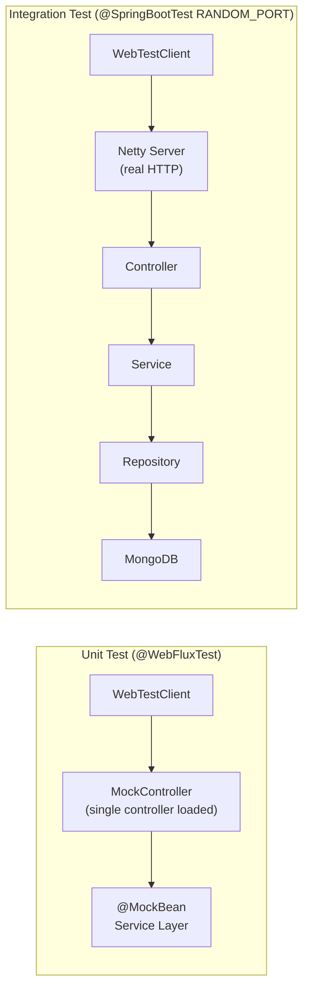
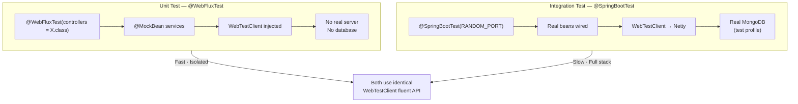
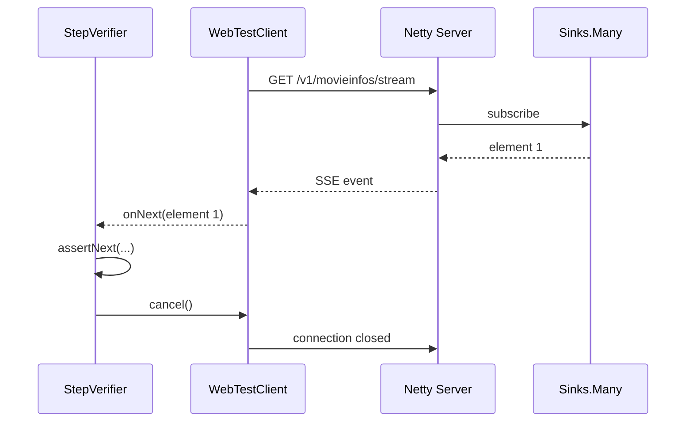

# Web Layer Testing — WebTestClient, MockMvc, and Endpoint Verification

**Date:** 2026-04-17 | **Updated:** 2026-04-17
**Tags:** `webtestclient` `mockmvc` `webflux` `testing` `spring-boot` `stepverifier` `rest-api`

## Table of Contents

- [Summary](#summary)
- [WebTestClient vs MockMvc](#webtestclient-vs-mockmvc)
- [WebTestClient Setup](#webtestclient-setup)
  - [Bound to Controller](#bound-to-controller)
  - [Bound to Router Function](#bound-to-router-function)
  - [Bound to Running Server](#bound-to-running-server)
  - [Project Patterns: Unit Test vs Integration Test](#project-patterns-unit-test-vs-integration-test)
- [WebTestClient Fluent API](#webtestclient-fluent-api)
  - [URI Construction](#uri-construction)
  - [Request Body](#request-body)
  - [The exchange() Call](#the-exchange-call)
- [Status Assertions](#status-assertions)
- [Body Assertions](#body-assertions)
  - [expectBody(Class) with isEqualTo and jsonPath](#expectbodyclass-with-isequalto-and-jsonpath)
  - [expectBodyList(Class) with hasSize and contains](#expectbodylistclass-with-hassize-and-contains)
  - [expectBody().jsonPath() — Raw JSON Assertions](#expectbodyjsonpath--raw-json-assertions)
  - [returnResult(Class) — StepVerifier on the Flux](#returnresultclass--stepverifier-on-the-flux)
  - [consumeWith — Custom Assertions](#consumewith--custom-assertions)
- [Testing Each HTTP Method](#testing-each-http-method)
  - [GET — List All](#get--list-all)
  - [GET — Single Resource by ID](#get--single-resource-by-id)
  - [GET — With Query Parameters](#get--with-query-parameters)
  - [POST — Create Resource (201 Created)](#post--create-resource-201-created)
  - [POST — Validation Error (400 Bad Request)](#post--validation-error-400-bad-request)
  - [PUT — Update Resource (200 OK)](#put--update-resource-200-ok)
  - [PUT — Not Found (404)](#put--not-found-404)
  - [DELETE — No Content (204)](#delete--no-content-204)
- [Testing Validation Errors](#testing-validation-errors)
- [Testing Streaming Endpoints](#testing-streaming-endpoints)
- [MockMvc — Servlet Stack](#mockmvc--servlet-stack)
  - [Basic MockMvc Pattern](#basic-mockmvc-pattern)
  - [MockMvcRequestBuilders and MockMvcResultMatchers](#mockmvcrequestbuilders-and-mockmvcresultmatchers)
- [@AutoConfigureJsonTesters — Serialization Testing](#autoconfigurejsontesters--serialization-testing)
- [Related](#related)
- [References](#references)

---

## Summary

`WebTestClient` is the reactive test client for Spring WebFlux. It provides a fluent API for building HTTP requests, executing them, and asserting on the response status, headers, and body. `MockMvc` is the servlet-stack equivalent for Spring MVC. Both test controllers without starting a real server by default, but `WebTestClient` can also target a live server when configured with `RANDOM_PORT`. In this project, all web layer tests use `WebTestClient` because the stack is fully reactive.



---

## WebTestClient vs MockMvc

| Aspect | WebTestClient | MockMvc |
|--------|--------------|---------|
| **Stack** | Reactive (WebFlux) | Servlet (Spring MVC) |
| **Setup annotation** | `@WebFluxTest` or `@SpringBootTest` | `@WebMvcTest` or `@SpringBootTest` |
| **Assertion style** | Fluent chain: `.expectStatus().isOk()` | ResultMatcher chain: `.andExpect(status().isOk())` |
| **Streaming support** | Yes — `.returnResult()` yields a `Flux` | No — response is always fully buffered |
| **Real server testing** | Yes — with `RANDOM_PORT` | No — always uses a mock servlet environment |
| **Request body** | `.bodyValue(obj)` or `.body(publisher, Class)` | `.content(json).contentType(APPLICATION_JSON)` |
| **Reactive type returns** | Native `Mono`/`Flux` handling | N/A — servlet model returns complete responses |
| **JSON path assertions** | `.expectBody().jsonPath("$.name")` | `.andExpect(jsonPath("$.name", is("value")))` |

**When to use which:**
- Use `WebTestClient` for any WebFlux application (this project).
- Use `MockMvc` for servlet-based Spring MVC applications.
- `WebTestClient` can also test servlet applications starting from Spring Boot 2.4+, but `MockMvc` remains the more common choice there.

---

## WebTestClient Setup

### Bound to Controller

Creates a lightweight test environment around a single controller with no `ApplicationContext`. Useful for pure unit testing when you want full control over dependencies:

```java
WebTestClient webTestClient = WebTestClient
    .bindToController(new MoviesInfoController(moviesInfoService))
    .build();
```

This approach requires you to construct the controller manually with its dependencies. No Spring annotations are needed.

### Bound to Router Function

For functional endpoints (`RouterFunction<ServerResponse>`), bind directly to the router:

```java
WebTestClient webTestClient = WebTestClient
    .bindToRouterFunction(reviewRouter.route(reviewsHandler))
    .build();
```

This mode tests the router function and handler together without loading any Spring context.

### Bound to Running Server

The most common integration test setup. Uses `@SpringBootTest` with `RANDOM_PORT` to start a real Netty server, then `@AutoConfigureWebTestClient` to inject a `WebTestClient` that points to it:

```java
@SpringBootTest(webEnvironment = SpringBootTest.WebEnvironment.RANDOM_PORT)
@ActiveProfiles("test")
@AutoConfigureWebTestClient
public class MovieInfoControllerIntgTest {

    @Autowired
    private WebTestClient webTestClient;
}
```

The `WebTestClient` is automatically configured with the base URL pointing to `http://localhost:{randomPort}`.

### Project Patterns: Unit Test vs Integration Test



**Unit test** (`@WebFluxTest`): loads only the specified controller and WebFlux infrastructure. Services are replaced with `@MockBean`. No server, no database.

**Integration test** (`@SpringBootTest` + `RANDOM_PORT`): loads the full application context, starts a real Netty server, and connects to a real (or embedded) database. The `WebTestClient` API is identical in both modes.

---

## WebTestClient Fluent API

The full request-response chain follows a consistent pattern:

```java
webTestClient
    .get().uri("/v1/movieinfos")          // 1. HTTP method + URI
    .header("Accept", "application/json") // 2. Optional headers
    .exchange()                           // 3. Execute request
    .expectStatus().isOk()                // 4. Status assertion
    .expectHeader().contentType(...)      // 5. Header assertion
    .expectBodyList(MovieInfo.class)      // 6. Body assertion
    .hasSize(3);                          // 7. Collection size
```

### URI Construction

**Simple path:**

```java
.get().uri("/v1/movieinfos")
```

**Path variables** — pass them as varargs after the template:

```java
.get().uri("/v1/movieinfos/{id}", "abc")
```

**Query parameters with `UriComponentsBuilder`:**

```java
var uri = UriComponentsBuilder.fromUriString("/v1/movieinfos")
    .queryParam("year", 2005)
    .buildAndExpand().toUri();

webTestClient.get().uri(uri)
```

**Query parameters with a lambda `UriBuilder`:**

```java
.get().uri(uriBuilder -> uriBuilder
    .path("/v1/reviews")
    .queryParam("movieInfoId", "1")
    .build())
```

### Request Body

**`.bodyValue(object)`** — for simple objects serialized to JSON:

```java
.post().uri("/v1/movieinfos")
    .bodyValue(movieInfo)
    .exchange()
```

**`.body(Publisher, Class)`** — for streaming a reactive publisher as the request body:

```java
.post().uri("/v1/movieinfos")
    .body(Mono.just(movieInfo), MovieInfo.class)
    .exchange()
```

For most controller tests, `.bodyValue()` is sufficient.

### The exchange() Call

`.exchange()` executes the HTTP request and returns an `ExchangeResult` wrapper. All subsequent assertions (`.expectStatus()`, `.expectBody()`, etc.) operate on this result. No assertion runs until `.exchange()` is called.

---

## Status Assertions

All status assertions are accessed through `.expectStatus()`:

| Assertion | HTTP Status | Typical Use Case |
|-----------|-------------|------------------|
| `.isOk()` | 200 | GET success, PUT success |
| `.isCreated()` | 201 | POST success |
| `.isNoContent()` | 204 | DELETE success |
| `.isNotFound()` | 404 | Resource does not exist |
| `.isBadRequest()` | 400 | Validation failure |
| `.is2xxSuccessful()` | 2xx range | Any success (less specific) |
| `.is4xxClientError()` | 4xx range | Any client error |
| `.is5xxServerError()` | 5xx range | Any server error |
| `.isEqualTo(HttpStatus.CONFLICT)` | Any specific code | Custom status codes |

The project most commonly uses `.is2xxSuccessful()`, `.isCreated()`, `.isNotFound()`, `.isBadRequest()`, and `.isNoContent()`.

---

## Body Assertions

### expectBody(Class) with isEqualTo and jsonPath

Deserialize the response body into a single object and assert on it:

```java
.expectBody(MovieInfo.class)
    .isEqualTo(expectedMovieInfo);
```

Or use `jsonPath` on the deserialized body for specific fields:

```java
.expectBody(MovieInfo.class)
    .consumeWith(result -> {
        var movieInfo = result.getResponseBody();
        assert movieInfo != null;
        assertEquals("Dark Knight Rises", movieInfo.getName());
    });
```

### expectBodyList(Class) with hasSize and contains

For endpoints that return a collection:

```java
.expectBodyList(MovieInfo.class)
    .hasSize(3);
```

With a value callback for richer assertions:

```java
.expectBodyList(Review.class)
    .value(reviews -> {
        assertEquals(3, reviews.size());
    });
```

### expectBody().jsonPath() -- Raw JSON Assertions

Assert directly on the raw JSON without deserializing to a class:

```java
.expectBody()
    .jsonPath("$.name").isEqualTo("Dark Knight Rises");
```

This is useful when you only need to verify a few fields and do not want to construct a full expected object.

### returnResult(Class) -- StepVerifier on the Flux

Extract the response body as a `Flux` for reactive assertions. Essential for streaming endpoints:

```java
var flux = webTestClient
    .get()
    .uri("/flux")
    .exchange()
    .expectStatus().is2xxSuccessful()
    .returnResult(Integer.class)
    .getResponseBody();

StepVerifier.create(flux)
    .expectNext(1, 2, 3)
    .verifyComplete();
```

### consumeWith -- Custom Assertions

Access the full `EntityExchangeResult` for arbitrary logic:

```java
.expectBody(MovieInfo.class)
    .consumeWith(movieInfoEntityExchangeResult -> {
        var savedMovieInfo = movieInfoEntityExchangeResult.getResponseBody();
        assert Objects.requireNonNull(savedMovieInfo).getMovieInfoId() != null;
    });
```

This is the project's most common pattern for POST and PUT assertions where the returned entity needs multiple field checks.

---

## Testing Each HTTP Method

### GET -- List All

```java
@Test
void getAllMovieInfos() {
    webTestClient
        .get()
        .uri(MOVIES_INFO_URL)
        .exchange()
        .expectStatus().is2xxSuccessful()
        .expectBodyList(MovieInfo.class)
        .hasSize(3);
}
```

In unit tests, stub the service first:

```java
when(moviesInfoServiceMock.getAllMovieInfos())
    .thenReturn(Flux.fromIterable(movieInfos));
```

### GET -- Single Resource by ID

```java
@Test
void getMovieInfoById() {
    var id = "abc";
    webTestClient
        .get()
        .uri(MOVIES_INFO_URL + "/{id}", id)
        .exchange()
        .expectStatus().is2xxSuccessful()
        .expectBody()
        .jsonPath("$.name").isEqualTo("Dark Knight Rises");
}
```

### GET -- With Query Parameters

Using `UriComponentsBuilder`:

```java
@Test
void getMovieInfoByYear() {
    var uri = UriComponentsBuilder.fromUriString(MOVIES_INFO_URL)
        .queryParam("year", 2005)
        .buildAndExpand().toUri();

    webTestClient
        .get()
        .uri(uri)
        .exchange()
        .expectStatus().is2xxSuccessful()
        .expectBodyList(MovieInfo.class)
        .hasSize(1);
}
```

Using the lambda `uriBuilder` (review service pattern):

```java
@Test
void getReviewsByMovieInfoId() {
    webTestClient
        .get()
        .uri(uriBuilder -> uriBuilder
            .path(REVIEWS_URL)
            .queryParam("movieInfoId", "1")
            .build())
        .exchange()
        .expectStatus().is2xxSuccessful()
        .expectBodyList(Review.class)
        .value(reviewList -> {
            assertEquals(2, reviewList.size());
        });
}
```

### POST -- Create Resource (201 Created)

```java
@Test
void addNewMovieInfo() {
    var movieInfo = new MovieInfo(null, "Batman Begins",
        2005, List.of("Christian Bale", "Michael Cane"),
        LocalDate.parse("2005-06-15"));

    webTestClient
        .post()
        .uri(MOVIES_INFO_URL)
        .bodyValue(movieInfo)
        .exchange()
        .expectStatus().isCreated()
        .expectBody(MovieInfo.class)
        .consumeWith(result -> {
            var saved = result.getResponseBody();
            assert Objects.requireNonNull(saved).getMovieInfoId() != null;
        });
}
```

In unit tests, stub the save operation:

```java
when(moviesInfoServiceMock.addMovieInfo(isA(MovieInfo.class)))
    .thenReturn(Mono.just(new MovieInfo("mockId", "Batman Begins",
        2005, List.of("Christian Bale", "Michael Cane"),
        LocalDate.parse("2005-06-15"))));
```

### POST -- Validation Error (400 Bad Request)

```java
@Test
void addNewMovieInfo_validation() {
    var movieInfo = new MovieInfo(null, "",
        -2005, List.of(""), LocalDate.parse("2005-06-15"));

    webTestClient
        .post()
        .uri(MOVIES_INFO_URL)
        .bodyValue(movieInfo)
        .exchange()
        .expectStatus().isBadRequest()
        .expectBody(String.class)
        .consumeWith(result -> {
            var error = result.getResponseBody();
            assert error != null;
            String expectedErrorMessage =
                "movieInfo.cast must be present,"
                + "movieInfo.name must be present,"
                + "movieInfo.year must be a Positive Value";
            assertEquals(expectedErrorMessage, error);
        });
}
```

### PUT -- Update Resource (200 OK)

```java
@Test
void updateMovieInfo() {
    var id = "abc";
    var updated = new MovieInfo("abc", "Dark Knight Rises 1",
        2013, List.of("Christian Bale1", "Tom Hardy1"),
        LocalDate.parse("2012-07-20"));

    webTestClient
        .put()
        .uri(MOVIES_INFO_URL + "/{id}", id)
        .bodyValue(updated)
        .exchange()
        .expectStatus().is2xxSuccessful()
        .expectBody(MovieInfo.class)
        .consumeWith(result -> {
            var movieInfo = result.getResponseBody();
            assert movieInfo != null;
            assertEquals("Dark Knight Rises 1", movieInfo.getName());
        });
}
```

### PUT -- Not Found (404)

```java
@Test
void updateMovieInfo_notFound() {
    var id = "abc1";
    var updated = new MovieInfo("abc", "Dark Knight Rises 1",
        2013, List.of("Christian Bale1", "Tom Hardy1"),
        LocalDate.parse("2012-07-20"));

    webTestClient
        .put()
        .uri(MOVIES_INFO_URL + "/{id}", id)
        .bodyValue(updated)
        .exchange()
        .expectStatus().isNotFound();
}
```

In unit tests, return `Mono.empty()` from the mock to trigger the not-found path:

```java
when(moviesInfoServiceMock.updateMovieInfo(isA(MovieInfo.class), isA(String.class)))
    .thenReturn(Mono.empty());
```

### DELETE -- No Content (204)

```java
@Test
void deleteMovieInfoById() {
    var id = "abc";

    webTestClient
        .delete()
        .uri(MOVIES_INFO_URL + "/{id}", id)
        .exchange()
        .expectStatus().isNoContent();
}
```

---

## Testing Validation Errors

The project uses Bean Validation (`@NotBlank`, `@Positive`, custom validators) and a global error handler that returns validation messages as a plain string body.

**Pattern for annotated controllers:**

```java
// Send invalid data
var invalidMovie = new MovieInfo(null, "", -2005, List.of(""),
    LocalDate.parse("2005-06-15"));

webTestClient
    .post()
    .uri(MOVIES_INFO_URL)
    .bodyValue(invalidMovie)
    .exchange()
    .expectStatus().isBadRequest()
    .expectBody(String.class)
    .consumeWith(result -> {
        var error = result.getResponseBody();
        assert error != null;
        // The project concatenates validation messages with commas
        assertEquals(
            "movieInfo.cast must be present,"
            + "movieInfo.name must be present,"
            + "movieInfo.year must be a Positive Value",
            error);
    });
```

**Pattern for functional endpoints (review service):**

```java
var invalidReview = new Review(null, null, "Awesome Movie", -9.0);

webTestClient
    .post()
    .uri("/v1/reviews")
    .bodyValue(invalidReview)
    .exchange()
    .expectStatus().isBadRequest()
    .expectBody(String.class)
    .isEqualTo("rating.movieInfoId : must not be null, "
        + "rating.negative : please pass a non-negative value");
```

The functional endpoint uses a custom `ReviewValidator` rather than `@Valid`, but the test approach is the same: send invalid data, expect 400, assert on the error message.

---

## Testing Streaming Endpoints

Streaming endpoints (SSE or infinite `Flux`) require a different assertion approach because the response never completes on its own. Use `.returnResult()` to get the response body as a `Flux`, then assert with `StepVerifier` and cancel after verifying enough elements.

```java
@Test
void getAllMovieInfos_Stream() {
    // First, create a resource so the stream has something to emit
    var movieInfo = new MovieInfo(null, "Batman Begins",
        2005, List.of("Christian Bale", "Michael Cane"),
        LocalDate.parse("2005-06-15"));

    webTestClient
        .post()
        .uri(MOVIES_INFO_URL)
        .bodyValue(movieInfo)
        .exchange()
        .expectStatus().isCreated();

    // Then consume the stream
    var moviesStreamFlux = webTestClient
        .get()
        .uri(MOVIES_INFO_URL + "/stream")
        .exchange()
        .expectStatus().is2xxSuccessful()
        .returnResult(MovieInfo.class)
        .getResponseBody();

    StepVerifier.create(moviesStreamFlux)
        .assertNext(movie -> {
            assert movie.getMovieInfoId() != null;
        })
        .thenCancel()   // cancel the infinite stream
        .verify();
}
```

Key points:
- `.returnResult(MovieInfo.class).getResponseBody()` returns a `Flux<MovieInfo>` that you can subscribe to reactively.
- `.thenCancel()` is essential for infinite streams (SSE, Sinks-based endpoints). Without it, the test hangs forever waiting for `onComplete`.
- `.verifyComplete()` should only be used for finite streams that actually complete.



---

## MockMvc -- Servlet Stack

While this project uses WebFlux exclusively, understanding `MockMvc` is valuable for projects on the servlet stack or when maintaining hybrid codebases.

### Basic MockMvc Pattern

```java
@WebMvcTest(controllers = MovieController.class)
class MovieControllerTest {

    @Autowired
    private MockMvc mockMvc;

    @MockBean
    private MovieService movieService;

    @Test
    void getAllMovies() throws Exception {
        var movies = List.of(
            new Movie(1L, "Batman Begins"),
            new Movie(2L, "The Dark Knight"),
            new Movie(3L, "Dark Knight Rises"));

        when(movieService.findAll()).thenReturn(movies);

        mockMvc.perform(get("/api/movies")
                .accept(MediaType.APPLICATION_JSON))
            .andExpect(status().isOk())
            .andExpect(content().contentType(MediaType.APPLICATION_JSON))
            .andExpect(jsonPath("$", hasSize(3)))
            .andExpect(jsonPath("$[0].name", is("Batman Begins")));
    }

    @Test
    void createMovie() throws Exception {
        var movie = new Movie(null, "Inception");
        var saved = new Movie(1L, "Inception");

        when(movieService.save(any(Movie.class))).thenReturn(saved);

        mockMvc.perform(post("/api/movies")
                .contentType(MediaType.APPLICATION_JSON)
                .content("{\"name\": \"Inception\"}"))
            .andExpect(status().isCreated())
            .andExpect(jsonPath("$.id", is(1)))
            .andExpect(jsonPath("$.name", is("Inception")));
    }
}
```

### MockMvcRequestBuilders and MockMvcResultMatchers

| MockMvcRequestBuilders | Purpose |
|----------------------|---------|
| `get(url)` | Build a GET request |
| `post(url)` | Build a POST request |
| `put(url)` | Build a PUT request |
| `delete(url)` | Build a DELETE request |
| `.content(body)` | Set the request body |
| `.contentType(type)` | Set Content-Type header |
| `.accept(type)` | Set Accept header |
| `.param(name, value)` | Add a query/form parameter |

| MockMvcResultMatchers | Purpose |
|----------------------|---------|
| `status().isOk()` | Assert 200 |
| `status().isCreated()` | Assert 201 |
| `content().contentType(...)` | Assert Content-Type header |
| `jsonPath("$.field", is(val))` | Assert a JSON field value |
| `jsonPath("$", hasSize(n))` | Assert array size |

The `ResultActions` chain: `mockMvc.perform(request)` returns `ResultActions`, which supports `.andExpect()` for assertions, `.andDo(print())` for debugging output, and `.andReturn()` for accessing the raw `MvcResult`.

---

## @AutoConfigureJsonTesters -- Serialization Testing

`@JsonTest` loads only the Jackson auto-configuration, giving you `JacksonTester` beans for testing JSON serialization and deserialization in isolation:

```java
@JsonTest
class MovieInfoJsonTest {

    @Autowired
    private JacksonTester<MovieInfo> json;

    @Test
    void serialize() throws Exception {
        var movieInfo = new MovieInfo("abc", "Dark Knight Rises",
            2012, List.of("Christian Bale", "Tom Hardy"),
            LocalDate.parse("2012-07-20"));

        assertThat(json.write(movieInfo))
            .hasJsonPathStringValue("$.name")
            .extractingJsonPathStringValue("$.name")
            .isEqualTo("Dark Knight Rises");
    }

    @Test
    void deserialize() throws Exception {
        String content = """
            {
                "movieInfoId": "abc",
                "name": "Dark Knight Rises",
                "year": 2012,
                "cast": ["Christian Bale", "Tom Hardy"],
                "release_date": "2012-07-20"
            }
            """;

        assertThat(json.parse(content))
            .isEqualTo(new MovieInfo("abc", "Dark Knight Rises",
                2012, List.of("Christian Bale", "Tom Hardy"),
                LocalDate.parse("2012-07-20")));
    }
}
```

Alternatively, `@AutoConfigureJsonTesters` can be added to a `@WebFluxTest` or `@WebMvcTest` to make `JacksonTester` available alongside the web layer test — useful when you want to verify both the endpoint behavior and the JSON shape in the same test class.

---

## Related

- [Spring Boot Testing Fundamentals](spring-boot-test-basics.md) -- `@SpringBootTest`, test slices, `@MockBean`, `StepVerifier`, and context caching
- [Testcontainers](testcontainers.md) -- running real MongoDB and other services in Docker for integration tests
- [REST Controller Patterns](../web-layer/rest-controller-patterns.md) -- annotated vs functional controller design that these tests exercise

## References

- [WebTestClient -- Spring Framework Reference](https://docs.spring.io/spring-framework/reference/testing/webtestclient.html) -- setup modes, fluent API, assertion reference
- [Testing Spring WebFlux -- Spring Boot Reference](https://docs.spring.io/spring-boot/reference/testing/spring-boot-applications.html#testing.spring-boot-applications.spring-webflux-tests) -- `@WebFluxTest`, `@AutoConfigureWebTestClient`
- [MockMvc -- Spring Framework Reference](https://docs.spring.io/spring-framework/reference/testing/spring-mvc-test-framework.html) -- MockMvcRequestBuilders, ResultMatchers, ResultActions
- [StepVerifier -- Reactor Test](https://projectreactor.io/docs/core/release/reference/#testing) -- reactive stream assertions with `thenCancel`, `verifyComplete`, `assertNext`
- [JacksonTester -- Spring Boot Reference](https://docs.spring.io/spring-boot/reference/testing/spring-boot-applications.html#testing.spring-boot-applications.json-tests) -- `@JsonTest` and `@AutoConfigureJsonTesters`
- [UriComponentsBuilder -- Spring Framework Javadoc](https://docs.spring.io/spring-framework/docs/current/javadoc-api/org/springframework/web/util/UriComponentsBuilder.html) -- building URIs with path variables and query parameters
