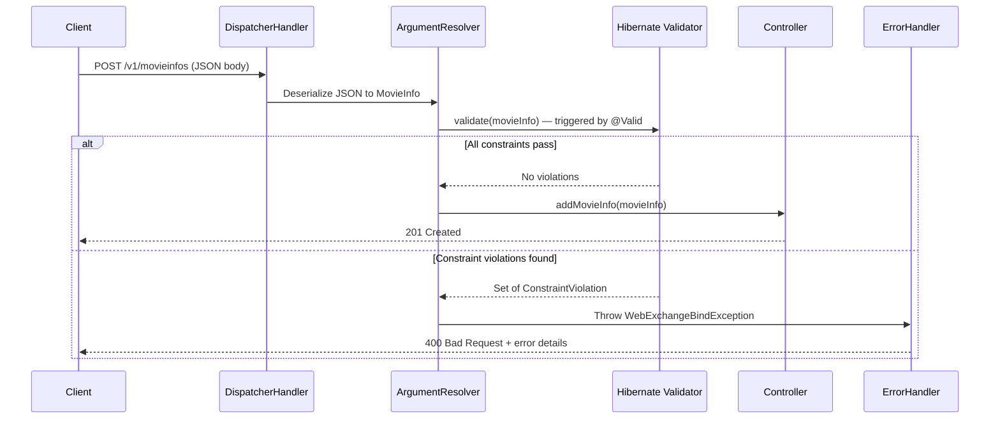
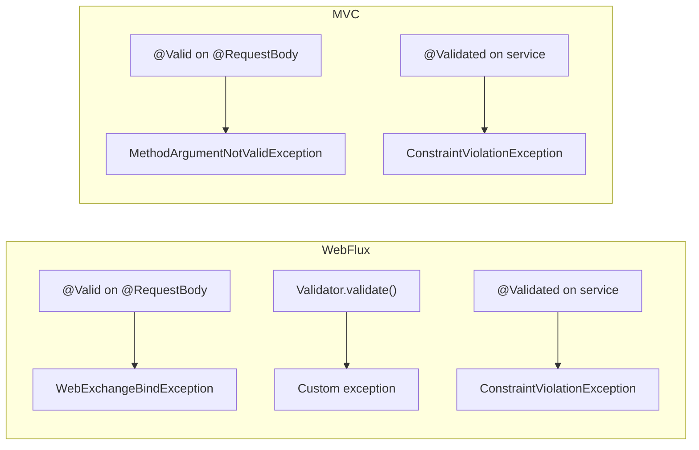

# Jakarta Validation in Spring Boot

**Date:** 2026-04-17 | **Updated:** 2026-04-17
**Tags:** `jakarta-validation` `bean-validation` `spring-boot` `validation` `webflux` `constraints`

## Table of Contents

- [Summary](#summary)
- [How Bean Validation Works in Spring](#how-bean-validation-works-in-spring)
- [Standard Constraint Annotations](#standard-constraint-annotations)
- [@Valid vs @Validated](#valid-vs-validated)
- [Applying Validation in the Controller](#applying-validation-in-the-controller)
- [Validation on Domain Objects](#validation-on-domain-objects)
- [Validation Groups](#validation-groups)
- [Nested Object Validation](#nested-object-validation)
- [Custom Constraint Validators](#custom-constraint-validators)
- [Cross-Field Validation](#cross-field-validation)
- [Service-Layer Validation](#service-layer-validation)
- [Manual Validation](#manual-validation)
- [Reactive vs Servlet Differences](#reactive-vs-servlet-differences)
- [Related](#related)
- [References](#references)

---

## Summary

Jakarta Validation is the current Java validation specification for constraint-based object validation using annotations like `@NotNull`, `@Size`, and `@Email`. In Spring Boot 3+, this is the `jakarta.validation` API, with Hibernate Validator as the default provider. Annotating a `@RequestBody` parameter with `@Valid` triggers constraint evaluation before your handler code runs, and constraint violations propagate as exceptions that your global error handler can catch and translate into structured error responses.

**Dependency (Maven):**

```xml
<dependency>
    <groupId>org.springframework.boot</groupId>
    <artifactId>spring-boot-starter-validation</artifactId>
</dependency>
```

This starter pulls in Hibernate Validator and the Bean Validation API. No additional configuration is needed — Spring Boot auto-configures everything.

---

## How Bean Validation Works in Spring

When a request hits a Spring controller method annotated with `@Valid`, the framework intercepts the deserialized object and runs it through the Bean Validation provider before your business logic executes.



The key players:

1. **Argument resolver** — deserializes the request body and detects `@Valid` on the parameter.
2. **Hibernate Validator** — the reference implementation that evaluates every constraint annotation on the object graph.
3. **Exception propagation** — violations are wrapped in `WebExchangeBindException` (WebFlux) or `MethodArgumentNotValidException` (MVC) and thrown before the handler method body executes.

---

## Standard Constraint Annotations

In Spring Boot 3+, these annotations live in `jakarta.validation.constraints`. Older pre-Jakarta examples may use `javax.validation.constraints`.

| Annotation | Applies To | Description | Example |
|---|---|---|---|
| `@NotNull` | Any type | Must not be `null` | `@NotNull Integer year` |
| `@NotBlank` | `CharSequence` | Not null, not empty, not whitespace-only | `@NotBlank String name` |
| `@NotEmpty` | String, Collection, Map, Array | Not null and size > 0 | `@NotEmpty List<String> tags` |
| `@Size(min, max)` | String, Collection, Map, Array | Length/size within bounds | `@Size(min=2, max=100) String title` |
| `@Min(value)` | Numeric types | Value >= min | `@Min(0) Long rating` |
| `@Max(value)` | Numeric types | Value <= max | `@Max(10) Integer score` |
| `@Email` | `CharSequence` | Valid email format | `@Email String contact` |
| `@Pattern(regexp)` | `CharSequence` | Matches regex | `@Pattern(regexp="^[A-Z]{3}$") String code` |
| `@Positive` | Numeric types | Value > 0 | `@Positive Integer year` |
| `@PositiveOrZero` | Numeric types | Value >= 0 | `@PositiveOrZero BigDecimal balance` |
| `@Negative` | Numeric types | Value < 0 | `@Negative Integer offset` |
| `@Past` | Date/time types | Date in the past | `@Past LocalDate birthday` |
| `@Future` | Date/time types | Date in the future | `@Future LocalDate expiresAt` |
| `@PastOrPresent` | Date/time types | Date in the past or today | `@PastOrPresent LocalDate createdAt` |
| `@FutureOrPresent` | Date/time types | Date in the future or today | `@FutureOrPresent LocalDate startDate` |

Every annotation accepts a `message` attribute for custom error text:

```java
@NotBlank(message = "movieInfo.name must be provided")
private String name;
```

**Null-handling rule:** Most constraints (except `@NotNull`, `@NotBlank`, and `@NotEmpty`) treat `null` as valid. This is by design — each constraint validates one concern. If a field can be `null` and you also need range checking, stack `@NotNull` with the range constraint:

```java
@NotNull                                          // rejects null
@Positive(message = "year must be positive")      // rejects 0 and negative, passes null
private Integer year;
```

Without `@NotNull`, a `null` year would silently pass `@Positive`.

---

## @Valid vs @Validated

These two annotations look similar but serve different roles.

| Aspect | `@Valid` (Jakarta Validation) | `@Validated` (Spring) |
|---|---|---|
| Package | `jakarta.validation.Valid` | `org.springframework.validation.annotation.Validated` |
| Standard | Part of the Bean Validation spec | Spring-specific extension |
| Validation groups | Not supported | Supports group selection: `@Validated(OnCreate.class)` |
| Cascading (nested objects) | Triggers nested validation on fields | Does **not** trigger nested validation on fields |
| Placement | Parameters, fields, return types | Class-level or method parameters |

**Use `@Valid`** on method parameters and on fields to trigger nested validation. **Use `@Validated`** at the class level (on service beans) or on method parameters when you need validation groups.

```java
// @Valid — standard cascade, no groups
@PostMapping("/movieinfos")
public Mono<MovieInfo> addMovieInfo(@RequestBody @Valid MovieInfo movieInfo) { ... }

// @Validated — with groups
@PostMapping("/movieinfos")
public Mono<MovieInfo> addMovieInfo(
        @RequestBody @Validated(OnCreate.class) MovieInfo movieInfo) { ... }
```

---

## Applying Validation in the Controller

This is the pattern used in the project's `MoviesInfoController`:

```java
@RestController
@RequestMapping("/v1")
public class MoviesInfoController {

    private final MoviesInfoService moviesInfoService;

    public MoviesInfoController(MoviesInfoService moviesInfoService) {
        this.moviesInfoService = moviesInfoService;
    }

    @PostMapping("/movieinfos")
    @ResponseStatus(HttpStatus.CREATED)
    public Mono<MovieInfo> addMovieInfo(@RequestBody @Valid MovieInfo movieInfo) {
        return moviesInfoService.addMovieInfo(movieInfo);
    }
}
```

**What happens on valid input:** The JSON body is deserialized into `MovieInfo`, all constraints pass, the method body executes, and the response returns `201 Created`.

**What happens on invalid input:** Hibernate Validator finds violations, Spring wraps them in `WebExchangeBindException`, and the method body **never executes**. The default error handler returns a `400 Bad Request` with field-level error details.

In **WebFlux**, validation failure throws `WebExchangeBindException`. In **MVC**, it throws `MethodArgumentNotValidException`. Both carry the same `BindingResult` with field errors, but the exception type matters when writing a `@ControllerAdvice` handler.

**Example error response** (default Spring Boot behavior for invalid input):

```json
{
  "timestamp": "2026-04-17T10:30:00.000+00:00",
  "path": "/v1/movieinfos",
  "status": 400,
  "error": "Bad Request",
  "message": "Validation failed for argument at index 0 in method: ...",
  "errors": [
    {
      "field": "name",
      "rejectedValue": "",
      "defaultMessage": "movieInfo.name must be provided"
    },
    {
      "field": "year",
      "rejectedValue": -5,
      "defaultMessage": "movieInfo.year must be a Positive value"
    }
  ]
}
```

Most projects customize this shape in a `@ControllerAdvice` to return a cleaner structure.

---

## Validation on Domain Objects

The project's `MovieInfo` entity demonstrates annotation-based validation at the domain level:

```java
@Data
@NoArgsConstructor
@AllArgsConstructor
@Document
public class MovieInfo {

    @Id
    private String movieInfoId;

    @NotBlank(message = "movieInfo.name must be provided")
    private String name;

    @NotNull
    @Positive(message = "movieInfo.year must be a Positive value")
    private Integer year;

    @NotNull
    private List<@NotBlank(message = "movieInfo.cast must be provided") String> cast;

    private LocalDate release_date;
}
```

Key observations:

- **Stacking constraints** — `year` has both `@NotNull` and `@Positive`. They evaluate independently; `@Positive` alone would pass on `null` (constraints skip null by default except `@NotNull`).
- **Collection element validation** — `List<@NotBlank String>` applies the constraint to each element in the list, not the list itself. If any single `cast` entry is blank, that element fails validation. This is a JSR 380 feature (type-use annotations) added in Bean Validation 2.0.
- **Custom messages** — each annotation carries a `message` attribute so error responses are human-readable and specific.

### Why @NotNull on a Collection Matters

Without `@NotNull` on the `cast` field, passing `"cast": null` in the JSON body would bypass the `@NotBlank` element constraint entirely since there are no elements to validate. Always pair `@NotNull` on the collection with element-level constraints.

---

## Validation Groups

Groups let you apply different validation rules depending on the operation (create, update, patch).

**Step 1 — Define group marker interfaces:**

```java
public interface OnCreate {}
public interface OnUpdate {}
```

**Step 2 — Assign constraints to groups:**

```java
@Data
public class MovieInfo {

    @Null(groups = OnCreate.class, message = "id must be null on create")
    @NotNull(groups = OnUpdate.class, message = "id is required on update")
    private String movieInfoId;

    @NotBlank(message = "movieInfo.name must be provided")
    private String name;

    @NotNull
    @Positive(message = "movieInfo.year must be a Positive value")
    private Integer year;
}
```

Constraints without an explicit `groups` attribute belong to the `Default` group.

**Step 3 — Activate a group at the controller:**

```java
@PostMapping("/movieinfos")
@ResponseStatus(HttpStatus.CREATED)
public Mono<MovieInfo> addMovieInfo(
        @RequestBody @Validated(OnCreate.class) MovieInfo movieInfo) {
    return moviesInfoService.addMovieInfo(movieInfo);
}

@PutMapping("/movieinfos/{id}")
public Mono<MovieInfo> updateMovieInfo(
        @RequestBody @Validated(OnUpdate.class) MovieInfo movieInfo,
        @PathVariable String id) {
    return moviesInfoService.updateMovieInfo(movieInfo, id);
}
```

Note: `@Validated` (Spring) is required here because `@Valid` (JSR) has no mechanism for specifying groups.

To also run `Default` group constraints alongside a named group, extend the marker interface:

```java
public interface OnCreate extends Default {}
```

**Ordered validation with `@GroupSequence`:** If you need constraints to run in a specific order (for example, check `@NotNull` before `@Pattern`), define a sequence:

```java
@GroupSequence({BasicChecks.class, FormatChecks.class, BusinessChecks.class})
public interface OrderedChecks {}
```

Validation stops at the first group that produces a violation, preventing noisy cascading errors.

---

## Nested Object Validation

When a domain object contains another object that also has constraints, add `@Valid` on the field to cascade validation into the child:

```java
@Data
public class MovieRequest {

    @Valid
    @NotNull
    private MovieInfo movieInfo;

    @Valid
    @NotNull
    private Director director;
}

@Data
public class Director {
    @NotBlank(message = "director.name must be provided")
    private String name;

    @Past(message = "director.birthDate must be in the past")
    private LocalDate birthDate;
}
```

Without `@Valid` on the `director` field, the `Director` object is treated as opaque and its `@NotBlank`/`@Past` constraints are never evaluated. The `@Valid` annotation is the trigger for recursive descent.

This cascading applies to:
- Direct object fields (`@Valid Director director`)
- Collections of objects (`@Valid List<Director> directors`)
- Map values (`Map<String, @Valid Director> directorMap`)

---

## Custom Constraint Validators

When standard annotations are insufficient, write your own.

**Step 1 — Define the annotation:**

```java
@Documented
@Constraint(validatedBy = ValidReleaseYearValidator.class)
@Target({ElementType.FIELD, ElementType.PARAMETER})
@Retention(RetentionPolicy.RUNTIME)
public @interface ValidReleaseYear {
    String message() default "Release year must be between 1888 and current year";
    Class<?>[] groups() default {};
    Class<? extends Payload>[] payload() default {};
}
```

The `groups()` and `payload()` attributes are required by the spec.

**Step 2 — Implement the validator:**

```java
public class ValidReleaseYearValidator implements ConstraintValidator<ValidReleaseYear, Integer> {

    private static final int FIRST_FILM_YEAR = 1888;

    @Override
    public boolean isValid(Integer year, ConstraintValidatorContext context) {
        if (year == null) {
            return true; // let @NotNull handle null checks
        }
        int currentYear = Year.now().getValue();
        return year >= FIRST_FILM_YEAR && year <= currentYear;
    }
}
```

Returning `true` for `null` is a best practice: each constraint should validate one concern, and null-checking is the job of `@NotNull`.

**Step 3 — Use it:**

```java
@ValidReleaseYear
@NotNull
private Integer year;
```

Custom validators are automatically discovered by Hibernate Validator. If your validator needs Spring beans (for example a repository lookup), register it as a Spring bean and Hibernate Validator's `SpringConstraintValidatorFactory` handles injection.

---

## Cross-Field Validation

Class-level constraints validate relationships between multiple fields on the same object.

**Step 1 — Define a class-level annotation:**

```java
@Documented
@Constraint(validatedBy = ReleaseDateAfterYearValidator.class)
@Target(ElementType.TYPE)
@Retention(RetentionPolicy.RUNTIME)
public @interface ReleaseDateConsistentWithYear {
    String message() default "release_date must fall within the specified year";
    Class<?>[] groups() default {};
    Class<? extends Payload>[] payload() default {};
}
```

**Step 2 — Implement the class-level validator:**

```java
public class ReleaseDateAfterYearValidator
        implements ConstraintValidator<ReleaseDateConsistentWithYear, MovieInfo> {

    @Override
    public boolean isValid(MovieInfo movieInfo, ConstraintValidatorContext context) {
        if (movieInfo.getYear() == null || movieInfo.getRelease_date() == null) {
            return true;
        }
        return movieInfo.getRelease_date().getYear() == movieInfo.getYear();
    }
}
```

**Step 3 — Apply to the class:**

```java
@ReleaseDateConsistentWithYear
@Data
public class MovieInfo {
    private Integer year;
    private LocalDate release_date;
    // ...
}
```

Cross-field validators receive the entire object, so they can access any combination of fields. The error message attaches to the class level by default; use `context.buildConstraintViolationWithTemplate(...)` to associate it with a specific field:

```java
@Override
public boolean isValid(MovieInfo movieInfo, ConstraintValidatorContext context) {
    if (movieInfo.getYear() == null || movieInfo.getRelease_date() == null) {
        return true;
    }
    if (movieInfo.getRelease_date().getYear() != movieInfo.getYear()) {
        context.disableDefaultConstraintViolation();
        context.buildConstraintViolationWithTemplate("release_date year does not match year field")
               .addPropertyNode("release_date")
               .addConstraintViolation();
        return false;
    }
    return true;
}
```

This makes the violation appear as a field-level error on `release_date` rather than a class-level error, which is more useful for client-side form rendering.

---

## Service-Layer Validation

Validation is not limited to controllers. Adding `@Validated` to a service class enables method-level validation via Spring AOP.

```java
@Service
@Validated
public class MoviesInfoService {

    public MovieInfo addMovieInfo(@Valid MovieInfo movieInfo) {
        // constraints are checked before this body executes
        return movieInfoRepository.save(movieInfo);
    }

    public MovieInfo findByYear(@Min(1888) Integer year) {
        return movieInfoRepository.findByYear(year);
    }
}
```

How it works:

1. `@Validated` on the class triggers Spring's `MethodValidationPostProcessor`, a `BeanPostProcessor` that wraps the bean in an AOP proxy.
2. The proxy intercepts method calls and runs Bean Validation on parameters annotated with `@Valid` or constraint annotations.
3. If validation fails, a `ConstraintViolationException` is thrown (not `WebExchangeBindException`). This is a different exception type than controller-level failures.

This is useful for enforcing invariants at the service boundary regardless of how the service is called (controller, scheduler, event listener, or test).

---

## Manual Validation

When using Spring WebFlux's functional endpoints (router functions), there is no annotation-driven argument resolution. You must validate manually by injecting `jakarta.validation.Validator`.

This is the pattern from the project's `ReviewsHandler`:

```java
@Component
public class ReviewsHandler {

    @Autowired
    private Validator validator;

    public Mono<ServerResponse> addReview(ServerRequest serverRequest) {
        return serverRequest.bodyToMono(Review.class)
                .doOnNext(this::validate)
                .flatMap(review -> reviewReactiveRepository.save(review))
                .flatMap(savedReview ->
                        ServerResponse.status(HttpStatus.CREATED)
                                .bodyValue(savedReview));
    }

    private void validate(Review review) {
        var constraintViolations = validator.validate(review);
        if (constraintViolations.size() > 0) {
            var errorMessage = constraintViolations.stream()
                    .map(ConstraintViolation::getMessage)
                    .sorted()
                    .collect(Collectors.joining(", "));
            throw new ReviewDataException(errorMessage);
        }
    }
}
```

Key points:

- **`validator.validate(review)`** returns a `Set<ConstraintViolation<Review>>`. An empty set means valid.
- **Manual error extraction** — constraint messages are collected, sorted, and joined into a single string.
- **Custom exception** — `ReviewDataException` is thrown (a project-specific exception), not the standard `WebExchangeBindException`. Your `@ControllerAdvice` or error handler must handle it.
- **Why `doOnNext` and not `flatMap`?** — `doOnNext` is a side-effect operator. The validation either passes silently or throws synchronously, which Reactor converts into an error signal on the Mono pipeline.

You can also use manual validation in non-web contexts (batch jobs, message consumers) by injecting the `Validator` bean anywhere.

---

## Reactive vs Servlet Differences

| Aspect | Spring WebFlux (Reactive) | Spring MVC (Servlet) |
|---|---|---|
| **Exception on `@Valid` failure** | `WebExchangeBindException` | `MethodArgumentNotValidException` |
| **Exception parent class** | Extends `ServerWebInputException` | Extends `BindException` |
| **Error handler annotation** | `@ExceptionHandler(WebExchangeBindException.class)` | `@ExceptionHandler(MethodArgumentNotValidException.class)` |
| **Functional endpoints** | Manual validation via `Validator.validate()` | Not applicable (no functional routing in MVC) |
| **Service-layer exception** | `ConstraintViolationException` (same) | `ConstraintViolationException` (same) |
| **Default error response** | JSON with `status`, `errors`, timestamp | JSON with `status`, `errors`, timestamp |
| **Binding result access** | `ex.getBindingResult().getFieldErrors()` | `ex.getBindingResult().getFieldErrors()` |



When migrating between WebFlux and MVC, the key refactoring point is the `@ControllerAdvice` exception handler: swap the caught exception type and adjust the error extraction accordingly. Service-layer validation with `@Validated` produces the same `ConstraintViolationException` in both stacks.

---

## Related

- [Exception Handling](exception-handling.md) — how to build `@ControllerAdvice` handlers for `WebExchangeBindException` and `ConstraintViolationException`
- [REST Controller Patterns](../web-layer/rest-controller-patterns.md) — controller structure, `@RequestBody`, `@ResponseStatus`, and request lifecycle
- [Spring Fundamentals](../spring-fundamentals.md) — IoC, DI, AOP, and how `BeanPostProcessor` enables service-layer validation

## References

- [Jakarta Bean Validation Specification](https://jakarta.ee/specifications/bean-validation/3.0/) — the spec defining constraint annotations, `Validator` API, and constraint composition
- [Spring Framework — Validation](https://docs.spring.io/spring-framework/reference/core/validation/beanvalidation.html) — how Spring integrates with the Bean Validation API
- [Spring Boot — Validation Starter](https://docs.spring.io/spring-boot/reference/io/validation.html) — auto-configuration of Hibernate Validator and the `spring-boot-starter-validation` dependency
- [Hibernate Validator Reference](https://docs.jboss.org/hibernate/stable/validator/reference/en-US/html_single/) — the reference implementation with additional constraints and programmatic API
