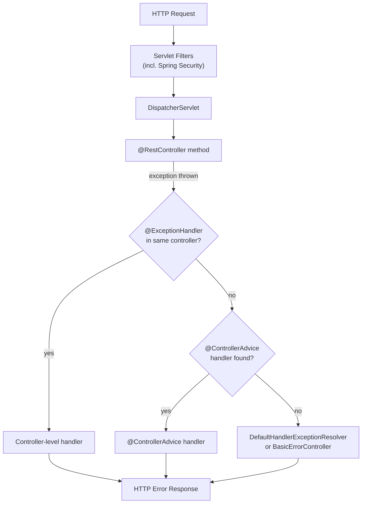
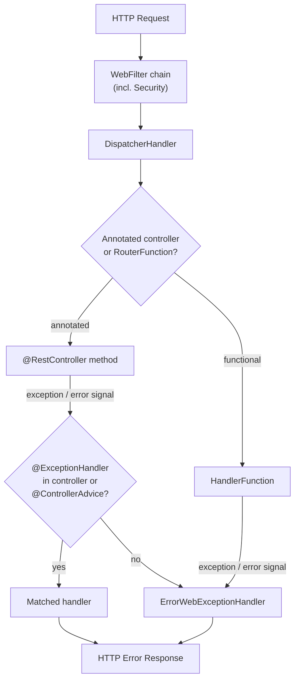
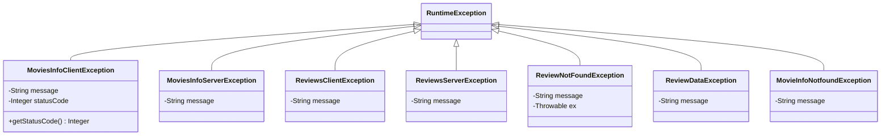
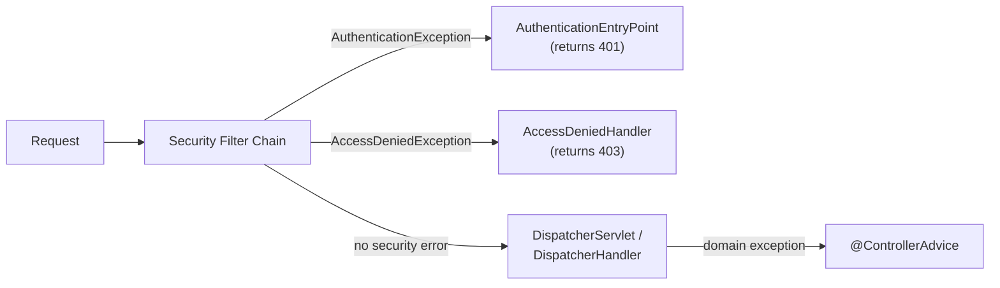

# Exception Handling in Spring Boot — MVC and WebFlux

**Date:** 2026-04-17 | **Updated:** 2026-04-17
**Tags:** `spring-boot` `exception-handling` `error-handling` `webflux` `controller-advice` `problem-details`

## Table of Contents

- [Summary](#summary)
- [The Exception Handling Pipeline](#the-exception-handling-pipeline)
  - [MVC Pipeline](#mvc-pipeline)
  - [WebFlux Pipeline](#webflux-pipeline)
- [@ControllerAdvice and @RestControllerAdvice](#controlleradvice-and-restcontrolleradvice)
  - [What They Are](#what-they-are)
  - [Scoping](#scoping)
  - [Ordering with @Order](#ordering-with-order)
- [@ExceptionHandler Methods](#exceptionhandler-methods)
  - [Method Signatures](#method-signatures)
  - [Return Types](#return-types)
  - [Handling Multiple Exception Types](#handling-multiple-exception-types)
- [The Project's Pattern — GlobalErrorHandler](#the-projects-pattern--globalerrorhandler)
  - [movies-info-service — Annotation-Based](#movies-info-service--annotation-based)
  - [movies-service — Client vs Server Exceptions](#movies-service--client-vs-server-exceptions)
  - [movies-review-service — Functional Endpoints](#movies-review-service--functional-endpoints)
- [Custom Exception Hierarchy](#custom-exception-hierarchy)
  - [Design Principles](#design-principles)
  - [This Project's Exception Classes](#this-projects-exception-classes)
- [ResponseEntityExceptionHandler](#responseentityexceptionhandler)
  - [What It Already Handles](#what-it-already-handles)
  - [When to Extend vs Write from Scratch](#when-to-extend-vs-write-from-scratch)
- [RFC 7807 Problem Details](#rfc-7807-problem-details)
  - [ProblemDetail Class](#problemdetail-class)
  - [ErrorResponse Interface](#errorresponse-interface)
  - [Enabling Problem Details](#enabling-problem-details)
- [Error Handling in WebFlux Functional Endpoints](#error-handling-in-webflux-functional-endpoints)
  - [ErrorWebExceptionHandler](#errorwebexceptionhandler)
  - [AbstractErrorWebExceptionHandler](#abstracterrorwebexceptionhandler)
- [Error Response DTO Pattern](#error-response-dto-pattern)
- [Security Exception Handling](#security-exception-handling)
- [Common Patterns and Anti-Patterns](#common-patterns-and-anti-patterns)
- [Related](#related)
- [References](#references)

---

## Summary

Spring provides centralized exception handling so that error-to-response mapping lives outside your business logic. In Spring MVC, `@ControllerAdvice` classes with `@ExceptionHandler` methods intercept exceptions thrown from any controller. In Spring WebFlux, the same annotation-based model works for annotated controllers, while functional endpoints use `ErrorWebExceptionHandler` or its abstract subclass. Spring 6+ adds RFC 9457 `ProblemDetail` support for structured error responses. The goal is always the same: a single place that translates domain exceptions into consistent, safe HTTP responses with proper status codes, no leaked stack traces, and enough detail for the client to act on.

---

## The Exception Handling Pipeline

### MVC Pipeline



Key points:
- **Controller-level** `@ExceptionHandler` methods take priority over `@ControllerAdvice` methods for the same exception type.
- If no handler matches, Spring's `DefaultHandlerExceptionResolver` handles standard exceptions (400, 405, 415, etc.) and anything else falls through to the `/error` endpoint via `BasicErrorController`.
- Security exceptions (`AccessDeniedException`, `AuthenticationException`) are caught by Spring Security's filter chain **before** reaching `@ControllerAdvice`.

### WebFlux Pipeline



Key points:
- For **annotated controllers**, the resolution order mirrors MVC: controller-level first, then `@ControllerAdvice`.
- For **functional endpoints** (`RouterFunction` / `HandlerFunction`), `@ControllerAdvice` does **not** apply. You need an `ErrorWebExceptionHandler` bean instead.
- Exceptions propagate as Reactor error signals (`Mono.error(...)` / `Flux.error(...)`), not as thrown stack exceptions.

---

## @ControllerAdvice and @RestControllerAdvice

### What They Are

`@ControllerAdvice` is a specialization of `@Component` that applies cross-cutting concerns to all (or a subset of) controllers:

| Annotation | Equivalent To | Response Body |
|------------|--------------|---------------|
| `@ControllerAdvice` | `@Component` | Requires `@ResponseBody` on each method or returns `ResponseEntity` |
| `@RestControllerAdvice` | `@ControllerAdvice` + `@ResponseBody` | Every method's return value is serialized to the response body |

Use `@RestControllerAdvice` for REST APIs (the common case). Use `@ControllerAdvice` when you need to return view names for server-rendered pages.

### Scoping

By default, a `@ControllerAdvice` applies to **all** controllers. Narrow the scope when different API groups need different error formats:

```java
// Only applies to controllers in this package
@RestControllerAdvice(basePackages = "com.example.api.v2")
public class V2ErrorHandler { ... }

// Only applies to controllers annotated with @RestController
@RestControllerAdvice(annotations = RestController.class)
public class RestOnlyErrorHandler { ... }

// Only applies to controllers that extend a base class
@RestControllerAdvice(assignableTypes = BaseApiController.class)
public class ApiErrorHandler { ... }

// Combine: package + specific classes
@RestControllerAdvice(
    basePackageClasses = OrderController.class,
    assignableTypes = PaymentController.class
)
public class CommerceErrorHandler { ... }
```

### Ordering with @Order

When multiple `@ControllerAdvice` classes can handle the same exception type, Spring selects based on `@Order` (lower value = higher priority):

```java
@RestControllerAdvice
@Order(1) // checked first
public class SecurityErrorHandler {
    @ExceptionHandler(AccessDeniedException.class)
    public ResponseEntity<String> handleForbidden(AccessDeniedException ex) {
        return ResponseEntity.status(403).body("Forbidden");
    }
}

@RestControllerAdvice
@Order(2) // checked second
public class GlobalErrorHandler {
    @ExceptionHandler(RuntimeException.class)
    public ResponseEntity<String> handleRuntime(RuntimeException ex) {
        return ResponseEntity.status(500).body("Internal error");
    }
}
```

Without `@Order`, the selection order is undefined. Always annotate when you have multiple advice classes.

---

## @ExceptionHandler Methods

### Method Signatures

`@ExceptionHandler` methods are flexible in what they accept:

| Parameter | Description |
|-----------|-------------|
| The exception itself | `SomeException ex` — always available |
| `WebRequest` / `NativeWebRequest` | Access to request attributes (MVC) |
| `ServerWebExchange` | Access to the full exchange (WebFlux) |
| `HttpServletRequest` / `HttpServletResponse` | Direct servlet access (MVC only) |
| `HttpHeaders` | Request headers |
| `Locale` | Request locale |
| `@RequestHeader`, `@RequestAttribute` | Specific header or attribute values |

### Return Types

| Return Type | When to Use |
|-------------|-------------|
| `ResponseEntity<T>` | Full control over status, headers, and body |
| `ProblemDetail` | RFC 7807 structured errors (Spring 6+) |
| `ErrorResponse` | Interface that produces `ProblemDetail` + headers (Spring 6+) |
| `Map<String, Object>` | Quick ad-hoc responses |
| `String` | View name (MVC with template engine) |
| `void` | When you write the response directly |

The most common pattern for REST APIs:

```java
@ExceptionHandler(OrderNotFoundException.class)
public ResponseEntity<ProblemDetail> handleNotFound(OrderNotFoundException ex) {
    ProblemDetail problem = ProblemDetail.forStatusAndDetail(
        HttpStatus.NOT_FOUND, ex.getMessage()
    );
    problem.setTitle("Order Not Found");
    return ResponseEntity.status(HttpStatus.NOT_FOUND).body(problem);
}
```

### Handling Multiple Exception Types

A single method can catch several exception types:

```java
@ExceptionHandler({
    OrderNotFoundException.class,
    ProductNotFoundException.class,
    CustomerNotFoundException.class
})
public ResponseEntity<ProblemDetail> handleNotFound(RuntimeException ex) {
    ProblemDetail problem = ProblemDetail.forStatusAndDetail(
        HttpStatus.NOT_FOUND, ex.getMessage()
    );
    return ResponseEntity.of(problem).build();
}
```

The method parameter type must be a common supertype of all listed exceptions.

---

## The Project's Pattern — GlobalErrorHandler

This project uses three microservices, each with its own `GlobalErrorHandler` adapted to its error handling needs.

### movies-info-service — Annotation-Based

```java
@ControllerAdvice
@Slf4j
public class GlobalErrorHandler {

    @ExceptionHandler(WebExchangeBindException.class)
    public ResponseEntity<String> handleRequestBodyError(WebExchangeBindException ex) {
        log.error("Exception caught in handleRequestBodyError: {}", ex.getMessage(), ex);
        var error = ex.getBindingResult().getAllErrors().stream()
            .map(DefaultMessageSourceResolvable::getDefaultMessage)
            .sorted()
            .collect(Collectors.joining(","));
        log.error("errorList: {}", error);
        return ResponseEntity.status(HttpStatus.BAD_REQUEST).body(error);
    }

    @ExceptionHandler(MovieInfoNotfoundException.class)
    public ResponseEntity<String> handleMovieInfoNotfoundException(
            MovieInfoNotfoundException ex) {
        log.error("Exception caught in handleMovieInfoNotfoundException: {}",
            ex.getMessage(), ex);
        return ResponseEntity.status(HttpStatus.NOT_FOUND).body(ex.getMessage());
    }
}
```

**What this does:**

1. **`WebExchangeBindException`** — thrown when `@Valid` validation fails on a request body in WebFlux. The handler extracts every `ObjectError` from the `BindingResult`, pulls the default message from each, sorts them alphabetically, and joins them into a single comma-separated string. Returns `400 BAD_REQUEST`.

2. **`MovieInfoNotfoundException`** — a custom domain exception. Returns `404 NOT_FOUND` with the exception message as the body.

The pattern is simple and effective: log the full exception server-side, return a minimal string response to the client.

### movies-service — Client vs Server Exceptions

```java
@ControllerAdvice
@Slf4j
public class GlobalErrorHandler {

    @ExceptionHandler(MoviesInfoClientException.class)
    public ResponseEntity<String> handleClientException(MoviesInfoClientException ex) {
        log.error("Exception caught in handleClientException: {}", ex.getMessage(), ex);
        return ResponseEntity.status(HttpStatus.valueOf(ex.getStatusCode())).body(ex.getMessage());
    }

    @ExceptionHandler(RuntimeException.class)
    public ResponseEntity<String> handleRuntimeException(RuntimeException ex) {
        log.error("Exception caught in handleRuntimeException: {}", ex.getMessage(), ex);
        return ResponseEntity.status(HttpStatus.INTERNAL_SERVER_ERROR).body(ex.getMessage());
    }
}
```

This service is the API gateway. It calls `movies-info-service` and `movies-review-service` via WebClient. When a downstream call fails with a 4xx, it wraps the response in `MoviesInfoClientException` carrying the original status code. The handler **preserves** the downstream status code. The `RuntimeException` catch-all handles unexpected failures as 500.

### movies-review-service — Functional Endpoints

```java
@Slf4j
@Component
public class GlobalErrorHandler implements ErrorWebExceptionHandler {

    @Override
    public Mono<Void> handle(ServerWebExchange exchange, Throwable ex) {
        log.error("Exception Message is: {}", ex.getMessage(), ex);
        DataBufferFactory bufferFactory = exchange.getResponse().bufferFactory();
        var errorMessage = bufferFactory.wrap(ex.getMessage().getBytes());

        if (ex instanceof ReviewNotFoundException) {
            exchange.getResponse().setStatusCode(HttpStatus.NOT_FOUND);
            return exchange.getResponse().writeWith(Mono.just(errorMessage));
        }
        if (ex instanceof ReviewDataException) {
            exchange.getResponse().setStatusCode(HttpStatus.BAD_REQUEST);
            return exchange.getResponse().writeWith(Mono.just(errorMessage));
        }

        exchange.getResponse().setStatusCode(HttpStatus.INTERNAL_SERVER_ERROR);
        return exchange.getResponse().writeWith(Mono.just(errorMessage));
    }
}
```

Because this service uses `RouterFunction` (functional endpoints), `@ControllerAdvice` does not apply. Instead it implements `ErrorWebExceptionHandler` directly and writes the response bytes manually. The `instanceof` chain maps each exception type to an HTTP status.

---

## Custom Exception Hierarchy

### Design Principles

A well-designed exception hierarchy makes the error handler simple:

1. **All domain exceptions extend `RuntimeException`** — avoids checked-exception ceremony.
2. **Separate client errors (4xx) from server errors (5xx)** — the handler can map them to different status codes without inspecting the message.
3. **Carry context** — include the HTTP status code, a machine-readable error code, or the original cause.
4. **Keep the hierarchy shallow** — one or two levels of inheritance is enough.

### This Project's Exception Classes



**Pattern: Client vs Server exceptions per downstream service.**

| Exception | HTTP Semantics | Used When |
|-----------|---------------|-----------|
| `MoviesInfoClientException` | 4xx (carries `statusCode`) | WebClient call to movies-info-service returns 4xx |
| `MoviesInfoServerException` | 5xx | WebClient call to movies-info-service returns 5xx |
| `ReviewsClientException` | 4xx | WebClient call to movies-review-service returns 4xx |
| `ReviewsServerException` | 5xx | WebClient call to movies-review-service returns 5xx |
| `MovieInfoNotfoundException` | 404 | Movie info not found in the database |
| `ReviewNotFoundException` | 404 | Review not found in the database |
| `ReviewDataException` | 400 | Validation failure for review data |

A cleaner evolution would introduce a base `ClientException` and `ServerException`:

```java
public abstract class ClientException extends RuntimeException {
    private final int statusCode;
    protected ClientException(String message, int statusCode) {
        super(message);
        this.statusCode = statusCode;
    }
    public int getStatusCode() { return statusCode; }
}

public abstract class ServerException extends RuntimeException {
    protected ServerException(String message) { super(message); }
    protected ServerException(String message, Throwable cause) { super(message, cause); }
}

// Concrete exceptions
public class MoviesInfoClientException extends ClientException {
    public MoviesInfoClientException(String message, int statusCode) {
        super(message, statusCode);
    }
}
```

This lets the handler catch `ClientException` once instead of listing every 4xx exception.

---

## ResponseEntityExceptionHandler

Spring MVC provides `ResponseEntityExceptionHandler` — a base class that already handles the most common framework exceptions. Extend it to customize without losing default coverage.

### What It Already Handles

| Exception | Default Status |
|-----------|---------------|
| `MethodArgumentNotValidException` | 400 |
| `HttpRequestMethodNotSupportedException` | 405 |
| `HttpMediaTypeNotSupportedException` | 415 |
| `HttpMediaTypeNotAcceptableException` | 406 |
| `MissingServletRequestParameterException` | 400 |
| `MissingPathVariableException` | 500 |
| `TypeMismatchException` | 400 |
| `HttpMessageNotReadableException` | 400 |
| `NoHandlerFoundException` | 404 |
| `AsyncRequestTimeoutException` | 503 |

```java
@RestControllerAdvice
public class GlobalExceptionHandler extends ResponseEntityExceptionHandler {

    // Override to customize the 400 response for validation errors
    @Override
    protected ResponseEntity<Object> handleMethodArgumentNotValid(
            MethodArgumentNotValidException ex,
            HttpHeaders headers,
            HttpStatusCode status,
            WebRequest request) {
        var errors = ex.getBindingResult().getFieldErrors().stream()
            .map(fe -> fe.getField() + ": " + fe.getDefaultMessage())
            .sorted()
            .toList();
        ProblemDetail problem = ProblemDetail.forStatus(status);
        problem.setTitle("Validation Failed");
        problem.setProperty("errors", errors);
        return ResponseEntity.status(status).body(problem);
    }

    // Add your own domain exception handlers
    @ExceptionHandler(OrderNotFoundException.class)
    public ResponseEntity<ProblemDetail> handleNotFound(OrderNotFoundException ex) {
        return ResponseEntity.of(
            ProblemDetail.forStatusAndDetail(HttpStatus.NOT_FOUND, ex.getMessage())
        ).build();
    }
}
```

### When to Extend vs Write from Scratch

| Scenario | Recommendation |
|----------|---------------|
| Spring MVC REST API | **Extend** `ResponseEntityExceptionHandler` — you get 15+ exceptions handled for free |
| Spring WebFlux with annotated controllers | Write from scratch — `ResponseEntityExceptionHandler` is MVC-only |
| Spring WebFlux with functional endpoints | Implement `ErrorWebExceptionHandler` — no annotation-based handler applies |
| Mixed MVC + WebFlux (rare) | One handler per stack |

---

## RFC 9457 Problem Details

Spring 6+ (Spring Boot 3+) has first-class support for [RFC 9457](https://www.rfc-editor.org/rfc/rfc9457) structured error responses.

### ProblemDetail Class

```java
@ExceptionHandler(InsufficientFundsException.class)
public ProblemDetail handleInsufficientFunds(InsufficientFundsException ex) {
    ProblemDetail problem = ProblemDetail.forStatusAndDetail(
        HttpStatus.BAD_REQUEST, ex.getMessage()
    );
    problem.setType(URI.create("https://api.example.com/errors/insufficient-funds"));
    problem.setTitle("Insufficient Funds");
    problem.setInstance(URI.create("/accounts/" + ex.getAccountId()));
    problem.setProperty("balance", ex.getBalance());
    problem.setProperty("withdrawal", ex.getAmount());
    return problem;
}
```

Produces:

```json
{
  "type": "https://api.example.com/errors/insufficient-funds",
  "title": "Insufficient Funds",
  "status": 400,
  "detail": "Account balance 50.00 is less than withdrawal 100.00",
  "instance": "/accounts/12345",
  "balance": 50.00,
  "withdrawal": 100.00
}
```

The `Content-Type` is automatically set to `application/problem+json`.

### ErrorResponse Interface

Spring 6 provides the `ErrorResponse` interface for exceptions that know their own error response. `ResponseEntityExceptionHandler` uses this internally:

```java
public class OrderNotFoundException extends RuntimeException implements ErrorResponse {
    private final ProblemDetail body;

    public OrderNotFoundException(Long id) {
        super("Order not found: " + id);
        this.body = ProblemDetail.forStatusAndDetail(HttpStatus.NOT_FOUND, getMessage());
        this.body.setTitle("Order Not Found");
        this.body.setType(URI.create("https://api.example.com/errors/not-found"));
    }

    @Override
    public HttpStatusCode getStatusCode() { return HttpStatus.NOT_FOUND; }

    @Override
    public ProblemDetail getBody() { return body; }
}
```

When such an exception is thrown, Spring can render the `ProblemDetail` automatically without any `@ExceptionHandler`.

### Enabling Problem Details

For Spring MVC, enable globally so framework exceptions also produce `ProblemDetail`:

```properties
# application.properties
spring.mvc.problemdetails.enabled=true
```

For Spring WebFlux:

```properties
spring.webflux.problemdetails.enabled=true
```

This makes `ResponseEntityExceptionHandler` (or its WebFlux equivalent) return `ProblemDetail` responses for all standard framework exceptions.

---

## Error Handling in WebFlux Functional Endpoints

### ErrorWebExceptionHandler

For `RouterFunction`-based APIs, `@ControllerAdvice` is invisible. You implement `ErrorWebExceptionHandler`:

```java
@Component
@Order(-2) // before Spring Boot's DefaultErrorWebExceptionHandler (order -1)
public class FunctionalErrorHandler implements ErrorWebExceptionHandler {

    @Override
    public Mono<Void> handle(ServerWebExchange exchange, Throwable ex) {
        var response = exchange.getResponse();
        var bufferFactory = response.bufferFactory();

        HttpStatus status;
        String message;

        if (ex instanceof ReviewNotFoundException) {
            status = HttpStatus.NOT_FOUND;
            message = ex.getMessage();
        } else if (ex instanceof ReviewDataException) {
            status = HttpStatus.BAD_REQUEST;
            message = ex.getMessage();
        } else {
            status = HttpStatus.INTERNAL_SERVER_ERROR;
            message = "Internal Server Error";
        }

        response.setStatusCode(status);
        response.getHeaders().setContentType(MediaType.APPLICATION_JSON);
        var body = """
            {"status":%d,"error":"%s","message":"%s"}
            """.formatted(status.value(), status.getReasonPhrase(), message);
        var buffer = bufferFactory.wrap(body.getBytes(StandardCharsets.UTF_8));
        return response.writeWith(Mono.just(buffer));
    }
}
```

The `@Order(-2)` is critical — Spring Boot registers its own `DefaultErrorWebExceptionHandler` at order `-1`. Without a lower order value, your handler never executes.

### AbstractErrorWebExceptionHandler

For more structured handling, extend `AbstractErrorWebExceptionHandler`. It gives you access to `ServerRequest` (path, headers, query parameters) and integrates with Spring Boot's `ErrorAttributes`. The key methods to implement:

1. **Constructor** — call `super(errorAttributes, resources, applicationContext)` and set message writers from `ServerCodecConfigurer`.
2. **`getRoutingFunction(ErrorAttributes)`** — return a `RouterFunction<ServerResponse>` that routes all error requests to your render method.
3. **Render method** — call `getError(request)` to retrieve the exception, map it to a status, and build a `ServerResponse`.

---

## Error Response DTO Pattern

For APIs that do not use RFC 7807, define a consistent error response shape:

```java
public record ApiErrorResponse(
    Instant timestamp,
    int status,
    String error,
    String message,
    String path,
    List<FieldError> errors
) {
    public record FieldError(String field, String message) {}

    public static ApiErrorResponse of(HttpStatus status, String message, String path) {
        return new ApiErrorResponse(
            Instant.now(), status.value(), status.getReasonPhrase(),
            message, path, List.of()
        );
    }

    public static ApiErrorResponse of(
            HttpStatus status, String message, String path, List<FieldError> errors) {
        return new ApiErrorResponse(
            Instant.now(), status.value(), status.getReasonPhrase(),
            message, path, errors
        );
    }
}
```

Example JSON response:

```json
{
  "timestamp": "2026-04-17T10:30:00Z",
  "status": 400,
  "error": "Bad Request",
  "message": "Validation failed",
  "path": "/api/v1/movies",
  "errors": [
    { "field": "name", "message": "must not be blank" },
    { "field": "year", "message": "must be positive" }
  ]
}
```

Use this DTO consistently across all `@ExceptionHandler` methods so clients can parse errors with a single model.

---

## Security Exception Handling

`AccessDeniedException` and `AuthenticationException` are special. In the servlet stack, Spring Security's filter chain catches them **before** they reach `@ControllerAdvice`:



To customize these responses:

```java
@Configuration
@EnableWebSecurity
public class SecurityConfig {

    @Bean
    public SecurityFilterChain filterChain(HttpSecurity http) throws Exception {
        return http
            .exceptionHandling(eh -> eh
                .authenticationEntryPoint((request, response, authException) -> {
                    response.setStatus(HttpServletResponse.SC_UNAUTHORIZED);
                    response.setContentType("application/json");
                    response.getWriter().write(
                        """
                        {"status":401,"message":"Authentication required"}
                        """);
                })
                .accessDeniedHandler((request, response, accessDeniedException) -> {
                    response.setStatus(HttpServletResponse.SC_FORBIDDEN);
                    response.setContentType("application/json");
                    response.getWriter().write(
                        """
                        {"status":403,"message":"Access denied"}
                        """);
                })
            )
            .build();
    }
}
```

In WebFlux, configure `ServerAuthenticationEntryPoint` and `ServerAccessDeniedHandler` on `ServerHttpSecurity` instead:

```java
@Bean
public SecurityWebFilterChain securityFilterChain(ServerHttpSecurity http) {
    return http
        .exceptionHandling(eh -> eh
            .authenticationEntryPoint((exchange, ex) -> {
                exchange.getResponse().setStatusCode(HttpStatus.UNAUTHORIZED);
                return exchange.getResponse().writeWith(Mono.just(
                    exchange.getResponse().bufferFactory()
                        .wrap("{\"status\":401,\"message\":\"Authentication required\"}"
                            .getBytes(StandardCharsets.UTF_8))
                ));
            })
            .accessDeniedHandler((exchange, ex) -> {
                exchange.getResponse().setStatusCode(HttpStatus.FORBIDDEN);
                return exchange.getResponse().writeWith(Mono.just(
                    exchange.getResponse().bufferFactory()
                        .wrap("{\"status\":403,\"message\":\"Access denied\"}"
                            .getBytes(StandardCharsets.UTF_8))
                ));
            })
        )
        .build();
}
```

---

## Common Patterns and Anti-Patterns

| Do | Don't |
|----|-------|
| Return consistent response shapes across all endpoints | Return raw exception messages from some handlers and structured objects from others |
| Log the full exception with stack trace server-side (`log.error("...", ex)`) | Log only `ex.getMessage()` and lose the stack trace |
| Use specific exception types (`OrderNotFoundException`) | Catch generic `Exception` everywhere |
| Map domain exceptions to appropriate HTTP status codes | Return 500 for everything |
| Use `@Order` when multiple `@ControllerAdvice` classes exist | Rely on undefined ordering |
| Sanitize error messages before returning to client | Expose internal class names, SQL, or stack traces in responses |
| Extend `ResponseEntityExceptionHandler` in MVC apps | Re-implement handling for `MethodArgumentNotValidException`, `HttpRequestMethodNotSupportedException`, etc. |
| Implement `ErrorWebExceptionHandler` for WebFlux functional endpoints | Assume `@ControllerAdvice` works with `RouterFunction` |
| Handle security exceptions via `AuthenticationEntryPoint` and `AccessDeniedHandler` | Expect `@ControllerAdvice` to catch `AccessDeniedException` |
| Return machine-readable error codes alongside messages | Return only human-readable text that clients try to parse |
| Test error responses in integration tests | Assume exception handlers work correctly without testing |

---

## Related

- [Bean Validation](bean-validation.md) — `@Valid`, `@NotBlank`, constraint annotations, and the validation exceptions that feed into these handlers
- [REST Controller Patterns](../web-layer/rest-controller-patterns.md) — controller design, `@RequestBody`, `@PathVariable`, and how controllers throw the exceptions handled here
- [Spring Fundamentals — AOP and Proxies](../spring-fundamentals.md#aop-and-proxies--the-magic-explained) — `@ControllerAdvice` works through Spring's AOP proxy mechanism

## References

- [Error Responses — Spring Framework](https://docs.spring.io/spring-framework/reference/web/webmvc/mvc-ann-rest-exceptions.html) — `@ExceptionHandler`, `@ControllerAdvice`, `ProblemDetail`, and `ResponseEntityExceptionHandler`
- [RFC 7807 Problem Details Support — Spring Framework](https://docs.spring.io/spring-framework/reference/web/webmvc/mvc-ann-rest-exceptions.html#mvc-ann-rest-exceptions-problem-details) — `ProblemDetail` class and `ErrorResponse` interface
- [WebFlux Error Handling — Spring Framework](https://docs.spring.io/spring-framework/reference/web/webflux/dispatcher-handler.html#webflux-exception-handler) — how `DispatcherHandler` resolves exceptions in WebFlux
- [Functional Endpoints Error Handling — Spring Framework](https://docs.spring.io/spring-framework/reference/web/webflux-functional.html) — `RouterFunction`, `HandlerFunction`, and error handling without `@ControllerAdvice`
- [Spring Boot Error Handling — Spring Boot](https://docs.spring.io/spring-boot/reference/web/servlet.html#web.servlet.spring-mvc.error-handling) — `BasicErrorController`, `ErrorAttributes`, and auto-configured error pages
- [Spring Security Exception Handling — Servlet](https://docs.spring.io/spring-security/reference/servlet/architecture.html#servlet-exceptiontranslationfilter) — `ExceptionTranslationFilter`, `AuthenticationEntryPoint`, `AccessDeniedHandler`
- [Spring Security Exception Handling — WebFlux](https://docs.spring.io/spring-security/reference/reactive/exploits/index.html) — reactive security exception handling
- [RFC 7807 — Problem Details for HTTP APIs](https://www.rfc-editor.org/rfc/rfc7807) — the specification itself
