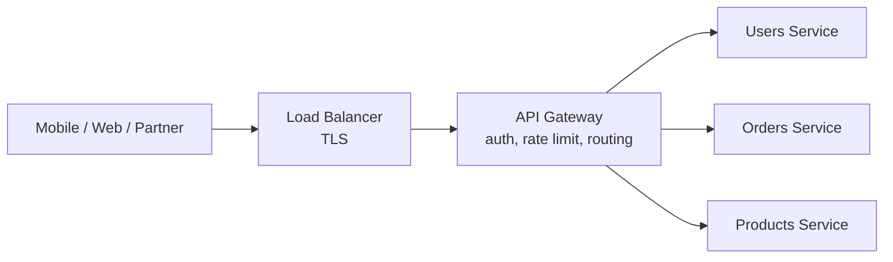
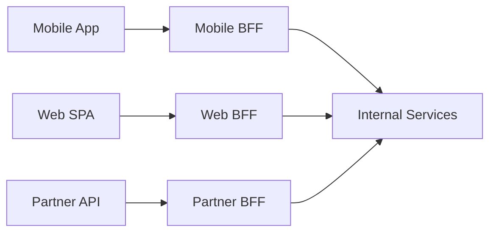

# API Gateway Patterns with Spring Cloud Gateway — Routing, Rate Limiting, BFF

**Date:** 2026-04-19 | **Updated:** 2026-04-19
**Tags:** `api-gateway` `spring-cloud-gateway` `routing` `rate-limiting` `bff` `architecture`

## Table of Contents

- [Summary](#summary)
- [What an API Gateway Does](#what-an-api-gateway-does)
- [Spring Cloud Gateway — Basics](#spring-cloud-gateway--basics)
- [Predicates and Filters](#predicates-and-filters)
- [Rate Limiting](#rate-limiting)
- [Authentication and Header Forwarding](#authentication-and-header-forwarding)
- [The BFF Pattern](#the-bff-pattern)
- [Gateway vs Service Mesh](#gateway-vs-service-mesh)
- [When to Pick Envoy, Kong, or Traefik Instead](#when-to-pick-envoy-kong-or-traefik-instead)
- [Related](#related)
- [References](#references)

---

## Summary

An API gateway sits between clients and your services, solving problems every service otherwise solves badly in its own codebase: routing, TLS termination, auth, rate limiting, request/response transformation, circuit breaking, and aggregation. [Spring Cloud Gateway](https://spring.io/projects/spring-cloud-gateway) is the WebFlux-based, Netty-powered gateway that fits naturally into Spring Boot shops — you write routes in YAML or a fluent DSL, plug in `GatewayFilter`s for cross-cutting concerns, and get backpressure-aware streaming for free. For polyglot infrastructure, [Envoy](https://www.envoyproxy.io/) or [Kong](https://konghq.com/) is usually a better choice — Spring Cloud Gateway is best when most traffic originates from Spring-aware clients and your ops team is Java-first. This doc covers the gateway concepts that matter regardless of tool, plus enough Spring Cloud Gateway code to run one in production.

---

## What an API Gateway Does

Ten things every production gateway does:

1. **Routing** — map public URLs to internal services.
2. **TLS termination** — one certificate to rotate, one place to configure ciphers.
3. **Authentication** — validate JWT / OAuth tokens, reject unauthenticated requests.
4. **Authorization** — coarse checks (is this token allowed to hit this route).
5. **Rate limiting** — per-key, per-IP, per-route.
6. **Request transformation** — rewrite paths, add/strip headers, inject correlation IDs.
7. **Response transformation** — add security headers, gzip, trim debug info.
8. **Circuit breaking** — stop calling a failing downstream.
9. **Observability** — one place for uniform logs, traces, metrics.
10. **API versioning** — route `/v1/...` to old service, `/v2/...` to new.

An internal service that does any of the above for itself is usually doing it wrong — move it to the gateway.



---

## Spring Cloud Gateway — Basics

Dependencies:

```gradle
implementation 'org.springframework.cloud:spring-cloud-starter-gateway'
implementation 'org.springframework.boot:spring-boot-starter-actuator'
```

Routes in YAML:

```yaml
spring:
  cloud:
    gateway:
      routes:
        - id: users
          uri: http://users-service:8080
          predicates:
            - Path=/api/users/**
          filters:
            - RewritePath=/api/users/(?<segment>.*), /$\{segment}
            - AddRequestHeader=X-Gateway, spring-cloud-gateway
        - id: orders
          uri: lb://orders-service         # service discovery via Eureka/Consul
          predicates:
            - Path=/api/orders/**
            - Method=GET,POST
          filters:
            - name: CircuitBreaker
              args: { name: ordersCb, fallbackUri: forward:/fallback/orders }
```

Or fluent DSL:

```java
@Bean
public RouteLocator routes(RouteLocatorBuilder b) {
    return b.routes()
        .route("users", r -> r.path("/api/users/**")
            .filters(f -> f.rewritePath("/api/users/(?<s>.*)", "/${s}"))
            .uri("http://users-service:8080"))
        .build();
}
```

Gateway runs on WebFlux + Netty. Scales on event loops; handle tens of thousands of concurrent connections per pod with low memory. See [reactive-programming-java.md](../reactive-programming-java.md).

---

## Predicates and Filters

**Predicates** match the request: `Path`, `Method`, `Header`, `Query`, `Cookie`, `Host`, `After`/`Before`/`Between` (time-based), `Weight` (traffic splitting for canaries).

**Filters** transform the request or response:

- `AddRequestHeader`, `AddResponseHeader`
- `RemoveRequestHeader`, `RemoveResponseHeader`
- `RewritePath`, `PrefixPath`, `SetPath`
- `Retry`, `CircuitBreaker`, `RequestRateLimiter`
- `SaveSession`, `SecureHeaders`
- `SetStatus`, `StripPrefix`

Custom filter:

```java
@Component
public class CorrelationIdFilter implements GlobalFilter, Ordered {
    @Override
    public Mono<Void> filter(ServerWebExchange exchange, GatewayFilterChain chain) {
        String id = Optional.ofNullable(exchange.getRequest().getHeaders().getFirst("X-Correlation-Id"))
                            .orElse(UUID.randomUUID().toString());
        ServerHttpRequest mutated = exchange.getRequest().mutate()
                                            .header("X-Correlation-Id", id).build();
        return chain.filter(exchange.mutate().request(mutated).build());
    }

    @Override public int getOrder() { return -1; }
}
```

---

## Rate Limiting

Built-in Redis-backed token bucket:

```yaml
filters:
  - name: RequestRateLimiter
    args:
      redis-rate-limiter:
        replenishRate: 100       # steady state req/s
        burstCapacity: 200       # tolerate brief bursts
        requestedTokens: 1
      key-resolver: "#{@userKeyResolver}"
```

```java
@Bean
public KeyResolver userKeyResolver() {
    return exchange -> Mono.justOrEmpty(exchange.getPrincipal().map(Principal::getName))
        .defaultIfEmpty(exchange.getRequest().getRemoteAddress().toString());
}
```

Rate-limit by user for authenticated, by IP for anonymous. For anything fancier (sliding window, distributed quotas), Redis + Lua or [Resilience4j RateLimiter](https://resilience4j.readme.io/docs/ratelimiter) — see [mvc-high-throughput.md](mvc-high-throughput.md#resilience4j-ratelimiter).

---

## Authentication and Header Forwarding

Gateway verifies the JWT once, forwards claims to downstream services:

```yaml
spring:
  security:
    oauth2:
      resourceserver:
        jwt:
          issuer-uri: https://auth.example.com
```

```java
@Bean
public SecurityWebFilterChain security(ServerHttpSecurity http) {
    return http
        .authorizeExchange(ex -> ex
            .pathMatchers("/api/public/**").permitAll()
            .anyExchange().authenticated())
        .oauth2ResourceServer(o -> o.jwt(Customizer.withDefaults()))
        .csrf(ServerHttpSecurity.CsrfSpec::disable)
        .build();
}
```

Downstream services trust `X-User-Id` / `X-Roles` headers **only because they come from the gateway** and the network path is mTLS-protected (or services are cluster-private).

**Never expose backing services directly.** Clients must hit the gateway. Enforce via NetworkPolicies, private service endpoints, or VPC boundaries.

See [OIDC and Modern Auth Flows](../security/oidc-and-modern-auth.md).

---

## The BFF Pattern

**Backend for Frontend** — a gateway per client type. Mobile, web, partner, and internal admin each get their own BFF optimized for their query shape, caching, and auth.



Why: the mobile app wants three fields per product and aggressive caching; the partner API needs detailed fields, webhooks, and strict rate limits. One "universal" API ends up a compromise that serves nobody well. A BFF per client encapsulates that divergence.

GraphQL federation is a natural BFF: the supergraph is the mobile or web client's BFF. See [graphql/federation-concepts.md](../graphql/federation-concepts.md).

---

## Gateway vs Service Mesh

A **service mesh** ([Istio](https://istio.io/), [Linkerd](https://linkerd.io/)) handles east-west (service-to-service) traffic with sidecars: mTLS, observability, traffic shifting, retries. An **API gateway** handles north-south (client-to-service) traffic: auth, rate limiting, client-facing concerns.

They complement each other. A typical stack: gateway at the edge + mesh inside the cluster. Don't try to make one do both — each is optimized for different problems.

---

## When to Pick Envoy, Kong, or Traefik Instead

| Tool | Strengths | Pick it when |
|------|-----------|--------------|
| Spring Cloud Gateway | Spring idiomatic, WebFlux, Java extensibility | You're Spring-only and want JVM-native filters. |
| [Envoy](https://www.envoyproxy.io/) | Rust-fast, WASM filters, service-mesh-grade | Polyglot, high-throughput, low-latency. |
| [Kong](https://konghq.com/) | Plugin ecosystem, admin UI, OSS + enterprise | You want ready-made plugins (Auth0, API keys, analytics). |
| [Traefik](https://traefik.io/) | k8s-native ingress, auto-discovery | You want an ingress controller that doubles as a gateway. |
| [Apollo Router](https://www.apollographql.com/docs/router/) | Federation-specific | Your gateway is GraphQL-only. |

Spring Cloud Gateway is the best choice for ~30% of situations; Envoy/Kong dominate the rest. Don't pick Spring because you know Spring — pick it because it fits the traffic pattern.

---

## Related

- [Scaling Spring MVC Before Virtual Threads](mvc-high-throughput.md) — gateway is one way to move cross-cutting concerns out of services.
- [Reactive Programming in Java](../reactive-programming-java.md) — WebFlux model Spring Cloud Gateway uses.
- [OIDC and Modern Auth Flows](../security/oidc-and-modern-auth.md) — token validation at the gateway.
- [Feature Flags](../configurations/feature-flags.md) — gateway as a feature-flag enforcement point.
- [GraphQL Federation Concepts](../graphql/federation-concepts.md) — the GraphQL-specific gateway.
- [Distributed Tracing](../observability/distributed-tracing.md) — gateway as uniform trace-header injector.

---

## References

- [Spring Cloud Gateway documentation](https://docs.spring.io/spring-cloud-gateway/docs/current/reference/html/)
- [Spring Cloud Gateway GitHub](https://github.com/spring-cloud/spring-cloud-gateway)
- [Envoy documentation](https://www.envoyproxy.io/docs/envoy/latest/)
- [Kong documentation](https://docs.konghq.com/)
- [Traefik documentation](https://doc.traefik.io/traefik/)
- [Sam Newman — Backend For Frontend](https://samnewman.io/patterns/architectural/bff/)
- [Istio documentation](https://istio.io/latest/docs/)
- [Linkerd documentation](https://linkerd.io/2/overview/)
