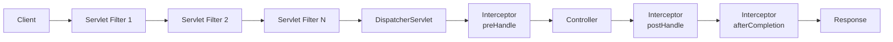
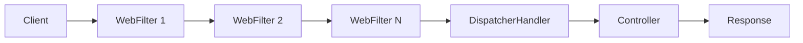
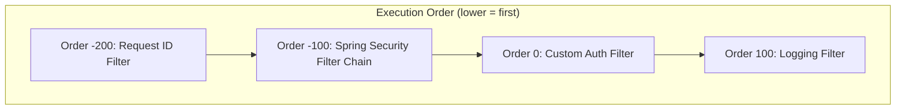

# Filters, Interceptors, and the Request Processing Pipeline in Spring Boot

**Date:** 2026-04-17 | **Updated:** 2026-04-17
**Tags:** `spring-boot` `servlet-filter` `handler-interceptor` `webfilter` `webflux` `cross-cutting-concerns` `request-pipeline`

## Table of Contents

- [Summary](#summary)
- [The Request Processing Pipeline](#the-request-processing-pipeline)
  - [Spring MVC Pipeline](#spring-mvc-pipeline)
  - [Spring WebFlux Pipeline](#spring-webflux-pipeline)
- [Servlet Filters (MVC)](#servlet-filters-mvc)
  - [The Filter Interface](#the-filter-interface)
  - [Registration via @Component](#registration-via-component)
  - [Registration via FilterRegistrationBean](#registration-via-filterregistrationbean)
- [OncePerRequestFilter](#oncerequestfilter)
- [HandlerInterceptor (MVC)](#handlerinterceptor-mvc)
  - [The Three Hooks](#the-three-hooks)
  - [Registering Interceptors](#registering-interceptors)
  - [Request Timing Interceptor Example](#request-timing-interceptor-example)
- [Filter vs Interceptor](#filter-vs-interceptor)
- [WebFilter (WebFlux)](#webfilter-webflux)
  - [Request-ID Propagation Example](#request-id-propagation-example)
  - [Ordering with @Order](#ordering-with-order)
- [ExchangeFilterFunction (WebClient)](#exchangefilterfunction-webclient)
  - [Logging Filter Example](#logging-filter-example)
  - [Retry Logic Example](#retry-logic-example)
- [Common Use Cases](#common-use-cases)
- [Ordering](#ordering)
- [Related](#related)
- [References](#references)

---

## Summary

Spring provides multiple interception points in the HTTP request pipeline, each operating at a different layer. **Servlet Filters** sit at the container level and see every request before Spring MVC touches it. **HandlerInterceptors** operate inside Spring MVC with full access to the handler and model. **WebFilters** are the reactive equivalent for WebFlux applications. **ExchangeFilterFunctions** intercept outgoing calls made through `WebClient`. Understanding where each one lives lets you add cross-cutting concerns — logging, authentication, request tracing, CORS, security headers — at the right layer without fighting the framework.

---

## The Request Processing Pipeline

### Spring MVC Pipeline

In the servlet stack, a request passes through the servlet container's filter chain before reaching Spring's `DispatcherServlet`, which then delegates to interceptors and the controller:



Key observations:
- Filters wrap the **entire** DispatcherServlet — they can short-circuit before Spring MVC is involved
- Interceptors wrap the **controller** — they have access to the `HandlerMethod` and `ModelAndView`
- `afterCompletion` runs even when the controller throws, making it suitable for cleanup

### Spring WebFlux Pipeline

The reactive stack replaces servlet filters and interceptors with a single `WebFilter` chain:



WebFlux has no `HandlerInterceptor`. The `WebFilter` chain is the single interception mechanism, and it processes everything reactively through `Mono<Void>` chains.

---

## Servlet Filters (MVC)

### The Filter Interface

The `jakarta.servlet.Filter` interface (previously `javax.servlet.Filter` before Jakarta EE migration) defines three methods:

```java
public interface Filter {
    default void init(FilterConfig filterConfig) throws ServletException {}

    void doFilter(ServletRequest request, ServletResponse response,
                  FilterChain chain) throws IOException, ServletException;

    default void destroy() {}
}
```

| Method | Purpose |
|--------|---------|
| `init` | Called once when the filter is initialized. Use for expensive setup. |
| `doFilter` | Called on every matching request. **Must call `chain.doFilter()` to continue** or the request stops here. |
| `destroy` | Called once when the filter is removed. Use for cleanup. |

The critical detail: calling `chain.doFilter(request, response)` passes the request to the next filter in the chain (or to the `DispatcherServlet` if this is the last filter). Code before that call runs on the way in; code after runs on the way out.

```java
public class SimpleLoggingFilter implements Filter {

    @Override
    public void doFilter(ServletRequest request, ServletResponse response,
                         FilterChain chain) throws IOException, ServletException {
        // --- BEFORE the rest of the chain ---
        HttpServletRequest req = (HttpServletRequest) request;
        log.info("Incoming: {} {}", req.getMethod(), req.getRequestURI());

        chain.doFilter(request, response);  // continue the chain

        // --- AFTER the chain completes ---
        HttpServletResponse res = (HttpServletResponse) response;
        log.info("Outgoing: status {}", res.getStatus());
    }
}
```

### Registration via @Component

The simplest registration. Spring Boot auto-detects any `Filter` bean and adds it to the chain:

```java
@Component
public class SimpleLoggingFilter implements Filter {
    @Override
    public void doFilter(ServletRequest request, ServletResponse response,
                         FilterChain chain) throws IOException, ServletException {
        // ...
        chain.doFilter(request, response);
    }
}
```

Limitation: `@Component` registration applies the filter to **all URL patterns** and gives you no control over ordering relative to other filters.

### Registration via FilterRegistrationBean

For control over URL patterns, ordering, and naming, use `FilterRegistrationBean`:

```java
@Configuration
public class FilterConfig {

    @Bean
    public FilterRegistrationBean<SimpleLoggingFilter> loggingFilterRegistration() {
        FilterRegistrationBean<SimpleLoggingFilter> registration = new FilterRegistrationBean<>();
        registration.setFilter(new SimpleLoggingFilter());
        registration.addUrlPatterns("/v1/*");
        registration.setOrder(1);        // lower = higher priority
        registration.setName("loggingFilter");
        return registration;
    }
}
```

When using `FilterRegistrationBean`, do **not** annotate the filter class with `@Component` — otherwise it registers twice (once via component scan, once via the registration bean).

---

## OncePerRequestFilter

`OncePerRequestFilter` is the recommended base class for servlet filters. It guarantees the filter executes **exactly once per request**, even when the request is forwarded or dispatched internally (e.g., error dispatching, `RequestDispatcher.forward()`):

```java
@Component
public class RequestLoggingFilter extends OncePerRequestFilter {

    @Override
    protected void doFilterInternal(HttpServletRequest request,
                                    HttpServletResponse response,
                                    FilterChain filterChain)
            throws ServletException, IOException {

        String requestId = UUID.randomUUID().toString().substring(0, 8);
        long start = System.nanoTime();

        // Add request ID to MDC for structured logging
        MDC.put("requestId", requestId);
        response.setHeader("X-Request-Id", requestId);

        try {
            log.info(">>> {} {} from {}",
                    request.getMethod(),
                    request.getRequestURI(),
                    request.getRemoteAddr());

            filterChain.doFilter(request, response);
        } finally {
            long durationMs = TimeUnit.NANOSECONDS.toMillis(System.nanoTime() - start);
            log.info("<<< {} {} — {} in {}ms",
                    request.getMethod(),
                    request.getRequestURI(),
                    response.getStatus(),
                    durationMs);
            MDC.remove("requestId");
        }
    }

    @Override
    protected boolean shouldNotFilter(HttpServletRequest request) {
        // Skip health checks and actuator endpoints
        return request.getRequestURI().startsWith("/actuator");
    }
}
```

Key features:
- `doFilterInternal` replaces `doFilter` — the once-per-request check is handled for you
- `shouldNotFilter` lets you skip specific paths without registering URL patterns externally
- The `try/finally` pattern ensures MDC cleanup and response logging even on exceptions

---

## HandlerInterceptor (MVC)

### The Three Hooks

`HandlerInterceptor` operates inside Spring MVC, between the `DispatcherServlet` and the controller:

```java
public interface HandlerInterceptor {

    default boolean preHandle(HttpServletRequest request,
                              HttpServletResponse response,
                              Object handler) throws Exception {
        return true;  // return false to short-circuit
    }

    default void postHandle(HttpServletRequest request,
                            HttpServletResponse response,
                            Object handler,
                            ModelAndView modelAndView) throws Exception {
    }

    default void afterCompletion(HttpServletRequest request,
                                 HttpServletResponse response,
                                 Object handler,
                                 Exception ex) throws Exception {
    }
}
```

| Hook | When It Runs | Can Short-Circuit? | Access To |
|------|--------------|--------------------|-----------|
| `preHandle` | Before the controller method | Yes — return `false` to stop | `HandlerMethod`, request, response |
| `postHandle` | After the controller, before view rendering | No | `HandlerMethod`, `ModelAndView` |
| `afterCompletion` | After the response is committed | No | `HandlerMethod`, any exception thrown |

`preHandle` returning `false` stops the entire chain — no further interceptors run, no controller runs. This is useful for authentication checks.

`postHandle` does **not** run if the controller throws an exception. `afterCompletion` always runs, making it the right place for resource cleanup and timing.

### Registering Interceptors

Register interceptors through `WebMvcConfigurer`:

```java
@Configuration
public class WebMvcConfig implements WebMvcConfigurer {

    private final RequestTimingInterceptor timingInterceptor;

    public WebMvcConfig(RequestTimingInterceptor timingInterceptor) {
        this.timingInterceptor = timingInterceptor;
    }

    @Override
    public void addInterceptors(InterceptorRegistry registry) {
        registry.addInterceptor(timingInterceptor)
                .addPathPatterns("/v1/**")
                .excludePathPatterns("/v1/health", "/v1/info")
                .order(1);
    }
}
```

### Request Timing Interceptor Example

```java
@Component
public class RequestTimingInterceptor implements HandlerInterceptor {

    private static final String START_ATTR = "requestStartTime";

    @Override
    public boolean preHandle(HttpServletRequest request,
                             HttpServletResponse response,
                             Object handler) {
        request.setAttribute(START_ATTR, System.nanoTime());

        if (handler instanceof HandlerMethod handlerMethod) {
            log.info("Entering {}.{}",
                    handlerMethod.getBeanType().getSimpleName(),
                    handlerMethod.getMethod().getName());
        }
        return true;
    }

    @Override
    public void afterCompletion(HttpServletRequest request,
                                HttpServletResponse response,
                                Object handler,
                                Exception ex) {
        Long start = (Long) request.getAttribute(START_ATTR);
        if (start != null) {
            long durationMs = TimeUnit.NANOSECONDS.toMillis(System.nanoTime() - start);
            log.info("Completed {} {} — {} in {}ms",
                    request.getMethod(),
                    request.getRequestURI(),
                    response.getStatus(),
                    durationMs);
        }
        if (ex != null) {
            log.error("Request failed with exception", ex);
        }
    }
}
```

---

## Filter vs Interceptor

| Aspect | Servlet Filter | HandlerInterceptor |
|--------|---------------|--------------------|
| **Layer** | Servlet container (outside Spring MVC) | Spring MVC (inside DispatcherServlet) |
| **Access to Spring beans** | Via `WebApplicationContext` lookup or `DelegatingFilterProxy` | Yes, directly (Spring-managed component) |
| **Access to handler info** | No — sees raw request only | Yes — receives `HandlerMethod` with controller/method metadata |
| **Pre/Post controller** | Before/after the DispatcherServlet entirely | Before/after the handler method specifically |
| **Ordering** | `FilterRegistrationBean.setOrder()` | `InterceptorRegistry.addInterceptor().order()` |
| **Can modify request/response** | Yes — can wrap with custom `HttpServletRequestWrapper` | Limited — cannot swap the request/response objects |
| **Typical use cases** | Security, CORS, encoding, compression, request wrapping | Logging, auth checks, rate limiting, tenant resolution |
| **Reactive equivalent** | `WebFilter` | None — WebFlux has no interceptor concept |

**Rule of thumb:** use a Filter when you need to intercept at the HTTP level before Spring is involved (security, CORS, encoding). Use an Interceptor when you need Spring MVC context (handler method info, path pattern matching, model manipulation).

---

## WebFilter (WebFlux)

In the reactive stack, `WebFilter` is the single interception mechanism. It replaces both servlet filters and handler interceptors:

```java
public interface WebFilter {
    Mono<Void> filter(ServerWebExchange exchange, WebFilterChain chain);
}
```

The `ServerWebExchange` provides access to both the request (`exchange.getRequest()`) and response (`exchange.getResponse()`). Calling `chain.filter(exchange)` continues the chain — identical in concept to `FilterChain.doFilter()` but returning a reactive `Mono<Void>`.

### Request-ID Propagation Example

```java
@Component
@Order(Ordered.HIGHEST_PRECEDENCE)
public class RequestIdWebFilter implements WebFilter {

    @Override
    public Mono<Void> filter(ServerWebExchange exchange, WebFilterChain chain) {
        String requestId = exchange.getRequest().getHeaders()
                .getFirst("X-Request-Id");

        if (requestId == null) {
            requestId = UUID.randomUUID().toString().substring(0, 8);
        }

        ServerWebExchange mutatedExchange = exchange.mutate()
                .request(exchange.getRequest().mutate()
                        .header("X-Request-Id", requestId)
                        .build())
                .response(exchange.getResponse())
                .build();

        mutatedExchange.getResponse().getHeaders()
                .add("X-Request-Id", requestId);

        String finalRequestId = requestId;
        return chain.filter(mutatedExchange)
                .contextWrite(ctx -> ctx.put("requestId", finalRequestId));
    }
}
```

Key patterns:
- `exchange.mutate()` creates a modified copy of the exchange — immutable style, no mutation
- `contextWrite` propagates the request ID through the reactive context so downstream subscribers can access it via `Mono.deferContextual`
- Registration is automatic via `@Component` — no separate registration bean needed

### Ordering with @Order

```java
@Component
@Order(1)   // lower value = higher priority = runs first
public class AuthWebFilter implements WebFilter { ... }

@Component
@Order(2)
public class LoggingWebFilter implements WebFilter { ... }
```

Alternatively, implement `Ordered`:

```java
@Component
public class AuthWebFilter implements WebFilter, Ordered {

    @Override
    public int getOrder() {
        return 1;
    }

    @Override
    public Mono<Void> filter(ServerWebExchange exchange, WebFilterChain chain) {
        // ...
    }
}
```

---

## ExchangeFilterFunction (WebClient)

`ExchangeFilterFunction` intercepts **outgoing** HTTP calls made through `WebClient`. This is the client-side counterpart to server-side filters:

```java
@FunctionalInterface
public interface ExchangeFilterFunction {
    Mono<ClientResponse> filter(ClientRequest request, ExchangeFunction next);
}
```

### Logging Filter Example

```java
public class WebClientLoggingFilter {

    public static ExchangeFilterFunction logRequest() {
        return ExchangeFilterFunction.ofRequestProcessor(request -> {
            log.info("WebClient >>> {} {}", request.method(), request.url());
            return Mono.just(request);
        });
    }

    public static ExchangeFilterFunction logResponse() {
        return ExchangeFilterFunction.ofResponseProcessor(response -> {
            log.info("WebClient <<< status {}", response.statusCode());
            return Mono.just(response);
        });
    }
}
```

Apply to a `WebClient` instance:

```java
@Bean
public WebClient movieInfoWebClient() {
    return WebClient.builder()
            .baseUrl("http://localhost:8080/v1")
            .filter(WebClientLoggingFilter.logRequest())
            .filter(WebClientLoggingFilter.logResponse())
            .build();
}
```

### Retry Logic Example

This project uses `ExchangeFilterFunction` to add retry and error handling to `WebClient` calls:

```java
public static ExchangeFilterFunction retryFilter(int maxRetries) {
    return (request, next) -> next.exchange(request)
            .flatMap(response -> {
                if (response.statusCode().is5xxServerError()) {
                    return response.createError();
                }
                return Mono.just(response);
            })
            .retryWhen(Retry.backoff(maxRetries, Duration.ofMillis(500))
                    .filter(ex -> ex instanceof WebClientResponseException.ServiceUnavailable)
                    .onRetryExhaustedThrow((spec, signal) ->
                            signal.failure()));
}
```

```java
@Bean
public WebClient resilientWebClient() {
    return WebClient.builder()
            .baseUrl("http://localhost:8080/v1")
            .filter(retryFilter(3))
            .filter(WebClientLoggingFilter.logRequest())
            .build();
}
```

Filters are applied in the order they are added. The retry filter wraps the logging filter, so retried requests are also logged.

---

## Common Use Cases

| Use Case | MVC Approach | WebFlux Approach |
|----------|-------------|-----------------|
| **Request ID / correlation ID** | `OncePerRequestFilter` + MDC | `WebFilter` + Reactor Context |
| **Request/response logging** | `OncePerRequestFilter` or `CommonsRequestLoggingFilter` | `WebFilter` wrapping `chain.filter()` |
| **Rate limiting** | `HandlerInterceptor.preHandle` returning `false` | `WebFilter` returning `exchange.getResponse().setComplete()` |
| **Auth token extraction** | `OncePerRequestFilter` populating `SecurityContext` | `WebFilter` populating `ReactiveSecurityContext` |
| **CORS** | `CorsFilter` bean or `@CrossOrigin` on controllers | `CorsWebFilter` bean or `WebFluxConfigurer.addCorsMappings` |
| **Security headers** | `OncePerRequestFilter` adding response headers | `WebFilter` adding headers to `exchange.getResponse()` |
| **Request body caching** | `ContentCachingRequestWrapper` in a filter | `ServerWebExchangeDecorator` in a `WebFilter` |
| **Tenant resolution** | `HandlerInterceptor` reading header + setting `ThreadLocal` | `WebFilter` reading header + setting Reactor Context |

**CORS note:** prefer `CorsFilter` / `CorsWebFilter` beans over `@CrossOrigin` when CORS must apply globally. `@CrossOrigin` on individual controllers is fine for targeted overrides.

---

## Ordering

Execution order matters when filters and interceptors depend on each other (e.g., a logging filter should see the request ID set by an earlier filter).

| Mechanism | How to Set Order | Priority Direction |
|-----------|-----------------|-------------------|
| `FilterRegistrationBean` | `.setOrder(int)` | Lower value = higher priority |
| `@Component` filter with `@Order` | `@Order(int)` on the class | Lower value = higher priority |
| `@Component` filter implementing `Ordered` | `getOrder()` returns `int` | Lower value = higher priority |
| `HandlerInterceptor` | `registry.addInterceptor().order(int)` | Lower value = higher priority |
| `WebFilter` with `@Order` | `@Order(int)` on the class | Lower value = higher priority |
| `ExchangeFilterFunction` | Order of `.filter()` calls on `WebClient.Builder` | First added = outermost |

Common ordering constants:

| Constant | Value | Typical Use |
|----------|-------|-------------|
| `Ordered.HIGHEST_PRECEDENCE` | `Integer.MIN_VALUE` | Security filters, request ID |
| `SecurityProperties.DEFAULT_FILTER_ORDER` | `-100` | Spring Security filter chain |
| `Ordered.LOWEST_PRECEDENCE` | `Integer.MAX_VALUE` | Catch-all logging, metrics |

Spring Security's filter chain registers at order `-100` by default. Place custom security-related filters before it (lower values) and logging filters after it (higher values).



---

## Related

- [REST Controller Patterns](rest-controller-patterns.md) — the controller layer that filters and interceptors wrap
- [Security Filter Chain](../security/security-filter-chain.md) — Spring Security's filter chain and how it integrates with custom filters
- [Reactive Observability](../reactive-observability.md) — tracing and metrics in the reactive stack, often wired through WebFilters
- [Spring Fundamentals](../spring-fundamentals.md) — IoC, DI, AOP, and the annotation model that underlies filter registration

## References

- [Spring MVC — Filters](https://docs.spring.io/spring-framework/reference/web/webmvc/filters.html) — servlet filter registration and built-in filters
- [Spring MVC — Handler Interceptors](https://docs.spring.io/spring-framework/reference/web/webmvc/mvc-config/interceptors.html) — `HandlerInterceptor`, `WebMvcConfigurer.addInterceptors`
- [Spring WebFlux — WebFilter](https://docs.spring.io/spring-framework/reference/web/webflux/reactive-spring.html#webflux-filters) — reactive filter chain, ordering, and `ServerWebExchange`
- [OncePerRequestFilter Javadoc](https://docs.spring.io/spring-framework/docs/current/javadoc-api/org/springframework/web/filter/OncePerRequestFilter.html) — guaranteed single execution per request
- [HandlerInterceptor Javadoc](https://docs.spring.io/spring-framework/docs/current/javadoc-api/org/springframework/web/servlet/HandlerInterceptor.html) — the three lifecycle hooks
- [ExchangeFilterFunction Javadoc](https://docs.spring.io/spring-framework/docs/current/javadoc-api/org/springframework/web/reactive/function/client/ExchangeFilterFunction.html) — client-side filter for `WebClient`
- [Spring Boot — Servlet Filters](https://docs.spring.io/spring-boot/reference/web/servlet.html#web.servlet.embedded-container.servlet-filter) — `FilterRegistrationBean` and auto-registration
- [Spring Security — Architecture](https://docs.spring.io/spring-security/reference/servlet/architecture.html) — how the security filter chain integrates with servlet filters
