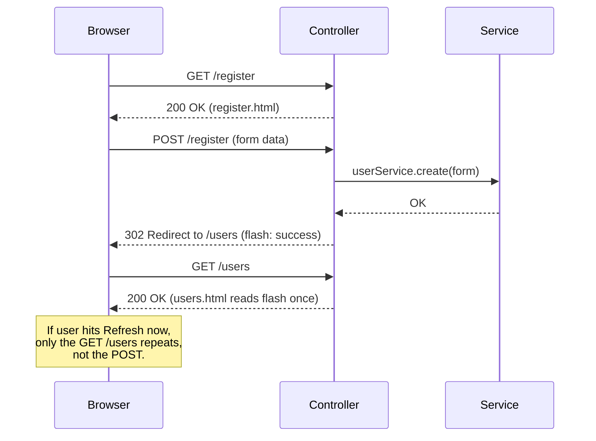

# Spring MVC Controllers, Forms, and Validation

Date: 2026-04-17
Tags: spring-mvc, forms, validation, thymeleaf, web-layer

## Table of Contents

- [Summary](#summary)
- [@Controller vs @RestController](#controller-vs-restcontroller)
- [Displaying a Form (GET)](#displaying-a-form-get)
- [@ModelAttribute in Depth](#modelattribute-in-depth)
- [Form Submission (POST) with Validation](#form-submission-post-with-validation)
- [BindingResult Parameter Ordering](#bindingresult-parameter-ordering)
- [Post/Redirect/Get (PRG)](#postredirectget-prg)
- [Flash Attributes](#flash-attributes)
- [Path and Query Parameters](#path-and-query-parameters)
- [Form Validation Annotations](#form-validation-annotations)
- [Displaying Validation Errors in Thymeleaf](#displaying-validation-errors-in-thymeleaf)
- [Custom Editors and Converters](#custom-editors-and-converters)
- [Multipart File Uploads](#multipart-file-uploads)
- [CSRF Tokens](#csrf-tokens)
- [Internationalized Error Messages](#internationalized-error-messages)
- [Session-Scoped Controllers](#session-scoped-controllers)
- [Global Exception Handling for Controllers](#global-exception-handling-for-controllers)
- [Common Bugs](#common-bugs)
- [Related](#related)
- [References](#references)

---

## Summary

In servlet-stack Spring MVC, form-driven web pages are served by `@Controller` classes (not `@RestController`). A `@Controller` handler method typically returns a **view name** (a logical reference to a template such as a Thymeleaf HTML file), and the view is rendered with data pulled from the `Model`.

This document focuses on the server-side mechanics:

- Binding request parameters to a form-backing bean via `@ModelAttribute`.
- Applying bean validation (`@Valid`) and surfacing failures via `BindingResult`.
- Implementing the **Post/Redirect/Get (PRG)** pattern with `redirect:` view names and `RedirectAttributes` flash attributes.
- Wiring custom converters, file uploads, CSRF protection, i18n error messages, and session state.

Thymeleaf is the canonical view technology for Spring MVC today; templates live under `src/main/resources/templates/` and bind to model attributes by name.

---

## @Controller vs @RestController

Both annotations are stereotypes of `@Component`, but they differ in how return values are handled:

| Annotation | Composition | Default return handling | Typical use |
|------------|-------------|-------------------------|-------------|
| `@Controller` | `@Component` | String return = **view name**; the framework resolves it to a template | HTML pages with Thymeleaf |
| `@RestController` | `@Controller` + `@ResponseBody` | Return value is **serialized to the HTTP body** (usually JSON) | REST APIs |

```java
@Controller
public class UserPageController {

    @GetMapping("/users")
    public String list(Model model) {
        model.addAttribute("users", userService.findAll());
        return "users/list";   // resolved to templates/users/list.html
    }
}

@RestController
@RequestMapping("/api/users")
public class UserApiController {

    @GetMapping
    public List<UserDto> list() {
        return userService.findAll();   // serialized to JSON
    }
}
```

You can mix bodies and views inside a single `@Controller` by annotating specific methods with `@ResponseBody`, but in practice keep the two concerns in separate classes.

---

## Displaying a Form (GET)

A GET handler prepares an empty (or pre-populated) form-backing bean and places it in the `Model` so the template can render it:

```java
@Controller
@RequestMapping("/register")
public class RegistrationController {

    @GetMapping
    public String showForm(Model model) {
        model.addAttribute("user", new UserForm());
        return "register";   // templates/register.html
    }
}
```

The Thymeleaf template binds to the `user` attribute via `th:object`:

```html
<form th:action="@{/register}" th:object="${user}" method="post">
    <label>Name
        <input type="text" th:field="*{name}" />
    </label>
    <button type="submit">Register</button>
</form>
```

The attribute name on the left (`"user"`) must match the `th:object` name, and must match the `@ModelAttribute("user")` on the POST handler.

---

## @ModelAttribute in Depth

`@ModelAttribute` has two uses:

**1. On a handler method parameter** — tells Spring to look up (or create) a model attribute, bind request parameters to its fields, and expose it back to the model:

```java
public String submit(@ModelAttribute("user") UserForm form) { ... }
```

If the name is omitted, Spring derives it from the class name (`userForm` here).

**2. On a method inside a controller** — runs before every request in that controller and populates a shared attribute:

```java
@ModelAttribute("countries")
public List<Country> countries() {
    return countryService.findAll();
}
```

This is great for drop-down options rendered on many pages, but beware: **it runs for every request in the controller**, so guard heavy work with caching or move it to a narrower controller.

---

## Form Submission (POST) with Validation

The POST handler binds the submitted parameters to the form bean, validates it, and either re-renders the form or redirects on success:

```java
@PostMapping("/register")
public String submit(
        @Valid @ModelAttribute("user") UserForm form,
        BindingResult result,
        RedirectAttributes redirectAttrs) {

    if (result.hasErrors()) {
        return "register";   // re-render with field errors
    }

    userService.create(form);
    redirectAttrs.addFlashAttribute("success", "User created");
    return "redirect:/users";
}
```

Key points:

- `@Valid` triggers Jakarta Bean Validation on `UserForm`.
- `BindingResult` captures binding failures (e.g., non-numeric input for an `int` field) **and** validation failures (e.g., `@NotBlank` violation).
- On error, return the **same view name** as the GET handler so the user sees their input with inline errors.
- On success, return a `redirect:` view name so a browser refresh does not re-submit.

---

## BindingResult Parameter Ordering

**`BindingResult` must appear immediately after the argument it describes.** Spring binds the result to the parameter that directly precedes it; if another parameter sneaks in, errors are silently lost and a `BindException` is thrown instead.

```java
// CORRECT
public String submit(@Valid @ModelAttribute UserForm form,
                     BindingResult result,
                     Model model) { ... }

// WRONG — BindingResult is separated from UserForm
public String submit(@Valid @ModelAttribute UserForm form,
                     Model model,
                     BindingResult result) { ... }
```

This rule applies per validated argument. If you validate two beans in the same handler, each needs its own `BindingResult` immediately after it.

---

## Post/Redirect/Get (PRG)

The PRG pattern avoids duplicate submissions on browser refresh:



Mechanics in Spring MVC:

- Return a string starting with `redirect:` (`"redirect:/users"`).
- Spring issues an HTTP 302 with the `Location` header and the browser follows with a GET.
- Any `RedirectAttributes.addFlashAttribute(...)` values survive exactly one redirect.

Without `redirect:`, the POST response renders a template directly at `/register`, and the browser's refresh button re-submits the same POST.

---

## Flash Attributes

Flash attributes are a short-lived payload that lives across a single redirect, stored in the session and removed on first read.

```java
redirectAttrs.addFlashAttribute("success", "User created");
return "redirect:/users";
```

In the target template:

```html
<div th:if="${success}" class="alert" th:text="${success}"></div>
```

When to use them:

- Success or error banners after a POST.
- A small object (e.g., the created entity's ID) that the next page needs.

When **not** to use them:

- Long-lived state — that belongs in the database or a proper session attribute.
- Large payloads — they inflate session memory.

---

## Path and Query Parameters

The same binding annotations work the same way as in WebFlux:

```java
@GetMapping("/users/{id}")
public String show(@PathVariable Long id, Model model) {
    model.addAttribute("user", userService.findById(id));
    return "users/show";
}

@GetMapping("/users")
public String list(
        @RequestParam(required = false) String q,
        @RequestParam(defaultValue = "10") int limit,
        Model model) {
    model.addAttribute("users", userService.search(q, limit));
    return "users/list";
}
```

Notes:

- `@PathVariable` is required by default; mark it `required = false` to allow omission.
- `@RequestParam` bundles well with `defaultValue` to avoid null-checks downstream.
- For complex filter objects, use `@ModelAttribute` on a filter DTO instead of many `@RequestParam` parameters.

---

## Form Validation Annotations

Use Jakarta Bean Validation (JSR 380) on the form-backing class:

```java
public class UserForm {

    @NotBlank
    @Size(min = 2, max = 50)
    private String name;

    @NotBlank
    @Email
    private String email;

    @Min(18)
    @Max(120)
    private int age;

    @Pattern(regexp = "\\+?[0-9 -]{7,15}")
    private String phone;

    // getters, setters
}
```

Common annotations:

| Annotation | Applies to | Meaning |
|------------|-----------|---------|
| `@NotNull` | any | value must be non-null |
| `@NotBlank` | String | non-null, trimmed length > 0 |
| `@NotEmpty` | String/Collection | non-null, size > 0 |
| `@Size(min, max)` | String/Collection | length or size constraint |
| `@Email` | String | well-formed email |
| `@Min` / `@Max` | numeric | numeric bounds |
| `@Pattern(regexp)` | String | regex match |
| `@Past` / `@Future` | date/time | temporal constraint |
| `@AssertTrue` / `@AssertFalse` | boolean | required value |

Custom constraints (e.g., `@UniqueUsername`) are implemented with a `ConstraintValidator`. See `../validation/bean-validation.md` for the full treatment.

---

## Displaying Validation Errors in Thymeleaf

Thymeleaf's `#fields` helper reads from the `BindingResult` that Spring put in the model:

```html
<form th:action="@{/register}" th:object="${user}" method="post">
    <div>
        <label for="name">Name</label>
        <input id="name" type="text"
               th:field="*{name}"
               th:classappend="${#fields.hasErrors('name')} ? 'error'" />
        <span class="field-error"
              th:if="${#fields.hasErrors('name')}"
              th:errors="*{name}"></span>
    </div>

    <ul th:if="${#fields.hasGlobalErrors()}">
        <li th:each="err : ${#fields.globalErrors()}" th:text="${err}"></li>
    </ul>

    <button type="submit">Register</button>
</form>
```

- `th:field="*{name}"` generates `id`, `name`, and `value` attributes bound to the `user.name` property.
- `th:errors="*{name}"` prints the localized error messages for that field.
- `#fields.hasGlobalErrors()` covers class-level constraints (e.g., `@ScriptAssert`).

See `thymeleaf-and-views.md` for the full template playbook.

---

## Custom Editors and Converters

When request strings need non-trivial conversion (e.g., `"2026-04-17"` → `LocalDate`, or a custom ID type), register a converter.

**Per-controller via `@InitBinder`:**

```java
@Controller
public class OrderController {

    @InitBinder
    public void initBinder(WebDataBinder binder) {
        binder.registerCustomEditor(LocalDate.class,
            new CustomLocalDatePropertyEditor("yyyy-MM-dd"));
    }
}
```

**Application-wide via `WebMvcConfigurer`:**

```java
@Configuration
public class WebConfig implements WebMvcConfigurer {

    @Override
    public void addFormatters(FormatterRegistry registry) {
        registry.addConverter(new StringToProductIdConverter());
        registry.addFormatter(new DateFormatter("yyyy-MM-dd"));
    }
}
```

Prefer the global approach when the conversion is reusable. Use `@InitBinder` for one-off cases or to restrict the custom rule to a specific controller.

---

## Multipart File Uploads

Enable the multipart resolver (Spring Boot does this by default) and declare a `MultipartFile` parameter:

```java
@PostMapping("/avatar")
public String upload(@RequestParam("file") MultipartFile file,
                     RedirectAttributes redirectAttrs) throws IOException {

    if (file.isEmpty()) {
        redirectAttrs.addFlashAttribute("error", "Please pick a file");
        return "redirect:/profile";
    }

    avatarService.store(file.getOriginalFilename(), file.getInputStream());
    redirectAttrs.addFlashAttribute("success", "Avatar uploaded");
    return "redirect:/profile";
}
```

The form must use `enctype="multipart/form-data"`:

```html
<form th:action="@{/avatar}" method="post" enctype="multipart/form-data">
    <input type="file" name="file" />
    <button type="submit">Upload</button>
</form>
```

Size limits in `application.yml`:

```yaml
spring:
  servlet:
    multipart:
      max-file-size: 5MB
      max-request-size: 10MB
```

Validate content type and extension server-side; never trust the filename or MIME type reported by the browser.

---

## CSRF Tokens

Spring Security enables CSRF protection by default for state-changing HTTP methods (POST, PUT, DELETE, PATCH). Thymeleaf's Spring Security dialect auto-injects a hidden `_csrf` field into every `<form method="post">`, so you usually do not write anything extra:

```html
<!-- Rendered HTML contains an auto-injected hidden input -->
<input type="hidden" name="_csrf" value="..." />
```

Disabling CSRF (`http.csrf(AbstractHttpConfigurer::disable)`) is only safe for stateless APIs using bearer tokens, never for browser-rendered HTML forms. See `../security/security-filter-chain.md`.

For AJAX submissions, read the token from a meta tag and send it in the `X-CSRF-TOKEN` header.

---

## Internationalized Error Messages

Default validation messages (e.g., `"must not be blank"`) come from the Hibernate Validator resource bundle. To override them, place a `ValidationMessages.properties` file on the classpath, or hook into the Spring `MessageSource` using the `{key}` convention.

**`messages.properties`:**

```properties
NotBlank.user.name=Name is required
Size.user.name=Name must be between {2} and {1} characters
Email.user.email=Please enter a valid email address
```

The key convention is `{ConstraintName}.{modelAttribute}.{field}`, falling back through shorter keys (`NotBlank.name`, `NotBlank`). Spring resolves the message using the current `Locale`.

Configure a resource bundle message source and `LocalValidatorFactoryBean` that delegates to it — Spring Boot does this automatically if a `messages.properties` file is present. See `static-resources-and-i18n.md`.

---

## Session-Scoped Controllers

For multi-step wizards where form data must survive several requests, mark the controller with `@SessionAttributes`:

```java
@Controller
@RequestMapping("/wizard")
@SessionAttributes("registration")
public class RegistrationWizardController {

    @ModelAttribute("registration")
    public RegistrationForm init() {
        return new RegistrationForm();
    }

    @PostMapping("/step1")
    public String step1(@ModelAttribute("registration") RegistrationForm form) {
        return "redirect:/wizard/step2";
    }

    @PostMapping("/finish")
    public String finish(@ModelAttribute("registration") RegistrationForm form,
                         SessionStatus status) {
        registrationService.create(form);
        status.setComplete();    // clears the session attribute
        return "redirect:/welcome";
    }
}
```

Call `SessionStatus.setComplete()` when the wizard finishes; otherwise the data lingers in the session. Keep the form-backing object small to avoid session bloat.

---

## Global Exception Handling for Controllers

For HTML controllers, `@ControllerAdvice` should return **view names**, not JSON:

```java
@ControllerAdvice(annotations = Controller.class)
public class WebExceptionHandler {

    @ExceptionHandler(UserNotFoundException.class)
    public String notFound(UserNotFoundException ex, Model model) {
        model.addAttribute("message", ex.getMessage());
        return "errors/404";      // templates/errors/404.html
    }

    @ExceptionHandler(Exception.class)
    public String generic(Exception ex, Model model) {
        log.error("Unhandled controller exception", ex);
        model.addAttribute("message", "Something went wrong.");
        return "errors/500";
    }
}
```

Scope the advice with `annotations = Controller.class` (or `basePackages`) so it does not accidentally turn REST JSON errors into HTML pages. See `../validation/exception-handling.md`.

---

## Common Bugs

1. **`BindingResult` in the wrong position** — placed after another parameter, so Spring never wires it up and a `BindException` is thrown instead of the form re-rendering.
2. **Forgetting the `redirect:` prefix** — the POST handler returns `"users/list"` directly, the URL stays `/register`, and a browser refresh silently submits the form again.
3. **Model-attribute name mismatch** — the GET handler adds `"userForm"` but the template uses `th:object="${user}"`. Result: an empty form bean on POST, no validation errors ever fire.
4. **`@ModelAttribute` on a method without thinking about cost** — populates a drop-down on every request in the controller, hitting the database dozens of times per page. Cache it, narrow the controller scope, or fetch lazily via AJAX.
5. **Using `th:utext` on user input** — bypasses Thymeleaf's HTML escaping and opens a stored-XSS hole. Reserve `th:utext` for trusted markup only.
6. **Redirecting with large payloads via flash attributes** — forces the full object into the session for every user; prefer a lookup by ID on the next page.
7. **Disabling CSRF on HTML forms** — makes the whole app vulnerable; only disable for stateless APIs.
8. **Returning an entity straight to the view** — exposes internal fields (e.g., `passwordHash`). Use a dedicated view model or DTO.
9. **Mutating form beans directly for business logic** — the form is a transport object. Convert to a domain object in the service layer; do not persist the form.
10. **Ignoring locale** — hard-coding English error messages. Always go through `messages.properties` so i18n works later without a rewrite.

---

## Related

- [spring-mvc-fundamentals.md](./spring-mvc-fundamentals.md)
- [thymeleaf-and-views.md](./thymeleaf-and-views.md)
- [static-resources-and-i18n.md](./static-resources-and-i18n.md)
- [session-management.md](./session-management.md)
- [../validation/bean-validation.md](../validation/bean-validation.md)
- [../validation/exception-handling.md](../validation/exception-handling.md)
- [../security/security-filter-chain.md](../security/security-filter-chain.md)

---

## References

- Spring Framework reference — Web MVC: <https://docs.spring.io/spring-framework/reference/web/webmvc.html>
- Spring MVC form handling: <https://docs.spring.io/spring-framework/reference/web/webmvc/mvc-controller/ann-methods/modelattrib-method-args.html>
- Thymeleaf + Spring integration: <https://www.thymeleaf.org/doc/tutorials/3.1/thymeleafspring.html>
- Jakarta Bean Validation 3.0 specification: <https://jakarta.ee/specifications/bean-validation/3.0/>
- Hibernate Validator reference: <https://docs.jboss.org/hibernate/validator/8.0/reference/en-US/html_single/>
- Spring Boot file upload guide: <https://spring.io/guides/gs/uploading-files/>
- Spring Security CSRF: <https://docs.spring.io/spring-security/reference/servlet/exploits/csrf.html>
