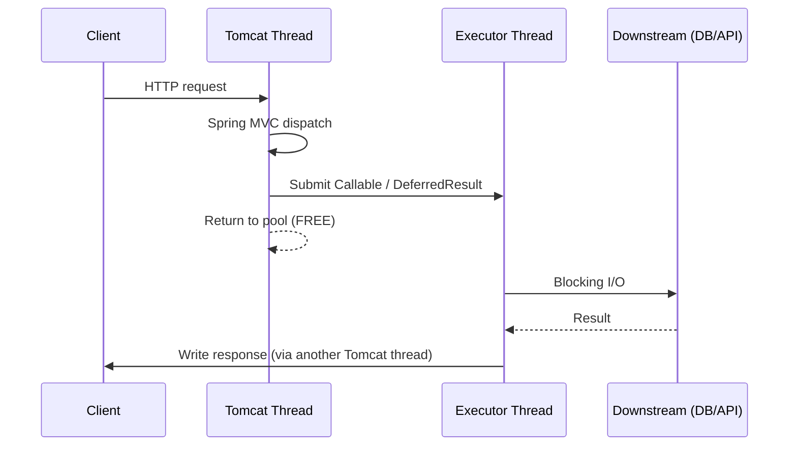

# Scaling Spring MVC Before Virtual Threads — Async Servlet, Tuning, and Resilience

**Date:** 2026-04-18 | **Updated:** 2026-04-18
**Tags:** `java` `spring-boot` `spring-mvc` `performance` `concurrency` `tomcat` `resilience4j`

## Table of Contents

- [Summary](#summary)
- [Why Plain Thread-Per-Request Runs Out of Steam](#why-plain-thread-per-request-runs-out-of-steam)
- [The Throughput Equation — Little's Law for Web Servers](#the-throughput-equation--littles-law-for-web-servers)
- [Async Servlet in Spring MVC](#async-servlet-in-spring-mvc)
  - [Callable — Offload to a TaskExecutor](#callable--offload-to-a-taskexecutor)
  - [WebAsyncTask — Callable with Timeout and Executor](#webasynctask--callable-with-timeout-and-executor)
  - [DeferredResult — Decouple From a Thread Entirely](#deferredresult--decouple-from-a-thread-entirely)
  - [CompletableFuture Controller Returns](#completablefuture-controller-returns)
  - [Raw AsyncContext and Servlet 3.1 Non-Blocking I/O](#raw-asynccontext-and-servlet-31-non-blocking-io)
  - [StreamingResponseBody](#streamingresponsebody)
- [Thread Pool Tuning](#thread-pool-tuning)
  - [Request-Handling Pool (`server.tomcat.threads.*`)](#request-handling-pool-servertomcatthreads)
  - [MVC Async TaskExecutor](#mvc-async-taskexecutor)
  - [Context Propagation — MDC, Security, Transactions](#context-propagation--mdc-security-transactions)
- [Choosing a Servlet Container and Connector](#choosing-a-servlet-container-and-connector)
  - [Tomcat NIO vs NIO2 vs APR](#tomcat-nio-vs-nio2-vs-apr)
  - [Tomcat vs Undertow vs Jetty](#tomcat-vs-undertow-vs-jetty)
  - [HTTP/2 and Keep-Alive](#http2-and-keep-alive)
- [Connection Pool Sizing (HikariCP)](#connection-pool-sizing-hikaricp)
- [Back-Pressure and Load Shedding Without Reactive](#back-pressure-and-load-shedding-without-reactive)
  - [Semaphore Bulkheads](#semaphore-bulkheads)
  - [Resilience4j Bulkhead](#resilience4j-bulkhead)
  - [Resilience4j RateLimiter](#resilience4j-ratelimiter)
  - [Resilience4j TimeLimiter](#resilience4j-timelimiter)
  - [Circuit Breaker](#circuit-breaker)
- [Caching the Hot Path](#caching-the-hot-path)
- [A Worked Example — 10× Throughput Without Going Reactive](#a-worked-example--10-throughput-without-going-reactive)
- [Why Virtual Threads Change the Math](#why-virtual-threads-change-the-math)
- [Related](#related)
- [References](#references)

---

## Summary

Before virtual threads (JDK 21) and before WebFlux, a Spring MVC service hit a scaling wall when blocked I/O calls held platform threads hostage: a 200-thread Tomcat pool with 100 ms JDBC calls caps out around ~2000 req/s no matter how much CPU you have. The pre-VT toolkit for pushing past that ceiling has five levers: **async servlet** (`Callable`, `DeferredResult`, `CompletableFuture`) releases the request thread during blocking work; **container tuning** (NIO connector, `maxThreads`, `acceptCount`, HTTP/2) sets the upper bound on concurrent requests; **connection pool sizing** keeps the database from being the real bottleneck; **back-pressure via Resilience4j** bulkheads and circuit breakers keeps overload from cascading; and **caching** removes load entirely. Used together, a well-tuned Spring MVC 5.x service on JDK 11 or 17 handles tens of thousands of concurrent users on modest hardware. None of it goes away on VTs — virtual threads just make the "release the thread" trick automatic.

---

## Why Plain Thread-Per-Request Runs Out of Steam

A default Spring Boot 3.x MVC app runs on embedded Tomcat with 200 request-handling threads. Every in-flight request occupies exactly one thread from start to finish. If that thread blocks on I/O — JDBC query, REST call, Redis lookup — it sits idle, holding the slot, doing nothing.

The ceiling is quickly reached:

- 200 threads × 50 ms avg response = **4,000 req/s** (theoretical max under Little's Law).
- With 100 ms DB latency dominating: 200 threads × 100 ms = **2,000 req/s** max.
- Raising `maxThreads` to 1000 burns ~1–2 GB of stack memory (1–2 MB per thread) and adds context-switch overhead that often reduces throughput.
- Connection pool contention, CPU thrashing, and GC pressure kick in before the thread count helps.

The pre-VT escape hatches — async servlets and WebFlux — both target the same thing: **decouple the request lifecycle from a single thread**. WebFlux does it with event loops and reactive types. Async servlet does it with `Callable` / `DeferredResult`, keeping you in imperative MVC code.

---

## The Throughput Equation — Little's Law for Web Servers

[Little's Law](https://en.wikipedia.org/wiki/Little%27s_law) ties throughput to concurrency and latency:

```text
L = λ × W

L = average concurrent requests in the system
λ = throughput (requests/sec)
W = average latency (sec)
```

Rearranged: **throughput = concurrent capacity / latency**.

| Scenario | Concurrent capacity | Latency | Max throughput |
|----------|---------------------|---------|----------------|
| 200 Tomcat threads, sync controllers | 200 | 100 ms | 2,000 req/s |
| 200 Tomcat threads, sync, 500 ms latency | 200 | 500 ms | 400 req/s |
| Async servlet releasing thread on I/O, 50 in-flight DB calls | 50 (real concurrency at DB) | 100 ms | 500 req/s at DB, 10k+ at edge |
| WebFlux event loop, non-blocking HTTP | thousands | 100 ms | 10k+ req/s |
| Virtual threads | 10k+ | 100 ms | 10k+ req/s, same code as sync |

Concurrency is the lever you actually control — and async servlet lets you raise it without the stack-memory cost of platform threads.

---

## Async Servlet in Spring MVC

Servlet 3.0 introduced async request processing; Spring MVC wraps it in four idiomatic styles. All of them return the request thread to the pool immediately and complete the response later on a different thread.

Lifecycle:



The request thread is held only for ~1–5 ms of Spring dispatching and controller entry — not the full 100 ms of the downstream call. That is the whole game.

### Callable — Offload to a TaskExecutor

Simplest form. Returning a `Callable<T>` from a controller tells Spring to run the blocking work on a `TaskExecutor` and release the servlet thread meanwhile:

```java
@GetMapping("/report")
public Callable<Report> slowReport() {
    return () -> reportService.generate();   // runs on MVC async executor
}
```

Configure the executor via `WebMvcConfigurer`:

```java
@Configuration
public class MvcAsyncConfig implements WebMvcConfigurer {
    @Override
    public void configureAsyncSupport(AsyncSupportConfigurer cfg) {
        ThreadPoolTaskExecutor executor = new ThreadPoolTaskExecutor();
        executor.setCorePoolSize(50);
        executor.setMaxPoolSize(200);
        executor.setQueueCapacity(500);
        executor.setThreadNamePrefix("mvc-async-");
        executor.initialize();
        cfg.setTaskExecutor(executor);
        cfg.setDefaultTimeout(10_000);   // 10 s
    }
}
```

Without this config, Spring uses `SimpleAsyncTaskExecutor` — which **creates a new thread per request**. In production, always set a bounded executor.

### WebAsyncTask — Callable with Timeout and Executor

Gives per-request control over timeout and executor:

```java
@GetMapping("/slow")
public WebAsyncTask<Report> slowReport() {
    Callable<Report> work = () -> reportService.generate();
    WebAsyncTask<Report> task = new WebAsyncTask<>(5_000L, "reportExecutor", work);
    task.onTimeout(() -> Report.emptyTimeout());
    task.onError(() -> Report.emptyError());
    return task;
}
```

Prefer this over `Callable` when different endpoints need different timeouts or executors.

### DeferredResult — Decouple From a Thread Entirely

`DeferredResult<T>` doesn't submit anything automatically. You hand it to some other component (message listener, callback, scheduled task) and complete it whenever the answer arrives:

```java
@GetMapping("/events/{userId}")
public DeferredResult<Event> longPoll(@PathVariable String userId) {
    DeferredResult<Event> result = new DeferredResult<>(30_000L); // 30 s timeout
    eventBus.waitForNextEvent(userId, event -> result.setResult(event));
    result.onTimeout(() -> result.setResult(Event.heartbeat()));
    return result;
}
```

`DeferredResult` is the only pre-VT primitive that handles true long-polling: thousands of clients can wait simultaneously without burning thousands of threads. Use it for:

- Long-polling endpoints.
- Webhook-style "wait for callback" handlers.
- Bridging MVC to message-driven systems (JMS, Kafka) where the completion happens on a broker thread.

### CompletableFuture Controller Returns

Spring MVC since 4.2 natively understands `CompletableFuture<T>`:

```java
@GetMapping("/user/{id}")
public CompletableFuture<UserView> user(@PathVariable String id) {
    return CompletableFuture.supplyAsync(() -> userRepo.findById(id), ioExecutor)
        .thenCombine(
            CompletableFuture.supplyAsync(() -> prefsRepo.findByUserId(id), ioExecutor),
            UserView::new);
}
```

Advantages over `Callable`:

- Compose multiple downstream calls in parallel without blocking a thread.
- Integrates with any `CompletableFuture`-returning library (AWS SDK v2, async JDBC drivers, `WebClient`).
- Error paths use `exceptionally` / `handle` instead of try/catch.

This is the pattern that gives MVC a sizeable fraction of WebFlux's I/O scalability without changing the programming model.

### Raw AsyncContext and Servlet 3.1 Non-Blocking I/O

If you drop below Spring MVC — implementing a `Servlet` directly — you get `AsyncContext` plus `ReadListener` / `WriteListener` for non-blocking request/response bodies:

```java
AsyncContext ac = request.startAsync();
request.getInputStream().setReadListener(new ReadListener() {
    public void onDataAvailable() { /* read available bytes */ }
    public void onAllDataRead() { ac.complete(); }
    public void onError(Throwable t) { ac.complete(); }
});
```

99% of Spring MVC apps never touch this API directly. It matters for custom servlets (file upload handlers, WebSocket upgrade paths, proxy servlets) where request-body streaming matters.

### StreamingResponseBody

For large downloads without loading the whole response into memory:

```java
@GetMapping(value = "/download/{id}", produces = MediaType.APPLICATION_OCTET_STREAM_VALUE)
public ResponseEntity<StreamingResponseBody> download(@PathVariable String id) {
    StreamingResponseBody body = out -> fileService.copyTo(id, out);
    return ResponseEntity.ok()
        .header("Content-Disposition", "attachment; filename=\"" + id + "\"")
        .body(body);
}
```

Spring runs the `accept(OutputStream)` call on the MVC async executor. The request thread is released; only the executor thread is held for the write.

---

## Thread Pool Tuning

### Request-Handling Pool (`server.tomcat.threads.*`)

Spring Boot exposes Tomcat's connector thread pool via `application.yaml`:

```yaml
server:
  tomcat:
    threads:
      max: 400                   # default 200
      min-spare: 20              # default 10
    accept-count: 200            # default 100 — OS backlog after threads are full
    max-connections: 10000       # default 8192 — OS-accepted connections
    connection-timeout: 20s
    keep-alive-timeout: 60s
    max-keep-alive-requests: 100
  compression:
    enabled: true
    mime-types: application/json,text/html,text/css,text/javascript
    min-response-size: 1024
```

Tuning rules:

- **`threads.max`**: if your controllers are 100% async, this only needs to handle the short dispatch window — 100–200 is plenty. If controllers are mostly sync, size by Little's Law with downstream latency.
- **`max-connections`**: this is the number of simultaneously *accepted* connections, regardless of whether they have a thread. Raise to 10k+ for keep-alive-heavy workloads.
- **`accept-count`**: backlog beyond `max-connections`. Keep around 100–200.
- **`min-spare`**: how many threads stay warm. Too low = latency spike on burst; too high = wasted memory.

### MVC Async TaskExecutor

See the `WebMvcConfigurer` example above. Rules:

- Never use `SimpleAsyncTaskExecutor` in production — unbounded thread creation.
- Size the core pool to **the DB connection pool size** — anything more just queues waiting for connections.
- Set a queue capacity so bursts don't immediately reject; tune rejection via a `RejectedExecutionHandler`.

### Context Propagation — MDC, Security, Transactions

Moving work off the servlet thread breaks context. You lose:

- **Logback MDC** — request IDs, user IDs set in a filter.
- **`SecurityContextHolder`** — the authentication is thread-local.
- **`@Transactional`** — Spring's transaction manager binds `Connection` to the current thread.
- **Reactor `Context`** (if interop'ing).

Fixes:

1. **MDC**: use Spring's `TaskDecorator` to copy MDC into the executor thread:

    ```java
    public class MdcTaskDecorator implements TaskDecorator {
        @Override
        public Runnable decorate(Runnable runnable) {
            Map<String, String> context = MDC.getCopyOfContextMap();
            return () -> {
                try {
                    if (context != null) MDC.setContextMap(context);
                    runnable.run();
                } finally {
                    MDC.clear();
                }
            };
        }
    }
    ```

    Attach via `executor.setTaskDecorator(new MdcTaskDecorator())`.

2. **Security**: `SecurityContextHolder.setStrategyName(SecurityContextHolder.MODE_INHERITABLETHREADLOCAL)` or wrap with `DelegatingSecurityContextExecutor`.
3. **Transactions**: do not try to propagate `@Transactional` across threads — it won't work. Open the transaction inside the async method instead, or use `TransactionTemplate`.

See [logging.md](../logging.md) for the full MDC story and [JPA transaction propagation](../jpa-transaction-propagation.md) for why tx is thread-bound.

---

## Choosing a Servlet Container and Connector

### Tomcat NIO vs NIO2 vs APR

Tomcat has three connector implementations. Spring Boot defaults to NIO (`Http11NioProtocol`).

| Connector | Notes |
|-----------|-------|
| **NIO** (default) | Non-blocking accept and read headers; switches to blocking once the request is dispatched. Fine for almost everyone. |
| **NIO2** (`Http11Nio2Protocol`) | Uses `AsynchronousSocketChannel`. Marginally better on very high-connection-count workloads. Rarely worth switching. |
| **APR** (`Http11AprProtocol`) | Native OpenSSL via tcnative. TLS termination is faster. Removed from default Tomcat distribution; requires tcnative install. |

In practice, stay on NIO unless you have a specific measured reason to switch.

### Tomcat vs Undertow vs Jetty

All three are supported Spring Boot starters — replace the dependency to switch:

```gradle
implementation('org.springframework.boot:spring-boot-starter-web') {
    exclude group: 'org.springframework.boot', module: 'spring-boot-starter-tomcat'
}
implementation('org.springframework.boot:spring-boot-starter-undertow')
```

| Server | Strengths | Weaknesses |
|--------|-----------|------------|
| **Tomcat** | Default, most battle-tested, widest ecosystem integration | Slightly higher memory per thread than Undertow |
| **Undertow** | Lower memory, faster HTTP parsing, XNIO event loop available | Less third-party documentation, different tuning knobs |
| **Jetty** | Good WebSocket support, long history, used by Eclipse | Similar perf to Tomcat, no decisive advantage for typical apps |

For throughput alone, benchmarks usually show Undertow ~10–20% faster than Tomcat on micro-benchmarks, but the difference disappears once real business logic and DB calls dominate. The decision is almost always driven by ecosystem fit, not raw speed.

### HTTP/2 and Keep-Alive

HTTP/2 multiplexes many logical streams over one TCP connection. Enabling it reduces the connection count and helps with keep-alive-heavy workloads (browsers, mobile clients):

```yaml
server:
  http2:
    enabled: true
  ssl:
    enabled: true           # HTTP/2 in practice requires TLS
    key-store: classpath:keystore.p12
    key-store-password: ${KEYSTORE_PASSWORD}
```

Keep-alive is on by default. Tune with `server.tomcat.keep-alive-timeout` and `max-keep-alive-requests`. Keeping connections open saves TLS handshake cost — critical for high-throughput APIs serving mobile/browser clients.

---

## Connection Pool Sizing (HikariCP)

The DB pool is almost always the real bottleneck. Spring Boot uses [HikariCP](https://github.com/brettwooldridge/HikariCP) by default.

```yaml
spring:
  datasource:
    hikari:
      maximum-pool-size: 30        # default 10 — too low for most services
      minimum-idle: 10
      connection-timeout: 5000     # 5 s
      validation-timeout: 3000
      idle-timeout: 600000         # 10 min
      max-lifetime: 1800000        # 30 min — beat the DB's wait_timeout
      leak-detection-threshold: 30000
```

Sizing formula (from the HikariCP wiki, paraphrased):

> **pool size = ((core_count × 2) + effective_spindle_count)**

For a modern cloud DB (SSD, no spindle), that is roughly **2× CPU cores**. On a 4-core Postgres instance, start with 8–10 connections. Raising the pool higher rarely helps and often hurts — contention at the DB dominates.

If your MVC app has 200 request threads but only 10 DB connections, 190 threads are *waiting* for a connection. Async servlet + a right-sized pool outperforms huge thread counts + oversized pool every time. Read ["About Pool Sizing"](https://github.com/brettwooldridge/HikariCP/wiki/About-Pool-Sizing) before changing the number.

---

## Back-Pressure and Load Shedding Without Reactive

Reactive has built-in back-pressure. MVC doesn't — you have to bolt it on.

### Semaphore Bulkheads

Simplest form: a JDK `Semaphore` capping concurrent access to a resource:

```java
private final Semaphore slow = new Semaphore(10);   // at most 10 concurrent

public Data callSlowDownstream() {
    if (!slow.tryAcquire(100, TimeUnit.MILLISECONDS)) {
        throw new ResponseStatusException(HttpStatus.SERVICE_UNAVAILABLE, "overloaded");
    }
    try {
        return restTemplate.getForObject("https://slow", Data.class);
    } finally {
        slow.release();
    }
}
```

Hand-rolled and fine for single-purpose usage. For anything serious, use Resilience4j.

### Resilience4j Bulkhead

[Resilience4j](https://resilience4j.readme.io/) is the standard Spring Boot integration (it replaced Netflix Hystrix, which is now in maintenance). Add:

```gradle
implementation 'io.github.resilience4j:resilience4j-spring-boot3:2.2.0'
implementation 'org.springframework.boot:spring-boot-starter-aop'
```

Configuration:

```yaml
resilience4j:
  bulkhead:
    instances:
      downstream-api:
        max-concurrent-calls: 20
        max-wait-duration: 100ms
```

Usage:

```java
@Service
public class DownstreamClient {
    @Bulkhead(name = "downstream-api", type = Bulkhead.Type.SEMAPHORE)
    public Data fetch(String id) {
        return restTemplate.getForObject("https://api.example.com/{id}", Data.class, id);
    }
}
```

When the bulkhead is full, Resilience4j throws `BulkheadFullException` — map it to 503 in a `@ControllerAdvice`.

### Resilience4j RateLimiter

Cap calls per unit time:

```yaml
resilience4j:
  ratelimiter:
    instances:
      downstream-api:
        limit-for-period: 100
        limit-refresh-period: 1s
        timeout-duration: 50ms
```

```java
@RateLimiter(name = "downstream-api")
public Data fetch(String id) { ... }
```

Use for:
- Protecting a rate-limited third-party API from your own fanout.
- Throttling expensive internal endpoints.

### Resilience4j TimeLimiter

Timeouts for `CompletableFuture`-returning methods:

```yaml
resilience4j:
  timelimiter:
    instances:
      downstream-api:
        timeout-duration: 500ms
        cancel-running-future: true
```

```java
@TimeLimiter(name = "downstream-api")
public CompletableFuture<Data> fetch(String id) {
    return CompletableFuture.supplyAsync(() -> blockingCall(id));
}
```

### Circuit Breaker

Stop calling a downstream that is clearly failing, to give it (and your service) time to recover:

```yaml
resilience4j:
  circuitbreaker:
    instances:
      downstream-api:
        sliding-window-size: 20
        failure-rate-threshold: 50
        wait-duration-in-open-state: 30s
        permitted-number-of-calls-in-half-open-state: 3
```

```java
@CircuitBreaker(name = "downstream-api", fallbackMethod = "fetchCached")
public Data fetch(String id) { ... }

private Data fetchCached(String id, Exception ex) {
    return cache.getOrDefault(id, Data.empty());
}
```

Combine bulkhead + circuit breaker + time limiter — each layer handles a different failure mode. Resilience4j's Spring Boot starter exposes all of them as Micrometer metrics; wire to Grafana and watch the state transitions during incidents.

---

## Caching the Hot Path

The fastest request is the one that never runs your code.

```java
@Cacheable(cacheNames = "products", key = "#id")
public Product findById(Long id) {
    return productRepo.findById(id).orElseThrow();
}
```

Layers of caching that move the load needle:

1. **Response cache** — HTTP `Cache-Control: max-age=300, public`. Browsers and CDN respect it; no request reaches your app.
2. **Reverse-proxy cache** — nginx / Cloudflare / CloudFront in front of Spring.
3. **In-memory cache** — `@Cacheable` with Caffeine. ~100 ns per hit. Best for hot reads.
4. **Distributed cache** — `@Cacheable` with Redis. ~1 ms per hit. Best for shared state.

See [Cache Configuration](../configurations/cache-config.md) for the Spring wiring.

A good rule of thumb: if your top endpoint has < 1% cache hit rate, fix the cache before tuning anything else. If it has > 80% hit rate, the remaining tuning is for the long-tail 20%.

---

## A Worked Example — 10× Throughput Without Going Reactive

Starting point:

- Spring Boot 3.1 MVC service, JDK 17.
- 4-core VM, 8 GB RAM.
- Postgres backend, ~50 ms avg query, max 20 connections.
- Baseline: **~400 req/s**, p99 = 800 ms under load.

Progressive tuning:

| Step | Change | Result |
|------|--------|--------|
| 0 | Baseline | 400 req/s, p99 800 ms |
| 1 | Add `@Cacheable` on the top 3 read endpoints (85% hit rate) | 1,200 req/s, p99 400 ms |
| 2 | Switch slow endpoints to `CompletableFuture<T>` with bounded executor (50 threads) | 2,000 req/s, p99 350 ms |
| 3 | Size HikariCP to 20 (was 10), add Resilience4j bulkhead at 40 concurrent downstream calls | 2,800 req/s, p99 300 ms |
| 4 | Tune Tomcat: `max-connections=10000`, `threads.max=100` (lower — async means fewer needed) | 3,200 req/s, p99 280 ms |
| 5 | Enable HTTP/2 + gzip | 3,500 req/s, p99 260 ms |
| 6 | Switch from RestTemplate to `WebClient` (non-blocking HTTP client, even in MVC) | 4,000 req/s, p99 240 ms |

**~10× throughput, same hardware, no WebFlux.** The ceiling at this point is the DB — the next step is either read replicas, aggressive caching, or… virtual threads.

---

## Why Virtual Threads Change the Math

Everything above trades complexity for concurrency. Async servlet, `CompletableFuture`, bulkheads — they all exist to work around "one request = one platform thread". Virtual threads ([JEP 444](https://openjdk.org/jeps/444)) delete that constraint:

- A VT has a ~1 KB stack (vs ~1 MB for platform threads).
- A VT blocked on JDBC, `Thread.sleep`, or a socket read is **unmounted** from its carrier and doesn't consume a platform thread.
- You can run 1M+ VTs on a handful of carriers.

Consequence: plain sync controllers return to being the best code style. You drop the `Callable` / `DeferredResult` / `CompletableFuture` acrobatics and write thread-per-request imperative code that scales further than WebFlux used to.

Caveats, however:

- **Pinning**: `synchronized` blocks pin a VT to its carrier (fixed in [JEP 491](https://openjdk.org/jeps/491), JDK 24). Until then, watch for it.
- **Native/blocking JNI** still pins.
- **Connection pool sizing doesn't change** — the DB is still the bottleneck, and VT doesn't magically give you more connections. See [spring-virtual-threads.md § JDBC](../spring-virtual-threads.md#blocking-jdbc-on-virtual-threads).
- **Back-pressure / bulkheads are still required** — VTs make it *easier* to drown a downstream. Resilience4j patterns apply unchanged.

So: upgrade to JDK 21+ and flip `spring.threads.virtual.enabled=true` when you can. Until then, this doc is your playbook. And even after — connection sizing, caching, and Resilience4j stay exactly the same.

See [Virtual Threads and Spring Boot](../spring-virtual-threads.md) for the migration guide and [Virtual Threads in Java](../java-fundamentals/concurrency/virtual-threads.md) for the underlying JEP 444 mechanics.

---

## Related

- [Spring MVC Fundamentals](spring-mvc-fundamentals.md) — `DispatcherServlet`, controller return types, the async plumbing this doc tunes.
- [Virtual Threads and Spring Boot](../spring-virtual-threads.md) — the post-Loom way to do all of this.
- [Virtual Threads in Java](../java-fundamentals/concurrency/virtual-threads.md) — how VTs work internally.
- [Concurrency Basics](../java-fundamentals/concurrency/concurrency-basics.md) — `ExecutorService`, `CompletableFuture`, synchronization.
- [Async Processing in Spring](../events-async/async-processing.md) — `@Async` for background work (not request handling).
- [Wrapping Blocking JPA Calls in a Reactive Chain](../reactive-blocking-jpa-pattern.md) — the reactive counterpart pattern.
- [Reactive Programming in Java](../reactive-programming-java.md) — WebFlux alternative.
- [Database Configuration](../configurations/database-config.md) — HikariCP, connection lifecycle.
- [Cache Configuration](../configurations/cache-config.md) — Caffeine, Redis, `@Cacheable`.
- [Logging](../logging.md) — MDC propagation across async boundaries.
- [Actuator Deep Dive](../actuator-deep-dive.md) — exposing Resilience4j and executor metrics.
- [JVM Collectors](../jvm-gc/collectors.md) — GC tuning for high-throughput MVC services.

---

## References

- [Servlet 3.1 Specification (JSR 340)](https://jcp.org/en/jsr/detail?id=340) — async servlet and non-blocking I/O.
- [Spring MVC — Async Requests](https://docs.spring.io/spring-framework/reference/web/webmvc/mvc-ann-async.html)
- [Tomcat HTTP Connector Reference](https://tomcat.apache.org/tomcat-10.1-doc/config/http.html)
- [Undertow documentation](https://undertow.io/undertow-docs/undertow-docs-2.3.0/)
- [HikariCP — About Pool Sizing](https://github.com/brettwooldridge/HikariCP/wiki/About-Pool-Sizing) — the definitive source on DB pool sizing.
- [Resilience4j documentation](https://resilience4j.readme.io/docs/getting-started)
- [Resilience4j Spring Boot 3 Starter](https://resilience4j.readme.io/docs/getting-started-3)
- [Little's Law — Wikipedia](https://en.wikipedia.org/wiki/Little%27s_law)
- [JEP 444: Virtual Threads](https://openjdk.org/jeps/444)
- [JEP 491: Synchronize Virtual Threads Without Pinning](https://openjdk.org/jeps/491)
- [Spring Framework `AsyncTaskExecutor` Javadoc](https://docs.spring.io/spring-framework/docs/current/javadoc-api/org/springframework/core/task/AsyncTaskExecutor.html)
- [Baeldung — Spring MVC Async Controller](https://www.baeldung.com/spring-mvc-async-controller) — concise overview with code samples.
