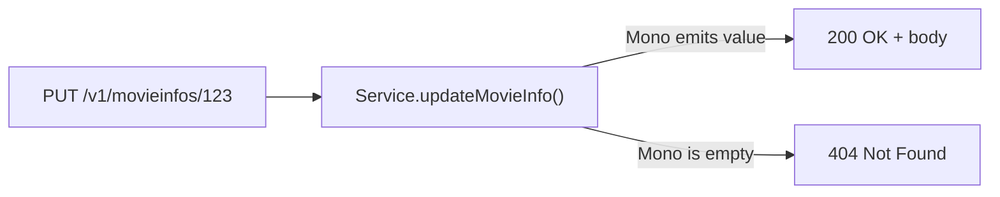
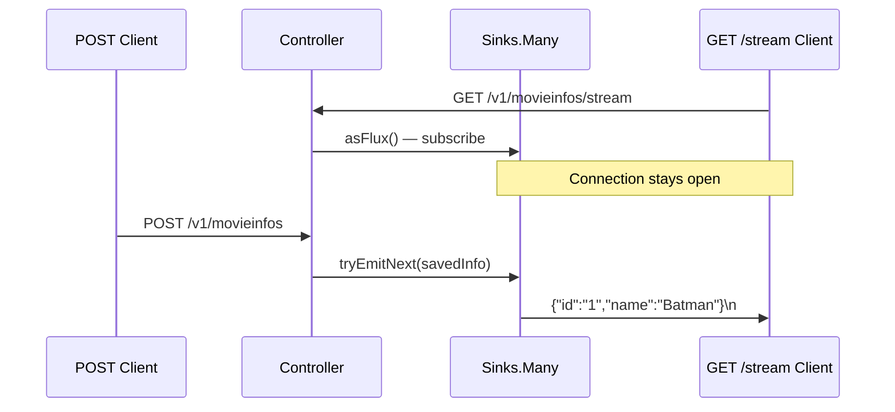

# REST Controller Patterns in Spring Boot — MVC and WebFlux

**Date:** 2026-04-17 | **Updated:** 2026-04-17
**Tags:** `spring-boot` `rest-controller` `webflux` `web-mvc` `functional-endpoints` `streaming` `api-design`

## Table of Contents

- [Summary](#summary)
- [@RestController vs @Controller](#restcontroller-vs-controller)
- [Request Mapping](#request-mapping)
  - [Class-Level Base Path](#class-level-base-path)
  - [HTTP Method Shortcuts](#http-method-shortcuts)
  - [Advanced Path Patterns](#advanced-path-patterns)
- [Extracting Request Data](#extracting-request-data)
  - [@PathVariable](#pathvariable)
  - [@RequestParam](#requestparam)
  - [@RequestBody](#requestbody)
  - [@RequestHeader](#requestheader)
  - [@CookieValue](#cookievalue)
  - [@MatrixVariable](#matrixvariable)
- [Response Patterns](#response-patterns)
  - [Direct Object Return](#direct-object-return)
  - [@ResponseStatus](#responsestatus)
  - [ResponseEntity for Full Control](#responseentity-for-full-control)
- [Content Negotiation](#content-negotiation)
- [Functional Endpoints (WebFlux)](#functional-endpoints-webflux)
  - [RouterFunction + HandlerFunction](#routerfunction--handlerfunction)
  - [Annotation-Based vs Functional — When to Use Each](#annotation-based-vs-functional--when-to-use-each)
- [Streaming Responses](#streaming-responses)
  - [NDJSON with Sinks](#ndjson-with-sinks)
  - [Server-Sent Events (SSE)](#server-sent-events-sse)
- [URI Building](#uri-building)
- [API Versioning Strategies](#api-versioning-strategies)
- [Common Patterns Table](#common-patterns-table)
- [Related](#related)
- [References](#references)

---

## Summary

The **web layer** in Spring is the entry point for HTTP traffic. It maps incoming requests to handler methods (or handler functions), deserializes input, delegates to the service layer, and serializes output. Spring offers two web stacks: **Spring MVC** (servlet-based, blocking, thread-per-request) and **Spring WebFlux** (reactive, non-blocking, event-loop). Both share most of the annotation model (`@RestController`, `@GetMapping`, `@RequestBody`, etc.), but WebFlux additionally supports a **functional endpoint** style using `RouterFunction` and `HandlerFunction`. This document covers both stacks with patterns drawn from this project.

---

## @RestController vs @Controller

`@RestController` is a composed annotation — it combines `@Controller` and `@ResponseBody`:

```java
// These two are equivalent
@RestController
public class MovieInfoController { ... }

@Controller
@ResponseBody
public class MovieInfoController { ... }
```

`@ResponseBody` tells Spring to serialize the return value directly into the HTTP response body (via Jackson for JSON) instead of resolving a view template.

**When to use each:**

| Annotation | Purpose | Return value becomes... |
|------------|---------|------------------------|
| `@Controller` | Server-side rendered views (Thymeleaf, JSP) | A view name resolved by `ViewResolver` |
| `@RestController` | REST APIs returning JSON/XML | Serialized response body |

In this project, every controller uses `@RestController` because the services are pure JSON APIs with no server-rendered HTML.

---

## Request Mapping

### Class-Level Base Path

`@RequestMapping` at the class level sets a base path for all handler methods in the controller:

```java
@RestController
@RequestMapping("/v1")
public class MoviesInfoController {

    @GetMapping("/movieinfos")       // resolves to GET /v1/movieinfos
    public Flux<MovieInfo> getAll() { ... }

    @PostMapping("/movieinfos")      // resolves to POST /v1/movieinfos
    public Mono<MovieInfo> add() { ... }
}
```

This keeps individual method annotations short and groups related endpoints under a version prefix.

### HTTP Method Shortcuts

Spring provides dedicated annotations for each HTTP method — all are specializations of `@RequestMapping`:

| Annotation | HTTP Method | Typical Use |
|------------|-------------|-------------|
| `@GetMapping` | GET | Read resources |
| `@PostMapping` | POST | Create resources |
| `@PutMapping` | PUT | Full update / replace |
| `@PatchMapping` | PATCH | Partial update |
| `@DeleteMapping` | DELETE | Remove resources |

These are preferred over the verbose `@RequestMapping(method = RequestMethod.GET)` form.

### Advanced Path Patterns

```java
// Multiple paths — one handler serves both
@GetMapping({"/movieinfos", "/movies-info"})
public Flux<MovieInfo> getAll() { ... }

// Regex constraint on a path variable
@GetMapping("/movieinfos/{id:[a-f0-9]{24}}")
public Mono<MovieInfo> getById(@PathVariable String id) { ... }

// Wildcard — matches any sub-path
@GetMapping("/api/**")
public Mono<String> catchAll() { ... }
```

---

## Extracting Request Data

### @PathVariable

Extracts values from URI template variables:

```java
// Explicit name binding
@GetMapping("/movieinfos/{id}")
public Mono<ResponseEntity<MovieInfo>> getMovieInfoById(@PathVariable("id") String id) {
    return moviesInfoService.getMovieInfoById(id)
            .map(movieInfo -> ResponseEntity.ok().body(movieInfo))
            .switchIfEmpty(Mono.just(ResponseEntity.notFound().build()));
}

// Implicit binding — parameter name matches the template variable
@DeleteMapping("/movieinfos/{id}")
public Mono<Void> deleteById(@PathVariable String id) {
    return moviesInfoService.deleteMovieInfoById(id);
}
```

When the method parameter name matches the URI variable exactly, the `("id")` value attribute can be omitted. The explicit form is safer when using tools that strip parameter names at compile time (see `-parameters` flag).

### @RequestParam

Extracts query string parameters. This project uses it for optional filtering:

```java
@GetMapping("/movieinfos")
public Flux<MovieInfo> getAllMovieInfos(
        @RequestParam(value = "year", required = false) Integer year) {

    if (year != null) {
        return moviesInfoService.getMovieInfoByYear(year);
    }
    return moviesInfoService.getAllMovieInfos();
}
```

Key attributes:

| Attribute | Purpose | Default |
|-----------|---------|---------|
| `value` / `name` | Query parameter name | Method parameter name |
| `required` | Whether the parameter is mandatory | `true` |
| `defaultValue` | Fallback when absent | none |

```java
// Pagination with defaults
@GetMapping("/items")
public Flux<Item> list(
        @RequestParam(defaultValue = "0") int page,
        @RequestParam(defaultValue = "20") int size) { ... }
```

### @RequestBody

Deserializes the request body (typically JSON) into a Java object. Combined with `@Valid` to trigger Bean Validation:

```java
@PostMapping("/movieinfos")
@ResponseStatus(HttpStatus.CREATED)
public Mono<MovieInfo> addMovieInfo(@RequestBody @Valid MovieInfo movieInfo) {
    return moviesInfoService.addMovieInfo(movieInfo)
            .doOnNext(saved -> movieInfoSink.tryEmitNext(saved));
}
```

- Jackson handles JSON-to-object mapping automatically
- `@Valid` triggers constraint annotations (`@NotBlank`, `@Positive`, etc.) on the DTO
- Validation failures result in a `WebExchangeBindException` (WebFlux) or `MethodArgumentNotValidException` (MVC) which the global error handler can catch

### @RequestHeader

Extracts individual HTTP header values:

```java
@GetMapping("/movieinfos")
public Flux<MovieInfo> getAll(
        @RequestHeader(value = "X-Correlation-Id", required = false) String correlationId) {
    log.info("Correlation ID: {}", correlationId);
    return moviesInfoService.getAllMovieInfos();
}

// Inject all headers at once
@GetMapping("/debug/headers")
public Mono<Map<String, String>> echoHeaders(@RequestHeader Map<String, String> headers) {
    return Mono.just(headers);
}
```

### @CookieValue

Extracts a specific cookie value from the request:

```java
@GetMapping("/preferences")
public Mono<UserPrefs> getPreferences(
        @CookieValue(value = "session-id", required = false) String sessionId) {
    return preferencesService.findBySession(sessionId);
}
```

### @MatrixVariable

Extracts matrix-style parameters from path segments (e.g., `/movies;genre=action;year=2024`). Rarely used, disabled by default in Spring — requires explicit configuration:

```java
// URL: /filter/movies;genre=action;year=2024
@GetMapping("/filter/{category}")
public Flux<Movie> filter(
        @PathVariable String category,
        @MatrixVariable String genre,
        @MatrixVariable int year) { ... }
```

---

## Response Patterns

Spring offers three approaches for controlling HTTP responses, each with increasing control.

### Direct Object Return

The simplest form. Return the object and let Spring handle serialization. Status defaults to `200 OK`:

```java
@GetMapping("/movieinfos")
public Flux<MovieInfo> getAllMovieInfos() {
    return moviesInfoService.getAllMovieInfos();
}
```

### @ResponseStatus

Annotate the method to override the default status code:

```java
@PostMapping("/movieinfos")
@ResponseStatus(HttpStatus.CREATED)    // 201 instead of default 200
public Mono<MovieInfo> addMovieInfo(@RequestBody @Valid MovieInfo movieInfo) {
    return moviesInfoService.addMovieInfo(movieInfo);
}

@DeleteMapping("/movieinfos/{id}")
@ResponseStatus(HttpStatus.NO_CONTENT) // 204
public Mono<Void> deleteMovieInfoById(@PathVariable String id) {
    return moviesInfoService.deleteMovieInfoById(id);
}
```

This works well when the status is always the same for a given endpoint.

### ResponseEntity for Full Control

`ResponseEntity<T>` gives you control over the status code, headers, and body — all within the method logic. Essential when the status depends on runtime conditions:

```java
@PutMapping("/movieinfos/{id}")
public Mono<ResponseEntity<MovieInfo>> updateMovieInfo(
        @RequestBody MovieInfo movieInfo,
        @PathVariable String id) {

    return moviesInfoService.updateMovieInfo(movieInfo, id)
            .map(updated -> ResponseEntity.ok().body(updated))           // 200 if found
            .switchIfEmpty(Mono.just(ResponseEntity.notFound().build())); // 404 if not
}
```

The `switchIfEmpty` pattern is this project's standard approach for handling "update or 404" logic reactively.



**Adding custom headers:**

```java
return Mono.just(
    ResponseEntity.created(uri)
        .header("X-Custom-Header", "value")
        .body(savedEntity)
);
```

---

## Content Negotiation

Control which media types an endpoint produces or consumes using the `produces` and `consumes` attributes:

```java
// Only produces NDJSON — for streaming endpoints
@GetMapping(value = "/movieinfos/stream", produces = MediaType.APPLICATION_NDJSON_VALUE)
public Flux<MovieInfo> streamMovieInfos() {
    return movieInfoSink.asFlux();
}

// Explicit JSON — useful when multiple content types are available
@PostMapping(value = "/movieinfos",
             consumes = MediaType.APPLICATION_JSON_VALUE,
             produces = MediaType.APPLICATION_JSON_VALUE)
public Mono<MovieInfo> addMovieInfo(@RequestBody MovieInfo movieInfo) { ... }
```

Common media type constants:

| Constant | Value |
|----------|-------|
| `APPLICATION_JSON_VALUE` | `application/json` |
| `APPLICATION_NDJSON_VALUE` | `application/x-ndjson` |
| `TEXT_EVENT_STREAM_VALUE` | `text/event-stream` (SSE) |
| `APPLICATION_XML_VALUE` | `application/xml` |

Spring uses the `Accept` header from the client to select the appropriate `HttpMessageConverter` (MVC) or `HttpMessageWriter` (WebFlux). If the client sends `Accept: application/json` and the endpoint only produces NDJSON, Spring returns `406 Not Acceptable`.

---

## Functional Endpoints (WebFlux)

WebFlux offers an alternative to annotation-based controllers: **functional endpoints** using `RouterFunction` and `HandlerFunction`. This project's review service uses this style.

### RouterFunction + HandlerFunction

The router defines the URL-to-handler mapping. The handler processes the request:

```java
@Configuration
public class ReviewRouter {

    @Bean
    public RouterFunction<ServerResponse> reviewsRoute(ReviewsHandler reviewsHandler) {
        return route()
                .nest(path("/v1/reviews"), builder ->
                        builder
                                .GET("", reviewsHandler::getReviews)
                                .POST("", reviewsHandler::addReview)
                                .PUT("/{id}", reviewsHandler::updateReview)
                                .DELETE("/{id}", reviewsHandler::deleteReview)
                                .GET("/stream", reviewsHandler::getReviewsStream))
                .build();
    }
}
```

The handler is a `@Component` where each method takes `ServerRequest` and returns `Mono<ServerResponse>`:

```java
@Component
public class ReviewsHandler {

    public Mono<ServerResponse> getReviews(ServerRequest request) {
        var movieInfoId = request.queryParam("movieInfoId");
        Flux<Review> reviews = movieInfoId.isPresent()
                ? repository.findReviewsByMovieInfoId(Long.valueOf(movieInfoId.get()))
                : repository.findAll();
        return ServerResponse.ok().body(reviews, Review.class);
    }

    public Mono<ServerResponse> addReview(ServerRequest request) {
        return request.bodyToMono(Review.class)
                .doOnNext(this::validate)
                .flatMap(repository::save)
                .flatMap(saved -> ServerResponse.status(HttpStatus.CREATED).bodyValue(saved));
    }
}
```

Key differences from annotation-based controllers:

- No `@GetMapping` or `@PathVariable` — routing is defined in the router bean
- Path variables are extracted via `request.pathVariable("id")`
- Query parameters via `request.queryParam("key")` returning `Optional<String>`
- Request body via `request.bodyToMono(Class)` or `request.bodyToFlux(Class)`
- Responses built explicitly with `ServerResponse.ok().bodyValue(...)` instead of returning objects

### Annotation-Based vs Functional — When to Use Each

| Criterion | Annotation-Based | Functional |
|-----------|-----------------|------------|
| Learning curve | Lower, familiar to Spring MVC devs | Higher, requires lambda fluency |
| Validation | `@Valid` works out of the box | Manual validation in handler |
| Readability | Routes scattered across annotations | Routes collected in one router bean |
| Composition | Harder to compose routes dynamically | Routes are values — easy to compose, filter, nest |
| Testing | `@WebFluxTest` + `WebTestClient` | Test router + handler without full context |
| Error handling | `@ControllerAdvice` | Router-level `.onError()` or `WebExceptionHandler` |

**Rule of thumb:** use annotation-based for straightforward CRUD APIs. Use functional endpoints when you need dynamic route composition, or when you prefer the explicit routing-as-data style. Both are fully supported in production.

---

## Streaming Responses

WebFlux supports streaming data to the client as it becomes available, using two formats: **NDJSON** (Newline-Delimited JSON) and **SSE** (Server-Sent Events).

### NDJSON with Sinks

This project uses `Sinks.Many` as a publish-subscribe mechanism to stream new records to connected clients in real time:

```java
@RestController
@RequestMapping("/v1")
public class MoviesInfoController {

    // Sink acts as a message bus — replay().latest() holds the most recent item
    private Sinks.Many<MovieInfo> movieInfoSink = Sinks.many().replay().latest();

    @PostMapping("/movieinfos")
    @ResponseStatus(HttpStatus.CREATED)
    public Mono<MovieInfo> addMovieInfo(@RequestBody @Valid MovieInfo movieInfo) {
        return moviesInfoService.addMovieInfo(movieInfo)
                .doOnNext(saved -> movieInfoSink.tryEmitNext(saved)); // publish to sink
    }

    @GetMapping(value = "/movieinfos/stream", produces = MediaType.APPLICATION_NDJSON_VALUE)
    public Flux<MovieInfo> streamMovieInfos() {
        return movieInfoSink.asFlux(); // subscribe to sink
    }
}
```



**Sink strategies:**

| Factory Method | Behavior |
|---------------|----------|
| `Sinks.many().replay().latest()` | New subscribers get the latest emitted item, then live updates |
| `Sinks.many().replay().all()` | New subscribers get the entire history |
| `Sinks.many().multicast().onBackpressureBuffer()` | Only live updates, buffered if subscriber is slow |
| `Sinks.many().unicast().onBackpressureBuffer()` | Single subscriber only |

### Server-Sent Events (SSE)

SSE uses `text/event-stream` and wraps each item in the SSE wire format (`data:`, `id:`, `event:` fields):

```java
@GetMapping(value = "/movieinfos/sse", produces = MediaType.TEXT_EVENT_STREAM_VALUE)
public Flux<ServerSentEvent<MovieInfo>> streamSSE() {
    return movieInfoSink.asFlux()
            .map(movieInfo -> ServerSentEvent.<MovieInfo>builder()
                    .id(movieInfo.getMovieInfoId())
                    .event("movie-info")
                    .data(movieInfo)
                    .build());
}
```

SSE is browser-friendly (native `EventSource` API), supports auto-reconnect with `Last-Event-ID`, and works over standard HTTP. NDJSON is simpler for service-to-service streaming where the SSE envelope is unnecessary.

---

## URI Building

`UriComponentsBuilder` constructs URIs for the `Location` header in `201 Created` responses:

```java
@PostMapping("/movieinfos")
public Mono<ResponseEntity<MovieInfo>> addMovieInfo(
        @RequestBody @Valid MovieInfo movieInfo,
        UriComponentsBuilder uriBuilder) {

    return moviesInfoService.addMovieInfo(movieInfo)
            .map(saved -> {
                var uri = uriBuilder.path("/v1/movieinfos/{id}")
                        .buildAndExpand(saved.getMovieInfoId())
                        .toUri();
                return ResponseEntity.created(uri).body(saved);
            });
}
```

The resulting response:

```
HTTP/1.1 201 Created
Location: http://localhost:8080/v1/movieinfos/abc123
Content-Type: application/json

{"movieInfoId":"abc123","name":"Batman Begins",...}
```

Spring automatically populates `UriComponentsBuilder` with the current request's scheme, host, and port when injected as a method parameter. This avoids hardcoding URLs and works correctly behind reverse proxies (when `X-Forwarded-*` headers are configured).

---

## API Versioning Strategies

| Strategy | Example | Pros | Cons |
|----------|---------|------|------|
| **URL path** | `/v1/movieinfos` | Simple, explicit, cacheable, easy to route | URL pollution, harder to sunset |
| **Header-based** | `X-API-Version: 2` | Clean URLs | Invisible in browser, harder to test |
| **Content-type** | `Accept: application/vnd.app.v2+json` | Follows HTTP semantics precisely | Verbose, poor tooling support |
| **Query param** | `/movieinfos?version=2` | Easy to add | Breaks caching, non-standard |

This project uses **URL path versioning** (`/v1/`) — the most common approach in practice:

```java
@RestController
@RequestMapping("/v1")
public class MoviesInfoController { ... }
```

When introducing a breaking change, create a parallel `/v2` controller (or a shared controller with version-specific logic). Keep both versions running during a deprecation period.

---

## Common Patterns Table

Quick reference for standard CRUD controller methods in a WebFlux `@RestController`:

| Operation | HTTP Method | Return Type | Status Code | Pattern |
|-----------|-------------|-------------|-------------|---------|
| List all | `GET` | `Flux<T>` | 200 OK | Direct return |
| Get by ID | `GET` | `Mono<ResponseEntity<T>>` | 200 or 404 | `switchIfEmpty(notFound)` |
| Create | `POST` | `Mono<T>` | 201 Created | `@ResponseStatus(CREATED)` |
| Update | `PUT` | `Mono<ResponseEntity<T>>` | 200 or 404 | `map(ok).switchIfEmpty(notFound)` |
| Delete | `DELETE` | `Mono<Void>` | 204 No Content | `@ResponseStatus(NO_CONTENT)` |
| Stream | `GET` | `Flux<T>` | 200 (chunked) | `produces = NDJSON` |

For the functional endpoint equivalent:

| Operation | Router | Handler Return |
|-----------|--------|----------------|
| List all | `.GET("")` | `ServerResponse.ok().body(flux, T.class)` |
| Get by ID | `.GET("/{id}")` | `ServerResponse.ok().bodyValue(item)` or `.notFound().build()` |
| Create | `.POST("")` | `ServerResponse.status(CREATED).bodyValue(saved)` |
| Update | `.PUT("/{id}")` | `ServerResponse.ok().bodyValue(updated)` |
| Delete | `.DELETE("/{id}")` | `ServerResponse.noContent().build()` |

---

## Related

- [Filters and Interceptors](filters-and-interceptors.md) — middleware for cross-cutting concerns (auth, logging, CORS)
- [Bean Validation](../validation/bean-validation.md) — `@Valid`, constraint annotations, and custom validators
- [Exception Handling](../validation/exception-handling.md) — `@ControllerAdvice`, `GlobalErrorHandler`, and error response patterns
- [Spring Fundamentals](../spring-fundamentals.md) — IoC, DI, AOP, and the annotation model that powers the web layer

## References

- [Spring Web MVC — Annotated Controllers](https://docs.spring.io/spring-framework/reference/web/webmvc/mvc-controller.html) — handler methods, request mapping, response handling in the servlet stack
- [Spring WebFlux — Annotated Controllers](https://docs.spring.io/spring-framework/reference/web/webflux/controller.html) — the reactive equivalent with `Mono`/`Flux` return types
- [Spring WebFlux — Functional Endpoints](https://docs.spring.io/spring-framework/reference/web/webflux-functional.html) — `RouterFunction`, `HandlerFunction`, and the functional programming model
- [Spring WebFlux — WebFlux Config](https://docs.spring.io/spring-framework/reference/web/webflux/config.html) — content negotiation, codecs, CORS configuration
- [Spring Boot — Web](https://docs.spring.io/spring-boot/reference/web/index.html) — auto-configuration for servlet and reactive web stacks
- [Reactor Reference — Sinks](https://projectreactor.io/docs/core/release/reference/index.html#sinks) — `Sinks.Many`, emission strategies, and thread safety
- [Spring ResponseEntity Javadoc](https://docs.spring.io/spring-framework/docs/current/javadoc-api/org/springframework/http/ResponseEntity.html) — builder methods for status, headers, and body
