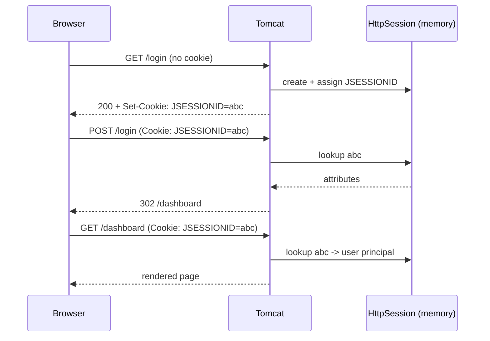
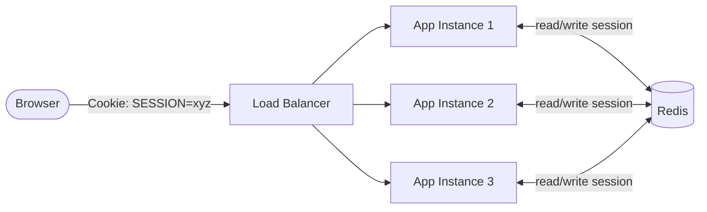
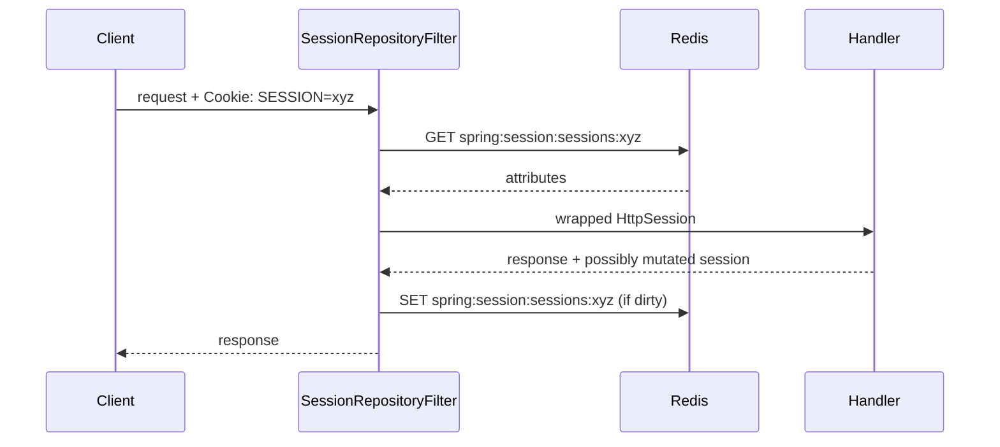

# Session Management in Spring MVC

_Date: 2026-04-17_
_Tags: spring-mvc, session, spring-session, redis, state_

## Table of Contents

- [Summary](#summary)
- [The HttpSession Primer](#the-httpsession-primer)
- [Reading and Writing Session Data](#reading-and-writing-session-data)
- [@SessionAttributes](#sessionattributes)
- [Flash Attributes](#flash-attributes)
- [Session Configuration](#session-configuration)
- [Stateless vs Stateful](#stateless-vs-stateful)
- [The Sticky-Session Problem](#the-sticky-session-problem)
- [Spring Session](#spring-session)
- [Setup with Redis](#setup-with-redis)
- [Serialization](#serialization)
- [Session Fixation Protection](#session-fixation-protection)
- [Session-Scope Beans](#session-scope-beans)
- [Clearing Session Data](#clearing-session-data)
- [WebFlux and WebSession](#webflux-and-websession)
- [Testing](#testing)
- [Common Bugs](#common-bugs)
- [Related](#related)
- [References](#references)

---

## Summary

`HttpSession` is the Servlet API's per-user server-side state store. Spring
MVC layers conveniences on top: `@SessionAttributes` for controller-scoped
model binding, and flash attributes for the redirect-after-POST pattern.

In-memory sessions are fine for a single instance, but break the moment you
scale horizontally. **Spring Session** externalizes session storage into
Redis, JDBC, MongoDB, or Hazelcast, so any instance can serve any request.

Use sessions for server-rendered web apps. Use tokens (JWT, opaque) for REST
APIs that want to stay stateless.

---

## The HttpSession Primer

Key mechanics:

- Created lazily on the first `request.getSession()` (or `getSession(true)`).
- Identified by a `JSESSIONID` cookie by default.
- Attributes are stored as `Object` in a `Map<String, Object>`.
- Default Tomcat storage is in-memory, process-local.
- Destroyed on `invalidate()`, logout, or idle timeout.



---

## Reading and Writing Session Data

Spring injects `HttpSession` directly into handler methods:

```java
@GetMapping("/profile")
public String profile(HttpSession session, Model model) {
    User user = (User) session.getAttribute("user");
    if (user == null) {
        return "redirect:/login";
    }
    model.addAttribute("user", user);
    return "profile";
}

@PostMapping("/login")
public String login(@Valid LoginForm form, HttpSession session) {
    User user = authService.authenticate(form);
    session.setAttribute("user", user);
    return "redirect:/profile";
}
```

Or use `@SessionAttribute` to pull a single value:

```java
@GetMapping("/profile")
public String profile(@SessionAttribute("user") User user) { ... }
```

---

## @SessionAttributes

`@SessionAttributes` is **controller-scoped** — it tells Spring to copy the
named model attributes into the session between requests. Useful for
multi-step wizards where intermediate state must survive across POSTs.

```java
@Controller
@RequestMapping("/signup")
@SessionAttributes("wizard")
public class WizardController {

    @ModelAttribute("wizard")
    public Wizard newWizard() {
        return new Wizard();
    }

    @GetMapping("/step1")
    public String step1() { return "wizard/step1"; }

    @PostMapping("/step1")
    public String submitStep1(
            @Valid @ModelAttribute("wizard") Wizard wizard,
            BindingResult br) {
        if (br.hasErrors()) return "wizard/step1";
        return "redirect:/signup/step2";
    }

    @PostMapping("/finish")
    public String finish(
            @ModelAttribute("wizard") Wizard wizard,
            SessionStatus status) {
        userService.save(wizard);
        status.setComplete();   // IMPORTANT: clear wizard from session
        return "redirect:/done";
    }
}
```

`SessionStatus.setComplete()` evicts the attribute. Forget this and the user
will see stale wizard data if they start over.

---

## Flash Attributes

Flash attributes survive exactly one redirect, then vanish. They're the right
tool for the redirect-after-POST pattern — show a success banner after a
form submission without leaving state in the session forever.

See [mvc-controllers-forms-validation.md](./mvc-controllers-forms-validation.md)
for full coverage. In short:

```java
@PostMapping("/users")
public String create(@Valid UserForm form, RedirectAttributes ra) {
    userService.create(form);
    ra.addFlashAttribute("message", "User created");
    return "redirect:/users";
}
```

Under the hood, `FlashMap` stores the attribute in the session for one
request, then deletes it. No manual cleanup.

---

## Session Configuration

Spring Boot exposes session settings under `server.servlet.session`:

```yaml
server:
  servlet:
    session:
      timeout: 30m
      tracking-modes: cookie   # never URL — rewriting leaks JSESSIONID in logs
      cookie:
        name: MYAPP_SESSION
        http-only: true        # block JS access (XSS defense)
        secure: true           # HTTPS only
        same-site: lax         # CSRF defense
        max-age: 30m
        path: /
```

Production checklist:

- `http-only: true` always.
- `secure: true` in prod; use a profile override for local HTTP dev.
- `same-site: lax` by default, `strict` if you have no cross-site flows.
- Rename the cookie to avoid fingerprinting as "Java app".

---

## Stateless vs Stateful

| Concern              | Server-rendered MVC | REST / SPA / Mobile |
|----------------------|---------------------|---------------------|
| State                | `HttpSession`       | Token (JWT, opaque) |
| Auth carrier         | Session cookie      | `Authorization` header |
| CSRF                 | Required            | Not needed for header-based tokens |
| Scale-out            | Needs Spring Session or sticky LB | Trivially horizontal |
| Mobile clients       | Awkward             | Natural fit |

For pure REST APIs, configure Spring Security with
`SessionCreationPolicy.STATELESS` and do not touch `HttpSession`. See
[../security/oauth2-jwt.md](../security/oauth2-jwt.md).

---

## The Sticky-Session Problem

With in-memory sessions, each app instance has its own session map. Behind a
round-robin load balancer, a user's second request might land on a different
instance — which has never heard of their `JSESSIONID`.

Two fixes:

1. **Sticky sessions**: configure the load balancer to pin a client to one
   instance (usually via a cookie). Simple but fragile — instance restart
   drops every pinned session.
2. **Externalize session storage** (recommended): Spring Session writes
   session state to a shared store (Redis most commonly). Any instance can
   serve any request.

---

## Spring Session

Spring Session replaces the container's `HttpSession` implementation with one
backed by a shared store. Your code keeps using `HttpSession` — no rewrite
needed.



Request lifecycle under Spring Session:



The filter runs early in the chain and swaps `getSession()` for its own
implementation. Everything downstream sees a normal-looking `HttpSession`.

---

## Setup with Redis

Dependencies:

```xml
<dependency>
    <groupId>org.springframework.boot</groupId>
    <artifactId>spring-boot-starter-data-redis</artifactId>
</dependency>
<dependency>
    <groupId>org.springframework.session</groupId>
    <artifactId>spring-session-data-redis</artifactId>
</dependency>
```

Config:

```yaml
spring:
  session:
    store-type: redis
    timeout: 30m
    redis:
      namespace: myapp:session      # key prefix
      flush-mode: on_save
  data:
    redis:
      host: redis.internal
      port: 6379
      password: ${REDIS_PASSWORD}
```

On startup, Spring Boot auto-configures a `RedisIndexedSessionRepository` and
installs the session filter. The cookie name defaults to `SESSION` (not
`JSESSIONID`) to signal the switch.

---

## Serialization

When sessions live outside the JVM, every attribute must serialize cleanly.
Two choices:

**JDK serialization (default):**
- Objects must implement `Serializable`.
- Brittle — adding a field without a `serialVersionUID` plan breaks
  deserialization after deploy.

**Jackson JSON (preferred):**
- No `Serializable` requirement.
- Human-readable in `redis-cli`.
- Forward/backward compatible with `@JsonIgnoreProperties(ignoreUnknown = true)`.
- Requires type info for polymorphic types.

```java
@Configuration
public class SessionConfig implements BeanClassLoaderAware {
    private ClassLoader loader;

    @Bean
    public RedisSerializer<Object> springSessionDefaultRedisSerializer() {
        ObjectMapper mapper = new ObjectMapper();
        mapper.registerModules(SecurityJackson2Modules.getModules(loader));
        return new GenericJackson2JsonRedisSerializer(mapper);
    }

    @Override
    public void setBeanClassLoader(ClassLoader cl) { this.loader = cl; }
}
```

Keep session attributes **small and simple**. Don't store whole Hibernate
entity graphs — store IDs and reload.

---

## Session Fixation Protection

Session fixation is when an attacker pre-sets a victim's session ID, then
hijacks it after the victim logs in. Defense: **rotate the session ID on
authentication**.

Spring Security does this by default:

```java
@Bean
SecurityFilterChain chain(HttpSecurity http) throws Exception {
    http.sessionManagement(sm -> sm
        .sessionFixation(SessionFixationConfigurer::migrateSession)
        // or .newSession() to start fresh
        .maximumSessions(1)
        .maxSessionsPreventsLogin(false)
    );
    return http.build();
}
```

`migrateSession()` copies attributes to a new ID. `newSession()` wipes them.
Pick `migrateSession` unless you have a reason to drop pre-auth state.

---

## Session-Scope Beans

Spring can scope a bean to the session:

```java
@Component
@Scope(value = WebApplicationContext.SCOPE_SESSION,
       proxyMode = ScopedProxyMode.TARGET_CLASS)
public class ShoppingCart {
    private final List<Item> items = new ArrayList<>();
    // ...
}
```

The proxy lets you inject it into singletons. Each user gets their own
instance, stored in their session.

Honest take: this is rarely the right tool. It's almost always cleaner to
pass an explicit cart ID and load data from the database. Session-scope
beans are serializable landmines once Spring Session enters the picture.

---

## Clearing Session Data

Manual:

```java
@PostMapping("/logout")
public String logout(HttpSession session) {
    session.invalidate();
    return "redirect:/";
}
```

With Spring Security, let the framework do it:

```java
http.logout(l -> l
    .logoutUrl("/logout")
    .invalidateHttpSession(true)
    .deleteCookies("SESSION", "remember-me")
    .logoutSuccessUrl("/")
);
```

Spring Security's logout handler invalidates the session, clears the
`SecurityContext`, and deletes named cookies in one shot.

---

## WebFlux and WebSession

WebFlux **does not** expose `HttpSession`. It has a reactive analogue,
`WebSession`, retrieved via `ServerWebExchange.getSession()` returning
`Mono<WebSession>`. Spring Session has a WebFlux module
(`spring-session-data-redis` with reactive Redis) that backs it.

Most reactive / API-first apps skip sessions entirely and use JWT or opaque
tokens. Sessions are a server-rendered-web concern.

---

## Testing

MockMvc supports session attributes directly:

```java
@Test
void profileReturnsUserFromSession() throws Exception {
    User user = new User(1L, "alice");

    mockMvc.perform(get("/profile").sessionAttr("user", user))
        .andExpect(status().isOk())
        .andExpect(model().attribute("user", user));
}

@Test
void wizardFlowClearsSession() throws Exception {
    MockHttpSession session = new MockHttpSession();

    mockMvc.perform(post("/signup/step1").session(session)
            .param("email", "a@b.com"))
        .andExpect(status().is3xxRedirection());

    mockMvc.perform(post("/signup/finish").session(session))
        .andExpect(status().is3xxRedirection());

    assertThat(session.getAttribute("wizard")).isNull();
}
```

For Spring Session + Redis, use Testcontainers to run a real Redis in
integration tests — the JSON serializer behaves differently enough that
mocking Redis misses real bugs.

---

## Common Bugs

- **`NotSerializableException`** after switching to Spring Session. A field
  deep inside a session attribute isn't serializable. Switch to Jackson
  serializer or implement `Serializable` throughout.
- **Wizard data leaks across users / flows.** Forgot `SessionStatus.setComplete()`.
- **Sessions expire earlier than configured.** Redis TTL shorter than
  `server.servlet.session.timeout`, or `maxInactiveInterval` not propagated.
- **Cookie not sent in dev.** `secure: true` plus HTTP dev server — cookie
  is silently dropped. Use a profile override or run HTTPS locally.
- **Session lost across subdomains.** Cookie `domain` attribute missing;
  set it explicitly (`.example.com`) when `app.example.com` and
  `api.example.com` need to share.
- **Session size bloat.** Storing entities with lazy collections serializes
  the whole graph. Store IDs, reload on demand.
- **Serialization incompatibility across deploys.** Adding a field to a
  session-stored class without care breaks live sessions. Prefer JSON +
  ignore-unknown, and drain sessions on breaking changes.
- **Double cookies.** Both `JSESSIONID` (Tomcat) and `SESSION` (Spring
  Session) appear. Disable container session tracking once Spring Session
  is in charge.

---

## Related

- [mvc-controllers-forms-validation.md](./mvc-controllers-forms-validation.md) — flash attributes and form handling
- [spring-mvc-fundamentals.md](./spring-mvc-fundamentals.md) — request lifecycle
- [../security/security-filter-chain.md](../security/security-filter-chain.md) — where session filters sit
- [../security/oauth2-jwt.md](../security/oauth2-jwt.md) — stateless alternative

## References

- Spring Session Reference — https://docs.spring.io/spring-session/reference/
- Spring Boot session properties — https://docs.spring.io/spring-boot/docs/current/reference/html/application-properties.html#application-properties.server.server.servlet.session
- `jakarta.servlet.http.HttpSession` Javadoc — https://jakarta.ee/specifications/servlet/
- OWASP Session Management Cheat Sheet — https://cheatsheetseries.owasp.org/cheatsheets/Session_Management_Cheat_Sheet.html
- Spring Security session management — https://docs.spring.io/spring-security/reference/servlet/authentication/session-management.html
