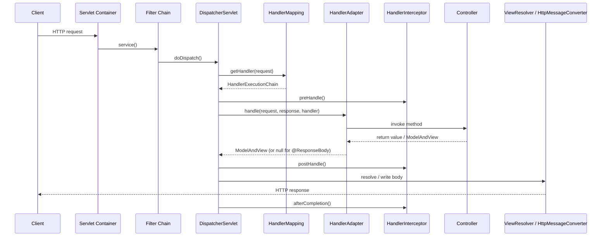
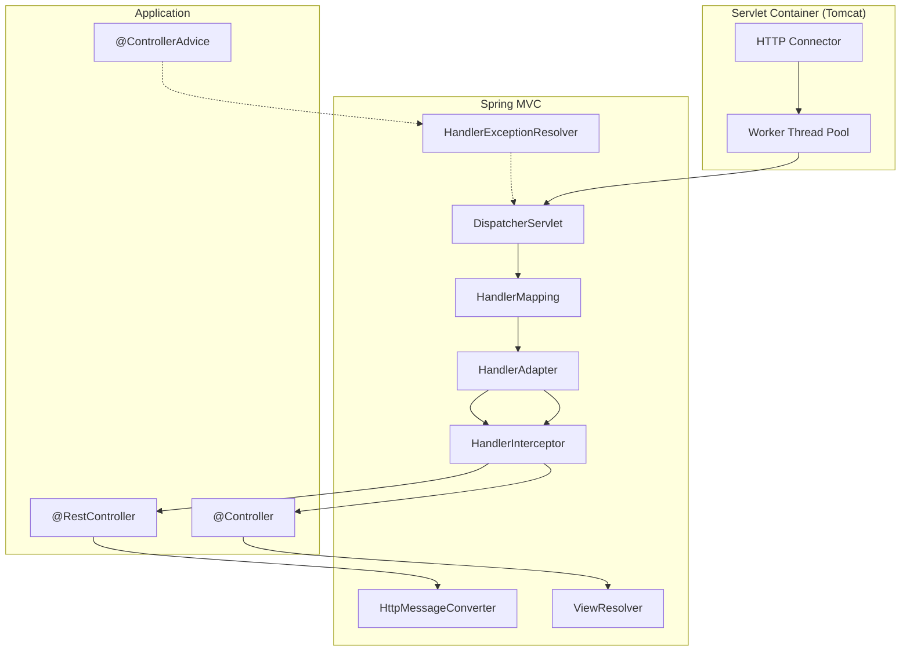

# Spring MVC Fundamentals — for the WebFlux Developer

**Date:** 2026-04-17 | **Updated:** 2026-04-17
**Tags:** `spring` `spring-mvc` `servlet` `web-layer`

## Table of Contents

- [Summary](#summary)
- [The Servlet Stack](#the-servlet-stack)
  - [Servlet API in One Paragraph](#servlet-api-in-one-paragraph)
  - [Request-Per-Thread Model](#request-per-thread-model)
  - [Servlet Containers](#servlet-containers)
- [DispatcherServlet Architecture](#dispatcherservlet-architecture)
  - [Request Flow Diagram](#request-flow-diagram)
  - [High-Level Architecture](#high-level-architecture)
- [Key Components](#key-components)
  - [DispatcherServlet](#dispatcherservlet)
  - [HandlerMapping](#handlermapping)
  - [HandlerAdapter](#handleradapter)
  - [HandlerInterceptor](#handlerinterceptor)
  - [ViewResolver](#viewresolver)
  - [HttpMessageConverter](#httpmessageconverter)
- [MVC vs WebFlux Side-By-Side](#mvc-vs-webflux-side-by-side)
- [Starter Dependencies](#starter-dependencies)
- [Annotations That Translate Directly](#annotations-that-translate-directly)
- [MVC-Only APIs](#mvc-only-apis)
- [Async in MVC](#async-in-mvc)
  - [Callable](#callable)
  - [DeferredResult](#deferredresult)
  - [CompletableFuture](#completablefuture)
- [When to Choose MVC Over WebFlux](#when-to-choose-mvc-over-webflux)
- [Testing](#testing)
- [Migration Notes](#migration-notes)
- [Related](#related)
- [References](#references)

---

## Summary

Spring MVC is the **servlet-stack** web framework that has been Spring's flagship HTTP module since 2004. WebFlux, introduced in Spring Framework 5, is the **reactive-stack** alternative built on Reactive Streams and Netty. They sit side-by-side in the `spring-web` umbrella and share most of the programming model: `@RestController`, `@RequestMapping`, `@PathVariable`, `@RequestBody`, `@ControllerAdvice`, and friends all behave the same at the source level.

The difference is the **runtime**:

- **Spring MVC** runs on the Servlet API (Jakarta Servlet 6 in Spring 6/Boot 3). Each request occupies a dedicated worker thread from start to finish. Blocking I/O is fine because the container is sized with a thread pool large enough to cover concurrent requests (Tomcat default: 200).
- **Spring WebFlux** runs on Reactive Streams over Netty (or a Servlet 3.1+ container in non-blocking mode). A small event-loop pool (usually one per core) handles thousands of concurrent requests. Blocking I/O is forbidden on the event loop.

If you already know WebFlux, learning MVC is mostly about (a) a different mental model for concurrency, (b) a few MVC-only APIs tied to classic servlet semantics, and (c) knowing the internal machinery (`DispatcherServlet`, `HandlerAdapter`, etc.) that WebFlux replaces with `DispatcherHandler` and `HandlerResultHandler`.

---

## The Servlet Stack

### Servlet API in One Paragraph

The **Servlet API** is a Java specification (now Jakarta EE) that defines a contract between a web server and Java code. The two central types are `HttpServletRequest` and `HttpServletResponse`. A `Servlet` is any class that implements `service(request, response)`. The container (Tomcat, Jetty, Undertow) owns the socket, parses the HTTP message, populates the request object, calls your servlet, then serializes the response. Spring MVC ships exactly one servlet — `DispatcherServlet` — and delegates everything else to Spring-managed beans.

```java
// The Servlet API primitives you rarely touch directly in Spring MVC
public interface Servlet {
    void init(ServletConfig config);
    void service(ServletRequest req, ServletResponse res);
    void destroy();
}
```

In WebFlux you never see `HttpServletRequest`. Instead you work with `ServerHttpRequest` / `ServerHttpResponse` wrapped inside a `ServerWebExchange`. Both APIs expose headers, body, query params, etc., but the servlet API is blocking (`InputStream.read()`) while the reactive variants return `Flux<DataBuffer>`.

### Request-Per-Thread Model

In the servlet stack, when a request arrives:

1. The container's acceptor thread picks up the socket.
2. It hands the socket to a **worker thread** from a fixed pool.
3. That worker thread stays bound to the request until the response is fully written.
4. Every blocking call (JDBC, RestTemplate, `Thread.sleep`) simply parks **that** thread; others keep working.

Concurrency scales with the thread pool size. 1,000 simultaneous slow requests require ~1,000 threads. Each thread costs ~1 MB of stack. This is why classical servlet apps top out in the low thousands of concurrent connections — not requests per second, but **in-flight** requests.

Contrast with WebFlux: a handful of event-loop threads multiplex thousands of connections because no thread is ever parked on I/O. The tradeoff is that your code must never block.

**Java 21 virtual threads** (Project Loom) narrow this gap dramatically for MVC. With `spring.threads.virtual.enabled=true` on Boot 3.2+, Tomcat serves each request on a virtual thread. Blocking calls park the virtual thread cheaply (bytes, not megabytes), so the thread-per-request model now scales to hundreds of thousands. For many workloads this removes the primary reason to adopt WebFlux.

### Servlet Containers

Spring Boot embeds the container inside the executable JAR.

| Container | Starter override | Notes |
|-----------|------------------|-------|
| Tomcat    | (default)        | Most widely deployed, battle-tested |
| Jetty     | `spring-boot-starter-jetty` | Lighter footprint, good NIO support |
| Undertow  | `spring-boot-starter-undertow` | XNIO-based, historically strong on throughput |

All three implement the Jakarta Servlet spec, so your application code is portable across them.

---

## DispatcherServlet Architecture

### Request Flow Diagram



### High-Level Architecture



---

## Key Components

### DispatcherServlet

The **front controller** — a single `HttpServlet` mapped to `/` (or `/api/*`, etc.) that receives every request and orchestrates the rest of the pipeline. Spring Boot auto-registers one. Its algorithm, simplified:

```
1. Apply multipart resolution (if content type is multipart/form-data)
2. Find a HandlerExecutionChain from HandlerMapping
3. Find a HandlerAdapter that supports the handler
4. Invoke interceptor preHandle() — abort if false
5. Invoke the handler through the adapter
6. Invoke interceptor postHandle()
7. Resolve the view (or write body via HttpMessageConverter)
8. Invoke interceptor afterCompletion() (always runs, even on error)
```

The WebFlux counterpart is `DispatcherHandler` — same idea, but built on `Mono`/`Flux` and `HandlerResultHandler` rather than `HandlerAdapter`.

### HandlerMapping

Resolves an incoming URL to the right **handler** (usually a controller method). The default implementation is `RequestMappingHandlerMapping`, which indexes every `@RequestMapping`-annotated method at startup into a radix tree of path patterns, HTTP methods, consumes/produces content types, and header conditions.

```java
// At startup, this method gets registered under
//   GET /movies/{id}   produces=application/json
@GetMapping(path = "/movies/{id}", produces = MediaType.APPLICATION_JSON_VALUE)
public Movie getMovie(@PathVariable String id) { ... }
```

Other built-in mappings: `BeanNameUrlHandlerMapping`, `SimpleUrlHandlerMapping` (both legacy XML-era), `RouterFunctionMapping` (for the functional style, which MVC also supports).

### HandlerAdapter

Invokes the resolved handler. Why the indirection? Because a "handler" can be many things — a controller method, a `HttpRequestHandler`, a `Servlet`, a functional `RouterFunction`. Each has its own adapter.

- `RequestMappingHandlerAdapter` — invokes `@RequestMapping` methods, resolves arguments (`@PathVariable`, `@RequestBody`, etc.), invokes the method, processes the return value.
- `HttpRequestHandlerAdapter` — for raw `HttpRequestHandler` beans.
- `SimpleControllerHandlerAdapter` — legacy `Controller` interface.
- `HandlerFunctionAdapter` — functional endpoints.

Argument resolution and return-value handling are pluggable via `HandlerMethodArgumentResolver` and `HandlerMethodReturnValueHandler`. Custom resolvers are how you implement things like `@CurrentUser` parameters.

### HandlerInterceptor

The MVC equivalent of a WebFlux `WebFilter`, but with three hook points instead of one `filter(exchange, chain)`:

```java
public interface HandlerInterceptor {
    boolean preHandle(HttpServletRequest req, HttpServletResponse res, Object handler);
    void postHandle(HttpServletRequest req, HttpServletResponse res, Object handler, ModelAndView mv);
    void afterCompletion(HttpServletRequest req, HttpServletResponse res, Object handler, Exception ex);
}
```

- `preHandle` — before the handler; return `false` to short-circuit.
- `postHandle` — after the handler, **before** the view renders. You can mutate the model here. Does NOT run if the handler threw.
- `afterCompletion` — always runs, even on exception; good for releasing resources or request timing.

Register via `WebMvcConfigurer`:

```java
@Configuration
public class WebConfig implements WebMvcConfigurer {
    @Override
    public void addInterceptors(InterceptorRegistry registry) {
        registry.addInterceptor(new AuditInterceptor())
                .addPathPatterns("/api/**")
                .excludePathPatterns("/api/health");
    }
}
```

For concerns that belong higher up (CORS, GZIP, request logging across the whole app), prefer **Servlet `Filter`** — registered via `FilterRegistrationBean`. Filters run outside the DispatcherServlet; interceptors run inside it and have access to the resolved handler.

### ViewResolver

Turns a logical view name (e.g. `"movie-detail"`) into a concrete `View` that can render into the response (Thymeleaf template, JSP, FreeMarker, etc.). Only relevant for **classic `@Controller`** (server-rendered HTML) endpoints. For `@RestController` methods, the handler return value is serialized by an `HttpMessageConverter` and `ViewResolver` never runs.

Common resolvers: `ThymeleafViewResolver`, `InternalResourceViewResolver` (JSP), `ContentNegotiatingViewResolver`.

WebFlux has the equivalent `ViewResolver` in `spring-webflux` for reactive views.

### HttpMessageConverter

Handles serialization and deserialization of request and response bodies based on `Content-Type` and `Accept` headers. Boot auto-registers:

- `MappingJackson2HttpMessageConverter` — JSON (always present when Jackson is on the classpath)
- `MappingJackson2XmlHttpMessageConverter` — XML
- `StringHttpMessageConverter` — `text/plain`
- `ByteArrayHttpMessageConverter` — raw bytes
- `FormHttpMessageConverter` — `application/x-www-form-urlencoded`

You can register custom converters via `WebMvcConfigurer#configureMessageConverters`. WebFlux uses `HttpMessageReader` / `HttpMessageWriter` instead — different interface, same concept, but the reactive variants return `Flux<DataBuffer>`.

---

## MVC vs WebFlux Side-By-Side

| Aspect | Spring MVC | Spring WebFlux |
|--------|-----------|----------------|
| Stack  | Servlet API (Jakarta Servlet) | Reactive Streams |
| Default server | Tomcat | Netty |
| Alternative servers | Jetty, Undertow | Undertow, Tomcat, Jetty (Servlet 3.1+) |
| Thread model | Thread-per-request (or virtual threads in Java 21+) | Event loop (small fixed pool) |
| Blocking I/O | Allowed | Forbidden on event loop |
| Return types | `T`, `List<T>`, `ResponseEntity<T>`, `Callable<T>`, `DeferredResult<T>`, `CompletableFuture<T>` | `Mono<T>`, `Flux<T>`, `ResponseEntity<Mono<T>>` |
| Filter | Servlet `Filter` + `HandlerInterceptor` | `WebFilter` |
| Request object | `HttpServletRequest` | `ServerHttpRequest` / `ServerWebExchange` |
| Dispatcher | `DispatcherServlet` | `DispatcherHandler` |
| Handler adapter | `HandlerAdapter` | `HandlerResultHandler` |
| Body serialization | `HttpMessageConverter` | `HttpMessageReader` / `HttpMessageWriter` |
| Async model | Servlet 3.0 async + virtual threads | Reactive Streams backpressure |
| Test client | `MockMvc` | `WebTestClient` |
| Data access fit | JDBC, JPA, JdbcTemplate | R2DBC, reactive Mongo, reactive Redis |
| Functional routing | Supported (since 5.2) | Supported (`RouterFunction`) |
| Streaming support | `StreamingResponseBody`, SSE via `SseEmitter` | Native (`Flux<T>`, SSE) |

---

## Starter Dependencies

```xml
<!-- Spring MVC, includes embedded Tomcat -->
<dependency>
    <groupId>org.springframework.boot</groupId>
    <artifactId>spring-boot-starter-web</artifactId>
</dependency>

<!-- Spring WebFlux, includes embedded Netty -->
<dependency>
    <groupId>org.springframework.boot</groupId>
    <artifactId>spring-boot-starter-webflux</artifactId>
</dependency>
```

**You cannot have both starters as "active".** If both are on the classpath, Boot's auto-configuration picks MVC (servlet-based) and WebFlux's auto-configuration backs off. To run WebFlux when MVC is transitively present, exclude `spring-boot-starter-web` or set `spring.main.web-application-type=reactive`.

Within a WebFlux app it **is** fine to pull in `spring-webflux` alone and use `WebClient` from an MVC app — the types ship in the same jar and `WebClient` works on either stack.

---

## Annotations That Translate Directly

These annotations behave the same in both stacks. A controller written in WebFlux style usually compiles and runs under MVC after you change the return types.

| Annotation | Purpose |
|------------|---------|
| `@RestController` | Class-level: `@Controller` + `@ResponseBody` |
| `@Controller` | Class-level: bean becomes a web handler |
| `@RequestMapping` | Map path/method/headers/consumes/produces |
| `@GetMapping`, `@PostMapping`, `@PutMapping`, `@DeleteMapping`, `@PatchMapping` | HTTP-method shortcuts |
| `@PathVariable` | Bind URI template variable |
| `@RequestParam` | Bind query parameter or form field |
| `@RequestBody` | Deserialize request body |
| `@RequestHeader` | Bind a header value |
| `@CookieValue` | Bind a cookie |
| `@ResponseBody` | Serialize return value as body (implicit in `@RestController`) |
| `@ResponseStatus` | Default HTTP status for the handler or an exception |
| `@ControllerAdvice` / `@RestControllerAdvice` | Cross-cutting exception handling, model attributes, binders |
| `@ExceptionHandler` | Method-level exception handler |
| `@Valid` / `@Validated` | Trigger Bean Validation (JSR-380) |
| `@CrossOrigin` | Per-handler CORS |

```java
// Identical source; swap Movie for Mono<Movie> to turn this into WebFlux
@RestController
@RequestMapping("/movies")
class MovieController {
    @GetMapping("/{id}")
    @ResponseStatus(HttpStatus.OK)
    Movie get(@PathVariable String id) { ... }

    @PostMapping
    @ResponseStatus(HttpStatus.CREATED)
    Movie create(@RequestBody @Valid MovieRequest req) { ... }
}
```

---

## MVC-Only APIs

These have no WebFlux analogue (or a very different one) because they assume server-rendered HTML forms and classic servlet sessions.

| API | What it does |
|-----|--------------|
| `@ModelAttribute` | Binds form fields into a POJO; also used to pre-populate a model |
| `BindingResult` | Captures binding/validation errors on a `@ModelAttribute` parameter |
| `ModelAndView` | Return type that bundles a view name and model map |
| `View` / `ViewResolver` | Template rendering pipeline |
| `RedirectAttributes` | Flash attributes that survive a redirect |
| `@SessionAttribute` / `@SessionAttributes` | HTTP session binding |
| `@InitBinder` | Customize a `WebDataBinder` per controller (e.g. register a custom `PropertyEditor`) |
| `HandlerInterceptor` | MVC-specific; WebFlux uses `WebFilter` |
| `SseEmitter`, `StreamingResponseBody`, `ResponseBodyEmitter` | Streaming return types |

```java
// Classic MVC form handler — no direct WebFlux equivalent
@Controller
class SignupController {
    @GetMapping("/signup")
    String form(Model model) {
        model.addAttribute("form", new SignupForm());
        return "signup";
    }

    @PostMapping("/signup")
    String submit(@Valid @ModelAttribute("form") SignupForm form,
                  BindingResult errors,
                  RedirectAttributes flash) {
        if (errors.hasErrors()) return "signup";
        flash.addFlashAttribute("message", "Welcome!");
        return "redirect:/home";
    }
}
```

---

## Async in MVC

Servlet 3.0 (2009) added async support: a handler can **detach** from the worker thread, freeing it to handle other requests, then complete the response later from a different thread. Spring MVC exposes this through several return types.

### Callable

Spring runs the `Callable` on a `TaskExecutor` and releases the servlet thread while it executes.

```java
@GetMapping("/slow")
Callable<Report> slow() {
    return () -> reportService.generate(); // off the servlet thread
}
```

Configure the executor via `WebMvcConfigurer#configureAsyncSupport`.

### DeferredResult

You own the completion. Useful when the result depends on an external event (message, callback, long poll).

```java
@GetMapping("/long-poll")
DeferredResult<Event> longPoll() {
    DeferredResult<Event> result = new DeferredResult<>(30_000L); // 30s timeout
    eventBus.subscribe(event -> result.setResult(event));
    result.onTimeout(() -> result.setErrorResult(ResponseEntity.status(408).build()));
    return result;
}
```

### CompletableFuture

Returned directly; Spring hooks `whenComplete` to finalize the response.

```java
@GetMapping("/composed")
CompletableFuture<Movie> composed(@PathVariable String id) {
    return movieClient.fetch(id)       // returns CompletableFuture<Movie>
        .thenApply(this::enrich);
}
```

**Under Java 21 virtual threads**, you often don't need these async return types — a plain blocking method on a virtual thread scales similarly without the ceremony. Keep them for cases where the completion really is event-driven.

Relationship to WebFlux: `CompletableFuture<T>` can be bridged to/from `Mono<T>` via `Mono.fromFuture()` / `Mono#toFuture()`. Conceptually they are the single-value future flavor. `DeferredResult` has no direct reactive analogue — in WebFlux you'd use a `Sinks.One<T>` or a `Mono` bridged from your event source.

---

## When to Choose MVC Over WebFlux

Pick **MVC** when any of these apply:

1. **You rely on blocking libraries.** JPA/Hibernate, classic JDBC, most SOAP/WSDL stacks, many vendor SDKs, blocking Kafka/JMS clients. Running these on WebFlux means either `.subscribeOn(Schedulers.boundedElastic())` everywhere (hiding the blocking, not eliminating it) or mixing stacks.
2. **Team familiarity.** The servlet mental model is the Java-web default since 1999. Existing filters, Spring Security configs, and monitoring assume it.
3. **Library ecosystem.** Some Spring integrations (certain OAuth flows, specific Actuator endpoints historically, Spring Batch web UI, classic form binding) have richer MVC support.
4. **No real need for reactive scale.** If peak concurrency is in the hundreds, MVC on virtual threads will serve it with less code complexity.
5. **Server-rendered HTML.** Thymeleaf, JSP, FreeMarker integrate more naturally with MVC's view pipeline.
6. **Debugging.** Stack traces in MVC are linear and readable. Reactive stack traces need `Hooks.onOperatorDebug()` or `checkpoint()` operators to be useful.

Pick **WebFlux** when:

- You have many slow, concurrent connections (WebSocket, SSE, long-polling, streaming uploads).
- Your downstream I/O is already reactive (R2DBC, reactive Kafka, `WebClient` to many services in parallel).
- Backpressure matters (the consumer needs to slow the producer).
- You genuinely have a scale need that a thread-per-connection model cannot meet economically.

**Java 21 virtual threads change the math.** Boot 3.2's `spring.threads.virtual.enabled=true` gives MVC "effectively unlimited" concurrency for blocking workloads. Many shops that considered WebFlux for scale reasons alone can now stay on MVC.

---

## Testing

`MockMvc` is the MVC-specific test tool. It instantiates a `DispatcherServlet` in-process without a running server.

```java
@WebMvcTest(MovieController.class)
class MovieControllerTest {
    @Autowired MockMvc mvc;
    @MockBean MovieService service;

    @Test
    void returnsMovie() throws Exception {
        when(service.findById("1")).thenReturn(new Movie("1", "Dune"));

        mvc.perform(get("/movies/1"))
           .andExpect(status().isOk())
           .andExpect(jsonPath("$.title").value("Dune"));
    }
}
```

`WebTestClient` — originally WebFlux's test client — **also works against MVC** when bound to a running server or to a controller via `WebTestClient.bindToController(...)`. Its fluent, reactive-friendly API is a reasonable "one client for both stacks" choice, though `MockMvc` remains more idiomatic for MVC-only codebases.

| Tool | Works with MVC | Works with WebFlux |
|------|---------------|--------------------|
| `MockMvc` | Yes (native) | No |
| `WebTestClient` | Yes (against running server) | Yes (native) |
| `TestRestTemplate` | Yes | No |
| `@WebMvcTest` slice | Yes | No |
| `@WebFluxTest` slice | No | Yes |

---

## Migration Notes

**MVC → WebFlux:**

- Blocking calls must go away or be isolated on `Schedulers.boundedElastic()`. JPA in particular needs a rewrite to R2DBC or a deliberate blocking bridge (see `../reactive-blocking-jpa-pattern.md`).
- `HttpServletRequest` parameters become `ServerWebExchange` or `ServerHttpRequest`.
- `HandlerInterceptor` becomes `WebFilter`.
- `@ModelAttribute` + `BindingResult` survives but with limitations; reactive form binding is less developed.
- `HttpSession` goes away; use `WebSession` (backed by in-memory or Redis).
- `@Transactional` with JPA becomes `@Transactional` with R2DBC's `TransactionalOperator` or Spring's reactive `@Transactional` support.
- Return types everywhere become `Mono<T>` or `Flux<T>`. Controllers, services, repositories all flip.
- Security config changes from `SecurityFilterChain` to `SecurityWebFilterChain`.

**WebFlux → MVC:**

- Replace `Mono<T>` / `Flux<T>` in controllers with `T` / `List<T>` (or `ResponseEntity<T>`).
- `WebFilter` becomes `OncePerRequestFilter` or `HandlerInterceptor`.
- `ServerWebExchange` becomes `HttpServletRequest` + `HttpServletResponse`.
- Reactive repositories must become blocking (JDBC/JPA) or remain reactive with manual `.block()` — generally a smell.
- `WebClient` can stay — it works on both stacks.
- Reactive `@Transactional` becomes classic `@Transactional`.
- `Sinks`, `Flux.interval`, backpressure primitives have no direct replacement; if you depended on these, reconsider the migration.

---

## Related

- [`../reactive-programming-java.md`](../reactive-programming-java.md) — Reactive Streams fundamentals, for context on what WebFlux is built on.
- [`rest-controller-patterns.md`](rest-controller-patterns.md) — Annotation model shared across MVC and WebFlux, plus functional endpoints.
- [`filters-and-interceptors.md`](filters-and-interceptors.md) — Filter and interceptor patterns in both stacks.
- [`../spring-fundamentals.md`](../spring-fundamentals.md) — Core Spring container concepts that sit beneath both web stacks.

## References

- [Spring Framework Reference — Web MVC](https://docs.spring.io/spring-framework/reference/web/webmvc.html)
- [Spring Framework Reference — Web on Reactive Stack (WebFlux)](https://docs.spring.io/spring-framework/reference/web/webflux.html)
- [`DispatcherServlet` javadoc](https://docs.spring.io/spring-framework/docs/current/javadoc-api/org/springframework/web/servlet/DispatcherServlet.html)
- [Jakarta Servlet 6.0 Specification](https://jakarta.ee/specifications/servlet/6.0/)
- [Spring Boot Reference — Servlet Web Applications](https://docs.spring.io/spring-boot/reference/web/servlet.html)
- [JEP 444: Virtual Threads (Java 21)](https://openjdk.org/jeps/444)
- [Spring Boot 3.2 Release Notes — Virtual Threads](https://github.com/spring-projects/spring-boot/wiki/Spring-Boot-3.2-Release-Notes)
