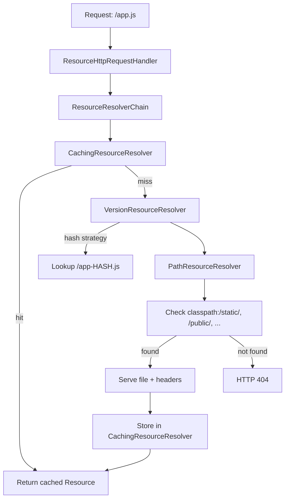
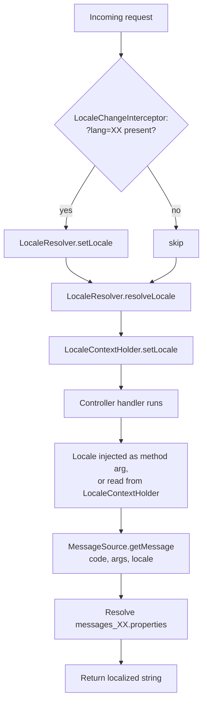

# Static Resources and Internationalization (i18n) in Spring MVC

Date: 2026-04-17
Tags: spring-mvc, static-resources, i18n, messagesource

## Table of Contents

- [Summary](#summary)
- [Default static resource locations](#default-static-resource-locations)
- [Accessing static files](#accessing-static-files)
- [Customizing with WebMvcConfigurer](#customizing-with-webmvcconfigurer)
- [Cache-busting (versioned URLs)](#cache-busting-versioned-urls)
- [Cache headers](#cache-headers)
- [favicon.ico](#faviconico)
- [CDN-style reverse proxy](#cdn-style-reverse-proxy)
- [Resource resolution chain](#resource-resolution-chain)
- [Internationalization (i18n)](#internationalization-i18n)
- [MessageSource](#messagesource)
- [Configuration](#configuration)
- [Resolving messages programmatically](#resolving-messages-programmatically)
- [In Thymeleaf](#in-thymeleaf)
- [Validation messages are i18n-aware](#validation-messages-are-i18n-aware)
- [LocaleResolver](#localeresolver)
- [LocaleChangeInterceptor](#localechangeinterceptor)
- [Locale resolution flow](#locale-resolution-flow)
- [Reloadable messages in dev](#reloadable-messages-in-dev)
- [Right-to-Left (RTL) locales](#right-to-left-rtl-locales)
- [Timezone-aware formatting](#timezone-aware-formatting)
- [Common pitfalls](#common-pitfalls)
- [Related](#related)
- [References](#references)

---

## Summary

Spring Boot auto-configures static resource handling from four classpath
locations out of the box. No controllers, no configuration, no gymnastics
needed — drop a file under `src/main/resources/static/` and it is served at
the matching URL.

For internationalization, Spring provides a layered trio:

- `MessageSource` — the actual message lookup component, backed by
  `messages*.properties` bundles.
- `LocaleResolver` — decides what locale the current request uses (header,
  session, cookie, fixed).
- `LocaleChangeInterceptor` — lets users switch locale via a query parameter
  like `?lang=fr`.

Together they let one codebase speak any number of languages, formatted
correctly per region, with validation errors and UI strings that respect the
user's chosen locale.

---

## Default static resource locations

Spring Boot automatically serves static content from these locations, in the
order listed (first match wins):

| Location                         | URL prefix       |
|----------------------------------|------------------|
| `classpath:/META-INF/resources/` | `/`              |
| `classpath:/resources/`          | `/`              |
| `classpath:/static/`             | `/` (most common)|
| `classpath:/public/`             | `/`              |

Additionally, files under `/webjars/**` resolve to
`classpath:/META-INF/resources/webjars/` — this is how WebJars ship CSS/JS
libraries as Maven/Gradle dependencies.

## Accessing static files

A file at `src/main/resources/static/js/app.js` is served at `/js/app.js`.
Similarly:

- `static/css/site.css` → `/css/site.css`
- `static/images/logo.png` → `/images/logo.png`
- `static/robots.txt` → `/robots.txt`

The convention is dead simple: path inside the static directory becomes path
on the wire.

## Customizing with WebMvcConfigurer

When you need more control — extra locations, custom URL prefixes, cache
policies — implement `WebMvcConfigurer` and override `addResourceHandlers`.

```java
@Configuration
public class WebConfig implements WebMvcConfigurer {

    @Override
    public void addResourceHandlers(ResourceHandlerRegistry registry) {
        registry.addResourceHandler("/assets/**")
                .addResourceLocations(
                        "classpath:/static/assets/",
                        "file:///var/app-assets/")
                .setCacheControl(
                        CacheControl.maxAge(30, TimeUnit.DAYS).cachePublic());
    }
}
```

Notes:

- `addResourceHandler` takes the URL pattern (what clients request).
- `addResourceLocations` takes one or more physical locations, tried in
  order until a match is found. `classpath:` and `file:` prefixes are both
  supported.
- `setCacheControl` emits a `Cache-Control` header on responses.

## Cache-busting (versioned URLs)

Long cache lifetimes collide with frequent deploys: users end up running old
JS because the CDN still holds `app.js` for another month. The fix is
content-hash versioning — the URL itself changes when the file changes, so
a new URL forces a fresh fetch.

```yaml
spring:
  web:
    resources:
      chain:
        strategy:
          content:
            enabled: true
            paths: /**
```

With this on, Spring emits `/app-7f83b.js` instead of `/app.js`. The hash
is derived from file content, so any change produces a new URL. Thymeleaf's
`@{/app.js}` expression auto-rewrites to the hashed version.

Combined with aggressive cache headers (`max-age=31536000, immutable`),
this is the "forever cache + rename on change" pattern used by every modern
build tool.

## Cache headers

Rule of thumb:

- **Hashed static assets** (JS/CSS/images with content hash in filename):
  `Cache-Control: max-age=31536000, immutable` — cache for a year, browser
  won't even revalidate.
- **Unhashed assets**: `Cache-Control: public, max-age=3600` — short TTL so
  changes propagate.
- **HTML pages**: `Cache-Control: no-cache` — always revalidate, so users
  pick up new hashed asset references immediately.

```java
registry.addResourceHandler("/static/**")
        .addResourceLocations("classpath:/static/")
        .setCacheControl(CacheControl.maxAge(365, TimeUnit.DAYS)
                .cachePublic()
                .immutable());
```

## favicon.ico

Spring Boot serves `favicon.ico` from any of the four default static
locations automatically. To override the default Spring icon, just place
your own at `src/main/resources/static/favicon.ico` — that's it, no
configuration required.

## CDN-style reverse proxy

In production, don't serve static assets from the Java process. Put a CDN
(CloudFront, Fastly, Cloudflare) or an nginx reverse proxy in front of
Spring. Spring then serves only what it must — SSR Thymeleaf templates,
dynamic JSON responses — while nginx/CDN handles the high-volume static
traffic with its own aggressive caching.

A minimal nginx setup:

```nginx
location /static/ {
    alias /var/app-assets/;
    expires 1y;
    add_header Cache-Control "public, immutable";
}

location / {
    proxy_pass http://spring-app:8080;
}
```

## Resource resolution chain

When a request for a static resource hits Spring, it walks through a chain
of `ResourceResolver` instances looking for the actual file.



The chain is pluggable — each resolver can short-circuit or delegate to
the next. Custom resolvers can be registered via `ResourceChainRegistration`.

---

## Internationalization (i18n)

## MessageSource

`MessageSource` is the core abstraction for looking up locale-sensitive
messages. Spring Boot auto-configures a `ResourceBundleMessageSource` that
reads from `messages.properties` (and locale-specific variants) on the
classpath.

```properties
# src/main/resources/messages.properties  (default / fallback)
greeting=Hello, {0}!
app.title=My Application
button.submit=Submit
```

```properties
# src/main/resources/messages_fr.properties
greeting=Bonjour, {0} !
app.title=Mon application
button.submit=Envoyer
```

```properties
# src/main/resources/messages_ja.properties
greeting={0}さん、こんにちは！
app.title=マイアプリ
button.submit=送信
```

Lookup order for `Locale("fr", "CA")`:

1. `messages_fr_CA.properties`
2. `messages_fr.properties`
3. `messages.properties` (fallback)

## Configuration

Most tuning happens via `application.yml`:

```yaml
spring:
  messages:
    basename: messages, auth-messages
    encoding: UTF-8
    fallback-to-system-locale: false
    cache-duration: 10s
```

Key knobs:

- `basename` — comma-separated list of bundle prefixes. Multiple bundles let
  you partition messages by concern (auth, validation, emails).
- `encoding` — **always `UTF-8`**. See [Common pitfalls](#common-pitfalls).
- `fallback-to-system-locale` — set to `false` in production to avoid the
  server's default locale leaking into missing-key fallbacks.
- `cache-duration` — how long parsed bundles stay in memory.

## Resolving messages programmatically

Inject `MessageSource` where you need it:

```java
@Service
public class NotificationService {

    private final MessageSource messageSource;

    public NotificationService(MessageSource messageSource) {
        this.messageSource = messageSource;
    }

    public String greet(String name, Locale locale) {
        return messageSource.getMessage(
                "greeting",
                new Object[]{name},
                locale);
    }
}
```

The three-argument `getMessage(code, args, locale)` is strict — it throws
`NoSuchMessageException` if the key is missing. Use the four-argument
overload with a default if you want a fallback string instead.

## In Thymeleaf

Thymeleaf integrates with `MessageSource` via the `#{...}` expression:

```html
<p th:text="#{greeting(${user.name})}">Hello, placeholder!</p>
<button th:text="#{button.submit}">Submit</button>
```

See [thymeleaf-and-views.md](thymeleaf-and-views.md) for the full Thymeleaf
integration.

## Validation messages are i18n-aware

Bean Validation looks up message keys from `MessageSource` when they are
wrapped in braces. This gives you localized validation errors with zero
extra wiring.

```java
public record UserForm(
        @NotBlank(message = "{NotBlank.user.name}") String name,
        @Email(message = "{Email.user.email}") String email) { }
```

```properties
# messages.properties
NotBlank.user.name=Name is required
Email.user.email=Please enter a valid email address
```

```properties
# messages_fr.properties
NotBlank.user.name=Le nom est obligatoire
Email.user.email=Veuillez entrer une adresse e-mail valide
```

See [../validation/bean-validation.md](../validation/bean-validation.md)
for the full validation story.

## LocaleResolver

`LocaleResolver` is how Spring decides which locale a given request uses.
Four built-in implementations cover most cases:

| Resolver                       | Source of locale                          | When to use                                  |
|--------------------------------|-------------------------------------------|----------------------------------------------|
| `AcceptHeaderLocaleResolver`   | `Accept-Language` HTTP header (default)   | Stateless APIs, respect browser preference   |
| `SessionLocaleResolver`        | `HttpSession` attribute                   | Logged-in users, per-session preference      |
| `CookieLocaleResolver`         | Cookie on the client                      | Guests + persistent preference, stateless    |
| `FixedLocaleResolver`          | Always the same locale                    | Single-locale apps (testing, internal tools) |

Register a non-default resolver as a bean:

```java
@Bean
public LocaleResolver localeResolver() {
    CookieLocaleResolver resolver = new CookieLocaleResolver();
    resolver.setDefaultLocale(Locale.ENGLISH);
    resolver.setCookieName("APP_LOCALE");
    resolver.setCookieMaxAge(Duration.ofDays(365));
    return resolver;
}
```

## LocaleChangeInterceptor

To let users change locale with a query parameter like `?lang=fr`, register
a `LocaleChangeInterceptor`:

```java
@Configuration
public class WebConfig implements WebMvcConfigurer {

    @Override
    public void addInterceptors(InterceptorRegistry registry) {
        var interceptor = new LocaleChangeInterceptor();
        interceptor.setParamName("lang");
        registry.addInterceptor(interceptor);
    }
}
```

Now a request to `/profile?lang=fr` makes the interceptor call
`localeResolver.setLocale(request, response, Locale.FRENCH)` before the
handler runs. Combined with `CookieLocaleResolver`, the choice persists
across future requests.

## Locale resolution flow



Controllers can receive `Locale` directly as a method parameter — Spring
injects the resolved locale automatically:

```java
@GetMapping("/greet")
public String greet(@RequestParam String name, Locale locale, Model model) {
    String msg = messageSource.getMessage(
            "greeting", new Object[]{name}, locale);
    model.addAttribute("message", msg);
    return "greet";
}
```

## Reloadable messages in dev

`ResourceBundleMessageSource` caches forever by default — useful in prod,
annoying in dev when you're iterating on copy. Use
`ReloadableResourceBundleMessageSource` with a short cache:

```java
@Bean
public MessageSource messageSource() {
    var source = new ReloadableResourceBundleMessageSource();
    source.setBasename("classpath:messages");
    source.setDefaultEncoding("UTF-8");
    source.setCacheSeconds(isDev() ? 0 : 10);
    source.setFallbackToSystemLocale(false);
    return source;
}
```

- `0` — check the file on every lookup (dev only — slow).
- `10` — re-read at most once every 10 seconds (fine for prod).
- `-1` — cache forever (default for `ResourceBundleMessageSource`).

## Right-to-Left (RTL) locales

For Arabic, Hebrew, Persian, and other RTL scripts, set the HTML `dir`
attribute dynamically:

```html
<html th:lang="${#locale.language}"
      th:dir="${#locale.language == 'ar' or #locale.language == 'he'} ? 'rtl' : 'ltr'">
```

Consider shipping a separate RTL stylesheet (or using CSS logical
properties like `margin-inline-start` instead of `margin-left`) so layouts
mirror cleanly.

## Timezone-aware formatting

Locale and timezone are independent — a French-speaking user in Montreal
wants French strings but Eastern Time. `LocaleContextHolder` carries both:

```java
Locale locale = LocaleContextHolder.getLocale();
TimeZone tz = LocaleContextHolder.getTimeZone();

ZonedDateTime now = ZonedDateTime.now(tz.toZoneId());
String formatted = DateTimeFormatter
        .ofLocalizedDateTime(FormatStyle.MEDIUM)
        .withLocale(locale)
        .format(now);
```

See [../java-fundamentals/date-and-time-api.md](../java-fundamentals/date-and-time-api.md)
for the `java.time` fundamentals.

## Common pitfalls

**Non-UTF-8 encoding on `messages*.properties`.** The classic one. The JDK
default for `.properties` files used to be ISO-8859-1, and mojibake in
French/German/Japanese text is a rite of passage. **Always** set
`spring.messages.encoding=UTF-8` and save files as UTF-8. Check your IDE
settings.

**Forgetting `{0}` arg substitution.** `MessageFormat` uses `{0}`, `{1}`,
not `%s`. Passing args without matching placeholders silently drops them.

**Using `Locale.getDefault()` instead of the request locale.** This reads
the JVM default (wherever the server happens to be hosted), not the user's
locale. Always use the injected `Locale` parameter or
`LocaleContextHolder.getLocale()`.

**Cache forever + no cache-bust on HTML.** If HTML is cached for a year and
references `/app.js`, deploying a new `app.js` does nothing — browsers
never re-request the HTML. Either cache-bust the asset URLs (content hash)
or send `no-cache` on HTML.

**Missing fallback locale.** If `messages.properties` (no suffix) doesn't
exist, missing keys log warnings and return the key itself as the message.
Always ship a default bundle.

**Mixing resource bundle basenames.** `spring.messages.basename=messages`
is relative to the classpath root. Don't prefix with `classpath:` here —
that's for `ReloadableResourceBundleMessageSource` bean config, not the
Spring Boot property.

**Testing with wrong locale.** In `@SpringBootTest`, the locale defaults to
the JVM default. Use `LocaleContextHolder.setLocale(Locale.FRENCH)` in a
`@BeforeEach`, or pass `Accept-Language` headers through `MockMvc`:

```java
mockMvc.perform(get("/greet").header("Accept-Language", "fr-FR"))
       .andExpect(content().string(containsString("Bonjour")));
```

---

## Related

- [spring-mvc-fundamentals.md](spring-mvc-fundamentals.md)
- [thymeleaf-and-views.md](thymeleaf-and-views.md)
- [mvc-controllers-forms-validation.md](mvc-controllers-forms-validation.md)
- [../java-fundamentals/date-and-time-api.md](../java-fundamentals/date-and-time-api.md)
- [../validation/bean-validation.md](../validation/bean-validation.md)

## References

- Spring Boot Reference — Web: Static Content
  (<https://docs.spring.io/spring-boot/reference/web/servlet.html#web.servlet.spring-mvc.static-content>)
- Spring Boot Reference — MessageSource auto-configuration
  (<https://docs.spring.io/spring-boot/reference/features/internationalization.html>)
- Spring Framework Reference — Internationalization
  (<https://docs.spring.io/spring-framework/reference/core/beans/context-introduction.html#context-functionality-messagesource>)
- Spring Framework Reference — Locale Resolution
  (<https://docs.spring.io/spring-framework/reference/web/webmvc/mvc-servlet/localeresolver.html>)
- Spring Framework Reference — Resource Handling and Cache Busting
  (<https://docs.spring.io/spring-framework/reference/web/webmvc/mvc-config/static-resources.html>)
