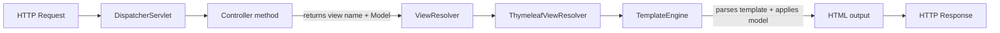

# Thymeleaf and Views

**Date:** 2026-04-17
**Tags:** spring-mvc, thymeleaf, views, templating

## Table of Contents

- [Summary](#summary)
- [Setup](#setup)
- [MVC Render Flow](#mvc-render-flow)
- [Controllers and Models](#controllers-and-models)
- [Core Expressions](#core-expressions)
- [Core Attributes](#core-attributes)
- [Layouts and Fragments](#layouts-and-fragments)
- [Form Handling](#form-handling)
- [Utility Objects](#utility-objects)
- [Conditional CSS and Styles](#conditional-css-and-styles)
- [Internationalization (i18n)](#internationalization-i18n)
- [Spring Security Dialect](#spring-security-dialect)
- [Configuration Properties](#configuration-properties)
- [Common Gotchas](#common-gotchas)
- [Alternative Template Engines](#alternative-template-engines)
- [When NOT to Use Thymeleaf](#when-not-to-use-thymeleaf)
- [Related](#related)
- [References](#references)

---

## Summary

Thymeleaf is Spring's default server-side templating engine for rendering HTML on the
server from Java model data. It produces pages by merging a **template** (an HTML file
with special attributes) with a **model** (Java objects) and sending the resulting
HTML to the browser. Unlike JSP, Thymeleaf templates are **natural templates**: they
are valid HTML files that can be opened directly in a browser during design time,
showing placeholder content, and then dynamically enriched at runtime by the server.

Thymeleaf is a strong fit for traditional **server-rendered** web applications, admin
consoles, dashboards, email templates, and any scenario where you want HTML delivered
fully composed from the server. It is **not** a fit for SPAs that consume JSON (use
React/Vue with a REST API instead) or for fully reactive stacks that stream data
incrementally — though Spring WebFlux does have limited Thymeleaf reactive support.

---

## Setup

Add the starter to your `pom.xml` or `build.gradle`:

```xml
<dependency>
  <groupId>org.springframework.boot</groupId>
  <artifactId>spring-boot-starter-thymeleaf</artifactId>
</dependency>
```

Spring Boot auto-configures the following conventions:

| Resource type   | Default location                      |
|-----------------|---------------------------------------|
| Templates       | `src/main/resources/templates/`       |
| Static assets   | `src/main/resources/static/`          |
| Messages        | `src/main/resources/messages.properties` |

With no further configuration, a controller returning the string `"home"` renders
`src/main/resources/templates/home.html`. Static files placed under `static/` (CSS,
JS, images) are served from the root URL — `static/css/app.css` becomes `/css/app.css`.

Project layout:

```text
src/main/resources/
├── templates/
│   ├── layout.html
│   ├── home.html
│   └── users/
│       ├── list.html
│       └── form.html
├── static/
│   ├── css/app.css
│   └── js/app.js
└── messages.properties
```

---

## MVC Render Flow



1. The request reaches `DispatcherServlet`, which routes to the matched `@Controller`.
2. The controller method returns a **view name** (a `String`) and populates a `Model`.
3. Spring's `ViewResolver` chain resolves the name — with Thymeleaf active, the
   `ThymeleafViewResolver` takes over.
4. The `TemplateEngine` loads `templates/<name>.html`, parses its `th:*` attributes,
   evaluates expressions against the model, and writes the resulting HTML to the
   response.

---

## Controllers and Models

For view rendering you use `@Controller` (not `@RestController`, which serializes
return values directly to the response body). Inject a `Model` or `ModelMap`
parameter to supply data:

```java
@Controller
public class HomeController {

    @GetMapping("/")
    public String home(Model model) {
        model.addAttribute("name", "Quan");
        model.addAttribute("items", List.of("Apple", "Pear", "Fig"));
        return "home"; // resolves to templates/home.html
    }
}
```

Alternative return types:

- `String` — the view name
- `ModelAndView` — view name + model in one object
- `void` — view name inferred from the request path (rarely used)

Adding attributes:

```java
model.addAttribute("user", user);
// or
return new ModelAndView("home", Map.of("user", user));
```

---

## Core Expressions

Thymeleaf exposes five expression types, each with its own syntax:

| Syntax       | Purpose                           | Example                        |
|--------------|-----------------------------------|--------------------------------|
| `${...}`     | Variable from the model           | `${user.name}`                 |
| `*{...}`     | Selection on a `th:object`        | `*{email}` (inside a form)     |
| `#{...}`     | Message / i18n lookup             | `#{greeting}`                  |
| `@{...}`     | URL / link with context rewriting | `@{/users/{id}(id=${user.id})}`|
| `~{...}`     | Fragment reference                | `~{header :: nav}`             |

Examples:

```html
<p th:text="${user.name}">Placeholder name</p>
<p th:text="*{email}">user@example.com</p>         <!-- inside th:object -->
<h1 th:text="#{home.title}">Welcome</h1>
<a th:href="@{/users/{id}(id=${user.id})}">Profile</a>
<div th:replace="~{fragments/header :: nav}"></div>
```

URL expressions (`@{...}`) automatically prepend the servlet context path and rewrite
the URL as needed — always use them instead of hand-written `href` strings.

---

## Core Attributes

### Text rendering

```html
<span th:text="${message}">placeholder</span>          <!-- HTML-escaped -->
<div  th:utext="${htmlBlob}">placeholder</div>         <!-- UNESCAPED, XSS risk -->
```

Use `th:text` by default. Reach for `th:utext` only when the content is already
trusted HTML (e.g. sanitized markdown) — otherwise you open an XSS hole.

### Conditionals

```html
<p th:if="${user != null}"  th:text="|Hello ${user.name}|">Hello …</p>
<p th:unless="${user}">Please log in.</p>

<div th:switch="${user.role}">
  <p th:case="'ADMIN'">Admin console</p>
  <p th:case="'USER'">User dashboard</p>
  <p th:case="*">Guest view</p>
</div>
```

### Iteration

```html
<ul>
  <li th:each="item, stat : ${items}"
      th:text="|${stat.index}: ${item}|">item</li>
</ul>
```

The second variable (`stat`) provides `index`, `count`, `size`, `first`, `last`,
`even`, `odd`.

### Attribute binding

```html
<a   th:href="@{/about}">About</a>

<form th:action="@{/save}" method="post">...</form>
```

### Fragment composition

```html
<div th:replace="~{fragments/header :: nav}"></div>   <!-- replaces host tag -->
<div th:insert="~{fragments/header :: nav}"></div>    <!-- keeps host tag -->
<div th:include="~{fragments/header :: nav}"></div>   <!-- legacy; prefer replace -->
```

---

## Layouts and Fragments

Thymeleaf encourages extracting reusable chunks into **fragments** and composing them
into a shared **layout**.

`templates/fragments/header.html`:

```html
<!DOCTYPE html>
<html xmlns:th="http://www.thymeleaf.org">
<body>
  <nav th:fragment="nav">
    <a th:href="@{/}">Home</a>
    <a th:href="@{/users}">Users</a>
  </nav>
</body>
</html>
```

`templates/layout.html`:

```html
<!DOCTYPE html>
<html xmlns:th="http://www.thymeleaf.org">
<head>
  <title th:text="${title} ?: 'App'">App</title>
  <link rel="stylesheet" th:href="@{/css/app.css}" />
</head>
<body>
  <header th:replace="~{fragments/header :: nav}"></header>
  <main th:replace="${content}">page content</main>
</body>
</html>
```

`templates/home.html`:

```html
<!DOCTYPE html>
<html xmlns:th="http://www.thymeleaf.org"
      th:replace="~{layout :: . (title='Home', content=~{::#main})}">
<body>
  <section id="main">
    <h1>Welcome home</h1>
  </section>
</body>
</html>
```

For a more ergonomic approach with `<html layout:decorate="~{layout}">` and
`<section layout:fragment="content">` markers, add the **Thymeleaf Layout Dialect**:

```xml
<dependency>
  <groupId>nz.net.ultraq.thymeleaf</groupId>
  <artifactId>thymeleaf-layout-dialect</artifactId>
</dependency>
```

---

## Form Handling

Thymeleaf integrates tightly with Spring's form binding and validation. Bind the form
to a model object with `th:object`, then reference fields with `*{...}` and `th:field`:

```html
<form th:action="@{/user}" th:object="${user}" method="post">
  <label>
    Name
    <input th:field="*{name}" />
    <span th:if="${#fields.hasErrors('name')}" th:errors="*{name}">error</span>
  </label>

  <label>
    Email
    <input type="email" th:field="*{email}" />
    <span th:if="${#fields.hasErrors('email')}" th:errors="*{email}">error</span>
  </label>

  <button type="submit">Save</button>
</form>
```

`th:field` expands into `id`, `name`, and `value` attributes all bound to the same
property. Errors are looked up via the `#fields` utility object, which is populated
by the `BindingResult` returned from Spring validation.

> For the controller side (`@ModelAttribute`, `@Valid`, `BindingResult`, redirect
> patterns), see the sibling doc **`mvc-controllers-forms-validation.md`**.

---

## Utility Objects

Thymeleaf ships a library of utility beans, accessible via `#` inside expressions:

| Object         | Use                                                        |
|----------------|------------------------------------------------------------|
| `#strings`     | `toUpperCase`, `abbreviate`, `isEmpty`, `contains`         |
| `#numbers`     | `formatDecimal`, `formatPercent`, `formatCurrency`         |
| `#dates`       | Legacy `java.util.Date` formatting                         |
| `#temporals`   | `java.time` formatting (requires `thymeleaf-extras-java8time` — bundled in newer versions) |
| `#lists`       | `size`, `isEmpty`, `contains`, `sort`                      |
| `#maps`        | `size`, `isEmpty`, `containsKey`                           |
| `#aggregates`  | `sum`, `avg` over collections                              |
| `#messages`    | Programmatic message lookup                                |
| `#fields`      | Form error checks                                          |
| `#ids`         | Unique DOM id generation (useful inside `th:each`)         |

```html
<p th:text="${#strings.abbreviate(post.body, 80)}">...</p>
<p th:text="${#numbers.formatCurrency(order.total)}">...</p>
<p th:text="${#temporals.format(order.createdAt, 'yyyy-MM-dd HH:mm')}">...</p>
<p th:text="${#aggregates.sum(cart.items.![price])}">...</p>
```

---

## Conditional CSS and Styles

Thymeleaf offers several attribute helpers for dynamic class and style application:

```html
<!-- append classes to existing ones -->
<li th:classappend="${item.done} ? 'done' : 'pending'">...</li>

<!-- replace the class attribute entirely -->
<div th:class="${theme == 'dark'} ? 'bg-black text-white' : 'bg-white text-black'">...</div>

<!-- inline style -->
<div th:style="|width: ${progress}%;|">...</div>

<!-- generic attribute append -->
<input th:attrappend="data-state=${item.status}" />
```

Keep conditional branches short; for more than a couple of outcomes, compute the
class string in the controller and push it through the model.

---

## Internationalization (i18n)

Thymeleaf's `#{...}` expression looks up keys from Spring's `MessageSource`, which
Boot wires to `messages*.properties` files on the classpath.

`messages.properties` (default/fallback):

```properties
home.title=Welcome
home.greeting=Hello, {0}!
```

`messages_fr.properties`:

```properties
home.title=Bienvenue
home.greeting=Bonjour, {0} !
```

Usage:

```html
<h1 th:text="#{home.title}">Welcome</h1>
<p  th:text="#{home.greeting(${user.name})}">Hello, ...</p>
```

Locale selection is driven by Spring's `LocaleResolver` (cookie-, session-, or
`Accept-Language`-based). See **`static-resources-and-i18n.md`** for the full i18n
and static asset story, including cache headers and versioned URLs.

---

## Spring Security Dialect

Add `thymeleaf-extras-springsecurity6` to expose Spring Security data directly in
templates:

```xml
<dependency>
  <groupId>org.thymeleaf.extras</groupId>
  <artifactId>thymeleaf-extras-springsecurity6</artifactId>
</dependency>
```

Declare the namespace and use `sec:*` attributes:

```html
<html xmlns:th="http://www.thymeleaf.org"
      xmlns:sec="http://www.thymeleaf.org/extras/spring-security">
<body>
  <nav>
    <span sec:authorize="isAuthenticated()">
      Hello, <span sec:authentication="name">user</span>
    </span>

    <a sec:authorize="hasRole('ADMIN')" th:href="@{/admin}">Admin</a>

    <form sec:authorize="isAuthenticated()"
          th:action="@{/logout}" method="post">
      <button type="submit">Log out</button>
    </form>
  </nav>
</body>
</html>
```

Useful expressions:

- `sec:authorize="hasRole('ADMIN')"` — render only for that role
- `sec:authorize-url="@{/admin}"` — render if the user can access that URL
- `sec:authentication="name"` — principal name
- `sec:authentication="principal.authorities"` — full authority list

---

## Configuration Properties

Default values (shown for clarity — you typically only override a few):

```yaml
spring:
  thymeleaf:
    prefix: classpath:/templates/
    suffix: .html
    mode: HTML          # HTML, XML, TEXT, JAVASCRIPT, CSS, RAW
    encoding: UTF-8
    cache: true         # IMPORTANT: set to false in dev
    check-template: true
    check-template-location: true
    servlet:
      content-type: text/html
```

Development profile:

```yaml
# application-dev.yml
spring:
  thymeleaf:
    cache: false
```

Spring Boot DevTools will also disable the cache automatically when it's on the
classpath.

---

## Common Gotchas

- **`cache: true` in dev** — you'll edit a template, refresh, and see no change.
  Always disable caching in development (or include DevTools).
- **XSS via `th:utext`** — unescaped output pastes raw HTML straight into the page.
  Never feed user-controlled data into `th:utext` without sanitization (e.g. OWASP
  Java HTML Sanitizer).
- **Returning a view name from `@RestController`** — that annotation serializes the
  return value as the body; you get the literal string "home" in the browser. Use
  `@Controller` for views.
- **Date formatting locale drift** — `#temporals.format` respects the request locale,
  so dates shift between environments. Pin a locale explicitly when the output must
  be stable: `#temporals.format(d, 'yyyy-MM-dd', #locale.US)`.
- **Forgetting the Thymeleaf namespace** — missing
  `xmlns:th="http://www.thymeleaf.org"` on `<html>` makes IDEs and linters flag every
  attribute. Runtime still works, but tooling suffers.
- **Natural template drift** — static placeholder text in `th:text` tags can get out
  of sync with reality. Keep placeholders meaningful for designers but don't rely on
  them for correctness.
- **Large pages with heavy iteration** — Thymeleaf is not the fastest engine; render
  hot pages with server-side caching or pre-compute fragments.
- **Fragment path typos** — `~{fragments/header :: nav}` silently renders nothing if
  misspelled. Enable `spring.thymeleaf.check-template=true` and test fragment
  resolution.

---

## Alternative Template Engines

Spring Boot supports several engines via starters — swap the dependency and the auto
config wires the rest:

| Engine     | Starter                                | Notes                                 |
|------------|----------------------------------------|---------------------------------------|
| Thymeleaf  | `spring-boot-starter-thymeleaf`        | Default, natural templates, rich Spring integration |
| FreeMarker | `spring-boot-starter-freemarker`       | Fast, terse, strong macro support     |
| Mustache   | `spring-boot-starter-mustache`         | Logic-less, minimal, easy to reason about |
| Groovy     | `spring-boot-starter-groovy-templates` | Groovy-based builder syntax           |
| JSP        | (manual config, packaging as WAR)      | Legacy; avoid for new projects        |

Unless you have a specific reason (existing template library, team familiarity, raw
speed), stick with Thymeleaf in the Spring ecosystem.

---

## When NOT to Use Thymeleaf

Server-rendered HTML is not the right tool for every project. Skip Thymeleaf when:

- **You're building an SPA** — React, Vue, Svelte, Angular consume JSON from REST or
  GraphQL endpoints. Render the shell once (or use the framework's own SSR) and let
  the client own the view.
- **You're on a fully reactive stack** — with WebFlux, most teams pair a reactive
  backend with a separate frontend app. Thymeleaf has a reactive mode, but the
  integration is awkward and the benefits are small.
- **Your output isn't HTML** — for JSON, return POJOs from `@RestController`. For
  PDFs, use a dedicated renderer.
- **Edge-heavy personalization with caching is critical** — static HTML + client-side
  hydration often performs better than dynamic server rendering at scale.

Thymeleaf shines for admin dashboards, CRUD apps, internal tools, transactional
emails (see the Thymeleaf email guide), and sites where SEO plus fast first paint
matter more than client-side interactivity.

---

## Related

- [`spring-mvc-fundamentals.md`](./spring-mvc-fundamentals.md) — request lifecycle,
  DispatcherServlet, controller mappings.
- [`mvc-controllers-forms-validation.md`](./mvc-controllers-forms-validation.md) —
  `@ModelAttribute`, `@Valid`, `BindingResult`, POST-redirect-GET, flash attributes.
- [`static-resources-and-i18n.md`](./static-resources-and-i18n.md) — static asset
  serving, locale resolution, `MessageSource` configuration.

## References

- Thymeleaf docs — https://www.thymeleaf.org/documentation.html
- Thymeleaf + Spring integration guide — https://www.thymeleaf.org/doc/tutorials/3.1/thymeleafspring.html
- Spring Boot Thymeleaf reference — https://docs.spring.io/spring-boot/reference/web/servlet.html#web.servlet.spring-mvc.template-engines
- Thymeleaf Layout Dialect — https://ultraq.github.io/thymeleaf-layout-dialect/
- Thymeleaf Spring Security extras — https://github.com/thymeleaf/thymeleaf-extras-springsecurity
