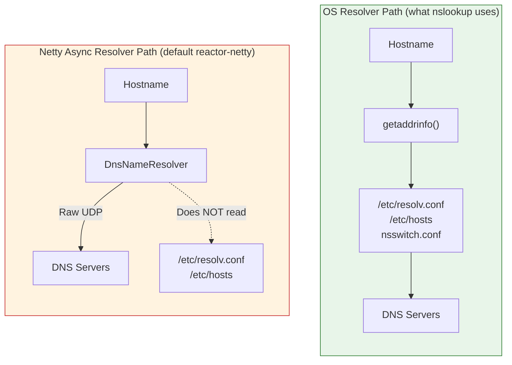

# Fixing WebClient DNS Resolution Failures — Netty vs JDK Resolver

**Date:** 2026-04-16 | **Updated:** 2026-04-16
**Tags:** `webclient` `reactor-netty` `netty` `dns` `resolver` `troubleshooting`

## Table of Contents

- [Summary](#summary)
- [Symptoms](#symptoms)
- [Root Cause](#root-cause)
  - [Why nslookup Works but the Java App Fails](#why-nslookup-works-but-the-java-app-fails)
  - [What Netty's Resolver Does Differently](#what-nettys-resolver-does-differently)
- [The Fix](#the-fix)
- [Why This Works](#why-this-works)
- [Trade-Offs](#trade-offs)
  - [JDK Resolver Is Blocking](#jdk-resolver-is-blocking)
  - [When to Stay with Netty's Async Resolver](#when-to-stay-with-nettys-async-resolver)
- [Related Known Issues](#related-known-issues)
- [Diagnostic Checklist](#diagnostic-checklist)
- [Related](#related)
- [References](#references)

---

## Summary

Reactor-Netty's default DNS resolver ([`DnsAddressResolverGroup`](https://netty.io/4.2/api/io/netty/resolver/dns/DnsAddressResolverGroup.html)) is a self-contained async DNS implementation that often fails on corporate/split-horizon DNS, internal Kubernetes hostnames, or AAAA (IPv6) queries — even when the OS resolver works fine for the same hostname. The fix is to configure the `HttpClient` with `.resolver(DefaultAddressResolverGroup.INSTANCE)`, which delegates to the JDK's `InetAddress.getAllByName` (and therefore to the OS `getaddrinfo`), matching the path `nslookup` and browsers use.

---

## Symptoms

- `WebClient` calls to internal hostnames fail with DNS errors like `UnknownHostException` or `SearchDomainUnknownHostException`
- Error log shows `[A(1), AAAA(28)]` — the signature of [Netty's async DNS resolver](https://netty.io/4.1/api/io/netty/resolver/dns/DnsNameResolver.html) sending A and AAAA queries
- `nslookup some.internal.host` from the same container/host **works** and returns an IP
- Browsers and `curl` on the same machine work against the same hostname
- Issue is worse in Kubernetes, corporate networks, or with VPN split-horizon DNS

---

## Root Cause

### Why nslookup Works but the Java App Fails

`nslookup`, `curl`, `ping`, and browsers all use the OS's resolver ([`getaddrinfo(3)`](https://man7.org/linux/man-pages/man3/getaddrinfo.3.html)), which:

- Reads `/etc/resolv.conf` for nameservers and search domains
- Reads `/etc/hosts` for static overrides
- Honors `nsswitch.conf` for resolution order (files → DNS → etc.)
- Respects `AI_ADDRCONFIG` — only queries AAAA when the host has IPv6 configured

[Reactor-Netty's default HttpClient](https://projectreactor.io/docs/netty/release/reference/http-client.html) uses Netty's own asynchronous DNS resolver ([`DnsNameResolver`](https://netty.io/4.1/api/io/netty/resolver/dns/DnsNameResolver.html)) by default, which **bypasses all of the above** — it sends raw UDP DNS queries directly.



### What Netty's Resolver Does Differently

[`DnsNameResolver`](https://netty.io/4.1/api/io/netty/resolver/dns/DnsNameResolver.html) is a custom async implementation that:

1. **Does not read `/etc/hosts` or `/etc/resolv.conf` by default** — it must be explicitly configured with name servers and search domains
2. **Has AAAA (IPv6) timeout issues** — when IPv6 isn't properly configured, [AAAA queries can time out or error in ways that poison the A record lookup](https://github.com/netty/netty/issues/5657)
3. **Doesn't honor all system search domains** — K8s `search` entries in `/etc/resolv.conf` are often ignored or mishandled
4. **Fails on split-horizon DNS** — corporate DNS that returns different answers based on source network confuses Netty's resolver
5. **Known issues with mixed A/AAAA/NS responses** — [#13660](https://github.com/netty/netty/issues/13660) reports `SearchDomainUnknownHostException` on perfectly valid DNS responses

The `[A(1), AAAA(28)]` format in error messages is the tell — those are the DNS query type codes Netty is sending, and appearing in the exception means Netty's resolver is the one failing.

---

## The Fix

Configure the `HttpClient` to use Netty's [`DefaultAddressResolverGroup`](https://netty.io/4.1/api/io/netty/resolver/AddressResolverGroup.html), which delegates to the JDK resolver:

```java
import io.netty.resolver.DefaultAddressResolverGroup;
import reactor.netty.http.client.HttpClient;
import reactor.netty.resources.ConnectionProvider;

@Configuration
public class WebClientConfig {

    @Bean
    public HttpClient httpClient(ConnectionProvider connectionProvider) {
        return HttpClient.create(connectionProvider)
            .option(ChannelOption.CONNECT_TIMEOUT_MILLIS, CONNECT_TIMEOUT_MS)
            .resolver(DefaultAddressResolverGroup.INSTANCE)   // <-- the fix
            .doOnConnected(conn -> conn
                .addHandlerLast(new ReadTimeoutHandler(READ_TIMEOUT_SEC, TimeUnit.SECONDS))
                .addHandlerLast(new WriteTimeoutHandler(WRITE_TIMEOUT_SEC, TimeUnit.SECONDS)));
    }
}
```

One additional import, one additional line on the builder — that's the whole change.

---

## Why This Works

[`DefaultAddressResolverGroup.INSTANCE`](https://netty.io/4.1/api/io/netty/resolver/AddressResolverGroup.html) delegates to [`java.net.InetAddress.getAllByName()`](https://docs.oracle.com/en/java/javase/21/docs/api/java.base/java/net/InetAddress.html), which on Unix-like systems calls the OS `getaddrinfo`. This puts the Java application on **exactly the same DNS resolution path** that `nslookup`, `curl`, `ping`, and every browser uses.

Result:
- `/etc/hosts` entries are honored
- `/etc/resolv.conf` search domains work
- AAAA behavior follows OS policy (`AI_ADDRCONFIG`)
- Split-horizon DNS returns the right answer for the source network
- K8s internal DNS works without extra config

**Rule of thumb:** if `nslookup hostname` returns an address but the Java app doesn't, switching to `DefaultAddressResolverGroup` will fix it.

---

## Trade-Offs

### JDK Resolver Is Blocking

`InetAddress.getAllByName()` is a **blocking call**. When `DefaultAddressResolverGroup` is used, each DNS lookup blocks the calling event-loop thread until it completes.

| Scenario | Impact |
|----------|--------|
| DNS response cached by JVM | <1ms, negligible |
| First lookup (cache miss) | 1-20ms typical, occupies the event-loop thread |
| DNS server slow/unreachable | Up to the OS resolver timeout (seconds) — **real problem** |

For typical microservice-to-microservice traffic with:
- Small number of distinct hostnames
- JVM DNS cache warming quickly
- Healthy DNS infrastructure

…this is fine. The event-loop thread blocks briefly on cache misses, then cached lookups are essentially free.

The JDK's DNS cache is controlled by:
- `networkaddress.cache.ttl` — how long successful lookups cache (default: 30s, or forever with a SecurityManager)
- `networkaddress.cache.negative.ttl` — how long failed lookups cache (default: 10s)

See [Java networking system properties](https://docs.oracle.com/javase/8/docs/technotes/guides/net/properties.html) for tuning.

### When to Stay with Netty's Async Resolver

Keep [`DnsAddressResolverGroup`](https://netty.io/4.2/api/io/netty/resolver/dns/DnsAddressResolverGroup.html) (the reactor-netty default) when:

1. **Extreme-throughput edge services** where blocking on DNS even briefly matters
2. **Service meshes** calling hundreds of distinct hostnames where you don't want JVM cache pressure
3. **You need async DNS semantics** for specific operational reasons

If so, fix Netty's resolver properly instead of swapping it out:

```java
import io.netty.resolver.dns.DnsAddressResolverGroup;
import io.netty.resolver.dns.DnsNameResolverBuilder;

HttpClient.create(pool)
    .resolver(new DnsAddressResolverGroup(
        new DnsNameResolverBuilder()
            .channelType(NioDatagramChannel.class)
            .searchDomains(List.of("svc.cluster.local", "cluster.local"))
            .ndots(5)
            .resolvedAddressTypes(ResolvedAddressTypes.IPV4_PREFERRED)  // skip AAAA timeouts
            .queryTimeoutMillis(5000)));
```

For most projects, this is more fiddling than it's worth — the JDK resolver is the pragmatic choice.

---

## Related Known Issues

The reactor-netty and Netty issue trackers have a long history of DNS problems that `DefaultAddressResolverGroup` sidesteps:

| Issue | What It Reports |
|-------|----------------|
| [reactor-netty #1431](https://github.com/reactor/reactor-netty/issues/1431) | Netty resolver became the default, breaking apps that worked with the JDK resolver |
| [reactor-netty #1763](https://github.com/reactor/reactor-netty/issues/1763) | DNS not resolved with WebClient — `UnknownHostException` on valid hosts |
| [reactor-netty #2978](https://github.com/reactor/reactor-netty/issues/2978) | `DnsNameResolverTimeoutException` in Kubernetes |
| [netty #5657](https://github.com/netty/netty/issues/5657) | AAAA queries sent even when IPv6 unavailable — fixed to honor `preferIPv4Stack` |
| [netty #13660](https://github.com/netty/netty/issues/13660) | Mixed A/AAAA/NS responses cause `SearchDomainUnknownHostException` |

The common thread: Netty's resolver has rough edges on real-world networks that the OS resolver handles transparently.

---

## Diagnostic Checklist

When a `WebClient` call fails with DNS errors, check in order:

1. **Does `nslookup hostname` work from the same host/container?** If no, the problem is your DNS config, not Java.
2. **Does `curl https://hostname` work?** Confirms the OS resolver and network path are fine.
3. **Is the error stack trace from `io.netty.resolver.dns.*`?** → Netty's async resolver is the culprit, apply the fix.
4. **Does the error log contain `[A(1), AAAA(28)]`?** → Netty DNS signature, confirming the resolver issue.
5. **Are you using reactor-netty directly or via `WebClient.Builder`?** The fix applies to whichever `HttpClient` bean is backing it.
6. **After the fix, does the call succeed?** If yes, ship it. If no, the problem is elsewhere (routing, TLS, firewall).

---

## Related

- [WebClient Configuration in Spring WebFlux](configurations/webclient-config.md) — full WebClient setup; this DNS fix slots into the `HttpClient` customization
- [Server and HTTP Configuration in Spring WebFlux](configurations/server-http-config.md) — Reactor Netty server tuning (server-side analog)
- [Wrapping Blocking JPA Calls in a Reactive Chain](reactive-blocking-jpa-pattern.md) — related philosophy: deliberately accept a small blocking cost on the event-loop when the alternative is worse

## References

- [HTTP Client — Reactor Netty Reference Guide](https://projectreactor.io/docs/netty/release/reference/http-client.html) — official `.resolver()` configuration docs, including how to switch to the JDK resolver
- [HttpClient Javadoc — Reactor Netty](https://projectreactor.io/docs/netty/release/api/reactor/netty/http/client/HttpClient.html) — `resolver()` method API reference
- [AddressResolverGroup Javadoc — Netty](https://netty.io/4.1/api/io/netty/resolver/AddressResolverGroup.html) — superclass docs listing `DefaultAddressResolverGroup` as the JDK-delegating subclass
- [DnsAddressResolverGroup Javadoc — Netty](https://netty.io/4.2/api/io/netty/resolver/dns/DnsAddressResolverGroup.html) — Netty's default async DNS resolver group
- [DnsNameResolver Javadoc — Netty](https://netty.io/4.1/api/io/netty/resolver/dns/DnsNameResolver.html) — Netty's async DNS implementation that bypasses the OS
- [InetAddress Javadoc — Oracle (Java 21)](https://docs.oracle.com/en/java/javase/21/docs/api/java.base/java/net/InetAddress.html) — `getAllByName`, caching behavior, `networkaddress.cache.ttl`
- [getaddrinfo(3) — Linux Manual](https://man7.org/linux/man-pages/man3/getaddrinfo.3.html) — POSIX resolver that JDK delegates to on Linux/macOS
- [Java Networking Properties — Oracle](https://docs.oracle.com/javase/8/docs/technotes/guides/net/properties.html) — JVM DNS cache tuning
- [reactor-netty #1431 — Document How To Switch DNS Resolver](https://github.com/reactor/reactor-netty/issues/1431) — the canonical issue discussing this exact problem
- [netty #5657 — Disable IPv6 lookups when preferIPv4Stack=true](https://github.com/netty/netty/issues/5657) — the AAAA timeout bug that motivated many of these failures
