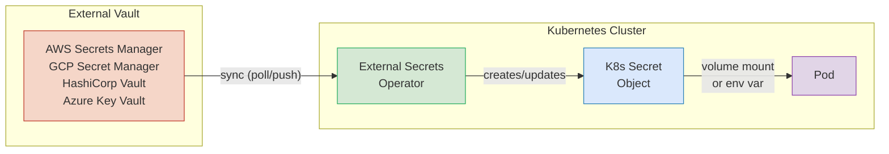

# ConfigMaps and Secrets — Injecting Configuration into Pods

**Doc 10** in the Kubernetes learning path. Covers everything from basic ConfigMap creation through Secret encryption at rest, external secrets operators, and production decision frameworks.

**Key subtopics:** ConfigMap creation and consumption patterns, immutable ConfigMaps, Secret types and base64 encoding, encryption at rest with KMS providers, External Secrets Operator, Sealed Secrets, CSI Secrets Store Driver.

---

## Table of Contents

- [Summary](#summary)
- [ConfigMaps](#configmaps)
  - [What ConfigMaps Solve](#what-configmaps-solve)
  - [Creation Methods](#creation-methods)
  - [Consumption Patterns](#consumption-patterns)
  - [Immutable ConfigMaps](#immutable-configmaps)
  - [Hot-Reloading Behavior](#hot-reloading-behavior)
  - [Binary Data and Size Limits](#binary-data-and-size-limits)
- [Secrets](#secrets)
  - [Secret Types](#secret-types)
  - [Base64 Is Not Encryption](#base64-is-not-encryption)
  - [The stringData Convenience Field](#the-stringdata-convenience-field)
  - [Mounting Secrets: Env Vars vs Volumes](#mounting-secrets-env-vars-vs-volumes)
  - [Why Not envFrom for Secrets](#why-not-envfrom-for-secrets)
  - [Encryption at Rest](#encryption-at-rest)
- [External Secrets Management](#external-secrets-management)
  - [External Secrets Operator (ESO)](#external-secrets-operator-eso)
  - [Sealed Secrets (Bitnami)](#sealed-secrets-bitnami)
  - [CSI Secrets Store Driver](#csi-secrets-store-driver)
  - [Decision Framework](#decision-framework)
- [Spring Boot and Node.js Considerations](#spring-boot-and-nodejs-considerations)
- [Related](#related)
- [References](#references)

---

## Summary

Kubernetes separates configuration from container images using two primitives: **ConfigMaps** for non-sensitive data and **Secrets** for credentials and tokens. Both can be injected as environment variables or mounted as files, but the security implications differ dramatically. For production workloads, native Secrets alone are insufficient — you need encryption at rest and an external secrets management strategy to keep credentials out of Git and tightly audited.

---

## ConfigMaps

### What ConfigMaps Solve

Without ConfigMaps, you would bake configuration into your container image or pass everything through Deployment env vars. ConfigMaps decouple configuration from the image lifecycle:

- **Same image, different config** — deploy the same `my-app:v1.4.2` image across dev, staging, and production with different database URLs, feature flags, and log levels.
- **Config changes without rebuilds** — update a ConfigMap and restart pods instead of building and pushing a new image.
- **Structured config files** — mount entire `application.yml` or `.env` files into the container filesystem.

### Creation Methods

#### From literals

```bash
kubectl create configmap app-config \
  --from-literal=LOG_LEVEL=info \
  --from-literal=MAX_POOL_SIZE=20
```

#### From a file

```bash
# Mount the entire file as a key (key = filename by default)
kubectl create configmap nginx-config --from-file=nginx.conf

# Override the key name
kubectl create configmap nginx-config --from-file=main-config=nginx.conf
```

#### From an env file

```bash
# .env.production contains KEY=VALUE pairs, one per line
kubectl create configmap app-env --from-env-file=.env.production
```

#### Declarative YAML (preferred for GitOps)

```yaml
apiVersion: v1
kind: ConfigMap
metadata:
  name: app-config
  namespace: production
data:
  LOG_LEVEL: "info"
  MAX_POOL_SIZE: "20"
  application.yml: |
    server:
      port: 8080
    spring:
      datasource:
        hikari:
          maximum-pool-size: 20
```

### Consumption Patterns

#### Environment variables with envFrom (all keys)

```yaml
apiVersion: apps/v1
kind: Deployment
metadata:
  name: api-server
spec:
  template:
    spec:
      containers:
        - name: api
          image: my-app:v1.4.2
          envFrom:
            - configMapRef:
                name: app-config
```

Every key in `app-config` becomes an environment variable in the container. Convenient but indiscriminate — if someone adds a key with a name that collides with a system variable, you get silent override bugs.

#### Environment variables with valueFrom (selective)

```yaml
containers:
  - name: api
    image: my-app:v1.4.2
    env:
      - name: LOG_LEVEL
        valueFrom:
          configMapKeyRef:
            name: app-config
            key: LOG_LEVEL
      - name: POOL_SIZE
        valueFrom:
          configMapKeyRef:
            name: app-config
            key: MAX_POOL_SIZE
            optional: true  # pod starts even if key is missing
```

#### Volume mount (files in a directory)

```yaml
containers:
  - name: api
    image: my-app:v1.4.2
    volumeMounts:
      - name: config-volume
        mountPath: /etc/config
        readOnly: true
volumes:
  - name: config-volume
    configMap:
      name: app-config
      items:                    # optional: mount specific keys only
        - key: application.yml
          path: application.yml # file name inside the mount directory
```

This creates `/etc/config/application.yml` inside the container. Spring Boot picks this up automatically if you set `spring.config.additional-location=/etc/config/`.

### Immutable ConfigMaps

```yaml
apiVersion: v1
kind: ConfigMap
metadata:
  name: app-config-v3
immutable: true
data:
  LOG_LEVEL: "warn"
  MAX_POOL_SIZE: "50"
```

Setting `immutable: true` has three consequences:

1. **No watches** — the kubelet stops watching etcd for changes, significantly reducing API server load in clusters with thousands of ConfigMaps.
2. **Accidental mutation prevention** — any `kubectl apply` that tries to modify `data` or `binaryData` is rejected.
3. **Delete and recreate to update** — you must create a new ConfigMap (e.g., `app-config-v4`), update the Deployment to reference it, and delete the old one.

Use immutable ConfigMaps in production when config stability matters more than hot-reload convenience. The version-in-name pattern (`app-config-v3`) works well with Helm's `{{ .Release.Revision }}` or Kustomize's `configMapGenerator` with hash suffixes.

### Hot-Reloading Behavior

When a ConfigMap is mounted as a **volume**, the kubelet periodically syncs the content. The default sync period is configurable but typically around **60 seconds**. The update is atomic — kubelet writes to a new temporary directory and swaps the symlink.

**Critical caveat:** if you use `subPath` to mount a single file from a ConfigMap (e.g., `subPath: application.yml`), that mount **does NOT receive updates**. The file is a copy at pod creation time, not a symlink. This is a common production surprise.

```yaml
# This mount DOES hot-reload:
volumeMounts:
  - name: config-volume
    mountPath: /etc/config      # entire directory

# This mount does NOT hot-reload:
volumeMounts:
  - name: config-volume
    mountPath: /etc/config/application.yml
    subPath: application.yml    # subPath = no updates
```

For Spring Boot, pair volume-mounted ConfigMaps with Spring Cloud Kubernetes Config or an actuator refresh endpoint. For Node.js, use `fs.watch` on the mounted directory or a library like `chokidar`.

### Binary Data and Size Limits

The `binaryData` field holds base64-encoded non-UTF-8 content (TLS certificates, binary config files, protocol buffer definitions):

```yaml
apiVersion: v1
kind: ConfigMap
metadata:
  name: tls-ca-bundle
binaryData:
  ca-bundle.crt: LS0tLS1CRUdJTi... # base64-encoded binary
data:
  config.txt: "regular UTF-8 string"
```

**Size limit:** each ConfigMap is capped at **1 MiB** (total of `data` + `binaryData`). This is an etcd storage constraint. If you need larger config, consider an init container that fetches from object storage.

---

## Secrets

### Secret Types

Kubernetes Secrets have a `type` field that affects validation and tooling behavior:

| Type | Purpose | Required Keys |
|------|---------|---------------|
| `Opaque` | Generic key-value pairs (default) | None |
| `kubernetes.io/tls` | TLS certificate + private key | `tls.crt`, `tls.key` |
| `kubernetes.io/dockerconfigjson` | Image pull credentials | `.dockerconfigjson` |
| `kubernetes.io/service-account-token` | ServiceAccount token (legacy, auto-created pre-1.24) | `token`, `ca.crt`, `namespace` |
| `kubernetes.io/basic-auth` | Username/password | `username`, `password` |
| `kubernetes.io/ssh-auth` | SSH private key | `ssh-privatekey` |

```yaml
apiVersion: v1
kind: Secret
metadata:
  name: db-credentials
type: Opaque
data:
  username: YWRtaW4=        # echo -n "admin" | base64
  password: czNjcjN0UEBzcw== # echo -n "s3cr3tP@ss" | base64
```

```yaml
apiVersion: v1
kind: Secret
metadata:
  name: app-tls
type: kubernetes.io/tls
data:
  tls.crt: LS0tLS1CRUdJTi...  # base64-encoded certificate
  tls.key: LS0tLS1CRUdJTi...  # base64-encoded private key
```

### Base64 Is Not Encryption

This is the most misunderstood aspect of Kubernetes Secrets. The `data` field stores values as **base64-encoded** strings. This is an encoding format, not encryption:

```bash
# Anyone with kubectl access can decode:
echo "czNjcjN0UEBzcw==" | base64 -d
# Output: s3cr3tP@ss

# Or just ask kubectl directly:
kubectl get secret db-credentials -o jsonpath='{.data.password}' | base64 -d
```

Base64 exists because Secret values can contain binary data (certificates, keys) that are not valid UTF-8. It does **not** provide confidentiality. Anyone with RBAC `get` permission on Secrets in the namespace can read every secret in plaintext.

### The stringData Convenience Field

Writing base64 by hand is error-prone. The `stringData` field accepts plain text and converts to base64 on save:

```yaml
apiVersion: v1
kind: Secret
metadata:
  name: db-credentials
type: Opaque
stringData:                    # human-readable input
  username: admin
  password: "s3cr3tP@ss"
  connection-string: "postgresql://admin:s3cr3tP@ss@db:5432/myapp"
```

After `kubectl apply`, the API server stores everything under `data` as base64. `stringData` never appears in the stored object — it is a write-only convenience. If you `kubectl get` the Secret, you will see base64 under `data`.

### Mounting Secrets: Env Vars vs Volumes

#### Environment variable injection

```yaml
containers:
  - name: api
    env:
      - name: DB_PASSWORD
        valueFrom:
          secretKeyRef:
            name: db-credentials
            key: password
```

#### Volume mount (preferred)

```yaml
containers:
  - name: api
    volumeMounts:
      - name: db-creds
        mountPath: /etc/secrets/db
        readOnly: true
volumes:
  - name: db-creds
    secret:
      secretName: db-credentials
      defaultMode: 0400          # read-only for owner
```

This creates files at `/etc/secrets/db/username` and `/etc/secrets/db/password`.

**Why volume mounts are preferred for secrets:**

| Concern | Env Var | Volume Mount |
|---------|---------|--------------|
| Visible in `kubectl describe pod` | Yes (masked but queryable) | No |
| Leaks into child processes | Yes (inherited by default) | No |
| Appears in crash dumps / core dumps | Often | Rarely |
| Hot-reloadable | No (requires pod restart) | Yes (~60s sync) |
| Readable by `docker inspect` | Yes | Tmpfs only |

### Why Not envFrom for Secrets

```yaml
# Avoid this pattern for Secrets:
envFrom:
  - secretRef:
      name: db-credentials
```

Problems with `envFrom` for Secrets:

1. **No selective control** — every key in the Secret becomes an env var. If someone adds a new key, it is automatically injected.
2. **Audit difficulty** — you cannot tell from the Pod spec which specific secrets are consumed.
3. **Name collision risk** — a Secret key named `PATH` or `HOME` silently overrides critical system variables.
4. **All-or-nothing exposure** — a pod that only needs the DB password also gets every other credential in the Secret.

Use `valueFrom` with `secretKeyRef` for the few secrets a pod actually needs, or prefer volume mounts entirely.

### Encryption at Rest

By default, Secrets are stored **unencrypted** in etcd. Anyone with direct etcd access (or etcd backups) can read them in plaintext. Encryption at rest solves this.

#### EncryptionConfiguration

Create an encryption config file and pass it to the API server:

```yaml
apiVersion: apiserver.config.k8s.io/v1
kind: EncryptionConfiguration
resources:
  - resources:
      - secrets
    providers:
      # First provider is used for encryption; all are tried for decryption
      - aescbc:
          keys:
            - name: key1
              secret: <base64-encoded-32-byte-key>
      - identity: {}   # fallback: read unencrypted secrets written before encryption was enabled
```

Pass to kube-apiserver:

```bash
--encryption-provider-config=/etc/kubernetes/encryption-config.yaml
```

After enabling, re-encrypt existing secrets:

```bash
kubectl get secrets --all-namespaces -o json | kubectl replace -f -
```

#### Encryption Provider Comparison

| Provider | Strength | Key Management | Use Case |
|----------|----------|----------------|----------|
| `aescbc` | AES-256-CBC with PKCS7 padding | Static key in config file | Self-managed clusters |
| `aesgcm` | AES-256-GCM (authenticated) | Static key, must rotate frequently | Higher security, faster |
| `secretbox` | XSalsa20 + Poly1305 | Static key in config file | Modern authenticated encryption |
| `kms` v2 | Envelope encryption | External KMS manages DEK wrapping | **Production recommended** |

#### KMS Providers (Production)

KMS v2 uses **envelope encryption**: the API server generates a data encryption key (DEK) to encrypt the Secret, then the DEK itself is encrypted by the external KMS. Only the encrypted DEK is stored alongside the secret in etcd.

| Cloud | KMS Provider | Plugin |
|-------|-------------|--------|
| AWS | AWS KMS | `aws-encryption-provider` |
| GCP | Cloud KMS | Built into GKE |
| Azure | Azure Key Vault | `azure-kms-provider` |

On managed Kubernetes (EKS, GKE, AKS), encryption at rest with the cloud KMS is typically a single toggle in the cluster configuration.

---

## External Secrets Management

Native Kubernetes Secrets, even encrypted at rest, have limitations: credentials live inside etcd, RBAC is the only access control, there is no audit trail of who read which secret, and rotation requires manual updates. External secrets management addresses all of these.



### External Secrets Operator (ESO)

The [External Secrets Operator](https://external-secrets.io/) is a Kubernetes operator that reads secrets from external APIs and injects them as Kubernetes Secrets. It is the most widely adopted approach for multi-cloud teams.

**Architecture:** ESO defines two CRDs:

- **SecretStore** (namespace-scoped) or **ClusterSecretStore** (cluster-wide) — defines _how_ to connect to the external provider (endpoint, authentication).
- **ExternalSecret** — defines _what_ to fetch and how to map it into a K8s Secret.

#### SecretStore Example (AWS Secrets Manager)

```yaml
apiVersion: external-secrets.io/v1beta1
kind: SecretStore
metadata:
  name: aws-secrets
  namespace: production
spec:
  provider:
    aws:
      service: SecretsManager
      region: ap-northeast-1
      auth:
        jwt:
          serviceAccountRef:
            name: eso-service-account  # uses IRSA (IAM Roles for Service Accounts)
```

#### ExternalSecret Example

```yaml
apiVersion: external-secrets.io/v1beta1
kind: ExternalSecret
metadata:
  name: db-credentials
  namespace: production
spec:
  refreshInterval: 1h              # poll frequency
  secretStoreRef:
    name: aws-secrets
    kind: SecretStore
  target:
    name: db-credentials           # resulting K8s Secret name
    creationPolicy: Owner          # ESO owns the Secret lifecycle
    deletionPolicy: Retain         # keep Secret if ExternalSecret is deleted
  data:
    - secretKey: username          # key in the K8s Secret
      remoteRef:
        key: production/db-creds   # path in AWS Secrets Manager
        property: username         # JSON property within the secret
    - secretKey: password
      remoteRef:
        key: production/db-creds
        property: password
  dataFrom:                        # alternative: fetch all keys from a path
    - extract:
        key: production/app-config
```

ESO creates and maintains a standard `Kind=Secret` — your pods consume it the same way they would any native Secret. The operator handles rotation by polling at `refreshInterval`.

### Sealed Secrets (Bitnami)

[Sealed Secrets](https://github.com/bitnami-labs/sealed-secrets) solves a different problem: how to store encrypted secrets safely in Git for GitOps workflows.

**How it works:**

1. A controller runs in the cluster and generates an asymmetric key pair (public + private).
2. You use the `kubeseal` CLI with the **public key** to encrypt a regular Secret into a `SealedSecret` custom resource.
3. The encrypted `SealedSecret` is safe to commit to Git — it can only be decrypted by the controller using its **private key**.
4. When the `SealedSecret` is applied to the cluster, the controller decrypts it and creates a standard K8s Secret.

```bash
# Create a regular secret (not applied to cluster)
kubectl create secret generic db-credentials \
  --from-literal=password=s3cr3tP@ss \
  --dry-run=client -o yaml > secret.yaml

# Encrypt with kubeseal
kubeseal --format yaml < secret.yaml > sealed-secret.yaml

# The sealed-secret.yaml is safe to commit to Git
git add sealed-secret.yaml && git commit -m "chore: add encrypted db credentials"
```

```yaml
apiVersion: bitnami.com/v1alpha1
kind: SealedSecret
metadata:
  name: db-credentials
  namespace: production
spec:
  encryptedData:
    password: AgBy3i4OJSWK+PIy...  # asymmetrically encrypted
  template:
    metadata:
      name: db-credentials
      namespace: production
    type: Opaque
```

**Scope controls:** Sealed Secrets can be scoped to `strict` (bound to a specific name + namespace), `namespace-wide` (any name within a namespace), or `cluster-wide` (any name in any namespace). Use `strict` by default.

### CSI Secrets Store Driver

The [Secrets Store CSI Driver](https://secrets-store-csi-driver.sigs.k8s.io/) takes a fundamentally different approach: it mounts secrets directly from an external vault as a volume, **without creating a Kubernetes Secret object** at all.

**Architecture:**

- A **DaemonSet** runs the CSI driver on every node.
- A **provider plugin** (Vault, AWS, Azure, GCP) handles authentication and retrieval for a specific backend.
- A **SecretProviderClass** CRD declares what to fetch and how to mount it.
- On pod start, the CSI driver calls the provider via gRPC, fetches secrets, and writes them to a `tmpfs` volume mounted into the pod.

```yaml
apiVersion: secrets-store.csi.x-k8s.io/v1
kind: SecretProviderClass
metadata:
  name: vault-db-creds
  namespace: production
spec:
  provider: vault
  parameters:
    vaultAddress: "https://vault.internal:8200"
    roleName: "production-app"
    objects: |
      - objectName: "db-password"
        secretPath: "secret/data/production/db"
        secretKey: "password"
  secretObjects:                   # optional: also sync to a K8s Secret
    - secretName: db-credentials
      type: Opaque
      data:
        - objectName: db-password
          key: password
```

```yaml
# Pod spec referencing the CSI volume
containers:
  - name: api
    volumeMounts:
      - name: secrets
        mountPath: /mnt/secrets
        readOnly: true
volumes:
  - name: secrets
    csi:
      driver: secrets-store.csi.k8s.io
      readOnly: true
      volumeAttributes:
        secretProviderClass: vault-db-creds
```

**Key advantage:** secrets never exist as a K8s Secret object, so they cannot be read through `kubectl get secret`. This shrinks the attack surface significantly. The optional `secretObjects` field can sync to a K8s Secret if other workloads need it.

### Decision Framework

| Criteria | ESO | Sealed Secrets | CSI Driver |
|----------|-----|----------------|------------|
| **Secrets in Git?** | No (only ExternalSecret CRDs) | Yes (encrypted) | No (only SecretProviderClass) |
| **K8s Secret created?** | Yes | Yes | Optional |
| **Rotation** | Automatic (poll interval) | Manual re-seal | On pod restart |
| **Vault/cloud integration** | Native (many providers) | None (K8s-only) | Native (provider plugins) |
| **GitOps friendly** | Yes | Very (designed for it) | Yes |
| **Attack surface** | Standard K8s Secret | Standard K8s Secret | Minimal (tmpfs only) |
| **Complexity** | Medium | Low | Medium-High |

**When to use which:**

- **ESO** — you use a cloud secrets manager (AWS Secrets Manager, GCP Secret Manager, Azure Key Vault) and want automatic sync + rotation. The most common choice for cloud-native teams.
- **Sealed Secrets** — you want encrypted secrets in Git and do not have an external secrets manager, or you need a low-complexity GitOps solution.
- **CSI Driver** — you run HashiCorp Vault (or equivalent) and want to minimize the K8s Secret attack surface. Best for high-security environments where secrets should never exist as K8s objects.
- **Combine them** — ESO + Sealed Secrets is common. Use ESO for runtime secrets synced from a vault, and Sealed Secrets for bootstrap credentials (the ESO service account token itself, for example).

---

## Spring Boot and Node.js Considerations

**Spring Boot** reads configuration from environment variables and config files automatically. For K8s:
- Mount a ConfigMap containing `application.yml` to `/etc/config/` and set `SPRING_CONFIG_ADDITIONAL_LOCATION=/etc/config/`.
- Spring Cloud Kubernetes can watch ConfigMaps and trigger `@RefreshScope` beans without pod restarts.
- See [Kubernetes and Spring Boot](../../java/configurations/kubernetes-spring-boot.md) for application-level patterns.

**Node.js** does not have Spring's config abstraction. Common patterns:
- Read mounted files with `fs.readFileSync('/etc/secrets/db/password', 'utf-8').trim()` at startup.
- Use `dotenv` with a volume-mounted `.env` file.
- Use `chokidar` or `fs.watch` on the mount directory to detect ConfigMap hot-reloads.
- See [Node.js in Kubernetes](../../typescript/production/nodejs-in-kubernetes.md) for containerization patterns.

---

## Related

- [Pods, ReplicaSets, and Deployments](../workloads/pods-and-deployments.md) — how pods consume ConfigMaps and Secrets
- [Secrets Management and Supply Chain Security](../security/secrets-and-supply-chain.md) — deeper dive on encryption, ESO, and image provenance
- [Kubernetes and Spring Boot](../../java/configurations/kubernetes-spring-boot.md) — application-level K8s configuration for Java
- [Node.js in Kubernetes](../../typescript/production/nodejs-in-kubernetes.md) — containerizing and configuring Node.js in K8s
- [RBAC, ServiceAccounts, and Identity](../security/rbac-and-service-accounts.md) — controlling who can read Secrets

---

## References

1. [Kubernetes Documentation — ConfigMaps](https://kubernetes.io/docs/concepts/configuration/configmap/)
2. [Kubernetes Documentation — Secrets](https://kubernetes.io/docs/concepts/configuration/secret/)
3. [Kubernetes Documentation — Encrypting Confidential Data at Rest](https://kubernetes.io/docs/tasks/administer-cluster/encrypt-data/)
4. [External Secrets Operator — Overview and API Reference](https://external-secrets.io/latest/introduction/overview/)
5. [Bitnami Sealed Secrets — GitHub Repository](https://github.com/bitnami-labs/sealed-secrets)
6. [Secrets Store CSI Driver — Introduction](https://secrets-store-csi-driver.sigs.k8s.io/)
7. [Kubernetes Documentation — Managing Secrets using kubectl](https://kubernetes.io/docs/tasks/configmap-secret/managing-secret-using-kubectl/)
8. [AWS EKS Best Practices — Secrets Management](https://aws.github.io/aws-eks-best-practices/security/docs/data/)
