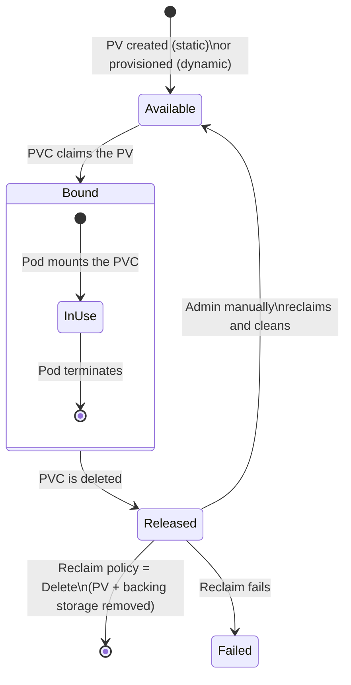
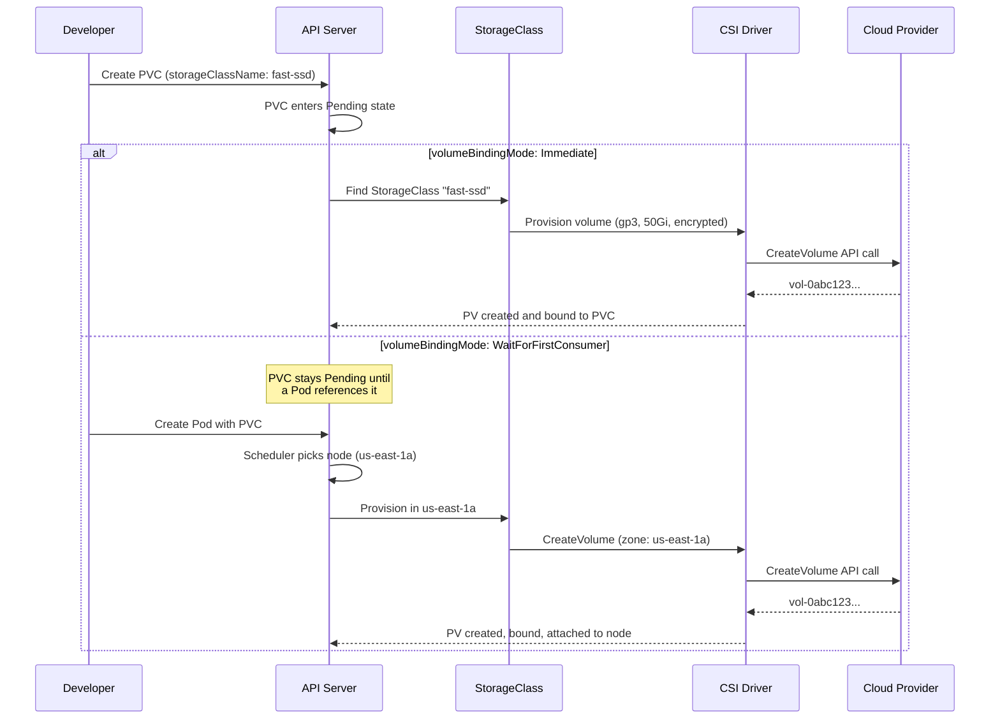
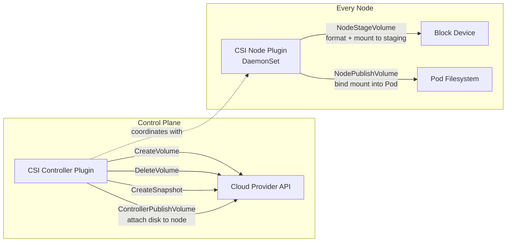

# Persistent Volumes, PVCs, and StorageClasses — Stateful Storage in Kubernetes

**Date:** 2026-04-24 | **Updated:** 2026-04-24
**Tags:** `kubernetes` `persistent-volumes` `storage` `pvc` `csi`

## Table of Contents

- [Summary](#summary)
- [The PV/PVC Abstraction](#the-pvpvc-abstraction)
  - [Why Two Objects](#why-two-objects)
  - [PersistentVolume (PV)](#persistentvolume-pv)
  - [PersistentVolumeClaim (PVC)](#persistentvolumeclaim-pvc)
  - [Binding](#binding)
  - [Lifecycle](#lifecycle)
- [Access Modes](#access-modes)
- [Reclaim Policies](#reclaim-policies)
- [StorageClasses and Dynamic Provisioning](#storageclasses-and-dynamic-provisioning)
  - [What a StorageClass Defines](#what-a-storageclass-defines)
  - [Dynamic Provisioning Flow](#dynamic-provisioning-flow)
  - [Default StorageClass](#default-storageclass)
  - [Volume Binding Modes](#volume-binding-modes)
- [CSI — Container Storage Interface](#csi--container-storage-interface)
  - [Architecture](#architecture)
  - [Popular CSI Drivers](#popular-csi-drivers)
- [Advanced Features](#advanced-features)
  - [Volume Snapshots](#volume-snapshots)
  - [PVC Expansion](#pvc-expansion)
  - [Ephemeral Volumes](#ephemeral-volumes)
- [volumeClaimTemplates in StatefulSets](#volumeclaimtemplates-in-statefulsets)
- [Practical Patterns for Backend Developers](#practical-patterns-for-backend-developers)
- [Related](#related)
- [References](#references)

## Summary

Containers are ephemeral. When a Pod dies, its filesystem vanishes. If your Spring Boot app writes to a PostgreSQL database or your Node.js service stores uploaded files, you need storage that survives Pod restarts, rescheduling, and even node failures. Kubernetes solves this with a two-object abstraction: **PersistentVolumes** (PVs) represent actual storage provisioned by a cluster admin or dynamically by a StorageClass, while **PersistentVolumeClaims** (PVCs) let developers request storage without knowing where it lives. This separation mirrors the Kubernetes philosophy of decoupling infrastructure concerns from application concerns. Combined with **CSI drivers**, **volume snapshots**, and **dynamic provisioning**, the storage subsystem handles everything from a single Postgres disk to multi-replica Kafka log directories.

---

## The PV/PVC Abstraction

### Why Two Objects

The separation exists for the same reason databases have schemas and application code: **different teams own different concerns**.

| Role | Object | Responsibility |
|------|--------|----------------|
| **Cluster admin / platform team** | PersistentVolume, StorageClass | Provision storage, define performance tiers, configure backup policies |
| **Application developer** | PersistentVolumeClaim | Request "I need 10Gi of fast storage" without caring if it is EBS, GCE PD, or Ceph |

A developer writing a Spring Boot `application.yml` or a Node.js Dockerfile never needs to know the cloud provider's storage API. They write a PVC; Kubernetes handles the rest.

### PersistentVolume (PV)

A PV is a **cluster-scoped resource** — it has no namespace. It represents a piece of storage that already exists (static provisioning) or will be created on demand (dynamic provisioning).

```yaml
apiVersion: v1
kind: PersistentVolume
metadata:
  name: pv-postgres-data
spec:
  capacity:
    storage: 50Gi
  accessModes:
    - ReadWriteOnce
  persistentVolumeReclaimPolicy: Retain
  storageClassName: fast-ssd
  csi:
    driver: ebs.csi.aws.com
    volumeHandle: vol-0abc123def456789a
    fsType: ext4
  nodeAffinity:                          # required for topology-bound storage
    required:
      nodeSelectorTerms:
        - matchExpressions:
            - key: topology.kubernetes.io/zone
              operator: In
              values:
                - us-east-1a
```

Key fields:
- **`capacity.storage`** — the size of the volume
- **`accessModes`** — how the volume can be mounted (see [Access Modes](#access-modes))
- **`persistentVolumeReclaimPolicy`** — what happens when the PVC is deleted
- **`storageClassName`** — links this PV to a StorageClass (empty string means no class)
- **`csi`** — driver-specific details for CSI volumes
- **`nodeAffinity`** — constrains which nodes can access this volume (critical for zone-bound block storage)

### PersistentVolumeClaim (PVC)

A PVC is **namespace-scoped**. It is a request for storage that a Pod can reference.

```yaml
apiVersion: v1
kind: PersistentVolumeClaim
metadata:
  name: postgres-data
  namespace: production
spec:
  accessModes:
    - ReadWriteOnce
  storageClassName: fast-ssd
  resources:
    requests:
      storage: 50Gi
```

The developer writes this. The scheduler finds (or creates) a PV that satisfies the request.

### Binding

Kubernetes binds a PVC to a PV when the PV matches the PVC's requirements:

1. **Capacity**: PV capacity >= PVC request (a 100Gi PV can satisfy a 50Gi PVC, but the extra 50Gi is wasted)
2. **Access modes**: PV supports all access modes the PVC requests
3. **StorageClass**: PV's `storageClassName` matches the PVC's `storageClassName`
4. **Selector**: If the PVC specifies `selector.matchLabels`, only PVs with those labels qualify

Binding is **one-to-one**. Once bound, the PV is exclusively reserved for that PVC. No other PVC can claim it.

### Lifecycle



| Phase | Meaning |
|-------|---------|
| **Available** | PV exists and is not yet bound to any PVC |
| **Bound** | PV is bound to a PVC — storage is in use |
| **Released** | The PVC was deleted but the PV has not been reclaimed yet |
| **Failed** | Automatic reclamation failed |

---

## Access Modes

Access modes describe how a volume can be mounted. They are **not** about throughput or IOPS — they define **concurrency constraints**.

| Mode | Short | Description | Typical Backend |
|------|-------|-------------|-----------------|
| **ReadWriteOnce** | RWO | Single node can mount read-write | Block storage: AWS EBS, GCE PD, Azure Disk |
| **ReadOnlyMany** | ROX | Multiple nodes can mount read-only | Any storage (useful for shared config, ML models) |
| **ReadWriteMany** | RWX | Multiple nodes can mount read-write | NFS, CephFS, AWS EFS, Azure Files, GlusterFS |
| **ReadWriteOncePod** | RWOP | Single Pod can mount read-write | CSI volumes on K8s 1.29+ (GA since v1.29) |

**Key distinctions:**

- **RWO allows multiple Pods on the same node** to mount the volume simultaneously. If two Pods land on the same node (common with low replica counts), both can write to the same volume. This is fine for a singleton database but dangerous if you assumed exclusivity.
- **RWOP is stricter** — Kubernetes guarantees exactly one Pod across the entire cluster can mount the volume. If a second Pod tries, it blocks until the first releases. Use this for databases or write-ahead logs where dual-writer corruption is unrecoverable.
- **RWX requires a distributed filesystem.** Block storage like EBS physically cannot serve two nodes simultaneously. If your Spring Boot app needs shared file uploads across replicas, you need EFS, NFS, or CephFS — or redesign to use object storage (S3).

> **For your Java/Node apps:** Most single-instance databases (PostgreSQL, MongoDB) use RWO. If you run multiple Deployment replicas that all need to read/write the same filesystem (file uploads, shared caches), you need RWX — or better yet, use S3/MinIO and avoid the complexity.

---

## Reclaim Policies

When a PVC is deleted, the reclaim policy on the PV determines what happens to the backing storage:

| Policy | Behavior | Use Case |
|--------|----------|----------|
| **Retain** | PV moves to `Released` state. Backing storage and data are preserved. Admin must manually clean up and re-create the PV to reuse it. | Production databases where data loss is unacceptable |
| **Delete** | PV and its backing storage (the actual EBS volume, GCE PD, etc.) are deleted automatically. | Ephemeral environments, CI/CD, development clusters |
| ~~Recycle~~ | ~~`rm -rf /volume/*` and make PV available again~~ | **Deprecated.** Use dynamic provisioning instead. |

**Default behavior:** Dynamically provisioned PVs inherit the reclaim policy from their StorageClass. Most cloud-provider StorageClasses default to `Delete`. **This means deleting a PVC in production destroys the data permanently.** If you want safety, set `reclaimPolicy: Retain` on your production StorageClasses.

```yaml
# Override reclaim policy on an existing PV
kubectl patch pv pv-postgres-data -p '{"spec":{"persistentVolumeReclaimPolicy":"Retain"}}'
```

---

## StorageClasses and Dynamic Provisioning

### What a StorageClass Defines

A StorageClass is a **cluster-scoped** object that tells Kubernetes how to provision storage on demand. It defines:
- **Which provisioner** creates the volume (CSI driver or built-in provider)
- **What parameters** to pass (disk type, IOPS, encryption, filesystem)
- **What reclaim policy** to apply
- **When to provision** (immediately or wait for a Pod)

```yaml
apiVersion: storage.k8s.io/v1
kind: StorageClass
metadata:
  name: fast-ssd
provisioner: ebs.csi.aws.com
parameters:
  type: gp3                      # AWS EBS volume type
  iops: "5000"                   # provisioned IOPS
  throughput: "250"              # MB/s throughput
  encrypted: "true"
  fsType: ext4
reclaimPolicy: Retain            # keep data on PVC deletion
volumeBindingMode: WaitForFirstConsumer
allowVolumeExpansion: true       # allow PVC resizing
```

### Dynamic Provisioning Flow



With dynamic provisioning, **nobody creates PVs manually**. The developer writes a PVC, references a StorageClass, and Kubernetes handles the rest. This is the standard pattern in cloud-managed clusters (EKS, GKE, AKS).

### Default StorageClass

One StorageClass in the cluster can be marked as default. Any PVC that omits `storageClassName` uses it automatically:

```yaml
apiVersion: storage.k8s.io/v1
kind: StorageClass
metadata:
  name: standard
  annotations:
    storageclass.kubernetes.io/is-default-class: "true"   # this annotation makes it default
provisioner: ebs.csi.aws.com
parameters:
  type: gp3
reclaimPolicy: Delete
volumeBindingMode: WaitForFirstConsumer
```

```bash
# Check which StorageClass is default
kubectl get storageclass
# NAME                 PROVISIONER       RECLAIMPOLICY   VOLUMEBINDINGMODE       AGE
# standard (default)   ebs.csi.aws.com   Delete          WaitForFirstConsumer    30d
# fast-ssd             ebs.csi.aws.com   Retain          WaitForFirstConsumer    30d
# shared-nfs           nfs.csi.k8s.io    Delete          Immediate               15d
```

> **Gotcha:** If you explicitly set `storageClassName: ""` (empty string) on a PVC, it opts out of dynamic provisioning entirely and only binds to PVs that also have no class. This is different from omitting the field, which uses the default class.

### Volume Binding Modes

| Mode | When PV Is Provisioned | When to Use |
|------|----------------------|-------------|
| **`Immediate`** | As soon as the PVC is created | Network-attached storage accessible from any node (NFS, EFS) |
| **`WaitForFirstConsumer`** | When a Pod referencing the PVC is scheduled to a node | Zone-bound block storage (EBS, GCE PD, Azure Disk) |

**Why `WaitForFirstConsumer` matters:** Block storage volumes are zone-specific. An EBS volume in `us-east-1a` cannot be attached to a node in `us-east-1b`. If you use `Immediate`, the volume might be provisioned in `us-east-1a`, but the scheduler places the Pod in `us-east-1b` due to resource constraints — resulting in a scheduling deadlock. `WaitForFirstConsumer` lets the scheduler pick the node first, then provisions the volume in the correct zone.

**Always use `WaitForFirstConsumer` for block storage.** It is the safe default for EBS, GCE PD, and Azure Disk.

---

## CSI — Container Storage Interface

### Architecture

Before CSI, storage drivers were compiled into Kubernetes itself ("in-tree plugins"). This meant adding a new storage backend required changes to the Kubernetes codebase and a new release. CSI decouples storage from Kubernetes through a standardized gRPC interface.

A CSI driver has two main components:



| Component | Runs As | Responsibility |
|-----------|---------|----------------|
| **Controller Plugin** | Deployment (1-2 replicas) | Volume lifecycle: create, delete, attach, detach, snapshot |
| **Node Plugin** | DaemonSet (every node) | Format, mount, bind-mount into Pod; node-level operations |

Both components run as regular Pods. The CSI driver registers itself with the kubelet, and Kubernetes delegates all storage operations to it.

### Popular CSI Drivers

| Driver | Storage Backend | Access Modes | Notes |
|--------|----------------|--------------|-------|
| `ebs.csi.aws.com` | AWS EBS | RWO, RWOP | Default for EKS; replaces in-tree `aws-ebs` |
| `pd.csi.storage.gke.io` | GCE Persistent Disk | RWO, ROX, RWOP | Default for GKE |
| `disk.csi.azure.com` | Azure Managed Disk | RWO, RWOP | Default for AKS |
| `efs.csi.aws.com` | AWS EFS (NFS) | RWX | Shared filesystem for multi-replica workloads |
| `file.csi.azure.com` | Azure Files (SMB/NFS) | RWX | Azure's shared filesystem |
| `nfs.csi.k8s.io` | Any NFS server | RWX | Community driver for self-hosted NFS |
| `smb.csi.k8s.io` | Any SMB/CIFS share | RWX | Community driver for Windows/SMB environments |

> **For EKS users:** The `aws-ebs-csi-driver` is an EKS add-on. Enable it in your cluster configuration — EBS volumes will not work without it on newer EKS versions (the in-tree plugin is removed).

---

## Advanced Features

### Volume Snapshots

Volume snapshots let you create point-in-time copies of a PVC's data — like a database backup at the storage layer. The snapshot API has been **GA since Kubernetes 1.20** (the `snapshot.storage.k8s.io/v1` API group). Volume group snapshots (snapshotting multiple volumes atomically) are still in beta as of Kubernetes 1.34.

Three objects are involved:

| Object | Scope | Purpose |
|--------|-------|---------|
| **VolumeSnapshotClass** | Cluster | Defines which CSI driver handles snapshots and with what parameters |
| **VolumeSnapshot** | Namespace | Request to create a snapshot from a PVC |
| **VolumeSnapshotContent** | Cluster | The actual snapshot (analogous to PV for PVCs) |

**Create a VolumeSnapshotClass:**

```yaml
apiVersion: snapshot.storage.k8s.io/v1
kind: VolumeSnapshotClass
metadata:
  name: ebs-snapshot-class
driver: ebs.csi.aws.com
deletionPolicy: Retain               # keep snapshot even if VolumeSnapshot is deleted
```

**Take a snapshot:**

```yaml
apiVersion: snapshot.storage.k8s.io/v1
kind: VolumeSnapshot
metadata:
  name: postgres-snapshot-20260424
  namespace: production
spec:
  volumeSnapshotClassName: ebs-snapshot-class
  source:
    persistentVolumeClaimName: postgres-data    # snapshot this PVC
```

**Restore from a snapshot (create a new PVC from the snapshot):**

```yaml
apiVersion: v1
kind: PersistentVolumeClaim
metadata:
  name: postgres-data-restored
  namespace: production
spec:
  accessModes:
    - ReadWriteOnce
  storageClassName: fast-ssd
  resources:
    requests:
      storage: 50Gi
  dataSource:
    name: postgres-snapshot-20260424
    kind: VolumeSnapshot
    apiGroup: snapshot.storage.k8s.io
```

This is powerful for database migrations: snapshot before running a schema migration, and restore the snapshot if the migration fails.

### PVC Expansion

Growing a volume without downtime. The StorageClass must opt in:

```yaml
apiVersion: storage.k8s.io/v1
kind: StorageClass
metadata:
  name: expandable-ssd
provisioner: ebs.csi.aws.com
allowVolumeExpansion: true        # this enables PVC expansion
```

Then simply edit the PVC's storage request:

```bash
kubectl patch pvc postgres-data -p '{"spec":{"resources":{"requests":{"storage":"100Gi"}}}}'
```

What happens behind the scenes:
1. The CSI controller plugin calls `ExpandVolume` on the cloud provider (e.g., AWS `ModifyVolume`)
2. The cloud provider resizes the underlying block device
3. On the next mount (or immediately if the Pod is running), the CSI node plugin resizes the filesystem

**Limitations:**
- **Shrinking is not supported.** You cannot decrease the size of a PVC.
- **File system resize may require a Pod restart** depending on the CSI driver and filesystem type. Most modern CSI drivers support online expansion for ext4 and xfs.
- **Not all provisioners support expansion.** Check your CSI driver documentation.

### Ephemeral Volumes

Not all storage needs to survive a Pod restart. Kubernetes provides several ephemeral volume types:

**`emptyDir` — scratch space that lives as long as the Pod:**

```yaml
apiVersion: v1
kind: Pod
metadata:
  name: data-processor
spec:
  containers:
    - name: app
      image: myapp:latest
      volumeMounts:
        - name: scratch
          mountPath: /tmp/work
    - name: sidecar
      image: helper:latest
      volumeMounts:
        - name: scratch
          mountPath: /data
  volumes:
    - name: scratch
      emptyDir:
        sizeLimit: 1Gi             # optional size cap
        # medium: Memory           # uncomment to use RAM-backed tmpfs
```

Use cases:
- Temporary file processing between sidecar containers
- Build artifacts during init containers
- Cache that can be rebuilt on restart
- `medium: Memory` for tmpfs (RAM-backed) when you need fast ephemeral I/O

**Projected volumes — combine multiple sources into one mount:**

```yaml
volumes:
  - name: combined
    projected:
      sources:
        - configMap:
            name: app-config
        - secret:
            name: db-credentials
        - serviceAccountToken:
            path: token
            expirationSeconds: 3600
            audience: vault
```

This is commonly used for injecting service account tokens with specific audiences (e.g., for Vault or workload identity federation).

**Generic ephemeral volumes — dynamically provisioned, Pod-lifetime storage:**

```yaml
apiVersion: v1
kind: Pod
metadata:
  name: batch-processor
spec:
  containers:
    - name: processor
      image: batch:latest
      volumeMounts:
        - name: work-volume
          mountPath: /data
  volumes:
    - name: work-volume
      ephemeral:
        volumeClaimTemplate:
          spec:
            accessModes:
              - ReadWriteOnce
            storageClassName: fast-ssd
            resources:
              requests:
                storage: 100Gi
```

The PVC is created when the Pod starts and deleted when the Pod is removed. Useful for batch jobs that need large scratch disks with specific performance characteristics.

---

## volumeClaimTemplates in StatefulSets

StatefulSets are the primary consumer of persistent storage in Kubernetes. The `volumeClaimTemplates` field automates per-Pod PVC creation:

```yaml
apiVersion: apps/v1
kind: StatefulSet
metadata:
  name: postgres
  namespace: production
spec:
  serviceName: postgres
  replicas: 3
  selector:
    matchLabels:
      app: postgres
  template:
    metadata:
      labels:
        app: postgres
    spec:
      containers:
        - name: postgres
          image: postgres:16
          ports:
            - containerPort: 5432
          volumeMounts:
            - name: data
              mountPath: /var/lib/postgresql/data
            - name: wal
              mountPath: /var/lib/postgresql/wal
  volumeClaimTemplates:
    - metadata:
        name: data                      # PVCs: data-postgres-0, data-postgres-1, data-postgres-2
      spec:
        accessModes:
          - ReadWriteOnce
        storageClassName: fast-ssd
        resources:
          requests:
            storage: 50Gi
    - metadata:
        name: wal                       # PVCs: wal-postgres-0, wal-postgres-1, wal-postgres-2
      spec:
        accessModes:
          - ReadWriteOnce
        storageClassName: fast-ssd
        resources:
          requests:
            storage: 10Gi
```

How it works:
- For each replica, Kubernetes creates PVCs named `<template-name>-<statefulset-name>-<ordinal>`
- With 3 replicas and 2 templates, you get 6 PVCs: `data-postgres-0`, `data-postgres-1`, `data-postgres-2`, `wal-postgres-0`, `wal-postgres-1`, `wal-postgres-2`
- Each Pod always binds to its own PVCs — `postgres-1` always mounts `data-postgres-1`
- **On scale-down, PVCs are NOT deleted** — data is preserved for when you scale back up
- **On scale-up, existing PVCs are reused** — `postgres-3` remounts `data-postgres-3` if it still exists

This is why StatefulSets are the go-to for databases: each replica gets its own disk, and the mapping between Pod identity and storage is deterministic and persistent.

> **Separate WAL and data volumes:** For PostgreSQL, placing write-ahead logs on a separate volume with higher IOPS improves write performance and makes point-in-time recovery easier. The example above demonstrates this pattern with two `volumeClaimTemplates`.

---

## Practical Patterns for Backend Developers

### PostgreSQL on Kubernetes (Spring Boot / Node.js)

```yaml
# StorageClass for database workloads
apiVersion: storage.k8s.io/v1
kind: StorageClass
metadata:
  name: db-storage
provisioner: ebs.csi.aws.com
parameters:
  type: gp3
  iops: "3000"
  throughput: "125"
  encrypted: "true"
reclaimPolicy: Retain
volumeBindingMode: WaitForFirstConsumer
allowVolumeExpansion: true
---
# PVC for a single-instance Postgres (Deployment, not StatefulSet)
apiVersion: v1
kind: PersistentVolumeClaim
metadata:
  name: postgres-data
  namespace: staging
spec:
  accessModes:
    - ReadWriteOnce
  storageClassName: db-storage
  resources:
    requests:
      storage: 20Gi
```

Your Spring Boot `application.yml` or Node.js connection string points to the Postgres Service. The PVC handles the disk. You never interact with EBS directly.

### Shared File Uploads (RWX)

If multiple Spring Boot or Express replicas need to read/write the same upload directory:

```yaml
apiVersion: storage.k8s.io/v1
kind: StorageClass
metadata:
  name: shared-files
provisioner: efs.csi.aws.com           # AWS EFS for RWX
parameters:
  provisioningMode: efs-ap
  fileSystemId: fs-0abc123def
  directoryPerms: "700"
reclaimPolicy: Delete
---
apiVersion: v1
kind: PersistentVolumeClaim
metadata:
  name: uploads
  namespace: production
spec:
  accessModes:
    - ReadWriteMany                     # multiple replicas can mount
  storageClassName: shared-files
  resources:
    requests:
      storage: 100Gi
```

> **Better alternative:** For most file upload use cases, S3-compatible object storage (AWS S3, MinIO) is simpler, cheaper, and avoids the complexity of distributed filesystems. Use RWX only when your application genuinely requires POSIX filesystem semantics.

---

## Related

- [StatefulSets & DaemonSets](../workloads/statefulsets-and-daemonsets.md) — how StatefulSets use `volumeClaimTemplates` for per-Pod storage
- [Resource Requests, Limits & QoS](resource-management.md) — resource management for the Pods that mount these volumes
- [ConfigMaps & Secrets](configmaps-and-secrets.md) — the other way to inject data into Pods (configuration rather than persistent storage)
- [Backup, Disaster Recovery & Cluster Lifecycle](../production/disaster-recovery.md) — Velero and volume snapshot strategies for disaster recovery

## References

1. [Persistent Volumes -- Kubernetes Official Documentation](https://kubernetes.io/docs/concepts/storage/persistent-volumes/)
2. [Storage Classes -- Kubernetes Official Documentation](https://kubernetes.io/docs/concepts/storage/storage-classes/)
3. [Volume Snapshots -- Kubernetes Official Documentation](https://kubernetes.io/docs/concepts/storage/volume-snapshots/)
4. [Dynamic Volume Provisioning -- Kubernetes Official Documentation](https://kubernetes.io/docs/concepts/storage/dynamic-provisioning/)
5. [Container Storage Interface (CSI) -- Kubernetes Official Documentation](https://kubernetes.io/docs/concepts/storage/volumes/#csi)
6. [Kubernetes 1.29: ReadWriteOncePod Access Mode Reaches GA](https://kubernetes.io/blog/2023/12/18/read-write-once-pod-access-mode-ga/)
7. [Kubernetes 1.20: Volume Snapshot Moves to GA](https://kubernetes.io/blog/2020/12/10/kubernetes-1.20-volume-snapshot-moves-to-ga/)
8. [AWS EBS CSI Driver -- GitHub](https://github.com/kubernetes-sigs/aws-ebs-csi-driver)
