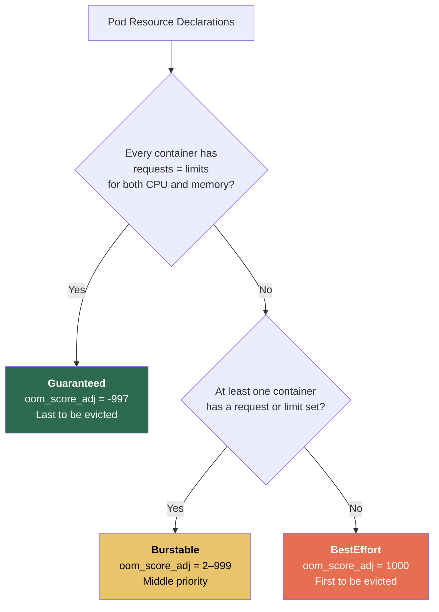

# Resource Requests, Limits, QoS Classes, and LimitRanges

**Date:** 2026-04-24 | **Updated:** 2026-04-24
**Tags:** `kubernetes` `resources` `qos` `limits` `capacity`

## Table of Contents

- [Summary](#summary)
- [CPU vs Memory — Compressible and Incompressible Resources](#cpu-vs-memory--compressible-and-incompressible-resources)
- [Requests vs Limits](#requests-vs-limits)
  - [Resource Units](#resource-units)
  - [What Requests Control](#what-requests-control)
  - [What Limits Control](#what-limits-control)
  - [Pod with Requests and Limits — Full Example](#pod-with-requests-and-limits--full-example)
- [QoS Classes](#qos-classes)
  - [Guaranteed](#guaranteed)
  - [Burstable](#burstable)
  - [BestEffort](#besteffort)
  - [QoS Eviction Priority](#qos-eviction-priority)
- [OOMKill Mechanics](#oomkill-mechanics)
  - [Container-Level OOMKill](#container-level-oomkill)
  - [Node-Level Eviction](#node-level-eviction)
  - [oom_score_adj Values](#oom_score_adj-values)
- [CPU Throttling and CFS Quotas](#cpu-throttling-and-cfs-quotas)
  - [How CFS Quotas Work](#how-cfs-quotas-work)
  - [The CPU Limits Controversy](#the-cpu-limits-controversy)
  - [When to Keep CPU Limits](#when-to-keep-cpu-limits)
- [LimitRange](#limitrange)
  - [LimitRange Example](#limitrange-example)
- [ResourceQuota](#resourcequota)
  - [ResourceQuota Example](#resourcequota-example)
  - [Scopes](#scopes)
- [JVM Tuning for Containers](#jvm-tuning-for-containers)
- [Node.js Tuning for Containers](#nodejs-tuning-for-containers)
- [Related](#related)
- [References](#references)

## Summary

Kubernetes resource management is how you tell the cluster what each container needs (requests) and how much it can use at most (limits). These declarations drive scheduling, enforce isolation via cgroups, determine QoS classification, and control eviction order under pressure. Getting this right is the difference between a stable cluster and one plagued by OOMKills, CPU throttling, and noisy-neighbor problems.

## CPU vs Memory — Compressible and Incompressible Resources

This distinction is fundamental to everything that follows:

| Property | CPU | Memory |
|----------|-----|--------|
| **Type** | Compressible | Incompressible |
| **When limit exceeded** | Container is **throttled** (slowed down) | Container is **OOMKilled** (terminated) |
| **Enforcement mechanism** | CFS quota — kernel pauses the process | Kernel OOM killer sends SIGKILL |
| **Recovery** | Automatic — process resumes next period | Container restarts per `restartPolicy` |
| **Impact** | Higher latency, slower response times | Data loss, restart overhead, potential CrashLoopBackOff |

**Key takeaway:** CPU overuse degrades performance. Memory overuse kills your process. This asymmetry is why many teams treat CPU and memory limits very differently in practice.

## Requests vs Limits

### Resource Units

**CPU** is measured in cores. One CPU equals one vCPU/hyperthread on the host:

```
1      = 1 full CPU core
0.5    = 500m = half a core
100m   = 0.1 core (100 millicores)
```

**Memory** uses standard IEC binary units. Always prefer binary (Mi/Gi) over decimal (M/G) to avoid confusion:

```
128Mi  = 128 mebibytes = 134,217,728 bytes
1Gi    = 1 gibibyte    = 1,073,741,824 bytes

# Decimal (avoid — less precise for memory allocation)
128M   = 128 megabytes = 128,000,000 bytes
1G     = 1 gigabyte    = 1,000,000,000 bytes
```

> **Why Mi/Gi?** Memory is allocated in pages (4Ki). Binary units align with how the kernel actually allocates memory. A container with `128M` gets slightly less than `128Mi` — a subtle source of OOMKills near the limit.

### What Requests Control

Requests are the **guaranteed minimum** resources for a container:

1. **Scheduler placement** — the scheduler sums all container requests in a Pod and finds a node with enough allocatable capacity. A Pod stays Pending if no node can satisfy its requests.
2. **QoS classification** — the ratio of requests to limits determines the Pod's QoS class (see below).
3. **CPU shares** — requests translate to `cpu.shares` in cgroups. Under contention, the kernel distributes CPU time proportionally to shares.

### What Limits Control

Limits are the **hard ceiling** enforced by the kubelet via cgroups:

1. **CPU** — translated to CFS quota (`cpu.cfs_quota_us` / `cpu.cfs_period_us`). Exceeding the limit throttles the container.
2. **Memory** — sets `memory.limit_in_bytes` in cgroups. Exceeding it triggers the kernel OOM killer immediately.

### Pod with Requests and Limits — Full Example

```yaml
apiVersion: v1
kind: Pod
metadata:
  name: spring-boot-api
  namespace: production
spec:
  containers:
    - name: app
      image: registry.example.com/api:3.2.1
      resources:
        requests:
          cpu: "500m"       # guaranteed half a core
          memory: "512Mi"   # guaranteed 512 MiB
        limits:
          cpu: "1000m"      # can burst up to 1 core
          memory: "1Gi"     # OOMKilled if exceeds 1 GiB
      env:
        - name: JAVA_OPTS
          value: "-XX:MaxRAMPercentage=75.0 -XX:+UseG1GC"
    - name: sidecar-logger
      image: fluent/fluent-bit:3.1
      resources:
        requests:
          cpu: "50m"
          memory: "64Mi"
        limits:
          cpu: "100m"
          memory: "128Mi"
```

The scheduler needs a node with at least **550m CPU** and **576Mi memory** allocatable (sum of all container requests). The Pod can burst up to 1100m CPU total and 1152Mi memory before hitting limits.

## QoS Classes

Kubernetes automatically assigns one of three QoS classes to every Pod based on its resource declarations. The class determines eviction priority under node pressure.



### Guaranteed

**All** containers in the Pod must set both `requests` and `limits` for both CPU and memory, and `requests == limits` for each:

```yaml
resources:
  requests:
    cpu: "500m"
    memory: "512Mi"
  limits:
    cpu: "500m"       # must equal request
    memory: "512Mi"   # must equal request
```

- Highest priority — last to be evicted
- `oom_score_adj = -997` (almost immune to kernel OOM killer)
- No CPU bursting — container always gets exactly what it requested
- Best for: databases, stateful services, critical APIs where predictability matters more than burst capacity

### Burstable

At least one container has a `request` set, but requests do not equal limits (or limits are missing for some resource):

```yaml
resources:
  requests:
    cpu: "250m"
    memory: "256Mi"
  limits:
    cpu: "1000m"      # can burst 4x above request
    memory: "512Mi"
```

- Middle priority during eviction
- `oom_score_adj` varies between 2 and 999, calculated as: `min(max(2, 1000 - (1000 * memoryRequest / machineMemory)), 999)`
- Can burst above requests when the node has spare capacity
- Best for: most application workloads — web servers, background workers, APIs

### BestEffort

**No** container in the Pod sets any requests or limits:

```yaml
resources: {}   # or simply omit the resources block
```

- Lowest priority — first to be evicted under any memory pressure
- `oom_score_adj = 1000` (maximum score — kernel kills these first)
- Gets whatever capacity is left over after scheduled workloads
- Best for: truly disposable workloads — dev experiments, batch jobs that can retry cheaply

### QoS Eviction Priority

When a node runs low on memory, eviction happens in this order:

```
Node Memory Pressure Detected
          │
          ▼
┌─────────────────────┐
│  1. BestEffort Pods  │  ← Evicted first (oom_score_adj = 1000)
│     No guarantees    │
└──────────┬──────────┘
           │ Still under pressure?
           ▼
┌─────────────────────┐
│  2. Burstable Pods   │  ← Evicted by how far over their
│     Using > request  │     memory request they are
└──────────┬──────────┘
           │ Still under pressure?
           ▼
┌─────────────────────┐
│  3. Guaranteed Pods  │  ← Last resort, only when node is
│     Stable usage     │     critically out of memory
└─────────────────────┘
```

Within the Burstable tier, Pods using the most memory relative to their request are evicted first. A Burstable Pod at 2x its request gets evicted before one at 1.1x.

## OOMKill Mechanics

### Container-Level OOMKill

When a container exceeds its memory **limit**, the kernel OOM killer terminates it:

1. Container allocates memory beyond `memory.limit_in_bytes` in its cgroup
2. Kernel sends **SIGKILL** — the process cannot catch or handle this signal
3. Container exits with code **137** (128 + 9 for SIGKILL)
4. Kubelet logs the event: `OOMKilled`
5. Container restarts according to Pod's `restartPolicy` (default: `Always`)
6. If it keeps crashing, the Pod enters **CrashLoopBackOff** with exponential backoff (10s, 20s, 40s, ... up to 5 minutes)

```bash
# Diagnose OOMKills
kubectl describe pod <name> | grep -A5 "Last State"
#   Last State:  Terminated
#     Reason:    OOMKilled
#     Exit Code: 137

kubectl get events --field-selector reason=OOMKilling
```

### Node-Level Eviction

Separate from container OOMKill, the kubelet proactively evicts Pods when node resources cross thresholds:

| Signal | Soft Default | Hard Default | What it means |
|--------|-------------|-------------|---------------|
| `memory.available` | — | `100Mi` | Free memory on the node |
| `nodefs.available` | — | `10%` | Root filesystem free space |
| `imagefs.available` | — | `15%` | Image filesystem free space |

Soft evictions give Pods a grace period. Hard evictions terminate immediately. The kubelet picks victims by QoS class, then by how far over their request they are.

### oom_score_adj Values

The kubelet sets `oom_score_adj` on each container process, which biases the kernel OOM killer:

| QoS Class | oom_score_adj | Meaning |
|-----------|--------------|---------|
| **Guaranteed** | `-997` | Almost never killed by kernel OOM |
| **BestEffort** | `1000` | Always killed first |
| **Burstable** | `2` to `999` | Proportional to memory request vs node capacity |

The Burstable formula: `min(max(2, 1000 - (1000 * memoryRequestBytes / machineMemoryCapacityBytes)), 999)`

A Burstable Pod requesting 4Gi on a 16Gi node: `1000 - (1000 * 4Gi / 16Gi) = 750`

> **Known limitation (2025):** The `oom_score_adj` calculation for Burstable Pods ignores `PriorityClass`. A system-critical Pod with Burstable QoS can be OOM-killed before a low-priority Pod consuming more memory. If you need priority-based protection, make critical Pods Guaranteed.

## CPU Throttling and CFS Quotas

### How CFS Quotas Work

Linux's Completely Fair Scheduler (CFS) enforces CPU limits using a quota/period mechanism:

```
CFS Period:  100ms (default, set by kubelet)
CFS Quota:   varies per container based on CPU limit

CPU Limit → CFS Quota
─────────────────────
100m      → 10ms  per 100ms period  (10% of one core)
500m      → 50ms  per 100ms period  (50% of one core)
1000m     → 100ms per 100ms period  (100% of one core)
2000m     → 200ms per 100ms period  (can use 2 cores fully)
```

Within each 100ms period, the container can use its quota of CPU time. Once exhausted, the kernel **pauses all threads in the cgroup** until the next period begins. This is throttling.

```
Timeline for a container with 500m CPU limit (50ms quota per 100ms):

0ms          50ms         100ms        150ms        200ms
│─── active ──│── throttled ─│─── active ──│── throttled ─│
│  using CPU   │  frozen by   │  using CPU   │  frozen by   │
│              │  CFS          │              │  CFS          │
```

**Why this is painful for latency-sensitive workloads:** A request arriving during the throttled window sits waiting. Even if the node has idle CPU cores, the container cannot use them because CFS enforcement is per-cgroup, not global.

### The CPU Limits Controversy

Many production teams have moved to setting CPU **requests only** and dropping CPU limits entirely. The reasoning:

**Arguments for removing CPU limits:**
- CFS throttling causes latency spikes even when the node has spare CPU capacity
- Bursty workloads (web servers, APIs) spike briefly on requests then go idle — limits punish this pattern
- CPU requests alone ensure fair scheduling under contention via `cpu.shares`
- Without limits, containers burst onto idle cores — better utilization and lower latency
- Tail latency (p99, p999) often drops dramatically after removing CPU limits

**Arguments for keeping CPU limits:**
- Multi-tenant clusters where teams should not steal each other's CPU
- Noisy neighbor prevention in shared infrastructure
- Cost attribution requires bounded usage per workload
- Predictable performance characteristics for capacity planning

**The pragmatic approach used by many teams:**

```yaml
# Latency-sensitive service — requests only, no CPU limit
resources:
  requests:
    cpu: "500m"
    memory: "512Mi"
  limits:
    # cpu: deliberately omitted
    memory: "512Mi"    # always set memory limits

# Batch/background workload in shared cluster — keep both
resources:
  requests:
    cpu: "250m"
    memory: "256Mi"
  limits:
    cpu: "1000m"
    memory: "512Mi"
```

> **Important:** Removing CPU limits changes the Pod's QoS class from Guaranteed to Burstable. If eviction priority matters, this is a trade-off you must consider.

### When to Keep CPU Limits

| Scenario | CPU Limits? | Rationale |
|----------|-------------|-----------|
| Latency-sensitive API, single-tenant | No | Burst on idle cores, avoid throttling |
| Shared multi-tenant cluster | Yes | Prevent noisy neighbors, enable cost attribution |
| Batch processing / background workers | Optional | Throttling is tolerable; predictability may help |
| Databases (PostgreSQL, Redis) | Usually no | Throttling causes query latency spikes |
| CI/CD runners | Yes | Prevent build jobs from starving the cluster |

## LimitRange

A LimitRange sets per-namespace default and min/max constraints for container resources. When a Pod does not specify requests or limits, the LimitRange auto-injects defaults.

### LimitRange Example

```yaml
apiVersion: v1
kind: LimitRange
metadata:
  name: default-limits
  namespace: production
spec:
  limits:
    # Container-level defaults and constraints
    - type: Container
      default:           # applied when container omits limits
        cpu: "500m"
        memory: "512Mi"
      defaultRequest:    # applied when container omits requests
        cpu: "100m"
        memory: "128Mi"
      min:               # minimum allowed values
        cpu: "50m"
        memory: "64Mi"
      max:               # maximum allowed values
        cpu: "4000m"
        memory: "8Gi"

    # Pod-level aggregate constraints
    - type: Pod
      max:
        cpu: "8000m"
        memory: "16Gi"

    # PVC size constraints
    - type: PersistentVolumeClaim
      min:
        storage: "1Gi"
      max:
        storage: "100Gi"
```

**How it works:**
- If a container omits `limits`, it gets `default` values injected
- If a container omits `requests`, it gets `defaultRequest` values injected
- If a container specifies values outside `min`/`max`, the Pod is **rejected** by the API server
- Pod-level constraints apply to the **sum** of all container resources in the Pod
- PVC constraints apply to `spec.resources.requests.storage` in PersistentVolumeClaims

## ResourceQuota

A ResourceQuota sets **aggregate** limits across all Pods in a namespace — total CPU requests, total memory limits, object counts, etc.

### ResourceQuota Example

```yaml
apiVersion: v1
kind: ResourceQuota
metadata:
  name: team-alpha-quota
  namespace: team-alpha
spec:
  hard:
    # Compute resources (aggregate across all Pods)
    requests.cpu: "20"         # total CPU requests: 20 cores
    requests.memory: "40Gi"    # total memory requests: 40 GiB
    limits.cpu: "40"           # total CPU limits: 40 cores
    limits.memory: "80Gi"      # total memory limits: 80 GiB

    # Object counts
    pods: "50"                 # max 50 Pods
    services: "20"             # max 20 Services
    persistentvolumeclaims: "30"
    configmaps: "50"
    secrets: "50"
    services.loadbalancers: "3"  # expensive — limit these
    services.nodeports: "5"

    # Storage
    requests.storage: "500Gi"  # total PVC storage
```

**Critical behavior:** When a ResourceQuota exists in a namespace, every Pod **must** specify requests and limits for every resource covered by the quota. If Pods do not, the API server rejects them. This is why you typically pair a ResourceQuota with a LimitRange — the LimitRange injects defaults so developers don't have to specify them in every manifest.

```bash
# Check quota usage
kubectl describe resourcequota team-alpha-quota -n team-alpha
# Name:                   team-alpha-quota
# Resource                Used    Hard
# --------                ----    ----
# limits.cpu              12      40
# limits.memory           24Gi    80Gi
# pods                    18      50
# requests.cpu            6       20
# requests.memory         12Gi    40Gi
```

### Scopes

ResourceQuotas can be scoped to specific Pod categories:

| Scope | Matches |
|-------|---------|
| `Terminating` | Pods with `activeDeadlineSeconds` set |
| `NotTerminating` | Pods without `activeDeadlineSeconds` |
| `BestEffort` | Pods with BestEffort QoS |
| `NotBestEffort` | Pods with Guaranteed or Burstable QoS |
| `PriorityClass` | Pods matching a specific PriorityClass |

```yaml
apiVersion: v1
kind: ResourceQuota
metadata:
  name: besteffort-quota
  namespace: dev
spec:
  hard:
    pods: "10"          # only 10 BestEffort Pods allowed
  scopes:
    - BestEffort
```

This lets you allow BestEffort Pods in dev namespaces while limiting how many can exist.

## JVM Tuning for Containers

Java applications are the most common source of container OOMKills because the JVM's default heap sizing can exceed container memory limits. Since Java 10, the JVM reads cgroup limits automatically (`-XX:+UseContainerSupport`, enabled by default).

**Essential flags for containerized JVMs:**

```yaml
env:
  - name: JAVA_OPTS
    value: >-
      -XX:MaxRAMPercentage=75.0
      -XX:InitialRAMPercentage=50.0
      -XX:+UseG1GC
      -XX:ActiveProcessorCount=2
```

| Flag | Purpose |
|------|---------|
| `-XX:MaxRAMPercentage=75.0` | Set max heap as 75% of container memory limit. The remaining 25% covers metaspace, thread stacks, native memory, direct buffers, and the OS. |
| `-XX:InitialRAMPercentage=50.0` | Start with 50% heap — avoids slow ramp-up. |
| `-XX:ActiveProcessorCount=N` | Override CPU detection. When your container limit is `500m`, the JVM might see 8 cores from the host and spawn too many GC/compiler threads. Set this to match your CPU limit rounded up. |
| `-XX:+UseContainerSupport` | Enabled by default since Java 10. JVM reads `/sys/fs/cgroup/` to discover memory and CPU limits. |

**Why 75% and not 90%?** The JVM uses memory beyond the heap:

```
Container Memory Limit: 1Gi (1024Mi)
├── JVM Heap (MaxRAMPercentage=75%):  768Mi
├── Metaspace:                        ~64Mi
├── Thread stacks (200 threads * 1Mi): ~200Mi (reduced with -Xss512k)
├── Direct buffers / native:          ~50Mi
├── OS overhead:                      ~10Mi
└── Safety margin:                    remaining
```

At 90%, you leave almost no room for non-heap memory and risk OOMKill under load.

**Spring Boot specific:** Spring Boot 3.x auto-configures graceful shutdown and actuator health probes. See [Kubernetes Spring Boot Configuration](../../java/configurations/kubernetes-spring-boot.md) for the full application-level setup.

## Node.js Tuning for Containers

Node.js has been container-aware since v12, reading cgroup limits for memory calculations. Since v19+, it also reads cgroup CPU limits.

**Essential settings for containerized Node.js:**

```yaml
env:
  - name: NODE_OPTIONS
    value: "--max-old-space-size=768"
  - name: UV_THREADPOOL_SIZE
    value: "8"
```

| Setting | Purpose |
|---------|---------|
| `--max-old-space-size=768` | Set V8 heap limit in MiB. Default is ~50% of container memory (up to 4Gi containers) or capped at 2Gi for larger containers. Set explicitly to 75% of your container memory limit. |
| `UV_THREADPOOL_SIZE` | Default is 4 threads. Increase for heavy filesystem I/O, DNS lookups, or crypto operations that use libuv's thread pool. Match to CPU request, not limit. |

**Sizing example for a 1Gi container:**

```
Container Memory Limit: 1Gi (1024Mi)
├── V8 Heap (--max-old-space-size):  768Mi  (75%)
├── V8 overhead (new space, code):   ~80Mi
├── Native addons / buffers:         ~50Mi
├── libuv thread pool:               ~10Mi
├── OS / container overhead:         remaining
```

**CPU considerations:**
- Node.js is single-threaded for JavaScript execution — a single event loop uses one core
- `worker_threads` for CPU-intensive work (each worker needs its own core)
- For CPU request of `500m`, one event loop thread is sufficient
- For CPU request of `2000m`, consider 1 main thread + 1 worker thread

**Common pitfall:** Node.js v20 changed how memory reservation (requests) affects `new_space` sizing in V8. If you upgrade from v18 to v20+ inside containers, test memory behavior — some teams have seen unexpected heap changes. See [Node.js in Kubernetes](../../typescript/production/nodejs-in-kubernetes.md) for the full application-level guide.

## Related

- [ConfigMaps and Secrets](configmaps-and-secrets.md) — injecting configuration into Pods (Tier 4)
- [Persistent Volumes and StorageClasses](persistent-volumes.md) — storage resource management (Tier 4)
- [Pods, ReplicaSets, and Deployments](../workloads/pods-and-deployments.md) — the workloads that consume these resources (Tier 2)
- [Kubernetes Spring Boot Configuration](../../java/configurations/kubernetes-spring-boot.md) — JVM tuning in the application layer (Java path)
- [Node.js in Kubernetes](../../typescript/production/nodejs-in-kubernetes.md) — Node.js tuning in the application layer (TypeScript path)
- [Autoscaling in Kubernetes](../operations/autoscaling.md) — HPA/VPA use requests and limits as scaling inputs (Tier 6)

## References

1. [Kubernetes Documentation — Managing Resources for Containers](https://kubernetes.io/docs/concepts/configuration/manage-resources-containers/)
2. [Kubernetes Documentation — Pod Quality of Service Classes](https://kubernetes.io/docs/concepts/workloads/pods/pod-qos/)
3. [Kubernetes Documentation — Resource Quotas](https://kubernetes.io/docs/concepts/policy/resource-quotas/)
4. [Kubernetes Documentation — Limit Ranges](https://kubernetes.io/docs/concepts/policy/limit-range/)
5. [Kubernetes Documentation — Node-pressure Eviction](https://kubernetes.io/docs/concepts/scheduling-eviction/node-pressure-eviction/)
6. [Red Hat Developer — Java 17: Container Awareness in OpenJDK](https://developers.redhat.com/articles/2022/04/19/java-17-whats-new-openjdks-container-awareness)
7. [Red Hat Developer — Node.js 20+ Memory Management in Containers](https://developers.redhat.com/articles/2025/10/10/nodejs-20-memory-management-containers)
8. [Numerator Engineering — CPU Limits and Throttling in Kubernetes](https://www.numeratorengineering.com/requests-are-all-you-need-cpu-limits-and-throttling-in-kubernetes/)
