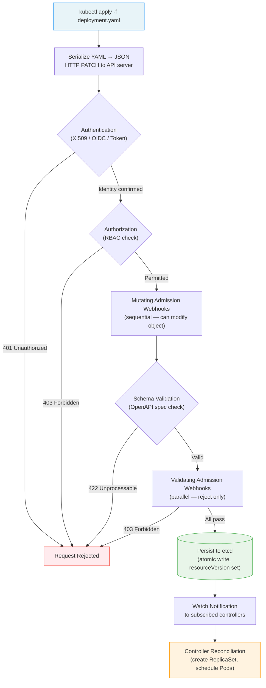

# The Kubernetes API — Resources, Objects, and What Happens on `kubectl apply`

**Date:** 2026-04-24 | **Updated:** 2026-04-24
**Tags:** `kubernetes` `api` `objects` `admission-controllers` `server-side-apply`

## Table of Contents

- [Summary](#summary)
- [API Groups and Versioning](#api-groups-and-versioning)
  - [The Core Group](#the-core-group)
  - [Named Groups](#named-groups)
  - [Version Lifecycle](#version-lifecycle)
- [Resource vs Object vs Kind — The Terminology](#resource-vs-object-vs-kind--the-terminology)
- [Object Metadata](#object-metadata)
  - [Identity Fields](#identity-fields)
  - [Labels and Annotations](#labels-and-annotations)
  - [System-Managed Fields](#system-managed-fields)
- [Spec vs Status — Desired vs Observed State](#spec-vs-status--desired-vs-observed-state)
- [The Full kubectl apply Request Path](#the-full-kubectl-apply-request-path)
  - [Step-by-Step Walkthrough](#step-by-step-walkthrough)
  - [Request Lifecycle Diagram](#request-lifecycle-diagram)
- [Admission Controllers in Detail](#admission-controllers-in-detail)
  - [Built-in Admission Controllers](#built-in-admission-controllers)
  - [Webhook Admission Controllers](#webhook-admission-controllers)
- [Server-Side Apply vs Client-Side Apply](#server-side-apply-vs-client-side-apply)
  - [Client-Side Apply (the default)](#client-side-apply-the-default)
  - [Server-Side Apply](#server-side-apply)
  - [Field Managers and Conflict Detection](#field-managers-and-conflict-detection)
  - [Merge Strategies](#merge-strategies)
- [Dry-Run Mode](#dry-run-mode)
- [Custom Resource Definitions (CRDs)](#custom-resource-definitions-crds)
  - [What CRDs Enable](#what-crds-enable)
  - [CRD Example](#crd-example)
  - [The Operator Pattern](#the-operator-pattern)
- [Exploring the API with kubectl](#exploring-the-api-with-kubectl)
- [Related](#related)
- [References](#references)

## Summary

Everything in Kubernetes is an API object. When you run `kubectl apply`, your YAML takes a precise path through authentication, authorization, admission control, validation, and etcd persistence before any controller ever sees it. Understanding this request lifecycle — and the terminology that describes it — is essential for debugging, writing admission policies, and extending Kubernetes with your own types via CRDs.

## API Groups and Versioning

The Kubernetes API is organized into [API groups](https://kubernetes.io/docs/reference/using-api/#api-groups), each containing related resources that can be enabled or disabled independently. API groups appear in two places: the REST path and the `apiVersion` field in YAML manifests.

### The Core Group

The **core** group (also called the **legacy** group) contains the original Kubernetes resources. It has no group name in the `apiVersion` field:

```yaml
# Core group resources use just the version — no group prefix
apiVersion: v1
kind: Pod
---
apiVersion: v1
kind: Service
---
apiVersion: v1
kind: ConfigMap
```

REST path: `/api/v1/namespaces/{ns}/pods`

The core group exists at `/api/v1` (not `/apis/`) for historical reasons — it predates the API group system.

### Named Groups

Every other group uses the `groupName/version` format:

| API Group | `apiVersion` | Key Resources |
|-----------|-------------|---------------|
| `apps` | `apps/v1` | Deployment, StatefulSet, DaemonSet, ReplicaSet |
| `batch` | `batch/v1` | Job, CronJob |
| `networking.k8s.io` | `networking.k8s.io/v1` | Ingress, NetworkPolicy, IngressClass |
| `rbac.authorization.k8s.io` | `rbac.authorization.k8s.io/v1` | Role, ClusterRole, RoleBinding |
| `autoscaling` | `autoscaling/v2` | HorizontalPodAutoscaler |
| `policy` | `policy/v1` | PodDisruptionBudget |
| `gateway.networking.k8s.io` | `gateway.networking.k8s.io/v1` | Gateway, HTTPRoute |

REST path: `/apis/{group}/{version}/namespaces/{ns}/{resource}`

```bash
# See all API groups and their preferred versions
kubectl api-versions

# Output (abbreviated):
# apps/v1
# batch/v1
# networking.k8s.io/v1
# rbac.authorization.k8s.io/v1
# v1
```

### Version Lifecycle

API versions follow a strict maturity progression:

| Stage | Example | Meaning |
|-------|---------|---------|
| **Alpha** | `v1alpha1` | Experimental, disabled by default, may be removed without notice |
| **Beta** | `v1beta1` | Features mostly complete, enabled by default, schema may change |
| **Stable** | `v1` | GA, will be maintained for many future releases |

The API server handles **transparent version conversion**. An object created via `v1beta1` can be read through `v1` — they are different serializations of the same persisted data in etcd.

```bash
# See which versions a specific resource supports
kubectl api-resources --api-group=autoscaling
# NAME                       SHORTNAMES   APIVERSION       NAMESPACED   KIND
# horizontalpodautoscalers   hpa          autoscaling/v2   true         HorizontalPodAutoscaler
```

## Resource vs Object vs Kind — The Terminology

These three terms are used everywhere in Kubernetes documentation. They refer to different aspects of the same concept:

| Term | What It Means | Example |
|------|--------------|---------|
| **Kind** | The type name in the object schema. Appears in YAML as `kind:`. Always PascalCase. | `Deployment`, `Pod`, `Service` |
| **Resource** | The URL-path name used in the REST API. Always lowercase plural. | `deployments`, `pods`, `services` |
| **Object** | A specific instance of a resource — a concrete record stored in etcd with a `name`, `namespace`, and `uid`. | The Deployment named `my-api` in namespace `production` |

How they relate:

```text
Kind:       Deployment                    (the schema / type)
Resource:   deployments                   (the API endpoint: /apis/apps/v1/namespaces/default/deployments)
Object:     my-api (uid: abc-123-def)     (a specific instance)
```

The full identifier for any resource type in the API is a **GVR** (Group-Version-Resource):

```text
GVR:  apps/v1/deployments
      ──── ── ───────────
      group version resource
```

And the corresponding schema identifier is a **GVK** (Group-Version-Kind):

```text
GVK:  apps/v1/Deployment
      ──── ── ──────────
      group version kind
```

```bash
# List all known resource types with their API group and kind
kubectl api-resources

# Partial output:
# NAME          SHORTNAMES   APIVERSION   NAMESPACED   KIND
# pods          po           v1           true         Pod
# services      svc          v1           true         Service
# deployments   deploy       apps/v1      true         Deployment
# jobs                       batch/v1     true         Job
```

## Object Metadata

Every Kubernetes object carries a `metadata` section. Some fields you set; others the system manages.

### Identity Fields

```yaml
apiVersion: apps/v1
kind: Deployment
metadata:
  name: payment-service          # Required. Unique within namespace. DNS-subdomain rules (max 253 chars).
  namespace: production           # Optional — defaults to "default". Cluster-scoped resources omit this.
```

- **name** must be unique within a namespace for a given resource type
- **namespace** scopes the object — two namespaces can each have a Deployment named `payment-service`
- Together, `namespace` + `name` + `resource type` uniquely identifies an object (for namespaced resources)

### Labels and Annotations

```yaml
metadata:
  labels:                         # Key-value pairs for selection and grouping
    app: payment-service
    env: production
    version: v2.3.1
  annotations:                    # Key-value pairs for non-identifying metadata
    deployment.kubernetes.io/revision: "5"
    team: payments
    oncall-slack: "#payments-oncall"
```

**Labels** are for machines — selectors use them to match resources (Services finding Pods, Deployments managing ReplicaSets). Keep them short and structured.

**Annotations** are for humans and tools — build info, git SHAs, monitoring links, policy hints. No size limit beyond etcd's 1.5 MB per object.

### System-Managed Fields

These are set by the API server, not by you:

```yaml
metadata:
  uid: 8a39f5c7-2b91-4e0a-b8c3-1234567890ab   # Globally unique ID, immutable for the object's lifetime
  resourceVersion: "48291053"                     # etcd revision — changes on every update, used for optimistic concurrency
  generation: 3                                   # Increments when spec changes (not status)
  creationTimestamp: "2026-04-24T08:30:00Z"       # When the object was first created
  managedFields:                                  # Server-side apply field ownership tracking
    - manager: kubectl-client-side-apply
      operation: Update
      fieldsV1: { ... }
```

Key fields to understand:

- **uid**: survives renames (which are actually delete + create); if an object is deleted and recreated with the same name, it gets a new uid
- **resourceVersion**: an opaque string (etcd's `mod_revision`). Used for optimistic concurrency — `kubectl apply` sends it back, and the API server rejects the write if someone else modified the object in the meantime (409 Conflict)
- **generation**: only incremented on `spec` changes. Controllers compare `generation` with `status.observedGeneration` to know if they have processed the latest spec

## Spec vs Status — Desired vs Observed State

The spec/status split is the heart of the [declarative model](https://kubernetes.io/docs/concepts/overview/working-with-objects/#object-spec-and-status):

```yaml
apiVersion: apps/v1
kind: Deployment
metadata:
  name: order-service
spec:                            # DESIRED state — what YOU declare
  replicas: 3
  selector:
    matchLabels:
      app: order-service
  template:
    metadata:
      labels:
        app: order-service
    spec:
      containers:
        - name: app
          image: order-service:2.1.0
          ports:
            - containerPort: 8080
status:                          # OBSERVED state — what the CONTROLLER reports
  replicas: 3
  readyReplicas: 2
  updatedReplicas: 3
  availableReplicas: 2
  observedGeneration: 7
  conditions:
    - type: Available
      status: "True"
      lastTransitionTime: "2026-04-24T09:15:00Z"
    - type: Progressing
      status: "True"
      lastTransitionTime: "2026-04-24T09:14:30Z"
```

The reconciliation loop:

1. You write `spec.replicas: 3` (desired state)
2. The Deployment controller reads the spec, creates/updates a ReplicaSet
3. The ReplicaSet controller creates Pods
4. Kubelet runs the containers
5. Controllers update `status` to reflect reality (`readyReplicas: 2` — one is still starting)
6. Eventually `readyReplicas` converges to `3`

Not all objects have both spec and status. ConfigMaps and Secrets store data directly — they have `data` instead of `spec`/`status`. Namespaces have a minimal `spec` (just `finalizers`) and a `status.phase`.

## The Full kubectl apply Request Path

When you run `kubectl apply -f deployment.yaml`, the request passes through a precise chain of stages before anything is persisted.

### Step-by-Step Walkthrough

**1. Client-side (kubectl)**

```text
kubectl reads deployment.yaml
  → validates basic YAML syntax
  → resolves the resource type (kind: Deployment → apps/v1/deployments)
  → looks up the API server address from ~/.kube/config
  → serializes to JSON
  → sends HTTP PATCH (for apply) or POST (for create) to the API server
```

**2. Authentication** — _"Who are you?"_

The API server checks credentials from the request. Multiple [authenticator modules](https://kubernetes.io/docs/reference/access-authn-authz/authentication/) run in sequence until one succeeds:

- X.509 client certificates (most common for admin kubeconfigs)
- Bearer tokens (ServiceAccount tokens, OIDC tokens)
- Authentication webhooks (external identity providers)

If none succeed → **401 Unauthorized**

**3. Authorization (RBAC)** — _"Are you allowed to do this?"_

The API server checks [RBAC policies](https://kubernetes.io/docs/reference/access-authn-authz/rbac/) — does the authenticated user/ServiceAccount have a Role or ClusterRole that grants the `patch` (or `create`) verb on `deployments` in the target namespace?

If denied → **403 Forbidden**

**4. Mutating Admission** — _"Let me modify this before it goes further."_

[Mutating admission controllers](https://kubernetes.io/docs/reference/access-authn-authz/admission-controllers/) run **sequentially**. Each can modify the object. Examples:

- `DefaultStorageClass` — adds a default StorageClass to PVCs that omit one
- `ServiceAccount` — mounts the default ServiceAccount token if none specified
- Custom `MutatingWebhookConfiguration` — your own webhooks that inject sidecars, add labels, set defaults

Mutating webhooks run in sequence because each one may change the object that the next one sees.

**5. Schema Validation** — _"Does this match the OpenAPI schema?"_

The API server validates the (now possibly mutated) object against the OpenAPI schema for that resource type. Checks include:

- Required fields present (`spec.selector` on a Deployment)
- Field types correct (replicas is an integer, not a string)
- Unknown fields rejected (with `--validate=strict` or server-side field validation)

If invalid → **422 Unprocessable Entity**

**6. Validating Admission** — _"Any final objections?"_

[Validating admission controllers](https://kubernetes.io/docs/reference/access-authn-authz/extensible-admission-controllers/) run **in parallel** (unlike mutating, which runs sequentially). They can reject but **cannot modify**. Examples:

- `LimitRanger` — rejects pods exceeding namespace limits
- `PodSecurity` — enforces Pod Security Standards
- Custom `ValidatingWebhookConfiguration` — enforce org policies (no `latest` tags, require resource limits)
- `ValidatingAdmissionPolicy` (GA since K8s 1.30) — CEL-based validation without webhooks

If any reject → **403 Forbidden** with aggregated error messages

**7. Persist to etcd**

The API server writes the object to etcd. The `resourceVersion` is set from etcd's revision counter. This is an atomic operation — etcd uses MVCC to ensure consistency.

**8. Watch Notification → Controller Reconciliation**

etcd confirms the write. The API server sends watch events to all controllers subscribed to that resource type. The relevant controller (e.g., the Deployment controller) picks up the event and begins reconciliation — creating ReplicaSets, scheduling Pods, etc.

### Request Lifecycle Diagram



## Admission Controllers in Detail

### Built-in Admission Controllers

The API server ships with [compiled-in admission controllers](https://kubernetes.io/docs/reference/access-authn-authz/admission-controllers/#what-does-each-admission-controller-do) that handle common cluster-level concerns:

| Controller | Type | What It Does |
|-----------|------|-------------|
| `NamespaceLifecycle` | Validating | Rejects requests in terminating namespaces |
| `LimitRanger` | Mutating + Validating | Applies default resource requests/limits from LimitRange |
| `ServiceAccount` | Mutating | Auto-mounts ServiceAccount token volume |
| `DefaultStorageClass` | Mutating | Adds default StorageClass to PVCs |
| `PodSecurity` | Validating | Enforces Pod Security Standards (Baseline/Restricted) |
| `ResourceQuota` | Validating | Rejects requests that would exceed namespace quota |
| `MutatingAdmissionWebhook` | Mutating | Calls your custom mutating webhooks |
| `ValidatingAdmissionWebhook` | Validating | Calls your custom validating webhooks |

### Webhook Admission Controllers

You can define your own admission logic by deploying a webhook server and registering it:

```yaml
apiVersion: admissionregistration.k8s.io/v1
kind: ValidatingWebhookConfiguration
metadata:
  name: require-resource-limits
webhooks:
  - name: limits.example.com
    admissionReviewVersions: ["v1"]
    clientConfig:
      service:
        name: policy-webhook
        namespace: kube-system
        path: /validate-limits
    rules:
      - apiGroups: ["apps"]
        apiVersions: ["v1"]
        operations: ["CREATE", "UPDATE"]
        resources: ["deployments"]
    failurePolicy: Fail               # Reject if webhook is unreachable
    sideEffects: None
    timeoutSeconds: 5
```

Key design points for webhooks:

- **failurePolicy**: `Fail` (reject if webhook unreachable) or `Ignore` (allow if unreachable). Production policy webhooks typically use `Fail`.
- **timeoutSeconds**: maximum time to wait for a response (default 10, max 30). Keep it short — every webhook adds latency to every matching request.
- **sideEffects**: declare `None` if the webhook has no out-of-band effects. This allows dry-run requests to call the webhook.

Since Kubernetes 1.30, [ValidatingAdmissionPolicy](https://kubernetes.io/docs/reference/access-authn-authz/validating-admission-policy/) (GA) lets you write validation rules in [CEL](https://github.com/google/cel-spec) expressions directly — no webhook server needed:

```yaml
apiVersion: admissionregistration.k8s.io/v1
kind: ValidatingAdmissionPolicy
metadata:
  name: require-resource-limits
spec:
  matchConstraints:
    resourceRules:
      - apiGroups: ["apps"]
        apiVersions: ["v1"]
        operations: ["CREATE", "UPDATE"]
        resources: ["deployments"]
  validations:
    - expression: >-
        object.spec.template.spec.containers.all(c,
          has(c.resources) && has(c.resources.limits) &&
          has(c.resources.limits.memory) && has(c.resources.limits.cpu))
      message: "All containers must have CPU and memory limits set"
```

## Server-Side Apply vs Client-Side Apply

### Client-Side Apply (the default)

When you run `kubectl apply -f deployment.yaml` (without `--server-side`), kubectl handles the merge logic locally:

1. kubectl reads the object from the API server (HTTP GET)
2. kubectl computes a three-way merge between:
   - The **last-applied-configuration** annotation (stored on the object)
   - The **live object** on the server
   - The **local file** you are applying
3. kubectl sends an HTTP PATCH with the merged result

Problems with client-side apply:

- The `kubectl.kubernetes.io/last-applied-configuration` annotation stores **the entire previous manifest** as JSON — bloats the object
- No conflict detection — two people can silently overwrite each other's changes
- The merge logic lives in kubectl, not the server — other tools (Terraform, Pulumi, controllers) do not participate in the same merge
- Struggles with list fields (e.g., `containers` array) — cannot distinguish "I removed a container" from "I never added it"

### Server-Side Apply

When you run `kubectl apply --server-side -f deployment.yaml`, the merge logic moves to the API server:

```bash
# Server-side apply
kubectl apply --server-side -f deployment.yaml

# Equivalent with explicit field manager name
kubectl apply --server-side --field-manager="team-payments" -f deployment.yaml
```

The API server:

1. Receives the full desired object
2. Compares it against the stored object using **field ownership** tracked in `metadata.managedFields`
3. Merges the changes, checking for conflicts
4. Persists the result

Advantages:

- **Conflict detection**: if you try to change a field owned by a different manager, the API server returns a **409 Conflict** instead of silently overwriting
- **No last-applied-configuration annotation**: field ownership is tracked in `managedFields` instead
- **Consistent merge logic**: every client (kubectl, controllers, Terraform) uses the same server-side merge
- **Better list handling**: can track ownership of individual list items

### Field Managers and Conflict Detection

Every applier has a **field manager** identity. The API server tracks which manager last asserted each field's value:

```yaml
metadata:
  managedFields:
    - manager: team-payments          # Your team's kubectl apply --server-side
      operation: Apply
      apiVersion: apps/v1
      fieldsV1:
        f:spec:
          f:replicas: {}              # team-payments owns replicas
          f:template:
            f:spec:
              f:containers: {}        # team-payments owns the container spec
    - manager: hpa-controller         # The HPA controller
      operation: Update
      apiVersion: autoscaling/v2
      fieldsV1:
        f:spec:
          f:replicas: {}              # HPA also claims replicas!
```

**Conflict rules:**

- If two managers set a field to **the same value**, they **share ownership** — no conflict
- If you try to change a field owned by **another manager** to a **different value** → **409 Conflict**
- To force through: `kubectl apply --server-side --force-conflicts` — takes ownership from the other manager

```bash
# Scenario: HPA controls replicas, but you try to change it
kubectl apply --server-side -f deployment.yaml
# error: Apply failed with 1 conflict: conflict with "hpa-controller":
#   .spec.replicas

# Force override (takes ownership from HPA — usually wrong!)
kubectl apply --server-side --force-conflicts -f deployment.yaml
```

### Merge Strategies

Server-side apply uses three merge strategies depending on the field type:

| Field Type | Strategy | Behavior |
|-----------|----------|----------|
| Scalar (`replicas`, `image`) | **Replace** | New value replaces old |
| Map (`labels`, `annotations`) | **Merge keys** | New keys added, existing keys updated, missing keys left alone |
| List (varies) | **Atomic or map-merge** | Depends on `x-kubernetes-list-type` in the schema |

List merge behavior depends on the schema annotation:

- `x-kubernetes-list-type: atomic` — the entire list is replaced (e.g., `command`, `args`)
- `x-kubernetes-list-type: map` with `x-kubernetes-list-map-keys` — individual items merged by key (e.g., `containers` merged by `name`, `ports` merged by `containerPort`)
- `x-kubernetes-list-type: set` — individual items tracked by value

## Dry-Run Mode

Dry-run sends the request through the entire admission chain without persisting to etcd:

```bash
# Server-side dry run — validates through admission controllers
kubectl apply --dry-run=server -f deployment.yaml

# Client-side dry run — only validates YAML locally (no server contact)
kubectl apply --dry-run=client -f deployment.yaml
```

`--dry-run=server` is far more useful because it exercises:

- Authentication and authorization
- Mutating admission webhooks (webhooks with `sideEffects: None`)
- Schema validation
- Validating admission webhooks

It does **not** persist to etcd and does **not** trigger controller reconciliation. Use it to catch policy violations before they fail in CI:

```bash
# Validate all manifests in a directory against the live cluster's policies
kubectl apply --dry-run=server -f manifests/ --recursive

# Combine with diff to preview changes
kubectl diff -f deployment.yaml
```

## Custom Resource Definitions (CRDs)

### What CRDs Enable

The Kubernetes API is **extensible**. A [CRD](https://kubernetes.io/docs/tasks/extend-kubernetes/custom-resources/custom-resource-definitions/) lets you register a new resource type with the API server, giving it the same lifecycle as built-in resources — CRUD via kubectl, watch events, RBAC, admission control, and etcd storage.

```text
Before CRD:  The API server knows about Pods, Services, Deployments, ...
After CRD:   The API server also knows about your PostgresCluster, KafkaTopic, Certificate, ...
```

### CRD Example

```yaml
apiVersion: apiextensions.k8s.io/v1
kind: CustomResourceDefinition
metadata:
  name: postgresclusters.db.example.com
spec:
  group: db.example.com
  versions:
    - name: v1
      served: true
      storage: true
      schema:
        openAPIV3Schema:
          type: object
          properties:
            spec:
              type: object
              properties:
                version:
                  type: string
                  enum: ["14", "15", "16"]
                replicas:
                  type: integer
                  minimum: 1
                storageSize:
                  type: string
            status:
              type: object
              properties:
                readyReplicas:
                  type: integer
                phase:
                  type: string
      subresources:
        status: {}                      # Enable /status subresource (separate RBAC)
  scope: Namespaced
  names:
    plural: postgresclusters
    singular: postgrescluster
    kind: PostgresCluster
    shortNames: ["pg"]
```

After applying this CRD, you can create instances:

```yaml
apiVersion: db.example.com/v1
kind: PostgresCluster
metadata:
  name: orders-db
  namespace: production
spec:
  version: "16"
  replicas: 3
  storageSize: 100Gi
```

```bash
# It works just like built-in resources
kubectl get postgresclusters -n production
kubectl describe pg orders-db -n production
kubectl delete pg orders-db -n production
```

### The Operator Pattern

A CRD by itself is just a data structure in etcd. To make it **do** something, you pair it with a custom **controller** (together called an **operator**):

```text
CRD defines:     PostgresCluster (the schema — what fields exist)
Operator watches: PostgresCluster objects (the controller — what to do when spec changes)
  → creates StatefulSets, Services, PVCs, runs backups, handles failover
```

Popular operators you will encounter:

- **cert-manager** — `Certificate`, `Issuer`, `ClusterIssuer` CRDs for automated TLS
- **Prometheus Operator** — `ServiceMonitor`, `PodMonitor`, `PrometheusRule` CRDs
- **CloudNativePG** — `Cluster` CRD for PostgreSQL lifecycle management
- **Strimzi** — `Kafka`, `KafkaTopic` CRDs for Apache Kafka on Kubernetes

## Exploring the API with kubectl

These commands are invaluable for understanding what any cluster supports:

```bash
# List all resource types the cluster knows about
kubectl api-resources
# NAME                  SHORTNAMES   APIVERSION                     NAMESPACED   KIND
# pods                  po           v1                             true         Pod
# deployments           deploy       apps/v1                        true         Deployment
# postgresclusters      pg           db.example.com/v1              true         PostgresCluster

# Filter by API group
kubectl api-resources --api-group=apps
kubectl api-resources --api-group=networking.k8s.io

# List only namespaced resources
kubectl api-resources --namespaced=true

# List all API versions (groups + versions)
kubectl api-versions
```

```bash
# Explore the schema of any resource type — the most useful learning command
kubectl explain deployment
kubectl explain deployment.spec
kubectl explain deployment.spec.strategy
kubectl explain deployment.spec.strategy.rollingUpdate

# Recursive explain — shows the full tree
kubectl explain deployment.spec --recursive

# Works for CRDs too
kubectl explain postgrescluster.spec
```

```bash
# Inspect a live object's full structure including status and managedFields
kubectl get deployment order-service -o yaml
kubectl get deployment order-service -o json

# Check just the managedFields to see who owns what
kubectl get deployment order-service -o jsonpath='{.metadata.managedFields[*].manager}'

# See the resourceVersion (useful for debugging watch/update conflicts)
kubectl get deployment order-service -o jsonpath='{.metadata.resourceVersion}'
```

```bash
# Access the raw API — useful for debugging and automation
kubectl get --raw /api/v1/namespaces/default/pods
kubectl get --raw /apis/apps/v1/namespaces/default/deployments

# Discover the API server's OpenAPI spec
kubectl get --raw /openapi/v3
```

## Related

- [Kubernetes Cluster Architecture — Control Plane, Nodes, and the Reconciliation Loop](cluster-architecture.md) — the components this request flows through
- [Namespaces, Labels, Selectors, and Resource Organization](namespaces-and-labels.md) — how objects are organized using the metadata fields covered here

## References

- [Kubernetes API Concepts](https://kubernetes.io/docs/reference/using-api/api-concepts/) — resource types, verbs, watch, pagination, and API conventions
- [Working with Objects](https://kubernetes.io/docs/concepts/overview/working-with-objects/) — names, namespaces, labels, annotations, field selectors
- [Server-Side Apply](https://kubernetes.io/docs/reference/using-api/server-side-apply/) — field managers, conflict detection, merge strategies
- [Dynamic Admission Control](https://kubernetes.io/docs/reference/access-authn-authz/extensible-admission-controllers/) — mutating and validating webhook configuration
- [Admission Controllers Reference](https://kubernetes.io/docs/reference/access-authn-authz/admission-controllers/) — compiled-in admission controller list
- [ValidatingAdmissionPolicy](https://kubernetes.io/docs/reference/access-authn-authz/validating-admission-policy/) — CEL-based validation without webhooks (GA since 1.30)
- [Custom Resource Definitions](https://kubernetes.io/docs/tasks/extend-kubernetes/custom-resources/custom-resource-definitions/) — extending the API with your own types
- [API Groups and Versioning](https://kubernetes.io/docs/reference/using-api/#api-groups) — how the API is organized and versioned
