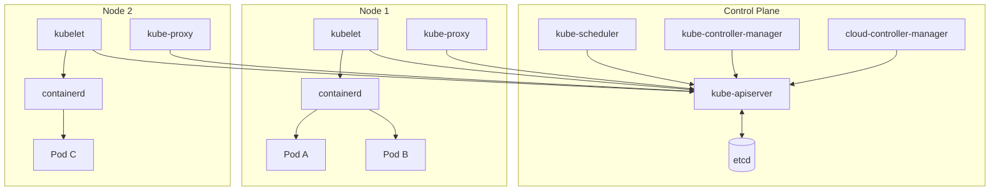
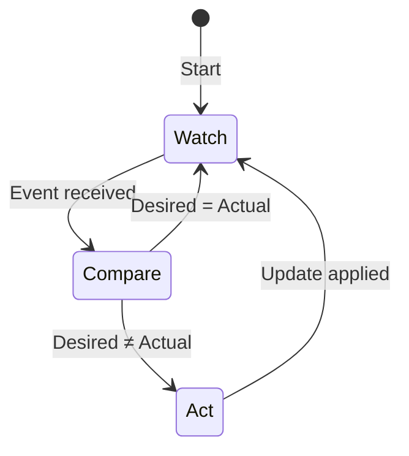
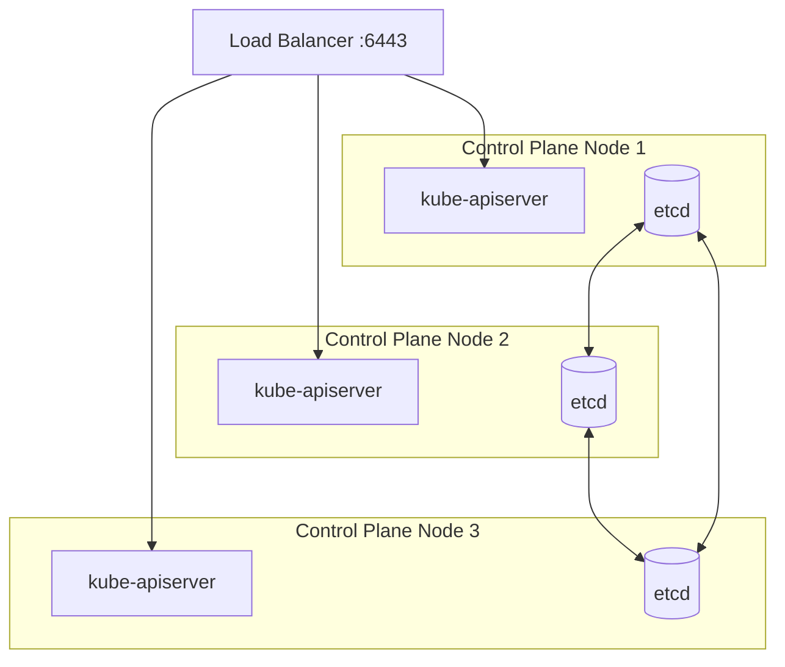
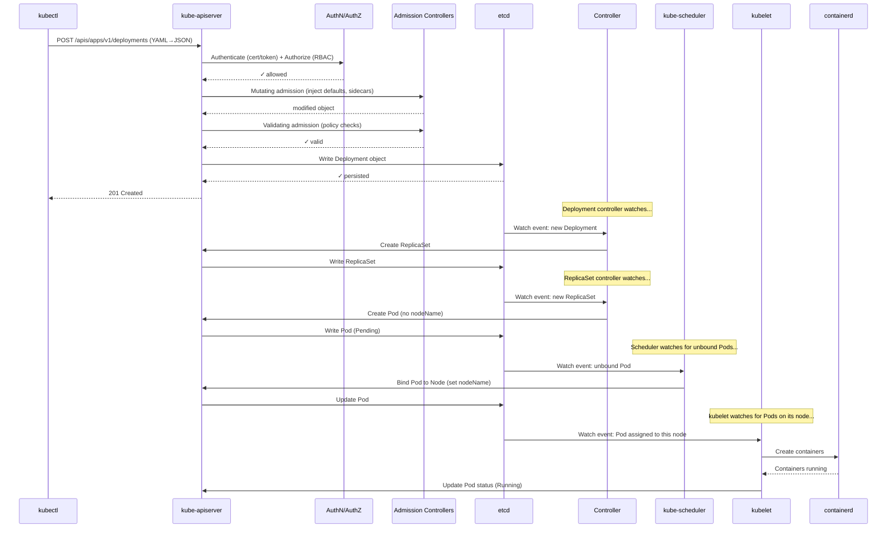

# Kubernetes Cluster Architecture — Control Plane, Nodes, and the Reconciliation Loop

**Date:** 2026-04-24 | **Updated:** 2026-04-24
**Tags:** `kubernetes` `architecture` `control-plane` `etcd` `kubelet`

## Table of Contents

- [Summary](#summary)
- [The Big Picture](#the-big-picture)
- [Control Plane Components](#control-plane-components)
  - [kube-apiserver](#kube-apiserver)
  - [etcd](#etcd)
  - [kube-scheduler](#kube-scheduler)
  - [kube-controller-manager](#kube-controller-manager)
  - [cloud-controller-manager](#cloud-controller-manager)
- [Node Components](#node-components)
  - [kubelet](#kubelet)
  - [kube-proxy](#kube-proxy)
  - [Container Runtime (CRI)](#container-runtime-cri)
- [The Reconciliation Loop — How Controllers Work](#the-reconciliation-loop--how-controllers-work)
- [Declarative Model vs Imperative Commands](#declarative-model-vs-imperative-commands)
- [Control Plane High Availability](#control-plane-high-availability)
  - [Stacked etcd Topology](#stacked-etcd-topology)
  - [External etcd Topology](#external-etcd-topology)
- [What Happens When You Run `kubectl apply`](#what-happens-when-you-run-kubectl-apply)
- [Related](#related)
- [References](#references)

## Summary

A Kubernetes cluster is split into two halves: a **control plane** that manages desired state and a set of **worker nodes** that run your containers. Every operation flows through the API server, every piece of state lives in etcd, and every controller continuously reconciles actual state toward desired state. Understanding these components and their interactions is the foundation for everything else in Kubernetes.

## The Big Picture



Key architectural principles:

- **Single source of truth**: all cluster state lives in etcd, accessed exclusively through the API server
- **Declarative**: you declare _what_ you want (a Deployment with 3 replicas), controllers figure out _how_
- **Watch-based**: controllers watch the API server for changes and react, rather than polling on a timer
- **Loosely coupled**: each component has a single responsibility and communicates only through the API server

## Control Plane Components

The [control plane](https://kubernetes.io/docs/concepts/overview/components/#control-plane-components) makes global decisions about the cluster (scheduling, detecting/responding to events). In production, control plane components run across multiple machines for fault tolerance.

### kube-apiserver

The **front door** to the entire cluster. Every `kubectl` command, every controller watch, every kubelet heartbeat goes through the [API server](https://kubernetes.io/docs/concepts/overview/components/#kube-apiserver).

Responsibilities:

- **REST API gateway** — exposes the Kubernetes API over HTTPS (typically port 6443)
- **Authentication & authorization** — validates identity (X.509 certs, OIDC tokens, ServiceAccount tokens) and checks RBAC policies
- **Admission control** — runs [admission controllers](https://kubernetes.io/docs/reference/access-authn-authz/admission-controllers/) (mutating → validating) before persisting objects
- **etcd interface** — the _only_ component that talks to etcd directly
- **Watch multiplexing** — fans out change notifications to watching controllers

The API server is **stateless** — all state lives in etcd. This makes it horizontally scalable: run multiple instances behind a load balancer.

```bash
# Check API server health
kubectl get --raw /healthz

# List all API groups
kubectl api-versions

# Discover resources in a group
kubectl api-resources --api-group=apps
```

### etcd

A distributed, consistent key-value store that holds **all cluster state** — every Pod, Service, ConfigMap, Secret, and custom resource. Built on the [Raft consensus protocol](https://etcd.io/docs/v3.5/learning/design-learner/).

Key characteristics:

- **Strongly consistent** — linearizable reads/writes across the cluster
- **Watch protocol** — clients (the API server) subscribe to key-range changes, enabling the reactive controller model
- **Leader election** — one etcd node is leader; writes go through the leader, reads can be served by any member (with consistency trade-offs)
- **Odd-number quorum** — requires a majority for writes: 3 nodes tolerate 1 failure, 5 tolerate 2

What etcd stores (conceptually):

```text
/registry/pods/default/my-pod          → Pod spec + status JSON
/registry/deployments/default/my-app   → Deployment spec + status JSON
/registry/services/specs/default/my-svc → Service spec JSON
/registry/secrets/default/my-secret    → Secret data (base64, optionally encrypted at rest)
```

> **Critical**: etcd is the single point of truth. Losing etcd data without a backup means losing the cluster. Always have an [etcd backup strategy](https://kubernetes.io/docs/tasks/administer-cluster/configure-upgrade-etcd/#backing-up-an-etcd-cluster).

### kube-scheduler

Watches for newly created Pods that have no `nodeName` assigned. For each unscheduled Pod, the [scheduler](https://kubernetes.io/docs/concepts/scheduling-eviction/kube-scheduler/) selects the best node using a two-phase process:

1. **Filtering** — eliminate nodes that cannot run the Pod (insufficient resources, taints not tolerated, node selectors not matched, affinity rules violated)
2. **Scoring** — rank remaining nodes by preference (spread across zones, image locality, resource balance)

The scheduler writes `pod.spec.nodeName` back to the API server. It does _not_ directly contact nodes — the kubelet picks up the assignment via its own API watch.

Factors considered:

- Resource requests (CPU, memory, ephemeral storage)
- Node affinity / anti-affinity
- Pod affinity / anti-affinity (co-locate or spread)
- Taints and tolerations
- Topology spread constraints
- Priority and preemption

### kube-controller-manager

A single binary that runs **dozens of independent control loops**, each responsible for one type of Kubernetes object. The [controller manager](https://kubernetes.io/docs/concepts/overview/components/#kube-controller-manager) is where the reconciliation magic happens.

Key controllers:

| Controller | Watches | Reconciles |
|-----------|---------|------------|
| Deployment | Deployments | Creates/updates ReplicaSets |
| ReplicaSet | ReplicaSets | Creates/deletes Pods to match replica count |
| Node | Nodes | Detects unresponsive nodes, evicts Pods |
| Job | Jobs | Creates Pods, tracks completions |
| EndpointSlice | Services + Pods | Maintains endpoint mappings for Services |
| ServiceAccount | Namespaces | Creates default ServiceAccount per namespace |
| Namespace | Namespaces | Cleans up resources when namespace is deleted |

Each controller runs a **reconciliation loop**: watch → compare desired vs actual → act → repeat.

### cloud-controller-manager

An optional component that integrates Kubernetes with cloud provider APIs (AWS, GCP, Azure). It runs cloud-specific controllers:

- **Node controller** — checks if a VM still exists in the cloud after a node stops responding
- **Route controller** — configures cloud network routes so Pods on different nodes can communicate
- **Service controller** — creates cloud load balancers when you create a `type: LoadBalancer` Service

If you run on bare metal or a platform without a cloud controller, this component is absent.

## Node Components

### kubelet

The **agent** running on every worker node. The [kubelet](https://kubernetes.io/docs/concepts/overview/components/#kubelet) watches the API server for Pods assigned to its node, then drives the container runtime to make reality match the spec.

Responsibilities:

- **Pod lifecycle management** — start, stop, and restart containers
- **Health checking** — execute [startup, liveness, and readiness probes](https://kubernetes.io/docs/tasks/configure-pod-container/configure-liveness-readiness-startup-probes/)
- **Resource enforcement** — set cgroups for CPU/memory limits
- **Volume mounting** — attach and mount persistent volumes
- **Status reporting** — report node conditions and Pod status back to the API server
- **Container log management** — expose container stdout/stderr via the API

The kubelet communicates with the container runtime via the [Container Runtime Interface (CRI)](https://kubernetes.io/docs/concepts/architecture/cri/).

### kube-proxy

A network component on each node that implements the [Service abstraction](https://kubernetes.io/docs/concepts/services-networking/service/). When you create a Service, kube-proxy ensures that traffic to the Service's ClusterIP reaches one of the backing Pods.

Three modes:

| Mode | Mechanism | Performance |
|------|-----------|-------------|
| **iptables** (default) | Kernel netfilter rules | Good for most clusters |
| **IPVS** | Linux Virtual Server in kernel | Better for 1000+ Services |
| **nftables** | Modern netfilter replacement | Newer alternative to iptables |

> kube-proxy is optional — some CNI plugins (Cilium in kube-proxy replacement mode) handle Service routing in eBPF, bypassing kube-proxy entirely.

### Container Runtime (CRI)

The software that actually runs containers on the node. Kubernetes talks to the runtime through the standardized [CRI (Container Runtime Interface)](https://kubernetes.io/docs/concepts/architecture/cri/).

Common runtimes:

- **[containerd](https://containerd.io/)** — the most common production runtime (graduated CNCF project)
- **[CRI-O](https://cri-o.io/)** — lightweight, OCI-compliant, designed specifically for Kubernetes
- **Docker Engine** — Kubernetes dropped direct Docker support in 1.24; Docker images still work, but the runtime is containerd or CRI-O under the hood

## The Reconciliation Loop — How Controllers Work

This is the most important concept in Kubernetes. Every controller follows the same pattern:



Concrete example — the **ReplicaSet controller**:

1. **Watch**: Listen for changes to ReplicaSet objects and Pods matching the selector
2. **Compare**: Count running Pods vs `spec.replicas`
3. **Act**:
   - Too few Pods → create new Pods (API server → scheduler → kubelet)
   - Too many Pods → delete excess Pods
4. **Loop**: Return to watching

This is why Kubernetes is **self-healing**. Kill a Pod, and the ReplicaSet controller notices the count is off and creates a replacement. No external orchestrator triggers this — each controller is autonomous.

```yaml
# The controller sees this spec...
apiVersion: apps/v1
kind: ReplicaSet
metadata:
  name: web
spec:
  replicas: 3        # ← desired state
  selector:
    matchLabels:
      app: web
  template:
    metadata:
      labels:
        app: web
    spec:
      containers:
      - name: nginx
        image: nginx:1.27
```

```text
# ...and ensures actual state matches:
$ kubectl get pods -l app=web
NAME        READY   STATUS    RESTARTS   AGE
web-abc12   1/1     Running   0          5m
web-def34   1/1     Running   0          5m
web-ghi56   1/1     Running   0          5m
# 3 running Pods = 3 desired replicas ✓
```

## Declarative Model vs Imperative Commands

Kubernetes supports both, but the **declarative model** is how Kubernetes is designed to work:

| Approach | Command | How it works |
|----------|---------|-------------|
| **Imperative** | `kubectl run nginx --image=nginx` | "Create this Pod now" — direct command |
| **Imperative object config** | `kubectl create -f pod.yaml` | "Create exactly this" — fails if exists |
| **Declarative** | `kubectl apply -f pod.yaml` | "Make reality match this" — creates or updates |

Why declarative wins:

- **Idempotent** — running `kubectl apply` twice produces the same result
- **Diffable** — manifests live in Git, changes are visible in diffs
- **Controller-friendly** — the entire reconciliation model is built on desired-state declarations
- **GitOps-compatible** — tools like ArgoCD watch Git repos and `apply` automatically

## Control Plane High Availability

A single control plane node is a single point of failure. Production clusters run **3+ control plane nodes** behind a load balancer.

### Stacked etcd Topology

Each control plane node runs both control plane components _and_ a local etcd member.



- **Minimum**: 3 nodes
- **Simpler** to set up and manage (kubeadm default)
- **Risk**: losing one node loses both a control plane instance _and_ an etcd member

### External etcd Topology

etcd runs on dedicated hosts, separate from control plane nodes.

- **Minimum**: 3 control plane nodes + 3 etcd nodes (6 total)
- **Better fault isolation**: losing a control plane node does not lose etcd data
- **More infrastructure** to manage
- **Use when**: maximum availability is critical (production, regulated environments)

| Aspect | Stacked | External |
|--------|---------|----------|
| Minimum nodes | 3 | 6 |
| Setup complexity | Simple | Complex |
| Fault isolation | Moderate | High |
| Infrastructure cost | Lower | Higher |
| Best for | Dev/staging, smaller prod | Critical production |

## What Happens When You Run `kubectl apply`

The full request path, end to end:



The entire chain is **asynchronous**. `kubectl apply` returns as soon as etcd acknowledges the write. The downstream reconciliation (controller → scheduler → kubelet) happens independently, each component reacting to watch events.

## Related

- [The Kubernetes API — Resources, Objects, and What Happens on `kubectl apply`](api-and-objects.md) — deep dive into the API model, admission chain, and server-side apply
- [Namespaces, Labels, Selectors, and Resource Organization](namespaces-and-labels.md) — how objects are organized and selected
- [Container Networking](../../networking/advanced/container-networking.md) — Docker/K8s CNI, pod-to-pod networking at the wire level
- [Spring Boot on Kubernetes](../../java/configurations/kubernetes-spring-boot.md) — application-level K8s config for Java apps
- [Node.js in Kubernetes](../../typescript/production/nodejs-in-kubernetes.md) — application-level K8s config for Node apps

## References

- [Kubernetes Components](https://kubernetes.io/docs/concepts/overview/components/) — official component overview
- [Cluster Architecture](https://kubernetes.io/docs/concepts/architecture/) — architectural concepts and design principles
- [Admission Controllers Reference](https://kubernetes.io/docs/reference/access-authn-authz/admission-controllers/) — built-in admission controllers
- [Options for Highly Available Topology](https://kubernetes.io/docs/setup/production-environment/tools/kubeadm/ha-topology/) — stacked vs external etcd
- [Operating etcd Clusters](https://kubernetes.io/docs/tasks/administer-cluster/configure-upgrade-etcd/) — etcd operations and backup
- [Container Runtime Interface (CRI)](https://kubernetes.io/docs/concepts/architecture/cri/) — how kubelet talks to container runtimes
- [etcd Design: Learner](https://etcd.io/docs/v3.5/learning/design-learner/) — etcd's Raft-based consensus design
- [containerd](https://containerd.io/) — the most common Kubernetes container runtime
