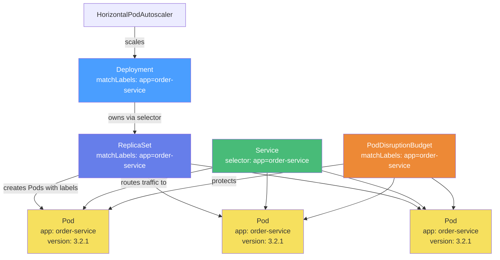

# Namespaces, Labels, Selectors, and Resource Organization

**Date:** 2026-04-24 | **Updated:** 2026-04-24
**Tags:** `kubernetes` `namespaces` `labels` `selectors` `organization`

## Table of Contents

- [Summary](#summary)
- [Namespaces — Soft Multi-Tenancy Boundaries](#namespaces--soft-multi-tenancy-boundaries)
  - [What Namespaces Isolate](#what-namespaces-isolate)
  - [What Namespaces Do Not Isolate](#what-namespaces-do-not-isolate)
  - [Built-in Namespaces](#built-in-namespaces)
  - [When to Create Namespaces](#when-to-create-namespaces)
  - [Namespace Anti-Patterns](#namespace-anti-patterns)
  - [Working with Namespaces](#working-with-namespaces)
- [Labels — Key/Value Pairs for Identification](#labels--keyvalue-pairs-for-identification)
  - [Label Syntax Rules](#label-syntax-rules)
  - [Recommended Label Conventions](#recommended-label-conventions)
  - [Labeling a Deployment in Practice](#labeling-a-deployment-in-practice)
- [Selectors — How Kubernetes Connects Objects](#selectors--how-kubernetes-connects-objects)
  - [Equality-Based Selectors](#equality-based-selectors)
  - [Set-Based Selectors](#set-based-selectors)
  - [How Selectors Drive Everything](#how-selectors-drive-everything)
  - [Querying with Selectors](#querying-with-selectors)
- [Annotations — Metadata for Tooling](#annotations--metadata-for-tooling)
  - [Labels vs Annotations Decision](#labels-vs-annotations-decision)
  - [Common Annotation Patterns](#common-annotation-patterns)
- [ResourceQuota — Namespace-Level Limits](#resourcequota--namespace-level-limits)
- [LimitRange — Pod-Level Defaults](#limitrange--pod-level-defaults)
- [Putting It All Together](#putting-it-all-together)
- [Related](#related)
- [References](#references)

## Summary

Namespaces partition a cluster into virtual sub-clusters with independent naming, RBAC, and resource quotas. Labels are key/value pairs attached to every Kubernetes object that enable **selection** — the mechanism Services use to find Pods, Deployments use to manage ReplicaSets, and schedulers use to place workloads on nodes. Together with annotations (non-selective metadata), these three primitives are how you organize, query, and govern everything in a Kubernetes cluster.

## Namespaces — Soft Multi-Tenancy Boundaries

A namespace is a logical partition within a cluster. Objects inside a namespace must have unique names, but the same name can exist in different namespaces. Think of namespaces as directories in a filesystem — they scope names, not hardware.

### What Namespaces Isolate

| Concern | How namespaces help |
|---------|-------------------|
| **Object names** | Two teams can both have a Service called `api` without collision |
| **RBAC** | A Role grants permissions _within_ a namespace — team A cannot modify team B's Deployments |
| **ResourceQuota** | Cap CPU, memory, and object count per namespace to prevent noisy neighbors |
| **NetworkPolicy** | Default-deny policies scoped to a namespace restrict cross-namespace traffic |
| **Service accounts** | Each namespace gets its own `default` ServiceAccount |

### What Namespaces Do Not Isolate

These resources are **cluster-scoped** — they exist outside any namespace:

- **Nodes** — physical/virtual machines belong to the cluster, not a namespace
- **PersistentVolumes** — storage is provisioned cluster-wide; PVCs (claims) are namespaced
- **ClusterRoles / ClusterRoleBindings** — permissions that span all namespaces
- **Namespaces themselves** — you cannot nest namespaces
- **StorageClasses, PriorityClasses, IngressClasses** — cluster-wide policies
- **CRDs (CustomResourceDefinitions)** — the definition is cluster-scoped, though instances can be namespaced

```bash
# List all cluster-scoped resource types
kubectl api-resources --namespaced=false

# List all namespaced resource types
kubectl api-resources --namespaced=true
```

### Built-in Namespaces

Every cluster ships with four namespaces:

| Namespace | Purpose |
|-----------|---------|
| `default` | Where objects land when you don't specify a namespace. Fine for experiments, avoid in production. |
| `kube-system` | Control plane components (kube-apiserver, coredns, kube-proxy, etc.). Hands off unless you know what you're doing. |
| `kube-public` | Readable by all users (including unauthenticated). Contains the `cluster-info` ConfigMap used during bootstrapping. Rarely touched directly. |
| `kube-node-lease` | One Lease object per node. The kubelet renews its lease every 10 seconds — the control plane uses this heartbeat to detect node failures faster than relying on NodeStatus updates alone. |

### When to Create Namespaces

Good boundaries:

- **Per team** — `team-payments`, `team-catalog` — each team owns their namespace and gets an RBAC Role
- **Per environment** — `staging`, `production` — separate quotas and network policies per environment
- **Per application** — `order-service`, `notification-service` — when a single app has many sub-resources (Deployments, ConfigMaps, Jobs) and you want clean `kubectl get all -n order-service` output
- **Per concern** — `monitoring`, `ingress`, `cert-manager` — infrastructure services in dedicated namespaces

Combine strategies: `team-payments-staging`, `team-payments-production` gives both team and environment boundaries.

### Namespace Anti-Patterns

| Anti-pattern | Why it hurts |
|-------------|-------------|
| One namespace per microservice _and_ per environment (namespace explosion) | Hundreds of namespaces make RBAC and quota management painful |
| Everything in `default` | No isolation, no quotas, no RBAC boundaries — chaos at scale |
| Namespaces as security boundaries alone | Namespaces are soft tenancy. True isolation requires NetworkPolicies, RBAC, PodSecurity, and possibly separate clusters |
| Splitting a tightly coupled app across namespaces | Cross-namespace service calls need FQDNs (`svc.namespace.svc.cluster.local`), adding latency and complexity |

### Working with Namespaces

```bash
# Create a namespace
kubectl create namespace team-payments

# Or declaratively
cat <<'EOF' | kubectl apply -f -
apiVersion: v1
kind: Namespace
metadata:
  name: team-payments
  labels:
    team: payments
    environment: production
EOF

# List all namespaces
kubectl get namespaces

# Set a default namespace for your context (avoids -n on every command)
kubectl config set-context --current --namespace=team-payments

# Delete a namespace (WARNING: deletes ALL resources inside it)
kubectl delete namespace team-payments
```

## Labels — Key/Value Pairs for Identification

Labels are the primary grouping mechanism in Kubernetes. Every object (Pods, Services, Nodes, PVs — everything) can carry labels. Unlike names, labels are not unique — many objects can share the same label, and a single object can have many labels.

### Label Syntax Rules

Labels follow strict syntax constraints:

**Key format:** `[prefix/]name`

| Part | Rules |
|------|-------|
| **Name** (required) | Max 63 characters. Must start and end with an alphanumeric character `[a-z0-9A-Z]`. May contain dashes `-`, underscores `_`, and dots `.` in between. |
| **Prefix** (optional) | A valid DNS subdomain (e.g., `app.kubernetes.io`). Max 253 characters total. Separated from the name by `/`. |

**Value format:**

| Rules |
|-------|
| Max 63 characters (can be empty). Must start and end with alphanumeric if non-empty. May contain dashes, underscores, and dots. |

**Reserved prefixes:**

- `kubernetes.io/` and `k8s.io/` — reserved for Kubernetes core components
- Automated system components (scheduler, controllers, third-party tools) **must** use a prefix to avoid colliding with user labels

```yaml
# Valid labels
metadata:
  labels:
    app: order-service                          # simple key
    version: "2.1.0"                            # quotes needed for dots in YAML values
    app.kubernetes.io/name: order-service       # prefixed (recommended)
    team: payments                              # organizational
    environment: production                     # deployment stage

# Invalid labels
metadata:
  labels:
    "": value               # empty key name
    -starts-with-dash: bad  # must start alphanumeric
    too-long-label-name-that-exceeds-sixty-three-characters-this-will-fail: x
```

### Recommended Label Conventions

Kubernetes defines a standard set of labels under the `app.kubernetes.io` prefix. These are not enforced, but widely supported by Helm, ArgoCD, Prometheus, dashboards, and other tooling:

| Label | Purpose | Example |
|-------|---------|---------|
| `app.kubernetes.io/name` | The application name | `order-service` |
| `app.kubernetes.io/instance` | A unique instance identifier | `order-service-prod` |
| `app.kubernetes.io/version` | The current app version | `3.2.1` |
| `app.kubernetes.io/component` | The component within the architecture | `api`, `worker`, `database` |
| `app.kubernetes.io/part-of` | The higher-level application | `webshop` |
| `app.kubernetes.io/managed-by` | The tool managing the resource | `helm`, `argocd`, `kubectl` |

```yaml
# A well-labeled Deployment following conventions
apiVersion: apps/v1
kind: Deployment
metadata:
  name: order-service
  namespace: team-payments
  labels:
    app.kubernetes.io/name: order-service
    app.kubernetes.io/instance: order-service-production
    app.kubernetes.io/version: "3.2.1"
    app.kubernetes.io/component: api
    app.kubernetes.io/part-of: webshop
    app.kubernetes.io/managed-by: helm
    team: payments
    environment: production
```

### Labeling a Deployment in Practice

```bash
# Add labels to an existing resource
kubectl label deployment order-service version=3.2.1 --namespace=team-payments

# Overwrite an existing label
kubectl label deployment order-service version=3.3.0 --overwrite --namespace=team-payments

# Remove a label (trailing minus)
kubectl label deployment order-service version- --namespace=team-payments

# Add labels to a node (for nodeSelector scheduling)
kubectl label node worker-01 disk=ssd gpu=nvidia-a100
```

## Selectors — How Kubernetes Connects Objects

Selectors are how one Kubernetes object finds another. They match against labels. Without selectors, a Service would not know which Pods to route to and a Deployment would not know which ReplicaSet it owns.

### Equality-Based Selectors

Match against exact key/value pairs:

| Operator | Meaning | Example |
|----------|---------|---------|
| `=` or `==` | Equals | `environment = production` |
| `!=` | Not equals | `tier != frontend` |

```bash
# Find all Pods in production
kubectl get pods -l environment=production

# Find Pods that are NOT in the frontend tier
kubectl get pods -l tier!=frontend

# Combine with comma (AND logic)
kubectl get pods -l environment=production,tier=backend
```

### Set-Based Selectors

More expressive — match against sets of values:

| Operator | Meaning | Example |
|----------|---------|---------|
| `in` | Value is one of the set | `environment in (production, staging)` |
| `notin` | Value is not in the set | `tier notin (frontend, cache)` |
| `exists` | Key exists (any value) | `release` |
| `!` (does not exist) | Key must not be present | `!canary` |

```bash
# Pods in staging or production
kubectl get pods -l 'environment in (staging, production)'

# Pods that have a release label (any value)
kubectl get pods -l 'release'

# Pods that do NOT have a canary label
kubectl get pods -l '!canary'

# Combine set-based with equality-based
kubectl get pods -l 'environment in (production),tier=backend'
```

### How Selectors Drive Everything

This is the critical concept. Selectors are not just a query tool — they are the **wiring** that connects Kubernetes objects to each other:



| Object | Uses selector to... | Selector type |
|--------|-------------------|---------------|
| **Service** | Route traffic to matching Pods | Equality-based only (in `.spec.selector`) |
| **Deployment** | Own ReplicaSets that manage Pods | `matchLabels` (equality) and/or `matchExpressions` (set-based) |
| **ReplicaSet** | Know which Pods it manages | `matchLabels` and/or `matchExpressions` |
| **Job** | Track which Pods belong to the job | `matchLabels` and/or `matchExpressions` |
| **NetworkPolicy** | Select which Pods the policy applies to | `matchLabels` and/or `matchExpressions` in `podSelector` |
| **PodDisruptionBudget** | Protect Pods during voluntary disruptions | `matchLabels` and/or `matchExpressions` |
| **nodeSelector** | Schedule Pods onto specific nodes | Equality-based map in `.spec.nodeSelector` |
| **nodeAffinity** | Advanced node scheduling rules | `matchExpressions` (set-based) |

Here is how the selector appears in a Deployment and its matching Service:

```yaml
# Deployment — the selector tells Kubernetes which Pods this Deployment manages
apiVersion: apps/v1
kind: Deployment
metadata:
  name: order-service
  namespace: team-payments
spec:
  replicas: 3
  selector:
    matchLabels:                         # <-- immutable after creation
      app: order-service
    matchExpressions:                    # <-- optional set-based
      - key: environment
        operator: In
        values: [production, staging]
  template:
    metadata:
      labels:
        app: order-service               # MUST match selector above
        version: "3.2.1"                 # extra labels are fine
        environment: production
    spec:
      containers:
        - name: api
          image: registry.example.com/order-service:3.2.1
---
# Service — routes traffic to Pods matching selector
apiVersion: v1
kind: Service
metadata:
  name: order-service
  namespace: team-payments
spec:
  selector:
    app: order-service                   # matches Pod labels
  ports:
    - port: 80
      targetPort: 8080
```

> **Key rule:** The Pod template labels must be a superset of the Deployment's `matchLabels`. If the labels in the template don't match the selector, the Deployment will be rejected by the API server.

### Querying with Selectors

```bash
# Show labels on all Pods
kubectl get pods --show-labels -n team-payments

# Filter with labels
kubectl get pods -l app=order-service -n team-payments

# Output in wide format with labels as columns
kubectl get pods -L app,version,environment -n team-payments

# Get all resources with a specific label
kubectl get all -l app.kubernetes.io/part-of=webshop -n team-payments

# Count Pods per label value
kubectl get pods -l app=order-service -n team-payments --no-headers | wc -l
```

## Annotations — Metadata for Tooling

Annotations look like labels (key/value on metadata) but serve a fundamentally different purpose: **annotations are for non-identifying metadata** that tools, controllers, and humans read but Kubernetes never selects on.

### Labels vs Annotations Decision

| Question | If yes, use... |
|----------|---------------|
| Will Kubernetes need to select/filter by this? | **Label** |
| Does a Service, Deployment selector, or nodeSelector use this? | **Label** |
| Is this data for humans, tools, or controllers to read? | **Annotation** |
| Is the value longer than 63 characters (URLs, JSON, descriptions)? | **Annotation** |
| Is this a build/release timestamp, git SHA, or CI link? | **Annotation** |

Annotations have **no length limit on values** (labels max at 63 characters). Annotation keys follow the same prefix/name syntax as labels.

### Common Annotation Patterns

```yaml
metadata:
  annotations:
    # Last-applied configuration — added by kubectl apply
    kubectl.kubernetes.io/last-applied-configuration: |
      {"apiVersion":"apps/v1","kind":"Deployment",...}

    # Managed-by tool metadata
    meta.helm.sh/release-name: order-service
    meta.helm.sh/release-namespace: team-payments

    # Description for humans
    description: "Processes incoming orders from the checkout flow"

    # Prometheus scrape configuration
    prometheus.io/scrape: "true"
    prometheus.io/port: "9090"
    prometheus.io/path: "/actuator/prometheus"     # Spring Boot actuator

    # Deployment info
    kubernetes.io/change-cause: "Upgrade to 3.2.1 — fixes OOM on large orders"

    # GitOps / CI metadata
    app.example.com/git-sha: "a1b2c3d4"
    app.example.com/ci-run: "https://github.com/org/repo/actions/runs/12345"

    # Ingress controller config (NGINX)
    nginx.ingress.kubernetes.io/rewrite-target: /
    nginx.ingress.kubernetes.io/ssl-redirect: "true"
```

> **Spring Boot context:** The `prometheus.io/*` annotations are how you tell Prometheus to scrape your Spring Boot Actuator metrics endpoint without modifying the Prometheus config. See [Kubernetes + Spring Boot](../../java/configurations/kubernetes-spring-boot.md) for the full application-side setup.

## ResourceQuota — Namespace-Level Limits

A ResourceQuota constrains the **aggregate** resource consumption within a namespace. This is how platform teams prevent a single namespace from consuming the entire cluster.

```yaml
apiVersion: v1
kind: ResourceQuota
metadata:
  name: team-payments-quota
  namespace: team-payments
spec:
  hard:
    # Compute limits
    requests.cpu: "10"            # total CPU requests across all Pods
    requests.memory: 20Gi         # total memory requests across all Pods
    limits.cpu: "20"              # total CPU limits across all Pods
    limits.memory: 40Gi           # total memory limits across all Pods

    # Object count limits
    pods: "50"                    # max 50 Pods in this namespace
    services: "10"                # max 10 Services
    configmaps: "30"              # max 30 ConfigMaps
    secrets: "30"                 # max 30 Secrets
    persistentvolumeclaims: "10"  # max 10 PVCs
    replicationcontrollers: "0"   # block legacy replication controllers
```

```bash
# Check current usage against quota
kubectl describe resourcequota team-payments-quota -n team-payments
```

```text
Name:                   team-payments-quota
Namespace:              team-payments
Resource                Used    Hard
--------                ----    ----
configmaps              5       30
limits.cpu              6       20
limits.memory           12Gi    40Gi
persistentvolumeclaims  2       10
pods                    12      50
requests.cpu            3       10
requests.memory         6Gi     20Gi
secrets                 8       30
services                3       10
```

**Key enforcement rule:** When a ResourceQuota for CPU or memory exists in a namespace, **every new Pod must specify requests and limits** for those resources. If a Pod omits them, the API server rejects the creation with HTTP 403. This is why you pair ResourceQuota with LimitRange (below) — LimitRange provides defaults so developers don't have to set them on every Pod.

> ResourceQuota is covered in depth in [Resource Requests, Limits, QoS Classes, and LimitRanges](../../kubernetes/configuration/resource-management.md).

## LimitRange — Pod-Level Defaults

While ResourceQuota caps the namespace total, LimitRange constrains **individual** Pods and containers:

```yaml
apiVersion: v1
kind: LimitRange
metadata:
  name: default-limits
  namespace: team-payments
spec:
  limits:
    - type: Container
      default:             # applied as limits if container omits them
        cpu: 500m
        memory: 512Mi
      defaultRequest:      # applied as requests if container omits them
        cpu: 100m
        memory: 128Mi
      min:                 # floor — rejects Pods below this
        cpu: 50m
        memory: 64Mi
      max:                 # ceiling — rejects Pods above this
        cpu: "2"
        memory: 2Gi
```

This prevents:
- A single Pod from hogging all the namespace's quota by requesting massive resources
- Developers from deploying Pods with no resource requests (which would break QoS guarantees)
- Pods with absurdly small limits that would OOMKill immediately

## Putting It All Together

A typical platform team setup for a new team namespace:

```bash
# 1. Create the namespace with organizational labels
kubectl create namespace team-payments
kubectl label namespace team-payments \
  team=payments \
  environment=production \
  cost-center=cc-1234

# 2. Apply resource quota
kubectl apply -f resourcequota.yaml -n team-payments

# 3. Apply limit range defaults
kubectl apply -f limitrange.yaml -n team-payments

# 4. Deploy a well-labeled application
kubectl apply -f deployment.yaml -n team-payments

# 5. Verify — query across the namespace using labels
kubectl get all -n team-payments -l app.kubernetes.io/part-of=webshop --show-labels

# 6. Check quota consumption
kubectl describe resourcequota -n team-payments
```

## Related

- [Kubernetes Cluster Architecture](cluster-architecture.md) — the control plane and node components that process namespaced resources
- [The Kubernetes API — Resources, Objects, and What Happens on `kubectl apply`](api-and-objects.md) — how API groups, GVK, and admission controllers validate your labeled objects
- [Resource Requests, Limits, QoS Classes, and LimitRanges](../configuration/resource-management.md) — deep dive into ResourceQuota and LimitRange mechanics
- [Kubernetes + Spring Boot](../../java/configurations/kubernetes-spring-boot.md) — application-level K8s configuration for Java services, including Prometheus annotations and health probes

## References

- [Namespaces](https://kubernetes.io/docs/concepts/overview/working-with-objects/namespaces/) — official docs on namespace semantics and operations
- [Labels and Selectors](https://kubernetes.io/docs/concepts/overview/working-with-objects/labels/) — syntax rules, selector types, and API usage
- [Recommended Labels](https://kubernetes.io/docs/concepts/overview/working-with-objects/common-labels/) — the `app.kubernetes.io` convention
- [Well-Known Labels, Annotations and Taints](https://kubernetes.io/docs/reference/labels-annotations-taints/) — comprehensive reference for all standard labels and annotations
- [Annotations](https://kubernetes.io/docs/concepts/overview/working-with-objects/annotations/) — when to use annotations over labels
- [Resource Quotas](https://kubernetes.io/docs/concepts/policy/resource-quotas/) — ResourceQuota spec and enforcement rules
- [Limit Ranges](https://kubernetes.io/docs/concepts/policy/limit-range/) — per-container defaults and min/max constraints
- [Configure Memory and CPU Quotas for a Namespace](https://kubernetes.io/docs/tasks/administer-cluster/manage-resources/quota-memory-cpu-namespace/) — hands-on tutorial
