# Ingress, Gateway API, and External Traffic Routing

**Date:** 2026-04-24 | **Updated:** 2026-04-24
**Tags:** `kubernetes` `ingress` `gateway-api` `routing` `tls`

## Table of Contents

- [Summary](#summary)
- [The Problem: Getting External Traffic into the Cluster](#the-problem-getting-external-traffic-into-the-cluster)
- [Ingress](#ingress)
  - [What Ingress Solves](#what-ingress-solves)
  - [Ingress Resource Anatomy](#ingress-resource-anatomy)
  - [Host-Based and Path-Based Routing](#host-based-and-path-based-routing)
  - [Path Types](#path-types)
  - [IngressClass](#ingressclass)
  - [TLS Termination](#tls-termination)
  - [Popular Ingress Controllers](#popular-ingress-controllers)
  - [The Annotation Problem](#the-annotation-problem)
  - [Limitations of Ingress](#limitations-of-ingress)
- [Gateway API](#gateway-api)
  - [The Successor to Ingress](#the-successor-to-ingress)
  - [Role-Oriented Design](#role-oriented-design)
  - [Key Resources](#key-resources)
  - [HTTPRoute Capabilities](#httproute-capabilities)
  - [Traffic Splitting Example](#traffic-splitting-example)
  - [Multi-Tenant Gateways and ReferenceGrant](#multi-tenant-gateways-and-referencegrant)
  - [cert-manager Integration](#cert-manager-integration)
  - [Migration from Ingress to Gateway API](#migration-from-ingress-to-gateway-api)
- [Ingress vs Gateway API — Decision Guide](#ingress-vs-gateway-api--decision-guide)
- [Related](#related)
- [References](#references)

## Summary

Kubernetes Services (ClusterIP, NodePort, LoadBalancer) solve in-cluster routing and basic external exposure, but they operate at L4 — they do not understand HTTP paths, hostnames, or headers. **Ingress** brought L7 routing to Kubernetes, allowing host-based and path-based HTTP routing from outside the cluster to internal Services. However, Ingress relies on vendor-specific annotations for anything beyond basic routing and only supports HTTP/HTTPS. **Gateway API** is the successor — a role-oriented, expressive, and portable standard that reached GA in v1.0 (October 2023) and has continued to mature through v1.5 (March 2026). For new clusters, Gateway API is the recommended path forward.

## The Problem: Getting External Traffic into the Cluster

Without Ingress or Gateway API, your options for external access are limited:

| Service Type | Layer | What You Get | What You Lose |
|---|---|---|---|
| `NodePort` | L4 | Port on every node (30000-32767) | No host/path routing, ugly ports, no TLS offload |
| `LoadBalancer` | L4 | Cloud LB → one Service | One LB per Service ($$$), no routing logic |
| `Ingress` | L7 | Host + path routing, TLS termination | HTTP/HTTPS only, annotation sprawl |
| `Gateway API` | L4-L7 | Full routing control, TCP/TLS/HTTP/gRPC | Newer — some controllers still catching up |

For a backend developer running a Spring Boot API and a Node.js BFF behind the same domain, you need L7 routing: `api.example.com/orders` goes to the Java service, `api.example.com/bff` goes to the Node service. That is the problem Ingress and Gateway API solve.

## Ingress

### What Ingress Solves

An Ingress resource declares L7 HTTP routing rules — which hostname and path combinations map to which backend Services. An **Ingress controller** (a pod running nginx, Traefik, HAProxy, etc.) watches for Ingress resources and configures the actual reverse proxy accordingly.

The split is important: the Ingress *resource* is just data in the API. The Ingress *controller* is the thing that acts on it.

### Ingress Resource Anatomy

```yaml
apiVersion: networking.k8s.io/v1
kind: Ingress
metadata:
  name: app-ingress
  namespace: production
  annotations:
    nginx.ingress.kubernetes.io/rewrite-target: /
spec:
  ingressClassName: nginx            # which controller handles this
  tls:
    - hosts:
        - api.example.com
      secretName: api-tls-cert       # TLS cert stored as a Secret
  rules:
    - host: api.example.com
      http:
        paths:
          - path: /orders
            pathType: Prefix
            backend:
              service:
                name: orders-service   # Spring Boot service
                port:
                  number: 8080
          - path: /bff
            pathType: Prefix
            backend:
              service:
                name: bff-service      # Node.js BFF
                port:
                  number: 3000
```

**What happens:** The Ingress controller provisions a reverse proxy configuration that terminates TLS for `api.example.com`, routes `/orders/**` to `orders-service:8080`, and `/bff/**` to `bff-service:3000`.

### Host-Based and Path-Based Routing

You can combine both:

```yaml
rules:
  # Host-based: different subdomains to different services
  - host: api.example.com
    http:
      paths:
        - path: /
          pathType: Prefix
          backend:
            service:
              name: api-service
              port:
                number: 8080
  - host: admin.example.com
    http:
      paths:
        - path: /
          pathType: Prefix
          backend:
            service:
              name: admin-service
              port:
                number: 3000
```

Without a `host` field, the rule matches all incoming traffic regardless of hostname — useful for development but risky in production.

### Path Types

| pathType | Behavior | Example: `/orders` |
|---|---|---|
| `Exact` | Matches the path exactly | `/orders` matches, `/orders/123` does not |
| `Prefix` | Matches path prefix by `/`-separated segments | `/orders` and `/orders/123` match, `/ordershistory` does not |
| `ImplementationSpecific` | Controller decides matching semantics | Depends on your controller — avoid for portability |

`Prefix` matching is segment-aware. The path `/orders` matches `/orders` and `/orders/123` but NOT `/ordershistory`. This is because the Prefix type splits on `/` boundaries.

### IngressClass

Since a cluster can run multiple Ingress controllers (e.g., nginx for public traffic, Traefik for internal), `IngressClass` tells Kubernetes which controller handles which Ingress resources:

```yaml
apiVersion: networking.k8s.io/v1
kind: IngressClass
metadata:
  name: nginx
  annotations:
    ingressclass.kubernetes.io/is-default-class: "true"  # handles unspecified Ingresses
spec:
  controller: k8s.io/ingress-nginx
```

Reference it in your Ingress via `spec.ingressClassName: nginx`. If you omit the class and a default exists, the default controller picks it up. If no default exists and no class is set, the Ingress is ignored.

### TLS Termination

The Ingress controller terminates TLS using a Kubernetes Secret containing the certificate and key:

```yaml
# Create the TLS secret
kubectl create secret tls api-tls-cert \
  --cert=tls.crt \
  --key=tls.key \
  -n production
```

```yaml
spec:
  tls:
    - hosts:
        - api.example.com
        - admin.example.com    # SAN or wildcard cert
      secretName: api-tls-cert
```

The controller handles the TLS handshake. Traffic between the controller and your backend pods is typically unencrypted (within the cluster network). If you need end-to-end encryption, you configure backend TLS separately — or use a service mesh.

### Popular Ingress Controllers

| Controller | Maintained By | Notes |
|---|---|---|
| **ingress-nginx** | Kubernetes community | Most widely deployed. `k8s.io/ingress-nginx` controller ID. |
| **NGINX Ingress Controller** | F5/NGINX Inc | Commercial variant. Different annotation namespace. |
| **Traefik** | Traefik Labs | Auto-discovery, built-in dashboard, supports Gateway API natively. |
| **AWS ALB Ingress Controller** | AWS | Maps Ingress to ALB resources. Now part of AWS Load Balancer Controller. |
| **HAProxy Ingress** | HAProxy Technologies | High-performance, extensive config knobs. |
| **Contour** | VMware / Project Contour | Envoy-based, clean HTTPProxy CRD as Ingress alternative. |
| **Istio Ingress Gateway** | Istio | Part of the Istio service mesh. |

**Watch out:** ingress-nginx (community) and NGINX Ingress Controller (F5) are **different projects** with different annotations, different versions, and different behavior. Check which one you are installing.

### The Annotation Problem

Ingress only standardizes basic host/path routing. Anything beyond that — rate limiting, CORS, rewrites, circuit breaking, auth — is controller-specific and configured via annotations:

```yaml
# These are nginx-specific and will NOT work on Traefik or ALB
metadata:
  annotations:
    nginx.ingress.kubernetes.io/rate-limit: "10"
    nginx.ingress.kubernetes.io/cors-allow-origin: "https://app.example.com"
    nginx.ingress.kubernetes.io/auth-url: "https://auth.example.com/verify"
    nginx.ingress.kubernetes.io/proxy-body-size: "50m"
    nginx.ingress.kubernetes.io/affinity: "cookie"
```

This means:
- Your Ingress manifests are **not portable** between controllers
- Annotations are **stringly-typed** — typos silently do nothing
- No validation at apply time — you discover misconfig at runtime
- Complex use cases produce walls of annotations that are hard to review

This is the core reason Gateway API was created.

### Limitations of Ingress

1. **HTTP/HTTPS only** — no TCP or UDP routing (databases, MQTT, gRPC without HTTP/2 upgrade)
2. **No traffic splitting** — cannot send 90% to v1 and 10% to v2 natively
3. **No header-based routing** — cannot route based on `X-Tenant-Id` or `Authorization` headers
4. **No request/response modification** — cannot add headers, rewrite URLs portably
5. **No mirroring** — cannot shadow traffic to a new version for testing
6. **Single target per path** — one Service backend per rule, no weighted distribution

## Gateway API

### The Successor to Ingress

Gateway API is a collection of CRDs developed by SIG-Network as the next generation of Kubernetes traffic routing. It reached GA (v1.0) in October 2023 with HTTPRoute, Gateway, and GatewayClass graduating to the `v1` API version. As of v1.5 (March 2026), the Standard channel includes:

| Resource | Standard Since | Purpose |
|---|---|---|
| **GatewayClass** | v1.0 | Infrastructure template (like IngressClass) |
| **Gateway** | v1.0 | Listener configuration (ports, protocols, TLS) |
| **HTTPRoute** | v1.0 | HTTP/HTTPS routing rules |
| **GRPCRoute** | v1.1 | gRPC-specific routing |
| **ReferenceGrant** | v1.5 | Cross-namespace reference authorization |
| **BackendTLSPolicy** | v1.5 | Gateway-to-backend TLS configuration |
| **TLSRoute** | v1.5 | TLS routing via SNI (without HTTP inspection) |
| **ListenerSet** | v1.5 | Shared listeners across Gateways |

TCPRoute and UDPRoute remain in the Experimental channel.

### Role-Oriented Design

Gateway API's most important design choice: it separates concerns by **operational role**, not by resource type. Each role manages only what it needs.

```mermaid
graph TB
    subgraph "Infrastructure Provider"
        GC[GatewayClass<br/>&#40;e.g., aws-alb, envoy, istio&#41;]
    end

    subgraph "Cluster Operator"
        GW[Gateway<br/>ports, TLS certs, allowed routes]
    end

    subgraph "Application Developer"
        HR1[HTTPRoute — orders-service<br/>/api/orders → orders:8080]
        HR2[HTTPRoute — bff-service<br/>/api/bff → bff:3000]
        GR[GRPCRoute — payments<br/>payments.Payments → payments:9090]
    end

    GC --> GW
    GW --> HR1
    GW --> HR2
    GW --> GR

    style GC fill:#e8d5f5,stroke:#7c3aed
    style GW fill:#dbeafe,stroke:#2563eb
    style HR1 fill:#d1fae5,stroke:#059669
    style HR2 fill:#d1fae5,stroke:#059669
    style GR fill:#d1fae5,stroke:#059669
```



**Infrastructure provider** (platform team, cloud vendor): Defines `GatewayClass` — what implementation backs your gateways (Envoy, NGINX, cloud ALB).

**Cluster operator** (SRE, platform engineer): Creates `Gateway` — configures listeners (ports, protocols, TLS certificates) and sets policies on which namespaces and routes can attach.

**Application developer** (you, writing the Spring Boot or Node.js app): Creates `HTTPRoute` or `GRPCRoute` — defines how your app's traffic gets routed, without touching gateway infrastructure.

This separation means a dev team can ship routing changes without modifying shared infrastructure, and the platform team can enforce policies without knowing every app's routing details.

### Key Resources

#### GatewayClass

Defines the controller implementation. Analogous to IngressClass but richer:

```yaml
apiVersion: gateway.networking.k8s.io/v1
kind: GatewayClass
metadata:
  name: envoy-gateway
spec:
  controllerName: gateway.envoyproxy.io/gatewayclass-controller
```

Typically created once per cluster by the platform team. Multiple GatewayClasses can coexist (e.g., `internal-gateway` using nginx, `external-gateway` using cloud ALB).

#### Gateway

Defines the actual listener configuration — ports, protocols, TLS, and which routes can attach:

```yaml
apiVersion: gateway.networking.k8s.io/v1
kind: Gateway
metadata:
  name: api-gateway
  namespace: gateway-infra
  annotations:
    cert-manager.io/cluster-issuer: letsencrypt-prod
spec:
  gatewayClassName: envoy-gateway
  listeners:
    - name: https
      protocol: HTTPS
      port: 443
      tls:
        mode: Terminate
        certificateRefs:
          - kind: Secret
            name: api-tls-cert
      allowedRoutes:
        namespaces:
          from: Selector
          selector:
            matchLabels:
              gateway-access: "true"    # only labeled namespaces can attach routes
    - name: http-redirect
      protocol: HTTP
      port: 80
      # Controller typically handles HTTP→HTTPS redirect
```

**Key detail:** `allowedRoutes.namespaces` controls multi-tenancy. Setting `from: All` lets any namespace attach routes. Setting `from: Selector` with a label selector restricts which namespaces can use this Gateway.

#### HTTPRoute

The workhorse for application developers. Replaces Ingress rules with typed, validated fields instead of stringly-typed annotations:

```yaml
apiVersion: gateway.networking.k8s.io/v1
kind: HTTPRoute
metadata:
  name: orders-route
  namespace: orders
spec:
  parentRefs:
    - name: api-gateway
      namespace: gateway-infra
  hostnames:
    - api.example.com
  rules:
    - matches:
        - path:
            type: PathPrefix
            value: /api/orders
      backendRefs:
        - name: orders-service
          port: 8080
```

### HTTPRoute Capabilities

Everything Ingress needed annotations for is a first-class field in HTTPRoute:

#### Path, Header, and Query Parameter Matching

```yaml
rules:
  - matches:
      - path:
          type: PathPrefix
          value: /api/orders
        headers:
          - name: X-Tenant-Id
            value: acme-corp
        queryParams:
          - name: version
            value: "2"
```

#### Traffic Splitting (Canary / Blue-Green)

```yaml
rules:
  - matches:
      - path:
          type: PathPrefix
          value: /api/orders
    backendRefs:
      - name: orders-v1
        port: 8080
        weight: 90
      - name: orders-v2
        port: 8080
        weight: 10
```

Deploy `orders-v2`, send 10% of traffic to it, monitor error rates, then shift weight to 100.

#### Request Header Modification

```yaml
rules:
  - matches:
      - path:
          type: PathPrefix
          value: /api
    filters:
      - type: RequestHeaderModifier
        requestHeaderModifier:
          add:
            - name: X-Request-Source
              value: gateway
          remove:
            - X-Internal-Debug
```

#### URL Rewrite

```yaml
rules:
  - matches:
      - path:
          type: PathPrefix
          value: /legacy/orders
    filters:
      - type: URLRewrite
        urlRewrite:
          path:
            type: ReplacePrefixMatch
            replacePrefixMatch: /api/orders
    backendRefs:
      - name: orders-service
        port: 8080
```

#### Request Mirroring

Send a copy of live traffic to a shadow service for testing without affecting the response to the client:

```yaml
rules:
  - matches:
      - path:
          type: PathPrefix
          value: /api/orders
    filters:
      - type: RequestMirror
        requestMirror:
          backendRef:
            name: orders-shadow
            port: 8080
    backendRefs:
      - name: orders-v1
        port: 8080
```

### Traffic Splitting Example

A complete canary deployment example for a Spring Boot service:

```yaml
apiVersion: gateway.networking.k8s.io/v1
kind: HTTPRoute
metadata:
  name: orders-canary
  namespace: orders
spec:
  parentRefs:
    - name: api-gateway
      namespace: gateway-infra
  hostnames:
    - api.example.com
  rules:
    # Canary: internal testers get v2 via header
    - matches:
        - path:
            type: PathPrefix
            value: /api/orders
          headers:
            - name: X-Canary
              value: "true"
      backendRefs:
        - name: orders-v2
          port: 8080
    # Weighted rollout: 95/5 split for everyone else
    - matches:
        - path:
            type: PathPrefix
            value: /api/orders
      backendRefs:
        - name: orders-v1
          port: 8080
          weight: 95
        - name: orders-v2
          port: 8080
          weight: 5
```

Rules are evaluated in order. Internal testers sending `X-Canary: true` always hit v2. Everyone else gets the 95/5 split.

### Multi-Tenant Gateways and ReferenceGrant

Multiple teams can attach their HTTPRoutes to a shared Gateway across namespaces. The Gateway's `allowedRoutes` controls who can attach, but what about cross-namespace backend references?

**ReferenceGrant** (Standard since v1.5) explicitly authorizes cross-namespace references:

```yaml
# In the "orders" namespace — allow the gateway-infra namespace
# to reference Services here
apiVersion: gateway.networking.k8s.io/v1
kind: ReferenceGrant
metadata:
  name: allow-gateway-refs
  namespace: orders
spec:
  from:
    - group: gateway.networking.k8s.io
      kind: HTTPRoute
      namespace: gateway-infra
  to:
    - group: ""
      kind: Service
```

Without a ReferenceGrant, cross-namespace references are rejected. This is a security feature — namespaces must opt in to being referenced by other namespaces.

### cert-manager Integration

cert-manager automates TLS certificate provisioning with Let's Encrypt (or other ACME CAs). It integrates with Gateway API natively:

```yaml
# 1. ClusterIssuer (one per cluster)
apiVersion: cert-manager.io/v1
kind: ClusterIssuer
metadata:
  name: letsencrypt-prod
spec:
  acme:
    server: https://acme-v2.api.letsencrypt.org/directory
    email: platform-team@example.com
    privateKeySecretRef:
      name: letsencrypt-prod-account-key
    solvers:
      - http01:
          gatewayHTTPRoute:
            parentRefs:
              - name: api-gateway
                namespace: gateway-infra

# 2. Gateway with cert-manager annotation
apiVersion: gateway.networking.k8s.io/v1
kind: Gateway
metadata:
  name: api-gateway
  namespace: gateway-infra
  annotations:
    cert-manager.io/cluster-issuer: letsencrypt-prod
spec:
  gatewayClassName: envoy-gateway
  listeners:
    - name: https
      protocol: HTTPS
      port: 443
      hostname: api.example.com
      tls:
        mode: Terminate
        certificateRefs:
          - kind: Secret
            name: api-example-com-tls    # cert-manager creates and renews this
```

cert-manager watches the Gateway, provisions a Certificate for each listener hostname, stores it in the referenced Secret, and handles renewal automatically. No manual certificate rotation.

### Migration from Ingress to Gateway API

A practical migration path:

| Step | Action |
|---|---|
| 1 | Install a Gateway API controller (many Ingress controllers now support both) |
| 2 | Create GatewayClass and Gateway resources matching your existing Ingress controller config |
| 3 | Convert Ingress rules to HTTPRoute resources — one HTTPRoute per service or team |
| 4 | Move vendor-specific annotations to typed HTTPRoute fields (filters, header matching) |
| 5 | Run both in parallel — Ingress and Gateway API can coexist |
| 6 | Shift DNS or LB to the Gateway API endpoint |
| 7 | Delete old Ingress resources once traffic is fully migrated |

**Quick mapping:**

```text
Ingress spec.rules[].host           → HTTPRoute spec.hostnames[]
Ingress spec.rules[].http.paths[]   → HTTPRoute spec.rules[].matches[]
Ingress spec.tls                    → Gateway spec.listeners[].tls
Ingress spec.ingressClassName       → Gateway spec.gatewayClassName
Ingress annotations (rewrite)       → HTTPRoute filters (URLRewrite)
Ingress annotations (rate-limit)    → Policy attachments (controller-specific, but typed)
```

## Ingress vs Gateway API — Decision Guide

| Concern | Ingress | Gateway API |
|---|---|---|
| HTTP host/path routing | Yes | Yes |
| TLS termination | Yes | Yes |
| Header-based routing | Annotation-dependent | Native (`matches.headers`) |
| Traffic splitting | No | Native (`backendRefs.weight`) |
| TCP/UDP routing | No | TCPRoute/UDPRoute (experimental) |
| gRPC routing | Annotation-dependent | Native (GRPCRoute) |
| Request mirroring | Annotation-dependent | Native (`RequestMirror` filter) |
| Cross-namespace routing | No | ReferenceGrant |
| Role separation | None (one resource) | GatewayClass → Gateway → Route |
| Portability | Low (annotation sprawl) | High (typed fields) |
| Maturity | Stable, everywhere | GA since 2023, broad support |
| **Recommendation** | Existing clusters, simple cases | New clusters, anything non-trivial |

**For new projects:** start with Gateway API. Every major controller (Envoy Gateway, Istio, Traefik, Kong, NGINX Gateway Fabric, AWS LB Controller, GKE) supports it.

**For existing clusters on Ingress:** migrate incrementally. Both can coexist. Prioritize migrating services that need traffic splitting, header routing, or cross-namespace routing.

## Related

- [Kubernetes Services — ClusterIP, NodePort, LoadBalancer, and Service Discovery](services-and-discovery.md) — the L4 foundation that Ingress and Gateway API build on
- [Network Policies and CoreDNS — Segmentation and Service Discovery](network-policies-and-dns.md) — restricting traffic between pods
- [Reverse Proxies and Gateways](../../networking/infrastructure/reverse-proxies-and-gateways.md) — the networking fundamentals behind Ingress controllers

## References

1. [Kubernetes Ingress Documentation](https://kubernetes.io/docs/concepts/services-networking/ingress/) — official Ingress resource spec and concepts
2. [Kubernetes Gateway API Documentation](https://gateway-api.sigs.k8s.io/) — official Gateway API project site with guides and API reference
3. [Gateway API v1.0: GA Release](https://kubernetes.io/blog/2023/10/31/gateway-api-ga/) — the v1.0 GA announcement
4. [Gateway API v1.5: Moving Features to Stable](https://kubernetes.io/blog/2026/04/21/gateway-api-v1-5/) — v1.5 release with TLSRoute, ReferenceGrant, BackendTLSPolicy graduating to Standard
5. [Gateway API Implementations](https://gateway-api.sigs.k8s.io/implementations/) — which controllers support which features
6. [cert-manager Gateway API Integration](https://cert-manager.io/docs/usage/gateway/) — automated TLS with Gateway API
7. [Kubernetes Ingress vs Gateway API: What to Use in 2026](https://oneuptime.com/blog/post/2026-02-20-kubernetes-ingress-vs-gateway-api/view) — practical comparison and migration guidance
8. [AWS Load Balancer Controller Gateway API Support](https://www.infoq.com/news/2026/03/aws-gateway-api-ga/) — AWS ALB controller reaching GA with Gateway API
