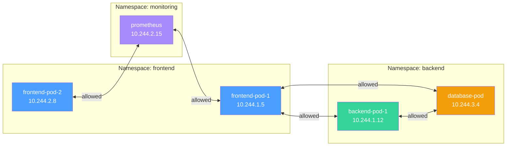
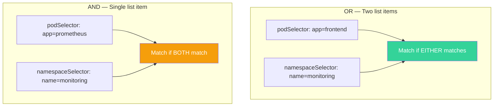
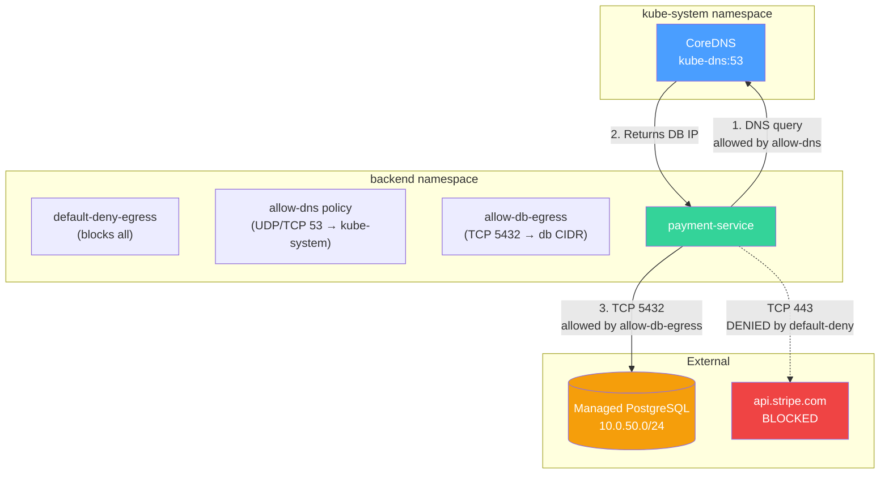

# Network Policies and CoreDNS — Segmentation and Service Discovery

**Date:** 2026-04-24 | **Updated:** 2026-04-24
**Tags:** `kubernetes` `network-policies` `coredns` `dns` `security`

## Table of Contents

- [Summary](#summary)
- [Network Policies](#network-policies)
  - [Default Behavior — The Flat Network](#default-behavior--the-flat-network)
  - [NetworkPolicy Spec Anatomy](#networkpolicy-spec-anatomy)
  - [Selectors in Rules — AND vs OR](#selectors-in-rules--and-vs-or)
  - [Default Deny Patterns](#default-deny-patterns)
  - [Practical Policies](#practical-policies)
  - [CNI Support Matrix](#cni-support-matrix)
  - [AdminNetworkPolicy and BaselineAdminNetworkPolicy](#adminnetworkpolicy-and-baselineadminnetworkpolicy)
- [CoreDNS and Cluster DNS](#coredns-and-cluster-dns)
  - [How Pods Find CoreDNS](#how-pods-find-coredns)
  - [Service FQDN Format](#service-fqdn-format)
  - [Headless Service DNS](#headless-service-dns)
  - [Pod DNS Records](#pod-dns-records)
  - [DNS Policies](#dns-policies)
  - [The ndots:5 Problem](#the-ndots5-problem)
  - [CoreDNS Corefile](#coredns-corefile)
  - [DNS Debugging](#dns-debugging)
- [Network Policy + DNS — Putting It Together](#network-policy--dns--putting-it-together)
- [Related](#related)
- [References](#references)

## Summary

By default, every Pod in a Kubernetes cluster can talk to every other Pod across any namespace — no firewall, no segmentation. **NetworkPolicy** is the built-in mechanism to restrict that traffic by selecting Pods and declaring allowed ingress/egress rules. Separately, **CoreDNS** is the cluster DNS server that lets Pods discover Services by name instead of IP. Understanding both is essential: you need DNS to find things and NetworkPolicies to control who can reach them. This doc covers the spec, the gotchas (AND vs OR selectors, the ndots:5 latency tax), and practical patterns for backend services.

## Network Policies

### Default Behavior — The Flat Network

Kubernetes mandates a **flat Pod network**: every Pod gets a unique cluster-wide IP and can reach every other Pod directly without NAT. This is baked into the [Kubernetes networking model](https://kubernetes.io/docs/concepts/cluster-administration/networking/).



**Without any NetworkPolicy, everything can reach everything.** This is the problem NetworkPolicies solve.

> **Why it matters for your Spring Boot / Node.js services:** your `payment-service` Pod can be reached by any Pod in any namespace. A compromised Pod in an unrelated namespace could probe your payment endpoints directly.

### NetworkPolicy Spec Anatomy

A NetworkPolicy is a **namespaced resource** that selects Pods in its own namespace and declares allowed traffic directions.

```yaml
apiVersion: networking.k8s.io/v1
kind: NetworkPolicy
metadata:
  name: backend-policy
  namespace: backend
spec:
  # Which Pods in THIS namespace does this policy apply to?
  podSelector:
    matchLabels:
      app: payment-service

  # Which directions does this policy cover?
  policyTypes:
    - Ingress
    - Egress

  # Who CAN send traffic TO selected Pods?
  ingress:
    - from:
        - podSelector:
            matchLabels:
              app: api-gateway
        - namespaceSelector:
            matchLabels:
              name: frontend
      ports:
        - protocol: TCP
          port: 8080

  # Where CAN selected Pods send traffic?
  egress:
    - to:
        - podSelector:
            matchLabels:
              app: postgres
      ports:
        - protocol: TCP
          port: 5432
```

Key concepts:

| Field | Meaning |
|-------|---------|
| `podSelector` | Selects which Pods in the policy's namespace are affected. Empty `{}` = all Pods in namespace |
| `policyTypes` | `Ingress`, `Egress`, or both. If you specify `Ingress`, only ingress rules apply (egress is unrestricted unless also listed) |
| `ingress[].from` | List of sources allowed to reach the selected Pods |
| `egress[].to` | List of destinations the selected Pods can reach |
| `ports` | Protocol + port constraints within a rule |

**Critical rule:** once **any** NetworkPolicy selects a Pod for a given direction (Ingress or Egress), all traffic in that direction is denied by default — only explicitly allowed traffic passes. Pods with no selecting NetworkPolicy remain fully open.

### Selectors in Rules — AND vs OR

This is the single most common NetworkPolicy gotcha. The `from` (and `to`) field is a **list of rules**, and the behavior depends on how you structure them.

**OR logic — separate list items:**

```yaml
ingress:
  - from:
      # Rule 1: any Pod with app=frontend (in policy namespace)
      - podSelector:
          matchLabels:
            app: frontend
      # Rule 2: any Pod in namespace with name=monitoring
      - namespaceSelector:
          matchLabels:
            name: monitoring
```

This means: allow from Pods matching `app=frontend` in the policy namespace **OR** from any Pod in the `monitoring` namespace. Two separate selectors in the list = OR.

**AND logic — combined in one item:**

```yaml
ingress:
  - from:
      # Single rule: both must match
      - podSelector:
          matchLabels:
            app: prometheus
        namespaceSelector:
          matchLabels:
            name: monitoring
```

This means: allow from Pods matching `app=prometheus` **AND** in a namespace matching `name=monitoring`. A single item with both selectors = AND.



> **The gotcha:** if you mean "only prometheus in the monitoring namespace" but write two separate list items, you accidentally allow **all** Pods labeled `app=prometheus` in any namespace AND **all** Pods in the monitoring namespace. This is a security hole.

### Default Deny Patterns

The foundation of any NetworkPolicy strategy is to deny everything first, then allowlist specific traffic.

**Deny all ingress in a namespace:**

```yaml
apiVersion: networking.k8s.io/v1
kind: NetworkPolicy
metadata:
  name: default-deny-ingress
  namespace: backend
spec:
  podSelector: {}       # Selects ALL Pods in namespace
  policyTypes:
    - Ingress
  # No ingress rules = nothing allowed in
```

**Deny all egress in a namespace:**

```yaml
apiVersion: networking.k8s.io/v1
kind: NetworkPolicy
metadata:
  name: default-deny-egress
  namespace: backend
spec:
  podSelector: {}
  policyTypes:
    - Egress
  # No egress rules = nothing allowed out
```

**Deny all traffic (both directions):**

```yaml
apiVersion: networking.k8s.io/v1
kind: NetworkPolicy
metadata:
  name: default-deny-all
  namespace: backend
spec:
  podSelector: {}
  policyTypes:
    - Ingress
    - Egress
```

> **Warning:** denying all egress breaks DNS resolution because Pods can no longer reach CoreDNS on port 53. Always pair a deny-all-egress with a DNS allow rule (see [Practical Policies](#practical-policies)).

### Practical Policies

#### 1. Allow Only Frontend to Backend on Port 8080

```yaml
apiVersion: networking.k8s.io/v1
kind: NetworkPolicy
metadata:
  name: allow-frontend-to-backend
  namespace: backend
spec:
  podSelector:
    matchLabels:
      app: payment-service
  policyTypes:
    - Ingress
  ingress:
    - from:
        - podSelector:
            matchLabels:
              role: api-gateway
          namespaceSelector:
            matchLabels:
              name: frontend
      ports:
        - protocol: TCP
          port: 8080
```

Note the AND selector: the source must be labeled `role=api-gateway` **and** in a namespace labeled `name=frontend`.

#### 2. Allow DNS Egress (Essential with Deny-All-Egress)

```yaml
apiVersion: networking.k8s.io/v1
kind: NetworkPolicy
metadata:
  name: allow-dns
  namespace: backend
spec:
  podSelector: {}
  policyTypes:
    - Egress
  egress:
    - to:
        - namespaceSelector:
            matchLabels:
              kubernetes.io/metadata.name: kube-system
          podSelector:
            matchLabels:
              k8s-app: kube-dns
      ports:
        - protocol: UDP
          port: 53
        - protocol: TCP
          port: 53
```

#### 3. Restrict Egress to Specific External CIDRs

Allow your backend to reach only your managed database and a third-party API:

```yaml
apiVersion: networking.k8s.io/v1
kind: NetworkPolicy
metadata:
  name: restrict-external-egress
  namespace: backend
spec:
  podSelector:
    matchLabels:
      app: payment-service
  policyTypes:
    - Egress
  egress:
    # Allow cluster DNS
    - to:
        - namespaceSelector:
            matchLabels:
              kubernetes.io/metadata.name: kube-system
      ports:
        - protocol: UDP
          port: 53
    # Allow managed RDS
    - to:
        - ipBlock:
            cidr: 10.0.50.0/24
      ports:
        - protocol: TCP
          port: 5432
    # Allow Stripe API
    - to:
        - ipBlock:
            cidr: 54.187.174.0/24
      ports:
        - protocol: TCP
          port: 443
```

#### 4. Namespace Isolation — Only Same-Namespace Traffic

```yaml
apiVersion: networking.k8s.io/v1
kind: NetworkPolicy
metadata:
  name: namespace-isolation
  namespace: backend
spec:
  podSelector: {}
  policyTypes:
    - Ingress
  ingress:
    - from:
        - podSelector: {}   # Any Pod in the same namespace
```

### CNI Support Matrix

NetworkPolicy is an API — the CNI plugin must actually **enforce** it. Not all do.

| CNI Plugin | NetworkPolicy Support | Notes |
|------------|----------------------|-------|
| **Calico** | Full | Most popular for policy enforcement. Extends with GlobalNetworkPolicy CRDs |
| **Cilium** | Full | eBPF-based. Adds L7 policies (HTTP method/path filtering) via CiliumNetworkPolicy |
| **Weave Net** | Full | Simpler setup, less feature-rich than Calico/Cilium |
| **Flannel** | **None** | Overlay-only. No policy enforcement. Common in simple clusters |
| **Canal** | Full | Flannel networking + Calico policy. Best of both |
| **Antrea** | Full | VMware-backed, supports AdminNetworkPolicy |

> **If you are on Flannel and apply a NetworkPolicy, nothing happens.** The resource is accepted by the API server (it is a valid K8s object), but no enforcement occurs. There is no error or warning. This is a silent security gap.

### AdminNetworkPolicy and BaselineAdminNetworkPolicy

Standard NetworkPolicy is **namespaced** — developers in each namespace control their own policies. This creates a gap: cluster admins cannot enforce cluster-wide security baselines that developers cannot override.

**AdminNetworkPolicy (ANP)** and **BaselineAdminNetworkPolicy (BANP)** address this. They are defined in KEP-2091 and live in the `policy.networking.k8s.io/v1alpha1` API group.

| Resource | Scope | Priority | Override by NetworkPolicy? |
|----------|-------|----------|---------------------------|
| AdminNetworkPolicy | Cluster | Explicit numeric priority (0-1000, lower = higher) | No — ANP rules are evaluated first and are authoritative |
| BaselineAdminNetworkPolicy | Cluster (singleton) | After ANP + NetworkPolicy | Yes — acts as a fallback that standard NetworkPolicy can override |
| NetworkPolicy | Namespace | N/A | N/A — evaluated between ANP and BANP |

**Evaluation order:**

```
1. AdminNetworkPolicy (highest priority, cluster admin controlled)
2. NetworkPolicy (namespace-scoped, developer controlled)
3. BaselineAdminNetworkPolicy (lowest priority, default fallback)
```

ANP actions are `Allow`, `Deny`, or `Pass` (delegate to NetworkPolicy/BANP). BANP actions are only `Allow` or `Deny`.

```yaml
apiVersion: policy.networking.k8s.io/v1alpha1
kind: AdminNetworkPolicy
metadata:
  name: cluster-deny-to-kube-system
spec:
  priority: 10
  subject:
    namespaces:
      matchExpressions:
        - key: kubernetes.io/metadata.name
          operator: NotIn
          values: ["kube-system"]
  ingress: []
  egress:
    - name: "deny-to-kube-system"
      action: Deny
      to:
        - namespaces:
            matchLabels:
              kubernetes.io/metadata.name: kube-system
```

> **Status (2026):** ANP/BANP remain at **v1alpha1**. Supported by Calico, Cilium, Antrea, and OVN-Kubernetes. The API is actively evolving — FQDN-based egress rules and tenancy support are planned before beta. Do not rely on field stability in production without pinning your CRD versions.

---

## CoreDNS and Cluster DNS

### How Pods Find CoreDNS

Every Pod's `/etc/resolv.conf` is automatically configured by the kubelet to point to the CoreDNS Service (named `kube-dns` in the `kube-system` namespace, typically at ClusterIP `10.96.0.10` or similar).

```bash
# Inside any Pod:
$ cat /etc/resolv.conf
nameserver 10.96.0.10
search backend.svc.cluster.local svc.cluster.local cluster.local
options ndots:5
```

The `search` domains are what enable short names like `payment-service` to resolve to `payment-service.backend.svc.cluster.local`.

### Service FQDN Format

Every Service gets a DNS A record following this pattern:

```
<service-name>.<namespace>.svc.cluster.local
```

Examples for your backend services:

```
payment-service.backend.svc.cluster.local    → 10.96.45.12  (ClusterIP)
user-service.backend.svc.cluster.local       → 10.96.45.20  (ClusterIP)
redis.cache.svc.cluster.local                → 10.96.50.3   (ClusterIP)
```

SRV records are also created for named ports:

```
_http._tcp.payment-service.backend.svc.cluster.local
```

From within the `backend` namespace, you can use short names thanks to search domains:

```typescript
// Node.js — these all resolve the same:
const full = 'http://payment-service.backend.svc.cluster.local:8080';
const medium = 'http://payment-service.backend:8080';  // svc.cluster.local appended
const short = 'http://payment-service:8080';            // .backend.svc.cluster.local appended (same namespace)
```

```java
// Spring Boot application.yml
spring:
  datasource:
    url: jdbc:postgresql://postgres.backend:5432/payments  // same namespace, short name works
  redis:
    host: redis.cache  // cross-namespace: need at least <service>.<namespace>
```

### Headless Service DNS

A **headless Service** (`clusterIP: None`) returns individual Pod A records instead of a single virtual IP. This is essential for StatefulSets where clients need to reach specific Pods.

```
# Headless Service "postgres-headless" in namespace "backend"
# Each StatefulSet Pod gets a stable DNS name:

postgres-0.postgres-headless.backend.svc.cluster.local → 10.244.1.15
postgres-1.postgres-headless.backend.svc.cluster.local → 10.244.2.22
postgres-2.postgres-headless.backend.svc.cluster.local → 10.244.3.8
```

A DNS query for `postgres-headless.backend.svc.cluster.local` returns **all three** A records, letting the client choose or round-robin.

### Pod DNS Records

Individual Pods also get DNS records, though these are less commonly used:

```
# Pod IP 10.244.1.15 in namespace "backend":
10-244-1-15.backend.pod.cluster.local
```

The IP dots are replaced with dashes. This is rarely used directly — Service DNS is the standard discovery mechanism.

### DNS Policies

The `dnsPolicy` field on a Pod spec controls how `/etc/resolv.conf` is generated:

| Policy | Behavior | When to Use |
|--------|----------|-------------|
| `ClusterFirst` | Queries go to CoreDNS. If CoreDNS cannot resolve, forwards to upstream (node) DNS | **Default.** Use for nearly all workloads |
| `Default` | Inherits `/etc/resolv.conf` from the node. CoreDNS is bypassed entirely | Rare. Node-level infrastructure that should not use cluster DNS |
| `ClusterFirstWithHostNet` | Same as `ClusterFirst`, but for Pods running with `hostNetwork: true` | Pods like ingress controllers that use the host network but still need cluster DNS |
| `None` | No auto-configuration. You must provide `dnsConfig` entirely | Full manual control. Useful for custom resolvers |

### The ndots:5 Problem

This is one of the most impactful performance gotchas in Kubernetes networking.

**How it works:** The `ndots:5` option in `/etc/resolv.conf` means that if a hostname has **fewer than 5 dots**, the resolver tries appending each search domain before trying the name as-is.

For an external domain like `api.stripe.com` (2 dots, which is < 5):

```
1. api.stripe.com.backend.svc.cluster.local    → NXDOMAIN
2. api.stripe.com.svc.cluster.local             → NXDOMAIN
3. api.stripe.com.cluster.local                  → NXDOMAIN
4. api.stripe.com.                               → 54.187.174.169 ✓
```

**Four DNS queries instead of one.** For every external HTTP connection your Node.js or Spring Boot app makes — to Stripe, to AWS services, to third-party APIs — you pay 3-4 wasted NXDOMAIN lookups before the real resolution.

**Fix 1: Trailing dot in code (FQDN)**

```typescript
// Node.js — the trailing dot marks it as a fully qualified name
const stripe = 'https://api.stripe.com./v1/charges';  // note the dot after .com
```

This skips the search domain expansion entirely, but requires discipline across your codebase.

**Fix 2: Override ndots in Pod spec (recommended)**

```yaml
apiVersion: v1
kind: Pod
metadata:
  name: payment-service
spec:
  dnsPolicy: ClusterFirst
  dnsConfig:
    options:
      - name: ndots
        value: "2"
  containers:
    - name: app
      image: payment-service:1.4.0
```

Setting `ndots: 2` means names with 2+ dots (like `api.stripe.com`) are tried as absolute first. Cluster-internal names like `payment-service` (0 dots) still get search domain expansion.

> **Trade-off:** with `ndots: 1`, a name like `redis.cache` (1 dot) would be tried as absolute first, failing before the search domain `redis.cache.svc.cluster.local` is tried. `ndots: 2` is a good middle ground — cross-namespace names like `redis.cache` (1 dot) still get search expansion, while external three-part domains resolve immediately.

**Fix 3: NodeLocal DNSCache**

Deploy a DNS cache as a DaemonSet on every node. NXDOMAIN responses are cached locally, so the repeated failed lookups become nearly free. This also reduces load on CoreDNS Pods.

### CoreDNS Corefile

CoreDNS is configured via a ConfigMap (`coredns` in `kube-system`) containing a **Corefile**. The Corefile uses a plugin chain:

```
.:53 {
    errors                          # Log errors to stdout
    health {                        # Health check endpoint on :8080/health
        lameduck 5s
    }
    ready                           # Readiness probe on :8181/ready

    kubernetes cluster.local in-addr.arpa ip6.arpa {   # THE key plugin
        pods insecure                # Enable Pod DNS records
        fallthrough in-addr.arpa ip6.arpa
        ttl 30                       # TTL for DNS responses
    }

    prometheus :9153                 # Metrics for Prometheus scraping
    forward . /etc/resolv.conf       # Forward non-cluster queries upstream
    cache 30                         # Cache responses for 30 seconds
    loop                             # Detect and halt forwarding loops
    reload                           # Auto-reload Corefile on ConfigMap change
    loadbalance                      # Round-robin A records
}
```

**Plugin purposes:**

| Plugin | What It Does |
|--------|-------------|
| `kubernetes` | Serves DNS for `*.cluster.local` — the core of service discovery |
| `forward` | Forwards non-cluster queries (external domains) to upstream resolvers |
| `cache` | Caches responses to reduce upstream load. Default 30s |
| `errors` | Logs errors. Essential for debugging |
| `health` / `ready` | Liveness and readiness probes for CoreDNS Pods |
| `prometheus` | Exposes metrics at `:9153` for monitoring |
| `loop` | Detects forwarding loops and halts CoreDNS (prevents infinite loops) |
| `reload` | Watches the ConfigMap for changes and reloads without restart |

**Adding a custom DNS entry:**

```
.:53 {
    # ... existing plugins ...

    hosts {
        10.0.50.100  legacy-api.internal.company.com
        fallthrough
    }
}
```

### DNS Debugging

When DNS is not working, use this pattern to debug:

```bash
# Spin up a temporary debug Pod with DNS tools
kubectl run -it --rm dns-debug \
  --image=busybox:1.36 \
  --restart=Never \
  -- sh

# Inside the Pod:
nslookup kubernetes.default
nslookup payment-service.backend.svc.cluster.local

# Check resolv.conf
cat /etc/resolv.conf

# Test external resolution
nslookup google.com
```

For more thorough debugging with `dig`:

```bash
kubectl run -it --rm dns-debug \
  --image=alpine/bind-tools:latest \
  --restart=Never \
  -- sh

# Full query trace
dig +search payment-service.backend.svc.cluster.local

# Check what CoreDNS returns for a headless service
dig +short postgres-headless.backend.svc.cluster.local

# Explicitly query CoreDNS by IP
dig @10.96.0.10 kubernetes.default.svc.cluster.local
```

**Check CoreDNS Pod health:**

```bash
# Are CoreDNS Pods running?
kubectl get pods -n kube-system -l k8s-app=kube-dns

# Check CoreDNS logs for errors
kubectl logs -n kube-system -l k8s-app=kube-dns --tail=50

# Check CoreDNS ConfigMap
kubectl get configmap coredns -n kube-system -o yaml
```

---

## Network Policy + DNS — Putting It Together

A common stumbling block: you apply a default-deny-egress policy and suddenly your Pods cannot resolve any DNS names. The fix is to always include a DNS allow rule alongside egress restrictions.



**Complete namespace lockdown pattern:**

```yaml
# 1. Deny all traffic
apiVersion: networking.k8s.io/v1
kind: NetworkPolicy
metadata:
  name: default-deny-all
  namespace: backend
spec:
  podSelector: {}
  policyTypes:
    - Ingress
    - Egress
---
# 2. Allow DNS (mandatory for any egress restriction)
apiVersion: networking.k8s.io/v1
kind: NetworkPolicy
metadata:
  name: allow-dns
  namespace: backend
spec:
  podSelector: {}
  policyTypes:
    - Egress
  egress:
    - to:
        - namespaceSelector:
            matchLabels:
              kubernetes.io/metadata.name: kube-system
      ports:
        - protocol: UDP
          port: 53
        - protocol: TCP
          port: 53
---
# 3. Allow frontend ingress on 8080
apiVersion: networking.k8s.io/v1
kind: NetworkPolicy
metadata:
  name: allow-frontend-ingress
  namespace: backend
spec:
  podSelector:
    matchLabels:
      app: payment-service
  policyTypes:
    - Ingress
  ingress:
    - from:
        - podSelector:
            matchLabels:
              role: api-gateway
          namespaceSelector:
            matchLabels:
              name: frontend
      ports:
        - protocol: TCP
          port: 8080
---
# 4. Allow egress to managed database
apiVersion: networking.k8s.io/v1
kind: NetworkPolicy
metadata:
  name: allow-db-egress
  namespace: backend
spec:
  podSelector:
    matchLabels:
      app: payment-service
  policyTypes:
    - Egress
  egress:
    - to:
        - ipBlock:
            cidr: 10.0.50.0/24
      ports:
        - protocol: TCP
          port: 5432
```

---

## Related

- [Services and Discovery](services-and-discovery.md) — ClusterIP, NodePort, LoadBalancer, headless Services, kube-proxy
- [Ingress and Gateway API](ingress-and-gateway-api.md) — external traffic routing, TLS termination, HTTPRoute
- [Zero Trust Networking](../../networking/advanced/zero-trust.md) — defense-in-depth beyond NetworkPolicy
- [DNS Internals](../../networking/application-layer/dns-internals.md) — protocol-level DNS resolution

## References

- [Network Policies — Kubernetes Docs](https://kubernetes.io/docs/concepts/services-networking/network-policies/)
- [DNS for Services and Pods — Kubernetes Docs](https://kubernetes.io/docs/concepts/services-networking/dns-pod-service/)
- [Debugging DNS Resolution — Kubernetes Docs](https://kubernetes.io/docs/tasks/administer-cluster/dns-debugging-resolution/)
- [Customizing DNS Service — Kubernetes Docs](https://kubernetes.io/docs/tasks/administer-cluster/dns-custom-nameservers/)
- [Pod DNS Config — Kubernetes Docs](https://kubernetes.io/docs/concepts/services-networking/dns-pod-service/#pod-dns-config)
- [KEP-2091: AdminNetworkPolicy — Kubernetes Enhancements](https://github.com/kubernetes/enhancements/blob/master/keps/sig-network/2091-admin-network-policy/README.md)
- [Network Policy API Reference — SIG Network](https://network-policy-api.sigs.k8s.io/reference/spec/)
- [Kubernetes DNS Resolution ndots:5 Performance Impact](https://pracucci.com/kubernetes-dns-resolution-ndots-options-and-why-it-may-affect-application-performances.html)
