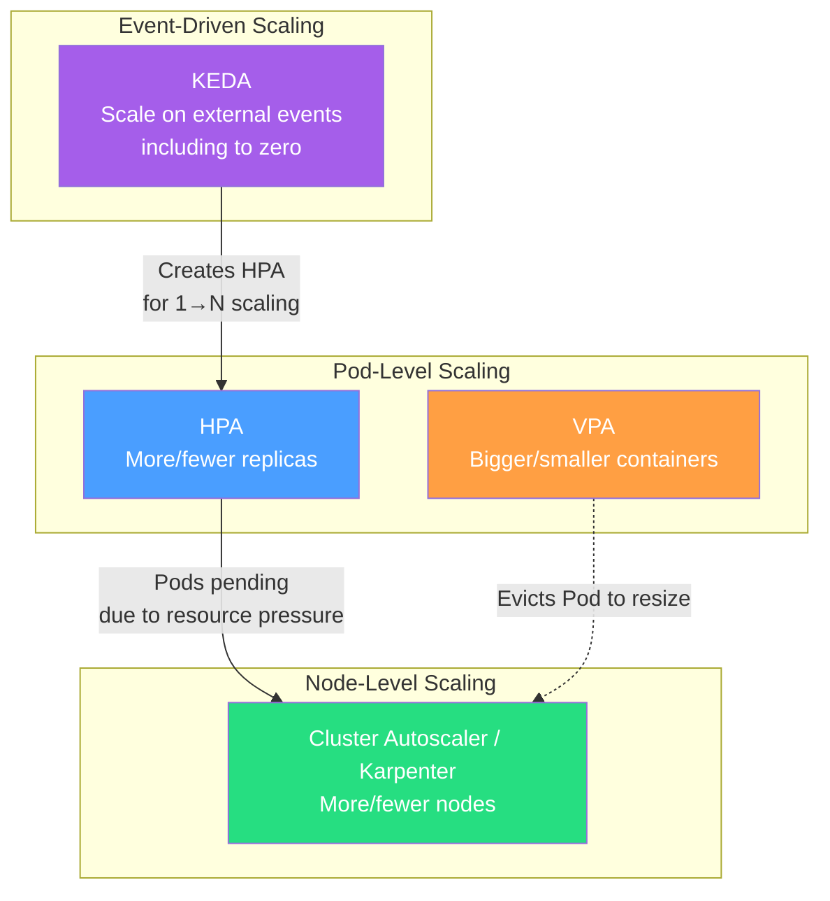
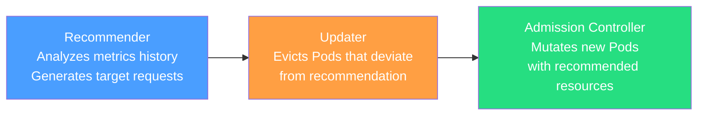
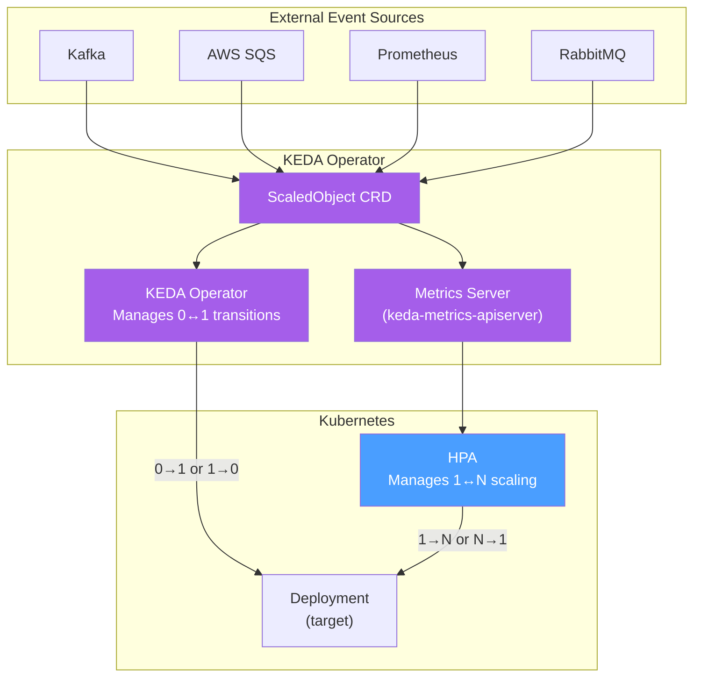

# Autoscaling in Kubernetes — HPA, VPA, Cluster Autoscaler, and KEDA

**Date:** 2026-04-24 | **Updated:** 2026-04-24
**Tags:** `kubernetes` `autoscaling` `hpa` `vpa` `keda`

## Table of Contents

- [Summary](#summary)
- [The Three Dimensions of Autoscaling](#the-three-dimensions-of-autoscaling)
- [HPA — Horizontal Pod Autoscaler v2](#hpa--horizontal-pod-autoscaler-v2)
  - [What HPA Does](#what-hpa-does)
  - [Metric Types](#metric-types)
  - [The Scaling Algorithm](#the-scaling-algorithm)
  - [Scaling Behavior and Policies](#scaling-behavior-and-policies)
  - [HPA with CPU and Custom Metrics — Full Example](#hpa-with-cpu-and-custom-metrics--full-example)
  - [Scale-to-Zero Limitation](#scale-to-zero-limitation)
- [VPA — Vertical Pod Autoscaler](#vpa--vertical-pod-autoscaler)
  - [What VPA Does](#what-vpa-does)
  - [VPA Components](#vpa-components)
  - [Update Modes](#update-modes)
  - [VPA Configuration Example](#vpa-configuration-example)
  - [VPA and HPA Conflict](#vpa-and-hpa-conflict)
  - [Best Use Cases for VPA](#best-use-cases-for-vpa)
- [Cluster Autoscaler](#cluster-autoscaler)
  - [What Cluster Autoscaler Does](#what-cluster-autoscaler-does)
  - [Scale-Up Trigger](#scale-up-trigger)
  - [Scale-Down Mechanics](#scale-down-mechanics)
  - [Pod Disruption Budget Interaction](#pod-disruption-budget-interaction)
  - [Cloud Provider Support](#cloud-provider-support)
- [Karpenter](#karpenter)
  - [What Karpenter Does Differently](#what-karpenter-does-differently)
  - [Core CRDs](#core-crds)
  - [Consolidation](#consolidation)
  - [Karpenter vs Cluster Autoscaler](#karpenter-vs-cluster-autoscaler)
- [KEDA — Kubernetes Event-Driven Autoscaler](#keda--kubernetes-event-driven-autoscaler)
  - [What KEDA Does](#what-keda-does)
  - [Architecture](#architecture)
  - [Trigger Sources](#trigger-sources)
  - [Scale-to-Zero Mechanics](#scale-to-zero-mechanics)
  - [ScaledObject Example — Kafka Consumer Lag](#scaledobject-example--kafka-consumer-lag)
  - [KEDA + HPA Handoff](#keda--hpa-handoff)
- [Comparison Table](#comparison-table)
- [Best Practices](#best-practices)
- [Related](#related)
- [References](#references)

## Summary

Kubernetes does not automatically scale anything by default. You deploy with a fixed replica count and fixed resource requests — and that is it until you add autoscaling. This document covers the four autoscaling mechanisms you need in production: **HPA** adjusts replica count horizontally based on metrics, **VPA** adjusts container resource requests vertically, **Cluster Autoscaler / Karpenter** adds and removes nodes when pod demand exceeds or falls below cluster capacity, and **KEDA** extends HPA with event-driven triggers and the ability to scale to zero.

Getting autoscaling right depends on getting resource requests right first. If your requests are wrong, autoscalers make wrong decisions. Read [Resource Requests, Limits, QoS Classes, and LimitRanges](../configuration/resource-management.md) before configuring any autoscaler.

## The Three Dimensions of Autoscaling



| Dimension | Scaler | What Changes | Trigger |
|-----------|--------|-------------|---------|
| Horizontal (Pods) | HPA | Replica count | Metrics threshold |
| Vertical (Resources) | VPA | CPU/memory requests | Historical usage |
| Infrastructure (Nodes) | Cluster Autoscaler / Karpenter | Node count | Unschedulable Pods |
| Event-driven | KEDA | Replica count (incl. 0) | External event sources |

---

## HPA — Horizontal Pod Autoscaler v2

### What HPA Does

The HPA controller runs as part of the controller manager. Every 15 seconds (configurable via `--horizontal-pod-autoscaler-sync-period`), it queries the metrics API, computes a desired replica count, and patches the target resource's `spec.replicas`.

HPA targets any resource with a scale subresource — Deployments, StatefulSets, ReplicaSets, and custom resources that implement the scale subresource.

### Metric Types

HPA v2 (`autoscaling/v2`) supports four metric source types:

| Type | Source | Example | API |
|------|--------|---------|-----|
| **Resource** | CPU / memory from kubelet | Average CPU at 70% | `metrics.k8s.io` (Metrics Server) |
| **Pods** | Custom per-pod metric | HTTP requests/sec per pod | `custom.metrics.k8s.io` (Prometheus Adapter) |
| **Object** | Metric on another K8s object | Ingress hits per second | `custom.metrics.k8s.io` |
| **External** | Metric from outside the cluster | SQS queue depth, Pub/Sub messages | `external.metrics.k8s.io` |

**For backend devs:** Resource metrics are where you start. But real production scaling often depends on Pods or External metrics — things like request latency, queue depth, or active connections. You need a metrics pipeline (Prometheus + Prometheus Adapter or similar) to use anything beyond Resource metrics.

### The Scaling Algorithm

The core formula is:

```
desiredReplicas = ceil(currentReplicas × (currentMetricValue / targetMetricValue))
```

**Example walk-through:**

```
Current replicas:  3
Current CPU avg:   210m (70% of 300m request)
Target CPU avg:    50% → 150m

desiredReplicas = ceil(3 × (210 / 150))
                = ceil(3 × 1.4)
                = ceil(4.2)
                = 5
```

When multiple metrics are specified, HPA calculates a desired replica count for each metric independently and takes the **maximum**. This ensures no metric goes underserved.

**Tolerance band:** HPA skips scaling when the ratio is within a 10% tolerance band of 1.0 (between 0.9 and 1.1). This prevents flapping on minor fluctuations.

### Scaling Behavior and Policies

HPA v2 introduced the `behavior` field, giving you fine-grained control over scale-up and scale-down velocity:

```yaml
apiVersion: autoscaling/v2
kind: HorizontalPodAutoscaler
metadata:
  name: api-server
spec:
  scaleTargetRef:
    apiVersion: apps/v1
    kind: Deployment
    name: api-server
  minReplicas: 2
  maxReplicas: 50
  behavior:
    scaleUp:
      stabilizationWindowSeconds: 0          # scale up immediately
      policies:
        - type: Percent
          value: 100                          # double the fleet at most
          periodSeconds: 60
        - type: Pods
          value: 4                            # or add 4 pods
          periodSeconds: 60
      selectPolicy: Max                       # use whichever allows MORE pods
    scaleDown:
      stabilizationWindowSeconds: 300         # wait 5 min of sustained low usage
      policies:
        - type: Percent
          value: 10                           # remove at most 10% per minute
          periodSeconds: 60
      selectPolicy: Max
  metrics:
    - type: Resource
      resource:
        name: cpu
        target:
          type: Utilization
          averageUtilization: 70
```

**Key fields explained:**

| Field | Purpose |
|-------|---------|
| `stabilizationWindowSeconds` | Look-back window — HPA picks the highest (scaleUp) or lowest (scaleDown) recommended replica count within this window. Prevents thrashing. |
| `policies[].type` | `Pods` (absolute count) or `Percent` (fraction of current replicas). |
| `policies[].periodSeconds` | How often this policy can fire. |
| `selectPolicy` | `Max` picks the policy allowing the most change. `Min` picks the most conservative. `Disabled` prevents scaling in that direction. |

**Why this matters:** The default scaleDown behavior is aggressive — without stabilization, a brief dip in traffic can scale you down right before the next spike. The 300-second stabilization window is a sensible production default.

### HPA with CPU and Custom Metrics — Full Example

This example scales a Spring Boot API based on both CPU and HTTP request rate (from Prometheus via the Prometheus Adapter):

```yaml
apiVersion: autoscaling/v2
kind: HorizontalPodAutoscaler
metadata:
  name: order-service-hpa
  namespace: production
spec:
  scaleTargetRef:
    apiVersion: apps/v1
    kind: Deployment
    name: order-service
  minReplicas: 3
  maxReplicas: 30
  behavior:
    scaleUp:
      stabilizationWindowSeconds: 0
      policies:
        - type: Percent
          value: 50
          periodSeconds: 60
    scaleDown:
      stabilizationWindowSeconds: 300
      policies:
        - type: Percent
          value: 10
          periodSeconds: 60
  metrics:
    # Metric 1: CPU utilization
    - type: Resource
      resource:
        name: cpu
        target:
          type: Utilization
          averageUtilization: 65

    # Metric 2: HTTP requests per second per pod (via Prometheus Adapter)
    - type: Pods
      pods:
        metric:
          name: http_requests_per_second
        target:
          type: AverageValue
          averageValue: "1000"          # target 1000 RPS per pod
```

**Prerequisite for custom metrics:** You need the Prometheus Adapter running and a `ConfigMap` mapping Prometheus queries to the Kubernetes custom metrics API. The adapter translates `http_requests_per_second` into a query like `rate(http_server_requests_seconds_count{namespace="production",pod=~"order-service-.*"}[2m])`.

### Scale-to-Zero Limitation

HPA has a hard floor: `minReplicas` must be at least 1. There is no native way to scale a Deployment to zero replicas with HPA alone. If you need idle workloads to scale to zero (saving compute cost during off-hours, scaling event processors to zero when queues are empty), you need KEDA — covered below.

---

## VPA — Vertical Pod Autoscaler

### What VPA Does

VPA watches container resource usage over time and recommends — or actively sets — optimal `requests` and `limits`. Where HPA asks "how many pods?", VPA asks "how big should each pod be?"

VPA is a separate project, not built into the Kubernetes control plane. You install it as a set of components in the cluster.

### VPA Components



| Component | Responsibility |
|-----------|---------------|
| **Recommender** | Reads metrics from the Metrics Server (or Prometheus), applies a statistical model over historical usage, and produces target CPU/memory requests. |
| **Updater** | Compares running Pods' resources against recommendations. If the difference exceeds threshold, it evicts Pods (respecting PDBs) so they get recreated. |
| **Admission Controller** | A mutating webhook that intercepts Pod creation and overrides `resources.requests` (and optionally `limits`) with VPA's recommendation. |

**Important:** The eviction mechanism means VPA causes Pod restarts. For stateless services this is fine. For stateful services or singletons, plan carefully.

### Update Modes

| Mode | Behavior | When to Use |
|------|----------|-------------|
| `Off` | Produces recommendations only. Does not modify Pods. | Initial right-sizing analysis. Production observation before committing. |
| `Initial` | Sets resources on Pod creation (new Pods, rescheduled Pods). Never evicts running Pods. | Workloads that should not be restarted, but benefit from right-sized resources when pods naturally restart. |
| `Auto` | Evicts and recreates Pods to apply updated resources. | Stateless workloads where restarts are acceptable. |

**Start with `Off`.** Check what VPA recommends with `kubectl describe vpa <name>`, then graduate to `Initial` or `Auto` once you trust the recommendations.

### VPA Configuration Example

```yaml
apiVersion: autoscaling.k8s.io/v1
kind: VerticalPodAutoscaler
metadata:
  name: order-service-vpa
  namespace: production
spec:
  targetRef:
    apiVersion: apps/v1
    kind: Deployment
    name: order-service
  updatePolicy:
    updateMode: "Off"                        # recommendation only
  resourcePolicy:
    containerPolicies:
      - containerName: app
        minAllowed:
          cpu: "100m"
          memory: "128Mi"
        maxAllowed:
          cpu: "4"
          memory: "8Gi"
        controlledResources: ["cpu", "memory"]
      - containerName: istio-proxy           # do not touch sidecar
        mode: "Off"
```

**Reading VPA recommendations:**

```bash
kubectl describe vpa order-service-vpa -n production
```

The output includes:

```
Recommendation:
  Container Recommendations:
    Container Name: app
    Lower Bound:    Cpu: 250m,  Memory: 512Mi
    Target:         Cpu: 500m,  Memory: 1Gi       # ← use this
    Uncapped Target: Cpu: 500m, Memory: 1Gi
    Upper Bound:    Cpu: 2,     Memory: 4Gi
```

The **Target** is VPA's best estimate for steady-state resource requests. **Lower Bound** and **Upper Bound** define the confidence interval.

### VPA and HPA Conflict

VPA and HPA should **never** compete over the same metric. The classic conflict:

1. CPU spikes → HPA wants more replicas → load distributes → CPU drops per pod
2. CPU drops → VPA recommends lower CPU requests → next Pod restart gets smaller requests
3. Smaller Pods hit CPU faster → HPA scales again → VPA recommends even less → spiraling mismatch

**Safe combinations:**

| HPA Metric | VPA Controls | Conflict? |
|------------|-------------|-----------|
| CPU | CPU | **Yes — avoid** |
| CPU | Memory only | Safe |
| Custom metric (RPS) | CPU + Memory | Safe |
| External metric (queue depth) | CPU + Memory | Safe |

**Rule of thumb:** If HPA scales on a custom or external metric, VPA can safely manage CPU and memory. If HPA scales on CPU, restrict VPA to memory only (or use VPA in `Off` mode for recommendations).

### Best Use Cases for VPA

- **Databases and caches** — single-replica or StatefulSet workloads where horizontal scaling is not an option
- **Right-sizing before production** — run VPA in `Off` mode in staging, collect recommendations, then hardcode them into manifests
- **JVM workloads** — Java heap sizing is notoriously hard to guess; VPA helps find the right memory request over time
- **Sidecars** — Envoy/Istio sidecars often get under- or over-provisioned; VPA can target specific containers

---

## Cluster Autoscaler

### What Cluster Autoscaler Does

The Cluster Autoscaler adjusts the number of **nodes** in the cluster. It is not a pod-level scaler — it is the infrastructure layer that ensures there is enough capacity for the Pod-level scalers (HPA, VPA, KEDA) to work.

```
HPA says: "I need 10 replicas"
  → Scheduler says: "I can only place 7, 3 are Pending (Insufficient cpu)"
    → Cluster Autoscaler says: "I'll add 2 nodes to the node group"
      → Scheduler places the remaining 3 Pods
```

### Scale-Up Trigger

The Cluster Autoscaler watches for Pods in `Pending` state with a `SchedulingFailed` condition where the reason is insufficient resources (`Insufficient cpu`, `Insufficient memory`, node affinity/taint mismatch, etc.).

When it finds unschedulable Pods, it simulates placement against each configured node group and picks the most cost-effective group that can fit the pending Pods. It then requests the cloud provider to add nodes to that group.

**Latency:** Scale-up is not instant. The total time from "Pod becomes Pending" to "Pod is running on a new node" includes:

1. Autoscaler detects pending Pod (~10–30 seconds, scan interval)
2. Cloud provider provisions the VM (~1–3 minutes for on-demand, longer for GPU)
3. Node bootstraps, joins the cluster, becomes Ready (~30–60 seconds)
4. Scheduler places the Pod (~seconds)

**Total: typically 2–5 minutes.** This is why you always want some headroom — do not set `maxReplicas` and node group size so tight that every spike requires new nodes.

### Scale-Down Mechanics

The Cluster Autoscaler removes nodes that are **underutilized** — meaning the sum of all Pod requests on the node falls below a configurable threshold (default: 50% of the node's allocatable capacity).

Before removing a node, the autoscaler checks:

1. **Can all Pods be rescheduled elsewhere?** If any Pod cannot be moved (no other node has capacity, node affinity constraints, local storage), the node is not removed.
2. **Are there Pods with restrictive PDBs?** If removing the node would violate a PodDisruptionBudget, the node stays.
3. **Is there a `cluster-autoscaler.kubernetes.io/safe-to-evict: "false"` annotation?** Pods with this annotation block node removal.
4. **Are there Pods not managed by a controller?** Bare Pods (no Deployment/ReplicaSet/Job/StatefulSet) block scale-down because they cannot be rescheduled.
5. **Cooldown period** — after a scale-up, the autoscaler waits before considering scale-down (default: 10 minutes). After a failed scale-down, it waits 3 minutes. After a successful scale-down, it waits the configurable `--scale-down-delay-after-delete` (default: scan interval).

### Pod Disruption Budget Interaction

Cluster Autoscaler **respects PDBs** during scale-down. If draining a node would violate a PDB (e.g., dropping below `minAvailable`), the autoscaler skips that node.

This is why PDBs are critical for stateful workloads in autoscaled clusters:

```yaml
apiVersion: policy/v1
kind: PodDisruptionBudget
metadata:
  name: order-service-pdb
  namespace: production
spec:
  minAvailable: 2                # always keep at least 2 replicas running
  selector:
    matchLabels:
      app: order-service
```

### Cloud Provider Support

| Cloud | Node Group Mechanism | Notes |
|-------|---------------------|-------|
| **AWS** | Auto Scaling Groups (ASG) | Instance types per ASG, launch templates |
| **GCP** | Managed Instance Groups (MIG) | Node auto-provisioning can create new MIGs |
| **Azure** | Virtual Machine Scale Sets (VMSS) | AKS integrates natively |
| **On-prem** | Limited | ClusterAPI support, custom implementations |

---

## Karpenter

### What Karpenter Does Differently

Karpenter is a node autoscaler that bypasses the traditional node group model entirely. Instead of scaling pre-defined groups of identical nodes, Karpenter looks at pending Pod requirements (CPU, memory, GPU, architecture, topology) and provisions the **right-sized instance** directly from the cloud provider's full catalog.

Karpenter reached **v1.0 GA in August 2024**. As of 2026, it lives under the Kubernetes SIG Autoscaling umbrella with two repositories:

- `kubernetes-sigs/karpenter` — vendor-neutral core
- `aws/karpenter-provider-aws` — AWS-specific implementation (most mature)
- Azure support is available via **NAP (Node Autoprovisioning)** in AKS
- Oracle Cloud has a **GA Karpenter provider** for OKE
- GCP support is available through GKE's own node auto-provisioning (uses Karpenter concepts but not the Karpenter codebase directly)

### Core CRDs

```yaml
# NodePool — defines constraints and limits for provisioned nodes
apiVersion: karpenter.sh/v1
kind: NodePool
metadata:
  name: general-purpose
spec:
  template:
    spec:
      requirements:
        - key: kubernetes.io/arch
          operator: In
          values: ["amd64"]
        - key: karpenter.sh/capacity-type
          operator: In
          values: ["on-demand", "spot"]
        - key: karpenter.k8s.aws/instance-category
          operator: In
          values: ["c", "m", "r"]             # compute, general, memory
        - key: karpenter.k8s.aws/instance-generation
          operator: Gt
          values: ["5"]                        # 6th gen+ only
      nodeClassRef:
        group: karpenter.k8s.aws
        kind: EC2NodeClass
        name: default
  limits:
    cpu: 1000                                  # cluster-wide CPU cap
    memory: 4000Gi
  disruption:
    consolidationPolicy: WhenEmptyOrUnderutilized
    consolidateAfter: 30s
---
# EC2NodeClass — AWS-specific instance configuration
apiVersion: karpenter.k8s.aws/v1
kind: EC2NodeClass
metadata:
  name: default
spec:
  amiSelectorTerms:
    - alias: al2023@latest                     # Amazon Linux 2023
  subnetSelectorTerms:
    - tags:
        karpenter.sh/discovery: my-cluster
  securityGroupSelectorTerms:
    - tags:
        karpenter.sh/discovery: my-cluster
  role: KarpenterNodeRole-my-cluster
```

### Consolidation

Karpenter's killer feature for cost savings. Consolidation continuously evaluates whether the current node fleet can be **compacted**:

1. **Empty node removal** — nodes with no running Pods (after accounting for DaemonSets) are terminated.
2. **Replace** — if Pods on an underutilized node can fit on other existing nodes, Karpenter cordons, drains, and terminates it.
3. **Right-size replace** — if a smaller (cheaper) instance type can handle the remaining workload, Karpenter provisions the smaller node and migrates Pods.

Consolidation respects PDBs, topology spread constraints, and do-not-disrupt annotations.

### Karpenter vs Cluster Autoscaler

| Aspect | Cluster Autoscaler | Karpenter |
|--------|-------------------|-----------|
| **Provisioning model** | Scale node groups (ASGs/MIGs/VMSS) | Provision individual instances from full catalog |
| **Instance selection** | Pre-defined per node group | Dynamic — picks best fit per pending Pod batch |
| **Scale-up speed** | ~2–5 min (depends on ASG) | ~60–90 sec (bypasses ASG, calls EC2 directly) |
| **Consolidation** | Removes underutilized nodes | Actively replaces nodes with cheaper/smaller ones |
| **Spot handling** | Per-ASG spot configuration | Built-in spot interruption handling, automatic fallback |
| **Multi-cloud** | AWS, GCP, Azure, on-prem | AWS (GA), Azure (via NAP), OCI (GA), GCP (indirect) |
| **CRD-based** | No (uses cloud provider flags) | Yes — `NodePool`, `EC2NodeClass` |
| **When to choose** | Multi-cloud consistency, on-prem, simple setups | AWS-primary, cost optimization, fast scaling |

**For most AWS/EKS teams in 2026, Karpenter is the default choice.** For multi-cloud or on-prem, Cluster Autoscaler remains more practical due to its broader provider support.

---

## KEDA — Kubernetes Event-Driven Autoscaler

### What KEDA Does

KEDA is a lightweight operator that extends Kubernetes with event-driven autoscaling. It connects to external event sources (message queues, databases, HTTP endpoints, cloud services) and scales workloads based on the volume of unprocessed events — including scaling **to and from zero replicas**.

KEDA is a CNCF graduated project (as of 2024) and integrates directly with the HPA controller rather than replacing it.

### Architecture



**How the pieces connect:**

1. You create a `ScaledObject` referencing a Deployment and one or more triggers (event sources).
2. KEDA's operator watches the `ScaledObject` and creates a corresponding HPA.
3. KEDA's metrics server exposes the external metric values to the HPA via the `external.metrics.k8s.io` API.
4. The HPA handles scaling from 1 to N replicas using its normal algorithm.
5. The KEDA operator itself handles the **0 ↔ 1** transition, because HPA cannot scale below `minReplicas: 1`.

### Trigger Sources

KEDA supports 60+ scalers. The most relevant for backend developers:

| Trigger | Metric | Typical Use Case |
|---------|--------|-----------------|
| **Kafka** | Consumer group lag | Scale consumers to process backlog |
| **AWS SQS** | Approximate message count | Scale workers for queued jobs |
| **RabbitMQ** | Queue length / message rate | Scale message consumers |
| **Prometheus** | Any PromQL query result | Scale on custom application metrics |
| **PostgreSQL** | Query result (e.g., pending job count) | Scale based on database job queue |
| **Cron** | Time schedule | Scale up before expected traffic peaks |
| **HTTP** | Request rate (via KEDA HTTP Add-on) | Scale HTTP services including to zero |
| **AWS CloudWatch** | Any CloudWatch metric | Scale based on cloud-native metrics |

### Scale-to-Zero Mechanics

This is KEDA's primary advantage over plain HPA. The mechanism has two distinct phases:

**Activation phase (KEDA operator — controls 0 ↔ 1):**

- KEDA continuously polls the external scaler at its configured `pollingInterval` (default: 30 seconds).
- Each scaler has an **activation threshold** — when the metric crosses this threshold, the scaler reports as "active."
- When at least one trigger is active and the current replica count is 0, KEDA scales the Deployment to `minReplicaCount` (default: 1, but can be set to any value > 0 via the `ScaledObject`).
- When **all** triggers are inactive and the cooldown period (`cooldownPeriod`, default: 300 seconds / 5 minutes) has elapsed since the last active trigger, KEDA scales to 0.

**Scaling phase (HPA — controls 1 ↔ N):**

- Once the workload is at 1+ replicas, KEDA's metrics server feeds metric values to the HPA.
- The HPA uses its standard algorithm to scale between `minReplicaCount` and `maxReplicaCount`.
- KEDA does not interfere with the HPA during this phase.

**Cold start caveat:** Scaling from 0 to 1 means the first event after an idle period faces container startup latency (image pull, JVM warm-up for Spring Boot, Node.js initialization). For latency-sensitive services, consider `minReplicaCount: 1` and using KEDA only for the 1→N scaling, or use KEDA's HTTP add-on which includes a proxy that holds requests during scale-from-zero.

### ScaledObject Example — Kafka Consumer Lag

```yaml
apiVersion: keda.sh/v1alpha1
kind: ScaledObject
metadata:
  name: order-event-consumer
  namespace: production
spec:
  scaleTargetRef:
    name: order-event-consumer              # Deployment name
  pollingInterval: 15                        # check every 15 seconds
  cooldownPeriod: 300                        # wait 5 min before scaling to 0
  minReplicaCount: 0                         # enable scale-to-zero
  maxReplicaCount: 20
  advanced:
    horizontalPodAutoscalerConfig:
      behavior:                              # same behavior config as HPA v2
        scaleDown:
          stabilizationWindowSeconds: 120
          policies:
            - type: Percent
              value: 25
              periodSeconds: 60
  triggers:
    - type: kafka
      metadata:
        bootstrapServers: kafka.production.svc.cluster.local:9092
        consumerGroup: order-event-consumer
        topic: order-events
        lagThreshold: "10"                   # target 10 messages lag per partition
        activationLagThreshold: "1"          # activate (0→1) when lag > 0
        offsetResetPolicy: latest
      authenticationRef:
        name: kafka-credentials              # TriggerAuthentication resource
```

**What happens at each stage:**

1. **Queue empty, 0 replicas:** KEDA polls Kafka every 15s. Consumer lag is 0. No scaling.
2. **Messages arrive, lag = 5:** `activationLagThreshold` (1) exceeded. KEDA scales from 0 → 1.
3. **Lag grows to 50 across 5 partitions:** HPA takes over. `desiredReplicas = ceil(current × (50 / (5 × 10)))` — scales up.
4. **Consumers catch up, lag = 0:** HPA scales to 1. KEDA's cooldown (300s) starts. After 5 min of zero lag, KEDA scales to 0.

### KEDA + HPA Handoff

The relationship between KEDA and HPA is cooperative, not competitive:

```
Queue empty    →  KEDA keeps replicas at 0
First message  →  KEDA scales 0 → 1
More load      →  KEDA-created HPA scales 1 → N
Load drops     →  HPA scales N → 1
Idle period    →  KEDA scales 1 → 0 (after cooldownPeriod)
```

**Do not create your own HPA alongside a KEDA ScaledObject for the same Deployment.** KEDA creates and manages the HPA. Having two HPAs targeting the same Deployment causes conflicts.

---

## Comparison Table

| Feature | HPA | VPA | Cluster Autoscaler | Karpenter | KEDA |
|---------|-----|-----|-------------------|-----------|------|
| **Scales what** | Pod replicas | Container resources | Nodes | Nodes | Pod replicas |
| **Direction** | Horizontal | Vertical | Infrastructure | Infrastructure | Horizontal |
| **Scale-to-zero** | No (min 1) | N/A | Yes (remove nodes) | Yes (remove nodes) | Yes |
| **Built-in** | Yes | No (add-on) | No (add-on) | No (add-on) | No (add-on) |
| **Metric source** | Metrics API | Metrics API | Pod scheduling state | Pod scheduling state | 60+ external sources |
| **Latency** | ~15 sec | Minutes (eviction) | 2–5 min | 1–2 min | 15–30 sec |
| **Stateful-friendly** | Limited | Yes | Respects PDBs | Respects PDBs | Limited |
| **Best for** | Stateless services | Right-sizing | Capacity | Cost-optimized capacity | Event-driven workloads |

---

## Best Practices

### 1. Get Resource Requests Right First

Autoscaling depends entirely on accurate resource requests. Wrong requests lead to wrong scaling decisions:

- **Requests too low:** Pods seem overloaded → HPA scales aggressively → Cluster Autoscaler adds unnecessary nodes → cost bloat
- **Requests too high:** Pods seem underutilized → HPA never scales → Cluster Autoscaler removes nodes → capacity crunch under load

Use VPA in `Off` mode for 1–2 weeks in staging to get realistic recommendations before setting production requests.

### 2. Start with HPA for Stateless Services

HPA on CPU utilization is the simplest starting point. Refine from there:

1. Deploy with HPA on CPU at 65–70% target
2. Observe whether CPU correlates with actual load — if not, add a custom metric (RPS, active connections)
3. Tune `behavior` to match your traffic pattern (gradual scale-down, fast scale-up)

### 3. Use KEDA for Event-Driven and Queue-Based Workloads

If your service processes messages from Kafka, SQS, RabbitMQ, or any queue:

- KEDA is the right tool — it scales on actual queue depth, not proxy metrics like CPU
- Scale-to-zero saves significant cost for bursty workloads
- Set `activationLagThreshold` to 0 or 1 for quick activation

### 4. Use VPA in Recommendation Mode Before Production

Run VPA in `Off` mode across your staging environment. After a week of representative traffic, read the recommendations and update your manifests. This is lower risk than Auto mode and gives you auditable, version-controlled resource declarations.

### 5. Pair Pod Scalers with Node Scalers

HPA/KEDA without Cluster Autoscaler or Karpenter leads to Pending Pods during scale-up bursts. Always run a node-level scaler alongside your pod-level scaler.

### 6. Set PDBs for Everything That Matters

Both Cluster Autoscaler and Karpenter respect PDBs. Without PDBs, node scale-down can kill all replicas of a service simultaneously:

```yaml
apiVersion: policy/v1
kind: PodDisruptionBudget
metadata:
  name: api-pdb
spec:
  maxUnavailable: 1                          # or minAvailable: N-1
  selector:
    matchLabels:
      app: api-server
```

### 7. Monitor Your Autoscalers

Autoscalers are controllers — they can fail silently. Monitor:

- `kube_hpa_status_current_replicas` vs `kube_hpa_spec_max_replicas` (hitting ceiling = underscaled)
- `kube_hpa_status_condition{condition="ScalingLimited"}` (HPA wants to scale but cannot)
- Cluster Autoscaler logs for `scale_up` and `scale_down` events
- KEDA operator logs for scaler errors (connection failures to Kafka, SQS, etc.)

---

## Related

- [Kubernetes Monitoring and Logging — Prometheus, Grafana, and Log Aggregation](monitoring-and-logging.md) — metrics pipeline that feeds HPA custom metrics
- [Resource Requests, Limits, QoS Classes, and LimitRanges](../configuration/resource-management.md) — the foundation autoscaling depends on
- [Pods, ReplicaSets, and Deployments](../workloads/pods-and-deployments.md) — the workloads HPA and KEDA scale
- [Multi-Tenancy, Cost Optimization, and Cluster Strategy](../production/multi-tenancy-and-cost.md) — cost context for Karpenter and scale-to-zero
- [Spring Boot on Kubernetes](../../java/configurations/kubernetes-spring-boot.md) — JVM-specific autoscaling considerations
- [Backup, Disaster Recovery, and Cluster Lifecycle](../production/disaster-recovery.md) — PDB patterns referenced by autoscalers

## References

1. [Kubernetes HPA v2 Documentation](https://kubernetes.io/docs/tasks/run-application/horizontal-pod-autoscale/) — official HPA walkthrough and algorithm specification
2. [Kubernetes VPA GitHub Repository](https://github.com/kubernetes/autoscaler/tree/master/vertical-pod-autoscaler) — installation, configuration, and FAQ
3. [Cluster Autoscaler FAQ](https://github.com/kubernetes/autoscaler/blob/master/cluster-autoscaler/FAQ.md) — comprehensive FAQ covering all edge cases
4. [Karpenter Documentation](https://karpenter.sh/docs/) — NodePool, EC2NodeClass, consolidation, and migration guides
5. [KEDA Documentation](https://keda.sh/docs/2.19/) — ScaledObject spec, scaler catalog, and architecture
6. [KEDA Scale to Zero on GKE](https://cloud.google.com/blog/products/containers-kubernetes/scale-to-zero-on-gke-with-keda) — Google Cloud walkthrough of KEDA scale-to-zero
7. [Karpenter vs Cluster Autoscaler Comparison](https://tasrieit.com/blog/karpenter-vs-cluster-autoscaler-eks-comparison-2026) — real-world migration experience across 50+ clusters
8. [Prometheus Adapter for Kubernetes Metrics APIs](https://github.com/kubernetes-sigs/prometheus-adapter) — custom metrics pipeline for HPA
