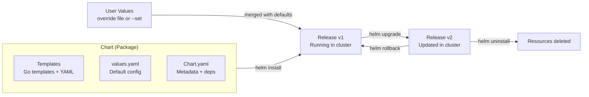
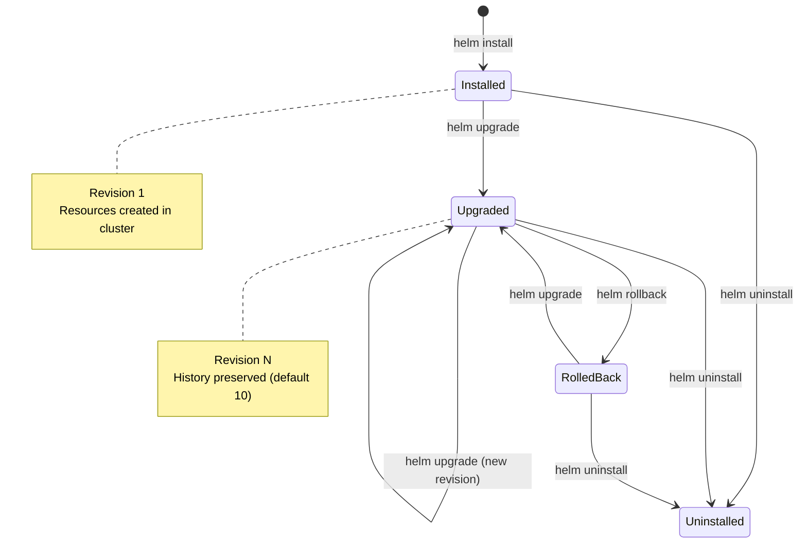
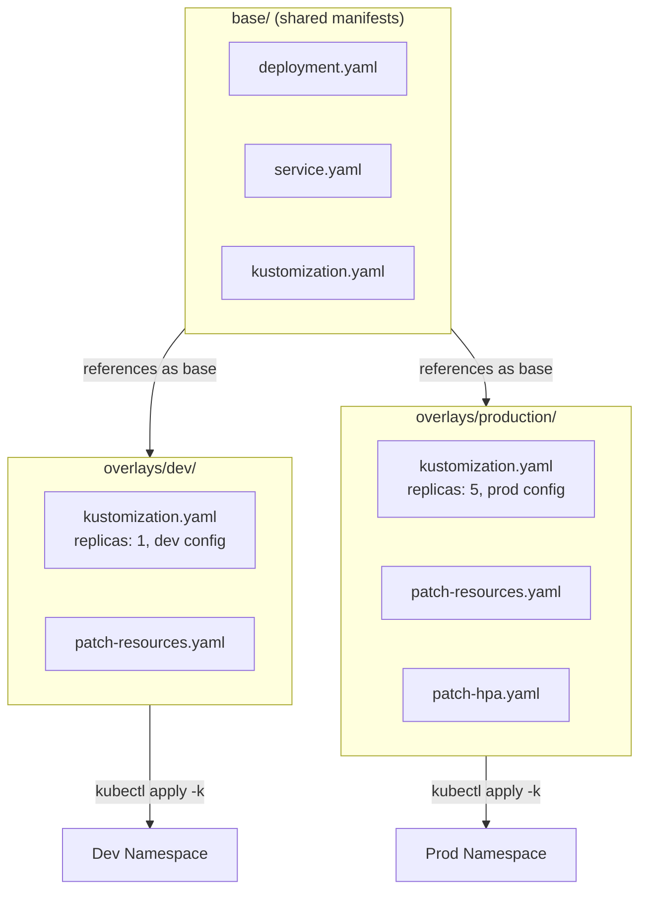

# Helm and Kustomize — Packaging and Templating Kubernetes Manifests

**Date:** 2026-04-24 | **Updated:** 2026-04-24
**Tags:** `kubernetes` `helm` `kustomize` `packaging` `gitops`

## Table of Contents

- [Summary](#summary)
- [Helm — The Package Manager for Kubernetes](#helm--the-package-manager-for-kubernetes)
  - [What Helm Solves](#what-helm-solves)
  - [Core Concepts](#core-concepts)
  - [Chart Structure](#chart-structure)
  - [Template Language](#template-language)
  - [Named Templates and Helpers](#named-templates-and-helpers)
  - [Release Lifecycle](#release-lifecycle)
  - [Helm Hooks](#helm-hooks)
  - [Chart Dependencies](#chart-dependencies)
  - [OCI Registries](#oci-registries)
  - [Debugging with helm template](#debugging-with-helm-template)
  - [helm-diff Plugin](#helm-diff-plugin)
  - [Writing Your Own Chart](#writing-your-own-chart)
- [Kustomize — Template-Free Overlays](#kustomize--template-free-overlays)
  - [What Kustomize Solves](#what-kustomize-solves)
  - [Core Concepts: Bases and Overlays](#core-concepts-bases-and-overlays)
  - [kustomization.yaml in Detail](#kustomizationyaml-in-detail)
  - [Patches: Strategic Merge vs JSON Patch](#patches-strategic-merge-vs-json-patch)
  - [Generators: ConfigMaps and Secrets](#generators-configmaps-and-secrets)
  - [Components: Reusable Cross-Cutting Features](#components-reusable-cross-cutting-features)
  - [Replacements](#replacements)
- [Helm vs Kustomize — Decision Guide](#helm-vs-kustomize--decision-guide)
  - [Comparison Table](#comparison-table)
  - [Using Both Together](#using-both-together)
- [Practical Examples for Backend Devs](#practical-examples-for-backend-devs)
  - [Helm: Spring Boot Microservice Chart](#helm-spring-boot-microservice-chart)
  - [Kustomize: Node.js API with Overlays](#kustomize-nodejs-api-with-overlays)
- [Related](#related)
- [References](#references)

## Summary

Raw Kubernetes YAML does not scale. Once you have multiple environments, dozens of services, and shared infrastructure charts, you need a strategy for templating, packaging, and managing manifests. **Helm** is the package manager approach — Go templates, chart versioning, release management. **Kustomize** is the overlay approach — plain YAML with patch-based composition, built into kubectl. Most teams end up using both: Helm for third-party charts (Prometheus, cert-manager, ingress controllers) and Kustomize for in-house application manifests. This document covers both tools in depth and helps you decide when to use each.

## Helm — The Package Manager for Kubernetes

### What Helm Solves

Without Helm, deploying a complex application means managing dozens of loosely connected YAML files with no versioning, no dependency management, and no parameterization beyond `sed` or `envsubst`. Helm packages all of these into a single distributable unit — a **chart** — that can be versioned, shared, configured, and rolled back.

Think of Helm as the npm/Maven of the Kubernetes manifest world:

| Problem | Helm Solution |
|---------|---------------|
| Dozens of YAML files per app | Packaged into a single chart |
| Hardcoded values across envs | Parameterized via `values.yaml` |
| No versioning | Semantic versioning in `Chart.yaml` |
| No dependency management | `dependencies` in `Chart.yaml` |
| Manual rollback | `helm rollback <release> <revision>` |
| No sharing/distribution | Push to OCI registries or chart repos |

### Core Concepts



Four core concepts:

1. **Chart** — A package of Kubernetes manifest templates plus metadata. Analogous to an npm package or a Maven artifact.
2. **Templates** — YAML files with Go template directives (`{{ }}`) that get rendered using values.
3. **Values** — Configuration parameters. Defaults live in `values.yaml`; users override per-environment or per-release.
4. **Release** — A specific deployment of a chart into a cluster. Each `helm install` creates a release; each `helm upgrade` creates a new revision of that release.

### Chart Structure

```
my-spring-boot-chart/
├── Chart.yaml              # Chart metadata, version, dependencies
├── Chart.lock              # Locked dependency versions
├── values.yaml             # Default configuration values
├── values.schema.json      # Optional: JSON Schema for values validation
├── templates/
│   ├── _helpers.tpl        # Named template definitions (partials)
│   ├── deployment.yaml     # Deployment manifest template
│   ├── service.yaml        # Service manifest template
│   ├── ingress.yaml        # Ingress (conditionally rendered)
│   ├── configmap.yaml      # ConfigMap from values
│   ├── hpa.yaml            # HPA (conditionally rendered)
│   ├── serviceaccount.yaml # ServiceAccount
│   ├── NOTES.txt           # Post-install usage instructions
│   └── tests/
│       └── test-connection.yaml  # Helm test pod
├── charts/                 # Downloaded dependency charts
└── .helmignore             # Files to exclude from packaging
```

**Chart.yaml** — the manifest:

```yaml
apiVersion: v2
name: my-spring-boot-app
description: A Helm chart for Spring Boot microservices
type: application          # "application" or "library"
version: 1.2.0             # Chart version (SemVer)
appVersion: "3.2.1"        # Version of the app being deployed
dependencies:
  - name: postgresql
    version: "15.x"
    repository: "oci://registry-1.docker.io/bitnamicharts"
    condition: postgresql.enabled
```

### Template Language

Helm templates use Go's `text/template` package with Sprig function library additions. The key objects available in every template:

| Object | Contents |
|--------|----------|
| `.Values` | Merged values (defaults + overrides) |
| `.Release` | Release metadata (name, namespace, revision) |
| `.Chart` | Contents of `Chart.yaml` |
| `.Capabilities` | Cluster capabilities (API versions, K8s version) |
| `.Template` | Current template file info |

Basic value injection:

```yaml
# templates/deployment.yaml
apiVersion: apps/v1
kind: Deployment
metadata:
  name: {{ include "my-app.fullname" . }}
  labels:
    {{- include "my-app.labels" . | nindent 4 }}
spec:
  replicas: {{ .Values.replicaCount }}
  selector:
    matchLabels:
      {{- include "my-app.selectorLabels" . | nindent 6 }}
  template:
    metadata:
      labels:
        {{- include "my-app.selectorLabels" . | nindent 8 }}
    spec:
      containers:
        - name: {{ .Chart.Name }}
          image: "{{ .Values.image.repository }}:{{ .Values.image.tag | default .Chart.AppVersion }}"
          ports:
            - containerPort: {{ .Values.service.port }}
          {{- if .Values.resources }}
          resources:
            {{- toYaml .Values.resources | nindent 12 }}
          {{- end }}
          {{- if .Values.env }}
          env:
            {{- range $key, $value := .Values.env }}
            - name: {{ $key }}
              value: {{ $value | quote }}
            {{- end }}
          {{- end }}
```

Corresponding `values.yaml`:

```yaml
replicaCount: 2

image:
  repository: ghcr.io/myorg/spring-boot-api
  tag: ""                   # Defaults to appVersion from Chart.yaml
  pullPolicy: IfNotPresent

service:
  type: ClusterIP
  port: 8080

resources:
  requests:
    cpu: 250m
    memory: 512Mi
  limits:
    memory: 1Gi

env:
  SPRING_PROFILES_ACTIVE: "production"
  JAVA_OPTS: "-XX:MaxRAMPercentage=75.0"

postgresql:
  enabled: true
```

**Key template constructs:**

```yaml
# Conditionals
{{- if .Values.ingress.enabled }}
  # ... render ingress resource
{{- end }}

# Loops
{{- range .Values.extraVolumes }}
  - name: {{ .name }}
    emptyDir: {}
{{- end }}

# Default values
{{ .Values.image.tag | default .Chart.AppVersion }}

# Required values (fail if missing)
{{ required "image.repository is required" .Values.image.repository }}

# Whitespace control: {{- trims left, -}} trims right
```

### Named Templates and Helpers

`_helpers.tpl` defines reusable template fragments (the underscore prefix tells Helm not to render this file as a manifest):

```yaml
# templates/_helpers.tpl

{{/*
Expand the name of the chart.
*/}}
{{- define "my-app.name" -}}
{{- default .Chart.Name .Values.nameOverride | trunc 63 | trimSuffix "-" }}
{{- end }}

{{/*
Create a default fully qualified app name.
*/}}
{{- define "my-app.fullname" -}}
{{- if .Values.fullnameOverride }}
{{- .Values.fullnameOverride | trunc 63 | trimSuffix "-" }}
{{- else }}
{{- $name := default .Chart.Name .Values.nameOverride }}
{{- if contains $name .Release.Name }}
{{- .Release.Name | trunc 63 | trimSuffix "-" }}
{{- else }}
{{- printf "%s-%s" .Release.Name $name | trunc 63 | trimSuffix "-" }}
{{- end }}
{{- end }}
{{- end }}

{{/*
Common labels
*/}}
{{- define "my-app.labels" -}}
helm.sh/chart: {{ include "my-app.chart" . }}
{{ include "my-app.selectorLabels" . }}
app.kubernetes.io/managed-by: {{ .Release.Service }}
{{- end }}

{{/*
Selector labels
*/}}
{{- define "my-app.selectorLabels" -}}
app.kubernetes.io/name: {{ include "my-app.name" . }}
app.kubernetes.io/instance: {{ .Release.Name }}
{{- end }}
```

Use `include` (not `template`) to call named templates — `include` allows piping the output through functions like `nindent`:

```yaml
labels:
  {{- include "my-app.labels" . | nindent 4 }}
```

### Release Lifecycle



**Essential commands:**

```bash
# Install a release
helm install my-api ./my-spring-boot-chart \
  -n production \
  -f values-production.yaml

# Upgrade (or install if not exists)
helm upgrade --install my-api ./my-spring-boot-chart \
  -n production \
  -f values-production.yaml \
  --set image.tag=v2.1.0

# Check release status
helm status my-api -n production

# View release history
helm history my-api -n production
# REVISION  STATUS      DESCRIPTION
# 1         superseded  Install complete
# 2         superseded  Upgrade complete
# 3         deployed    Upgrade complete

# Rollback to revision 2
helm rollback my-api 2 -n production

# Uninstall (removes all release resources)
helm uninstall my-api -n production

# List all releases
helm list -n production
helm list --all-namespaces
```

### Helm Hooks

Hooks run Jobs or other resources at specific points in the release lifecycle. Common use case: run database migrations before an upgrade completes.

```yaml
# templates/db-migrate-job.yaml
apiVersion: batch/v1
kind: Job
metadata:
  name: {{ include "my-app.fullname" . }}-migrate
  annotations:
    "helm.sh/hook": pre-upgrade,pre-install
    "helm.sh/hook-weight": "-5"          # Lower runs first
    "helm.sh/hook-delete-policy": before-hook-creation
spec:
  template:
    spec:
      restartPolicy: Never
      containers:
        - name: migrate
          image: "{{ .Values.image.repository }}:{{ .Values.image.tag }}"
          command: ["java", "-jar", "app.jar", "--spring.flyway.enabled=true"]
          env:
            - name: SPRING_DATASOURCE_URL
              valueFrom:
                secretKeyRef:
                  name: {{ include "my-app.fullname" . }}-db
                  key: jdbc-url
  backoffLimit: 3
```

**Hook types:**

| Hook | When it runs |
|------|-------------|
| `pre-install` | After templates render, before resources create |
| `post-install` | After all resources are created |
| `pre-upgrade` | After templates render, before resources update |
| `post-upgrade` | After upgrade completes |
| `pre-rollback` | Before rollback |
| `post-rollback` | After rollback |
| `pre-delete` | Before release deletion |
| `post-delete` | After release deletion |
| `test` | When `helm test` is invoked |

**Hook delete policies** — what happens to the hook resource after it runs:
- `before-hook-creation` — delete old hook before creating new one (most common)
- `hook-succeeded` — delete after successful execution
- `hook-failed` — delete if hook fails

### Chart Dependencies

Charts can depend on other charts. Dependencies are declared in `Chart.yaml` and downloaded into the `charts/` directory:

```yaml
# Chart.yaml
dependencies:
  - name: postgresql
    version: "15.5.x"
    repository: "oci://registry-1.docker.io/bitnamicharts"
    condition: postgresql.enabled    # Only include if this value is true
  - name: redis
    version: "19.x"
    repository: "oci://registry-1.docker.io/bitnamicharts"
    condition: redis.enabled
  - name: common
    version: "2.x"
    repository: "oci://registry-1.docker.io/bitnamicharts"
    tags:
      - bitnami-common             # Group toggle via tags
```

```bash
# Download dependencies into charts/
helm dependency update ./my-spring-boot-chart

# List current dependencies
helm dependency list ./my-spring-boot-chart
```

Override dependency values by nesting under the dependency name in your values:

```yaml
# values.yaml
postgresql:
  enabled: true
  auth:
    postgresPassword: "changeme"
    database: "myapp"
  primary:
    persistence:
      size: 10Gi
```

### OCI Registries

Since **Helm 3.8** (stable, no longer experimental), charts can be stored as OCI artifacts in any OCI-compliant container registry. As of 2025-2026, OCI is the recommended distribution method — legacy Helm chart repositories are being deprecated by major providers (Azure ACR retired `az acr helm` in September 2025). **Helm 4** (released at KubeCon 2025) continues full OCI support.

```bash
# Login to an OCI registry (uses Docker credentials)
helm registry login ghcr.io -u $GITHUB_USER

# Package the chart
helm package ./my-spring-boot-chart
# Creates my-spring-boot-app-1.2.0.tgz

# Push to OCI registry
helm push my-spring-boot-app-1.2.0.tgz oci://ghcr.io/myorg/charts

# Pull a chart from OCI
helm pull oci://ghcr.io/myorg/charts/my-spring-boot-app --version 1.2.0

# Install directly from OCI
helm install my-api oci://ghcr.io/myorg/charts/my-spring-boot-app \
  --version 1.2.0 \
  -f values-production.yaml

# Show chart info from OCI
helm show chart oci://ghcr.io/myorg/charts/my-spring-boot-app --version 1.2.0
```

Supported OCI registries: Docker Hub, GitHub Container Registry (GHCR), Amazon ECR, Google Artifact Registry, Azure Container Registry, Harbor, Quay.io.

### Debugging with helm template

`helm template` renders templates locally without contacting the cluster — invaluable for debugging:

```bash
# Render all templates to stdout
helm template my-api ./my-spring-boot-chart -f values-production.yaml

# Render a single template
helm template my-api ./my-spring-boot-chart -s templates/deployment.yaml

# Show what would change on upgrade (dry run against cluster)
helm upgrade my-api ./my-spring-boot-chart \
  -f values-production.yaml \
  --dry-run --debug

# Validate rendered output against cluster API
helm template my-api ./my-spring-boot-chart | kubectl apply --dry-run=server -f -

# Lint the chart for common issues
helm lint ./my-spring-boot-chart -f values-production.yaml
```

### helm-diff Plugin

The `helm-diff` plugin shows a color-coded diff of what `helm upgrade` would change — critical for safe deployments:

```bash
# Install the plugin
helm plugin install https://github.com/databus23/helm-diff

# Preview changes before upgrade
helm diff upgrade my-api ./my-spring-boot-chart \
  -f values-production.yaml \
  --set image.tag=v2.1.0

# Output shows added/removed/changed lines in manifests
# Similar to kubectl diff but for Helm releases
```

This is especially useful in CI/CD pipelines — run `helm diff` as a PR check to review infrastructure changes before merging.

### Writing Your Own Chart

Start with the scaffold and customize:

```bash
# Generate chart skeleton
helm create my-node-api
# Creates: Chart.yaml, values.yaml, templates/*, .helmignore

# What you typically customize:
# 1. Chart.yaml — name, version, dependencies
# 2. values.yaml — all configurable parameters
# 3. templates/deployment.yaml — container spec, probes, volumes
# 4. templates/_helpers.tpl — naming conventions, labels
# 5. templates/ingress.yaml — routing rules
# 6. Delete what you don't need (e.g., serviceaccount.yaml)
```

**Best practices:**

- Always include `resources` in values (never deploy without resource requests)
- Use `{{ required }}` for values that must not be empty
- Add `values.schema.json` for CI-time validation of values
- Keep templates readable — extract complexity into `_helpers.tpl`
- Use `NOTES.txt` to print post-install instructions
- Write Helm tests in `templates/tests/`
- Pin dependency versions in `Chart.lock`

---

## Kustomize — Template-Free Overlays

### What Kustomize Solves

Kustomize takes the opposite approach from Helm: instead of injecting values into templates, you start with plain, valid YAML (bases) and apply patches to customize it per environment. No Go template syntax, no rendering step — the base manifests are always valid Kubernetes YAML that you can `kubectl apply` directly.

This is especially appealing if your workflow is:
1. Write standard K8s YAML
2. Need slightly different config per environment (dev/staging/prod)
3. Want to avoid learning a template language
4. Want `kubectl`-native tooling (Kustomize is built into kubectl since 1.14)

### Core Concepts: Bases and Overlays



Typical directory layout:

```
k8s/
├── base/
│   ├── kustomization.yaml
│   ├── deployment.yaml
│   ├── service.yaml
│   └── configmap.yaml
├── components/                    # Reusable opt-in features
│   ├── monitoring/
│   │   └── kustomization.yaml
│   └── debug/
│       └── kustomization.yaml
└── overlays/
    ├── dev/
    │   ├── kustomization.yaml
    │   └── patch-resources.yaml
    ├── staging/
    │   ├── kustomization.yaml
    │   └── patch-replicas.yaml
    └── production/
        ├── kustomization.yaml
        ├── patch-resources.yaml
        └── patch-hpa.yaml
```

### kustomization.yaml in Detail

The base `kustomization.yaml`:

```yaml
# base/kustomization.yaml
apiVersion: kustomize.config.k8s.io/v1beta1
kind: Kustomization

resources:
  - deployment.yaml
  - service.yaml
  - configmap.yaml
```

A production overlay:

```yaml
# overlays/production/kustomization.yaml
apiVersion: kustomize.config.k8s.io/v1beta1
kind: Kustomization

resources:
  - ../../base                       # Reference the base

namespace: production                # Override namespace for all resources

namePrefix: prod-                    # Prefix all resource names
# nameSuffix: -v2                   # Suffix all resource names

commonLabels:
  environment: production
  team: backend

commonAnnotations:
  config.kubernetes.io/managed-by: kustomize

images:
  - name: ghcr.io/myorg/node-api    # Match image in base
    newTag: v2.1.0                   # Override tag

replicas:
  - name: node-api                   # Match deployment name in base
    count: 5

patches:
  - path: patch-resources.yaml       # Strategic merge patch file
  - path: patch-hpa.yaml
```

**Key kustomization.yaml fields:**

| Field | Purpose |
|-------|---------|
| `resources` | Base manifests or directories to include |
| `patches` | Patch files to apply (strategic merge or JSON patch) |
| `namespace` | Override namespace on all resources |
| `namePrefix` / `nameSuffix` | Prefix/suffix all resource names |
| `commonLabels` | Add labels to all resources and selectors |
| `commonAnnotations` | Add annotations to all resources |
| `images` | Override image names, tags, or digests |
| `replicas` | Override replica counts |
| `configMapGenerator` | Generate ConfigMaps from files or literals |
| `secretGenerator` | Generate Secrets from files or literals |
| `components` | Include reusable cross-cutting components |
| `replacements` | Field-path-based value substitution |

### Patches: Strategic Merge vs JSON Patch

**Strategic Merge Patch** — partial YAML that merges with the base. You only specify the fields you want to change:

```yaml
# overlays/production/patch-resources.yaml
apiVersion: apps/v1
kind: Deployment
metadata:
  name: node-api                     # Must match base resource name
spec:
  template:
    spec:
      containers:
        - name: node-api             # Must match container name
          resources:
            requests:
              cpu: "500m"
              memory: "1Gi"
            limits:
              memory: "2Gi"
          env:
            - name: NODE_ENV
              value: "production"
            - name: LOG_LEVEL
              value: "warn"
```

**JSON Patch** — RFC 6902 operations for precise control (add, remove, replace, move, copy, test):

```yaml
# overlays/production/kustomization.yaml
patches:
  - target:
      kind: Deployment
      name: node-api
    patch: |-
      - op: replace
        path: /spec/replicas
        value: 5
      - op: add
        path: /spec/template/spec/containers/0/env/-
        value:
          name: OTEL_EXPORTER_ENDPOINT
          value: "http://otel-collector:4317"
      - op: remove
        path: /spec/template/spec/containers/0/env/2
```

**When to use which:**

- Strategic merge — most cases, more readable, merges naturally
- JSON patch — when you need to remove fields, insert at specific array positions, or the strategic merge behavior is not what you want

### Generators: ConfigMaps and Secrets

Generators create ConfigMaps and Secrets with a content-hash suffix. When the content changes, the name changes, which triggers a rolling update of any Deployment that references it — guaranteeing pods pick up the new config without manual restarts.

```yaml
# overlays/production/kustomization.yaml
configMapGenerator:
  - name: app-config
    literals:
      - DATABASE_HOST=postgres.production.svc
      - CACHE_TTL=300
    files:
      - application.properties       # File in the overlay directory

secretGenerator:
  - name: db-credentials
    literals:
      - username=app_user
      - password=changeme            # In practice, use external secrets
    type: Opaque

generatorOptions:
  disableNameSuffixHash: false       # Default: false (hash enabled)
  labels:
    generated-by: kustomize
```

The generated ConfigMap name becomes something like `app-config-8h2m6t9f`. References in Deployments are automatically updated to match.

### Components: Reusable Cross-Cutting Features

> **Status note:** Components use `apiVersion: kustomize.config.k8s.io/v1alpha1` and remain an **alpha feature** as of Kustomize v5.x (2025-2026). The API may change. Despite alpha status, components are widely adopted in production for managing optional cross-cutting features.

Components are a distinct kind of Kustomization designed for optional, mix-and-match features. Unlike bases (which are always included), components are opt-in additions:

```yaml
# components/monitoring/kustomization.yaml
apiVersion: kustomize.config.k8s.io/v1alpha1
kind: Component

# Add Prometheus annotations to all Deployments
patches:
  - target:
      kind: Deployment
    patch: |-
      - op: add
        path: /spec/template/metadata/annotations/prometheus.io~1scrape
        value: "true"
      - op: add
        path: /spec/template/metadata/annotations/prometheus.io~1port
        value: "9090"

# Add a metrics port to all containers
  - target:
      kind: Deployment
    patch: |-
      - op: add
        path: /spec/template/spec/containers/0/ports/-
        value:
          name: metrics
          containerPort: 9090
```

```yaml
# components/debug/kustomization.yaml
apiVersion: kustomize.config.k8s.io/v1alpha1
kind: Component

patches:
  - target:
      kind: Deployment
    patch: |-
      - op: replace
        path: /spec/template/spec/containers/0/env
        value:
          - name: LOG_LEVEL
            value: "debug"
          - name: NODE_OPTIONS
            value: "--inspect=0.0.0.0:9229"
```

Include components in an overlay:

```yaml
# overlays/staging/kustomization.yaml
apiVersion: kustomize.config.k8s.io/v1beta1
kind: Kustomization

resources:
  - ../../base

components:
  - ../../components/monitoring      # Opt-in monitoring
  - ../../components/debug           # Opt-in debug mode
```

Production might include monitoring but not debug:

```yaml
# overlays/production/kustomization.yaml
components:
  - ../../components/monitoring      # Yes
  # debug not included
```

### Replacements

Replacements (which replaced the deprecated `vars` feature) allow you to copy a field value from one resource and inject it into another using field paths:

```yaml
# overlays/production/kustomization.yaml
replacements:
  - source:
      kind: ConfigMap
      name: app-config
      fieldPath: data.DATABASE_HOST
    targets:
      - select:
          kind: Deployment
          name: node-api
        fieldPaths:
          - spec.template.spec.containers.[name=node-api].env.[name=DB_HOST].value

  - source:
      kind: Service
      name: node-api
      fieldPath: metadata.name
    targets:
      - select:
          kind: Ingress
        fieldPaths:
          - spec.rules.0.http.paths.0.backend.service.name
```

This avoids duplicating values across resources while staying template-free.

**Apply Kustomize:**

```bash
# Preview rendered output
kubectl kustomize ./overlays/production

# Apply directly
kubectl apply -k ./overlays/production

# Diff against live cluster
kubectl diff -k ./overlays/production

# Standalone kustomize binary (newer features)
kustomize build ./overlays/production | kubectl apply -f -
```

---

## Helm vs Kustomize — Decision Guide

### Comparison Table

| Dimension | Helm | Kustomize |
|-----------|------|-----------|
| **Approach** | Template rendering (Go templates) | Patch-based overlays on plain YAML |
| **Learning curve** | Steeper (Go template syntax, chart structure) | Gentler (YAML patches, familiar kubectl) |
| **Packaging** | Charts with versioning, distribution, OCI push | No packaging concept; files in Git |
| **Dependency mgmt** | Built-in (`Chart.yaml` dependencies) | Manual (reference remote bases) |
| **Ecosystem** | Huge: Bitnami, ingress-nginx, cert-manager, Prometheus | N/A (not a package format) |
| **Logic** | Full: if/else, range, functions, pipelines | Minimal: patches, generators, replacements |
| **Release mgmt** | Built-in: install, upgrade, rollback, history | None (relies on `kubectl apply` or GitOps) |
| **Validation** | `values.schema.json`, `helm lint` | `kubectl --dry-run`, kustomize build |
| **kubectl native** | No (separate binary) | Yes (`kubectl apply -k`) |
| **Debugging** | `helm template`, `--dry-run --debug` | `kubectl kustomize`, `kubectl diff -k` |
| **GitOps fit** | Good (ArgoCD/Flux support Helm natively) | Excellent (plain YAML in Git, first-class ArgoCD/Flux support) |

### Using Both Together

The most common production pattern: **Helm for third-party charts, Kustomize for in-house apps.**

```
infrastructure/
├── helm/                              # Third-party charts
│   ├── ingress-nginx/
│   │   └── values-production.yaml     # Override values for community chart
│   ├── cert-manager/
│   │   └── values-production.yaml
│   └── prometheus-stack/
│       └── values-production.yaml
└── apps/                              # In-house apps via Kustomize
    ├── order-service/
    │   ├── base/
    │   └── overlays/
    ├── payment-service/
    │   ├── base/
    │   └── overlays/
    └── api-gateway/
        ├── base/
        └── overlays/
```

**Kustomize wrapping Helm output** — use `helmCharts` in `kustomization.yaml` to render a Helm chart and then apply Kustomize patches on top:

```yaml
# kustomization.yaml
apiVersion: kustomize.config.k8s.io/v1beta1
kind: Kustomization

helmCharts:
  - name: ingress-nginx
    repo: https://kubernetes.github.io/ingress-nginx
    version: 4.11.3
    releaseName: ingress
    namespace: ingress-nginx
    valuesFile: values-nginx.yaml

# Apply Kustomize patches on top of rendered Helm output
patches:
  - target:
      kind: Deployment
      name: ingress-ingress-nginx-controller
    patch: |-
      - op: add
        path: /spec/template/metadata/annotations/custom.io~1team
        value: platform
```

```bash
# Requires --enable-helm flag with standalone kustomize
kustomize build --enable-helm . | kubectl apply -f -
```

ArgoCD and Flux both support this pattern natively — Helm charts rendered through Kustomize overlays — giving you the best of both worlds.

---

## Practical Examples for Backend Devs

### Helm: Spring Boot Microservice Chart

A production-ready `values-production.yaml` for a Spring Boot service:

```yaml
# values-production.yaml
replicaCount: 3

image:
  repository: ghcr.io/myorg/order-service
  tag: "v4.2.0"

service:
  type: ClusterIP
  port: 8080

ingress:
  enabled: true
  className: nginx
  hosts:
    - host: orders.internal.myorg.com
      paths:
        - path: /
          pathType: Prefix
  tls:
    - secretName: orders-tls
      hosts:
        - orders.internal.myorg.com

resources:
  requests:
    cpu: 500m
    memory: 1Gi
  limits:
    memory: 2Gi

env:
  SPRING_PROFILES_ACTIVE: "production,kubernetes"
  JAVA_OPTS: "-XX:MaxRAMPercentage=75.0 -XX:+UseG1GC"
  MANAGEMENT_ENDPOINTS_WEB_EXPOSURE_INCLUDE: "health,info,prometheus"

livenessProbe:
  httpGet:
    path: /actuator/health/liveness
    port: 8080
  initialDelaySeconds: 30
  periodSeconds: 10

readinessProbe:
  httpGet:
    path: /actuator/health/readiness
    port: 8080
  initialDelaySeconds: 15
  periodSeconds: 5

postgresql:
  enabled: true
  auth:
    database: orders
    existingSecret: order-service-db-credentials
```

```bash
# Deploy
helm upgrade --install order-service ./charts/spring-boot-app \
  -n production \
  -f values-production.yaml

# Preview changes
helm diff upgrade order-service ./charts/spring-boot-app \
  -f values-production.yaml \
  --set image.tag=v4.3.0
```

### Kustomize: Node.js API with Overlays

**Base manifests:**

```yaml
# base/deployment.yaml
apiVersion: apps/v1
kind: Deployment
metadata:
  name: node-api
spec:
  replicas: 1
  selector:
    matchLabels:
      app: node-api
  template:
    metadata:
      labels:
        app: node-api
    spec:
      containers:
        - name: node-api
          image: ghcr.io/myorg/node-api:latest
          ports:
            - containerPort: 3000
          env:
            - name: NODE_ENV
              value: development
          resources:
            requests:
              cpu: 100m
              memory: 256Mi
            limits:
              memory: 512Mi
          livenessProbe:
            httpGet:
              path: /health
              port: 3000
            initialDelaySeconds: 10
          readinessProbe:
            httpGet:
              path: /health/ready
              port: 3000
            initialDelaySeconds: 5
```

```yaml
# base/service.yaml
apiVersion: v1
kind: Service
metadata:
  name: node-api
spec:
  selector:
    app: node-api
  ports:
    - port: 3000
      targetPort: 3000
```

```yaml
# base/kustomization.yaml
apiVersion: kustomize.config.k8s.io/v1beta1
kind: Kustomization
resources:
  - deployment.yaml
  - service.yaml
```

**Production overlay:**

```yaml
# overlays/production/kustomization.yaml
apiVersion: kustomize.config.k8s.io/v1beta1
kind: Kustomization

resources:
  - ../../base

namespace: production

commonLabels:
  environment: production

images:
  - name: ghcr.io/myorg/node-api
    newTag: v3.0.1

replicas:
  - name: node-api
    count: 5

components:
  - ../../components/monitoring

configMapGenerator:
  - name: node-api-config
    literals:
      - LOG_LEVEL=warn
      - CACHE_TTL=600
      - OTEL_SERVICE_NAME=node-api

patches:
  - path: patch-resources.yaml
```

```yaml
# overlays/production/patch-resources.yaml
apiVersion: apps/v1
kind: Deployment
metadata:
  name: node-api
spec:
  template:
    spec:
      containers:
        - name: node-api
          resources:
            requests:
              cpu: 500m
              memory: 1Gi
            limits:
              memory: 2Gi
          env:
            - name: NODE_ENV
              value: production
          envFrom:
            - configMapRef:
                name: node-api-config
```

```bash
# Preview
kubectl kustomize ./overlays/production

# Apply
kubectl apply -k ./overlays/production

# Diff against live cluster
kubectl diff -k ./overlays/production
```

---

## Related

- [kubectl Mastery](kubectl-mastery.md) — debugging and introspection commands that pair with both tools
- [GitOps and Continuous Delivery](../production/gitops-and-cd.md) — ArgoCD and Flux consume both Helm charts and Kustomize overlays
- [ConfigMaps and Secrets](../configuration/configmaps-and-secrets.md) — what Helm templates and Kustomize generators produce
- [Pods, ReplicaSets, and Deployments](../workloads/pods-and-deployments.md) — the workload resources these tools manage

## References

1. [Helm Documentation — Getting Started](https://helm.sh/docs/)
2. [Helm OCI Registries — Official Guide](https://helm.sh/docs/topics/registries/)
3. [Helm Template Language — Built-in Objects](https://helm.sh/docs/chart_template_guide/builtin_objects/)
4. [Kustomize Official Documentation](https://kustomize.io/)
5. [Kustomize Components — KEP-1802](https://github.com/kubernetes/enhancements/blob/master/keps/sig-cli/1802-kustomize-components/README.md)
6. [Kustomize Components Example](https://github.com/kubernetes-sigs/kustomize/blob/master/examples/components.md)
7. [helm-diff Plugin — GitHub](https://github.com/databus23/helm-diff)
8. [Storing Helm Charts in OCI Registries — Helm Blog](https://helm.sh/blog/storing-charts-in-oci/)
