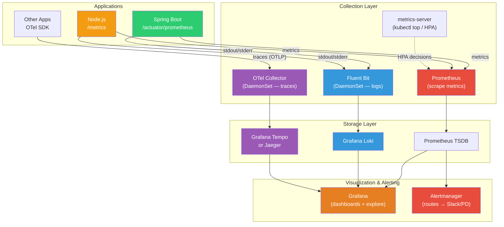

# Kubernetes Monitoring and Logging — Prometheus, Grafana, and Log Aggregation

**Doc 18** in the Kubernetes learning path. Covers the full observability pipeline: metrics collection with Prometheus and metrics-server, visualization with Grafana, log aggregation with Fluent Bit and Loki, distributed tracing with OpenTelemetry, and the RED/USE signal frameworks that tie it all together.

**Key subtopics:** metrics-server vs Prometheus, kube-prometheus-stack Helm chart, ServiceMonitor/PodMonitor CRDs, key K8s metrics, PrometheusRule alerting, Spring Boot Actuator + Micrometer, Node.js prom-client, Fluent Bit DaemonSet, Grafana Loki, structured logging, OpenTelemetry Collector and auto-instrumentation, Golden Signals / RED / USE methods.

---

## Table of Contents

- [Summary](#summary)
- [The Observability Pipeline](#the-observability-pipeline)
- [Metrics Pipeline](#metrics-pipeline)
  - [metrics-server — Lightweight Built-In Metrics](#metrics-server--lightweight-built-in-metrics)
  - [The kube-prometheus-stack](#the-kube-prometheus-stack)
  - [ServiceMonitor and PodMonitor CRDs](#servicemonitor-and-podmonitor-crds)
  - [Key Kubernetes Metrics to Watch](#key-kubernetes-metrics-to-watch)
  - [Grafana Dashboards](#grafana-dashboards)
  - [PrometheusRule — Alerting with PromQL](#prometheusrule--alerting-with-promql)
- [Application Metrics](#application-metrics)
  - [Spring Boot — Actuator + Micrometer](#spring-boot--actuator--micrometer)
  - [Node.js — prom-client](#nodejs--prom-client)
  - [ServiceMonitor for Application Pods](#servicemonitor-for-application-pods)
- [Logging](#logging)
  - [Kubernetes Logging Architecture](#kubernetes-logging-architecture)
  - [DaemonSet Log Collectors — Fluent Bit vs Fluentd](#daemonset-log-collectors--fluent-bit-vs-fluentd)
  - [Log Backends — Elasticsearch vs Loki](#log-backends--elasticsearch-vs-loki)
  - [Structured Logging — Why JSON Matters](#structured-logging--why-json-matters)
  - [kubectl logs Patterns](#kubectl-logs-patterns)
  - [Fluent Bit DaemonSet Configuration](#fluent-bit-daemonset-configuration)
- [Distributed Tracing](#distributed-tracing)
  - [OpenTelemetry Collector as DaemonSet](#opentelemetry-collector-as-daemonset)
  - [Trace Backends — Jaeger, Tempo, Zipkin](#trace-backends--jaeger-tempo-zipkin)
  - [Auto-Instrumentation with the OpenTelemetry Operator](#auto-instrumentation-with-the-opentelemetry-operator)
- [Golden Signals — RED and USE Methods](#golden-signals--red-and-use-methods)
  - [RED for Services](#red-for-services)
  - [USE for Infrastructure](#use-for-infrastructure)
  - [Implementing Both with Prometheus](#implementing-both-with-prometheus)
- [Spring Boot and Node.js Considerations](#spring-boot-and-nodejs-considerations)
- [Related](#related)
- [References](#references)

---

## Summary

Kubernetes gives you no built-in monitoring beyond `kubectl top` (which itself requires metrics-server). Production clusters need three observability pillars: **metrics** (Prometheus for time-series collection, Grafana for visualization, Alertmanager for alerting), **logs** (Fluent Bit to collect, Loki or Elasticsearch to store, Grafana to query), and **traces** (OpenTelemetry to instrument and collect, Jaeger or Tempo to store and visualize). The **kube-prometheus-stack** Helm chart (currently at v83.x) deploys the entire metrics pipeline in one install. The **OpenTelemetry Operator** injects tracing agents into Java, Node.js, and Python pods with zero code changes via auto-instrumentation CRDs. Structure your application metrics around the **RED method** (Rate, Errors, Duration) for services and the **USE method** (Utilization, Saturation, Errors) for infrastructure, and you will catch most production issues before your users notice.

---

## The Observability Pipeline



Three pillars, one visualization layer. Grafana is the single pane of glass that queries all three backends.

---

## Metrics Pipeline

### metrics-server — Lightweight Built-In Metrics

**metrics-server** is a cluster add-on that collects CPU and memory usage from kubelets via the Metrics API. It is lightweight, in-memory (no persistent storage), and purpose-built for two consumers:

- `kubectl top nodes` / `kubectl top pods` — quick resource usage check
- **HPA** (Horizontal Pod Autoscaler) — the metrics-server is the default metrics source for CPU/memory-based autoscaling

```bash
# Install metrics-server (most managed clusters include it already)
kubectl apply -f https://github.com/kubernetes-sigs/metrics-server/releases/latest/download/components.yaml

# Quick check
kubectl top nodes
kubectl top pods -n my-app --sort-by=memory
```

**What metrics-server is NOT:** It stores no history, has no query language, and exposes no alerting. It is not a monitoring solution — it is the minimal metrics plumbing that HPA and `kubectl top` need to function.

### The kube-prometheus-stack

The **kube-prometheus-stack** Helm chart (maintained by prometheus-community, currently at v83.x on Artifact Hub) deploys the full Prometheus monitoring pipeline in a single install:

| Component | Purpose |
|-----------|---------|
| **Prometheus Operator** | Manages Prometheus/Alertmanager instances via CRDs |
| **Prometheus** | Time-series database, scrapes metrics from targets |
| **Alertmanager** | Routes alerts to Slack, PagerDuty, email, webhooks |
| **Grafana** | Visualization dashboards, pre-configured with Prometheus datasource |
| **node-exporter** | DaemonSet — exposes node-level hardware/OS metrics |
| **kube-state-metrics** | Deployment — generates metrics about K8s object state |

```bash
# Install the full stack
helm repo add prometheus-community https://prometheus-community.github.io/helm-charts
helm repo update

helm install kube-prom prometheus-community/kube-prometheus-stack \
  --namespace monitoring \
  --create-namespace \
  --set grafana.adminPassword=changeme \
  --set prometheus.prometheusSpec.retention=15d \
  --set prometheus.prometheusSpec.storageSpec.volumeClaimTemplate.spec.resources.requests.storage=50Gi
```

The chart creates several **CRDs** that you will interact with daily:

- `ServiceMonitor` / `PodMonitor` — declarative scrape target definitions
- `PrometheusRule` — alerting and recording rules
- `Prometheus` — the Prometheus server instance configuration
- `Alertmanager` — the Alertmanager instance configuration

### ServiceMonitor and PodMonitor CRDs

Instead of editing Prometheus configuration files, you declare **what to scrape** as Kubernetes resources. The Prometheus Operator watches these CRDs and reloads Prometheus configuration automatically.

**ServiceMonitor** — scrapes pods behind a Service:

```yaml
apiVersion: monitoring.coreos.com/v1
kind: ServiceMonitor
metadata:
  name: my-spring-app
  namespace: monitoring
  labels:
    release: kube-prom  # Must match Prometheus operator's serviceMonitorSelector
spec:
  namespaceSelector:
    matchNames:
      - production
  selector:
    matchLabels:
      app: my-spring-app
  endpoints:
    - port: http          # Named port from the Service
      path: /actuator/prometheus
      interval: 30s
      scrapeTimeout: 10s
```

**PodMonitor** — scrapes pods directly (no Service required, useful for batch Jobs):

```yaml
apiVersion: monitoring.coreos.com/v1
kind: PodMonitor
metadata:
  name: batch-job-metrics
  namespace: monitoring
spec:
  namespaceSelector:
    matchNames:
      - batch
  selector:
    matchLabels:
      app: etl-job
  podMetricsEndpoints:
    - port: metrics
      path: /metrics
      interval: 15s
```

**Key detail:** The Prometheus Operator selects which ServiceMonitors/PodMonitors to load based on label selectors configured in the `Prometheus` CRD. The kube-prometheus-stack defaults to `release: <helm-release-name>`. If your ServiceMonitor is not being picked up, the label mismatch is almost always the cause.

### Key Kubernetes Metrics to Watch

#### Container Metrics (from cAdvisor, embedded in kubelet)

| Metric | What It Tells You |
|--------|-------------------|
| `container_cpu_usage_seconds_total` | Cumulative CPU seconds consumed. Rate this to get cores used. |
| `container_memory_working_set_bytes` | Memory that cannot be freed under pressure — this is what triggers OOMKill, not RSS. |
| `container_network_receive_bytes_total` | Network ingress per container. |
| `container_fs_writes_bytes_total` | Disk write volume, spot noisy containers. |

```promql
# CPU usage in cores for a specific deployment
rate(container_cpu_usage_seconds_total{
  namespace="production",
  pod=~"my-app-.*",
  container!=""
}[5m])

# Memory usage as percentage of limit
container_memory_working_set_bytes{namespace="production", container!=""}
/
container_spec_memory_limit_bytes{namespace="production", container!=""}
* 100
```

#### Node Metrics (from node-exporter DaemonSet)

| Metric | What It Tells You |
|--------|-------------------|
| `node_cpu_seconds_total` | Per-mode CPU time. Rate and subtract idle to get utilization. |
| `node_memory_MemAvailable_bytes` | How much memory the kernel considers available without swapping. |
| `node_disk_io_time_seconds_total` | Disk I/O saturation indicator. |
| `node_filesystem_avail_bytes` | Free disk space — critical for log volumes and container images. |

```promql
# Node CPU utilization (all modes except idle)
1 - avg by(instance) (
  rate(node_cpu_seconds_total{mode="idle"}[5m])
)

# Node memory utilization
1 - (node_memory_MemAvailable_bytes / node_memory_MemTotal_bytes)
```

#### Kubernetes State Metrics (from kube-state-metrics)

These expose the **desired vs actual** state of Kubernetes objects — the metrics that tell you when something is wrong at the orchestration level.

| Metric | What It Tells You |
|--------|-------------------|
| `kube_pod_status_phase` | Pod phase distribution (Pending, Running, Failed, Succeeded). |
| `kube_deployment_spec_replicas` vs `kube_deployment_status_replicas` | Desired vs actual replica count — mismatch means rollout stalled or resources unavailable. |
| `kube_pod_container_status_restarts_total` | Restart count — high values signal CrashLoopBackOff or OOMKill. |
| `kube_pod_container_status_waiting_reason` | Why a container is not running (ImagePullBackOff, CrashLoopBackOff, etc.). |
| `kube_node_status_condition` | Node conditions (Ready, MemoryPressure, DiskPressure). |

```promql
# Deployments where actual != desired replicas (rollout problems)
kube_deployment_spec_replicas
!=
kube_deployment_status_replicas_available

# Pods restarting frequently (more than 3 times in the last hour)
increase(kube_pod_container_status_restarts_total[1h]) > 3

# Pods stuck in Pending
kube_pod_status_phase{phase="Pending"} == 1
```

### Grafana Dashboards

The kube-prometheus-stack ships with pre-configured dashboards. Additionally, the Grafana community publishes hundreds of K8s dashboards you can import by ID:

| Dashboard ID | Name | Focus |
|-------------|------|-------|
| **3119** | Kubernetes Cluster Monitoring | Cluster-wide overview: nodes, pods, CPU/memory |
| **6417** | Kubernetes Cluster (Prometheus) | Namespace-level breakdown |
| **15759** | Kubernetes / Views / Pods | Per-pod resource consumption detail |
| **1860** | Node Exporter Full | Deep node-level metrics |

```bash
# Access Grafana (port-forward for quick access)
kubectl port-forward svc/kube-prom-grafana 3000:80 -n monitoring

# Import a community dashboard:
# Grafana UI → Dashboards → Import → Enter ID → Select Prometheus datasource → Import
```

### PrometheusRule — Alerting with PromQL

Alert rules are Kubernetes resources, managed via GitOps alongside your application manifests:

```yaml
apiVersion: monitoring.coreos.com/v1
kind: PrometheusRule
metadata:
  name: app-alerts
  namespace: monitoring
  labels:
    release: kube-prom
spec:
  groups:
    - name: application.rules
      rules:
        # High error rate
        - alert: HighErrorRate
          expr: |
            sum(rate(http_server_requests_seconds_count{status=~"5.."}[5m])) by (namespace, service)
            /
            sum(rate(http_server_requests_seconds_count[5m])) by (namespace, service)
            > 0.05
          for: 5m
          labels:
            severity: critical
          annotations:
            summary: "High 5xx error rate on {{ $labels.service }}"
            description: "{{ $labels.service }} in {{ $labels.namespace }} has >5% error rate for 5 minutes."

        # Pod restart loop
        - alert: PodCrashLooping
          expr: increase(kube_pod_container_status_restarts_total[1h]) > 5
          for: 10m
          labels:
            severity: warning
          annotations:
            summary: "Pod {{ $labels.pod }} is crash-looping"

        # Persistent volume running low
        - alert: PVCAlmostFull
          expr: |
            kubelet_volume_stats_available_bytes / kubelet_volume_stats_capacity_bytes < 0.1
          for: 15m
          labels:
            severity: warning
          annotations:
            summary: "PVC {{ $labels.persistentvolumeclaim }} is >90% full"

    - name: node.rules
      rules:
        # Node memory pressure
        - alert: NodeHighMemoryUsage
          expr: |
            1 - (node_memory_MemAvailable_bytes / node_memory_MemTotal_bytes) > 0.9
          for: 10m
          labels:
            severity: critical
          annotations:
            summary: "Node {{ $labels.instance }} memory usage >90%"
```

**Alert routing** is configured in Alertmanager. The kube-prometheus-stack lets you set this in `values.yaml`:

```yaml
alertmanager:
  config:
    route:
      receiver: 'slack-critical'
      routes:
        - match:
            severity: critical
          receiver: 'slack-critical'
        - match:
            severity: warning
          receiver: 'slack-warnings'
    receivers:
      - name: 'slack-critical'
        slack_configs:
          - channel: '#alerts-critical'
            api_url: 'https://hooks.slack.com/services/xxx/yyy/zzz'
      - name: 'slack-warnings'
        slack_configs:
          - channel: '#alerts-warnings'
            api_url: 'https://hooks.slack.com/services/xxx/yyy/zzz'
```

---

## Application Metrics

### Spring Boot — Actuator + Micrometer

Spring Boot exposes Prometheus-format metrics out of the box with Actuator and Micrometer:

```xml
<!-- pom.xml -->
<dependency>
    <groupId>org.springframework.boot</groupId>
    <artifactId>spring-boot-starter-actuator</artifactId>
</dependency>
<dependency>
    <groupId>io.micrometer</groupId>
    <artifactId>micrometer-registry-prometheus</artifactId>
</dependency>
```

```yaml
# application.yml
management:
  endpoints:
    web:
      exposure:
        include: health, info, prometheus
  metrics:
    tags:
      application: ${spring.application.name}
    distribution:
      percentiles-histogram:
        http.server.requests: true
```

This exposes `/actuator/prometheus` with hundreds of metrics including HTTP request duration histograms, JVM memory, GC pauses, connection pool stats, and custom business metrics.

**Custom business metric example:**

```java
@Component
public class OrderMetrics {
    private final Counter ordersPlaced;
    private final Timer orderProcessingTime;

    public OrderMetrics(MeterRegistry registry) {
        this.ordersPlaced = Counter.builder("orders.placed.total")
            .description("Total orders placed")
            .tag("type", "api")
            .register(registry);
        this.orderProcessingTime = Timer.builder("orders.processing.duration")
            .description("Order processing time")
            .publishPercentileHistogram()
            .register(registry);
    }

    public void recordOrder(Runnable processing) {
        ordersPlaced.increment();
        orderProcessingTime.record(processing);
    }
}
```

### Node.js — prom-client

The `prom-client` library is the standard Prometheus client for Node.js:

```bash
npm install prom-client
```

```typescript
import express from 'express';
import { collectDefaultMetrics, Registry, Counter, Histogram } from 'prom-client';

const register = new Registry();
collectDefaultMetrics({ register }); // GC, event loop lag, heap, etc.

// Custom business metrics
const httpRequestDuration = new Histogram({
  name: 'http_request_duration_seconds',
  help: 'Duration of HTTP requests in seconds',
  labelNames: ['method', 'route', 'status_code'],
  buckets: [0.005, 0.01, 0.05, 0.1, 0.5, 1, 5],
  registers: [register],
});

const ordersTotal = new Counter({
  name: 'orders_placed_total',
  help: 'Total number of orders placed',
  labelNames: ['channel'],
  registers: [register],
});

const app = express();

// Metrics endpoint for Prometheus scraping
app.get('/metrics', async (_req, res) => {
  res.set('Content-Type', register.contentType);
  res.end(await register.metrics());
});

// Middleware to track request duration
app.use((req, res, next) => {
  const end = httpRequestDuration.startTimer();
  res.on('finish', () => {
    end({ method: req.method, route: req.route?.path ?? req.path, status_code: res.statusCode });
  });
  next();
});
```

### ServiceMonitor for Application Pods

Once your app exposes `/metrics` or `/actuator/prometheus`, create a ServiceMonitor to tell Prometheus to scrape it:

```yaml
# For a Spring Boot app
apiVersion: monitoring.coreos.com/v1
kind: ServiceMonitor
metadata:
  name: order-service
  namespace: monitoring
  labels:
    release: kube-prom
spec:
  namespaceSelector:
    matchNames:
      - production
  selector:
    matchLabels:
      app: order-service
  endpoints:
    - port: http
      path: /actuator/prometheus
      interval: 30s

---
# For a Node.js app
apiVersion: monitoring.coreos.com/v1
kind: ServiceMonitor
metadata:
  name: api-gateway
  namespace: monitoring
  labels:
    release: kube-prom
spec:
  namespaceSelector:
    matchNames:
      - production
  selector:
    matchLabels:
      app: api-gateway
  endpoints:
    - port: http
      path: /metrics
      interval: 30s
```

---

## Logging

### Kubernetes Logging Architecture

Kubernetes has no built-in log aggregation. The logging flow works like this:

1. Your application writes to **stdout/stderr** (never to files inside the container)
2. The **container runtime** captures those streams and writes them to **node-level log files** (typically at `/var/log/pods/<namespace>_<pod>_<uid>/<container>/0.log`)
3. A **DaemonSet log collector** (Fluent Bit, Fluentd) tails those files from every node
4. The collector parses, filters, enriches (with K8s metadata), and ships logs to a **backend**
5. The backend (Loki, Elasticsearch) indexes and stores the logs for querying


**Why stdout/stderr?** Kubernetes manages log rotation at the node level. If you write to files inside the container, those logs are invisible to `kubectl logs`, invisible to log collectors, and lost when the container restarts.

### DaemonSet Log Collectors — Fluent Bit vs Fluentd

| Aspect | Fluent Bit | Fluentd |
|--------|------------|---------|
| **Language** | C | Ruby + C |
| **Memory footprint** | ~15-30 MB | ~60-100 MB |
| **Plugin ecosystem** | Smaller, covers common cases | Very large, 1000+ plugins |
| **Performance** | Higher throughput, lower latency | Lower throughput |
| **When to use** | Default choice for K8s log forwarding | When you need a specific plugin or complex routing |

**Recommendation:** Start with **Fluent Bit** as the DaemonSet collector on every node. If you need heavy log transformation or a niche output plugin, add Fluentd as an aggregator layer that Fluent Bit forwards to.

### Log Backends — Elasticsearch vs Loki

| Aspect | Elasticsearch (EFK stack) | Grafana Loki |
|--------|---------------------------|-------------|
| **Indexing** | Full-text index on log content | Index on **labels only** (like Prometheus) |
| **Storage cost** | Higher — indexes everything | Much lower — stores compressed log chunks |
| **Query language** | KQL / Lucene | LogQL (similar to PromQL) |
| **Search speed** | Fast full-text search | Fast label-based filtering, grep for content |
| **Visualization** | Kibana | Grafana (same tool as metrics!) |
| **Operational cost** | JVM-based, needs tuning and capacity planning | Lightweight, runs well on minimal resources |
| **Best for** | When you need full-text search across all log content | When you want logs alongside metrics in Grafana |

**Recommendation:** **Loki** is the better default for most Kubernetes setups. Same Grafana UI for metrics and logs, dramatically lower storage costs, and LogQL lets you correlate logs with PromQL metrics. Choose Elasticsearch when full-text search across log bodies is a core requirement.

### Structured Logging — Why JSON Matters

Log collectors parse raw log lines. Structured JSON logs make every field queryable without fragile regex patterns:

**Unstructured (hard to parse):**
```
2026-04-24 10:15:32 INFO  [order-service] Processing order #12345 for user alice
```

**Structured JSON (every field is queryable):**
```json
{
  "timestamp": "2026-04-24T10:15:32.456Z",
  "level": "INFO",
  "service": "order-service",
  "message": "Processing order",
  "orderId": "12345",
  "userId": "alice",
  "traceId": "abc123def456"
}
```

**Spring Boot** — use Logback JSON encoder:

```xml
<!-- logback-spring.xml -->
<configuration>
  <appender name="STDOUT" class="ch.qos.logback.core.ConsoleAppender">
    <encoder class="net.logstash.logback.encoder.LogstashEncoder">
      <includeMdcKeyName>traceId</includeMdcKeyName>
      <includeMdcKeyName>spanId</includeMdcKeyName>
    </encoder>
  </appender>
  <root level="INFO">
    <appender-ref ref="STDOUT" />
  </root>
</configuration>
```

**Node.js** — use pino (structured by default):

```typescript
import pino from 'pino';

const logger = pino({
  level: process.env.LOG_LEVEL ?? 'info',
  formatters: {
    level: (label) => ({ level: label }),
  },
  timestamp: pino.stdTimeFunctions.isoTime,
});

logger.info({ orderId: '12345', userId: 'alice' }, 'Processing order');
// Output: {"level":"info","time":"2026-04-24T10:15:32.456Z","orderId":"12345","userId":"alice","msg":"Processing order"}
```

### kubectl logs Patterns

Before you have log aggregation set up, `kubectl logs` is your primary debugging tool:

```bash
# Follow logs in real-time (like tail -f)
kubectl logs -f deployment/order-service -n production

# Logs from a crashed container (previous instance)
kubectl logs pod/order-service-abc123 --previous -n production

# Specific container in a multi-container pod
kubectl logs pod/order-service-abc123 -c sidecar-proxy -n production

# Logs from the last hour only
kubectl logs deployment/order-service --since=1h -n production

# Logs since a specific time
kubectl logs deployment/order-service --since-time=2026-04-24T09:00:00Z -n production

# All pods with a label (useful for seeing logs across replicas)
kubectl logs -l app=order-service -n production --max-log-requests=10

# Combine: follow all replicas
kubectl logs -f -l app=order-service -n production --max-log-requests=10
```

**Limitation:** `kubectl logs` only reads from a single node's local log files. Once a pod is evicted and the node recycles, those logs are gone. This is why you need a log aggregation pipeline.

### Fluent Bit DaemonSet Configuration

A practical Fluent Bit configuration shipping logs to Grafana Loki:

```yaml
apiVersion: v1
kind: ConfigMap
metadata:
  name: fluent-bit-config
  namespace: logging
data:
  fluent-bit.conf: |
    [SERVICE]
        Flush         5
        Log_Level     info
        Daemon        off
        Parsers_File  parsers.conf

    [INPUT]
        Name              tail
        Tag               kube.*
        Path              /var/log/containers/*.log
        Parser            cri
        DB                /var/log/flb_kube.db
        Mem_Buf_Limit     5MB
        Skip_Long_Lines   On
        Refresh_Interval  10

    [FILTER]
        Name                kubernetes
        Match               kube.*
        Kube_URL            https://kubernetes.default.svc:443
        Kube_CA_File        /var/run/secrets/kubernetes.io/serviceaccount/ca.crt
        Kube_Token_File     /var/run/secrets/kubernetes.io/serviceaccount/token
        Merge_Log           On
        Merge_Log_Key       log_parsed
        K8S-Logging.Parser  On
        K8S-Logging.Exclude On

    [OUTPUT]
        Name                loki
        Match               kube.*
        Host                loki-gateway.logging.svc.cluster.local
        Port                80
        Labels              job=fluent-bit, namespace=$kubernetes['namespace_name'], pod=$kubernetes['pod_name'], container=$kubernetes['container_name']
        Auto_Kubernetes_Labels Off

  parsers.conf: |
    [PARSER]
        Name        cri
        Format      regex
        Regex       ^(?<time>[^ ]+) (?<stream>stdout|stderr) (?<logtag>[^ ]*) (?<log>.*)$
        Time_Key    time
        Time_Format %Y-%m-%dT%H:%M:%S.%L%z

    [PARSER]
        Name        json
        Format      json
        Time_Key    timestamp
        Time_Format %Y-%m-%dT%H:%M:%S.%L%z

---
apiVersion: apps/v1
kind: DaemonSet
metadata:
  name: fluent-bit
  namespace: logging
  labels:
    app: fluent-bit
spec:
  selector:
    matchLabels:
      app: fluent-bit
  template:
    metadata:
      labels:
        app: fluent-bit
    spec:
      serviceAccountName: fluent-bit
      tolerations:
        - operator: Exists      # Run on ALL nodes including control plane
      containers:
        - name: fluent-bit
          image: fluent/fluent-bit:3.2
          resources:
            requests:
              cpu: 50m
              memory: 64Mi
            limits:
              cpu: 200m
              memory: 128Mi
          volumeMounts:
            - name: varlog
              mountPath: /var/log
              readOnly: true
            - name: config
              mountPath: /fluent-bit/etc/
      volumes:
        - name: varlog
          hostPath:
            path: /var/log
        - name: config
          configMap:
            name: fluent-bit-config
```

In practice, use the **Fluent Bit Helm chart** for production — it handles the ServiceAccount, RBAC, tolerations, and upgrade strategy:

```bash
helm repo add fluent https://fluent.github.io/helm-charts
helm install fluent-bit fluent/fluent-bit \
  --namespace logging \
  --create-namespace \
  --set config.outputs="[OUTPUT]\n    Name loki\n    Match kube.*\n    Host loki-gateway.logging.svc.cluster.local\n    Port 80"
```

---

## Distributed Tracing

### OpenTelemetry Collector as DaemonSet

The **OpenTelemetry Collector** receives, processes, and exports telemetry data. Deploy it as a DaemonSet so every node has a local endpoint for applications to send traces to (low latency, no cross-node traffic):

```yaml
apiVersion: opentelemetry.io/v1beta1
kind: OpenTelemetryCollector
metadata:
  name: otel-collector
  namespace: observability
spec:
  mode: daemonset
  config:
    receivers:
      otlp:
        protocols:
          grpc:
            endpoint: 0.0.0.0:4317
          http:
            endpoint: 0.0.0.0:4318

    processors:
      batch:
        send_batch_size: 1024
        timeout: 5s
      memory_limiter:
        check_interval: 1s
        limit_mib: 256
        spike_limit_mib: 64

    exporters:
      otlp/tempo:
        endpoint: tempo-distributor.observability.svc.cluster.local:4317
        tls:
          insecure: true
      prometheus:
        endpoint: 0.0.0.0:8889
        resource_to_telemetry_conversion:
          enabled: true

    service:
      pipelines:
        traces:
          receivers: [otlp]
          processors: [memory_limiter, batch]
          exporters: [otlp/tempo]
        metrics:
          receivers: [otlp]
          processors: [memory_limiter, batch]
          exporters: [prometheus]
```

Applications send traces to `otel-collector:4317` (gRPC) or `otel-collector:4318` (HTTP) — the DaemonSet's host port or a Service.

### Trace Backends — Jaeger, Tempo, Zipkin

| Backend | Storage | Query | Best For |
|---------|---------|-------|----------|
| **Grafana Tempo** | Object storage (S3, GCS, MinIO) | Grafana Explore via TraceQL | Cost-effective, Grafana-native stack |
| **Jaeger** | Elasticsearch, Cassandra, or in-memory | Own UI + Grafana plugin | Mature, rich UI, large community |
| **Zipkin** | MySQL, Elasticsearch, Cassandra, in-memory | Own UI | Simpler setup, lighter footprint |

**Recommendation:** If you are already running Grafana for metrics and Loki for logs, **Tempo** completes the trifecta — one UI for all three pillars, with trace-to-log and trace-to-metric correlation.

### Auto-Instrumentation with the OpenTelemetry Operator

The **OpenTelemetry Operator** (CNCF project, actively maintained) uses Kubernetes admission webhooks to inject instrumentation agents into pods automatically. No code changes, no image rebuilds.

```bash
# Install the operator
helm repo add open-telemetry https://open-telemetry.github.io/opentelemetry-helm-charts
helm install otel-operator open-telemetry/opentelemetry-operator \
  --namespace observability \
  --create-namespace \
  --set manager.collectorImage.repository=otel/opentelemetry-collector-contrib
```

**Create an Instrumentation resource:**

```yaml
apiVersion: opentelemetry.io/v1alpha1
kind: Instrumentation
metadata:
  name: auto-instrumentation
  namespace: observability
spec:
  exporter:
    endpoint: http://otel-collector.observability.svc.cluster.local:4318
  propagators:
    - tracecontext
    - baggage
  sampler:
    type: parentbased_traceidratio
    argument: "0.25"  # Sample 25% of traces in production
  java:
    image: ghcr.io/open-telemetry/opentelemetry-operator/autoinstrumentation-java:latest
  nodejs:
    image: ghcr.io/open-telemetry/opentelemetry-operator/autoinstrumentation-nodejs:latest
  python:
    image: ghcr.io/open-telemetry/opentelemetry-operator/autoinstrumentation-python:latest
```

**Annotate pods to opt in:**

```yaml
apiVersion: apps/v1
kind: Deployment
metadata:
  name: order-service
spec:
  template:
    metadata:
      annotations:
        # For Java (Spring Boot) apps:
        instrumentation.opentelemetry.io/inject-java: "observability/auto-instrumentation"
        # For Node.js apps:
        # instrumentation.opentelemetry.io/inject-nodejs: "observability/auto-instrumentation"
    spec:
      containers:
        - name: order-service
          image: myregistry/order-service:latest
```

**What happens behind the scenes:** The OpenTelemetry Operator's admission webhook intercepts pod creation, injects an init container that copies the instrumentation agent into a shared volume, and adds environment variables (`JAVA_TOOL_OPTIONS` for Java, `NODE_OPTIONS` for Node.js) that load the agent at startup. The application code never changes.

**Supported languages:** Java, Node.js, Python, .NET, Go (with eBPF-based instrumentation). Java and Node.js have the most mature auto-instrumentation.

---

## Golden Signals — RED and USE Methods

Two complementary frameworks for deciding **what to monitor**. Use both: RED for your services, USE for the infrastructure underneath.

### RED for Services

**R**ate, **E**rrors, **D**uration — proposed by Tom Wilkie (Grafana Labs). Answers: "Is my service healthy for users?"

| Signal | PromQL Example | What It Catches |
|--------|---------------|-----------------|
| **Rate** | `sum(rate(http_server_requests_seconds_count[5m])) by (service)` | Traffic anomalies — sudden drops or spikes |
| **Errors** | `sum(rate(http_server_requests_seconds_count{status=~"5.."}[5m])) by (service)` | Backend failures, dependency outages |
| **Duration** | `histogram_quantile(0.99, sum(rate(http_server_requests_seconds_bucket[5m])) by (le, service))` | Latency degradation, slow queries |

### USE for Infrastructure

**U**tilization, **S**aturation, **E**rrors — proposed by Brendan Gregg. Answers: "Is my infrastructure healthy?"

| Signal | Resource | PromQL Example |
|--------|----------|---------------|
| **Utilization** | CPU | `1 - avg(rate(node_cpu_seconds_total{mode="idle"}[5m])) by (instance)` |
| **Utilization** | Memory | `1 - (node_memory_MemAvailable_bytes / node_memory_MemTotal_bytes)` |
| **Saturation** | CPU | `avg(node_load15) by (instance) / count(node_cpu_seconds_total{mode="idle"}) by (instance)` |
| **Saturation** | Disk I/O | `rate(node_disk_io_time_weighted_seconds_total[5m])` |
| **Errors** | Disk | `rate(node_disk_io_time_seconds_total{result="error"}[5m])` |

### Implementing Both with Prometheus

A practical PrometheusRule that implements RED and USE alerts together:

```yaml
apiVersion: monitoring.coreos.com/v1
kind: PrometheusRule
metadata:
  name: golden-signals
  namespace: monitoring
  labels:
    release: kube-prom
spec:
  groups:
    # RED — Service Health
    - name: red.rules
      rules:
        - alert: HighErrorRate
          expr: |
            sum(rate(http_server_requests_seconds_count{status=~"5.."}[5m])) by (namespace, service)
            /
            sum(rate(http_server_requests_seconds_count[5m])) by (namespace, service)
            > 0.01
          for: 5m
          labels:
            severity: critical
            method: RED
          annotations:
            summary: "{{ $labels.service }}: error rate {{ $value | humanizePercentage }}"

        - alert: HighLatencyP99
          expr: |
            histogram_quantile(0.99,
              sum(rate(http_server_requests_seconds_bucket[5m])) by (le, namespace, service)
            ) > 1.0
          for: 5m
          labels:
            severity: warning
            method: RED
          annotations:
            summary: "{{ $labels.service }}: p99 latency {{ $value | humanizeDuration }}"

        - alert: TrafficAnomaly
          expr: |
            abs(
              sum(rate(http_server_requests_seconds_count[5m])) by (service)
              -
              sum(rate(http_server_requests_seconds_count[5m] offset 1d)) by (service)
            )
            /
            sum(rate(http_server_requests_seconds_count[5m] offset 1d)) by (service)
            > 0.5
          for: 15m
          labels:
            severity: info
            method: RED
          annotations:
            summary: "{{ $labels.service }}: traffic changed >50% vs yesterday"

    # USE — Infrastructure Health
    - name: use.rules
      rules:
        - alert: NodeHighCPUUtilization
          expr: 1 - avg(rate(node_cpu_seconds_total{mode="idle"}[5m])) by (instance) > 0.85
          for: 15m
          labels:
            severity: warning
            method: USE

        - alert: NodeHighMemoryUtilization
          expr: 1 - (node_memory_MemAvailable_bytes / node_memory_MemTotal_bytes) > 0.9
          for: 10m
          labels:
            severity: critical
            method: USE

        - alert: NodeDiskSaturation
          expr: rate(node_disk_io_time_weighted_seconds_total[5m]) > 0.8
          for: 15m
          labels:
            severity: warning
            method: USE
```

---

## Spring Boot and Node.js Considerations

**Spring Boot:**
- Micrometer auto-configures HTTP server request metrics (`http.server.requests`) with method, status, URI, and exception labels — this directly feeds RED method dashboards
- The Spring Boot Actuator `/actuator/health` endpoint integrates with Kubernetes liveness/readiness probes AND can feed health-based alerts
- JVM metrics (heap, GC, threads) are critical for Java apps — the kube-prometheus-stack's default JVM dashboard (ID 4701) visualizes these
- For distributed tracing, Spring Boot 3.x integrates with Micrometer Tracing + OpenTelemetry bridge — or use the OTel Operator's auto-instrumentation for zero-config traces

**Node.js:**
- `prom-client`'s `collectDefaultMetrics()` exposes event loop lag, active handles, heap stats, and GC metrics — essential for diagnosing Node.js-specific bottlenecks
- Event loop lag above 100ms is a strong signal of CPU saturation in a single-threaded Node.js process
- The `--max-old-space-size` JVM-equivalent (`--max-old-space-size=512`) should match your container memory limit minus ~100MB overhead
- For tracing, the OTel Operator's Node.js auto-instrumentation patches `http`, `express`, `pg`, `ioredis`, and many libraries automatically

**Both platforms:**
- Always include `traceId` in structured logs so you can jump from a log line in Loki to the full trace in Tempo/Jaeger
- Set resource labels (`service.name`, `service.namespace`, `service.version`) consistently across metrics, logs, and traces for correlation

---

## Related

- [kubectl Mastery — Debugging, Introspection, and Productivity](kubectl-mastery.md) — the debugging commands you will use alongside monitoring
- [Autoscaling in Kubernetes — HPA, VPA, Cluster Autoscaler, and KEDA](autoscaling.md) — metrics-server and Prometheus custom metrics drive HPA decisions
- [Network Observability](../../networking/advanced/network-observability.md) — network-level metrics, eBPF-based flow collection, and service mesh telemetry

---

## References

1. [Prometheus Operator — ServiceMonitor API Reference](https://prometheus-operator.dev/docs/api-reference/api/) — official CRD documentation
2. [kube-prometheus-stack Helm Chart](https://artifacthub.io/packages/helm/prometheus-community/kube-prometheus-stack) — Artifact Hub page with configuration values
3. [Grafana Loki Documentation](https://grafana.com/docs/loki/latest/) — log aggregation system, LogQL query language
4. [OpenTelemetry Operator for Kubernetes](https://opentelemetry.io/docs/platforms/kubernetes/operator/) — auto-instrumentation setup and CRD reference
5. [OpenTelemetry Auto-Instrumentation Guide](https://opentelemetry.io/docs/platforms/kubernetes/operator/automatic/) — language-specific injection annotations
6. [Fluent Bit Documentation — Kubernetes Filter](https://docs.fluentbit.io/manual/pipeline/filters/kubernetes) — log enrichment with K8s metadata
7. [Brendan Gregg — USE Method](https://www.brendangregg.com/usemethod.html) — Utilization, Saturation, Errors framework for infrastructure
8. [Tom Wilkie — RED Method](https://grafana.com/blog/2018/08/02/the-red-method-how-to-instrument-your-services/) — Rate, Errors, Duration framework for services
