# Developer Experience on Kubernetes — Local Dev, Debugging, and Inner Loop

**Date:** 2026-04-24 | **Updated:** 2026-04-24
**Tags:** `kubernetes` `developer-experience` `local-dev` `debugging` `inner-loop`

## Table of Contents

- [Summary](#summary)
- [Inner Loop vs Outer Loop](#inner-loop-vs-outer-loop)
- [Local Kubernetes Options](#local-kubernetes-options)
  - [Docker Desktop](#docker-desktop)
  - [minikube](#minikube)
  - [kind (Kubernetes in Docker)](#kind-kubernetes-in-docker)
  - [k3d (k3s in Docker)](#k3d-k3s-in-docker)
  - [Comparison Table](#comparison-table)
  - [Setting Up a kind Cluster](#setting-up-a-kind-cluster)
- [Inner Loop Development Tools](#inner-loop-development-tools)
  - [The Slow Loop Problem](#the-slow-loop-problem)
  - [Tilt](#tilt)
  - [Skaffold](#skaffold)
  - [Telepresence](#telepresence)
  - [DevSpace](#devspace)
  - [Tool Comparison](#tool-comparison)
- [Remote Debugging](#remote-debugging)
  - [Java / Spring Boot Remote Debug](#java--spring-boot-remote-debug)
  - [Node.js / TypeScript Remote Debug](#nodejs--typescript-remote-debug)
  - [Ephemeral Debug Containers](#ephemeral-debug-containers)
- [Developer Self-Service](#developer-self-service)
  - [Namespace-per-PR](#namespace-per-pr)
  - [Preview Environments](#preview-environments)
  - [ArgoCD ApplicationSet PR Generator](#argocd-applicationset-pr-generator)
  - [Backstage Service Catalog](#backstage-service-catalog)
- [When Kubernetes Is Overkill](#when-kubernetes-is-overkill)
  - [Signs You Don't Need K8s Yet](#signs-you-dont-need-k8s-yet)
  - [PaaS Alternatives](#paas-alternatives)
  - [Decision Framework](#decision-framework)
- [Related](#related)
- [References](#references)

## Summary

Kubernetes was designed for production operations, not developer ergonomics. Without intentional tooling, the inner development loop (code-change to feedback) expands from seconds to minutes. This document covers local cluster options for development, tools that accelerate the inner loop (Tilt, Skaffold, Telepresence, DevSpace), remote debugging techniques for Java/Spring Boot and Node.js/TypeScript, self-service patterns like namespace-per-PR and preview environments, and a realistic assessment of when Kubernetes adds more complexity than value.

## Inner Loop vs Outer Loop

```mermaid
graph LR
    subgraph "Inner Loop (developer machine)"
        CODE[Write Code] --> TEST[Run Tests]
        TEST --> BUILD[Build Locally]
        BUILD --> VERIFY[Verify in Cluster]
        VERIFY --> CODE
    end

    subgraph "Outer Loop (CI/CD pipeline)"
        PUSH[Push to Git] --> CI[CI Build + Test]
        CI --> IMAGE[Build Container Image]
        IMAGE --> REGISTRY[Push to Registry]
        REGISTRY --> DEPLOY[Deploy to Cluster]
        DEPLOY --> VALIDATE[Validate + Monitor]
    end

    VERIFY -. "commit when ready" .-> PUSH

    style CODE fill:#2d6a4f,color:#fff
    style TEST fill:#2d6a4f,color:#fff
    style BUILD fill:#2d6a4f,color:#fff
    style VERIFY fill:#2d6a4f,color:#fff
    style PUSH fill:#3a506b,color:#fff
    style CI fill:#3a506b,color:#fff
    style IMAGE fill:#3a506b,color:#fff
    style REGISTRY fill:#3a506b,color:#fff
    style DEPLOY fill:#3a506b,color:#fff
    style VALIDATE fill:#3a506b,color:#fff
```



The **inner loop** is what you iterate on dozens of times per hour while coding. The **outer loop** runs in CI/CD after you push. Developer experience tooling exists to keep the inner loop fast — ideally under 10 seconds from save to running code.

Without specific tooling, a Kubernetes inner loop looks like:

1. Edit source code
2. Build container image (~30s-2min)
3. Push image to registry (~15s-1min)
4. Update manifest with new image tag
5. Apply manifest / wait for rollout (~15s-1min)
6. Check logs, verify behavior

That is 1-5 minutes per iteration. Multiply by 50 iterations a day and you lose hours to waiting.

## Local Kubernetes Options

### Docker Desktop

The simplest way to run Kubernetes locally. Enable it in Docker Desktop settings and you have a single-node cluster running alongside your container engine.

**Strengths:**
- Zero additional installation — checkbox in settings
- Shares Docker daemon — images you build are immediately available
- Integrates with Docker Compose workflows
- kubectl context auto-configured

**Limitations:**
- Single-node only — cannot test node affinity or multi-node behavior
- Limited customization of cluster configuration
- Kubernetes version tied to Docker Desktop release cycle
- Resource usage adds to Docker Desktop's already substantial footprint

### minikube

The most mature local Kubernetes tool. Supports multiple VM/container drivers and an extensive addon system.

```bash
# Install on macOS
brew install minikube

# Start with specific resources and driver
minikube start --cpus=4 --memory=8192 --driver=docker

# Enable common addons
minikube addons enable ingress
minikube addons enable metrics-server
minikube addons enable dashboard

# Use minikube's Docker daemon (skip registry push)
eval $(minikube docker-env)
```

**Strengths:**
- Most mature, largest community, best documented
- Multiple drivers: Docker, HyperKit, VirtualBox, QEMU, Podman
- Addon system (ingress, metrics-server, dashboard, registry, etc.)
- `minikube tunnel` for LoadBalancer service access
- `minikube docker-env` to build directly into the cluster's Docker daemon

**Limitations:**
- Single-node by default (multi-node is experimental)
- Heavier startup than kind/k3d
- Addon ecosystem varies in quality

### kind (Kubernetes in Docker)

"Kubernetes IN Docker" — runs K8s nodes as Docker containers. Originally built for testing Kubernetes itself, it has become the go-to for CI pipelines and lightweight multi-node clusters.

```yaml
# kind-cluster.yaml — multi-node cluster with ingress-ready config
kind: Cluster
apiVersion: kind.x-k8s.io/v1alpha4
nodes:
  - role: control-plane
    kubeadmConfigPatches:
      - |
        kind: InitConfiguration
        nodeRegistration:
          kubeletExtraArgs:
            node-labels: "ingress-ready=true"
    extraPortMappings:
      - containerPort: 80
        hostPort: 80
        protocol: TCP
      - containerPort: 443
        hostPort: 443
        protocol: TCP
  - role: worker
  - role: worker
```

```bash
# Install
brew install kind

# Create cluster from config
kind create cluster --name dev --config kind-cluster.yaml

# Load locally built images (no registry needed)
kind load docker-image my-app:latest --name dev

# Delete when done
kind delete cluster --name dev
```

**Strengths:**
- Fast startup (~30 seconds)
- True multi-node clusters as Docker containers
- Lightweight resource footprint
- `kind load docker-image` skips the registry entirely
- First-class CI support (runs in GitHub Actions, GitLab CI, etc.)
- Uses upstream Kubernetes (not a distribution fork)

**Limitations:**
- No built-in addon system (install everything manually)
- LoadBalancer services require extra tooling (metallb)
- No built-in dashboard or tunnel command

### k3d (k3s in Docker)

Runs Rancher's lightweight K3s distribution inside Docker containers. K3s strips out cloud-provider and storage drivers you do not need locally.

```bash
# Install
brew install k3d

# Create cluster with 3 agents and a local registry
k3d cluster create dev \
  --agents 3 \
  --port "8080:80@loadbalancer" \
  --registry-create dev-registry:0.0.0.0:5050

# Import local image
k3d image import my-app:latest --cluster dev
```

**Strengths:**
- Fastest startup (~15 seconds)
- Lowest resource footprint (K3s uses ~512MB RAM for control plane)
- Built-in local registry creation
- Built-in Traefik ingress and service load balancer
- Multi-node with minimal overhead

**Limitations:**
- K3s is not vanilla Kubernetes (uses SQLite by default instead of etcd, bundles Traefik)
- Some CRDs or operators tested against upstream K8s may behave differently
- Smaller community than minikube or kind

### Comparison Table

| Feature | Docker Desktop | minikube | kind | k3d |
|---------|---------------|----------|------|-----|
| **Startup time** | ~60s | ~60-90s | ~30s | ~15s |
| **Memory footprint** | Shared with Docker | ~2-4 GB | ~1-2 GB | ~512MB-1 GB |
| **Multi-node** | No | Experimental | Yes | Yes |
| **Addon system** | No | Yes (extensive) | No | Traefik built-in |
| **Skip registry** | Yes (shared daemon) | Yes (`docker-env`) | Yes (`kind load`) | Yes (`k3d image import`) |
| **Upstream K8s** | Yes | Yes | Yes | No (K3s) |
| **CI-friendly** | No | Possible | Excellent | Good |
| **Best for** | Quick start, Docker users | Feature-rich local dev | CI pipelines, multi-node testing | Fast iteration, low-resource machines |

**Recommendation for backend devs:** Use **kind** for your daily workflow — it is fast, multi-node, and matches production Kubernetes. Use **k3d** if you need even faster startup and lower resource usage, and you accept the minor K3s differences.

### Setting Up a kind Cluster

A complete local development setup with ingress and a local registry:

```bash
#!/bin/bash
# setup-kind-dev.sh — idempotent local dev cluster

CLUSTER_NAME="dev"
REG_NAME="kind-registry"
REG_PORT="5050"

# Create local registry if it doesn't exist
if [ "$(docker inspect -f '{{.State.Running}}' "${REG_NAME}" 2>/dev/null)" != 'true' ]; then
  docker run -d --restart=always -p "127.0.0.1:${REG_PORT}:5000" --name "${REG_NAME}" registry:2
fi

# Create cluster if it doesn't exist
if ! kind get clusters | grep -q "^${CLUSTER_NAME}$"; then
  cat <<EOF | kind create cluster --name "${CLUSTER_NAME}" --config=-
kind: Cluster
apiVersion: kind.x-k8s.io/v1alpha4
containerdConfigPatches:
  - |-
    [plugins."io.containerd.grpc.v1.cri".registry.mirrors."localhost:${REG_PORT}"]
      endpoint = ["http://${REG_NAME}:5000"]
nodes:
  - role: control-plane
    kubeadmConfigPatches:
      - |
        kind: InitConfiguration
        nodeRegistration:
          kubeletExtraArgs:
            node-labels: "ingress-ready=true"
    extraPortMappings:
      - containerPort: 80
        hostPort: 80
        protocol: TCP
      - containerPort: 443
        hostPort: 443
        protocol: TCP
  - role: worker
  - role: worker
EOF

  # Connect registry to cluster network
  docker network connect "kind" "${REG_NAME}" 2>/dev/null || true

  # Install nginx ingress controller
  kubectl apply -f https://raw.githubusercontent.com/kubernetes/ingress-nginx/main/deploy/static/provider/kind/deploy.yaml
  kubectl wait --namespace ingress-nginx \
    --for=condition=ready pod \
    --selector=app.kubernetes.io/component=controller \
    --timeout=90s
fi

echo "Cluster '${CLUSTER_NAME}' ready. Registry at localhost:${REG_PORT}"
echo "Push images: docker tag my-app localhost:${REG_PORT}/my-app && docker push localhost:${REG_PORT}/my-app"
```

## Inner Loop Development Tools

### The Slow Loop Problem

Without tooling, every code change requires a full build-push-deploy cycle:

```
Edit code → docker build → docker push → kubectl apply → wait for rollout → check logs
           ~30-120s        ~15-60s        ~5s              ~15-60s
                                                                    Total: 1-5 minutes
```

Inner loop tools attack this problem from different angles:

- **Image rebuild optimization** — detect changes, rebuild only what changed, skip the push
- **File sync / hot reload** — copy changed files into running containers, restart the process
- **Traffic interception** — route cluster traffic to your local machine, skip the cluster entirely

### Tilt

[Tilt](https://tilt.dev) orchestrates your multi-service dev environment with a `Tiltfile` written in Starlark (a Python dialect). It watches your source files, rebuilds images, and updates running pods — all coordinated through a web UI.

**Status (2026):** Actively maintained open-source project. Continues to receive regular releases.

```python
# Tiltfile — multi-service example for a Node.js API + Spring Boot service

# --- Node.js API ---
docker_build(
    'my-api',
    './api',
    live_update=[
        sync('./api/src', '/app/src'),        # sync source files
        run('npm install', trigger=['./api/package.json']),  # reinstall on package change
    ],
)

k8s_yaml('k8s/api-deployment.yaml')
k8s_resource('api', port_forwards='3000:3000')

# --- Spring Boot Service ---
docker_build(
    'order-service',
    './order-service',
    live_update=[
        sync('./order-service/target/classes', '/app/classes'),
        # Spring Boot DevTools picks up class changes automatically
    ],
)

k8s_yaml('k8s/order-service-deployment.yaml')
k8s_resource('order-service', port_forwards='8080:8080')

# --- Shared infrastructure ---
k8s_yaml('k8s/postgres.yaml')
k8s_resource('postgres', port_forwards='5432:5432')
```

**Strengths:**
- Web UI shows build status, logs, and resource health in one place
- `live_update` syncs files into running containers without image rebuild
- Multi-service orchestration — define your entire stack in one Tiltfile
- Starlark scripting allows conditional logic, loops, environment branching

**Limitations:**
- Starlark learning curve if you are not familiar with Python-like syntax
- Tiltfile can become complex for large service graphs
- Opinionated about dev workflow patterns

### Skaffold

[Skaffold](https://skaffold.dev) from Google handles the build-push-deploy pipeline with a declarative YAML config. It supports multiple build strategies (Docker, Jib, Buildpacks) and deploy strategies (kubectl, Helm, Kustomize).

**Status (2026):** Actively maintained by Google Container Tools. Regular releases continue (latest April 2026).

```yaml
# skaffold.yaml — file sync for Node.js, Jib for Spring Boot
apiVersion: skaffold/v4beta11
kind: Config
metadata:
  name: my-app

profiles:
  - name: dev
    activation:
      - command: dev
    build:
      artifacts:
        - image: my-api
          context: api
          docker:
            dockerfile: Dockerfile
          sync:
            manual:
              - src: 'src/**/*.ts'
                dest: /app/src
              - src: 'src/**/*.js'
                dest: /app/src

        - image: order-service
          context: order-service
          jib:
            type: maven

    deploy:
      kubectl:
        manifests:
          - k8s/*.yaml

  - name: staging
    build:
      artifacts:
        - image: my-api
          context: api
        - image: order-service
          context: order-service
          jib:
            type: maven
    deploy:
      helm:
        releases:
          - name: my-app
            chartPath: helm/my-app
            valuesFiles:
              - helm/values-staging.yaml
```

```bash
# Dev mode — watches files, rebuilds, deploys, streams logs
skaffold dev --profile dev

# One-shot deploy
skaffold run --profile staging

# Render manifests without deploying (useful for CI)
skaffold render --profile staging > rendered.yaml
```

**Strengths:**
- `skaffold dev` — file sync (hot reload) without image rebuilds for supported file types
- Profiles — same config file for dev, staging, CI
- Builder agnostic — Docker, Jib (no Docker daemon needed for Java), Cloud Native Buildpacks
- Deployer agnostic — kubectl, Helm, Kustomize
- `skaffold debug` automatically configures remote debugging ports

**Limitations:**
- YAML config can be verbose for complex multi-service setups
- File sync is limited to specific file types and requires container restart for structural changes
- Less interactive than Tilt's web UI

### Telepresence

[Telepresence](https://telepresence.io) takes a fundamentally different approach: instead of running your code in a local cluster, it connects your local machine to a remote cluster. Traffic destined for a specific service gets intercepted and routed to your laptop.

**Status (2026):** Active CNCF Sandbox project. Ambassador Labs integrated Telepresence into their Blackbird platform in 2025. The open-source CLI remains available and maintained.

```bash
# Install
brew install datawire/telepresence/telepresence

# Connect to a remote cluster
telepresence connect

# Intercept traffic for a specific service
# All requests to order-service in the cluster now hit localhost:8080
telepresence intercept order-service --port 8080:8080

# Your local Spring Boot app receives real cluster traffic
# including access to cluster DNS (order-service.default.svc.cluster.local resolves)
mvn spring-boot:run

# Preview URL — share a URL that routes only YOUR requests through the intercept
telepresence intercept order-service --port 8080:8080 --preview-url

# Clean up
telepresence leave order-service
telepresence quit
```

**Strengths:**
- Develop against real cluster services (databases, message queues, other microservices)
- No local cluster needed — use the shared dev/staging cluster
- No image builds, no container startup — run your app natively with full IDE support
- Personal intercepts — only your traffic is redirected, others see the deployed version

**Limitations:**
- Requires a running remote cluster with network access
- VPN/firewall configurations can interfere with the network bridge
- Cluster admin permissions needed for initial setup
- Debugging networking issues between local and cluster can be tricky

### DevSpace

[DevSpace](https://devspace.sh) is a CNCF Sandbox project from Loft Labs that combines file sync, hot reload, port forwarding, and deployment automation in one CLI.

**Status (2026):** Actively maintained CNCF Sandbox project with regular releases and growing community (4000+ GitHub stars).

```yaml
# devspace.yaml
version: v2beta1
name: my-app

pipelines:
  dev:
    run: |-
      run_dependencies --all
      ensure_pull_secrets --all
      create_deployments --all
      start_dev --all

deployments:
  api:
    helm:
      chart:
        name: component-chart
        repo: https://charts.devspace.sh
      values:
        containers:
          - image: my-api
        service:
          ports:
            - port: 3000

dev:
  api:
    imageSelector: my-api
    ports:
      - port: "3000"
    sync:
      - path: ./api/src:/app/src
    terminal:
      command: npm run dev
    logs: {}
```

```bash
# Start dev mode
devspace dev

# Open a terminal in the container
devspace enter

# Purge dev deployments
devspace purge
```

**Strengths:**
- Bi-directional file sync between local and container
- Integrated terminal — opens a shell in the dev container automatically
- Dependency management — start dependent services before your app
- UI dashboard for managing dev environments
- Works with existing Helm charts and Kustomize overlays

**Limitations:**
- Smaller community than Skaffold or Tilt
- Config file format has changed across major versions
- Some overlap with Skaffold in feature set

### Tool Comparison

| Concern | Tilt | Skaffold | Telepresence | DevSpace |
|---------|------|----------|--------------|----------|
| **Approach** | Orchestrate local cluster | Build/deploy pipeline | Intercept remote traffic | File sync + deploy |
| **Config format** | Starlark (Tiltfile) | YAML | CLI flags | YAML |
| **File sync** | `live_update` | `sync` | N/A (run natively) | `sync` (bi-directional) |
| **Multi-service** | Excellent | Good | Per-service intercept | Good |
| **CI/CD reuse** | Limited | Excellent (profiles) | N/A | Good |
| **Remote cluster** | Optional | Optional | Required | Optional |
| **Learning curve** | Medium | Low-Medium | Low | Medium |
| **Best for** | Multi-service local dev | Google Cloud / mixed environments | Debugging against real services | Teams wanting all-in-one DX |

**When to use which:**

- **Tilt** — You run 3+ services locally and want a unified dashboard showing builds, logs, and health.
- **Skaffold** — You want the same config for dev and CI, or you use Jib for Java builds and want to skip Docker entirely.
- **Telepresence** — Your service depends on many cluster-hosted resources you cannot easily run locally (managed databases, message brokers, third-party APIs).
- **DevSpace** — You want an opinionated all-in-one tool with built-in terminal access and sync.

## Remote Debugging

### Java / Spring Boot Remote Debug

Java's JDWP (Java Debug Wire Protocol) lets you attach a debugger to a running JVM over a network port.

**1. Configure the Deployment to expose the debug port:**

```yaml
# k8s/order-service-deployment.yaml
apiVersion: apps/v1
kind: Deployment
metadata:
  name: order-service
spec:
  replicas: 1  # scale to 1 for debugging
  template:
    spec:
      containers:
        - name: order-service
          image: order-service:latest
          ports:
            - containerPort: 8080
              name: http
            - containerPort: 5005
              name: debug
          env:
            - name: JAVA_TOOL_OPTIONS
              value: >-
                -agentlib:jdwp=transport=dt_socket,server=y,suspend=n,address=*:5005
```

**2. Port-forward to the debug port:**

```bash
# Forward local 5005 to pod's 5005
kubectl port-forward deployment/order-service 5005:5005
```

**3. Attach IntelliJ or VS Code:**

IntelliJ: Run > Edit Configurations > Remote JVM Debug > Host `localhost`, Port `5005`

VS Code `launch.json`:

```json
{
  "type": "java",
  "name": "Attach to K8s",
  "request": "attach",
  "hostName": "localhost",
  "port": 5005
}
```

> **Caution:** Never expose debug ports in production. Use a separate debug overlay or Kustomize patch that adds the JDWP agent only in dev/staging.

### Node.js / TypeScript Remote Debug

Node.js exposes a V8 inspector protocol on port 9229 by default.

**1. Configure the Deployment:**

```yaml
apiVersion: apps/v1
kind: Deployment
metadata:
  name: api
spec:
  replicas: 1
  template:
    spec:
      containers:
        - name: api
          image: my-api:latest
          command: ["node"]
          args: ["--inspect=0.0.0.0:9229", "dist/main.js"]
          ports:
            - containerPort: 3000
              name: http
            - containerPort: 9229
              name: debug
```

**2. Port-forward:**

```bash
kubectl port-forward deployment/api 9229:9229
```

**3. Attach VS Code:**

```json
{
  "type": "node",
  "name": "Attach to K8s Node",
  "request": "attach",
  "address": "localhost",
  "port": 9229,
  "localRoot": "${workspaceFolder}",
  "remoteRoot": "/app",
  "sourceMaps": true
}
```

> **Tip with ts-node:** If running TypeScript directly via `ts-node`, use `node --inspect=0.0.0.0:9229 -r ts-node/register src/main.ts`. Source maps let you set breakpoints in `.ts` files.

### Ephemeral Debug Containers

Kubernetes 1.25+ supports ephemeral containers — temporary containers injected into a running Pod for debugging without restarting it. This is invaluable for production troubleshooting when the running container is a minimal distroless image with no shell.

```bash
# Attach a debug container with common tools
kubectl debug -it pod/api-7d4b8c6f9-x2k4n \
  --image=nicolaka/netshoot \
  --target=api \
  -- bash

# Inside the debug container you can:
# - inspect the filesystem of the target container (via /proc/1/root)
# - run network diagnostics (curl, dig, tcpdump)
# - check process state (ps, top)

# Debug with a Node.js image to run diagnostic scripts
kubectl debug -it pod/api-7d4b8c6f9-x2k4n \
  --image=node:20-slim \
  --target=api \
  -- node -e "console.log(process.env)"

# Copy a pod for debugging (creates a new pod with same spec)
kubectl debug pod/api-7d4b8c6f9-x2k4n --copy-to=api-debug \
  --container=api \
  --image=my-api:debug
```

## Developer Self-Service

### Namespace-per-PR

Create an isolated namespace for every pull request. CI deploys the PR's services there, runs integration tests, and tears it down on merge.

```yaml
# .github/workflows/pr-environment.yaml
name: PR Environment

on:
  pull_request:
    types: [opened, synchronize, reopened, closed]

jobs:
  deploy:
    if: github.event.action != 'closed'
    runs-on: ubuntu-latest
    steps:
      - uses: actions/checkout@v4

      - name: Create namespace
        run: |
          NAMESPACE="pr-${{ github.event.pull_request.number }}"
          kubectl create namespace "$NAMESPACE" --dry-run=client -o yaml | kubectl apply -f -
          kubectl label namespace "$NAMESPACE" pr-number="${{ github.event.pull_request.number }}"

      - name: Build and deploy
        run: |
          NAMESPACE="pr-${{ github.event.pull_request.number }}"
          IMAGE_TAG="pr-${{ github.event.pull_request.number }}-${{ github.sha }}"

          # Build and push images
          docker build -t registry.example.com/api:$IMAGE_TAG ./api
          docker push registry.example.com/api:$IMAGE_TAG

          # Deploy with Kustomize overlay
          cd k8s/overlays/pr
          kustomize edit set namespace "$NAMESPACE"
          kustomize edit set image api=registry.example.com/api:$IMAGE_TAG
          kustomize build | kubectl apply -f -

      - name: Comment PR URL
        uses: actions/github-script@v7
        with:
          script: |
            const ns = `pr-${context.payload.pull_request.number}`;
            github.rest.issues.createComment({
              owner: context.repo.owner,
              repo: context.repo.repo,
              issue_number: context.payload.pull_request.number,
              body: `Preview deployed to namespace \`${ns}\`\nAPI: https://${ns}.dev.example.com`
            });

  cleanup:
    if: github.event.action == 'closed'
    runs-on: ubuntu-latest
    steps:
      - name: Delete namespace
        run: |
          NAMESPACE="pr-${{ github.event.pull_request.number }}"
          kubectl delete namespace "$NAMESPACE" --ignore-not-found
```

### Preview Environments

Full-stack per-branch deployments that go beyond a single namespace. Each PR gets its own ingress hostname, database seed, and service mesh routing.

Key ingredients:
- **Ingress per PR:** `pr-42.dev.example.com` via wildcard DNS + cert-manager
- **Database per PR:** either a fresh PostgreSQL instance per namespace or a schema-per-PR approach
- **Seed data:** a Job that loads test fixtures after deploy
- **TTL:** auto-delete environments older than 48 hours to prevent resource sprawl

### ArgoCD ApplicationSet PR Generator

ArgoCD can automatically create Application resources for every open pull request using the Pull Request generator.

```yaml
# applicationset-pr.yaml
apiVersion: argoproj.io/v1alpha1
kind: ApplicationSet
metadata:
  name: my-app-prs
  namespace: argocd
spec:
  goTemplate: true
  goTemplateOptions: ["missingkey=error"]
  generators:
    - pullRequest:
        github:
          owner: my-org
          repo: my-app
          tokenRef:
            secretName: github-token
            key: token
        requeueAfterSeconds: 60

  template:
    metadata:
      name: 'my-app-pr-{{.number}}'
    spec:
      project: default
      source:
        repoURL: https://github.com/my-org/my-app.git
        targetRevision: '{{.head_sha}}'
        path: k8s/overlays/pr
        kustomize:
          nameSuffix: '-pr-{{.number}}'
      destination:
        server: https://kubernetes.default.svc
        namespace: 'pr-{{.number}}'
      syncPolicy:
        automated:
          prune: true
          selfHeal: true
        syncOptions:
          - CreateNamespace=true
```

When a PR is opened, ArgoCD creates an Application targeting that branch. When the PR is closed or merged, the ApplicationSet controller deletes the Application and (with `prune: true`) cleans up the namespace resources.

### Backstage Service Catalog

[Backstage](https://backstage.io) (CNCF Incubating project) gives developers a catalog of all services, their owners, documentation, and deployment status — without needing to know kubectl.

What it provides for K8s teams:
- **Service catalog** — register every microservice with metadata (owner, lifecycle, tech stack)
- **Software templates** — "Create New Service" wizard that scaffolds a repo, Dockerfile, Helm chart, and CI pipeline
- **Kubernetes plugin** — shows pod status, recent deployments, and errors directly in Backstage
- **TechDocs** — documentation-as-code rendered in the catalog

This matters because most application developers should not need deep Kubernetes knowledge to deploy and monitor their services. Backstage provides the abstraction layer.

## When Kubernetes Is Overkill

### Signs You Don't Need K8s Yet

Before adopting Kubernetes, honestly assess whether the operational complexity is justified:

- **Single service or monolith** — Kubernetes shines at managing many services. One service does not need an orchestrator.
- **Team of 1-3 developers** — The operational overhead of maintaining a cluster (upgrades, security patching, monitoring) can exceed the time spent on product work.
- **No scaling requirements** — If your traffic fits on a single $20/month VM, a container orchestrator adds cost without benefit.
- **Limited ops experience** — Kubernetes has a steep learning curve. Debugging a failed Pod rollout or a misconfigured NetworkPolicy takes time away from shipping features.
- **Prototype or MVP stage** — Ship fast first. Migrate to K8s when the architecture stabilizes.

### PaaS Alternatives

| Platform | Containers? | Scale-to-zero | Pricing model | Best for |
|----------|------------|---------------|---------------|----------|
| **Railway** | Yes | Yes | Usage-based | Full-stack apps, quick deploy |
| **Fly.io** | Yes (Firecracker VMs) | Yes | Usage-based | Edge deploy, global distribution |
| **Render** | Yes | No (paid tier) | Instance-based | Heroku replacement, managed infra |
| **Cloud Run (GCP)** | Yes | Yes | Per-request | Event-driven, stateless APIs |
| **AWS App Runner** | Yes | Yes (warm instances) | Per-request + instance | AWS-native teams, simple deploy |
| **Azure Container Apps** | Yes | Yes | Per-request | Azure-native, Dapr integration |

All of these run containers, so your Dockerfiles transfer directly. The migration path to Kubernetes remains open — you are not locked in.

### Decision Framework

```
                           ┌─────────────────┐
                           │  How many        │
                           │  services?       │
                           └────────┬─────────┘
                                    │
                        ┌───────────┼────────────┐
                        │           │            │
                      1-2         3-10         10+
                        │           │            │
                        ▼           ▼            ▼
                      PaaS    ┌─────────┐   Kubernetes
                              │ Team    │
                              │ size?   │
                              └────┬────┘
                                   │
                           ┌───────┼────────┐
                           │                │
                         <5              5+
                           │                │
                           ▼                ▼
                      PaaS or        Kubernetes
                      managed K8s    (managed: EKS/GKE/AKS)
```

**The graduation path:**

1. **Start with PaaS** — Ship the product. Focus on features.
2. **Hit PaaS limits** — Need VPC peering, custom networking, sidecar proxies, complex scheduling.
3. **Adopt managed Kubernetes** (EKS, GKE, AKS) — The cloud provider handles control plane operations.
4. **Build platform team** — Invest in GitOps, developer self-service, and internal tooling only when the team and service count justify it.

There is no shame in staying on a PaaS. Many successful products with significant scale run on Cloud Run or Fly.io. Kubernetes is a tool, not a destination.

## Related

- [kubectl Mastery — Debugging, Introspection, and Productivity](../operations/kubectl-mastery.md) — essential kubectl skills for daily development
- [Helm and Kustomize — Packaging and Templating Kubernetes Manifests](../operations/helm-and-kustomize.md) — the manifest management tools that inner loop tooling builds on
- [GitOps and Continuous Delivery — ArgoCD, Flux, and Deployment Pipelines](gitops-and-cd.md) — the outer loop that complements inner loop development
- [Kubernetes Monitoring and Logging](../operations/monitoring-and-logging.md) — observability during development and in preview environments
- [Multi-Tenancy, Cost Optimization, and Cluster Strategy](multi-tenancy-and-cost.md) — namespace isolation patterns used by preview environments

## References

- [Tilt Documentation](https://docs.tilt.dev/) — Tiltfile API, live_update reference, extensions
- [Skaffold Documentation](https://skaffold.dev/docs/) — configuration reference, file sync, profiles
- [Telepresence Documentation](https://www.telepresence.io/docs/) — intercept setup, preview URLs, troubleshooting
- [DevSpace Documentation](https://www.devspace.sh/docs/) — configuration, sync, dev containers
- [kind Quick Start](https://kind.sigs.k8s.io/docs/user/quick-start/) — cluster creation, local registry, ingress setup
- [Kubernetes Ephemeral Containers](https://kubernetes.io/docs/concepts/workloads/pods/ephemeral-containers/) — debug container reference
- [ArgoCD ApplicationSet Pull Request Generator](https://argo-cd.readthedocs.io/en/stable/operator-manual/applicationset/Generators-Pull-Request/) — PR-based environment automation
- [Backstage.io](https://backstage.io/) — developer portal, service catalog, software templates
