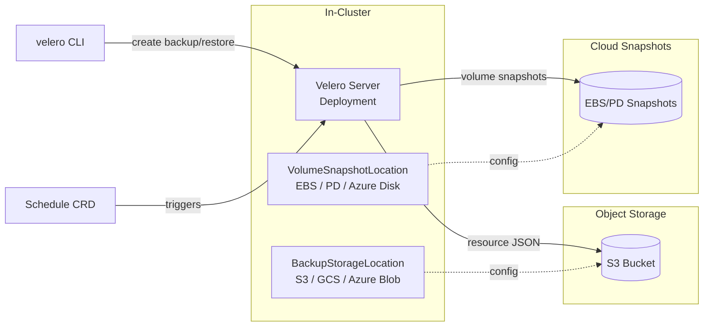
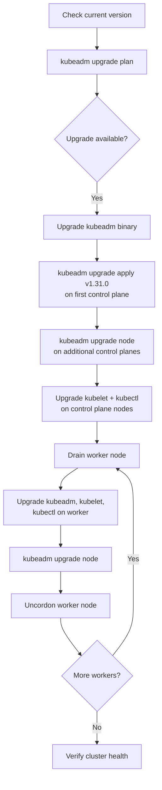

# Backup, Disaster Recovery, and Cluster Lifecycle

**Date:** 2026-04-24 | **Updated:** 2026-04-24
**Tags:** `kubernetes` `backup` `disaster-recovery` `velero` `upgrades`

## Table of Contents

- [Summary](#summary)
- [etcd Backup and Restore](#etcd-backup-and-restore)
  - [Why etcd Is the Single Source of Truth](#why-etcd-is-the-single-source-of-truth)
  - [Taking a Snapshot](#taking-a-snapshot)
  - [Automating Backups with a CronJob](#automating-backups-with-a-cronjob)
  - [Restoring from a Snapshot](#restoring-from-a-snapshot)
  - [Managed Kubernetes — etcd Is Not Your Problem](#managed-kubernetes--etcd-is-not-your-problem)
- [Velero — Kubernetes-Native Backup and Restore](#velero--kubernetes-native-backup-and-restore)
  - [Architecture](#architecture)
  - [Backup Scope and Scheduling](#backup-scope-and-scheduling)
  - [Restore — Same Cluster or Different Cluster](#restore--same-cluster-or-different-cluster)
  - [Volume Backup Strategies](#volume-backup-strategies)
  - [Backup Hooks for Application Consistency](#backup-hooks-for-application-consistency)
- [Cluster Upgrades](#cluster-upgrades)
  - [Version Skew Policy](#version-skew-policy)
  - [kubeadm Upgrade Workflow](#kubeadm-upgrade-workflow)
  - [Managed Kubernetes Upgrades](#managed-kubernetes-upgrades)
  - [API Deprecation Handling](#api-deprecation-handling)
- [Node Maintenance](#node-maintenance)
  - [Cordon, Drain, and Uncordon](#cordon-drain-and-uncordon)
  - [PodDisruptionBudgets During Maintenance](#poddisruptionbudgets-during-maintenance)
- [Blue-Green Cluster Upgrades](#blue-green-cluster-upgrades)
- [Infrastructure as Code for Clusters](#infrastructure-as-code-for-clusters)
  - [Terraform](#terraform)
  - [Crossplane](#crossplane)
  - [Managed Blueprints](#managed-blueprints)
- [Testing Disaster Recovery](#testing-disaster-recovery)
- [Related](#related)
- [References](#references)

## Summary

Your cluster is cattle, not a pet — but you still need to recover from disasters. This doc covers the entire lifecycle: backing up etcd (the brain), using Velero to snapshot workloads and volumes, upgrading clusters safely, draining nodes for maintenance, and standing up entirely new clusters with Infrastructure as Code. If you run Spring Boot or Node.js services on Kubernetes, the platform-level resilience in this doc is what keeps your applications alive when the infrastructure fails.

## etcd Backup and Restore

### Why etcd Is the Single Source of Truth

Every Kubernetes object — Deployments, Services, Secrets, ConfigMaps, RBAC rules — lives in etcd. If etcd is gone, the cluster is gone. The kubelets on your nodes can keep running existing containers, but nothing can be scheduled, scaled, or updated. No API server, no control plane.

**What etcd stores:**
- All resource definitions (spec + status)
- Lease objects (node heartbeats, leader election)
- Secrets and ConfigMaps (potentially containing database credentials for your Spring Boot apps)
- RBAC policies, ServiceAccounts, admission webhook configs

**What etcd does NOT store:**
- Container images (those live in your registry)
- Persistent volume data (that is on the underlying storage system)
- Application logs, metrics, traces

### Taking a Snapshot

```bash
# Set environment variables for etcd TLS authentication
export ETCDCTL_API=3
export ETCDCTL_ENDPOINTS=https://127.0.0.1:2379
export ETCDCTL_CACERT=/etc/kubernetes/pki/etcd/ca.crt
export ETCDCTL_CERT=/etc/kubernetes/pki/etcd/server.crt
export ETCDCTL_KEY=/etc/kubernetes/pki/etcd/server.key

# Take a snapshot
etcdctl snapshot save /backup/etcd-snapshot-$(date +%Y%m%d-%H%M%S).db

# Verify the snapshot is valid
etcdctl snapshot status /backup/etcd-snapshot-20260424-140000.db --write-table
```

Output looks like:

```
+---------+----------+------------+------------+
|  HASH   | REVISION | TOTAL KEYS | TOTAL SIZE |
+---------+----------+------------+------------+
| 3c8c269 |  1284503 |       1246 |     5.8 MB |
+---------+----------+------------+------------+
```

> **Rule of thumb:** A healthy production etcd is typically 50–200 MB. If it is growing past 500 MB, investigate — you may have too many Events, Leases, or CRDs accumulating.

### Automating Backups with a CronJob

For self-managed clusters, schedule snapshots with a CronJob or a systemd timer on the control plane node. A simple approach using a host-mounted CronJob:

```yaml
apiVersion: batch/v1
kind: CronJob
metadata:
  name: etcd-backup
  namespace: kube-system
spec:
  schedule: "0 */6 * * *"   # Every 6 hours
  concurrencyPolicy: Forbid
  successfulJobsHistoryLimit: 3
  failedJobsHistoryLimit: 3
  jobTemplate:
    spec:
      template:
        spec:
          hostNetwork: true
          nodeSelector:
            node-role.kubernetes.io/control-plane: ""
          tolerations:
            - key: node-role.kubernetes.io/control-plane
              effect: NoSchedule
          containers:
            - name: etcd-backup
              image: registry.k8s.io/etcd:3.5.16-0
              command:
                - /bin/sh
                - -c
                - |
                  TIMESTAMP=$(date +%Y%m%d-%H%M%S)
                  etcdctl snapshot save /backup/etcd-${TIMESTAMP}.db \
                    --endpoints=https://127.0.0.1:2379 \
                    --cacert=/etc/kubernetes/pki/etcd/ca.crt \
                    --cert=/etc/kubernetes/pki/etcd/server.crt \
                    --key=/etc/kubernetes/pki/etcd/server.key
                  # Keep only last 10 snapshots
                  ls -tp /backup/etcd-*.db | tail -n +11 | xargs -r rm --
              volumeMounts:
                - name: etcd-certs
                  mountPath: /etc/kubernetes/pki/etcd
                  readOnly: true
                - name: backup-dir
                  mountPath: /backup
          volumes:
            - name: etcd-certs
              hostPath:
                path: /etc/kubernetes/pki/etcd
            - name: backup-dir
              hostPath:
                path: /mnt/etcd-backups
          restartPolicy: OnFailure
```

> **Critical:** Copy snapshots off the control plane node to an external location (S3, GCS, NFS). A backup sitting on the same disk as etcd is not a backup.

### Restoring from a Snapshot

Restoring etcd is a destructive operation — you are replacing the entire cluster state with a point-in-time snapshot.

```bash
# 1. Stop the API server and etcd on ALL control plane nodes
#    (for kubeadm, move the static pod manifests out)
sudo mv /etc/kubernetes/manifests/kube-apiserver.yaml /tmp/
sudo mv /etc/kubernetes/manifests/etcd.yaml /tmp/

# 2. Restore the snapshot to a NEW data directory
#    NEVER restore into the existing data directory
ETCDCTL_API=3 etcdctl snapshot restore /backup/etcd-20260424-140000.db \
  --data-dir=/var/lib/etcd-restore \
  --name=controlplane1 \
  --initial-cluster=controlplane1=https://10.0.0.10:2380 \
  --initial-cluster-token=etcd-cluster-1 \
  --initial-advertise-peer-urls=https://10.0.0.10:2380

# 3. Replace the old data directory
sudo rm -rf /var/lib/etcd
sudo mv /var/lib/etcd-restore /var/lib/etcd
sudo chown -R etcd:etcd /var/lib/etcd  # adjust ownership if needed

# 4. Restore the static pod manifests to restart etcd and API server
sudo mv /tmp/etcd.yaml /etc/kubernetes/manifests/
sudo mv /tmp/kube-apiserver.yaml /etc/kubernetes/manifests/

# 5. Wait for API server to come back, then verify
kubectl get nodes
kubectl get pods --all-namespaces
```

**Multi-node etcd cluster:** You must restore the snapshot on every etcd member, each with its own `--name` and `--initial-advertise-peer-urls`. This is why many teams prefer a single etcd restore followed by re-joining members.

### Managed Kubernetes — etcd Is Not Your Problem

| Provider | etcd Backup | Your Responsibility |
|----------|-------------|---------------------|
| **EKS** | Fully managed, automatic | None — you cannot access etcd directly |
| **GKE** | Fully managed, automatic | None — Google handles it |
| **AKS** | Fully managed, automatic | None — Azure handles it |

On managed clusters, focus your DR effort on **workload-level** backup (Velero) rather than etcd. You still need to back up your Kubernetes resource definitions and persistent volume data.

## Velero — Kubernetes-Native Backup and Restore

Velero (v1.18, CNCF Sandbox as of 2026) is the standard tool for backing up and restoring Kubernetes resources and persistent volumes. Think of it as `pg_dump` for your entire cluster — resource definitions plus volume data.

### Architecture



**Components:**
- **Velero server** — a Deployment running in the `velero` namespace, watching for Backup and Restore CRDs
- **Plugins** — provider-specific plugins for object storage (AWS, GCP, Azure) and volume snapshots (CSI, provider-native)
- **BackupStorageLocation (BSL)** — where resource JSON is stored (S3 bucket, GCS bucket, etc.)
- **VolumeSnapshotLocation (VSL)** — where volume snapshots are created
- **CLI** — `velero` command for creating backups, restores, and schedules

### Backup Scope and Scheduling

```bash
# Install Velero with AWS plugin
velero install \
  --provider aws \
  --bucket my-velero-backups \
  --secret-file ./credentials-velero \
  --backup-location-config region=ap-northeast-1 \
  --snapshot-location-config region=ap-northeast-1 \
  --plugins velero/velero-plugin-for-aws:v1.11.0

# Full cluster backup
velero backup create full-cluster-20260424

# Namespace-scoped backup (just your staging env)
velero backup create staging-backup \
  --include-namespaces staging

# Label-selected backup (only your Node.js services)
velero backup create nodejs-services \
  --selector app.kubernetes.io/runtime=nodejs

# Exclude specific resources
velero backup create cluster-no-events \
  --exclude-resources events,events.events.k8s.io
```

**Scheduled backups** use a CRD with cron syntax:

```yaml
apiVersion: velero.io/v1
kind: Schedule
metadata:
  name: daily-production-backup
  namespace: velero
spec:
  schedule: "0 2 * * *"          # 2:00 AM daily
  template:
    includedNamespaces:
      - production
      - database
    includedResources:
      - "*"
    storageLocation: default
    volumeSnapshotLocations:
      - default
    ttl: 720h0m0s                # Retain for 30 days
    snapshotMoveData: false
    defaultVolumesToFsBackup: false
  useOwnerReferencesInBackup: false
```

```yaml
apiVersion: velero.io/v1
kind: Schedule
metadata:
  name: weekly-full-cluster
  namespace: velero
spec:
  schedule: "0 3 * * 0"          # Sunday 3:00 AM
  template:
    includedNamespaces:
      - "*"
    ttl: 2160h0m0s               # Retain for 90 days
```

### Restore — Same Cluster or Different Cluster

```bash
# List available backups
velero backup get

# Restore to the SAME cluster (e.g., after accidental deletion)
velero restore create --from-backup daily-production-backup-20260424020000

# Restore specific namespaces only
velero restore create --from-backup full-cluster-20260424 \
  --include-namespaces production

# Restore to a DIFFERENT cluster (disaster recovery / migration)
# 1. Install Velero on the new cluster pointing to the SAME BSL
# 2. Velero discovers existing backups automatically
velero backup get          # backups from old cluster appear
velero restore create --from-backup full-cluster-20260424

# Remap namespaces during restore (staging → production)
velero restore create --from-backup staging-backup \
  --namespace-mappings staging:production
```

> **Migration pattern:** Velero is commonly used to migrate workloads between clusters — from self-managed to EKS, from one region to another, or from an older K8s version to a new cluster.

### Volume Backup Strategies

| Strategy | How It Works | When to Use |
|----------|-------------|-------------|
| **CSI Snapshots** | Uses Kubernetes VolumeSnapshot API — fast, provider-native | Default choice for cloud-provisioned PVs (EBS, PD, Azure Disk) |
| **Restic / Kopia** | File-level backup — reads pod filesystem via `hostPath` | Cross-provider portability, NFS volumes, local-path PVs |
| **Snapshot Move Data** | CSI snapshot + upload to object storage | When you need snapshots portable across regions/accounts |

```bash
# Use file-level backup (Kopia) for all volumes by default
velero backup create with-volumes \
  --include-namespaces production \
  --default-volumes-to-fs-backup

# Or annotate specific pods to opt in/out
# In your Deployment pod template:
# annotations:
#   backup.velero.io/backup-volumes: data,logs
#   backup.velero.io/backup-volumes-excludes: tmp-cache
```

### Backup Hooks for Application Consistency

Raw volume snapshots can capture inconsistent data — a database mid-transaction, a write buffer not yet flushed. Backup hooks let you run commands inside pods before and after the snapshot:

```yaml
apiVersion: v1
kind: Pod
metadata:
  name: postgres-primary
  annotations:
    # Pre-backup: flush WAL and enter backup mode
    pre.hook.backup.velero.io/container: postgres
    pre.hook.backup.velero.io/command: >
      ["/bin/bash", "-c", "pg_basebackup --checkpoint=fast || psql -c \"SELECT pg_backup_start('velero');\""]
    pre.hook.backup.velero.io/timeout: 60s

    # Post-backup: exit backup mode
    post.hook.backup.velero.io/container: postgres
    post.hook.backup.velero.io/command: >
      ["/bin/bash", "-c", "psql -c \"SELECT pg_backup_stop();\""]
    post.hook.backup.velero.io/timeout: 30s
```

**For Spring Boot / Node.js apps:**
- Most stateless services need no hooks — just back up the Deployments and ConfigMaps
- If your app writes to local PVs (e.g., file uploads, embedded SQLite), add a pre-hook to flush writes
- Database-backed services: add hooks to the database pod, not the app pod

## Cluster Upgrades

### Version Skew Policy

Kubernetes enforces strict version compatibility between components:

```
kube-apiserver          v1.31  ← always the newest
kube-controller-manager v1.31  ← same or one minor behind (v1.30–v1.31)
kube-scheduler          v1.31  ← same or one minor behind (v1.30–v1.31)
kubelet                 v1.30  ← up to two minor behind  (v1.29–v1.31)
kubectl                 v1.32  ← one minor ahead or behind (v1.30–v1.32)
```

**The cardinal rule:** Always upgrade the control plane first, then the nodes. Never run kubelets newer than the API server.

### kubeadm Upgrade Workflow



```bash
# --- On the FIRST control plane node ---

# 1. Check what is available
sudo kubeadm upgrade plan

# 2. Upgrade kubeadm itself
sudo apt-get update
sudo apt-get install -y kubeadm=1.31.0-1.1
sudo kubeadm upgrade apply v1.31.0

# 3. Upgrade kubelet and kubectl
sudo apt-get install -y kubelet=1.31.0-1.1 kubectl=1.31.0-1.1
sudo systemctl daemon-reload
sudo systemctl restart kubelet

# --- On ADDITIONAL control plane nodes ---
sudo kubeadm upgrade node
# Then upgrade kubelet + kubectl as above

# --- On EACH worker node (one at a time) ---

# 4. From a machine with kubectl access:
kubectl drain worker-1 --ignore-daemonsets --delete-emptydir-data

# 5. SSH into the worker:
sudo apt-get install -y kubeadm=1.31.0-1.1
sudo kubeadm upgrade node
sudo apt-get install -y kubelet=1.31.0-1.1
sudo systemctl daemon-reload
sudo systemctl restart kubelet

# 6. Uncordon the worker:
kubectl uncordon worker-1
```

### Managed Kubernetes Upgrades

| Provider | Control Plane Upgrade | Node Pool Upgrade |
|----------|----------------------|-------------------|
| **EKS** | `aws eks update-cluster-version` — takes 15–25 min | Managed node group rolling update, or launch new node group |
| **GKE** | One-click or `gcloud container clusters upgrade` | Surge upgrade (add nodes, drain old), or blue-green node pools |
| **AKS** | `az aks upgrade --kubernetes-version` | Node-by-node rolling, or `az aks nodepool add` + migrate + delete |

**Managed upgrade strategy:**
1. Upgrade control plane (non-disruptive, automatic)
2. Create a **new node pool** with the new version
3. Cordon/drain the old node pool
4. Delete the old node pool once workloads are healthy

This is safer than in-place rolling updates because you can roll back by pointing traffic back to the old node pool.

### API Deprecation Handling

APIs get deprecated and eventually removed across Kubernetes versions. A v1.29 manifest using `policy/v1beta1/PodDisruptionBudget` will fail on v1.31 where that API version is gone.

```bash
# Check for deprecated APIs in your manifests BEFORE upgrading

# Option 1: pluto (scans Helm releases and live cluster)
pluto detect-all-in-cluster
pluto detect-files -d ./k8s-manifests/

# Option 2: kubectl deprecations plugin (via krew)
kubectl krew install deprecations
kubectl deprecations

# Option 3: kubent (kube-no-trouble)
kubent
```

**Sample pluto output:**

```
NAME                   KIND                      VERSION              REPLACEMENT        REMOVED   DEPRECATED   REPL AVAIL
my-pdb                 PodDisruptionBudget       policy/v1beta1       policy/v1          v1.25     v1.21        v1.21
my-ingress             Ingress                   extensions/v1beta1   networking/v1      v1.22     v1.19        v1.19
```

> **Pre-upgrade checklist:** Run `pluto` or `kubent` against your cluster and all Helm charts. Fix deprecated APIs before upgrading. This is especially important for Helm releases — the stored release manifest in the cluster may still reference old API versions even if your chart source is updated.

## Node Maintenance

### Cordon, Drain, and Uncordon

```bash
# Mark a node as unschedulable — existing Pods keep running, no NEW Pods land here
kubectl cordon worker-3
# Output: node/worker-3 cordoned

# Evict all Pods from the node (triggers graceful termination, respects PDBs)
kubectl drain worker-3 \
  --ignore-daemonsets \          # DaemonSet Pods cannot be evicted
  --delete-emptydir-data \       # Allow eviction of Pods using emptyDir
  --grace-period=60 \            # Seconds to wait for graceful shutdown
  --timeout=300s                 # Fail if drain takes longer than 5 minutes

# After maintenance (OS patch, kernel upgrade, etc.)
kubectl uncordon worker-3
# Output: node/worker-3 uncordoned — scheduling resumes
```

**What `drain` actually does:**
1. Cordons the node (marks `spec.unschedulable: true`)
2. Evicts each non-DaemonSet Pod via the Eviction API
3. The Eviction API checks PodDisruptionBudgets before allowing eviction
4. Evicted Pods are rescheduled to other nodes by their controllers (Deployment, StatefulSet, etc.)
5. Pods without a controller (bare Pods) are evicted and **not rescheduled** — they are gone

**Drain flags reference:**

| Flag | Purpose |
|------|---------|
| `--ignore-daemonsets` | Skip DaemonSet-managed Pods (they run on every node, cannot be evicted) |
| `--delete-emptydir-data` | Allow eviction even if Pods use `emptyDir` volumes (data will be lost) |
| `--grace-period=N` | Override the Pod's `terminationGracePeriodSeconds` |
| `--timeout=N` | Abort the drain if it takes too long (PDB blocking, stuck Pods) |
| `--force` | Delete Pods not managed by a controller (bare Pods) — use with caution |
| `--pod-selector=key=value` | Only drain Pods matching this selector |
| `--dry-run=client` | See what would be evicted without doing it |

### PodDisruptionBudgets During Maintenance

PDBs protect your services during voluntary disruptions (drain, upgrade). A drain will **block** if evicting a Pod would violate its PDB.

```yaml
apiVersion: policy/v1
kind: PodDisruptionBudget
metadata:
  name: api-server-pdb
  namespace: production
spec:
  minAvailable: 2              # At least 2 replicas must stay running
  selector:
    matchLabels:
      app: api-server

---
apiVersion: policy/v1
kind: PodDisruptionBudget
metadata:
  name: worker-pdb
  namespace: production
spec:
  maxUnavailable: 1            # At most 1 replica can be down at a time
  selector:
    matchLabels:
      app: background-worker
```

> **Node.js / Spring Boot tip:** If your service runs 3 replicas, set `minAvailable: 2` or `maxUnavailable: 1`. This ensures a rolling drain across nodes never takes your service below safe capacity. Without a PDB, `kubectl drain` will evict all your Pods from a node simultaneously.

## Blue-Green Cluster Upgrades

For major version jumps or infrastructure changes, in-place upgrades carry risk. A blue-green cluster strategy eliminates that risk:

```mermaid
flowchart LR
    subgraph Blue Cluster v1.30
        B_CP[Control Plane]
        B_N1[Node Pool]
        B_W[Workloads]
    end

    subgraph Green Cluster v1.31
        G_CP[Control Plane]
        G_N1[Node Pool]
        G_W[Workloads]
    end

    LB[Load Balancer / DNS]
    LB -->|current traffic| Blue Cluster v1.30
    LB -.->|switch after validation| Green Cluster v1.31

    B_W -->|Velero backup| OBJ[(Object Storage)]
    OBJ -->|Velero restore| G_W
```

**Workflow:**
1. Provision a new cluster at the target version (Terraform, `eksctl`, etc.)
2. Install the same add-ons (Velero, cert-manager, monitoring stack) via GitOps
3. Restore workloads using Velero backup from the old cluster — or let ArgoCD/Flux sync from Git
4. Run smoke tests and integration tests against the new cluster
5. Switch DNS or load balancer to point to the new cluster
6. Keep the old cluster running for a rollback window (24–72 hours)
7. Decommission the old cluster

**When to use blue-green clusters:**
- Major Kubernetes version upgrades (e.g., v1.28 → v1.31)
- Changing cloud provider or region
- Replacing the CNI plugin or service mesh
- Infrastructure overhaul (different instance types, networking model)

## Infrastructure as Code for Clusters

### Terraform

Terraform is the most common way to provision and manage Kubernetes clusters declaratively:

```hcl
# EKS cluster with Terraform (simplified)
module "eks" {
  source  = "terraform-aws-modules/eks/aws"
  version = "~> 20.0"

  cluster_name    = "production"
  cluster_version = "1.31"

  vpc_id     = module.vpc.vpc_id
  subnet_ids = module.vpc.private_subnets

  eks_managed_node_groups = {
    general = {
      instance_types = ["m7i.xlarge"]
      min_size       = 3
      max_size       = 10
      desired_size   = 5
    }
    spot = {
      instance_types = ["m7i.xlarge", "m6i.xlarge", "m5.xlarge"]
      capacity_type  = "SPOT"
      min_size       = 0
      max_size       = 20
      desired_size   = 3
    }
  }
}
```

### Crossplane

Crossplane (v2.2, CNCF Graduated) turns Kubernetes itself into a control plane for cloud infrastructure. You define cloud resources using CRDs, and Crossplane's controllers reconcile them — the same model Kubernetes uses for Pods and Services, extended to RDS instances, S3 buckets, and VPCs.

```yaml
# Provision an RDS instance using Crossplane
apiVersion: rds.aws.upbound.io/v1beta1
kind: Instance
metadata:
  name: production-db
spec:
  forProvider:
    region: ap-northeast-1
    engine: postgres
    engineVersion: "16"
    instanceClass: db.r6g.xlarge
    allocatedStorage: 100
    masterUsername: admin
    masterPasswordSecretRef:
      name: db-master-password
      namespace: crossplane-system
      key: password
  providerConfigRef:
    name: aws-provider
```

**Why Crossplane matters for backend devs:**
- Your Spring Boot app needs an RDS instance, an S3 bucket, and a Redis cluster. With Crossplane, you define those as Kubernetes manifests alongside your app manifests
- One `kubectl apply` to provision both the infrastructure and the workloads
- GitOps tools (ArgoCD, Flux) manage infrastructure and apps identically

### Managed Blueprints

| Tool | What It Does |
|------|-------------|
| **EKS Blueprints** (Terraform/CDK) | Opinionated EKS cluster + add-ons (ArgoCD, Karpenter, metrics-server) in one module |
| **GKE Autopilot** | Google manages the nodes entirely — you deploy Pods, Google handles the rest |
| **AKS Automatic** | Azure manages node pools, scaling, and OS upgrades — similar to GKE Autopilot |

> **Practical advice:** Start with a managed blueprint or Terraform module. Hand-rolling cluster provisioning is educational but not worth the maintenance burden in production.

## Testing Disaster Recovery

A backup you have never restored is not a backup — it is a hope.

**Regular Restore Drills:**
- Schedule quarterly full-cluster restore drills to a staging environment
- Time the drill from "disaster declared" to "service healthy" — that is your actual RTO
- Compare the backup timestamp to the restore result — the gap is your actual RPO

**RTO and RPO Targets:**

| Metric | Definition | Typical Target |
|--------|-----------|----------------|
| **RPO** (Recovery Point Objective) | Maximum acceptable data loss, measured in time | 1–6 hours (Velero schedule frequency) |
| **RTO** (Recovery Time Objective) | Maximum acceptable downtime, from failure to recovery | 1–4 hours for full cluster rebuild |

**Chaos Engineering for DR:**

```bash
# Delete a namespace to simulate catastrophic failure, then restore
# (In a STAGING environment only!)
kubectl delete namespace staging-test

# Restore from Velero
velero restore create chaos-test-restore \
  --from-backup daily-production-backup-20260424020000 \
  --include-namespaces staging-test

# Verify all resources are back
kubectl get all -n staging-test
```

**DR Testing Checklist:**
- [ ] etcd snapshot restore tested (for self-managed clusters)
- [ ] Velero full-cluster restore tested to a different cluster
- [ ] Velero namespace-level restore tested
- [ ] Volume data verified after restore (not just resource definitions)
- [ ] Application health checks pass after restore
- [ ] DNS/LB failover tested (for multi-region)
- [ ] RTO and RPO documented and validated against business requirements
- [ ] Runbook exists and someone other than the author has executed it

## Related

- [Cluster Architecture](../core-concepts/cluster-architecture.md) — etcd's role in the control plane, how components interact
- [Multi-Tenancy and Cost Optimization](multi-tenancy-and-cost.md) — cluster strategy decisions that affect your DR plan
- [Database Backup and Recovery](../../database/operations/backup-and-recovery.md) — application-level database backups complement Velero volume snapshots
- [GitOps and Continuous Delivery](gitops-and-cd.md) — ArgoCD/Flux as an alternative restore strategy (re-sync from Git)
- [Autoscaling](../operations/autoscaling.md) — Karpenter/Cluster Autoscaler behavior during node drain

## References

- [Kubernetes: Operating etcd clusters](https://kubernetes.io/docs/tasks/administer-cluster/configure-upgrade-etcd/) — official etcd backup/restore guide
- [Kubernetes: Version Skew Policy](https://kubernetes.io/releases/version-skew-policy/) — component version compatibility rules
- [Velero Documentation](https://velero.io/docs/) — official Velero docs (backup, restore, plugins, hooks)
- [Velero GitHub — vmware-tanzu/velero](https://github.com/vmware-tanzu/velero) — source, releases, and plugin ecosystem
- [Crossplane Documentation](https://docs.crossplane.io/) — Kubernetes-native infrastructure management
- [kubeadm Upgrade Guide](https://kubernetes.io/docs/tasks/administer-cluster/kubeadm/kubeadm-upgrade/) — step-by-step kubeadm upgrade process
- [Pluto — Find Deprecated APIs](https://github.com/FairwindsOps/pluto) — scan cluster and manifests for deprecated Kubernetes APIs
- [EKS Blueprints](https://aws-ia.github.io/terraform-aws-eks-blueprints/) — opinionated Terraform modules for production EKS clusters
