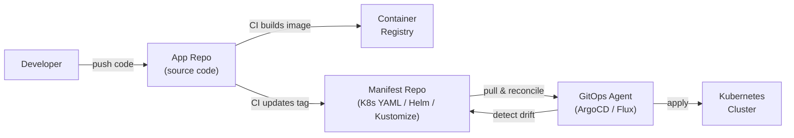
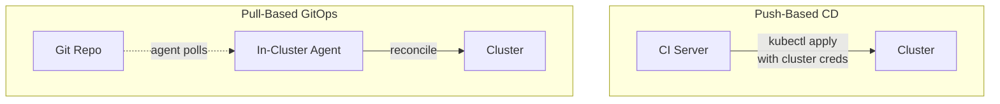
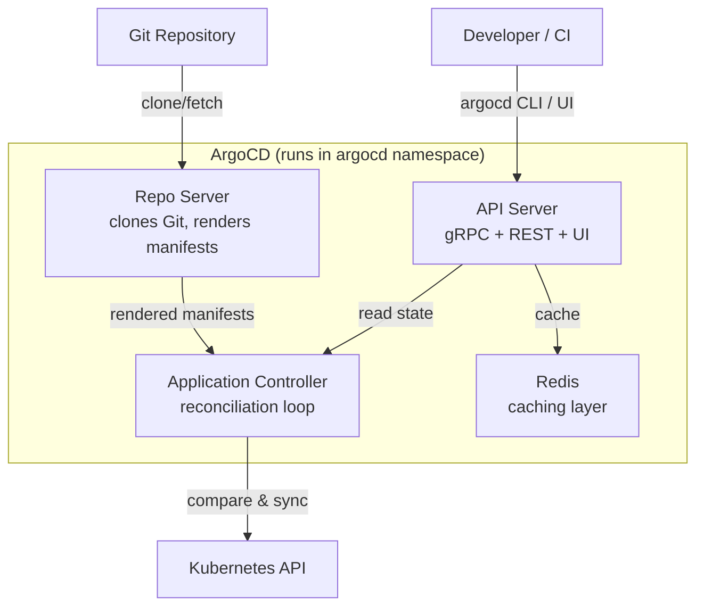
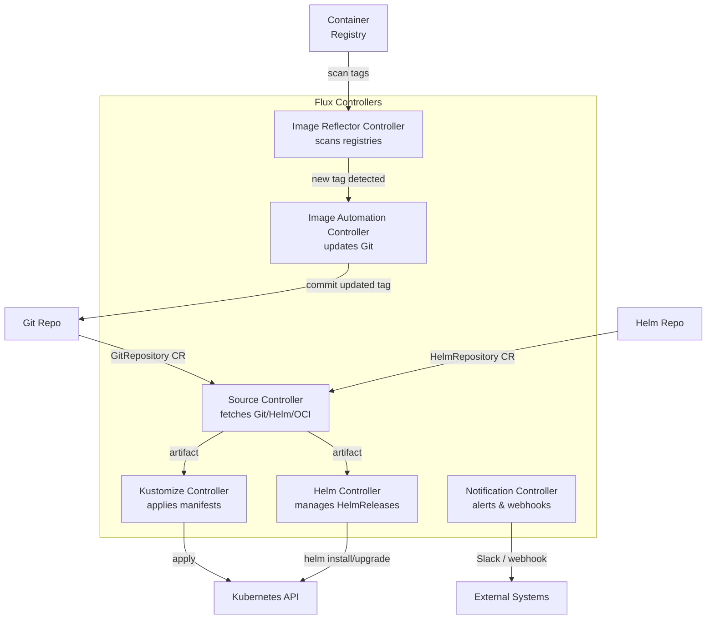
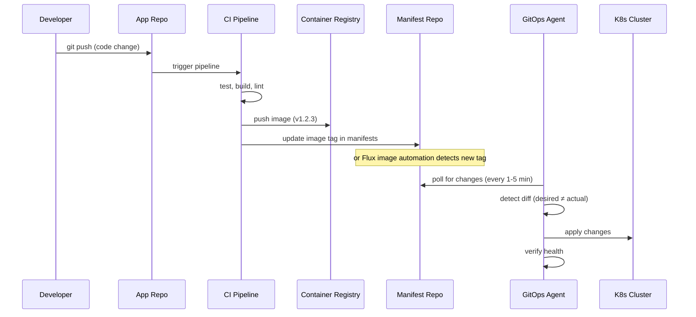

# GitOps and Continuous Delivery — ArgoCD, Flux, and Deployment Pipelines

**Date:** 2026-04-24 | **Updated:** 2026-04-24
**Tags:** `kubernetes` `gitops` `argocd` `flux` `continuous-delivery`

## Table of Contents

- [Summary](#summary)
- [GitOps Principles](#gitops-principles)
  - [The Four Principles](#the-four-principles)
  - [Push-Based CD vs Pull-Based GitOps](#push-based-cd-vs-pull-based-gitops)
  - [Benefits of GitOps](#benefits-of-gitops)
- [ArgoCD](#argocd)
  - [Architecture](#architecture)
  - [Application CRD](#application-crd)
  - [Sync Policies](#sync-policies)
  - [App-of-Apps Pattern](#app-of-apps-pattern)
  - [ApplicationSet — Scaling to Many Applications](#applicationset--scaling-to-many-applications)
  - [Multi-Cluster Management](#multi-cluster-management)
  - [The Web UI](#the-web-ui)
- [Flux v2](#flux-v2)
  - [Architecture](#flux-v2-architecture)
  - [GitRepository and Kustomization](#gitrepository-and-kustomization)
  - [HelmRelease — Declarative Helm](#helmrelease--declarative-helm)
  - [Image Update Automation](#image-update-automation)
  - [Multi-Tenancy](#multi-tenancy)
- [Progressive Delivery with Argo Rollouts](#progressive-delivery-with-argo-rollouts)
  - [Canary Deployments](#canary-deployments)
  - [Blue-Green Deployments](#blue-green-deployments)
  - [Analysis Runs](#analysis-runs)
  - [Traffic Management Integration](#traffic-management-integration)
- [CI/CD Pipeline Integration](#cicd-pipeline-integration)
  - [The GitOps Workflow](#the-gitops-workflow)
  - [App Repo vs Manifest Repo](#app-repo-vs-manifest-repo)
- [Secrets in GitOps](#secrets-in-gitops)
- [ArgoCD vs Flux — Decision Guide](#argocd-vs-flux--decision-guide)
- [Related](#related)
- [References](#references)

## Summary

Traditional CI/CD pipelines push artifacts into clusters from external systems — a Jenkins or GitHub Actions runner runs `kubectl apply` with credentials that have broad cluster access. GitOps inverts this: an agent **inside** the cluster continuously reconciles the actual state against a desired state declared in Git. Git becomes the single source of truth. Rollbacks are `git revert`. Audit trails are `git log`. Drift is detected and corrected automatically. This document covers the two dominant GitOps tools (ArgoCD and Flux v2), progressive delivery with Argo Rollouts, and how your CI pipeline feeds into the GitOps loop.



## GitOps Principles

### The Four Principles

The OpenGitOps project (a CNCF sandbox) defines four principles that distinguish GitOps from generic CI/CD:

| # | Principle | What It Means |
|---|-----------|---------------|
| 1 | **Declarative** | The entire desired system state is expressed declaratively (Kubernetes YAML, Helm charts, Kustomize overlays) |
| 2 | **Versioned and immutable** | The desired state is stored in a system that enforces immutability and versioning — Git is the canonical choice |
| 3 | **Pulled automatically** | Agents in the cluster continuously pull the desired state and apply it — no external system pushes changes in |
| 4 | **Continuously reconciled** | Agents detect divergence between desired and actual state and correct it without human intervention |

### Push-Based CD vs Pull-Based GitOps



| Aspect | Push-Based (CI pushes) | Pull-Based (GitOps) |
|--------|----------------------|---------------------|
| **Credentials** | CI needs cluster credentials | Agent inside cluster has access; Git only needs read access |
| **Drift detection** | None — state can drift silently | Continuous reconciliation catches drift |
| **Audit trail** | Scattered across CI logs | Unified in Git history |
| **Rollback** | Re-run old pipeline (if artifacts still exist) | `git revert` — the commit IS the rollback |
| **Security** | Wide blast radius if CI is compromised | Agent has least-privilege access to its namespace |
| **Firewall** | CI must reach the cluster API | Agent calls out to Git — no inbound cluster access needed |

> **Backend dev mental model:** Think of push-based as your controller calling the database directly from a cron job. Pull-based is an event-driven consumer that reacts to changes in a message queue (Git) and reconciles local state.

### Benefits of GitOps

- **Audit trail** — every deployment is a Git commit with author, timestamp, and diff
- **Easy rollback** — `git revert <sha>` triggers a new reconciliation to the previous state
- **Consistent environments** — staging and production are different branches or directories, same process
- **Self-healing** — manual `kubectl edit` changes are detected and reverted to match Git
- **Developer experience** — deploy by opening a PR, not by running scripts with cluster access
- **Compliance** — merge approvals map directly to deployment approvals

## ArgoCD

ArgoCD is the most widely adopted GitOps tool. It comes from the Argo project (CNCF graduated) and provides a rich UI, multi-cluster support, and a declarative Application CRD.

### Architecture



| Component | Responsibility |
|-----------|---------------|
| **API Server** | Serves the web UI, gRPC API, and handles authentication (SSO/OIDC/RBAC) |
| **Repo Server** | Clones Git repos, runs Helm template / Kustomize build / plain YAML rendering. Stateless — horizontally scalable |
| **Application Controller** | The reconciliation loop. Compares live cluster state against rendered manifests, triggers sync when they diverge |
| **Redis** | Caches repo state and app manifests to avoid hammering Git on every reconciliation cycle |

### Application CRD

The `Application` is ArgoCD's central resource. It connects a Git source to a cluster destination:

```yaml
apiVersion: argoproj.io/v1alpha1
kind: Application
metadata:
  name: order-service
  namespace: argocd
spec:
  project: default          # RBAC boundary (AppProject)
  source:
    repoURL: https://github.com/myorg/k8s-manifests.git
    targetRevision: main     # branch, tag, or commit SHA
    path: apps/order-service/overlays/production
    # For Helm charts:
    # chart: order-service
    # helm:
    #   valueFiles:
    #     - values-production.yaml
  destination:
    server: https://kubernetes.default.svc  # in-cluster
    namespace: order-service
  syncPolicy:
    automated:
      prune: true            # delete resources removed from Git
      selfHeal: true         # revert manual cluster changes
    syncOptions:
      - CreateNamespace=true
      - ServerSideApply=true
    retry:
      limit: 5
      backoff:
        duration: 5s
        factor: 2
        maxDuration: 3m
```

**Key fields explained:**

- **`source`** — where the manifests live. Supports Git repos (path to directory), Helm chart repos, or OCI registries
- **`destination`** — which cluster and namespace to deploy into
- **`syncPolicy.automated`** — enables automatic sync when Git changes (without this, sync is manual via UI/CLI)
- **`prune: true`** — resources deleted from Git are deleted from the cluster (without this, orphaned resources remain)
- **`selfHeal: true`** — if someone runs `kubectl edit` and changes a resource, ArgoCD reverts it to match Git

### Sync Policies

| Policy | Default | Effect |
|--------|---------|--------|
| **Manual sync** | yes | User clicks "Sync" in UI or runs `argocd app sync` |
| **Automated sync** | no | ArgoCD syncs automatically when Git changes are detected |
| **Self-heal** | no | Reverts in-cluster drift back to Git-declared state |
| **Prune** | no | Deletes resources from cluster that no longer exist in Git |
| **Server-side apply** | no | Uses server-side apply instead of `kubectl apply` — better for CRDs and large resources |
| **Replace** | no | `kubectl replace` instead of apply — use sparingly |

> **Warning:** Enable `prune` and `selfHeal` together for true GitOps, but test in staging first. Self-heal will revert any manual hotfix within seconds.

### App-of-Apps Pattern

Instead of creating each Application manually, create one "root" Application that points at a directory containing other Application manifests:

```
k8s-manifests/
├── argocd/
│   └── root-app.yaml          # The root Application
├── apps/
│   ├── order-service.yaml     # Application manifest
│   ├── payment-service.yaml   # Application manifest
│   ├── user-service.yaml      # Application manifest
│   └── monitoring-stack.yaml  # Application manifest
```

The root Application:

```yaml
apiVersion: argoproj.io/v1alpha1
kind: Application
metadata:
  name: root
  namespace: argocd
spec:
  project: default
  source:
    repoURL: https://github.com/myorg/k8s-manifests.git
    targetRevision: main
    path: apps           # directory containing Application YAMLs
  destination:
    server: https://kubernetes.default.svc
    namespace: argocd    # Applications are created in argocd namespace
  syncPolicy:
    automated:
      selfHeal: true
      prune: true
```

Now adding a new service is a PR that adds an Application YAML to the `apps/` directory. The root app picks it up automatically.

### ApplicationSet — Scaling to Many Applications

ApplicationSet is a controller (bundled with ArgoCD since v2.3) that generates Application resources from templates. Instead of writing one Application YAML per service per environment, you write one ApplicationSet and let generators produce them.

**Git directory generator** — one Application per directory:

```yaml
apiVersion: argoproj.io/v1alpha1
kind: ApplicationSet
metadata:
  name: cluster-apps
  namespace: argocd
spec:
  generators:
    - git:
        repoURL: https://github.com/myorg/k8s-manifests.git
        revision: main
        directories:
          - path: apps/*      # each subdirectory becomes an Application
  template:
    metadata:
      name: '{{path.basename}}'
    spec:
      project: default
      source:
        repoURL: https://github.com/myorg/k8s-manifests.git
        targetRevision: main
        path: '{{path}}'
      destination:
        server: https://kubernetes.default.svc
        namespace: '{{path.basename}}'
      syncPolicy:
        automated:
          prune: true
          selfHeal: true
        syncOptions:
          - CreateNamespace=true
```

**Available generators:**

| Generator | Use Case |
|-----------|----------|
| **List** | Literal list of parameter sets (simple multi-env) |
| **Cluster** | One Application per registered ArgoCD cluster |
| **Git directory** | One Application per directory in a Git repo |
| **Git file** | Read parameters from JSON/YAML files in Git |
| **Pull request** | Create preview environments from open PRs |
| **Matrix** | Cross-product of two generators (e.g., services x clusters) |
| **Merge** | Combine generators with override precedence |
| **Plugin** | Custom generator via ConfigMap-backed plugin |

**Matrix generator** — deploy every service to every cluster:

```yaml
spec:
  generators:
    - matrix:
        generators:
          - git:
              repoURL: https://github.com/myorg/k8s-manifests.git
              revision: main
              directories:
                - path: apps/*
          - clusters:
              selector:
                matchLabels:
                  env: production
  template:
    metadata:
      name: '{{path.basename}}-{{name}}'   # service-cluster
    spec:
      source:
        path: '{{path}}'
      destination:
        server: '{{server}}'
        namespace: '{{path.basename}}'
```

**Go template support** — for complex rendering, enable `goTemplate: true` in the ApplicationSet spec to use Go template functions (`toUpper`, `replace`, conditionals) instead of the default simple `{{param}}` substitution.

### Multi-Cluster Management

ArgoCD can manage applications across multiple clusters:

```bash
# Register an external cluster
argocd cluster add my-staging-context --name staging

# The cluster appears in ArgoCD's cluster list
argocd cluster list
```

Each Application's `destination.server` points to a cluster URL. The cluster generator in ApplicationSet can deploy the same manifests across all registered clusters matching a label selector.

**Architecture for multi-cluster:**
- One ArgoCD instance in a management cluster
- Registers spoke clusters via kubeconfig or ServiceAccount tokens
- ApplicationSets generate Applications per cluster
- Network: ArgoCD needs outbound access to spoke cluster API servers

### The Web UI

ArgoCD's web dashboard provides:

- **Application tree** — visualizes all Kubernetes resources (Deployment -> ReplicaSet -> Pods) with health status
- **Diff view** — shows exactly what will change before you sync (like `git diff` for your cluster)
- **Sync status** — green (synced), yellow (out of sync), red (degraded/failed), with detailed error messages
- **Live logs** — stream pod logs directly from the UI
- **Resource actions** — restart Deployments, delete stuck pods without `kubectl`
- **RBAC-gated** — SSO integration (OIDC, SAML, GitHub, GitLab) with fine-grained AppProject RBAC

## Flux v2

Flux v2 is the other major CNCF GitOps tool. Where ArgoCD is a monolithic application with a UI, Flux is a set of specialized controllers that compose together. No UI out of the box — it is CLI-first and designed for automation.

### Flux v2 Architecture



| Controller | Responsibility |
|------------|---------------|
| **source-controller** | Fetches artifacts from Git repos, Helm repos, OCI registries, and S3-compatible storage. Produces versioned artifacts for other controllers |
| **kustomize-controller** | Applies Kustomize overlays or plain YAML to the cluster. Handles dependency ordering, health checks, and garbage collection |
| **helm-controller** | Manages HelmRelease CRDs — installs, upgrades, tests, and rolls back Helm charts declaratively |
| **notification-controller** | Sends alerts (Slack, Teams, webhook) on reconciliation events. Receives webhooks from Git providers to trigger immediate reconciliation |
| **image-reflector-controller** | Scans container registries for new image tags matching a policy |
| **image-automation-controller** | Commits updated image tags back to Git when new images are detected |

### GitRepository and Kustomization

The two foundational CRDs that wire Git to your cluster:

```yaml
# 1. Tell Flux where to find manifests
apiVersion: source.toolkit.fluxcd.io/v1
kind: GitRepository
metadata:
  name: k8s-manifests
  namespace: flux-system
spec:
  interval: 5m              # poll every 5 minutes
  url: https://github.com/myorg/k8s-manifests.git
  ref:
    branch: main
  secretRef:
    name: git-credentials    # SSH key or token for private repos
---
# 2. Tell Flux what to apply from that source
apiVersion: kustomize.toolkit.fluxcd.io/v1
kind: Kustomization
metadata:
  name: order-service
  namespace: flux-system
spec:
  interval: 10m             # reconcile every 10 minutes
  sourceRef:
    kind: GitRepository
    name: k8s-manifests
  path: ./apps/order-service/overlays/production
  prune: true               # garbage collect removed resources
  healthChecks:
    - apiVersion: apps/v1
      kind: Deployment
      name: order-service
      namespace: order-service
  timeout: 3m
  targetNamespace: order-service
  dependsOn:                # apply after infrastructure is ready
    - name: infrastructure
```

**Key differences from ArgoCD Application:**

- Source and sync are **separate CRDs** — one GitRepository can feed multiple Kustomizations
- **`dependsOn`** lets you order deployments: infrastructure first, then apps
- **Health checks** — Flux waits for specified resources to become ready before marking reconciliation as successful
- Since Flux v2.7, the kustomize-controller watches referenced ConfigMaps and Secrets and triggers reconciliation immediately when they change (when labeled with `reconcile.fluxcd.io/watch: Enabled`)

### HelmRelease — Declarative Helm

Flux manages Helm charts as Kubernetes resources rather than CLI invocations:

```yaml
apiVersion: source.toolkit.fluxcd.io/v1
kind: HelmRepository
metadata:
  name: bitnami
  namespace: flux-system
spec:
  interval: 1h
  url: https://charts.bitnami.com/bitnami
---
apiVersion: helm.toolkit.fluxcd.io/v2
kind: HelmRelease
metadata:
  name: postgresql
  namespace: database
spec:
  interval: 30m
  chart:
    spec:
      chart: postgresql
      version: "16.x"        # semver constraint
      sourceRef:
        kind: HelmRepository
        name: bitnami
        namespace: flux-system
  values:
    auth:
      postgresPassword: ${POSTGRES_PASSWORD}
    primary:
      resources:
        requests:
          memory: 256Mi
          cpu: 250m
  upgrade:
    remediation:
      retries: 3
      remediateLastFailure: true
  rollback:
    cleanupOnFail: true
```

This is the GitOps equivalent of `helm install` — the HelmRelease CRD is in Git, Flux's helm-controller installs and upgrades the chart, and failed upgrades trigger automatic rollback.

### Image Update Automation

Flux can detect new container images and commit updated tags back to Git — closing the loop between CI and GitOps without any external tooling:

```yaml
# 1. Scan the registry for new tags
apiVersion: image.toolkit.fluxcd.io/v1beta2
kind: ImageRepository
metadata:
  name: order-service
  namespace: flux-system
spec:
  image: ghcr.io/myorg/order-service
  interval: 5m
---
# 2. Define which tags to track
apiVersion: image.toolkit.fluxcd.io/v1beta2
kind: ImagePolicy
metadata:
  name: order-service
  namespace: flux-system
spec:
  imageRepositoryRef:
    name: order-service
  policy:
    semver:
      range: ">=1.0.0"       # track latest semver tag
    # Alternative policies:
    # alphabetical: { order: asc }
    # numerical: { order: asc }
---
# 3. Commit the updated tag back to Git
apiVersion: image.toolkit.fluxcd.io/v1beta2
kind: ImageUpdateAutomation
metadata:
  name: order-service
  namespace: flux-system
spec:
  interval: 5m
  sourceRef:
    kind: GitRepository
    name: k8s-manifests
  git:
    checkout:
      ref:
        branch: main
    commit:
      author:
        name: flux-bot
        email: flux@myorg.com
      messageTemplate: |
        chore: update order-service to {{.NewImage}}
    push:
      branch: main
  update:
    path: ./apps/order-service
    strategy: Setters         # uses marker comments in YAML
```

In your deployment YAML, mark the image line with a setter comment:

```yaml
spec:
  containers:
    - name: order-service
      image: ghcr.io/myorg/order-service:1.2.3  # {"$imagepolicy": "flux-system:order-service"}
```

Flux's image automation (GA since Flux v2.7) detects the new tag, updates the comment-marked line, and commits the change to Git — which then triggers a normal Kustomization reconciliation.

### Multi-Tenancy

Flux supports multi-tenancy by scoping GitRepository and Kustomization resources per tenant:

```yaml
# Tenant namespace with RBAC
apiVersion: v1
kind: Namespace
metadata:
  name: team-orders
---
# Tenant-scoped GitRepository
apiVersion: source.toolkit.fluxcd.io/v1
kind: GitRepository
metadata:
  name: team-orders-manifests
  namespace: team-orders          # scoped to tenant namespace
spec:
  url: https://github.com/team-orders/k8s-manifests.git
  interval: 5m
---
# Tenant-scoped Kustomization
apiVersion: kustomize.toolkit.fluxcd.io/v1
kind: Kustomization
metadata:
  name: team-orders-apps
  namespace: team-orders
spec:
  serviceAccountName: team-orders-deployer   # RBAC-limited SA
  sourceRef:
    kind: GitRepository
    name: team-orders-manifests
  path: ./apps
  prune: true
  targetNamespace: team-orders               # can only deploy here
```

The `serviceAccountName` field is the key — Flux impersonates that ServiceAccount when applying resources, so the tenant can only deploy to namespaces their SA has access to. Combined with NetworkPolicies and ResourceQuotas, this provides strong isolation.

## Progressive Delivery with Argo Rollouts

Standard Kubernetes Deployments only support `RollingUpdate` and `Recreate`. Argo Rollouts is a separate CRD controller that provides canary and blue-green deployments with automated analysis.

> Argo Rollouts is **complementary** to ArgoCD. ArgoCD manages the Git-to-cluster sync. Rollouts manages the deployment strategy within the cluster.

### Canary Deployments

```yaml
apiVersion: argoproj.io/v1alpha1
kind: Rollout
metadata:
  name: order-service
spec:
  replicas: 5
  revisionHistoryLimit: 3
  selector:
    matchLabels:
      app: order-service
  template:
    metadata:
      labels:
        app: order-service
    spec:
      containers:
        - name: order-service
          image: ghcr.io/myorg/order-service:2.0.0
          ports:
            - containerPort: 8080
  strategy:
    canary:
      canaryService: order-service-canary      # Service for canary pods
      stableService: order-service-stable       # Service for stable pods
      steps:
        - setWeight: 10         # 10% traffic to canary
        - pause: { duration: 5m }
        - analysis:
            templates:
              - templateName: success-rate
            args:
              - name: service-name
                value: order-service-canary
        - setWeight: 30         # 30% traffic
        - pause: { duration: 5m }
        - analysis:
            templates:
              - templateName: success-rate
        - setWeight: 60         # 60% traffic
        - pause: { duration: 5m }
        - setWeight: 100        # full promotion
```

The rollout progresses through steps: shift traffic, pause, run analysis, and repeat. If any analysis fails, the rollout automatically rolls back.

### Blue-Green Deployments

```yaml
strategy:
  blueGreen:
    activeService: order-service             # points to current production
    previewService: order-service-preview    # points to new version
    autoPromotionEnabled: false              # require manual promotion
    prePromotionAnalysis:
      templates:
        - templateName: smoke-tests
    scaleDownDelaySeconds: 30                # keep old ReplicaSet briefly
```

Blue-green creates the full new ReplicaSet alongside the old one. The preview Service lets you test before cutting over. `prePromotionAnalysis` runs automated checks before promotion.

### Analysis Runs

AnalysisTemplates define automated checks that gate rollout progression:

```yaml
apiVersion: argoproj.io/v1alpha1
kind: AnalysisTemplate
metadata:
  name: success-rate
spec:
  args:
    - name: service-name
  metrics:
    - name: success-rate
      interval: 60s
      count: 5                     # run 5 times
      successCondition: result[0] >= 0.95   # 95% success rate
      failureLimit: 2              # tolerate 2 failures
      provider:
        prometheus:
          address: http://prometheus.monitoring:9090
          query: |
            sum(rate(http_requests_total{service="{{args.service-name}}",status=~"2.."}[5m]))
            /
            sum(rate(http_requests_total{service="{{args.service-name}}"}[5m]))
```

**Supported analysis providers:**

| Provider | Use Case |
|----------|----------|
| **Prometheus** | Query success rates, latency percentiles, error counts |
| **Datadog** | Same, via Datadog metrics API |
| **New Relic** | NRQL queries against New Relic |
| **Wavefront** | Wavefront/VMware Aria metrics |
| **Kayenta** | Netflix's automated canary analysis |
| **Web** | HTTP call to an external endpoint, check response |
| **Job** | Run a Kubernetes Job (integration tests, smoke tests) |

### Traffic Management Integration

Argo Rollouts integrates with service meshes and ingress controllers for fine-grained traffic splitting:

| Provider | How It Works |
|----------|--------------|
| **Istio** | Rollouts manages a VirtualService to shift traffic weights between canary and stable subsets |
| **NGINX Ingress** | Uses the `nginx.ingress.kubernetes.io/canary-weight` annotation |
| **AWS ALB** | Configures ALB target group weights via the AWS Load Balancer Controller |
| **SMI** | Traffic Split resource (Service Mesh Interface standard) |
| **Gateway API** | HTTPRoute weight-based routing (newer, growing support) |

Without a traffic management provider, Rollouts uses replica count ratios — if you want 20% canary traffic, it scales canary to 1 pod and stable to 4.

## CI/CD Pipeline Integration

### The GitOps Workflow



### App Repo vs Manifest Repo

Separating application source code from Kubernetes manifests is a GitOps best practice:

| Aspect | App Repo | Manifest Repo |
|--------|----------|---------------|
| **Contains** | Application source, Dockerfile, unit tests | Kubernetes YAML, Helm values, Kustomize overlays |
| **CI pipeline** | Build, test, push image | Updated by CI (image tag) or image automation |
| **Audience** | Application developers | Platform team + GitOps agent |
| **Change frequency** | Every code change | Only when deploying a new version or changing config |
| **Access** | Broad team access | Restricted — changes here trigger production deployments |

**Why separate?**
- A commit in the app repo should not trigger a deployment (CI might fail)
- The manifest repo's Git history is your deployment log
- Different RBAC: junior devs can push to app repo but need PR approval on manifest repo
- Avoid noisy Git history — app repo commits (hundreds/day) vs manifest changes (a few/day)

**Typical CI step that updates the manifest repo:**

```yaml
# GitHub Actions example
- name: Update manifest repo
  run: |
    git clone https://github.com/myorg/k8s-manifests.git
    cd k8s-manifests
    # Using kustomize
    cd apps/order-service/overlays/production
    kustomize edit set image ghcr.io/myorg/order-service=ghcr.io/myorg/order-service:${{ github.sha }}
    git add .
    git commit -m "chore: deploy order-service ${{ github.sha }}"
    git push
```

Alternative: skip the CI manifest update entirely and let Flux's image update automation detect the new tag and commit it. This eliminates CI needing write access to the manifest repo.

## Secrets in GitOps

The one thing you **never** commit to Git in plaintext is Secrets. Three approaches:

| Tool | How It Works | Pros | Cons |
|------|-------------|------|------|
| **Sealed Secrets** (Bitnami) | Encrypt Secrets client-side with `kubeseal`. Only the controller in the cluster can decrypt | Simple, self-contained, no external dependency | Key rotation requires re-encrypting all secrets; cluster-specific |
| **SOPS** (Mozilla) | Encrypts values (not keys) in YAML/JSON files. Keys stored in AWS KMS, GCP KMS, Azure Key Vault, or age/PGP | Can diff encrypted files (keys visible), multi-cloud key providers | Requires KMS access for encryption/decryption |
| **External Secrets Operator** | CRD that syncs secrets from external stores (AWS Secrets Manager, HashiCorp Vault, GCP Secret Manager) into Kubernetes Secrets | Secrets never touch Git at all; central secret management | Additional dependency; requires connectivity to external store |

```yaml
# External Secrets Operator example
apiVersion: external-secrets.io/v1beta1
kind: ExternalSecret
metadata:
  name: order-service-db
  namespace: order-service
spec:
  refreshInterval: 1h
  secretStoreRef:
    name: aws-secrets-manager
    kind: ClusterSecretStore
  target:
    name: order-service-db-credentials
    creationPolicy: Owner
  data:
    - secretKey: username
      remoteRef:
        key: prod/order-service/db
        property: username
    - secretKey: password
      remoteRef:
        key: prod/order-service/db
        property: password
```

> **Recommendation for backend devs:** Start with External Secrets Operator if you already use AWS Secrets Manager or HashiCorp Vault. Use SOPS if you want secrets in Git (encrypted) for full GitOps auditability. Sealed Secrets works for simpler setups.

See [Secrets Management and Supply Chain Security](../security/secrets-and-supply-chain.md) for deeper coverage.

## ArgoCD vs Flux — Decision Guide

| Dimension | ArgoCD | Flux v2 |
|-----------|--------|---------|
| **UI** | Rich web dashboard with tree view, diff, logs | No built-in UI (use Weave GitOps or Capacitor) |
| **Architecture** | Monolithic (one app, multiple components) | Composable microcontrollers |
| **Multi-cluster** | First-class: register clusters, deploy across them | Possible but requires one Flux per cluster or Flux Operator |
| **Helm** | Renders with `helm template`, applies as plain manifests | Uses `helm install/upgrade` natively via HelmRelease CRD |
| **Image automation** | Requires external tooling (Keel, CI scripts) | Built-in (ImageRepository + ImagePolicy + ImageUpdateAutomation) |
| **Multi-tenancy** | AppProject RBAC scoping | ServiceAccount impersonation per Kustomization |
| **ApplicationSet** | Powerful templating with 8+ generator types | N/A (uses directory structure + multiple Kustomizations) |
| **Notifications** | Built-in (Slack, webhook, etc.) | notification-controller with providers |
| **Learning curve** | UI helps beginners; CRDs are straightforward | CLI-first; steeper for non-CLI users |
| **CNCF status** | Graduated (under Argo project) | Graduated |

**Choose ArgoCD when:** you want a UI for visibility, manage multiple clusters centrally, or need ApplicationSet's powerful templating.

**Choose Flux when:** you prefer CLI-first automation, need built-in image update automation, want composable controllers, or run in multi-tenant environments with strong isolation requirements.

**Both are excellent.** Many organizations run ArgoCD for platform-team-managed infrastructure and Flux for team-level application deployments, or vice versa.

## Related

- [Helm and Kustomize — Packaging and Templating Kubernetes Manifests](../operations/helm-and-kustomize.md) — the manifest formats that GitOps tools consume
- [Secrets Management and Supply Chain Security](../security/secrets-and-supply-chain.md) — deeper coverage of Sealed Secrets, ESO, and image provenance
- [Multi-Tenancy, Cost Optimization, and Cluster Strategy](multi-tenancy-and-cost.md) — namespace isolation, multi-cluster strategy, and FinOps
- [Kubernetes Monitoring and Logging](../operations/monitoring-and-logging.md) — Prometheus setup that feeds Argo Rollouts analysis runs

## References

- [ArgoCD Documentation](https://argo-cd.readthedocs.io/en/stable/) — official docs covering Application, ApplicationSet, RBAC, and multi-cluster
- [Flux Documentation](https://fluxcd.io/flux/) — official Flux v2 guides, CRD references, and migration docs
- [OpenGitOps Principles](https://opengitops.dev/) — CNCF standard defining the four GitOps principles
- [Argo Rollouts Documentation](https://argo-rollouts.readthedocs.io/en/stable/) — canary, blue-green, analysis templates, and traffic management
- [External Secrets Operator](https://external-secrets.io/) — CRD-based secret synchronization from external stores
- [Flux v2.7 GA Announcement](https://fluxcd.io/blog/2025/09/flux-v2.7.0/) — image automation GA, ConfigMap/Secret watching, OTel tracing
- [ArgoCD ApplicationSet Generators](https://argo-cd.readthedocs.io/en/stable/operator-manual/applicationset/Generators/) — full generator reference (Git, Cluster, Matrix, Merge, Plugin, PR)
- [CNCF GitOps Working Group](https://github.com/cncf/tag-app-delivery/tree/main/gitops-wg) — community definitions and ecosystem landscape
