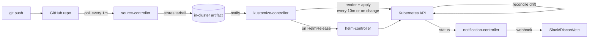
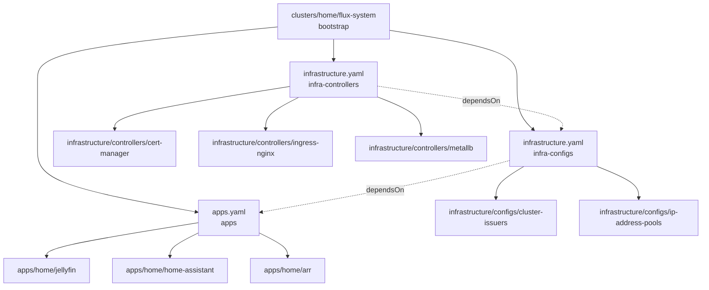

# Homelab GitOps — Flux Bootstrap and Single-Operator Patterns

**Date:** 2026-05-08 | **Updated:** 2026-05-08
**Tags:** `kubernetes` `homelab` `gitops` `flux` `sops` `solo-operator`

---

## Table of Contents

- [Summary](#summary)
- [1. Why GitOps for a homelab](#1-why-gitops-for-a-homelab)
- [2. Flux bootstrap](#2-flux-bootstrap)
- [3. Repo structure](#3-repo-structure)
- [4. App-of-Apps for solo operator](#4-app-of-apps-for-solo-operator)
- [5. Secrets without Vault — SOPS](#5-secrets-without-vault--sops)
- [6. Image update automation](#6-image-update-automation)
- [7. Backup strategy](#7-backup-strategy)
- [8. Enterprise vs Homelab GitOps — comparison table](#8-enterprise-vs-homelab-gitops--comparison-table)
- [9. Worked examples](#9-worked-examples)
- [10. Operator playbook](#10-operator-playbook)
- [Related](#related)
- [References](#references)

---

## Summary

GitOps in a homelab is less about coordinating teams and more about giving your single brain a real audit trail and a 30-minute rebuild path after the SD card you forgot existed finally dies. This doc walks through bootstrapping Flux v2 against a freshly built k3s cluster (from Doc 24), structuring a single Git repo that holds infrastructure plus apps, encrypting secrets with SOPS+age (no Vault, no managed KMS), wiring image-update automation, and the day-2 chores you actually do alone at 11pm. It explicitly contrasts every choice against the enterprise GitOps patterns from Doc 20 — most of which you do not need at home, and a few of which are genuinely worth practising before you see them at work.

---

## 1. Why GitOps for a homelab

The first time `kubectl apply -f` saves you from a fumbled config, it feels like power. The fifth time a stray `kubectl edit` leaves you wondering at midnight whether the live ConfigMap actually matches the one in `~/manifests/`, it stops being fun. GitOps is the cure for kubectl drift even when "the team" is one person.

**The four real benefits at home:**

1. **Audit trail of one.** Three months from now you will not remember why you set `image.tag: 1.27.3-alt-kernel` on Jellyfin. `git log apps/media/jellyfin/` will. Commit messages are notes-to-future-you.
2. **Cluster rebuild as a routine.** Cheap homelab hardware fails. Disk wear on a Pi SD card, a botched `apt upgrade`, a kernel panic on a Mini PC after a power blip. With GitOps the recovery is `k3sup install` (or `k3s install`) → `flux bootstrap` → wait. Without it, recovery is a `~/dotfiles`-style scavenger hunt.
3. **Practising enterprise patterns where the blast radius is your Plex library.** Reconciliation loops, drift detection, declarative everything, suspending a Kustomization before a risky change — these are the same skills you use at work, and at home there's nobody paging you when you break it.
4. **Forced declarative discipline.** "I'll just `kubectl edit` this real quick" is how you lose an afternoon. With Flux running, ad-hoc edits get reverted on the next reconciliation. That feels annoying for a week and then you stop reaching for `kubectl edit`.

**The rebuild test:**

> If your homelab cluster died right now — drives wiped, hostnames gone, MAC addresses reassigned — could you rebuild a working version of it in 30 minutes from a coffee shop?

Be honest. If the answer involves "I'd dig through screenshots of the Home Assistant UI to remember the integrations" or "I'd have to remember which Helm chart version had the working ingress", you don't have GitOps yet — you have a snowflake.

A real rebuild path, from cold:

```text
1. Reinstall OS on nodes (Ubuntu Server 24.04 LTS, NixOS, Talos, etc.)
2. curl -sfL https://get.k3s.io | sh -s - --disable traefik --disable servicelb
3. Restore /var/lib/rancher/k3s/server/db/snapshots/* from B2 (or fresh start)
4. flux bootstrap github --owner=$USER --repository=homelab --path=clusters/home
5. kubectl create secret generic sops-age -n flux-system --from-file=age.agekey
6. Wait ~10 min for Flux to reconcile; verify apps come up
```

Step 5 is the only piece that lives outside Git (the age private key). Everything else is in the repo. That's the goal.

**Contrast with `kubectl apply` drift over time:**

| Time | `kubectl apply` workflow | GitOps workflow |
|------|--------------------------|-----------------|
| Day 1 | `kubectl apply -f deploy.yaml` — works | `git push` — Flux applies it |
| Week 2 | `kubectl edit deploy nginx` to bump replicas | `git commit` bumps replicas; Flux reconciles |
| Month 2 | "Wait, is this image tag in Git?" | `git log` shows the tag bump and who/why |
| Month 6 | "Why is this CronJob suspended?" | `git blame` shows the suspend commit + message |
| Disaster | `find ~/ -name "*.yaml"` and pray | `git clone && flux bootstrap` |

The kubectl-apply path doesn't fail dramatically — it fails gradually, and you only notice on the day it matters.

---

## 2. Flux bootstrap

Flux v2 (latest stable: **v2.8.x** as of mid-2026) is a set of Kubernetes controllers (`source-controller`, `kustomize-controller`, `helm-controller`, `notification-controller`, plus optional `image-reflector-controller` and `image-automation-controller`) that watch a Git repo and apply what they find. The `flux` CLI is mostly a glorified Kustomize generator that bootstraps the controllers and gives you a few day-2 verbs.

**Pre-flight check:**

```bash
flux check --pre
```

This validates Kubernetes version (Flux v2.8 requires k8s 1.33+), kubectl context, and that no existing Flux installation is in the way. Run it before bootstrap, run it before upgrades, run it when something feels off.

**The bootstrap command (GitHub, personal repo):**

```bash
export GITHUB_TOKEN=ghp_xxxxxxxxxxxxxxxxxxxxxx  # PAT with repo scope
flux bootstrap github \
  --owner=quan0401 \
  --repository=homelab \
  --branch=main \
  --path=clusters/home \
  --personal \
  --token-auth
```

**What each flag does:**

- `--owner` — your GitHub user or org.
- `--repository` — created if it doesn't exist (private by default for `--personal`).
- `--branch` — the default branch Flux will track.
- `--path` — the directory inside the repo Flux watches as the cluster's root. `clusters/home` is convention; if you later add a second cluster (e.g., a Raspberry Pi for outdoor sensors), you'd bootstrap it with `--path=clusters/pi-outdoor` and Flux puts each in its own subtree.
- `--personal` — tells Flux this is a user repo, not an org repo (affects API calls).
- `--token-auth` — uses the PAT over HTTPS instead of generating an SSH deploy key. Simpler for solo use; SSH deploy key is the alternative below.

**SSH deploy key vs PAT — pick one:**

| Auth method | Pros | Cons | Use when |
|-------------|------|------|----------|
| **HTTPS + PAT** (`--token-auth`) | Simplest; one secret in cluster | Token has broad scope unless fine-grained PAT used | Solo homelab; rotate annually |
| **SSH deploy key** (default) | Per-repo scope; no token in cluster | More moving pieces; need to upload public key to GitHub | You want least-privilege even at home |

For homelab, the PAT path is fine — use a **fine-grained PAT** scoped to just the `homelab` repo with `Contents: read/write` and `Metadata: read`. Rotate it once a year when you renew your domain registration; tie it to a calendar reminder.

**What gets created in the cluster:**

After bootstrap, look in your repo at `clusters/home/flux-system/`:

```text
clusters/home/flux-system/
├── gotk-components.yaml   # ~6000 lines: CRDs + Deployments for all Flux controllers
├── gotk-sync.yaml         # GitRepository + Kustomization that points back at this repo
└── kustomization.yaml     # references the two above
```

`gotk-components.yaml` is the controllers themselves — pinned to whatever Flux version your CLI is. Upgrades happen by re-running `flux bootstrap` with a newer CLI; it diffs and updates this file.

`gotk-sync.yaml` contains two resources:

```yaml
apiVersion: source.toolkit.fluxcd.io/v1
kind: GitRepository
metadata:
  name: flux-system
  namespace: flux-system
spec:
  interval: 1m
  ref:
    branch: main
  url: https://github.com/quan0401/homelab
  secretRef:
    name: flux-system
---
apiVersion: kustomize.toolkit.fluxcd.io/v1
kind: Kustomization
metadata:
  name: flux-system
  namespace: flux-system
spec:
  interval: 10m
  path: ./clusters/home
  prune: true
  sourceRef:
    kind: GitRepository
    name: flux-system
```

The `GitRepository` polls every 1 minute. The `Kustomization` reconciles every 10 minutes. Reconciliation = re-apply the rendered manifests, which auto-corrects drift.

**Sync interval tuning:**

- `GitRepository.spec.interval: 1m` — how often Flux checks Git for new commits. Keep this low (30s–1m); it's a cheap GitHub API call.
- `Kustomization.spec.interval: 10m` — how often the rendered manifests get re-applied to fix drift. Higher = less reconciliation churn, slower drift correction.

For a homelab, `10m` for the Kustomization is fine — drift is rare because nobody else is touching the cluster. Lower it to `1m` only when you're actively iterating on a feature ("did my new HelmRelease work?") and want fast feedback. You can also force an immediate reconcile any time:

```bash
flux reconcile kustomization flux-system --with-source
```

`--with-source` tells Flux to first refresh the GitRepository (re-clone), then re-apply. Without it, only the apply step runs.

**The bootstrap reconciliation loop:**



Five controllers, one repo, one direction: Git is the source of truth, the cluster is the cache.

---

## 3. Repo structure

The structure that scales from "one app" to "twenty apps" without rewrites is the layout from `fluxcd/flux2-kustomize-helm-example`. Adopt it on day one.

```text
homelab/
├── clusters/
│   └── home/
│       ├── flux-system/                  # bootstrap output (managed by flux CLI)
│       │   ├── gotk-components.yaml
│       │   ├── gotk-sync.yaml
│       │   └── kustomization.yaml
│       ├── infrastructure.yaml           # Kustomization → infrastructure/
│       └── apps.yaml                     # Kustomization → apps/home/
├── infrastructure/
│   ├── controllers/                      # things that install CRDs / operators
│   │   ├── cert-manager/
│   │   │   ├── namespace.yaml
│   │   │   ├── release.yaml              # HelmRelease
│   │   │   ├── repository.yaml           # HelmRepository
│   │   │   └── kustomization.yaml
│   │   ├── ingress-nginx/
│   │   │   └── ...
│   │   └── metallb/
│   │       └── ...
│   └── configs/                          # things that consume those CRDs
│       ├── cluster-issuers.yaml          # cert-manager ClusterIssuer
│       ├── ip-address-pools.yaml         # MetalLB IPAddressPool + L2Advertisement
│       └── kustomization.yaml
├── apps/
│   ├── base/                             # shared definitions
│   │   ├── jellyfin/
│   │   │   ├── deployment.yaml
│   │   │   ├── service.yaml
│   │   │   ├── pvc.yaml
│   │   │   └── kustomization.yaml
│   │   ├── home-assistant/
│   │   │   ├── release.yaml              # HelmRelease
│   │   │   └── kustomization.yaml
│   │   └── arr/
│   │       ├── sonarr/
│   │       ├── radarr/
│   │       └── kustomization.yaml
│   └── home/                             # cluster-specific overlays
│       ├── jellyfin/
│       │   ├── kustomization.yaml        # references ../../base/jellyfin
│       │   ├── ingress.yaml              # cluster-specific ingress
│       │   └── secret.enc.yaml           # SOPS-encrypted
│       ├── home-assistant/
│       │   └── ...
│       └── arr/
│           └── ...
└── .sops.yaml                            # SOPS encryption rules
```

**Why this layout works:**

- `clusters/home/` is what Flux bootstraps against. It contains *only* Kustomization resources that point at other directories. This separation means a second cluster (`clusters/edge/`) can pick a subset of infrastructure and a different overlay of apps without forking.
- `infrastructure/controllers/` vs `infrastructure/configs/` — controllers install CRDs (cert-manager's `Certificate` CRD, MetalLB's `IPAddressPool` CRD); configs use those CRDs. They must be applied in order, which is what `dependsOn` enforces.
- `apps/base/` is reusable across clusters; `apps/home/` is the per-cluster overlay that adds ingress hostnames, SOPS secrets, resource limits.

**The chaining via Kustomization `dependsOn`:**

```yaml
# clusters/home/infrastructure.yaml
---
apiVersion: kustomize.toolkit.fluxcd.io/v1
kind: Kustomization
metadata:
  name: infra-controllers
  namespace: flux-system
spec:
  interval: 1h
  retryInterval: 1m
  timeout: 5m
  sourceRef:
    kind: GitRepository
    name: flux-system
  path: ./infrastructure/controllers
  prune: true
  wait: true        # wait for HelmReleases to be Ready
---
apiVersion: kustomize.toolkit.fluxcd.io/v1
kind: Kustomization
metadata:
  name: infra-configs
  namespace: flux-system
spec:
  dependsOn:
    - name: infra-controllers
  interval: 1h
  sourceRef:
    kind: GitRepository
    name: flux-system
  path: ./infrastructure/configs
  prune: true
```

```yaml
# clusters/home/apps.yaml
---
apiVersion: kustomize.toolkit.fluxcd.io/v1
kind: Kustomization
metadata:
  name: apps
  namespace: flux-system
spec:
  dependsOn:
    - name: infra-configs
  interval: 10m
  sourceRef:
    kind: GitRepository
    name: flux-system
  path: ./apps/home
  prune: true
  wait: true
  decryption:
    provider: sops
    secretRef:
      name: sops-age
```

The chain: `flux-system` → `infra-controllers` → `infra-configs` → `apps`. Without `dependsOn`, an `Ingress` for Jellyfin might be applied before `ingress-nginx` is installed; the resource creates fine, but no traffic reaches it. With `wait: true` + `dependsOn`, Flux makes sure each layer is healthy before moving on.

**Repo structure as a graph:**



---

## 4. App-of-Apps for solo operator

Once you have more than three apps, the question becomes: do I have one giant `Kustomization` that applies *all* apps, or one per app?

**The two extremes:**

```text
EXTREME A — One monolithic Kustomization
clusters/home/apps.yaml → applies all of apps/home/

  Pros: simple; one resource to suspend during maintenance
  Cons: one bad manifest in any app blocks the whole reconciliation;
        rolling back one app means git-reverting a commit that
        may touch others; reconciliation is sequential

EXTREME B — One Kustomization per app
clusters/home/jellyfin.yaml, home-assistant.yaml, sonarr.yaml, ...

  Pros: failure isolation; per-app suspend/resume; parallel reconciliation
  Cons: 15+ near-identical YAML files; harder to reason about ordering
```

**The middle ground that actually works at home:** one Kustomization per *logical group* of apps that share fate.

```yaml
# clusters/home/apps-media.yaml
apiVersion: kustomize.toolkit.fluxcd.io/v1
kind: Kustomization
metadata:
  name: apps-media
  namespace: flux-system
spec:
  dependsOn:
    - name: infra-configs
  interval: 10m
  path: ./apps/home/media
  sourceRef:
    kind: GitRepository
    name: flux-system
  prune: true
  decryption:
    provider: sops
    secretRef:
      name: sops-age
---
# clusters/home/apps-home-automation.yaml
apiVersion: kustomize.toolkit.fluxcd.io/v1
kind: Kustomization
metadata:
  name: apps-home-automation
  namespace: flux-system
spec:
  dependsOn:
    - name: infra-configs
  interval: 10m
  path: ./apps/home/home-automation
  sourceRef:
    kind: GitRepository
    name: flux-system
  prune: true
  decryption:
    provider: sops
    secretRef:
      name: sops-age
```

`apps/home/media/` contains Jellyfin, Sonarr, Radarr, Prowlarr, Bazarr — they share a media volume and naturally rev together. `apps/home/home-automation/` contains Home Assistant, Mosquitto, Zigbee2MQTT, ESPHome — they share an MQTT bus. A bad commit in Jellyfin shouldn't block a Home Assistant rollout; a Mosquitto reload is a fate-shared event for everything in home-automation.

**Trade-off summary:**

| Granularity | Rollout granularity | Blast radius | Reconciliation speed | YAML overhead |
|-------------|---------------------|--------------|---------------------|----------------|
| One monolithic | Coarse (all-or-nothing) | Whole cluster of apps | Slow (sequential) | Lowest |
| Per logical group | Per-group | One group | Parallel across groups | Moderate |
| One per app | Fine | One app | Maximum parallelism | Highest |

For a homelab with 5–20 apps, **per logical group** is the sweet spot. You get blast-radius isolation where it matters (don't let an *arr glitch take down your thermostat) without 20 nearly identical Kustomization files.

---

## 5. Secrets without Vault — SOPS

The hardest "but how" of GitOps in any cluster: how do you put secrets in Git? In an enterprise, the answer is HashiCorp Vault, AWS Secrets Manager via External Secrets Operator (ESO), or Sealed Secrets. In a homelab, the right answer is almost always **SOPS + age**.

**Why SOPS+age beats the alternatives at home:**

| Tool | Where the encryption key lives | Setup complexity | Good for homelab? |
|------|--------------------------------|------------------|-------------------|
| **SOPS + age** | One file on your laptop + one Secret in cluster | Lowest | Yes |
| **Sealed Secrets** | In-cluster controller's private key | Low (covered in Doc 15) | Workable, but key rotation is harder |
| **External Secrets + Vault** | Vault server (extra moving piece) | High (covered in Doc 10) | Overkill; you'd be running Vault for one consumer |
| **External Secrets + cloud KMS** | AWS/GCP KMS | Medium, but $$$ | No — defeats self-hosting |

SOPS encrypts only the values in a YAML file, leaving keys in cleartext so diffs stay readable in `git log`. Age is a small modern alternative to GPG (no keyring, no web of trust, no `gpg-agent` quirks). The combination is what FiloSottile's `age` repo and Mozilla's `sops` repo were built to do together.

**Setup, top to bottom:**

```bash
# 1. Install tools (macOS via Homebrew; adjust for your OS)
brew install sops age

# 2. Generate an age key (the private key is what unlocks secrets)
mkdir -p ~/.config/sops/age
age-keygen -o ~/.config/sops/age/keys.txt
# stdout shows: Public key: age1abc...xyz

# 3. Note your public key — you'll put this in .sops.yaml
grep "public key" ~/.config/sops/age/keys.txt
```

`age-keygen` writes a file containing both the public key (as a comment) and the private key (one line, starts with `AGE-SECRET-KEY-`). Back up `keys.txt` somewhere offline — losing it means you can't decrypt anything you encrypted.

**`.sops.yaml` at the repo root:**

```yaml
creation_rules:
  - path_regex: apps/.*\.enc\.yaml$
    encrypted_regex: ^(data|stringData)$
    age: age1abc...xyz   # your public key
  - path_regex: infrastructure/.*\.enc\.yaml$
    encrypted_regex: ^(data|stringData)$
    age: age1abc...xyz
```

The `path_regex` says "anything matching `*.enc.yaml` under apps/ or infrastructure/ should be encrypted with this age key". The `encrypted_regex` limits encryption to `data:` and `stringData:` fields — so `metadata.name`, `metadata.namespace`, etc. stay in cleartext (and diffable).

**Encrypting a secret:**

```bash
# Author the plaintext version first
cat > apps/home/home-assistant/secret.yaml <<'EOF'
apiVersion: v1
kind: Secret
metadata:
  name: home-assistant-secrets
  namespace: home-automation
type: Opaque
stringData:
  postgres-password: "supersecret"
  oauth-client-secret: "another-secret"
EOF

# Move to .enc.yaml so the .sops.yaml rule picks it up
mv apps/home/home-assistant/secret.yaml apps/home/home-assistant/secret.enc.yaml

# Encrypt in place
sops --encrypt --in-place apps/home/home-assistant/secret.enc.yaml
```

The result has the same keys but the values are replaced with `ENC[AES256_GCM,...]` blobs and a `sops:` metadata block at the bottom listing the age recipients. Commit it. The cleartext never enters Git history.

**To edit later:**

```bash
sops apps/home/home-assistant/secret.enc.yaml
# opens $EDITOR with decrypted contents; re-encrypts on save
```

**Wiring Flux to decrypt:**

The cluster needs the *private* age key. Create a Secret in `flux-system` (this is the one piece of state that lives outside Git):

```bash
kubectl create secret generic sops-age \
  --namespace=flux-system \
  --from-file=age.agekey=$HOME/.config/sops/age/keys.txt
```

Note the `--from-file=age.agekey=...` form — Flux's `kustomize-controller` looks for secret keys ending in `.agekey`. The filename matters.

Then on every Kustomization that needs to decrypt, add:

```yaml
spec:
  decryption:
    provider: sops
    secretRef:
      name: sops-age
```

In our layout, that's `apps.yaml` (and any per-group `apps-*.yaml`). The Flux Kustomization handling `flux-system` itself doesn't need decryption.

**Contrast with the alternatives:**

- **Sealed Secrets** (Doc 15): the controller generates a keypair *inside the cluster*; you encrypt with `kubeseal` against the cluster's public key. Rotating the key requires re-sealing every secret. SOPS+age decouples the key from the cluster — same secret can be decrypted on your laptop, in CI, or on any cluster that has the private key.
- **External Secrets Operator** (Doc 10): pulls secrets from an external KMS at runtime. Right answer when you have a KMS already. Wrong answer for a homelab where the KMS would be… your laptop? You'd still need somewhere to keep the secret.

Stick with SOPS+age until you genuinely need to share the cluster with someone else.

---

## 6. Image update automation

Once GitOps is wired, "deploy a new version" should be a Git commit, not a `kubectl set image`. Flux's image-automation suite watches container registries and writes new tags back to your repo for you.

**Three CRDs work together (`image.toolkit.fluxcd.io/v1`):**

1. **`ImageRepository`** — "scan this registry every N minutes for tags".
2. **`ImagePolicy`** — "of those tags, pick the one I should be running".
3. **`ImageUpdateAutomation`** — "when the policy picks a new tag, commit it to Git".

**The setters: marker comments in YAML:**

Wherever you want a tag updated, you mark the line with a comment Flux understands:

```yaml
# apps/base/jellyfin/deployment.yaml
spec:
  containers:
    - name: jellyfin
      image: jellyfin/jellyfin:10.10.7  # {"$imagepolicy": "flux-system:jellyfin"}
```

Or for a HelmRelease:

```yaml
spec:
  values:
    image:
      repository: ghcr.io/home-assistant/home-assistant  # {"$imagepolicy": "flux-system:home-assistant:name"}
      tag: "2026.5.1"                                     # {"$imagepolicy": "flux-system:home-assistant:tag"}
```

The `:tag` / `:name` / `:digest` suffixes tell Flux *which part* of the image reference to write into.

**`ImageRepository` — the scanner:**

```yaml
apiVersion: image.toolkit.fluxcd.io/v1
kind: ImageRepository
metadata:
  name: jellyfin
  namespace: flux-system
spec:
  image: jellyfin/jellyfin
  interval: 1h
  # secretRef: { name: regcred }   # only for private registries
```

Hourly is plenty for upstream containers; you don't need to scan every 5 minutes for Jellyfin patches.

**`ImagePolicy` — semver:**

```yaml
apiVersion: image.toolkit.fluxcd.io/v1
kind: ImagePolicy
metadata:
  name: jellyfin
  namespace: flux-system
spec:
  imageRepositoryRef:
    name: jellyfin
  policy:
    semver:
      range: ">=10.10.0 <11.0.0"   # auto-rollforward within 10.x
```

Semver range expressions (`^10.10`, `~10.10.7`, `>=10.10.0 <11.0.0`) follow the standard masterminds/semver dialect.

**`ImagePolicy` — regex (for upstreams that don't follow semver):**

```yaml
spec:
  policy:
    alphabetical:
      order: asc
  filterTags:
    pattern: "^v(?P<ts>[0-9]+)$"
    extract: "$ts"
```

This handles tags like `v20260507`, `v20260508`, picking the highest by timestamp.

**`ImageUpdateAutomation` — the committer:**

```yaml
apiVersion: image.toolkit.fluxcd.io/v1
kind: ImageUpdateAutomation
metadata:
  name: flux-system
  namespace: flux-system
spec:
  interval: 30m
  sourceRef:
    kind: GitRepository
    name: flux-system
  git:
    checkout:
      ref:
        branch: main
    commit:
      author:
        email: fluxbot@quan0401.dev
        name: fluxbot
      messageTemplate: |
        chore: bump {{range .Updated.Images}}{{.Identifier}}{{end}} to {{range .Updated.Images}}{{.NewTag}}{{end}}

        Files:
        {{range $file, $_ := .Changed.FileChanges -}}
        - {{ $file }}
        {{ end -}}
    push:
      branch: main
  update:
    path: ./apps
    strategy: Setters
```

`strategy: Setters` is the only supported strategy — it tells Flux to use the `# {"$imagepolicy": "..."}` markers. The bot commits directly to `main` for a homelab; in production you'd push to a branch and use a notification controller to open a PR.

**Optional: cosign + sigstore for commit signing.**

If you want the bot's commits signed (so you can verify in `git log` that they came from Flux and not a compromised account), Flux supports cosign-based signing via the GitOps Toolkit's keyless workflow. For a homelab this is mostly cosplay — your single-user PAT either compromised or it isn't. Worth knowing it exists; not worth the setup cost unless you're using it as practice for work.

**The day this saves you:** when Home Assistant cuts a `2026.5.2` patch release that fixes a Zigbee bug at 11pm. Flux picks it up within the hour, commits, applies, your lights work. No `kubectl set image`, no manual chart bump, no remembering. Just `git log apps/home/home-automation/` the next morning.

---

## 7. Backup strategy

GitOps gives you a free recovery path for *manifests*. It does not give you a recovery path for **etcd state**, **PersistentVolume contents**, or the **age private key**. Plan for those separately.

**Layer 1 — etcd snapshots (k3s built-in):**

k3s has a built-in scheduled etcd snapshotter. Configure on the server node:

```bash
# /etc/rancher/k3s/config.yaml on the server
etcd-snapshot-schedule-cron: "0 */6 * * *"   # every 6 hours
etcd-snapshot-retention: 28                  # keep 28 (= 7 days)
etcd-snapshot-dir: /var/lib/rancher/k3s/server/db/snapshots
# Optional: ship to S3-compatible storage
etcd-s3: true
etcd-s3-endpoint: s3.us-west-002.backblazeb2.com
etcd-s3-bucket: my-homelab-etcd
etcd-s3-region: us-west-002
etcd-s3-access-key: <B2_KEY_ID>
etcd-s3-secret-key: <B2_APPLICATION_KEY>
```

Restart k3s after editing config. Verify with:

```bash
sudo k3s etcd-snapshot list
```

Restoring is documented in the k3s datastore guide — at a high level: stop k3s, run `k3s server --cluster-reset --cluster-reset-restore-path=<snapshot>`, restart. With B2 set up, the snapshots survive total node loss.

**Layer 2 — Velero for namespaces and PVCs:**

etcd snapshots restore the cluster API objects but **not the PV data** (Jellyfin's media library, Home Assistant's database, etc.). For that, install Velero pointing at the same B2 bucket:

```bash
# Use the AWS plugin; B2 is S3-compatible
velero install \
  --provider aws \
  --plugins velero/velero-plugin-for-aws:v1.10.0 \
  --bucket my-homelab-velero \
  --backup-location-config region=us-west-002,s3ForcePathStyle=true,s3Url=https://s3.us-west-002.backblazeb2.com \
  --secret-file ./b2-credentials \
  --use-node-agent \
  --uploader-type kopia
```

`--uploader-type kopia` enables the file-system backup mechanism that snapshots PVC contents (vs CSI snapshots which require CSI driver support).

**Schedule daily backups of the things that matter:**

```yaml
apiVersion: velero.io/v1
kind: Schedule
metadata:
  name: nightly-app-backup
  namespace: velero
spec:
  schedule: "0 3 * * *"    # 3am local
  template:
    includedNamespaces:
      - home-automation
      - media
      - default
    excludedResources:
      - events
      - events.events.k8s.io
    snapshotVolumes: true
    defaultVolumesToFsBackup: true
    ttl: 720h               # 30 days
```

Commit this manifest to your Flux repo under `infrastructure/configs/`. Velero is reconciled like everything else.

**Layer 3 — the Git repo itself:**

Your `homelab` repo is part of DR. Push to multiple remotes:

```bash
git remote add origin git@github.com:quan0401/homelab.git
git remote add gitea git@gitea.lan:quan/homelab.git
git remote set-url --add --push origin git@github.com:quan0401/homelab.git
git remote set-url --add --push origin git@gitea.lan:quan/homelab.git
# Now `git push origin main` pushes to both
```

If GitHub is unreachable (or your account is locked, or your ISP is having a moment), self-hosted Gitea on a Raspberry Pi keeps the lights on. If your homelab is what's broken, GitHub keeps the lights on. The cost is one extra remote.

**Layer 4 — the age private key:**

The one piece of state you cannot recover from any of the above. Back it up:

- **Primary:** an encrypted USB stick in a drawer.
- **Secondary:** printed on paper in a fireproof safe (it's ~75 characters; this is not a joke).
- **Optional:** a password manager with a long, unique master password.

Do **not** put it in iCloud Drive / Dropbox / Google Drive in cleartext. The whole point of SOPS+age is that the cleartext key never leaves your control.

**Restore drill — the only test that matters:**

Run this quarterly. Calendar reminder. Block out a Saturday morning.

```text
[ ] Spin up a clean VM (or reflash a spare node)
[ ] Install k3s fresh, no restore
[ ] flux bootstrap from your homelab repo
[ ] Recreate the sops-age secret from the USB-stick backup
[ ] Watch Flux reconcile; note any HelmReleases that fail
[ ] velero restore create --from-backup <latest>
[ ] Verify Home Assistant comes back with its history
[ ] Verify Jellyfin sees its media (mount path correct?)
[ ] Verify ingress + cert-manager issued certs (DNS01 is rate-limited)
[ ] Time the whole thing. Goal: under 60 minutes including watching it work.
```

The first time you run this, it will not work. Something will be missing — a hardcoded path, a forgotten secret, a node label you set with `kubectl label` and never put in Git. Find those gaps **now**, not at 2am during a real incident.

---

## 8. Enterprise vs Homelab GitOps — comparison table

This doc consciously diverges from the patterns in [`gitops-and-cd.md`](./gitops-and-cd.md) (Doc 20). That doc covers the enterprise/team scenario; this one covers solo. Here's the explicit dimension-by-dimension contrast.

| Dimension | Enterprise (Doc 20) | Homelab (this doc) |
|-----------|---------------------|---------------------|
| **Cluster count** | Many (dev, staging, prod, regional, edge) | 1 (maybe 2 if you have edge nodes) |
| **GitOps tool** | ArgoCD or Flux; ArgoCD's UI wins for multi-team visibility | Flux v2 — simpler, fewer running components, no UI to operate |
| **Secrets backend** | Vault + ESO, AWS Secrets Manager, GCP Secret Manager | SOPS + age (one keypair, one cluster Secret) |
| **Progressive delivery** | Argo Rollouts or Flagger with canaries, blue/green, traffic shifting | None — just rolling restarts, you're the only user |
| **Multi-tenancy** | Strict: namespace quotas, NetworkPolicies, RBAC per team | None — single user, single trust boundary |
| **RBAC scope** | Per-team ClusterRoles, OIDC SSO, Pod Security Standards enforced | `cluster-admin` for your kubeconfig; nobody else has access |
| **Drift remediation cadence** | 30s–1m Kustomization interval (catch unauthorized changes fast) | 10m interval (drift is rare; nobody else is touching it) |
| **CI/CD integration** | Full pipeline: PR → CI build → image → ImageUpdater → staging → manual prod gate | Flux image automation only; PR review optional (you wrote it) |
| **Observability** | Argo CD UI, Grafana dashboards, alerts to PagerDuty | `flux get all -A`, optional Discord/Slack notifications via notification-controller |
| **Cluster bootstrap** | Cluster API, Crossplane, IaC-managed (Terraform/Pulumi) | k3sup or `k3s install` script + `flux bootstrap` |
| **PR review** | Required, at least one approver, CODEOWNERS enforced | Optional; squash-merging your own PRs is fine if you label commits well |
| **Image promotion** | Semver gate per environment; manual promote dev→staging→prod | Single env; Flux auto-promotes within range |
| **Backup** | Velero + per-environment retention policies + DR runbooks | Velero to B2 + k3s etcd snapshots + age key on USB |
| **Cost** | $$$ (Vault, observability stack, multiple clusters) | $0–$5/mo (Backblaze B2 storage; everything else is bare metal) |
| **What you optimize for** | Team velocity, blast-radius isolation, compliance | Sleep tonight; rebuild quickly tomorrow if needed |

**The genuinely transferable practices:** repo structure, `dependsOn` chains, SOPS+age (used at some smaller companies too), Flux image automation, the rebuild-test mindset, Velero. Doing these at home means the muscle memory is there when you encounter them in a production setting.

**What is *not* transferable:** the trust model. At work, GitOps exists partly because you don't trust the cluster, the team, or yourself with `kubectl`. At home, you're the whole risk surface. The patterns are the same; the threat model is not.

---

## 9. Worked examples

Three real homelab apps wired up end-to-end.

### 9.1 Home Assistant via Helm

`apps/base/home-automation/home-assistant/repository.yaml`:

```yaml
apiVersion: source.toolkit.fluxcd.io/v1
kind: HelmRepository
metadata:
  name: pajikos
  namespace: home-automation
spec:
  interval: 1h
  url: https://pajikos.github.io/home-assistant-helm-chart/
```

`apps/base/home-automation/home-assistant/release.yaml`:

```yaml
apiVersion: helm.toolkit.fluxcd.io/v2
kind: HelmRelease
metadata:
  name: home-assistant
  namespace: home-automation
spec:
  interval: 30m
  chart:
    spec:
      chart: home-assistant
      version: ">=0.3.0 <1.0.0"
      sourceRef:
        kind: HelmRepository
        name: pajikos
        namespace: home-automation
      interval: 1h
  install:
    remediation:
      retries: 3
  upgrade:
    remediation:
      retries: 3
  valuesFrom:
    - kind: Secret
      name: home-assistant-secrets
      valuesKey: values.yaml
      optional: false
  values:
    image:
      repository: ghcr.io/home-assistant/home-assistant   # {"$imagepolicy": "flux-system:home-assistant:name"}
      tag: "2026.5.1"                                     # {"$imagepolicy": "flux-system:home-assistant:tag"}
    persistence:
      enabled: true
      size: 10Gi
      storageClass: longhorn
    ingress:
      enabled: true
      className: nginx
      annotations:
        cert-manager.io/cluster-issuer: letsencrypt-prod
      hosts:
        - host: ha.lan.quan0401.dev
          paths:
            - path: /
              pathType: Prefix
      tls:
        - hosts: [ha.lan.quan0401.dev]
          secretName: ha-tls
    hostNetwork: true   # for mDNS / HomeKit discovery
```

`apps/home/home-automation/secret.enc.yaml` (encrypted):

```yaml
apiVersion: v1
kind: Secret
metadata:
  name: home-assistant-secrets
  namespace: home-automation
type: Opaque
stringData:
  values.yaml: ENC[AES256_GCM,...encrypted...]
sops:
  age:
    - recipient: age1abc...xyz
      enc: |
        -----BEGIN AGE ENCRYPTED FILE-----
        ...
        -----END AGE ENCRYPTED FILE-----
  encrypted_regex: ^(data|stringData)$
  version: 3.9.0
```

The decrypted `stringData.values.yaml` contains DB password, OAuth secrets, etc. — a partial values overlay merged by HelmRelease's `valuesFrom`.

### 9.2 Jellyfin via raw manifests + Kustomize overlay

`apps/base/media/jellyfin/deployment.yaml`:

```yaml
apiVersion: apps/v1
kind: Deployment
metadata:
  name: jellyfin
  namespace: media
spec:
  replicas: 1
  strategy:
    type: Recreate          # PVC is RWO; can't have two pods
  selector:
    matchLabels: {app: jellyfin}
  template:
    metadata:
      labels: {app: jellyfin}
    spec:
      containers:
        - name: jellyfin
          image: jellyfin/jellyfin:10.10.7   # {"$imagepolicy": "flux-system:jellyfin"}
          ports:
            - {containerPort: 8096, name: http}
          env:
            - {name: TZ, value: Asia/Singapore}
            - {name: JELLYFIN_PublishedServerUrl, value: https://jelly.lan.quan0401.dev}
          volumeMounts:
            - {name: config, mountPath: /config}
            - {name: media, mountPath: /media, readOnly: true}
          resources:
            requests: {cpu: 500m, memory: 1Gi}
            limits: {memory: 4Gi}
      volumes:
        - name: config
          persistentVolumeClaim: {claimName: jellyfin-config}
        - name: media
          persistentVolumeClaim: {claimName: media-library}
```

`apps/base/media/jellyfin/kustomization.yaml`:

```yaml
apiVersion: kustomize.config.k8s.io/v1beta1
kind: Kustomization
resources:
  - namespace.yaml
  - deployment.yaml
  - service.yaml
  - pvc-config.yaml
```

`apps/home/media/jellyfin/kustomization.yaml` (overlay):

```yaml
apiVersion: kustomize.config.k8s.io/v1beta1
kind: Kustomization
namespace: media
resources:
  - ../../../base/media/jellyfin
  - ingress.yaml
  - pvc-media.yaml          # RWX PVC against NFS CSI; cluster-specific
patches:
  - target: {kind: Deployment, name: jellyfin}
    patch: |-
      - op: replace
        path: /spec/template/spec/containers/0/env/0/value
        value: America/Los_Angeles    # cluster-specific TZ
```

`apps/home/media/jellyfin/pvc-media.yaml`:

```yaml
apiVersion: v1
kind: PersistentVolumeClaim
metadata:
  name: media-library
spec:
  storageClassName: nfs-csi
  accessModes: [ReadWriteMany]
  resources:
    requests:
      storage: 4Ti
```

`apps/home/media/jellyfin/ingress.yaml`:

```yaml
apiVersion: networking.k8s.io/v1
kind: Ingress
metadata:
  name: jellyfin
  annotations:
    cert-manager.io/cluster-issuer: letsencrypt-prod
    nginx.ingress.kubernetes.io/proxy-body-size: "0"
spec:
  ingressClassName: nginx
  rules:
    - host: jelly.lan.quan0401.dev
      http:
        paths:
          - path: /
            pathType: Prefix
            backend:
              service: {name: jellyfin, port: {number: 8096}}
  tls:
    - hosts: [jelly.lan.quan0401.dev]
      secretName: jellyfin-tls
```

The wildcard cert (`*.lan.quan0401.dev`) is issued by cert-manager via DNS01 against your DNS provider — Cloudflare, Route53, etc. Once the wildcard exists, every app's ingress reuses it without per-host issuance, dodging Let's Encrypt rate limits.

### 9.3 *arr stack (Sonarr + Radarr) sharing a media volume

`apps/base/media/arr/base/deployment.yaml` (shared template):

```yaml
apiVersion: apps/v1
kind: Deployment
metadata:
  name: arr
  namespace: media
spec:
  replicas: 1
  strategy: {type: Recreate}
  selector: {matchLabels: {app: arr}}
  template:
    metadata: {labels: {app: arr}}
    spec:
      containers:
        - name: app
          image: PLACEHOLDER         # set per overlay
          env:
            - {name: PUID, value: "1000"}
            - {name: PGID, value: "1000"}
            - {name: TZ, value: America/Los_Angeles}
          ports:
            - {containerPort: 8989, name: http}
          volumeMounts:
            - {name: config, mountPath: /config}
            - {name: media, mountPath: /media}
          resources:
            requests: {cpu: 100m, memory: 256Mi}
            limits: {memory: 1Gi}
      volumes:
        - name: config
          persistentVolumeClaim: {claimName: PLACEHOLDER}
        - name: media
          persistentVolumeClaim: {claimName: media-library}
```

`apps/base/media/arr/sonarr/kustomization.yaml`:

```yaml
apiVersion: kustomize.config.k8s.io/v1beta1
kind: Kustomization
namespace: media
namePrefix: sonarr-
commonLabels: {app.kubernetes.io/name: sonarr}
resources:
  - ../base
  - pvc-config.yaml
  - service.yaml
patches:
  - target: {kind: Deployment, name: arr}
    patch: |-
      - op: replace
        path: /metadata/name
        value: sonarr
      - op: replace
        path: /spec/template/spec/containers/0/image
        value: lscr.io/linuxserver/sonarr:4.0.10  # {"$imagepolicy": "flux-system:sonarr"}
      - op: replace
        path: /spec/template/spec/containers/0/ports/0/containerPort
        value: 8989
      - op: replace
        path: /spec/template/spec/volumes/0/persistentVolumeClaim/claimName
        value: sonarr-config
```

`apps/base/media/arr/radarr/kustomization.yaml` is the same but with Radarr's image and port `7878`. Both mount the *same* `media-library` RWX PVC backed by NFS CSI from the NAS — Sonarr writes TV shows, Radarr writes movies, Jellyfin reads both. RWX is essential here; without it, you'd need to either run all three on the same node (with RWO) or duplicate storage.

A note on NFS CSI driver: `csi-driver-nfs` (kubernetes-csi/csi-driver-nfs) is the simplest path. Install it as a HelmRelease in `infrastructure/controllers/`, define a StorageClass pointing at your NAS export, and any RWX PVC against that StorageClass works.

---

## 10. Operator playbook

The day-2 chores you'll do alone, in rough order of frequency.

### 10.1 Force a resync

You pushed a commit and don't want to wait for the 10-minute interval:

```bash
flux reconcile kustomization flux-system --with-source
flux reconcile kustomization apps --with-source
flux reconcile helmrelease home-assistant -n home-automation
```

`--with-source` re-fetches the GitRepository before applying. Without it, only the apply runs against the last-fetched tarball.

### 10.2 See pending changes before applying

Dry-run a Kustomization against the live cluster:

```bash
flux diff kustomization apps --path ./apps/home
```

Shows what would change. Equivalent to `kubectl diff` but understands Flux's rendering.

### 10.3 Suspend reconciliation during maintenance

You want to manually `kubectl edit` something for a few minutes without Flux fighting you:

```bash
flux suspend kustomization apps-media
# do your thing
flux resume kustomization apps-media
```

While suspended, drift is not corrected. Don't forget to resume — set a calendar reminder for any suspend longer than an hour.

For a single HelmRelease:

```bash
flux suspend helmrelease jellyfin -n media
```

### 10.4 Rotate the SOPS age key

Annually, or any time you suspect the key was exposed.

```bash
# 1. Generate the new key alongside the old one
age-keygen -o ~/.config/sops/age/keys-new.txt
NEW_PUB=$(grep "public key" ~/.config/sops/age/keys-new.txt | awk '{print $4}')

# 2. Update .sops.yaml to include BOTH recipients (transitional)
# creation_rules:
#   - path_regex: ...
#     age: >-
#       age1OLD...,
#       age1NEW...

# 3. Re-encrypt every secret to add the new recipient
sops updatekeys apps/home/home-automation/secret.enc.yaml
sops updatekeys apps/home/media/jellyfin/secret.enc.yaml
# ...repeat for every .enc.yaml file

# 4. Combine both keys in the cluster Secret (transitional)
cat ~/.config/sops/age/keys.txt ~/.config/sops/age/keys-new.txt > /tmp/combined.txt
kubectl create secret generic sops-age \
  --namespace=flux-system \
  --from-file=age.agekey=/tmp/combined.txt \
  --dry-run=client -o yaml | kubectl apply -f -
shred -u /tmp/combined.txt

# 5. Force reconcile, verify decryption still works
flux reconcile kustomization apps --with-source
kubectl get secret -n home-automation home-assistant-secrets -o yaml

# 6. Once verified, drop the old key from .sops.yaml + cluster Secret
# Re-run sops updatekeys on every file to remove old recipient
# Re-create the cluster Secret with only the new key
```

The transitional both-keys phase is what makes this safe — at no point are you missing a path to decrypt.

### 10.5 Recover when `flux-system` itself is broken

Sometimes the bootstrap Kustomization gets into a wedged state — usually because a Flux upgrade went wrong, or the GitRepository auth secret was rotated and Flux can't pull. Recovery:

```bash
# 1. Confirm what's broken
flux get kustomizations -A
flux logs --all-namespaces

# 2. Nuclear option: uninstall Flux entirely (does NOT touch your apps)
flux uninstall --namespace=flux-system

# 3. Re-bootstrap from your existing repo
export GITHUB_TOKEN=<new or existing PAT>
flux bootstrap github \
  --owner=quan0401 \
  --repository=homelab \
  --branch=main \
  --path=clusters/home \
  --personal \
  --token-auth

# 4. Restore the sops-age secret
kubectl create secret generic sops-age \
  --namespace=flux-system \
  --from-file=age.agekey=$HOME/.config/sops/age/keys.txt

# 5. Wait, then verify
watch flux get kustomizations -A
```

Because `flux uninstall` only removes the controllers and CRDs in `flux-system`, your running apps (Jellyfin, Home Assistant, etc.) keep serving traffic the whole time. The HelmReleases are still deployed; only the *reconciler* is missing temporarily.

### 10.6 Inspect a stuck HelmRelease

```bash
flux get helmreleases -A
flux events --for HelmRelease/home-assistant -n home-automation
kubectl describe helmrelease home-assistant -n home-automation
helm -n home-automation history home-assistant
```

The most common stuck reason: a values change conflicts with an existing resource the chart created. Fix is usually `flux suspend` → manually delete the offending resource → `flux resume`. Less commonly: a chart upgrade introduced an immutable field change; the fix is a `helm rollback` followed by a clean re-install.

### 10.7 Watch a deployment in real time

```bash
flux logs -f --kind=Kustomization --name=apps
flux logs -f --kind=HelmRelease --name=home-assistant -n home-automation
```

`-f` tails. Combine with `kubectl get pods -w -n home-automation` in another pane to see both the GitOps controller logs and the resulting pod activity.

### 10.8 The "I committed something stupid" recovery

```bash
git revert <bad-commit>
git push
# Flux picks it up within ~1m and reconciles back
```

If the bad change cordoned your only ingress controller and you can't reach Flux's metrics: SSH to the node, `kubectl --kubeconfig=/etc/rancher/k3s/k3s.yaml apply -f` an emergency manifest, then `git revert`. The escape hatch always works because `cluster-admin` always works locally on the node.

---

## Related

- [`homelab-setup.md`](./homelab-setup.md) — prerequisite; you need a k3s cluster to bootstrap Flux against.
- [`gitops-and-cd.md`](./gitops-and-cd.md) — the enterprise/team counterpart this doc explicitly contrasts against.
- [`../security/secrets-and-supply-chain.md`](../security/secrets-and-supply-chain.md) — Sealed Secrets and ESO context; SOPS sits alongside these as the homelab-friendly choice.
- [`./disaster-recovery.md`](./disaster-recovery.md) — Velero deep-dive and full DR planning context.
- [`../operations/helm-and-kustomize.md`](../operations/helm-and-kustomize.md) — the HelmRelease and Kustomization CRDs Flux uses, in more depth.

---

## References

- [Flux Documentation](https://fluxcd.io/flux/) — official Flux v2 docs
- [Flux Bootstrap for GitHub](https://fluxcd.io/flux/installation/bootstrap/github/) — `flux bootstrap github` reference
- [getsops/sops](https://github.com/getsops/sops) — SOPS upstream (now under the GetSops org)
- [FiloSottile/age](https://github.com/FiloSottile/age) — age encryption tool upstream
- [Manage Kubernetes secrets with SOPS](https://fluxcd.io/flux/guides/mozilla-sops/) — official Flux SOPS guide (still titled "mozilla-sops" for historical reasons)
- [Automate image updates to Git](https://fluxcd.io/flux/guides/image-update/) — ImageRepository / ImagePolicy / ImageUpdateAutomation guide
- [fluxcd/flux2-kustomize-helm-example](https://github.com/fluxcd/flux2-kustomize-helm-example) — the canonical repo layout
- [Velero v1.15 documentation](https://velero.io/docs/v1.15/) — backup/restore reference
- [k3s backup and restore](https://docs.k3s.io/datastore/backup-restore) — etcd snapshot configuration
- [Flux releases](https://fluxcd.io/flux/releases/) — version support window and upgrade notes
