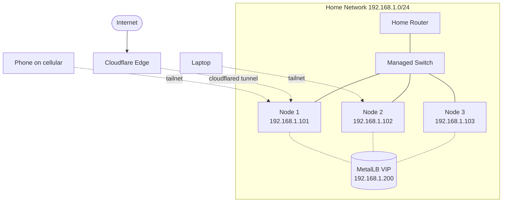

# Homelab Kubernetes Setup — Bare-Metal k3s, MetalLB, and Tailscale

**Date:** 2026-05-08 | **Updated:** 2026-05-08
**Tags:** `kubernetes` `homelab` `k3s` `talos` `metallb` `tailscale` `bare-metal`

---

## Table of Contents

- [Summary](#summary)
- [1. Hardware choices](#1-hardware-choices)
- [2. OS preparation](#2-os-preparation)
- [3. k3s install primary](#3-k3s-install-primary)
- [4. Talos Linux alternative](#4-talos-linux-alternative)
- [5. MetalLB](#5-metallb)
- [6. Remote access](#6-remote-access)
- [7. Storage](#7-storage)
- [8. Ingress and TLS](#8-ingress-and-tls)
- [9. Local DNS optional](#9-local-dns-optional)
- [10. Reference build](#10-reference-build)
- [Related](#related)
- [References](#references)

---

## Summary

A homelab Kubernetes cluster on bare metal needs four pieces that managed clouds give you for free: a node-OS install path, a LoadBalancer implementation, a way to reach the cluster from outside without exposing it publicly, and persistent storage. This doc walks through a concrete build using k3s (or Talos as an alternative), MetalLB for L2/BGP VIPs, the Tailscale Kubernetes operator for zero-trust remote access, and Longhorn / NFS / local-path for storage — pitched at a backend developer who has used managed EKS or GKE and now wants to run the real thing in a closet.

---

## 1. Hardware choices

A homelab cluster is "real" Kubernetes the moment you have three nodes and persistent storage that survives a reboot. Below the typical options.

### 1.1 Form factors

- **Raspberry Pi 4 / 5 (8 GB)** — cheap, low power, ARM64. Fine for the control plane and light workloads. SD-card I/O is the usual bottleneck — boot from USB SSD or NVMe HAT.
- **Mini-PCs (Intel NUC, Beelink SER, Minisforum MS-01)** — the sweet spot for a serious homelab in 2026. x86_64, 16–64 GB RAM, NVMe slots, often dual NICs.
- **Repurposed servers / workstations** — Dell OptiPlex Micro / HP EliteDesk Mini are the budget option (used for $100–$200). Older 1U rack servers work but cost more in power and noise than they save in upfront price.

### 1.2 Minimum specs

| Role          | vCPU | RAM    | Disk             | Notes |
|---------------|------|--------|------------------|-------|
| Control plane | 2    | 4 GB   | 32 GB SSD        | 8 GB if running embedded etcd + workloads |
| Worker        | 2    | 4 GB   | 64 GB SSD + data disk | More RAM helps once you run Longhorn replicas |
| etcd quorum   | 3 nodes | —   | —                | Always odd; 3 is the minimum for HA |

### 1.3 ARM64 vs x86_64

| Concern                | ARM64 (Pi, Ampere) | x86_64 (NUC, mini-PC) |
|------------------------|--------------------|-----------------------|
| Image availability     | Most popular images now multi-arch; some niche images still amd64-only | Universal |
| Performance per watt   | Excellent (Pi 5 idle ~3 W) | Modern N100/N305 mini-PCs are very close (~6–10 W idle) |
| Raw CPU                | Pi 5 ~ entry mini-PC | Higher ceiling |
| Memory ceiling         | 8 GB (Pi 5)         | 64 GB+ |
| Storage I/O            | USB / NVMe HAT (shared lanes) | Native NVMe slots |
| Cost per node          | $80–$120            | $150–$400 |

Rule of thumb: if you only ever plan to run Hello-World demos and a Pi-hole, get three Pi 5s. If you intend to run Postgres, Longhorn, observability stacks, and a couple of Java services with real heaps, buy mini-PCs.

---

## 2. OS preparation

For k3s, **Ubuntu Server 24.04 LTS** or **Debian 12 (bookworm)** are the path of least resistance — both ship cgroups v2 by default, both have current kernel modules, and both have well-trodden k3s install paths. Talos handles all of this for you (Section 4); skip ahead if going that route.

### 2.1 Kernel modules

```bash
sudo tee /etc/modules-load.d/k8s.conf <<'EOF'
br_netfilter
overlay
EOF

sudo modprobe br_netfilter
sudo modprobe overlay
```

`overlay` is needed by containerd's overlayfs snapshotter; `br_netfilter` is needed so iptables can see bridged traffic (required by kube-proxy and most CNIs).

### 2.2 cgroups v2

Modern Ubuntu (22.04+) and Debian 12 already default to unified cgroups v2 — confirm with:

```bash
stat -fc %T /sys/fs/cgroup/
# expected: cgroup2fs
```

If you see `tmpfs`, you are still on cgroups v1; flip with `systemd.unified_cgroup_hierarchy=1` on the kernel command line and reboot.

### 2.3 Disable swap

```bash
sudo swapoff -a
sudo sed -i.bak '/ swap / s/^/#/' /etc/fstab
```

The kubelet refuses to start with swap enabled by default. Even with `failSwapOn=false`, the scheduler does not account for swap pressure and you will get unpredictable evictions.

### 2.4 sysctls

```bash
sudo tee /etc/sysctl.d/99-k8s.conf <<'EOF'
net.ipv4.ip_forward = 1
net.bridge.bridge-nf-call-iptables = 1
net.bridge.bridge-nf-call-ip6tables = 1
EOF

sudo sysctl --system
```

### 2.5 NetworkManager carve-out

If your distro uses NetworkManager (Ubuntu Desktop, some Debian installs), it will fight with the CNI for control over `cni0`, `flannel.*`, and `cali*` interfaces. Tell it to leave them alone:

```ini
# /etc/NetworkManager/conf.d/k8s-cni.conf
[keyfile]
unmanaged-devices=interface-name:cni0;interface-name:flannel*;interface-name:cali*;interface-name:vxlan.calico;interface-name:tunl*;interface-name:vxlan-v6.calico
```

Restart NetworkManager: `sudo systemctl restart NetworkManager`.

### 2.6 Static-ish IPs

Pin each node to a DHCP reservation in your router or assign static IPs. Cluster bootstrap encodes node IPs in TLS SANs; if a control-plane node moves IPs, you are in for a re-bootstrap.

---

## 3. k3s install primary

[k3s](https://k3s.io) is a CNCF-certified, single-binary Kubernetes distribution from Rancher / SUSE. It boots in seconds, bundles containerd, and is the default homelab choice for good reason.

### 3.1 Single-node quick start

For a one-node "is my hardware OK?" smoke test:

```bash
curl -sfL https://get.k3s.io | sh -
sudo k3s kubectl get nodes
sudo cat /etc/rancher/k3s/k3s.yaml   # kubeconfig (replace 127.0.0.1 with node IP)
```

That's it — you have a working cluster in under a minute. The installer drops a systemd unit (`k3s.service`), enables it, and starts the API server.

### 3.2 HA cluster with embedded etcd

For a real homelab, you want three control-plane nodes with embedded etcd (no external Postgres / etcd needed). One node initializes the cluster, the other two join as servers.

**Node 1 (initializer):**

```bash
curl -sfL https://get.k3s.io | \
  K3S_TOKEN=replace-with-strong-shared-secret \
  sh -s - server \
    --cluster-init \
    --tls-san 192.168.1.100 \
    --node-ip 192.168.1.101 \
    --disable=traefik \
    --disable=servicelb \
    --disable=local-storage \
    --write-kubeconfig-mode=644
```

**Nodes 2 and 3 (joining servers):**

```bash
curl -sfL https://get.k3s.io | \
  K3S_TOKEN=replace-with-strong-shared-secret \
  sh -s - server \
    --server https://192.168.1.101:6443 \
    --tls-san 192.168.1.100 \
    --node-ip 192.168.1.10X \
    --disable=traefik \
    --disable=servicelb \
    --disable=local-storage
```

Notes on the flags:

- `--cluster-init` is only on the first node. It bootstraps the embedded etcd cluster.
- `--disable=traefik` removes the bundled Traefik so we can install ingress-nginx (or our preferred ingress) cleanly.
- `--disable=servicelb` removes Klipper (k3s's built-in `LoadBalancer` shim) so MetalLB can take over.
- `--disable=local-storage` removes the default local-path provisioner if we plan to use Longhorn; keep it on if not.
- `--tls-san <vip>` adds a Subject Alternative Name to the server cert — useful if you front the API with a VIP or Tailscale name later.

### 3.3 Adding agent (worker) nodes

Workers are simpler — no etcd, no API server:

```bash
curl -sfL https://get.k3s.io | \
  K3S_URL=https://192.168.1.101:6443 \
  K3S_TOKEN=replace-with-strong-shared-secret \
  sh -
```

Setting `K3S_URL` is what flips the installer into agent mode.

### 3.4 Retrieving kubeconfig

From any server node:

```bash
sudo cat /etc/rancher/k3s/k3s.yaml \
  | sed 's/127.0.0.1/192.168.1.101/' \
  > ~/.kube/k3s-home.yaml

export KUBECONFIG=~/.kube/k3s-home.yaml
kubectl get nodes -o wide
```

### 3.5 Common flags reference

| Flag                        | Effect |
|-----------------------------|--------|
| `--cluster-init`            | First HA control-plane node only; starts embedded etcd |
| `--server <url>`            | Joining server / agent points here |
| `--token <value>`           | Shared bootstrap token (or env `K3S_TOKEN`) |
| `--disable=<comp>`          | Skip a packaged component (traefik / servicelb / local-storage / metrics-server / coredns) |
| `--tls-san <name|ip>`       | Extra SAN on API server cert |
| `--node-ip <ip>`            | Pins kubelet's primary IP (multi-NIC machines) |
| `--flannel-backend=<mode>`  | `vxlan` (default), `host-gw`, `wireguard-native`, `none` |
| `--write-kubeconfig-mode`   | `644` so a non-root user can read it |

---

## 4. Talos Linux alternative

[Talos](https://www.talos.dev/) is an immutable, API-driven Linux specifically built to run Kubernetes — no SSH, no shell, no package manager. The OS is a single squashfs image; configuration is a YAML document you submit over a gRPC API. It is a different mental model from "Ubuntu + k3s" and worth understanding even if you do not pick it.

### 4.1 Workflow

```bash
# 1. Generate cluster config
talosctl gen config home-cluster https://192.168.1.100:6443
# produces: controlplane.yaml, worker.yaml, talosconfig

# 2. PXE-boot or USB-boot each node from the Talos ISO; they come up
# in maintenance mode listening on the gRPC API with a self-signed cert.

# 3. Apply config to each node (insecure flag because PKI not yet trusted)
talosctl apply-config --insecure \
  --nodes 192.168.1.101 \
  --file controlplane.yaml

talosctl apply-config --insecure \
  --nodes 192.168.1.102 \
  --file worker.yaml

# 4. Bootstrap etcd on exactly ONE control-plane node, exactly ONCE
talosctl bootstrap \
  --nodes 192.168.1.101 \
  --endpoints 192.168.1.101 \
  --talosconfig ./talosconfig

# 5. Pull kubeconfig
talosctl kubeconfig \
  --nodes 192.168.1.101 \
  --endpoints 192.168.1.101 \
  --talosconfig ./talosconfig
```

The `bootstrap` command **must run exactly once on exactly one control-plane node**. Running it on a second node creates a second etcd cluster and you will need to wipe and reinstall.

### 4.2 Immutable OS philosophy

There is no SSH. There is no `apt`. To "install" a kernel module — for example `iscsi_tcp` for Longhorn — you install a **system extension** by editing `MachineConfig`, applying it, and rebooting the node. The OS is reconciled to declared state on each boot.

This sounds intolerable until you realize it eliminates a whole class of homelab failure modes — config drift, half-applied apt upgrades, "I SSH'd in once and forgot what I changed."

### 4.3 k3s vs Talos

| Dimension          | k3s on Ubuntu / Debian       | Talos Linux                                    |
|--------------------|------------------------------|------------------------------------------------|
| Install complexity | One curl pipe, one minute    | Generate YAML, PXE/USB boot, apply, bootstrap  |
| OS customization   | Full apt/systemd flexibility | None — system extensions only                  |
| Upgrade UX         | `apt upgrade` + restart k3s  | `talosctl upgrade` — atomic A/B image swap     |
| Debugging UX       | `ssh + journalctl` familiar  | `talosctl logs` / `dmesg` only — gRPC API      |
| Community size     | Very large; many tutorials   | Smaller but very engaged                       |
| Failure blast      | Easier to corrupt by hand    | Hard to corrupt; reboot returns to declared state |
| Fit                | Learners, tinkerers          | Operators, GitOps homelabs, security-conscious |

For this doc the rest of the sections assume k3s, but every YAML manifest below works identically on Talos.

---

## 5. MetalLB

In the cloud, a `Service` of `type: LoadBalancer` triggers a controller that talks to the cloud's LB API and gives you a public IP. On bare metal, nothing watches that field by default — services sit in `Pending` forever. [MetalLB](https://metallb.universe.tf/) fills that gap by allocating an IP from a pool you give it and announcing it on your LAN.

### 5.1 L2 mode vs BGP mode

| Mode | How it works | Pros | Cons |
|------|--------------|------|------|
| **L2** | Speaker on one elected node sends gratuitous ARP (IPv4) or NDP (IPv6) so the LAN routes the VIP to that node | Works on any home network; no router config | All traffic for one VIP funnels through one node — no real LB, only failover. ~10s ARP-cache settle on failover |
| **BGP** | MetalLB peers with your router via BGP and announces VIPs as `/32` routes; ECMP spreads traffic across nodes | True multi-node load balancing, fast failover, no ARP tricks | Requires a router that speaks BGP — UDM Pro, OPNsense + FRR, MikroTik RouterOS, VyOS |

For most homelabs, **L2 is the default** and it is fine. You only need BGP when you want real per-flow load distribution.

### 5.2 Install

```bash
kubectl apply -f https://raw.githubusercontent.com/metallb/metallb/v0.14.8/config/manifests/metallb-native.yaml
kubectl -n metallb-system rollout status deploy/controller
kubectl -n metallb-system rollout status ds/speaker
```

(Pin the version — do not chase `main`. Check the [MetalLB releases](https://github.com/metallb/metallb/releases) for the current one.)

### 5.3 IP pool

Pick a slice of your LAN subnet that DHCP will not hand out. If your router gives out `192.168.1.50–192.168.1.199`, reserve `192.168.1.200–192.168.1.250` for MetalLB.

```yaml
apiVersion: metallb.io/v1beta1
kind: IPAddressPool
metadata:
  name: home-lan-pool
  namespace: metallb-system
spec:
  addresses:
    - 192.168.1.200-192.168.1.250
```

### 5.4 L2 advertisement

```yaml
apiVersion: metallb.io/v1beta1
kind: L2Advertisement
metadata:
  name: home-lan-l2
  namespace: metallb-system
spec:
  ipAddressPools:
    - home-lan-pool
```

### 5.5 BGP peer + advertisement (if your router supports it)

```yaml
apiVersion: metallb.io/v1beta2
kind: BGPPeer
metadata:
  name: home-router
  namespace: metallb-system
spec:
  myASN: 64512
  peerASN: 64513
  peerAddress: 192.168.1.1
---
apiVersion: metallb.io/v1beta1
kind: BGPAdvertisement
metadata:
  name: home-lan-bgp
  namespace: metallb-system
spec:
  ipAddressPools:
    - home-lan-pool
```

Use private ASNs in the `64512–65534` range so you never collide with a real internet ASN.

### 5.6 Smoke test

```bash
kubectl create deploy hello --image=nginx
kubectl expose deploy hello --port=80 --type=LoadBalancer
kubectl get svc hello
# EXTERNAL-IP should be 192.168.1.200 (or the next free pool IP)

curl http://192.168.1.200/
```

### 5.7 Troubleshooting

```bash
# Find which node owns the VIP
kubectl -n metallb-system logs ds/speaker | grep -i announc

# Watch ARP from another machine on the LAN
sudo arping 192.168.1.200

# Confirm gratuitous ARP on failover
sudo tcpdump -i eth0 -nn arp host 192.168.1.200
```

If the VIP is unreachable: check that the speaker pod is running on a node actually attached to the LAN (host network, not pod network), and that no router rule is intercepting the IP.

---

## 6. Remote access

Exposing the API server publicly is a category-A homelab mistake — anyone who can guess your domain gets to fingerprint your cluster version. The right answer in 2026 is an overlay network: [Tailscale](https://tailscale.com) for personal use, with [Cloudflare Tunnel](https://developers.cloudflare.com/cloudflare-one/connections/connect-networks/) layered in for any service you actually want to share publicly.

### 6.1 Tailscale Kubernetes operator

Tailscale ships an official Kubernetes operator that does three things worth wanting:

- **`tailscale.com/expose: "true"`** annotation on a Service automatically creates a Tailscale proxy that publishes the service on your tailnet — no DNS plumbing, no ports forwarded.
- **`Connector` CRD** routes a CIDR (e.g. your whole `Pod` or `Service` CIDR) onto the tailnet.
- **`ProxyClass` CRD** lets you tune resource limits, tolerations, image, etc. for proxy pods on a per-class basis.

Install with Helm:

```bash
helm repo add tailscale https://pkgs.tailscale.com/helmcharts
helm repo update

helm upgrade --install tailscale-operator tailscale/tailscale-operator \
  --namespace tailscale \
  --create-namespace \
  --set-string oauth.clientId="$TS_OAUTH_ID" \
  --set-string oauth.clientSecret="$TS_OAUTH_SECRET" \
  --wait
```

Generate the OAuth client in the Tailscale admin console with the `devices:write` scope and the appropriate tags.

### 6.2 Exposing a Service on the tailnet

```yaml
apiVersion: v1
kind: Service
metadata:
  name: grafana
  namespace: monitoring
  annotations:
    tailscale.com/expose: "true"
    tailscale.com/hostname: "grafana"
    tailscale.com/proxy-class: "lite"
spec:
  selector:
    app.kubernetes.io/name: grafana
  ports:
    - name: http
      port: 80
      targetPort: 3000
```

Once applied, the operator creates a proxy pod, joins it to your tailnet, and `grafana` becomes reachable at `http://grafana` (or `http://grafana.<tailnet>.ts.net`) from any device logged in to your tailnet.

### 6.3 kubectl over the tailnet

You do not need to expose the API server publicly. Two approaches:

1. Run the Tailscale `Connector` to advertise the Service CIDR; talk to `https://kubernetes.default.svc:443` from a tailscale-connected client by IP.
2. Easier: install `tailscale` on the workstation and on each node; the API server's LAN IP is reachable over the tailnet automatically once both ends are connected.

### 6.4 Cloudflare Tunnel for public services

Tailscale solves "me reaching my homelab." It does not solve "my mom hitting my self-hosted photo gallery." For that, Cloudflare Tunnel is the cleanest path:

- The `cloudflared` daemon runs in your cluster (or as a Deployment) and dials out to Cloudflare's edge.
- No inbound ports on your home router. No exposed home IP. ISP cannot block port 80/443 because nothing is listening there.
- Cloudflare's edge handles TLS termination, DDoS mitigation, and access policies.

### 6.5 Tailscale vs Cloudflare Tunnel

| Concern               | Tailscale                                      | Cloudflare Tunnel                               |
|-----------------------|------------------------------------------------|-------------------------------------------------|
| Audience              | Just you and trusted people on your tailnet    | The public internet                             |
| Auth                  | Identity-based (Google / GitHub / Okta SSO)    | Anonymous public, or Cloudflare Access policies |
| Setup                 | Helm install operator, annotate Services       | Run `cloudflared`, configure DNS routes         |
| Latency               | Direct WireGuard, near-LAN once mesh is built  | Proxied through Cloudflare edge                 |
| Cost                  | Free tier: 100 devices / 3 users               | Free for unmetered HTTP/S                       |
| Right call when…      | Personal or small-team admin / dev tools       | A service that has to be public                 |

Most homelabs run both — Tailscale for everything sensitive, Cloudflare Tunnel for the small handful of services intended to be public.

### 6.6 Topology



---

## 7. Storage

The cloud gives you `gp3` and "it just works." On bare metal you pick a tradeoff: simple-but-fragile, replicated-but-heavier, or shared-from-a-NAS.

### 7.1 local-path-provisioner (k3s default)

k3s ships [Rancher's local-path-provisioner](https://github.com/rancher/local-path-provisioner) on by default unless you pass `--disable=local-storage`. It writes PV directories under `/var/lib/rancher/k3s/storage/` on whichever node the pod lands.

- **Pros:** zero config, fast (host disk), no cluster overhead.
- **Cons:** no replication, no snapshots, PVC is sticky to one node — if that node dies, the data is unreachable.

Fine for ephemeral workloads or single-replica experiments. **Not** fine for stateful data you care about.

### 7.2 Longhorn (replicated block)

[Longhorn](https://longhorn.io) (CNCF, latest stable **1.11.2** as of mid-2026) provides distributed block storage with synchronous replication, snapshots, and backup-to-S3.

**Prerequisites on every node:**

```bash
# Debian / Ubuntu
sudo apt-get install -y open-iscsi nfs-common
sudo modprobe iscsi_tcp
echo iscsi_tcp | sudo tee /etc/modules-load.d/iscsi.conf
sudo systemctl enable --now iscsid
```

The kernel must have `iscsi_tcp` and `dm_crypt` loaded. NFS tooling is needed because Longhorn uses NFS internally for `ReadWriteMany` volumes.

**Install via Helm:**

```bash
helm repo add longhorn https://charts.longhorn.io
helm repo update
helm install longhorn longhorn/longhorn \
  --namespace longhorn-system \
  --create-namespace \
  --version 1.11.2
```

Longhorn ships a UI; expose it via an Ingress (Section 8) protected by Tailscale or Cloudflare Access — never publicly.

**Tradeoffs:**

- Replication factor 2 or 3; 3-way replication doubles or triples your effective storage cost.
- Snapshots are fast (CoW), backups go to S3-compatible targets.
- Volume manager + replicas eat ~5–10% CPU and a couple hundred MB RAM per node — budget for it.

### 7.3 NFS CSI driver (NAS-backed)

If you already have a [Synology](https://www.synology.com), [TrueNAS](https://www.truenas.com), or [unRAID](https://unraid.net) box, the [kubernetes-csi/csi-driver-nfs](https://github.com/kubernetes-csi/csi-driver-nfs) is the path of least resistance — `ReadWriteMany` out of the box, snapshots if your NAS supports them, and the data lives somewhere you already back up.

```bash
helm repo add csi-driver-nfs https://raw.githubusercontent.com/kubernetes-csi/csi-driver-nfs/master/charts
helm install csi-driver-nfs csi-driver-nfs/csi-driver-nfs \
  --namespace kube-system \
  --version v4.9.0
```

Then create a `StorageClass` pointing at your NAS export:

```yaml
apiVersion: storage.k8s.io/v1
kind: StorageClass
metadata:
  name: nfs
provisioner: nfs.csi.k8s.io
parameters:
  server: 192.168.1.10
  share: /volume1/k8s
reclaimPolicy: Delete
volumeBindingMode: Immediate
mountOptions:
  - nfsvers=4.1
  - hard
  - timeo=600
```

### 7.4 Access modes and snapshots

| Provisioner    | RWO | RWX | Snapshots | Cluster cost | Best for |
|----------------|-----|-----|-----------|--------------|----------|
| local-path     | Yes | No  | No        | Zero         | Throwaway / dev volumes |
| Longhorn       | Yes | Yes (via NFS export) | Yes (CSI) | Medium  | Stateful workloads on cluster-only storage |
| NFS CSI        | Yes | Yes | Depends on NAS | Low | Anything where NAS already exists |

### 7.5 Backups

For real data, install [Velero](https://velero.io) and back up to an off-site S3-compatible bucket (Backblaze B2, Cloudflare R2, MinIO on a friend's house). Longhorn integrates with Velero for application-consistent backups via CSI VolumeSnapshots. If your NAS already snapshots and backs itself up, the NFS CSI driver effectively gives you offsite backups for free.

---

## 8. Ingress and TLS

With Traefik disabled (Section 3), you get to choose the ingress. [ingress-nginx](https://kubernetes.github.io/ingress-nginx/) is the boring, battle-tested default; [Traefik](https://traefik.io/) is fine if you like its config style; [Gateway API](https://gateway-api.sigs.k8s.io/) is the future. We will go with ingress-nginx.

### 8.1 Install ingress-nginx + MetalLB VIP

```bash
helm repo add ingress-nginx https://kubernetes.github.io/ingress-nginx
helm install ingress-nginx ingress-nginx/ingress-nginx \
  --namespace ingress-nginx \
  --create-namespace \
  --set controller.service.type=LoadBalancer \
  --set controller.service.externalTrafficPolicy=Local \
  --set controller.kind=Deployment \
  --set controller.replicaCount=2
```

`controller.service.type=LoadBalancer` triggers MetalLB, which assigns a VIP from `home-lan-pool`. `externalTrafficPolicy: Local` preserves source IPs (and bypasses the extra hop through kube-proxy SNAT). Pin to a specific pool address with `metallb.universe.tf/loadBalancerIPs: 192.168.1.200` annotation if you want a stable one.

### 8.2 cert-manager + Let's Encrypt + DNS-01

[cert-manager](https://cert-manager.io) automates issuing and renewing TLS certs. Install:

```bash
helm repo add jetstack https://charts.jetstack.io
helm install cert-manager jetstack/cert-manager \
  --namespace cert-manager \
  --create-namespace \
  --set crds.enabled=true \
  --version v1.16.1
```

### 8.3 Why DNS-01, not HTTP-01

The default Let's Encrypt challenge type, **HTTP-01**, asks the ACME server to fetch `http://<your-domain>/.well-known/acme-challenge/<token>` — that means port 80 must be reachable from the public internet on your domain. For homelab, this fails for at least four reasons:

1. **Residential ISPs block port 80** in the AUP, even if NAT works.
2. **Dynamic IPs** mean the cert request might be racing your DDNS update.
3. **CGNAT** (common on mobile fallback / starlink / many ISPs) prevents inbound entirely.
4. **You actually do not want** your homelab Ingress reachable from the public internet just to get a cert.

**DNS-01** sidesteps all of this. You prove control of `home.example.com` by writing a TXT record under `_acme-challenge.home.example.com`. cert-manager has DNS-provider integrations for Cloudflare, Route 53, DigitalOcean, etc. — for Cloudflare it just calls the Cloudflare API.

It also unlocks **wildcard certificates**: Let's Encrypt issues `*.home.example.com` only via DNS-01, never HTTP-01. One cert, every subdomain.

### 8.4 ClusterIssuer with Cloudflare DNS-01

```yaml
apiVersion: v1
kind: Secret
metadata:
  name: cloudflare-api-token
  namespace: cert-manager
type: Opaque
stringData:
  api-token: "REDACTED-cloudflare-zone-edit-token"
---
apiVersion: cert-manager.io/v1
kind: ClusterIssuer
metadata:
  name: letsencrypt-dns
spec:
  acme:
    email: you@example.com
    server: https://acme-v02.api.letsencrypt.org/directory
    privateKeySecretRef:
      name: letsencrypt-dns-account-key
    solvers:
      - dns01:
          cloudflare:
            apiTokenSecretRef:
              name: cloudflare-api-token
              key: api-token
        selector:
          dnsZones:
            - "home.example.com"
```

The Cloudflare token must be **scoped to one zone** with `Zone:Read` + `DNS:Edit` — not a global API key. Treat it like a database password; do not reuse it elsewhere.

### 8.5 Wildcard certificate

```yaml
apiVersion: cert-manager.io/v1
kind: Certificate
metadata:
  name: wildcard-home
  namespace: ingress-nginx
spec:
  secretName: wildcard-home-tls
  issuerRef:
    name: letsencrypt-dns
    kind: ClusterIssuer
  commonName: "*.home.example.com"
  dnsNames:
    - "home.example.com"
    - "*.home.example.com"
```

Reference the resulting `wildcard-home-tls` secret from any Ingress without re-requesting a cert per host:

```yaml
apiVersion: networking.k8s.io/v1
kind: Ingress
metadata:
  name: grafana
  namespace: monitoring
spec:
  ingressClassName: nginx
  tls:
    - hosts:
        - grafana.home.example.com
      secretName: wildcard-home-tls
  rules:
    - host: grafana.home.example.com
      http:
        paths:
          - path: /
            pathType: Prefix
            backend:
              service:
                name: grafana
                port:
                  number: 80
```

---

## 9. Local DNS optional

If you want `grafana.home.example.com` to resolve to `192.168.1.200` (the MetalLB VIP) **only inside your house**, and *not* leak `*.home.example.com` records to public DNS, you want **split-horizon DNS**. The homelab pattern: run [Pi-hole](https://pi-hole.net/) or [AdGuard Home](https://adguard.com/en/adguard-home/overview.html) as your house's DNS server, point your router's DHCP to it, and have CoreDNS forward to it.

### 9.1 Why this matters

- You can leave the public Cloudflare DNS records pointing at `127.0.0.1` (or just absent) so an outsider doing `dig grafana.home.example.com` learns nothing about your internal layout.
- Inside the house, Pi-hole answers with the MetalLB VIP, traffic stays on the LAN, and TLS still works because the wildcard cert covers `*.home.example.com`.
- Bonus: ad-blocking for the whole network.

### 9.2 Pi-hole as upstream DNS

Add the entry on Pi-hole (`Local DNS Records`):

```text
grafana.home.example.com  → 192.168.1.200
*.home.example.com        → 192.168.1.200   (CNAME or wildcard via dnsmasq config)
```

Or for a real wildcard, drop a snippet in `/etc/dnsmasq.d/02-homelab.conf`:

```text
address=/home.example.com/192.168.1.200
```

### 9.3 CoreDNS forwarding (in-cluster)

If you want pods inside the cluster to resolve `home.example.com` names through Pi-hole rather than 1.1.1.1, edit the CoreDNS ConfigMap:

```yaml
apiVersion: v1
kind: ConfigMap
metadata:
  name: coredns-custom
  namespace: kube-system
data:
  home.server: |
    home.example.com:53 {
      errors
      cache 30
      forward . 192.168.1.10
    }
```

(In k3s the file lives in `/var/lib/rancher/k3s/server/manifests/coredns.yaml.tmpl` — modify the ConfigMap to add a custom server block under `forward`.)

### 9.4 Watch out for

- **DNS rebinding protection** on your router (UDM, Fritz!Box, OpenWrt) can drop responses pointing at RFC1918 IPs from a public domain. Allow-list `home.example.com` in the router's rebind protection settings, or scope it to a private subdomain that you do not register publicly at all.
- **Some clients ignore your DHCP-assigned DNS** (Android private DNS, Chromecast hardcoded to 8.8.8.8). They will not see your split horizon. Force them via the router or accept the limitation.

---

## 10. Reference build

A concrete shopping list for a 3-node k3s homelab cluster in the $300–$600 range, current to mid-2026.

### 10.1 Minimum viable (~$320)

| Item | Qty | Unit cost | Notes |
|------|-----|-----------|-------|
| Raspberry Pi 5 (8 GB) + active cooler | 3 | $90 | ARM64 control planes |
| SanDisk High Endurance 64 GB microSD | 3 | $14 | Or boot from USB SSD for I/O |
| Official 27W USB-C PSU | 3 | $12 | Pi 5 needs 5A |
| 8-port unmanaged GbE switch | 1 | $20 | Anything tp-link / netgear |
| Cat6 patch cables 0.5m | 3 | $4 | — |

Idle power: ~3 W per Pi 5 + switch ~3 W ≈ **15 W total**. Roughly $20/year electricity at US rates.

### 10.2 Comfortable build (~$550)

| Item | Qty | Unit cost | Notes |
|------|-----|-----------|-------|
| Beelink SER5 5560U (16 GB / 500 GB NVMe) | 3 | $170 | x86_64, dual-NVMe, 2.5GbE |
| 8-port managed switch (TP-Link TL-SG108E or Mikrotik CSS610) | 1 | $40 | VLAN support; useful later |
| Cat6 patch cables 1m | 3 | $5 | — |

Idle power: ~12 W per SER5 + switch ~5 W ≈ **40–50 W total**. Roughly $60/year electricity.

### 10.3 Power and protection

- **UPS (optional but strongly recommended):** APC Back-UPS 600VA / Cyberpower CP685AVR (~$80). At 50 W draw, 600 VA gives you ~20 minutes — enough to survive a brownout and trigger graceful shutdown via NUT (`apt install nut`) on each node.
- **Surge protector** at minimum if no UPS.

### 10.4 What you have at the end

- 3 nodes, HA control plane, embedded etcd quorum.
- MetalLB VIPs on your LAN; LoadBalancer services "just work."
- `kubectl` over Tailscale; nothing exposed to the public internet by accident.
- TLS for everything via wildcard cert; DNS-01 means certs renew without inbound port 80/443.
- Persistent volumes via Longhorn or NFS-to-NAS.
- Idle draw on the order of 15–60 W; loud enough to put in a closet, quiet enough to put in a bedroom.

### 10.5 What to do next

- **GitOps:** put every YAML manifest in this doc into a Git repo and let Flux or Argo CD reconcile it. Continue in [`homelab-gitops.md`](homelab-gitops.md).
- **Observability:** stand up Prometheus / Grafana / Loki / Tempo. The SLI/SLO doc in `../../observability/` covers what to actually measure.
- **Backups:** Velero + an off-site S3 bucket. Test the *restore* path, not just the backup path.
- **Upgrades:** k3s upgrades are `curl -sfL https://get.k3s.io | INSTALL_K3S_VERSION=vX.Y.Z+k3s1 sh -s - --cluster-reset` on each node, rolling. Talos is `talosctl upgrade --image ghcr.io/siderolabs/installer:vX.Y.Z`. Either way, drain first.

---

## Related

- [`homelab-gitops.md`](homelab-gitops.md) — GitOps with Flux / Argo CD on top of this cluster (next step).
- [`../networking/services-and-discovery.md`](../networking/services-and-discovery.md) — Service types, kube-proxy, why MetalLB exists at all.
- [`../networking/ingress-and-gateway-api.md`](../networking/ingress-and-gateway-api.md) — Ingress vs Gateway API, cert-manager + DNS-01 in depth.
- [`../configuration/persistent-volumes.md`](../configuration/persistent-volumes.md) — PV / PVC / StorageClass / CSI background for Longhorn vs local-path vs NFS CSI.
- [`developer-experience.md`](developer-experience.md) — kind / minikube / k3d for local laptop dev vs a real homelab cluster.

---

## References

- [k3s — Quick-start](https://docs.k3s.io/) and [k3s server CLI flags](https://docs.k3s.io/cli/server)
- [Talos Linux — Getting Started](https://www.talos.dev/v1.8/introduction/getting-started/)
- [MetalLB — Configuration](https://metallb.universe.tf/configuration/)
- [Tailscale — Kubernetes operator](https://tailscale.com/kb/1236/kubernetes-operator)
- [cert-manager — ACME DNS-01](https://cert-manager.io/docs/configuration/acme/dns01/) and [Cloudflare provider](https://cert-manager.io/docs/configuration/acme/dns01/cloudflare/)
- [Longhorn — Documentation 1.11](https://longhorn.io/docs/1.11.2/)
- [Cloudflare Tunnel — Connect networks](https://developers.cloudflare.com/cloudflare-one/connections/connect-networks/)
- [csi-driver-nfs](https://github.com/kubernetes-csi/csi-driver-nfs) — Kubernetes SIG-Storage NFS CSI driver
- [Kubernetes — Network plugins / kernel modules](https://kubernetes.io/docs/concepts/cluster-administration/networking/)
- [ingress-nginx — Helm chart](https://kubernetes.github.io/ingress-nginx/)
