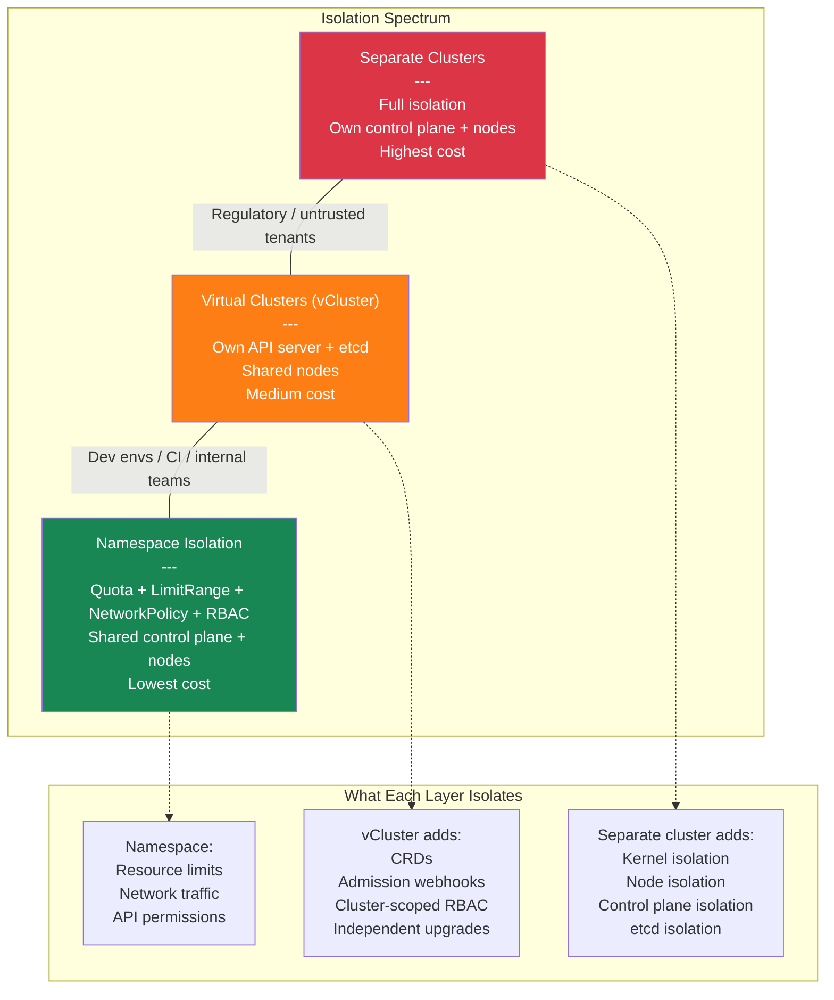

# Multi-Tenancy, Cost Optimization, and Cluster Strategy

**Date:** 2026-04-24 | **Updated:** 2026-04-24
**Tags:** `kubernetes` `multi-tenancy` `cost` `finops` `cluster-strategy`

## Table of Contents

- [Summary](#summary)
- [Cluster Strategy — Single vs Multi-Cluster](#cluster-strategy--single-vs-multi-cluster)
  - [Single Cluster — When and Why](#single-cluster--when-and-why)
  - [Multi-Cluster — When and Why](#multi-cluster--when-and-why)
  - [The Practical Hybrid](#the-practical-hybrid)
  - [Comparison Table](#comparison-table)
- [Namespace-Based Soft Multi-Tenancy](#namespace-based-soft-multi-tenancy)
  - [ResourceQuota Per Namespace](#resourcequota-per-namespace)
  - [LimitRange Per Namespace](#limitrange-per-namespace)
  - [NetworkPolicy Per Namespace](#networkpolicy-per-namespace)
  - [RBAC Scoping Per Namespace](#rbac-scoping-per-namespace)
  - [Full Namespace Isolation Setup](#full-namespace-isolation-setup)
  - [The Limits of Soft Multi-Tenancy](#the-limits-of-soft-multi-tenancy)
- [Virtual Clusters (vCluster)](#virtual-clusters-vcluster)
  - [What vCluster Does](#what-vcluster-does)
  - [How the Syncer Works](#how-the-syncer-works)
  - [Use Cases](#use-cases)
  - [Trade-Offs](#trade-offs)
- [Multi-Tenancy Isolation Layers](#multi-tenancy-isolation-layers)
- [Cost Visibility](#cost-visibility)
  - [Kubecost](#kubecost)
  - [OpenCost (CNCF Incubating)](#opencost-cncf-incubating)
  - [Cloud Provider Tools](#cloud-provider-tools)
- [Cost Optimization Strategies](#cost-optimization-strategies)
  - [Right-Sizing](#right-sizing)
  - [Spot and Preemptible Instances](#spot-and-preemptible-instances)
  - [Bin-Packing and Consolidation](#bin-packing-and-consolidation)
  - [Overcommit Ratios](#overcommit-ratios)
  - [Scale-to-Zero](#scale-to-zero)
  - [Reserved Instances and Savings Plans](#reserved-instances-and-savings-plans)
  - [Idle Resource Detection](#idle-resource-detection)
- [FinOps for Kubernetes](#finops-for-kubernetes)
  - [Showback vs Chargeback](#showback-vs-chargeback)
  - [Team Cost Dashboards](#team-cost-dashboards)
  - [Budgets and Alerts](#budgets-and-alerts)
- [Related](#related)
- [References](#references)

## Summary

Running Kubernetes is not free. The infrastructure bill comes from compute, storage, networking, and load balancers — and most organizations overspend because they do not measure, do not right-size, and do not match workloads to the right instance types. This document covers three interrelated concerns: **cluster strategy** (how many clusters and why), **multi-tenancy** (how multiple teams share clusters safely), and **cost optimization** (how to stop paying for resources nobody uses).

The progression: first decide your cluster topology. Then enforce isolation within each cluster using namespaces, RBAC, quotas, and network policies — or use virtual clusters for stronger isolation without the operational cost of separate clusters. Then instrument cost visibility and apply optimization strategies: right-sizing, spot instances, bin-packing, scale-to-zero, and idle resource cleanup.

If you are running a Spring Boot monolith in one namespace today and wondering why this matters, it matters the moment you add a second team, a staging environment, or a cloud bill that surprises someone.

---

## Cluster Strategy — Single vs Multi-Cluster

### Single Cluster — When and Why

One cluster is the simplest operational model. You have one control plane to upgrade, one set of add-ons to maintain, one monitoring stack, one set of credentials.

**Use a single cluster when:**

- Your team is small (one to three teams, under 50 developers)
- RBAC and namespace isolation meet your security requirements
- You operate in a single cloud region
- You want minimum operational overhead
- Your workloads do not have strict regulatory separation requirements

**The cost advantage is real.** Every additional cluster adds a control plane cost (roughly $70-75/month on EKS, free on GKE Autopilot, $70/month on AKS), plus duplicated monitoring, logging, ingress controllers, cert-manager, and GitOps tooling. For a small team, that duplication can represent 30-50% of total infrastructure spend.

### Multi-Cluster — When and Why

**Use multiple clusters when:**

- **Regulatory isolation**: PCI, HIPAA, or SOC2 workloads must not share a control plane with general workloads
- **Blast radius reduction**: a bad admission webhook or etcd corruption affects only one cluster
- **Different cloud regions**: latency requirements demand workloads run near users
- **Staging vs production separation**: staging experiments (CRD testing, new K8s versions, admission policy changes) must not risk production stability
- **Scale limits**: you are approaching etcd object count limits (~100K objects), or API server latency degrades under load
- **Different trust boundaries**: external customers running workloads in your infrastructure

### The Practical Hybrid

Most production setups land here:

```
Cluster 1: dev + staging
  - Lower-spec nodes (cheaper instance types)
  - More permissive RBAC
  - Spot instances for everything
  - Acceptable to have occasional disruption

Cluster 2: production
  - Right-sized nodes with on-demand baseline
  - Strict RBAC and network policies
  - PDBs on every stateful workload
  - Spot for stateless, on-demand for stateful
```

This gives you isolation where it matters (production stability) without the cost of running four separate clusters for dev/staging/prod/tools.

### Comparison Table

| Factor | Single Cluster | Multi-Cluster |
|--------|---------------|---------------|
| Operational overhead | Low | High (multiply by N clusters) |
| Control plane cost | 1x | Nx |
| Blast radius | Full cluster | Per cluster |
| Regulatory isolation | Namespace-level only | Full separation |
| Upgrade risk | One shot | Canary cluster upgrades |
| Networking complexity | Simple | Service mesh / multi-cluster DNS |
| Team autonomy | Namespace scoped | Cluster scoped |
| Monitoring duplication | None | Full stack per cluster |

---

## Namespace-Based Soft Multi-Tenancy

Namespace isolation is the first line of multi-tenancy in Kubernetes. It is "soft" because tenants share the same control plane, the same nodes, and the same cluster-scoped resources — but you can constrain what each tenant consumes and accesses.

### ResourceQuota Per Namespace

ResourceQuota caps the total resources a namespace can consume. Without it, one team's memory-leaking pod can evict every other team's workloads.

```yaml
apiVersion: v1
kind: ResourceQuota
metadata:
  name: team-api-quota
  namespace: team-api
spec:
  hard:
    # Compute limits
    requests.cpu: "8"
    requests.memory: 16Gi
    limits.cpu: "16"
    limits.memory: 32Gi
    # Object count limits
    pods: "40"
    services: "10"
    services.loadbalancers: "2"
    persistentvolumeclaims: "10"
    secrets: "20"
    configmaps: "20"
```

**Key behavior**: once a ResourceQuota exists in a namespace, every pod in that namespace **must** specify resource requests and limits — or it will be rejected. This is why you always pair ResourceQuota with LimitRange.

### LimitRange Per Namespace

LimitRange sets defaults for containers that do not specify their own resources, and caps the maximum any single container can request.

```yaml
apiVersion: v1
kind: LimitRange
metadata:
  name: team-api-limits
  namespace: team-api
spec:
  limits:
    - type: Container
      # Defaults applied when pod spec omits resources
      default:
        cpu: 500m
        memory: 512Mi
      defaultRequest:
        cpu: 100m
        memory: 128Mi
      # Per-container ceiling
      max:
        cpu: "4"
        memory: 8Gi
      # Per-container floor
      min:
        cpu: 50m
        memory: 64Mi
    - type: PersistentVolumeClaim
      max:
        storage: 50Gi
      min:
        storage: 1Gi
```

**Why this matters for Java devs**: a Spring Boot app with default JVM settings (`-XX:MaxRAMPercentage=75`) inside a container with a 512Mi default limit will behave very differently than one with a 2Gi limit. LimitRange ensures every container gets sensible defaults without developers having to remember to set them.

### NetworkPolicy Per Namespace

By default, all pods can talk to all pods across all namespaces. NetworkPolicy restricts that.

```yaml
# Default deny all ingress and egress
apiVersion: networking.k8s.io/v1
kind: NetworkPolicy
metadata:
  name: default-deny
  namespace: team-api
spec:
  podSelector: {}
  policyTypes:
    - Ingress
    - Egress
---
# Allow ingress only from the ingress controller namespace
apiVersion: networking.k8s.io/v1
kind: NetworkPolicy
metadata:
  name: allow-ingress-controller
  namespace: team-api
spec:
  podSelector: {}
  policyTypes:
    - Ingress
  ingress:
    - from:
        - namespaceSelector:
            matchLabels:
              kubernetes.io/metadata.name: ingress-nginx
---
# Allow egress to DNS and within namespace
apiVersion: networking.k8s.io/v1
kind: NetworkPolicy
metadata:
  name: allow-dns-and-internal
  namespace: team-api
spec:
  podSelector: {}
  policyTypes:
    - Egress
  egress:
    # DNS resolution
    - to:
        - namespaceSelector: {}
          podSelector:
            matchLabels:
              k8s-app: kube-dns
      ports:
        - protocol: UDP
          port: 53
        - protocol: TCP
          port: 53
    # Within the same namespace
    - to:
        - podSelector: {}
    # Allow egress to database namespace
    - to:
        - namespaceSelector:
            matchLabels:
              kubernetes.io/metadata.name: databases
```

**Important**: NetworkPolicy requires a CNI that supports it (Calico, Cilium, Antrea). The default AWS VPC CNI or basic Flannel does not enforce NetworkPolicy. Cilium is the most common production choice as of 2026.

### RBAC Scoping Per Namespace

Each team gets a Role and RoleBinding scoped to their namespace. No team should have ClusterRole access unless they are platform engineers.

```yaml
# Role: what the team can do in their namespace
apiVersion: rbac.authorization.k8s.io/v1
kind: Role
metadata:
  name: team-api-developer
  namespace: team-api
rules:
  - apiGroups: ["", "apps", "batch"]
    resources: ["pods", "deployments", "services", "configmaps", "secrets", "jobs", "cronjobs"]
    verbs: ["get", "list", "watch", "create", "update", "patch", "delete"]
  - apiGroups: [""]
    resources: ["pods/log", "pods/exec", "pods/portforward"]
    verbs: ["get", "create"]
  # Read-only on events for debugging
  - apiGroups: [""]
    resources: ["events"]
    verbs: ["get", "list", "watch"]
  # No access to: nodes, namespaces, PVs, ClusterRoles, etc.
---
# RoleBinding: who gets the Role
apiVersion: rbac.authorization.k8s.io/v1
kind: RoleBinding
metadata:
  name: team-api-developers
  namespace: team-api
subjects:
  - kind: Group
    name: team-api-devs    # from your IdP (Okta, Azure AD, etc.)
    apiGroup: rbac.authorization.k8s.io
roleRef:
  kind: Role
  name: team-api-developer
  apiGroup: rbac.authorization.k8s.io
```

### Full Namespace Isolation Setup

Putting it all together — a platform team would apply this per tenant namespace. In practice, this lives in a Helm chart or Kustomize overlay that stamps out per-team namespaces:

```yaml
# namespace.yaml — the tenant namespace with labels
apiVersion: v1
kind: Namespace
metadata:
  name: team-api
  labels:
    team: api
    cost-center: engineering
    environment: production
---
# Apply all four resources above into this namespace:
# 1. ResourceQuota  (team-api-quota)
# 2. LimitRange     (team-api-limits)
# 3. NetworkPolicy  (default-deny + allow-ingress + allow-dns)
# 4. Role + RoleBinding (team-api-developer)
```

### The Limits of Soft Multi-Tenancy

Namespace isolation is necessary but not sufficient for true multi-tenancy. What it does **not** isolate:

| Shared Resource | Risk | Mitigation |
|-----------------|------|------------|
| Control plane (API server, etcd) | Noisy neighbor API calls, etcd size | API priority and fairness, object count quotas |
| Nodes | Container escape, resource contention | Node pools with taints, Pod Security Admission |
| Cluster-scoped CRDs | One team's CRD conflicts with another's | CRD naming conventions, admission policies |
| Cluster-scoped resources | ClusterRoles, PVs, IngressClasses | Strict ClusterRoleBinding management |
| Kernel | Container escape gives node access | gVisor, Kata Containers, or separate clusters |

If you need isolation beyond what namespace-level controls provide — especially for untrusted tenants — consider virtual clusters.

---

## Virtual Clusters (vCluster)

### What vCluster Does

vCluster creates **virtual Kubernetes clusters** inside a host cluster. Each virtual cluster gets its own API server, controller-manager, and data store (etcd or SQLite) — but runs as a set of pods in a single namespace of the host cluster.

From the tenant's perspective, they have a real Kubernetes cluster. They can create namespaces, install CRDs, set up RBAC, deploy Helm charts — all without affecting other tenants or the host cluster.

As of 2026, vCluster has been used to deploy over 40 million virtual clusters, with adoption at organizations like Adobe, CoreWeave, and NVIDIA. The latest release (v0.33, platform v4.8) includes support for GPU workload isolation, bare metal provisioning (vMetal), and cross-cluster resource proxying.

### How the Syncer Works

The syncer is the core mechanism. It maps virtual cluster resources to real resources in the host namespace:

```
Virtual Cluster (tenant sees)          Host Cluster (platform sees)
─────────────────────────────          ──────────────────────────────
Namespace: default                     Namespace: vc-team-api
  Deployment: my-app        ──sync──>    Deployment: my-app-x-default-x-vc-team-api
  Service: my-app-svc       ──sync──>    Service: my-app-svc-x-default-x-vc-team-api
  ConfigMap: app-config     ──sync──>    ConfigMap: app-config-x-default-x-vc-team-api
```

The syncer rewrites resource names and labels to avoid collisions. The tenant never sees the mangled names — their `kubectl get pods` shows clean resources as if they owned the cluster.

### Use Cases

- **Developer environments**: each developer gets a full cluster without cloud cost of real clusters
- **CI/CD isolation**: each pipeline run gets a disposable virtual cluster, full `kubectl` access, no cleanup risk
- **Strong isolation without separate clusters**: CRDs, admission webhooks, and RBAC are fully isolated per virtual cluster
- **Multi-cloud abstraction**: virtual clusters on a single host cluster can be provisioned identically regardless of where the host runs

### Trade-Offs

| Advantage | Disadvantage |
|-----------|-------------|
| Fraction of the cost of real clusters | Additional operational layer to manage |
| Full Kubernetes API per tenant | Networking between virtual clusters requires host-level config |
| CRD and webhook isolation | Not as isolated as separate clusters (shared kernel, shared nodes) |
| Seconds to provision | Debugging requires understanding both virtual and host layers |
| No cloud provider API needed | Some features (LoadBalancer, PV) need syncer configuration |

---

## Multi-Tenancy Isolation Layers

The following diagram shows the isolation spectrum from weakest (namespace) to strongest (separate cluster), with virtual clusters as the middle ground:



---

## Cost Visibility

You cannot optimize what you cannot measure. Kubernetes cost visibility tools attribute cloud spend to namespaces, teams, and workloads.

### Kubecost

The most widely adopted Kubernetes cost tool. Provides per-namespace, per-label, per-deployment cost allocation.

**What it gives you:**
- Real-time cost allocation based on actual resource usage
- Recommendations for right-sizing (similar to VPA but cost-focused)
- Idle resource detection (CPU/memory requested but not used)
- Network cost attribution (cross-AZ traffic, egress)
- Savings estimates for spot instances, right-sizing, and scale-down

**How it works**: Kubecost runs in-cluster, reads Prometheus metrics for resource usage, and combines them with cloud pricing APIs (on-demand rates, negotiated rates, or custom pricing).

### OpenCost (CNCF Incubating)

OpenCost is the open-source, vendor-neutral cost monitoring standard for Kubernetes. It was accepted into the CNCF in 2022 and promoted to **Incubating** status in October 2024, signaling production readiness and community commitment.

**Current status (2026)**: OpenCost has delivered 11+ releases through 2025-2026, with the latest at v1.118+. Key recent additions include:
- Running without Prometheus (environment variable or Collector Datasource configuration)
- Generic export framework for cost data to external systems
- Diagnostics system with health tracking
- AI/ML workload cost tracking on the 2026 roadmap

**Relationship to Kubecost**: OpenCost is the open-source engine that Kubecost commercial builds on top of. If you want free, community-supported cost allocation with Prometheus integration, OpenCost is the starting point. If you want a polished UI, SSO, multi-cluster views, and enterprise support, Kubecost adds those layers.

### Cloud Provider Tools

| Provider | Tool | What It Covers |
|----------|------|----------------|
| AWS | Cost Explorer + EKS cost allocation tags | Namespace-level cost via pod labels mapped to cost allocation tags |
| GCP | GKE Cost Management | Built-in namespace and label cost breakdown in Cloud Console |
| Azure | AKS cost analysis | Namespace-level cost views in Azure Cost Management |

Cloud provider tools are coarser-grained than Kubecost/OpenCost but require zero in-cluster installation. Use them as a sanity check, not as your primary cost tool.

---

## Cost Optimization Strategies

### Right-Sizing

The single highest-impact optimization. Most teams over-request CPU and memory by 2-5x because nobody revisits the original requests after initial deployment.

**The workflow:**

1. Deploy VPA in `Off` mode (recommend only, do not auto-apply)
2. Collect 7-14 days of actual usage data
3. Compare recommendations to current requests
4. Update requests in your Helm values or Kustomize patches
5. Repeat quarterly

**Java-specific**: a Spring Boot app requesting 2 CPU and 4Gi memory but actually using 200m CPU and 1.5Gi memory (after JVM warmup) is wasting $50-100/month per replica. Multiply by 20 microservices and you are burning $1,000-2,000/month on requests alone.

**Node.js-specific**: Node.js is single-threaded. Requesting 2 CPU for a Node process that cannot use more than 1 CPU (plus some for GC) wastes half your CPU request. Set requests to match actual event loop utilization — typically 200-500m for API services.

### Spot and Preemptible Instances

Spot instances cost 60-90% less than on-demand. The trade-off: they can be reclaimed with ~2 minutes notice.

**Making spot work:**

```yaml
# Toleration for spot nodes
tolerations:
  - key: kubernetes.io/arch
    operator: Equal
    value: spot
    effect: NoSchedule

# Prefer spot nodes via node affinity
affinity:
  nodeAffinity:
    preferredDuringSchedulingIgnoredDuringExecution:
      - weight: 80
        preference:
          matchExpressions:
            - key: karpenter.sh/capacity-type
              operator: In
              values: ["spot"]
```

**PDB for graceful eviction**: always pair spot workloads with PodDisruptionBudgets so Kubernetes drains gracefully:

```yaml
apiVersion: policy/v1
kind: PodDisruptionBudget
metadata:
  name: api-pdb
spec:
  minAvailable: "50%"
  selector:
    matchLabels:
      app: api-service
```

**What runs well on spot**: stateless API servers, workers, CI runners, batch jobs, dev/staging environments.

**What should not run on spot**: databases, stateful singletons, anything with long graceful shutdown periods, leader-elected workloads without fast failover.

### Bin-Packing and Consolidation

Default Kubernetes scheduling spreads pods across nodes for availability. But spreading means more partially-used nodes, each costing full price.

**Karpenter consolidation** actively replaces underutilized nodes:

```yaml
apiVersion: karpenter.sh/v1
kind: NodePool
metadata:
  name: default
spec:
  template:
    spec:
      requirements:
        - key: karpenter.sh/capacity-type
          operator: In
          values: ["spot", "on-demand"]
        - key: node.kubernetes.io/instance-type
          operator: In
          values: ["m6i.xlarge", "m6i.2xlarge", "m6a.xlarge", "m6a.2xlarge"]
  disruption:
    consolidationPolicy: WhenEmptyOrUnderutilized
    consolidateAfter: 30s
```

**Scheduler profiles** (without Karpenter): configure `NodeResourcesFit` with `MostAllocated` scoring strategy to pack pods onto fewer nodes:

```yaml
apiVersion: kubescheduler.config.k8s.io/v1
kind: KubeSchedulerConfiguration
profiles:
  - schedulerName: bin-pack-scheduler
    plugins:
      score:
        enabled:
          - name: NodeResourcesFit
    pluginConfig:
      - name: NodeResourcesFit
        args:
          scoringStrategy:
            type: MostAllocated
```

### Overcommit Ratios

In most clusters, actual CPU usage is 10-30% of requests. Memory usage is closer to requests but still typically 50-70%.

**The strategy**: set requests below what you would need if every pod hit peak simultaneously. This lets the scheduler pack more pods per node.

| QoS Class | Behavior | Use For |
|-----------|----------|---------|
| Guaranteed (requests == limits) | Never evicted for resource pressure | Databases, latency-critical |
| Burstable (requests < limits) | Evicted after BestEffort | Most workloads |
| BestEffort (no requests or limits) | First to be evicted | Batch jobs, non-critical workers |

**Practical example**: if your API pod requests 500m CPU but averages 100m, you could lower requests to 200m and keep the limit at 500m. This is Burstable QoS — the pod can burst when needed but the scheduler packs based on the lower request.

**Risk**: if many pods burst simultaneously, you get CPU throttling or OOM kills. Monitor actual usage/request ratios and keep a buffer.

### Scale-to-Zero

Do not pay for pods that are not handling traffic.

**KEDA for event-driven workloads**: scales consumers based on queue depth, then removes all pods when the queue is empty.

```yaml
apiVersion: keda.sh/v1alpha1
kind: ScaledObject
metadata:
  name: order-processor
spec:
  scaleTargetRef:
    name: order-processor
  minReplicaCount: 0          # Scale to zero
  maxReplicaCount: 20
  cooldownPeriod: 300         # Wait 5 min before scaling to zero
  triggers:
    - type: kafka
      metadata:
        bootstrapServers: kafka:9092
        consumerGroup: order-processors
        topic: orders
        lagThreshold: "10"
```

**Knative for HTTP**: scales HTTP services to zero when no requests arrive, with cold-start latency when traffic resumes. Good for internal tools, webhooks, and low-traffic APIs.

**The cold-start trade-off**: a Spring Boot app takes 5-15 seconds to start (less with GraalVM native image). A Node.js Express app starts in under 1 second. Factor startup time into your scale-to-zero strategy — KEDA's `cooldownPeriod` should exceed your typical request inter-arrival gap.

### Reserved Instances and Savings Plans

Spot handles variable load. Reserved instances or savings plans handle your baseline.

**The split:**
- Identify minimum steady-state compute (the floor that never scales down)
- Buy reserved capacity for that floor (1-year or 3-year commitment)
- Use spot/on-demand for everything above the floor
- Review quarterly as baseline shifts

On AWS, Compute Savings Plans are more flexible than EC2 Reserved Instances because they apply across instance families and regions.

### Idle Resource Detection

Common sources of waste:

| Resource | How to Detect | Action |
|----------|--------------|--------|
| Unattached PersistentVolumes | `kubectl get pv --field-selector status.phase=Released` | Delete or reclaim |
| Unused LoadBalancers | Services of type LoadBalancer with no endpoints | Switch to ClusterIP + Ingress |
| Oversized node groups | Node utilization below 30% sustained | Consolidate (Karpenter) or downsize |
| Abandoned namespaces | No pod activity for 30+ days | Audit and delete |
| Orphaned ConfigMaps/Secrets | Not referenced by any pod | Clean up with tooling like `kubectl-unused` |
| Dev environments left running | After business hours / weekends | CronJobs to scale down, or KEDA scheduled scaling |

---

## FinOps for Kubernetes

FinOps is the practice of bringing financial accountability to cloud spend. In Kubernetes, this means attributing costs to teams and making those teams responsible for their consumption.

### Showback vs Chargeback

| Model | What It Is | When to Use |
|-------|-----------|-------------|
| **Showback** | Teams see their cost but are not billed | Starting out, building awareness, <$50K/month cloud spend |
| **Chargeback** | Teams are billed for their usage from a shared cost pool | Mature organizations, >$100K/month, cost accountability required |

Start with showback. Chargeback requires accurate cost allocation, agreed-upon pricing models, and organizational buy-in — rushing it creates political friction without actual cost reduction.

### Team Cost Dashboards

Every team should have visibility into:

1. **Monthly trend**: is our spend going up, down, or stable?
2. **Idle vs utilized**: how much are we requesting vs actually using?
3. **Cost per request/transaction**: efficiency metric that normalizes for traffic growth
4. **Top cost drivers**: which deployments, PVs, or load balancers cost the most?

**Label strategy for cost attribution:**

```yaml
metadata:
  labels:
    team: api-platform        # Team ownership
    cost-center: engineering   # Billing entity
    environment: production    # Dev/staging/prod
    service: order-api         # Application name
```

These labels feed into Kubecost/OpenCost grouping. Enforce them with admission policies (OPA Gatekeeper or Kyverno):

```yaml
# Kyverno policy: require cost labels on all Deployments
apiVersion: kyverno.io/v1
kind: ClusterPolicy
metadata:
  name: require-cost-labels
spec:
  validationFailureAction: Enforce
  rules:
    - name: check-labels
      match:
        any:
          - resources:
              kinds:
                - Deployment
                - StatefulSet
                - Job
      validate:
        message: "Labels 'team', 'cost-center', and 'environment' are required."
        pattern:
          metadata:
            labels:
              team: "?*"
              cost-center: "?*"
              environment: "?*"
```

### Budgets and Alerts

Set thresholds and alert before overspend happens:

- **Namespace budget**: alert when namespace cost exceeds threshold (Kubecost alerts or Prometheus alerting rules)
- **Anomaly detection**: alert on sudden cost spikes (2x daily average)
- **Forecast alerts**: alert when projected monthly cost exceeds budget at current burn rate
- **Resource efficiency**: alert when request-to-usage ratio exceeds 3:1 sustained over 7 days

---

## Related

- [Namespaces, Labels, Selectors, and Resource Organization](../core-concepts/namespaces-and-labels.md) — namespace fundamentals, label conventions, selectors
- [Resource Requests, Limits, QoS Classes, and LimitRanges](../configuration/resource-management.md) — resource model that quotas and cost optimization build on
- [Autoscaling in Kubernetes — HPA, VPA, Cluster Autoscaler, and KEDA](../operations/autoscaling.md) — scaling mechanisms referenced in cost optimization
- [GitOps and Continuous Delivery](gitops-and-cd.md) — deployment pipelines that should enforce cost labels and quotas
- [RBAC, ServiceAccounts, and Identity in Kubernetes](../security/rbac-and-service-accounts.md) — RBAC model used for namespace isolation
- [Network Policies and CoreDNS](../networking/network-policies-and-dns.md) — NetworkPolicy details for tenant traffic isolation

## References

1. [Kubernetes Multi-Tenancy — Official Documentation](https://kubernetes.io/docs/concepts/security/multi-tenancy/)
2. [vCluster Documentation — Virtual Clusters for Kubernetes](https://www.vcluster.com/docs)
3. [OpenCost — Open Source Kubernetes Cost Monitoring (CNCF Incubating)](https://opencost.io/)
4. [Kubecost Documentation — Kubernetes Cost Management](https://docs.kubecost.com/)
5. [Karpenter Documentation — Node Provisioning and Consolidation](https://karpenter.sh/docs/)
6. [KEDA Documentation — Kubernetes Event-Driven Autoscaling](https://keda.sh/docs/)
7. [FinOps Foundation — Kubernetes Cost Optimization](https://www.finops.org/framework/)
8. [Kubernetes ResourceQuota and LimitRange — Official Documentation](https://kubernetes.io/docs/concepts/policy/resource-quotas/)
