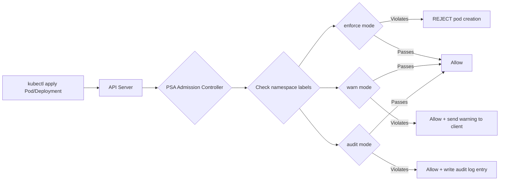

# Pod Security Standards, Security Contexts, and Container Hardening

**Date:** 2026-04-24 | **Updated:** 2026-04-24
**Tags:** `kubernetes` `pod-security` `security-context` `hardening` `admission`

## Table of Contents

- [Summary](#summary)
- [Pod Security Standards (PSS)](#pod-security-standards-pss)
  - [Three Levels](#three-levels)
  - [What Each Level Restricts](#what-each-level-restricts)
- [Pod Security Admission (PSA)](#pod-security-admission-psa)
  - [Enforcement Modes](#enforcement-modes)
  - [Namespace Labels](#namespace-labels)
  - [Practical Rollout Strategy](#practical-rollout-strategy)
- [Security Context](#security-context)
  - [Pod-Level vs Container-Level](#pod-level-vs-container-level)
  - [Key Fields](#key-fields)
  - [Gold Standard Security Context](#gold-standard-security-context)
- [Container Image Hardening](#container-image-hardening)
  - [Distroless Images](#distroless-images)
  - [Scratch Base Images](#scratch-base-images)
  - [Multi-Stage Builds](#multi-stage-builds)
  - [Image Digest Pinning](#image-digest-pinning)
- [Image Scanning](#image-scanning)
  - [Trivy](#trivy)
  - [CI/CD Integration](#cicd-integration)
- [Admission Controllers for Policy](#admission-controllers-for-policy)
  - [OPA Gatekeeper](#opa-gatekeeper)
  - [Kyverno](#kyverno)
  - [ValidatingAdmissionPolicy (Built-in)](#validatingadmissionpolicy-built-in)
  - [Comparison](#comparison)
- [Related](#related)
- [References](#references)

## Summary

Every container in Kubernetes runs with some set of Linux privileges. Left uncontrolled, a compromised container can escalate to root on the node, access the host network, or mount arbitrary host paths. Kubernetes provides layered defenses: **Pod Security Standards** define what "secure" means at three levels, **Pod Security Admission** enforces those standards at the namespace level, **security contexts** give you per-pod and per-container knobs, and **admission controllers** like Kyverno and OPA Gatekeeper let you write custom policies. Combine these with hardened container images and image scanning, and you have a defense-in-depth posture that catches misconfigurations before they reach production.

## Pod Security Standards (PSS)

Pod Security Standards are a set of predefined security profiles that Kubernetes defines as the vocabulary for what pods are and are not allowed to do. They are not a mechanism themselves — they are the *policy definitions* that mechanisms like PSA enforce.

### Three Levels

| Level | Intent | Who Uses It |
|-------|--------|-------------|
| **Privileged** | Unrestricted. No security constraints applied. | System-level workloads: CNI plugins, CSI drivers, log collectors that need host access |
| **Baseline** | Minimally restrictive. Prevents *known* privilege escalations while staying compatible with most workloads. | Default for application namespaces. Your Spring Boot and Node.js services almost certainly pass this level. |
| **Restricted** | Heavily restricted. Current best-practice hardening. | Production workloads where you want maximum defense. Requires changes to most off-the-shelf Helm charts. |

### What Each Level Restricts

| Control | Privileged | Baseline | Restricted |
|---------|:----------:|:--------:|:----------:|
| `hostNetwork` | Allowed | **Blocked** | **Blocked** |
| `hostPID` | Allowed | **Blocked** | **Blocked** |
| `hostIPC` | Allowed | **Blocked** | **Blocked** |
| `privileged` containers | Allowed | **Blocked** | **Blocked** |
| Host ports | Allowed | **Blocked** | **Blocked** |
| `hostPath` volumes | Allowed | Allowed | **Blocked** |
| Capabilities beyond default | Allowed | Limited (drops `ALL`, allows `NET_BIND_SERVICE`) | Drop `ALL`, add only `NET_BIND_SERVICE` |
| `/proc` mount type | Any | Default mask | Default mask |
| Sysctls | Any | Safe set only | Safe set only |
| `runAsNonRoot` | Not required | Not required | **Required** |
| `runAsUser` (0 / root) | Allowed | Allowed | **Blocked** |
| `seccompProfile` | Any | Any | **RuntimeDefault** or **Localhost** required |
| `allowPrivilegeEscalation` | Allowed | Allowed | **Must be false** |
| Volume types | Any | Any (except hostPath) | ConfigMap, emptyDir, PVC, secret, projected, downwardAPI, CSI, ephemeral only |
| `readOnlyRootFilesystem` | Not required | Not required | Not required (recommended, not enforced by PSS) |

> **Spring Boot / Node.js note:** Your typical application pod passes Baseline without changes. Getting to Restricted usually means adding `seccompProfile`, setting `runAsNonRoot: true`, dropping all capabilities, and setting `allowPrivilegeEscalation: false`. These are all good practices regardless.

## Pod Security Admission (PSA)

Pod Security Admission is the **built-in admission controller** that enforces Pod Security Standards. It replaced the deprecated PodSecurityPolicy (removed in Kubernetes 1.25) and is GA since Kubernetes 1.25. No webhooks, no external components — it ships with every cluster.



### Enforcement Modes

| Mode | On Violation | Visible To |
|------|-------------|------------|
| **enforce** | Pod is **rejected** | User gets an error on `kubectl apply` |
| **warn** | Pod is **allowed**, user gets a warning message | User sees a warning in terminal output |
| **audit** | Pod is **allowed**, violation is recorded in the audit log | Cluster operators via audit log |

### Namespace Labels

You apply PSA by labeling namespaces. Each mode has its own label:

```yaml
apiVersion: v1
kind: Namespace
metadata:
  name: production-apps
  labels:
    # Enforce restricted level — reject non-compliant pods
    pod-security.kubernetes.io/enforce: restricted
    pod-security.kubernetes.io/enforce-version: v1.31

    # Warn on restricted violations — surface issues during rollout
    pod-security.kubernetes.io/warn: restricted
    pod-security.kubernetes.io/warn-version: v1.31

    # Audit restricted violations — capture in audit log
    pod-security.kubernetes.io/audit: restricted
    pod-security.kubernetes.io/audit-version: v1.31
```

The `*-version` label pins the policy to a specific Kubernetes version's definition of that level. Use `latest` during development, pin to a specific version in production so upgrades don't silently change policy.

```yaml
# Typical development namespace — warn but don't block
apiVersion: v1
kind: Namespace
metadata:
  name: dev-team-alpha
  labels:
    pod-security.kubernetes.io/enforce: baseline
    pod-security.kubernetes.io/warn: restricted
    pod-security.kubernetes.io/audit: restricted
```

### Practical Rollout Strategy

Rolling PSA into an existing cluster without breaking workloads:

1. **Start with audit + warn on restricted** in all namespaces — no pods are rejected, but you see every violation in audit logs and `kubectl` warnings.
2. **Fix violations** — update Deployments, StatefulSets, Helm values to pass the restricted profile. Most changes are adding securityContext fields.
3. **Enforce baseline** while keeping warn + audit on restricted — you now block known-dangerous patterns while still surfacing restricted violations as warnings.
4. **Promote to enforce restricted** namespace by namespace once all workloads pass.
5. **Exempt system namespaces** — `kube-system`, monitoring, and CNI namespaces often require privileged access. Keep them at privileged or baseline.

```bash
# Quick check: dry-run enforce restricted on a namespace to see what would fail
kubectl label --dry-run=server --overwrite ns production-apps \
  pod-security.kubernetes.io/enforce=restricted
```

## Security Context

The `securityContext` field is where you configure Linux security settings for pods and containers. It maps directly to Linux kernel capabilities, user IDs, and security modules.

### Pod-Level vs Container-Level

```yaml
apiVersion: v1
kind: Pod
metadata:
  name: example
spec:
  # Pod-level: applies to ALL containers as default
  securityContext:
    runAsNonRoot: true
    runAsUser: 1000
    runAsGroup: 1000
    fsGroup: 1000
    seccompProfile:
      type: RuntimeDefault

  containers:
    - name: app
      image: myapp:1.0
      # Container-level: overrides pod-level for THIS container
      securityContext:
        allowPrivilegeEscalation: false
        readOnlyRootFilesystem: true
        capabilities:
          drop: ["ALL"]
```

**Rule of thumb:** Set shared defaults at pod level, per-container overrides at container level. Container-level settings take precedence.

### Key Fields

| Field | Level | What It Does | Recommended Value |
|-------|-------|-------------|-------------------|
| `runAsNonRoot` | Pod / Container | Kubelet refuses to start the container if it would run as UID 0 | `true` |
| `runAsUser` | Pod / Container | Sets the UID for the container process | Non-zero (e.g., `1000`) |
| `runAsGroup` | Pod / Container | Sets the primary GID | Non-zero (e.g., `1000`) |
| `fsGroup` | Pod only | Sets the group owner of mounted volumes; enables group-writable | Match `runAsGroup` |
| `readOnlyRootFilesystem` | Container only | Mounts the container's root filesystem as read-only | `true` |
| `allowPrivilegeEscalation` | Container only | Prevents `setuid` binaries from gaining elevated privileges | `false` |
| `capabilities.drop` | Container only | Linux capabilities to remove | `["ALL"]` |
| `capabilities.add` | Container only | Linux capabilities to re-add after dropping ALL | Only what you need (e.g., `NET_BIND_SERVICE`) |
| `seccompProfile.type` | Pod / Container | Seccomp filter: `RuntimeDefault`, `Localhost`, or `Unconfined` | `RuntimeDefault` minimum |

### Gold Standard Security Context

This is the production-hardened securityContext that passes the PSS **restricted** level. Copy this as your starting point for every Deployment:

```yaml
apiVersion: apps/v1
kind: Deployment
metadata:
  name: order-service
  namespace: production-apps
spec:
  replicas: 3
  selector:
    matchLabels:
      app: order-service
  template:
    metadata:
      labels:
        app: order-service
    spec:
      automountServiceAccountToken: false   # Don't mount SA token unless needed
      securityContext:
        runAsNonRoot: true
        runAsUser: 1000
        runAsGroup: 1000
        fsGroup: 1000
        seccompProfile:
          type: RuntimeDefault
      containers:
        - name: order-service
          image: registry.example.com/order-service@sha256:abc123...
          ports:
            - containerPort: 8080
              protocol: TCP
          securityContext:
            allowPrivilegeEscalation: false
            readOnlyRootFilesystem: true
            capabilities:
              drop: ["ALL"]
          # Writable directories go in emptyDir volumes
          volumeMounts:
            - name: tmp
              mountPath: /tmp
            - name: app-cache
              mountPath: /app/cache
          resources:
            requests:
              cpu: 100m
              memory: 256Mi
            limits:
              memory: 512Mi
      volumes:
        - name: tmp
          emptyDir:
            sizeLimit: 64Mi
        - name: app-cache
          emptyDir:
            sizeLimit: 128Mi
```

**Why `readOnlyRootFilesystem` + emptyDir volumes?** Your app (Spring Boot writing to `/tmp`, Node.js caching) needs writable directories. Instead of making the entire filesystem writable, mount specific writable directories as ephemeral volumes. This prevents an attacker from writing scripts or binaries into the container filesystem.

**Why `automountServiceAccountToken: false`?** Most application pods never call the Kubernetes API. Mounting the token creates an unnecessary attack vector — a compromised container could use it to query the API server.

## Container Image Hardening

The pod security context controls *runtime* behavior, but the image itself determines what is available inside the container. A hardened image minimizes the tools an attacker can use after gaining code execution.

### Distroless Images

[Google's distroless images](https://github.com/GoogleContainerTools/distroless) contain only your application and its runtime dependencies. No shell, no package manager, no `curl`, no `wget`.

```dockerfile
# Java (Spring Boot)
FROM eclipse-temurin:21-jre AS runtime
# ... or go fully distroless:
FROM gcr.io/distroless/java21-debian12:nonroot
COPY --from=build /app/target/order-service.jar /app/order-service.jar
ENTRYPOINT ["java", "-jar", "/app/order-service.jar"]

# Node.js
FROM gcr.io/distroless/nodejs22-debian12:nonroot
COPY --from=build /app/dist /app/dist
COPY --from=build /app/node_modules /app/node_modules
COPY --from=build /app/package.json /app/package.json
WORKDIR /app
CMD ["dist/main.js"]
```

The `:nonroot` tag variant runs as UID 65532 by default — no `USER` directive needed.

### Scratch Base Images

For statically compiled Go binaries (or Rust, C with musl):

```dockerfile
FROM golang:1.23 AS build
WORKDIR /src
COPY . .
RUN CGO_ENABLED=0 go build -o /app/server ./cmd/server

FROM scratch
COPY --from=build /app/server /server
COPY --from=build /etc/ssl/certs/ca-certificates.crt /etc/ssl/certs/
USER 65532:65532
ENTRYPOINT ["/server"]
```

`scratch` is literally an empty filesystem. The binary *is* the entire image. Nothing to exploit.

### Multi-Stage Builds

Build tools, compilers, and source code should never ship in the production image:

```dockerfile
# Stage 1: Build
FROM node:22-alpine AS build
WORKDIR /app
COPY package.json package-lock.json ./
RUN npm ci --ignore-scripts
COPY . .
RUN npm run build

# Stage 2: Production (only runtime artifacts)
FROM gcr.io/distroless/nodejs22-debian12:nonroot
WORKDIR /app
COPY --from=build /app/dist ./dist
COPY --from=build /app/node_modules ./node_modules
COPY --from=build /app/package.json ./package.json
CMD ["dist/main.js"]
```

### Image Digest Pinning

Tags are mutable — `nginx:1.27` can point to different content over time. Digests are immutable:

```yaml
# Bad: tag can be overwritten, or you can get a different image on repull
image: nginx:1.27

# Good: pinned to exact content, reproducible
image: nginx@sha256:6db391d1c0cfb30588ba0bf72ea999404f2764dc... 

# Best: tag for readability + digest for immutability
image: nginx:1.27@sha256:6db391d1c0cfb30588ba0bf72ea999404f2764dc...
```

Use tools like [Renovate](https://github.com/renovatebot/renovate) or [Dependabot](https://github.com/dependabot) to automate digest updates when new patch versions are released.

## Image Scanning

### Trivy

[Trivy](https://github.com/aquasecurity/trivy) is the most widely adopted open-source scanner. It detects OS package CVEs, language-specific library vulnerabilities (npm, Maven, Go modules), misconfigurations, and embedded secrets.

```bash
# Scan a local image for vulnerabilities
trivy image myregistry.example.com/order-service:v1.2.3

# Scan and fail on HIGH or CRITICAL (useful in CI)
trivy image --exit-code 1 --severity HIGH,CRITICAL \
  myregistry.example.com/order-service:v1.2.3

# Scan a Dockerfile for misconfigurations
trivy config ./Dockerfile

# Scan a Kubernetes manifest for misconfigurations
trivy config ./k8s/deployment.yaml

# Generate SBOM (Software Bill of Materials)
trivy image --format spdx-json --output sbom.json \
  myregistry.example.com/order-service:v1.2.3
```

### CI/CD Integration

```yaml
# GitHub Actions example
- name: Scan image with Trivy
  uses: aquasecurity/trivy-action@master
  with:
    image-ref: ${{ env.IMAGE }}
    format: table
    exit-code: 1
    severity: HIGH,CRITICAL
    ignore-unfixed: true   # Don't fail on CVEs with no available fix
```

**Severity classification and blocking policy:**

| Severity | Action | Rationale |
|----------|--------|-----------|
| CRITICAL | **Block** deployment | Actively exploited or trivially exploitable |
| HIGH | **Block** deployment | Significant risk, patch available |
| MEDIUM | **Warn**, fix within sprint | Monitor, prioritize in backlog |
| LOW | **Log**, fix opportunistically | Track but don't block releases |

**Admission-time scanning:** Tools like [Harbor](https://goharbor.io/) (registry-level scanning) and the Trivy Operator (in-cluster scanning) can prevent images with known CVEs from being pulled or scheduled.

## Admission Controllers for Policy

PSA covers the Pod Security Standards, but real-world policy needs go beyond PSS. You might want to require specific labels, block `latest` tags, enforce resource limits, or mandate image registries. Three main tools fill this gap.

### OPA Gatekeeper

[Gatekeeper](https://open-policy-agent.github.io/gatekeeper/) brings Open Policy Agent into Kubernetes via CRDs.

**Model:** Write policies in **Rego** (OPA's policy language), package them as `ConstraintTemplate` CRDs, then create `Constraint` instances that apply them.

```yaml
# ConstraintTemplate: defines the policy logic
apiVersion: templates.gatekeeper.sh/v1
kind: ConstraintTemplate
metadata:
  name: k8srequiredlabels
spec:
  crd:
    spec:
      names:
        kind: K8sRequiredLabels
      validation:
        openAPIV3Schema:
          type: object
          properties:
            labels:
              type: array
              items:
                type: string
  targets:
    - target: admission.k8s.gatekeeper.sh
      rego: |
        package k8srequiredlabels
        violation[{"msg": msg}] {
          provided := {label | input.review.object.metadata.labels[label]}
          required := {label | label := input.parameters.labels[_]}
          missing := required - provided
          count(missing) > 0
          msg := sprintf("Missing required labels: %v", [missing])
        }
---
# Constraint: applies the policy to Deployments
apiVersion: constraints.gatekeeper.sh/v1beta1
kind: K8sRequiredLabels
metadata:
  name: deploy-must-have-owner
spec:
  match:
    kinds:
      - apiGroups: ["apps"]
        kinds: ["Deployment"]
  parameters:
    labels: ["app.kubernetes.io/name", "app.kubernetes.io/owner"]
```

**Strengths:** Extremely expressive (Rego is a full policy language), large policy library, audit mode, external data support.
**Weaknesses:** Rego has a learning curve, webhook-based (adds latency), operational overhead of running the Gatekeeper pods.

### Kyverno

[Kyverno](https://kyverno.io/) is a Kubernetes-native policy engine where policies are written in plain YAML — no new language to learn.

```yaml
apiVersion: kyverno.io/v1
kind: ClusterPolicy
metadata:
  name: disallow-latest-tag
  annotations:
    policies.kyverno.io/title: Disallow Latest Tag
    policies.kyverno.io/severity: medium
spec:
  validationFailureAction: Enforce    # or Audit
  background: true
  rules:
    - name: validate-image-tag
      match:
        any:
          - resources:
              kinds:
                - Pod
      validate:
        message: "Using 'latest' tag is not allowed. Pin to a specific version or digest."
        pattern:
          spec:
            containers:
              - image: "!*:latest & !*:*"  # Block :latest and untagged
    - name: require-digest
      match:
        any:
          - resources:
              kinds:
                - Pod
      validate:
        message: "Images must use a digest (@sha256:...)."
        pattern:
          spec:
            containers:
              - image: "*@sha256:*"
```

Kyverno can also **mutate** resources (inject sidecars, add labels) and **generate** resources (create NetworkPolicies when namespaces are created):

```yaml
# Mutate: auto-inject securityContext if missing
apiVersion: kyverno.io/v1
kind: ClusterPolicy
metadata:
  name: add-default-security-context
spec:
  rules:
    - name: add-security-context
      match:
        any:
          - resources:
              kinds:
                - Pod
      mutate:
        patchStrategicMerge:
          spec:
            securityContext:
              runAsNonRoot: true
              seccompProfile:
                type: RuntimeDefault
```

**Strengths:** YAML-native (no Rego), mutate + generate capabilities, straightforward for Kubernetes operators.
**Weaknesses:** Still webhook-based, less expressive than Rego for complex logic, another controller to run.

### ValidatingAdmissionPolicy (Built-in)

**GA in Kubernetes 1.30** (April 2024). This is Kubernetes' built-in answer — no webhooks, no external controllers.

Policies use **CEL (Common Expression Language)** expressions evaluated directly in the API server:

```yaml
apiVersion: admissionregistration.k8s.io/v1
kind: ValidatingAdmissionPolicy
metadata:
  name: require-run-as-nonroot
spec:
  failurePolicy: Fail
  matchConstraints:
    resourceRules:
      - apiGroups: [""]
        apiVersions: ["v1"]
        operations: ["CREATE", "UPDATE"]
        resources: ["pods"]
  validations:
    - expression: >-
        object.spec.containers.all(c,
          has(c.securityContext) &&
          has(c.securityContext.runAsNonRoot) &&
          c.securityContext.runAsNonRoot == true
        )
      message: "All containers must set securityContext.runAsNonRoot to true"
    - expression: >-
        object.spec.containers.all(c,
          has(c.securityContext) &&
          has(c.securityContext.allowPrivilegeEscalation) &&
          c.securityContext.allowPrivilegeEscalation == false
        )
      message: "All containers must set allowPrivilegeEscalation to false"
---
apiVersion: admissionregistration.k8s.io/v1
kind: ValidatingAdmissionPolicyBinding
metadata:
  name: require-run-as-nonroot-binding
spec:
  policyName: require-run-as-nonroot
  validationActions: [Deny, Audit]
  matchResources:
    namespaceSelector:
      matchLabels:
        environment: production
```

**Strengths:** No webhook latency, no external dependency, ships with Kubernetes, CEL is simple to learn.
**Weaknesses:** Validate only (no mutate/generate), CEL is less expressive than Rego, limited to what you can express in CEL.

### Comparison

| Criterion | PSA (Built-in) | ValidatingAdmissionPolicy | OPA Gatekeeper | Kyverno |
|-----------|:---:|:---:|:---:|:---:|
| Requires external controller | No | No | Yes | Yes |
| Policy language | Predefined (3 levels) | CEL | Rego | YAML patterns + CEL |
| Custom policies | No | Yes | Yes | Yes |
| Mutate resources | No | No | No (Gatekeeper alone) | Yes |
| Generate resources | No | No | No | Yes |
| Audit/dry-run mode | Yes | Yes | Yes | Yes |
| Webhook latency | None | None | Yes | Yes |
| Learning curve | Minimal | Low (CEL) | Moderate (Rego) | Low (YAML) |
| Kubernetes version | 1.25+ | 1.30+ | Any | Any |

**When to use which:**

- **PSA alone** — small teams, standard workloads, no custom policy needs beyond PSS levels.
- **PSA + ValidatingAdmissionPolicy** — you want custom policies without running extra controllers. Good for clusters on K8s 1.30+.
- **PSA + Kyverno** — you need mutation (auto-inject security defaults) or generation (auto-create NetworkPolicies). YAML-native appeal.
- **PSA + OPA Gatekeeper** — you have complex cross-resource policies, you already use OPA elsewhere, or you need the expressiveness of Rego.

## Related

- [RBAC, ServiceAccounts, and Identity in Kubernetes](rbac-and-service-accounts.md) — who can do what in the cluster
- [Secrets Management and Supply Chain Security](secrets-and-supply-chain.md) — encryption at rest, ESO, image provenance
- [Pods, ReplicaSets, and Deployments](../workloads/pods-and-deployments.md) — the workload objects these security settings apply to
- [ConfigMaps and Secrets](../configuration/configmaps-and-secrets.md) — configuration injection patterns
- [Resource Requests, Limits, and QoS](../configuration/resource-management.md) — resource constraints that complement security contexts

## References

1. [Pod Security Standards — Kubernetes Docs](https://kubernetes.io/docs/concepts/security/pod-security-standards/)
2. [Pod Security Admission — Kubernetes Docs](https://kubernetes.io/docs/concepts/security/pod-security-admission/)
3. [Validating Admission Policy — Kubernetes Docs](https://kubernetes.io/docs/reference/access-authn-authz/validating-admission-policy/)
4. [Kubernetes 1.30: Validating Admission Policy Is Generally Available](https://kubernetes.io/blog/2024/04/24/validating-admission-policy-ga/)
5. [Google Distroless Container Images](https://github.com/GoogleContainerTools/distroless)
6. [Trivy — Comprehensive Security Scanner](https://github.com/aquasecurity/trivy)
7. [Kyverno — Kubernetes Native Policy Management](https://kyverno.io/docs/)
8. [OPA Gatekeeper — Policy Controller for Kubernetes](https://open-policy-agent.github.io/gatekeeper/website/docs/)
