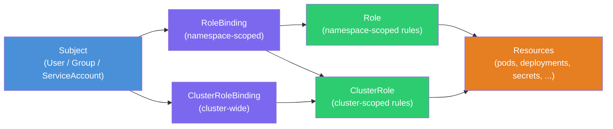

# RBAC, ServiceAccounts, and Identity in Kubernetes

**Doc 13** in the Kubernetes learning path. Covers how Kubernetes identifies humans and workloads, the RBAC authorization model, least-privilege patterns for real scenarios, audit logging, and impersonation for testing.

**Key subtopics:** Authentication methods (X.509, OIDC, tokens), ServiceAccount lifecycle and bound tokens, Role and ClusterRole rules, RoleBinding and ClusterRoleBinding subjects, aggregated ClusterRoles, built-in roles, least-privilege recipes, audit policy, impersonation and `kubectl auth can-i`.

---

## Table of Contents

- [Summary](#summary)
- [How RBAC Binds Subjects to Resources](#how-rbac-binds-subjects-to-resources)
- [Authentication — Who Are You?](#authentication--who-are-you)
  - [X.509 Client Certificates](#x509-client-certificates)
  - [Bearer Tokens](#bearer-tokens)
  - [OpenID Connect (OIDC)](#openid-connect-oidc)
  - [Webhook Token Authentication](#webhook-token-authentication)
  - [No Built-In User Objects](#no-built-in-user-objects)
- [ServiceAccounts — In-Cluster Identity](#serviceaccounts--in-cluster-identity)
  - [Default ServiceAccount per Namespace](#default-serviceaccount-per-namespace)
  - [Bound Service Account Tokens](#bound-service-account-tokens)
  - [Disabling Auto-Mount](#disabling-auto-mount)
  - [Token Request API](#token-request-api)
- [Authorization — What Can You Do?](#authorization--what-can-you-do)
  - [Role vs ClusterRole](#role-vs-clusterrole)
  - [RoleBinding vs ClusterRoleBinding](#rolebinding-vs-clusterrolebinding)
  - [Rules: apiGroups, Resources, Verbs](#rules-apigroups-resources-verbs)
  - [Aggregated ClusterRoles](#aggregated-clusterroles)
  - [Built-In Roles](#built-in-roles)
- [Least Privilege Patterns](#least-privilege-patterns)
  - [App With No API Access](#app-with-no-api-access)
  - [App That Reads ConfigMaps](#app-that-reads-configmaps)
  - [CI/CD Pipeline Deployer](#cicd-pipeline-deployer)
  - [Developer kubectl Access](#developer-kubectl-access)
- [Audit Logging](#audit-logging)
  - [Audit Policy Levels](#audit-policy-levels)
  - [What to Audit](#what-to-audit)
  - [Practical Audit Policy](#practical-audit-policy)
- [Impersonation and Permission Testing](#impersonation-and-permission-testing)
- [Spring Boot and Node.js Considerations](#spring-boot-and-nodejs-considerations)
- [Related](#related)
- [References](#references)

---

## Summary

Kubernetes has no user database. It delegates **authentication** (who are you?) to external systems — X.509 certificates, OIDC providers, webhook endpoints — and handles **authorization** (what can you do?) internally through RBAC. In-cluster workloads get identity through **ServiceAccounts**, which since Kubernetes 1.22 issue short-lived, audience-scoped **bound tokens** via projected volumes instead of long-lived secrets. The RBAC model maps **Subjects** (users, groups, ServiceAccounts) to **Roles** (sets of permissions) through **Bindings**, following the principle of least privilege: grant the minimum permissions needed, scoped to the narrowest namespace possible.

---

## How RBAC Binds Subjects to Resources



Key takeaway: a **RoleBinding** can reference a **ClusterRole** to reuse cluster-wide permission definitions while scoping them to a single namespace. This is the most common pattern for developer access.

---

## Authentication — Who Are You?

Kubernetes does not store user accounts. Every authentication method boils down to: the API server receives a request, extracts identity claims, and either accepts or rejects the request before RBAC even runs.

### X.509 Client Certificates

The **default method** when you bootstrap a cluster with kubeadm. The API server's `--client-ca-file` flag points to a CA bundle. Any client presenting a certificate signed by that CA is authenticated.

- **Username** comes from the certificate's Common Name (CN): `CN=alice`
- **Groups** come from Organization (O) fields: `O=developers`

```bash
# Generate a key and CSR for user "alice" in group "developers"
openssl genrsa -out alice.key 2048
openssl req -new -key alice.key -out alice.csr \
  -subj "/CN=alice/O=developers"

# Submit a CertificateSigningRequest to K8s
cat <<EOF | kubectl apply -f -
apiVersion: certificates.k8s.io/v1
kind: CertificateSigningRequest
metadata:
  name: alice-csr
spec:
  request: $(cat alice.csr | base64 | tr -d '\n')
  signerName: kubernetes.io/kube-apiserver-client
  usages: ["client auth"]
EOF

kubectl certificate approve alice-csr
kubectl get csr alice-csr -o jsonpath='{.status.certificate}' | base64 -d > alice.crt
```

**Downside:** No revocation mechanism short of rotating the entire CA or using short-lived certificates. This is why production clusters move to OIDC.

### Bearer Tokens

Several forms:

| Token Type | Source | Lifetime | Use Case |
|---|---|---|---|
| Static token file | `--token-auth-file` | Indefinite | Legacy, avoid |
| Bootstrap tokens | `kubeadm token create` | 24h default | Node joining only |
| ServiceAccount tokens | TokenRequest API | 1h default, configurable | In-cluster workloads |

Static token files are deprecated in practice. Bootstrap tokens are strictly for cluster bootstrapping.

### OpenID Connect (OIDC)

The **production-grade** authentication method. The API server validates JWT tokens from an OIDC provider without ever seeing user passwords.

Common OIDC providers for Kubernetes:
- **Dex** — open source, federates to LDAP, SAML, GitHub, Google
- **Keycloak** — full IAM with fine-grained access policies
- **Google / Azure AD / Okta** — managed identity providers

API server flags:

```
--oidc-issuer-url=https://dex.example.com
--oidc-client-id=kubernetes
--oidc-username-claim=email
--oidc-groups-claim=groups
```

Flow: User authenticates with the OIDC provider → gets an ID token (JWT) → `kubectl` sends the token as a bearer token → API server validates the JWT signature and expiry against the OIDC provider's JWKS endpoint → extracts username and groups from claims.

### Webhook Token Authentication

For custom authentication systems. The API server forwards the bearer token to an external webhook that returns the authenticated identity:

```
--authentication-token-webhook-config-file=/etc/kubernetes/webhook-authn.yaml
```

Used when your organization has a bespoke identity service that doesn't speak OIDC.

### No Built-In User Objects

This surprises many newcomers: there is **no `User` resource** you can `kubectl get`. Kubernetes trusts whatever the authentication layer tells it. If a certificate says `CN=alice`, that user is "alice" — there is no object in etcd representing her. This means:

- You cannot list all users with kubectl
- User lifecycle (creation, deactivation) is managed entirely outside Kubernetes
- Groups are also external — they come from certificate O fields or OIDC claims

---

## ServiceAccounts — In-Cluster Identity

While external users authenticate via certificates or OIDC, **workloads running inside the cluster** use ServiceAccounts. Every Pod runs as a ServiceAccount, and that identity determines what Kubernetes API calls the Pod can make.

### Default ServiceAccount per Namespace

When you create a namespace, Kubernetes automatically creates a `default` ServiceAccount in it:

```bash
kubectl get sa -n my-namespace
# NAME      SECRETS   AGE
# default   0         5m
```

Every Pod that doesn't specify `serviceAccountName` runs as this default SA. The default SA has **no RBAC permissions** beyond what's granted by bindings — but it still gets a token mounted, which is an unnecessary attack surface for most workloads.

### Bound Service Account Tokens

Since Kubernetes 1.22 (stable in 1.24), the kubelet mounts tokens via a **projected volume** using the TokenRequest API. These tokens are fundamentally different from the old Secret-based tokens:

| Property | Old Secret-Based Token | Bound Token (Current) |
|---|---|---|
| Lifetime | Never expires | 1 hour default, auto-rotated |
| Audience | None (valid for any API server) | Scoped to specific audiences |
| Bound to Pod | No | Yes — invalidated when Pod is deleted |
| Storage | Stored as Secret in etcd | Not stored — issued on demand |
| Revocation | Delete the Secret | Automatic on Pod deletion |

The projected volume mount looks like this under the hood:

```yaml
# Automatically injected by the kubelet — you don't write this yourself
volumes:
  - name: kube-api-access-xxxxx
    projected:
      sources:
        - serviceAccountToken:
            expirationSeconds: 3607
            path: token
            audience: "https://kubernetes.default.svc"
        - configMap:
            name: kube-root-ca.crt
            items:
              - key: ca.crt
                path: ca.crt
        - downwardAPI:
            items:
              - path: namespace
                fieldRef:
                  fieldPath: metadata.namespace
```

The token file at `/var/run/secrets/kubernetes.io/serviceaccount/token` is refreshed automatically before expiry. Client libraries (like the Java `fabric8` client or the Node.js `@kubernetes/client-node`) read this path and handle rotation transparently.

> **Since 1.24:** Kubernetes no longer auto-generates Secret-based long-lived tokens for new ServiceAccounts. If you see old guides telling you to extract a token from a Secret — that pattern is obsolete.

### Disabling Auto-Mount

If your Pod doesn't call the Kubernetes API (which is **most application Pods**), disable the token mount entirely:

```yaml
apiVersion: v1
kind: ServiceAccount
metadata:
  name: my-app
  namespace: production
automountServiceAccountToken: false
---
apiVersion: apps/v1
kind: Deployment
metadata:
  name: my-app
  namespace: production
spec:
  template:
    spec:
      serviceAccountName: my-app
      automountServiceAccountToken: false  # Belt and suspenders
      containers:
        - name: app
          image: my-app:v1.2.0
```

Setting it on **both** the ServiceAccount and the Pod spec is the belt-and-suspenders approach. The Pod spec takes precedence if they conflict.

### Token Request API

For tools and CI/CD pipelines that need a short-lived token without creating a Pod:

```bash
# Create a token valid for 10 minutes
kubectl create token my-sa --duration=10m -n production

# Create a token with a specific audience
kubectl create token my-sa --audience=https://vault.example.com -n production
```

This is the **recommended replacement** for `kubectl get secret <sa-token-secret>`, which no longer works for new ServiceAccounts.

---

## Authorization — What Can You Do?

After authentication, the API server checks authorization. Kubernetes supports multiple authorization modes (`--authorization-mode=Node,RBAC` is the default), but **RBAC** (Role-Based Access Control) is the one you configure directly.

### Role vs ClusterRole

| | Role | ClusterRole |
|---|---|---|
| **Scope** | Single namespace | Cluster-wide |
| **Use for** | App-specific permissions | Cross-namespace or non-namespaced resources |
| **Non-namespaced resources** | Cannot grant | Nodes, PVs, Namespaces, ClusterRoles |

**Role** — grants permissions within a specific namespace:

```yaml
apiVersion: rbac.authorization.k8s.io/v1
kind: Role
metadata:
  name: configmap-reader
  namespace: production
rules:
  - apiGroups: [""]        # core API group
    resources: ["configmaps"]
    verbs: ["get", "list", "watch"]
```

**ClusterRole** — grants permissions cluster-wide or on non-namespaced resources:

```yaml
apiVersion: rbac.authorization.k8s.io/v1
kind: ClusterRole
metadata:
  name: node-reader
rules:
  - apiGroups: [""]
    resources: ["nodes"]
    verbs: ["get", "list", "watch"]
  - apiGroups: ["metrics.k8s.io"]
    resources: ["nodes"]
    verbs: ["get", "list"]
```

### RoleBinding vs ClusterRoleBinding

**RoleBinding** — binds a Role **or** ClusterRole to subjects **within a namespace**:

```yaml
apiVersion: rbac.authorization.k8s.io/v1
kind: RoleBinding
metadata:
  name: dev-configmap-reader
  namespace: production
subjects:
  - kind: User
    name: alice
    apiGroup: rbac.authorization.k8s.io
  - kind: Group
    name: developers
    apiGroup: rbac.authorization.k8s.io
  - kind: ServiceAccount
    name: my-app
    namespace: production
roleRef:
  kind: Role           # or ClusterRole
  name: configmap-reader
  apiGroup: rbac.authorization.k8s.io
```

**ClusterRoleBinding** — binds a ClusterRole to subjects **cluster-wide**:

```yaml
apiVersion: rbac.authorization.k8s.io/v1
kind: ClusterRoleBinding
metadata:
  name: global-view
subjects:
  - kind: Group
    name: all-developers
    apiGroup: rbac.authorization.k8s.io
roleRef:
  kind: ClusterRole
  name: view
  apiGroup: rbac.authorization.k8s.io
```

> **Common pattern:** Use a ClusterRole for the permission definition (reusable across namespaces) + a RoleBinding per namespace to scope it. This avoids duplicating Role definitions.

### Rules: apiGroups, Resources, Verbs

Every RBAC rule is a tuple of three dimensions:

| Dimension | Description | Examples |
|---|---|---|
| `apiGroups` | The API group the resource belongs to | `""` (core), `"apps"`, `"batch"`, `"networking.k8s.io"` |
| `resources` | The resource type | `"pods"`, `"deployments"`, `"services"`, `"configmaps"` |
| `verbs` | The allowed operations | `"get"`, `"list"`, `"watch"`, `"create"`, `"update"`, `"patch"`, `"delete"` |

You can also grant access to **specific named resources** and **subresources**:

```yaml
rules:
  # Only allow reading a specific ConfigMap
  - apiGroups: [""]
    resources: ["configmaps"]
    resourceNames: ["app-config"]
    verbs: ["get"]

  # Allow reading pod logs (subresource)
  - apiGroups: [""]
    resources: ["pods/log"]
    verbs: ["get"]

  # Allow exec into pods (dangerous — audit carefully)
  - apiGroups: [""]
    resources: ["pods/exec"]
    verbs: ["create"]
```

Finding the right apiGroup for a resource:

```bash
# List all API resources with their groups
kubectl api-resources -o wide

# Check a specific resource
kubectl api-resources | grep deployment
# NAME          SHORTNAMES   APIVERSION   NAMESPACED   KIND
# deployments   deploy       apps/v1      true         Deployment
# → apiGroup is "apps"
```

### Aggregated ClusterRoles

Aggregated ClusterRoles let you compose permissions by labeling component ClusterRoles and having a parent ClusterRole automatically collect their rules:

```yaml
# Parent: automatically aggregates any ClusterRole with the matching label
apiVersion: rbac.authorization.k8s.io/v1
kind: ClusterRole
metadata:
  name: monitoring-aggregate
aggregationRule:
  clusterRoleSelectors:
    - matchLabels:
        rbac.authorization.k8s.io/aggregate-to-monitoring: "true"
rules: []  # Populated automatically by the controller

---
# Child: contributes its rules to the parent
apiVersion: rbac.authorization.k8s.io/v1
kind: ClusterRole
metadata:
  name: monitoring-metrics
  labels:
    rbac.authorization.k8s.io/aggregate-to-monitoring: "true"
rules:
  - apiGroups: ["metrics.k8s.io"]
    resources: ["pods", "nodes"]
    verbs: ["get", "list"]
```

The built-in `admin`, `edit`, and `view` roles are aggregated — when you install a CRD (like a ServiceMonitor), you can label a ClusterRole with `rbac.authorization.k8s.io/aggregate-to-view: "true"` to automatically grant view access to that CRD through the existing `view` role.

### Built-In Roles

Kubernetes ships four default ClusterRoles meant for user-facing access:

| ClusterRole | Permissions | Typical Binding |
|---|---|---|
| `cluster-admin` | Everything. Bypasses all RBAC. | Break-glass access only |
| `admin` | Full access within a namespace (no ResourceQuota/Namespace) | Team lead per namespace |
| `edit` | Read/write on most resources (no Roles/RoleBindings) | Developer per namespace |
| `view` | Read-only on most resources (no Secrets) | Read-only dashboard, auditors |

> **Never bind `cluster-admin` to a ServiceAccount** used by an application. If your CI/CD tool says it needs cluster-admin, that tool has a design problem.

---

## Least Privilege Patterns

### App With No API Access

Most application Pods (your Spring Boot service, your Node.js API) never call the Kubernetes API. They don't need a token:

```yaml
apiVersion: v1
kind: ServiceAccount
metadata:
  name: web-api
  namespace: production
automountServiceAccountToken: false
---
apiVersion: apps/v1
kind: Deployment
metadata:
  name: web-api
  namespace: production
spec:
  replicas: 3
  selector:
    matchLabels:
      app: web-api
  template:
    metadata:
      labels:
        app: web-api
    spec:
      serviceAccountName: web-api
      automountServiceAccountToken: false
      containers:
        - name: app
          image: web-api:v2.1.0
```

No Role, no RoleBinding — the ServiceAccount exists purely as an identity anchor for Pod Security and audit logging.

### App That Reads ConfigMaps

A sidecar or init container that reads configuration from the API:

```yaml
apiVersion: v1
kind: ServiceAccount
metadata:
  name: config-watcher
  namespace: production
---
apiVersion: rbac.authorization.k8s.io/v1
kind: Role
metadata:
  name: configmap-reader
  namespace: production
rules:
  - apiGroups: [""]
    resources: ["configmaps"]
    verbs: ["get", "list", "watch"]
---
apiVersion: rbac.authorization.k8s.io/v1
kind: RoleBinding
metadata:
  name: config-watcher-reads-configmaps
  namespace: production
subjects:
  - kind: ServiceAccount
    name: config-watcher
    namespace: production
roleRef:
  kind: Role
  name: configmap-reader
  apiGroup: rbac.authorization.k8s.io
```

### CI/CD Pipeline Deployer

A CI/CD system (GitHub Actions, GitLab CI, ArgoCD) that creates and updates Deployments and Services in a target namespace:

```yaml
apiVersion: v1
kind: ServiceAccount
metadata:
  name: ci-deployer
  namespace: staging
---
apiVersion: rbac.authorization.k8s.io/v1
kind: Role
metadata:
  name: deployer
  namespace: staging
rules:
  - apiGroups: ["apps"]
    resources: ["deployments"]
    verbs: ["get", "list", "watch", "create", "update", "patch"]
  - apiGroups: [""]
    resources: ["services"]
    verbs: ["get", "list", "watch", "create", "update", "patch"]
  - apiGroups: [""]
    resources: ["configmaps"]
    verbs: ["get", "list", "watch", "create", "update", "patch"]
  - apiGroups: ["networking.k8s.io"]
    resources: ["ingresses"]
    verbs: ["get", "list", "watch", "create", "update", "patch"]
---
apiVersion: rbac.authorization.k8s.io/v1
kind: RoleBinding
metadata:
  name: ci-deployer-binding
  namespace: staging
subjects:
  - kind: ServiceAccount
    name: ci-deployer
    namespace: staging
roleRef:
  kind: Role
  name: deployer
  apiGroup: rbac.authorization.k8s.io
```

Notice: no `delete` verb (deployments are replaced, not deleted), no access to Secrets (injected separately), no access to other namespaces.

### Developer kubectl Access

Give developers read-only cluster visibility plus edit access in their team's namespace:

```bash
# Cluster-wide: view everything (no Secrets content)
kubectl create clusterrolebinding dev-view \
  --clusterrole=view \
  --group=developers

# Namespace-scoped: edit access in the team namespace
kubectl create rolebinding dev-edit \
  --clusterrole=edit \
  --group=developers \
  --namespace=team-alpha
```

This is the sweet spot: developers can debug across namespaces (read pod logs, describe resources) but can only modify resources in their own namespace.

---

## Audit Logging

RBAC defines **what is allowed**, but audit logging tells you **what actually happened**. Without audit logs, you're blind to privilege escalation, credential theft, and unauthorized access.

### Audit Policy Levels

Kubernetes defines four audit levels, from least to most verbose:

| Level | Records | Use Case |
|---|---|---|
| `None` | Nothing | Skip known-noisy endpoints |
| `Metadata` | Who did what, when (no bodies) | Default for most resources |
| `Request` | Metadata + request body | Writes to sensitive resources |
| `RequestResponse` | Metadata + request body + response body | Forensic-grade, high storage cost |

### What to Audit

Focus audit logging on security-relevant events:

| Event Category | What to Capture | Why |
|---|---|---|
| Authentication failures | Failed token validation, expired certs | Brute force detection |
| RBAC denials | 403 responses on any verb | Misconfigured permissions or probing |
| Secrets access | get/list/watch on secrets | Credential theft detection |
| Pod exec/attach | create on pods/exec, pods/attach | Lateral movement detection |
| Role/Binding changes | create/update/delete on roles, rolebindings | Privilege escalation detection |
| ServiceAccount token creation | create on serviceaccounts/token | Token theft detection |

### Practical Audit Policy

```yaml
apiVersion: audit.k8s.io/v1
kind: Policy
rules:
  # Skip noisy read-only system traffic
  - level: None
    users: ["system:kube-proxy"]
    verbs: ["watch"]
    resources:
      - group: ""
        resources: ["endpoints", "services", "services/status"]

  # Skip health checks
  - level: None
    nonResourceURLs: ["/healthz*", "/livez*", "/readyz*"]

  # Log full request+response for secrets
  - level: RequestResponse
    resources:
      - group: ""
        resources: ["secrets"]

  # Log full request for RBAC changes
  - level: Request
    resources:
      - group: "rbac.authorization.k8s.io"
        resources: ["roles", "clusterroles", "rolebindings", "clusterrolebindings"]

  # Log request for exec into pods
  - level: Request
    resources:
      - group: ""
        resources: ["pods/exec", "pods/attach", "pods/portforward"]

  # Log request for token creation
  - level: Request
    resources:
      - group: ""
        resources: ["serviceaccounts/token"]

  # Metadata only for everything else
  - level: Metadata
    omitStages:
      - "RequestReceived"
```

Enable on the API server:

```
--audit-policy-file=/etc/kubernetes/audit-policy.yaml
--audit-log-path=/var/log/kubernetes/audit.log
--audit-log-maxage=30
--audit-log-maxbackup=10
--audit-log-maxsize=100
```

For production, send audit events to a webhook backend (Elasticsearch, Falco, Datadog) rather than relying on log files.

---

## Impersonation and Permission Testing

### kubectl auth can-i

The fastest way to verify RBAC configuration:

```bash
# Can I create deployments in production?
kubectl auth can-i create deployments -n production
# yes

# Can the CI deployer ServiceAccount create pods?
kubectl auth can-i create pods \
  --as=system:serviceaccount:staging:ci-deployer \
  -n staging
# no

# List ALL permissions for a ServiceAccount in a namespace
kubectl auth can-i --list \
  --as=system:serviceaccount:production:config-watcher \
  -n production
# Resources                        Non-Resource URLs   Resource Names   Verbs
# configmaps                       []                  []               [get list watch]
# selfsubjectaccessreviews.auth... [...]               []               [create]
# ...
```

### Impersonation for Testing

Use `--as` and `--as-group` to test what another identity can see:

```bash
# See what developer "alice" sees in the production namespace
kubectl get pods -n production --as=alice --as-group=developers

# Test a ServiceAccount's view
kubectl get configmaps -n production \
  --as=system:serviceaccount:production:config-watcher

# This should fail — the config-watcher can't read secrets
kubectl get secrets -n production \
  --as=system:serviceaccount:production:config-watcher
# Error from server (Forbidden): secrets is forbidden...
```

Impersonation itself requires RBAC permission (`impersonate` verb on `users`, `groups`, or `serviceaccounts`). Cluster admins have it by default.

---

## Spring Boot and Node.js Considerations

### Spring Boot (fabric8 / Spring Cloud Kubernetes)

Spring Cloud Kubernetes reads ConfigMaps and Secrets from the API server for dynamic configuration refresh. The Pod's ServiceAccount needs:

```yaml
rules:
  - apiGroups: [""]
    resources: ["configmaps", "secrets"]
    verbs: ["get", "list", "watch"]
  - apiGroups: [""]
    resources: ["pods"]
    verbs: ["get"]
```

The `fabric8` Kubernetes client auto-detects the projected token at `/var/run/secrets/kubernetes.io/serviceaccount/token` and handles rotation. No additional configuration needed.

### Node.js (@kubernetes/client-node)

The official `@kubernetes/client-node` library loads in-cluster config automatically:

```typescript
import * as k8s from '@kubernetes/client-node';

const kc = new k8s.KubeConfig();
kc.loadFromCluster(); // Reads projected token + CA cert automatically

const k8sApi = kc.makeApiClient(k8s.CoreV1Api);

// List ConfigMaps — requires get/list on configmaps
const configMaps = await k8sApi.listNamespacedConfigMap({ namespace: 'production' });
```

For Pods that don't use the Kubernetes API (Express/Fastify REST APIs, NestJS services), **always disable auto-mount**. The token is unnecessary and increases your attack surface if the container is compromised.

---

## Related

- [Pod Security Standards, Security Contexts, and Container Hardening](pod-security.md) — the next layer of defense after RBAC
- [Secrets Management and Supply Chain Security](secrets-and-supply-chain.md) — encryption at rest, external secrets, image provenance
- [ConfigMaps and Secrets — Injecting Configuration into Pods](../configuration/configmaps-and-secrets.md) — the resources RBAC protects
- [Kubernetes Cluster Architecture](../core-concepts/cluster-architecture.md) — the API server and control plane components that enforce RBAC

---

## References

- [Using RBAC Authorization — Kubernetes Docs](https://kubernetes.io/docs/reference/access-authn-authz/rbac/)
- [RBAC Good Practices — Kubernetes Docs](https://kubernetes.io/docs/concepts/security/rbac-good-practices/)
- [Authenticating — Kubernetes Docs](https://kubernetes.io/docs/reference/access-authn-authz/authentication/)
- [Service Accounts — Kubernetes Docs](https://kubernetes.io/docs/concepts/security/service-accounts/)
- [Managing Service Accounts — Kubernetes Docs](https://kubernetes.io/docs/reference/access-authn-authz/service-accounts-admin/)
- [Configure Service Accounts for Pods — Kubernetes Docs](https://kubernetes.io/docs/tasks/configure-pod-container/configure-service-account/)
- [Auditing — Kubernetes Docs](https://kubernetes.io/docs/tasks/debug/debug-cluster/audit/)
- [Security Checklist — Kubernetes Docs](https://kubernetes.io/docs/concepts/security/security-checklist/)
