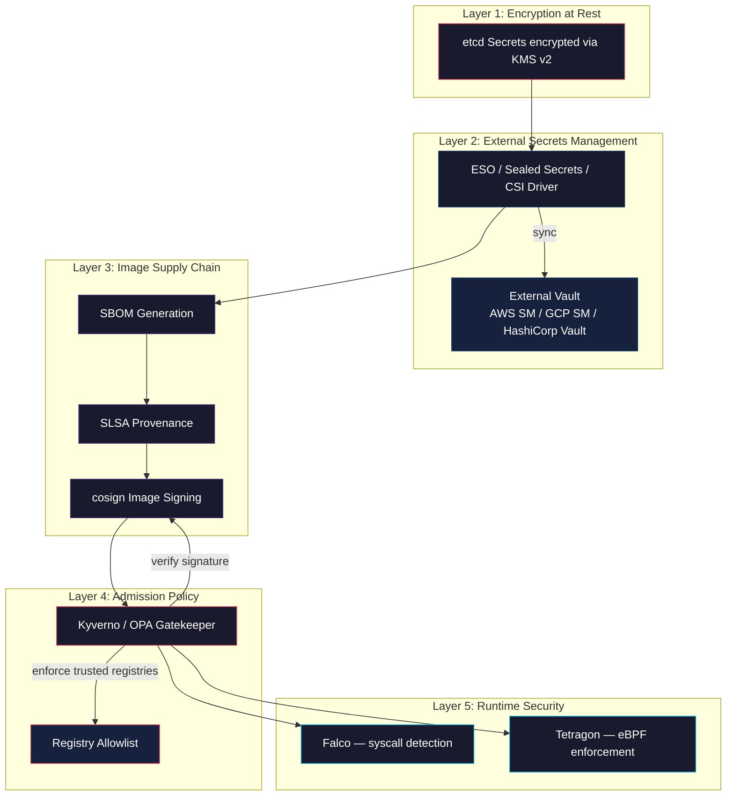
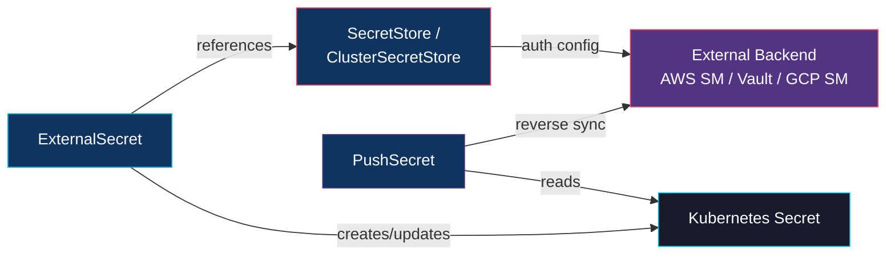

# Secrets Management and Supply Chain Security in Kubernetes

**Doc 15** in the Kubernetes learning path. Moves beyond the basics of Secrets covered in Doc 10 to deep-dive on encryption at rest, external secret management patterns, image supply chain integrity, and runtime threat detection.

**Key subtopics:** Secrets encryption at rest (KMS v2), External Secrets Operator, Sealed Secrets, CSI Secrets Store Driver, SBOM/SLSA, image signing with cosign, admission policies, Falco and Tetragon runtime security.

---

## Table of Contents

- [Summary](#summary)
- [Defense-in-Depth Overview](#defense-in-depth-overview)
- [Secrets Encryption at Rest Deep Dive](#secrets-encryption-at-rest-deep-dive)
  - [The Default Problem](#the-default-problem)
  - [EncryptionConfiguration](#encryptionconfiguration)
  - [Encryption Providers](#encryption-providers)
  - [KMS v2 — The Production Choice](#kms-v2--the-production-choice)
  - [Rotating Encryption Keys](#rotating-encryption-keys)
  - [Verifying Encryption](#verifying-encryption)
- [External Secrets Operator (ESO)](#external-secrets-operator-eso)
  - [Architecture](#architecture)
  - [Supported Backends](#supported-backends)
  - [Refresh Intervals and Sync](#refresh-intervals-and-sync)
  - [PushSecret — Reverse Sync](#pushsecret--reverse-sync)
- [Sealed Secrets](#sealed-secrets)
  - [The GitOps Problem](#the-gitops-problem)
  - [How It Works](#how-it-works)
  - [Scoping Modes](#scoping-modes)
  - [Key Rotation and Disaster Recovery](#key-rotation-and-disaster-recovery)
- [CSI Secrets Store Driver](#csi-secrets-store-driver)
  - [Architecture and Flow](#architecture-and-flow)
  - [SecretProviderClass Configuration](#secretproviderclass-configuration)
  - [Rotation Support](#rotation-support)
- [Image Supply Chain Security](#image-supply-chain-security)
  - [SBOM — Software Bill of Materials](#sbom--software-bill-of-materials)
  - [SLSA — Build Provenance](#slsa--build-provenance)
  - [Image Signing with cosign (Sigstore)](#image-signing-with-cosign-sigstore)
  - [Notation (CNCF)](#notation-cncf)
  - [Admission Policies for Trusted Registries](#admission-policies-for-trusted-registries)
- [Runtime Security](#runtime-security)
  - [Falco — Kernel-Level Threat Detection](#falco--kernel-level-threat-detection)
  - [Tetragon — eBPF Runtime Enforcement](#tetragon--ebpf-runtime-enforcement)
  - [Falco vs Tetragon](#falco-vs-tetragon)
- [Spring Boot and Node.js Considerations](#spring-boot-and-nodejs-considerations)
- [Related](#related)
- [References](#references)

---

## Summary

Kubernetes Secrets are just base64-encoded data stored in etcd. Without additional layers, anyone with etcd access or the right RBAC permissions reads your database passwords in cleartext. Production clusters require a layered defense: encryption at rest in etcd, external secrets management to keep credentials out of manifests, image supply chain verification to ensure nothing tampered with your containers, and runtime security to detect anomalous behavior after deployment.

This doc covers each layer in depth, with YAML examples and practical advice for a backend developer running Spring Boot or Node.js workloads on Kubernetes.

---

## Defense-in-Depth Overview



Each layer is independent. A failure in one layer does not compromise all others. The goal: **no single point of secret exposure, no unsigned images reaching production, no undetected anomalous behavior at runtime.**

---

## Secrets Encryption at Rest Deep Dive

### The Default Problem

By default, Kubernetes stores Secrets in etcd with base64 encoding — **not encryption**:

```bash
# Anyone with etcd access can read your secrets in cleartext
etcdctl get /registry/secrets/default/my-database-creds | hexdump -C
# You will see the Secret values in readable text
```

This means:

| Threat | Impact without encryption at rest |
|--------|----------------------------------|
| etcd backup stolen | All secrets exposed |
| etcd disk not encrypted | Physical access = full compromise |
| etcd node compromised | Attacker reads all secrets across all namespaces |

Even with RBAC locking down the Kubernetes API, etcd is a separate attack surface.

### EncryptionConfiguration

You enable encryption at rest by creating an `EncryptionConfiguration` resource and passing it to the API server:

```yaml
# /etc/kubernetes/encryption-config.yaml
apiVersion: apiserver.config.k8s.io/v1
kind: EncryptionConfiguration
resources:
  - resources:
      - secrets
      - configmaps  # optional: encrypt ConfigMaps too
    providers:
      # First provider encrypts NEW secrets
      - kms:
          apiVersion: v2
          name: aws-kms-provider
          endpoint: unix:///var/run/kmsplugin/socket.sock
          timeout: 3s
      # Fallback: can still DECRYPT secrets written with older providers
      - identity: {}
```

**Provider order matters.** The first provider in the list encrypts all newly written secrets. Remaining providers are used only for decryption of existing secrets written with those providers. The `identity` provider at the end ensures the API server can still read unencrypted secrets that existed before you enabled encryption.

Start the API server with the flag:

```bash
kube-apiserver \
  --encryption-provider-config=/etc/kubernetes/encryption-config.yaml \
  # ... other flags
```

### Encryption Providers

| Provider | Algorithm | Key Management | Production-Ready? |
|----------|-----------|---------------|-------------------|
| `identity` | None (plaintext) | N/A | No — only as fallback |
| `aescbc` | AES-256-CBC | Static key in config file | Weak — key on disk next to data |
| `aesgcm` | AES-256-GCM | Static key in config file | Weak — same problem, plus nonce reuse risk with key rotation |
| `secretbox` | XSalsa20+Poly1305 | Static key in config file | Better crypto, same key-on-disk problem |
| `kms` v1 | Envelope encryption | External KMS | Deprecated since K8s 1.28, disabled since 1.29 |
| `kms` v2 | Envelope encryption | External KMS | **Yes — recommended** |

The static-key providers (`aescbc`, `aesgcm`, `secretbox`) all share the same fundamental weakness: the encryption key lives in a file on the control plane node. If an attacker compromises that node, they have both the encrypted data (etcd) and the decryption key.

### KMS v2 — The Production Choice

KMS v2 uses **envelope encryption**: each Secret gets its own Data Encryption Key (DEK), and the DEK itself is encrypted by a Key Encryption Key (KEK) managed by an external KMS (AWS KMS, GCP Cloud KMS, Azure Key Vault, HashiCorp Vault).

```
Secret data
    ↓  encrypted with
DEK (Data Encryption Key)         ← generated per Secret (or per batch)
    ↓  encrypted with
KEK (Key Encryption Key)          ← lives in AWS KMS / GCP KMS / Azure KV
    ↓  never leaves
External KMS service
```

**Why this matters:**

- The KEK never touches the Kubernetes node — the KMS service encrypts/decrypts the DEK remotely.
- Compromising etcd gives you encrypted data + encrypted DEKs — useless without KMS access.
- KMS access is controlled by IAM policies separate from Kubernetes RBAC.
- Audit trail in the KMS service logs every key usage.

**KMS v2 improvements over v1:**

- **Performance** — v2 uses a seed-based key derivation. The API server calls the KMS plugin once to get a seed, then derives DEKs locally without round-tripping to the KMS for every Secret write. This dramatically reduces latency and KMS API costs.
- **Status API** — the plugin reports its health, key version, and whether the current key is valid.
- **Single gRPC call per encryption** — v1 made a gRPC call per Secret; v2 batches.

KMS v2 is GA as of Kubernetes 1.29+ and is the only supported KMS version going forward. KMS v1 was deprecated in 1.28 and disabled by default in 1.29.

```yaml
# EncryptionConfiguration with KMS v2 for AWS
apiVersion: apiserver.config.k8s.io/v1
kind: EncryptionConfiguration
resources:
  - resources:
      - secrets
    providers:
      - kms:
          apiVersion: v2
          name: aws-encryption-provider
          endpoint: unix:///var/run/kmsplugin/socket.sock
          timeout: 3s
      - identity: {}  # fallback for pre-encryption secrets
```

The KMS plugin itself (e.g., `aws-encryption-provider`, `azure-kms-provider`) runs as a static pod or systemd unit on each control plane node, exposing a Unix socket for the API server.

### Rotating Encryption Keys

When you rotate the KEK in your external KMS:

1. Update the KMS key reference in the plugin configuration.
2. Restart the KMS plugin pods.
3. **Re-encrypt all existing Secrets** — old Secrets are still encrypted with the old DEK/KEK until you touch them:

```bash
# Re-encrypt all secrets in all namespaces
kubectl get secrets --all-namespaces -o json | \
  kubectl replace -f -
```

This reads each Secret (decrypting with the old key) and writes it back (encrypting with the new key). Without this step, old Secrets remain encrypted with the previous key indefinitely.

### Verifying Encryption

Confirm that secrets are actually encrypted in etcd:

```bash
# Direct etcd read — should show encrypted (non-readable) data
ETCDCTL_API=3 etcdctl get \
  /registry/secrets/default/my-secret \
  --endpoints=https://127.0.0.1:2379 \
  --cacert=/etc/kubernetes/pki/etcd/ca.crt \
  --cert=/etc/kubernetes/pki/etcd/server.crt \
  --key=/etc/kubernetes/pki/etcd/server.key \
  | hexdump -C

# If encrypted, you see binary data prefixed with "k8s:enc:kms:v2:..."
# If NOT encrypted, you see the base64 secret values in cleartext
```

---

## External Secrets Operator (ESO)

### Architecture

ESO bridges external secret management systems and Kubernetes Secrets. You define _where_ secrets live (SecretStore) and _which_ secrets to sync (ExternalSecret), and ESO creates native Kubernetes Secrets automatically.



Three CRDs:

- **SecretStore** — namespace-scoped. Defines how to authenticate with one external backend.
- **ClusterSecretStore** — cluster-scoped. Same as SecretStore but accessible from any namespace.
- **ExternalSecret** — declares which keys to fetch, which SecretStore to use, and what Kubernetes Secret to create.

```yaml
# ClusterSecretStore pointing to AWS Secrets Manager
apiVersion: external-secrets.io/v1beta1
kind: ClusterSecretStore
metadata:
  name: aws-secrets-manager
spec:
  provider:
    aws:
      service: SecretsManager
      region: ap-northeast-1
      auth:
        jwt:
          serviceAccountRef:
            name: eso-sa
            namespace: external-secrets
---
# ExternalSecret — sync a specific secret
apiVersion: external-secrets.io/v1beta1
kind: ExternalSecret
metadata:
  name: database-credentials
  namespace: production
spec:
  refreshInterval: 1h
  secretStoreRef:
    name: aws-secrets-manager
    kind: ClusterSecretStore
  target:
    name: db-creds              # resulting K8s Secret name
    creationPolicy: Owner       # ESO owns lifecycle
  data:
    - secretKey: DB_PASSWORD    # key in the K8s Secret
      remoteRef:
        key: prod/database      # path in AWS Secrets Manager
        property: password      # JSON field within the secret
    - secretKey: DB_USERNAME
      remoteRef:
        key: prod/database
        property: username
```

Your Deployment references `db-creds` like any normal Kubernetes Secret — your application code does not know or care about ESO.

### Supported Backends

| Backend | Provider Key | Notes |
|---------|-------------|-------|
| AWS Secrets Manager | `aws` | Also supports Parameter Store |
| GCP Secret Manager | `gcpsm` | Workload Identity recommended |
| Azure Key Vault | `azurekv` | Supports certificates, keys, secrets |
| HashiCorp Vault | `vault` | KV v1/v2, PKI, database engines |
| 1Password | `onepassword` | Via 1Password Connect |
| Doppler | `doppler` | Environment-based secrets |
| CyberArk Conjur | `conjur` | Enterprise secrets management |
| IBM Cloud SM | `ibm` | IBM Cloud Secrets Manager |

For a Spring Boot app or Node.js service, the typical pattern: store credentials in AWS Secrets Manager or Vault during CI, let ESO sync them into the cluster, and reference the resulting Kubernetes Secret in your Deployment.

### Refresh Intervals and Sync

The `refreshInterval` on ExternalSecret controls how often ESO polls the external store:

```yaml
spec:
  refreshInterval: 1h   # check every hour
  # refreshInterval: 0   # one-time fetch, never refresh
```

**Practical considerations:**

- Shorter intervals mean faster rotation propagation but more API calls to your secrets manager (costs money on AWS/GCP).
- Most credentials change on a schedule (quarterly rotation) — `1h` is a reasonable default.
- For dynamic credentials (Vault database engine generates short-lived creds), use shorter intervals like `5m`.
- ESO also reconciles on ExternalSecret changes immediately — you do not need to wait for the interval.

### PushSecret — Reverse Sync

PushSecret does the opposite: takes a Kubernetes Secret and pushes it to an external store. Useful when Kubernetes generates credentials that other systems need:

```yaml
apiVersion: external-secrets.io/v1alpha1
kind: PushSecret
metadata:
  name: push-tls-cert
  namespace: production
spec:
  refreshInterval: 10m
  secretStoreRefs:
    - name: aws-secrets-manager
      kind: ClusterSecretStore
  selector:
    secret:
      name: my-tls-cert        # K8s Secret to push
  data:
    - match:
        secretKey: tls.crt
        remoteRef:
          remoteKey: prod/tls-certificates/my-service
          property: certificate
```

Use cases:
- cert-manager generates TLS certificates in-cluster — push them to AWS Secrets Manager for use by non-K8s services.
- Kubernetes Jobs generate API tokens — push to Vault for other systems to consume.

---

## Sealed Secrets

### The GitOps Problem

GitOps requires all manifests in Git. But Kubernetes Secrets contain base64-encoded values — **base64 is encoding, not encryption**. Committing a Secret manifest to Git is equivalent to committing plaintext credentials:

```yaml
# DO NOT commit this to Git
apiVersion: v1
kind: Secret
metadata:
  name: db-creds
data:
  password: cGFzc3dvcmQxMjM=   # echo -n "password123" | base64
```

Anyone with repo access runs `echo cGFzc3dvcmQxMjM= | base64 -d` and gets `password123`.

### How It Works

Sealed Secrets (by Bitnami) solves this with asymmetric encryption:

1. A **controller** runs in-cluster and holds the private key.
2. You use the `kubeseal` CLI to encrypt a Secret with the cluster's public key.
3. The encrypted result is a **SealedSecret** CRD — safe to commit to Git.
4. The controller decrypts SealedSecrets and creates regular Kubernetes Secrets in-cluster.

```bash
# Create a regular Secret manifest (don't apply it)
kubectl create secret generic db-creds \
  --from-literal=password=s3cureP@ss \
  --dry-run=client -o yaml > secret.yaml

# Seal it with the cluster's public key
kubeseal --format yaml < secret.yaml > sealed-secret.yaml

# Now sealed-secret.yaml is safe to commit
cat sealed-secret.yaml
```

```yaml
# This is safe to commit to Git
apiVersion: bitnami.com/v1alpha1
kind: SealedSecret
metadata:
  name: db-creds
  namespace: production
spec:
  encryptedData:
    password: AgBY7...long-encrypted-blob...==
  template:
    metadata:
      name: db-creds
      namespace: production
```

### Scoping Modes

Scoping controls _who_ can use a SealedSecret. This prevents an attacker from copying a SealedSecret to a different namespace or changing its name to intercept the decrypted value.

| Scope | Flag | Bound To | Use Case |
|-------|------|----------|----------|
| **strict** (default) | `--scope strict` | name + namespace | Most secure. SealedSecret only decrypts for exactly this name in this namespace |
| **namespace-wide** | `--scope namespace-wide` | namespace only | Secret can be renamed within the namespace. Useful when Helm generates names |
| **cluster-wide** | `--scope cluster-wide` | nothing | Decrypts anywhere. Use sparingly (shared certs, cluster-level credentials) |

```bash
# Seal with namespace-wide scope
kubeseal --scope namespace-wide --format yaml < secret.yaml > sealed.yaml
```

### Key Rotation and Disaster Recovery

The Sealed Secrets controller generates a new sealing key every 30 days by default. Old keys are kept for decrypting existing SealedSecrets.

**Disaster recovery concern:** if you lose the controller's private keys, you cannot decrypt existing SealedSecrets. Back up the controller's keys:

```bash
# Export the controller's sealing keys
kubectl get secret -n kube-system \
  -l sealedsecrets.bitnami.com/sealed-secrets-key \
  -o yaml > sealed-secrets-backup.yaml

# Store this backup securely — it IS the private key
# Encrypted cloud storage, hardware security module, or secure vault
```

After key rotation, old SealedSecrets still decrypt (the controller keeps all historical keys). New SealedSecrets use the latest key. If you want to re-encrypt old SealedSecrets with the latest key, re-seal them with `kubeseal`.

---

## CSI Secrets Store Driver

### Architecture and Flow

The CSI Secrets Store Driver mounts secrets directly from an external vault as files in pods — **no intermediate Kubernetes Secret required**. This eliminates the risk of secrets persisting in etcd entirely.

```
Pod requests volume mount
    ↓
CSI driver calls provider plugin (Vault, AWS, Azure, GCP)
    ↓
Provider fetches secrets from external store
    ↓
Secrets mounted as files in the pod's filesystem
    ↓
(Optional) Sync to K8s Secret for env var consumption
```

This is different from ESO:
- **ESO**: external store → Kubernetes Secret → pod consumes Secret
- **CSI Driver**: external store → files mounted directly in pod (Secret in etcd is optional)

### SecretProviderClass Configuration

```yaml
apiVersion: secrets-store.csi.x-k8s.io/v1
kind: SecretProviderClass
metadata:
  name: vault-db-creds
  namespace: production
spec:
  provider: vault
  parameters:
    vaultAddress: "https://vault.internal:8200"
    roleName: "my-app-role"
    objects: |
      - objectName: "db-password"
        secretPath: "secret/data/production/database"
        secretKey: "password"
      - objectName: "db-username"
        secretPath: "secret/data/production/database"
        secretKey: "username"
  # Optional: also create a K8s Secret (for env var use)
  secretObjects:
    - secretName: db-creds-synced
      type: Opaque
      data:
        - objectName: db-password
          key: DB_PASSWORD
        - objectName: db-username
          key: DB_USERNAME
---
apiVersion: v1
kind: Pod
metadata:
  name: my-app
spec:
  serviceAccountName: my-app-sa
  containers:
    - name: app
      image: my-registry/my-app:v1.2.0
      volumeMounts:
        - name: secrets-store
          mountPath: "/mnt/secrets"
          readOnly: true
      env:
        # If you need env vars, reference the synced K8s Secret
        - name: DB_PASSWORD
          valueFrom:
            secretKeyRef:
              name: db-creds-synced
              key: DB_PASSWORD
  volumes:
    - name: secrets-store
      csi:
        driver: secrets-store.csi.k8s.io
        readOnly: true
        volumeAttributes:
          secretProviderClass: vault-db-creds
```

For a **Spring Boot** app, you can read the mounted file via `spring.config.import=file:/mnt/secrets/` or reference the synced env var. For **Node.js**, read the file with `fs.readFileSync('/mnt/secrets/db-password', 'utf8').trim()`.

### Rotation Support

The CSI driver supports automatic rotation by polling the external provider:

```yaml
# Helm values for secrets-store-csi-driver
enableSecretRotation: true
rotationPollInterval: 2m    # check for updated secrets every 2 minutes
```

When the external secret changes, the driver updates the mounted files. If you enabled `secretObjects` sync, the corresponding Kubernetes Secret also updates. Your application needs to handle re-reading the file or restarting — Spring Boot's `@RefreshScope` or a Node.js file watcher can pick up changes without pod restarts.

---

## Image Supply Chain Security

### SBOM — Software Bill of Materials

An SBOM is a machine-readable inventory of every component in your container image: OS packages, language dependencies, transitive dependencies, and their versions. Think of it as `package-lock.json` but for the entire container.

**Formats:**

| Format | Maintained By | Strengths |
|--------|--------------|-----------|
| **SPDX** | Linux Foundation | Broad adoption, license compliance focus |
| **CycloneDX** | OWASP | Security-oriented, VEX support (vulnerability exploitability) |

**Generation tools:**

```bash
# Syft — generates SBOM from a container image
syft my-registry/my-app:v1.2.0 -o spdx-json > sbom.spdx.json
syft my-registry/my-app:v1.2.0 -o cyclonedx-json > sbom.cdx.json

# Trivy — scanner that also generates SBOMs
trivy image --format spdx-json --output sbom.spdx.json my-registry/my-app:v1.2.0

# Attach SBOM to the image in the registry
cosign attach sbom --sbom sbom.spdx.json my-registry/my-app:v1.2.0
```

**Why this matters for backend devs:** when a CVE drops for a transitive dependency buried three levels deep in your Spring Boot fat JAR or your Node.js `node_modules`, an SBOM lets you instantly query which images are affected across your entire fleet.

### SLSA — Build Provenance

SLSA (Supply-chain Levels for Software Artifacts, pronounced "salsa") is a framework for ensuring build integrity. It answers: "Was this artifact actually built from the source code I think it was, by the CI system I trust?"

| SLSA Level | Requirement | What It Proves |
|------------|-------------|---------------|
| Level 1 | Build process documented | Something built it |
| Level 2 | Signed provenance from hosted build | A specific CI system built it |
| Level 3 | Hardened build platform, non-falsifiable provenance | The build cannot be tampered with |

In practice, GitHub Actions can generate SLSA provenance for container images using the `slsa-framework/slsa-github-generator` action. The provenance attestation gets signed and stored alongside the image.

```yaml
# GitHub Actions — generate SLSA provenance
- uses: slsa-framework/slsa-github-generator/.github/workflows/generator_container_slsa3.yml@v2.0.0
  with:
    image: my-registry/my-app
    digest: ${{ steps.build.outputs.digest }}
```

### Image Signing with cosign (Sigstore)

cosign, part of the Sigstore project, signs container images cryptographically. The signature is stored in the OCI registry alongside the image, so verification can happen at admission time without any extra infrastructure.

**Two signing modes:**

| Mode | Key Management | Best For |
|------|---------------|----------|
| **Keyless** (OIDC) | No keys to manage — uses ephemeral keys + OIDC identity (GitHub, Google) | CI pipelines with OIDC providers |
| **Key-based** | You manage a key pair | Environments without OIDC, air-gapped clusters |

```bash
# Keyless signing in CI (GitHub Actions)
# Authenticates via GitHub OIDC, signs with ephemeral key
cosign sign my-registry/my-app@sha256:abc123...

# Key-based signing
cosign generate-key-pair
cosign sign --key cosign.key my-registry/my-app@sha256:abc123...

# Verify a signed image
cosign verify \
  --certificate-identity=https://github.com/my-org/my-repo/.github/workflows/build.yml@refs/heads/main \
  --certificate-oidc-issuer=https://token.actions.githubusercontent.com \
  my-registry/my-app@sha256:abc123...
```

**CI integration example (GitHub Actions):**

```yaml
jobs:
  build-and-sign:
    permissions:
      id-token: write    # Required for keyless signing
      packages: write
    steps:
      - uses: actions/checkout@v4
      - name: Build and push image
        id: build
        run: |
          docker build -t ghcr.io/my-org/my-app:${{ github.sha }} .
          docker push ghcr.io/my-org/my-app:${{ github.sha }}

      - name: Install cosign
        uses: sigstore/cosign-installer@v3

      - name: Sign image
        run: |
          cosign sign ghcr.io/my-org/my-app@${{ steps.build.outputs.digest }}
```

cosign development continues actively under the Sigstore project. Future major versions will be based on `sigstore-go` for improved performance and modularity.

### Notation (CNCF)

Notation is a CNCF project for signing and verifying OCI artifacts. It serves a similar purpose to cosign but with a plugin-based architecture and a focus on enterprise key management integration.

```bash
# Sign with Notation
notation sign my-registry/my-app@sha256:abc123... \
  --key my-signing-key

# Verify
notation verify my-registry/my-app@sha256:abc123...
```

**cosign vs Notation:**

| Aspect | cosign | Notation |
|--------|--------|----------|
| Keyless signing | Yes (Sigstore OIDC) | No (key-based only) |
| Adoption | Wider community adoption | Growing enterprise adoption |
| Plugin system | Limited | Extensible plugin architecture |
| KMS integration | Via providers | Via plugins (AWS, Azure, HashiCorp) |
| CNCF status | Part of Sigstore (graduated) | Sandbox/incubating |

For most teams, cosign with keyless signing is the simpler path. Notation makes sense when you need deep integration with enterprise KMS systems that have existing Notation plugins.

### Admission Policies for Trusted Registries

Signing images is pointless if you do not enforce verification at deploy time. Use admission controllers to gate what runs in your cluster.

**Kyverno policy — verify cosign signatures:**

```yaml
apiVersion: kyverno.io/v1
kind: ClusterPolicy
metadata:
  name: verify-image-signatures
spec:
  validationFailureAction: Enforce
  background: false
  rules:
    - name: verify-cosign-signature
      match:
        any:
          - resources:
              kinds:
                - Pod
      verifyImages:
        - imageReferences:
            - "ghcr.io/my-org/*"
          attestors:
            - entries:
                - keyless:
                    subject: "https://github.com/my-org/*"
                    issuer: "https://token.actions.githubusercontent.com"
                    rekor:
                      url: https://rekor.sigstore.dev
    - name: restrict-registries
      match:
        any:
          - resources:
              kinds:
                - Pod
      validate:
        message: "Images must come from approved registries"
        pattern:
          spec:
            containers:
              - image: "ghcr.io/my-org/* | gcr.io/my-project/*"
            initContainers:
              - image: "ghcr.io/my-org/* | gcr.io/my-project/*"
```

This policy does two things:
1. Verifies that all images from `ghcr.io/my-org/` are signed via keyless cosign by your GitHub Actions workflow.
2. Blocks images from any registry outside your approved list.

---

## Runtime Security

### Falco — Kernel-Level Threat Detection

Falco is a CNCF graduated project (since 2024) that monitors kernel-level events — system calls, file access, network connections — and alerts on anomalous behavior using a rules engine. It runs as a DaemonSet and captures events via eBPF (preferred) or a kernel module.

Current version: **v0.43.0** (January 2026).

**What Falco detects:**

- Shell spawned inside a container (`kubectl exec` or an attacker)
- Unexpected outbound network connections (crypto mining, data exfiltration)
- Reads of sensitive files (`/etc/shadow`, `/etc/passwd`, mounted Secret files)
- Writes to system directories
- Privilege escalation attempts
- Container breakout attempts

**Falco rule example — detect shell execution in containers:**

```yaml
# /etc/falco/rules.d/custom-rules.yaml
- rule: Terminal shell in container
  desc: >
    Detect a shell (bash, sh, zsh) spawned inside a container.
    This is almost never legitimate in production workloads.
  condition: >
    spawned_process
    and container
    and shell_procs
    and not shell_in_known_allowed_containers
  output: >
    Shell spawned in container
    (user=%user.name user_loginuid=%user.loginuid
    container_id=%container.id container_name=%container.name
    shell=%proc.name parent=%proc.pname
    cmdline=%proc.cmdline terminal=%proc.tty
    image=%container.image.repository
    k8s_ns=%k8s.ns.name k8s_pod=%k8s.pod.name)
  priority: WARNING
  tags: [container, shell, mitre_execution]

- rule: Unexpected outbound connection
  desc: Detect outbound connections to non-approved destinations
  condition: >
    outbound
    and container
    and not (fd.sip in (approved_outbound_destinations))
  output: >
    Unexpected outbound connection
    (command=%proc.cmdline connection=%fd.name
    container=%container.name image=%container.image.repository
    k8s_ns=%k8s.ns.name k8s_pod=%k8s.pod.name)
  priority: NOTICE
  tags: [network, mitre_exfiltration]

- list: shell_in_known_allowed_containers
  items: []    # add container names where shells are expected (CI runners, etc.)

- list: approved_outbound_destinations
  items: [10.0.0.0/8, 172.16.0.0/12]   # internal ranges
```

**Deployment:**

```bash
helm repo add falcosecurity https://falcosecurity.github.io/charts
helm install falco falcosecurity/falco \
  --namespace falco --create-namespace \
  --set falcosidekick.enabled=true \
  --set falcosidekick.config.slack.webhookurl="https://hooks.slack.com/..."
```

Falcosidekick forwards alerts to Slack, PagerDuty, Elasticsearch, or any webhook endpoint.

### Tetragon — eBPF Runtime Enforcement

Tetragon, a Cilium sub-project and CNCF project, goes beyond detection. Where Falco _detects_ and _alerts_, Tetragon can _enforce_ — blocking syscalls, killing processes, or dropping network connections in real time using eBPF programs in the kernel.

Tetragon reached **v1.0** in late 2025, marking production readiness.

**Key difference:** Falco tells you about the shell exec after it happens. Tetragon can prevent the shell exec from succeeding.

```yaml
# TracingPolicy — kill any process that tries to write to /etc/
apiVersion: cilium.io/v1alpha1
kind: TracingPolicy
metadata:
  name: block-etc-writes
spec:
  kprobes:
    - call: "security_file_open"
      syscall: false
      args:
        - index: 0
          type: "file"
      selectors:
        - matchArgs:
            - index: 0
              operator: "Prefix"
              values:
                - "/etc/"
          matchActions:
            - action: Sigkill    # Kill the process immediately
```

```yaml
# TracingPolicy — monitor and log all execve calls in containers
apiVersion: cilium.io/v1alpha1
kind: TracingPolicy
metadata:
  name: monitor-process-execution
spec:
  tracepoints:
    - subsystem: "raw_syscalls"
      event: "sys_enter"
      args:
        - index: 4
          type: "syscall64"
      selectors:
        - matchArgs:
            - index: 4
              operator: "Equal"
              values:
                - "59"    # execve syscall number
          matchActions:
            - action: Post    # Log the event (non-blocking)
```

### Falco vs Tetragon

| Aspect | Falco | Tetragon |
|--------|-------|----------|
| Primary mode | Detection + alerting | Detection + enforcement |
| eBPF support | Yes (preferred) | Yes (required) |
| Can block actions | No — alert only | Yes — Sigkill, Signal, Override |
| CNCF status | Graduated (2024) | Under Cilium umbrella |
| Rule language | Falco rules (YAML-like) | TracingPolicy CRDs |
| Ecosystem | Falcosidekick, broad integrations | Cilium/Hubble ecosystem |
| Learning curve | Lower — familiar rule syntax | Higher — requires eBPF/kernel knowledge |
| Best for | Broad detection across all workloads | Targeted enforcement on critical paths |

**Practical recommendation:** Run Falco as your broad detection layer (it catches the most common threats with a mature rule library). Add Tetragon for enforcement on specific critical paths where you need to _prevent_, not just _detect_ — for example, blocking write access to sensitive filesystems or preventing unexpected process execution in production containers.

---

## Spring Boot and Node.js Considerations

**Secrets consumption patterns:**

| Approach | Spring Boot | Node.js |
|----------|-------------|---------|
| Env vars | `@Value("${DB_PASSWORD}")` | `process.env.DB_PASSWORD` |
| Mounted files | `spring.config.import=file:/mnt/secrets/` | `fs.readFileSync('/mnt/secrets/db-password', 'utf8')` |
| Auto-refresh on rotation | `@RefreshScope` + actuator refresh endpoint | File watcher (`chokidar`, `fs.watch`) |

**Image signing in CI:**

Both your Spring Boot (Gradle/Maven → Jib or docker build) and Node.js (docker build) pipelines should include cosign signing as a post-push step. The Kyverno admission policy enforces this uniformly — no per-language configuration needed.

**SBOM for fat JARs:**

Spring Boot fat JARs bundle all dependencies inside a single artifact. Syft and Trivy can scan the container image and extract the Maven dependency tree from the JAR. For Node.js, they scan `node_modules` and `package-lock.json` within the image layers.

---

## Related

- [ConfigMaps and Secrets](../configuration/configmaps-and-secrets.md) — fundamentals of Secrets, encryption at rest intro, basic ESO/SealedSecrets overview
- [RBAC and ServiceAccounts](rbac-and-service-accounts.md) — who can access Secrets via the Kubernetes API
- [Pod Security](pod-security.md) — container hardening, image scanning with Trivy, admission controllers

---

## References

- [Kubernetes — Encrypting Confidential Data at Rest](https://kubernetes.io/docs/tasks/administer-cluster/encrypt-data/) — official docs on EncryptionConfiguration
- [Kubernetes — Using a KMS Provider for Data Encryption](https://kubernetes.io/docs/tasks/administer-cluster/kms-provider/) — KMS v2 setup and migration guide
- [External Secrets Operator](https://external-secrets.io/) — official ESO documentation, all providers and CRDs
- [Sealed Secrets — GitHub](https://github.com/bitnami-labs/sealed-secrets) — Bitnami Sealed Secrets controller and kubeseal CLI
- [Sigstore cosign](https://docs.sigstore.dev/cosign/signing/signing_with_containers/) — container signing and verification
- [SLSA Framework](https://slsa.dev/) — Supply-chain Levels for Software Artifacts specification
- [Falco — Cloud Native Runtime Security](https://falco.org/docs/) — Falco architecture, rules, and deployment
- [Tetragon — eBPF Security Observability and Runtime Enforcement](https://tetragon.io/docs/overview/) — TracingPolicy reference and deployment guides
