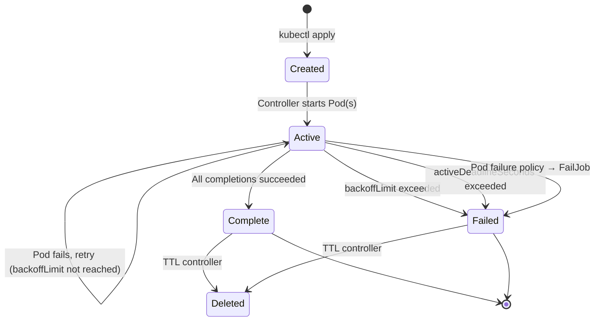
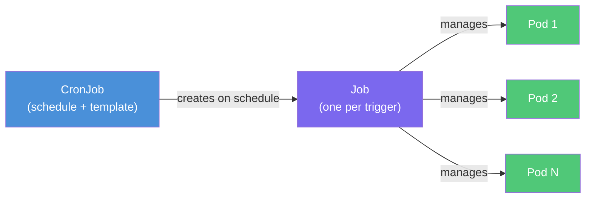

# Jobs and CronJobs — Batch and Scheduled Workloads

> **Doc 6** in the Kubernetes learning path.
> Audience: TypeScript/Node + Java/Spring Boot backend developers.

| Field | Detail |
|-------|--------|
| **K8s version baseline** | 1.31+ (Pod failure policy GA), 1.27+ (CronJob timezone GA) |
| **Prerequisites** | Pods, Deployments, basic `kubectl` fluency |
| **Cluster scope** | Namespaced (`batch/v1`) |

---

## Table of Contents

- [1. Jobs vs Deployments — Mental Model](#1-jobs-vs-deployments--mental-model)
- [2. Job Anatomy](#2-job-anatomy)
  - [2.1 Basic Job](#21-basic-job)
  - [2.2 completions and parallelism](#22-completions-and-parallelism)
  - [2.3 backoffLimit and Retry Behavior](#23-backofflimit-and-retry-behavior)
  - [2.4 activeDeadlineSeconds — Hard Timeout](#24-activedeadlineseconds--hard-timeout)
  - [2.5 Indexed Jobs](#25-indexed-jobs)
  - [2.6 Pod Failure Policy (GA in 1.31)](#26-pod-failure-policy-ga-in-131)
  - [2.7 TTL Controller — Auto-Cleanup](#27-ttl-controller--auto-cleanup)
  - [2.8 restartPolicy Constraint](#28-restartpolicy-constraint)
- [3. CronJobs](#3-cronjobs)
  - [3.1 Schedule Syntax](#31-schedule-syntax)
  - [3.2 concurrencyPolicy](#32-concurrencypolicy)
  - [3.3 startingDeadlineSeconds](#33-startingdeadlineseconds)
  - [3.4 History Limits](#34-history-limits)
  - [3.5 Timezone Support (GA in 1.27)](#35-timezone-support-ga-in-127)
  - [3.6 Suspend](#36-suspend)
- [4. Lifecycle Diagrams](#4-lifecycle-diagrams)
- [5. Practical Patterns](#5-practical-patterns)
  - [5.1 Database Migrations as a Job](#51-database-migrations-as-a-job)
  - [5.2 Scheduled Reports / Data Exports](#52-scheduled-reports--data-exports)
  - [5.3 Queue-Draining Workers](#53-queue-draining-workers)
  - [5.4 Cleanup / Garbage Collection CronJobs](#54-cleanup--garbage-collection-cronjobs)
  - [5.5 Retry Strategies — backoffLimit vs Application-Level](#55-retry-strategies--backofflimit-vs-application-level)
- [6. kubectl Commands for Jobs and CronJobs](#6-kubectl-commands-for-jobs-and-cronjobs)
- [7. Summary](#7-summary)
- [Related Documents](#related-documents)
- [References](#references)

---

## 1. Jobs vs Deployments — Mental Model

| Concern | Deployment | Job |
|---------|-----------|-----|
| **Lifecycle** | Long-running (run forever) | Run-to-completion (exit when done) |
| **Desired state** | N replicas always running | N successful completions then stop |
| **Restart on success** | Yes (maintains replica count) | No (success = done) |
| **Typical use** | Web servers, APIs, gRPC services | Migrations, batch processing, ETL |
| **restartPolicy** | `Always` | `Never` or `OnFailure` |

Think of it this way: a **Deployment** is a daemon, a **Job** is a script. Your Express/Fastify server is a Deployment. Your Flyway migration or nightly CSV export is a Job.

---

## 2. Job Anatomy

### 2.1 Basic Job

```yaml
apiVersion: batch/v1
kind: Job
metadata:
  name: data-export
  namespace: production
spec:
  ttlSecondsAfterFinished: 3600   # auto-delete 1 hour after completion
  backoffLimit: 4
  activeDeadlineSeconds: 600      # hard timeout: 10 minutes
  template:
    spec:
      restartPolicy: Never
      containers:
        - name: exporter
          image: myregistry/data-exporter:1.4.0
          env:
            - name: DB_URL
              valueFrom:
                secretKeyRef:
                  name: db-credentials
                  key: url
          resources:
            requests:
              cpu: "250m"
              memory: "256Mi"
            limits:
              cpu: "1"
              memory: "512Mi"
```

Key observations:
- `restartPolicy: Never` — the Job controller handles retries, not the kubelet.
- Resources are set to avoid noisy-neighbor problems on shared nodes.
- Secrets are injected via `secretKeyRef`, never hardcoded.

### 2.2 completions and parallelism

```yaml
spec:
  completions: 10    # 10 Pods must succeed total
  parallelism: 3     # up to 3 Pods run concurrently
```

| Field | Default | Meaning |
|-------|---------|---------|
| `completions` | 1 | Total number of Pods that must finish successfully |
| `parallelism` | 1 | Maximum Pods running at any given time |

The Job controller launches up to `parallelism` Pods. As each completes, it spawns a new one until `completions` successful Pods have run.

**Work queue pattern** — when you omit `completions` (or set it to `null`) and set `parallelism > 1`, each Pod is expected to determine its own work items and exit when the queue is empty. The Job succeeds when *any one* Pod completes successfully.

### 2.3 backoffLimit and Retry Behavior

```yaml
spec:
  backoffLimit: 6    # default
```

When a Pod fails, the Job controller retries with **exponential backoff**:

```
10s → 20s → 40s → 80s → 160s → 320s (capped at 6 minutes)
```

After `backoffLimit` failures, the Job is marked `Failed`. Each failed Pod counts toward this limit regardless of which index or container failed.

**Practical guidance:**
- Idempotent work? Set `backoffLimit: 3-6` and let K8s retry.
- Non-idempotent or expensive work? Set `backoffLimit: 0` and handle retries in your application.

### 2.4 activeDeadlineSeconds — Hard Timeout

```yaml
spec:
  activeDeadlineSeconds: 300   # 5 minutes wall-clock
```

This is a **wall-clock deadline** for the entire Job (not per-Pod). Once exceeded, all running Pods are terminated and the Job is marked `Failed` with reason `DeadlineExceeded`. This fires even if retries are still available under `backoffLimit`.

Use this as a safety net for Jobs that should never run longer than a known bound — migration scripts, report generation, queue drains.

### 2.5 Indexed Jobs

```yaml
apiVersion: batch/v1
kind: Job
metadata:
  name: partitioned-processor
spec:
  completions: 5
  parallelism: 5
  completionMode: Indexed       # each Pod gets an index
  template:
    spec:
      restartPolicy: Never
      containers:
        - name: processor
          image: myregistry/chunk-processor:2.0.0
          command:
            - node
            - process-chunk.js
          env:
            - name: CHUNK_INDEX
              value: "$(JOB_COMPLETION_INDEX)"  # 0, 1, 2, 3, 4
```

Each Pod receives a unique index via the `JOB_COMPLETION_INDEX` environment variable (0-based). This is ideal for:

- **Partitioned data processing** — each Pod handles shard N of a dataset.
- **Parallel test execution** — each Pod runs a subset of test suites.
- **Batch API calls** — each Pod processes a range of IDs.

The Job only succeeds when every index (0 through `completions - 1`) has one successful Pod.

### 2.6 Pod Failure Policy (GA in 1.31)

Pod failure policy gives fine-grained control over *which* failures count against `backoffLimit` and which should immediately fail the Job.

```yaml
apiVersion: batch/v1
kind: Job
metadata:
  name: smart-retry-job
spec:
  backoffLimit: 6
  podFailurePolicy:
    rules:
      # OOM kills — fail the entire Job immediately (no point retrying)
      - action: FailJob
        onExitCodes:
          containerName: worker
          operator: In
          values: [137]

      # Transient infrastructure errors — ignore, don't count as failure
      - action: Ignore
        onPodConditions:
          - type: DisruptionTarget

      # Exit code 42 = known data error, count it but keep retrying
      - action: Count
        onExitCodes:
          operator: In
          values: [42]
  template:
    spec:
      restartPolicy: Never
      containers:
        - name: worker
          image: myregistry/worker:3.1.0
```

Available actions:

| Action | Effect |
|--------|--------|
| `FailJob` | Immediately fail the entire Job |
| `Ignore` | Do not count toward `backoffLimit` |
| `Count` | Count toward `backoffLimit` (default behavior) |
| `FailIndex` | Fail only this index (Indexed Jobs) |

This is critical for production Jobs. Without it, an OOM-killed Pod would burn through all retries pointlessly. With it, you encode domain knowledge about which failures are transient and which are terminal.

### 2.7 TTL Controller — Auto-Cleanup

```yaml
spec:
  ttlSecondsAfterFinished: 3600   # delete Job + Pods 1 hour after completion
```

Without this, completed/failed Jobs and their Pods linger forever, cluttering `kubectl get jobs` and consuming etcd storage. The TTL controller deletes the Job object (and its dependent Pods) after the specified duration.

| Value | Behavior |
|-------|----------|
| `0` | Delete immediately after completion |
| `3600` | Delete 1 hour after completion |
| omitted | Never auto-delete |

For CronJobs, prefer `successfulJobsHistoryLimit` and `failedJobsHistoryLimit` instead (see [3.4](#34-history-limits)).

### 2.8 restartPolicy Constraint

Job Pods **must** use `restartPolicy: Never` or `restartPolicy: OnFailure`. The value `Always` is forbidden because it conflicts with the Job's run-to-completion semantics.

| Policy | Who restarts? | When? |
|--------|--------------|-------|
| `Never` | Job controller creates a **new Pod** | After failure, up to `backoffLimit` |
| `OnFailure` | Kubelet restarts the **same Pod** in place | After container exit with non-zero code |

**Recommendation:** Use `Never` for most Jobs. It preserves failed Pod logs for debugging. Use `OnFailure` when you want to avoid creating many Pod objects (high-parallelism Jobs with frequent transient failures).

---

## 3. CronJobs

A CronJob creates Jobs on a recurring schedule. It is the Kubernetes-native equivalent of `cron` or `node-cron` / `@Scheduled` annotations.

### 3.1 Schedule Syntax

Standard five-field cron format:

```
┌───────────── minute (0-59)
│ ┌───────────── hour (0-23)
│ │ ┌───────────── day of month (1-31)
│ │ │ ┌───────────── month (1-12)
│ │ │ │ ┌───────────── day of week (0-6, Sun=0)
│ │ │ │ │
* * * * *
```

Common examples:

| Schedule | Meaning |
|----------|---------|
| `*/5 * * * *` | Every 5 minutes |
| `0 * * * *` | Every hour on the hour |
| `0 2 * * *` | Daily at 2:00 AM |
| `0 0 * * 1` | Every Monday at midnight |
| `0 6 1 * *` | First day of every month at 6:00 AM |
| `0 0 1 1 *` | January 1st at midnight (annual) |

### 3.2 concurrencyPolicy

```yaml
apiVersion: batch/v1
kind: CronJob
metadata:
  name: report-generator
spec:
  schedule: "0 */6 * * *"       # every 6 hours
  concurrencyPolicy: Forbid      # skip if previous still running
  successfulJobsHistoryLimit: 3
  failedJobsHistoryLimit: 3
  startingDeadlineSeconds: 300
  jobTemplate:
    spec:
      activeDeadlineSeconds: 18000  # 5 hours max
      template:
        spec:
          restartPolicy: OnFailure
          containers:
            - name: reporter
              image: myregistry/report-gen:1.2.0
              resources:
                requests:
                  cpu: "500m"
                  memory: "1Gi"
```

| Policy | Behavior | Use when |
|--------|----------|----------|
| `Allow` (default) | Multiple Jobs can run concurrently | Independent stateless work |
| `Forbid` | Skip the new run if previous is still active | Avoid duplicate processing |
| `Replace` | Kill the running Job, start a new one | Latest data always takes priority |

**For backend developers:** Think of `Forbid` like a distributed mutex. If your Spring `@Scheduled` task checks `if (alreadyRunning) return`, that is `Forbid`. If it kills the old run, that is `Replace`.

### 3.3 startingDeadlineSeconds

```yaml
spec:
  startingDeadlineSeconds: 200
```

If the CronJob controller misses a scheduled time (cluster downtime, controller restart, high API server load), it can still create the Job if fewer than `startingDeadlineSeconds` have elapsed since the missed time.

**Without this field:** If 100+ schedules are missed, the CronJob is considered broken and will not create new Jobs at all. Setting `startingDeadlineSeconds` tells K8s "only look back this far when counting missed schedules."

**Practical rule:** Always set this for production CronJobs. A value of 200-600 seconds is typical.

### 3.4 History Limits

```yaml
spec:
  successfulJobsHistoryLimit: 3   # keep last 3 successful Jobs (default)
  failedJobsHistoryLimit: 1       # keep last 1 failed Job (default)
```

These control how many completed Job objects are retained. Unlike `ttlSecondsAfterFinished`, this is count-based rather than time-based. Older Jobs beyond the limit are garbage collected.

Set `failedJobsHistoryLimit` to at least 1 so you can inspect the most recent failure.

### 3.5 Timezone Support (GA in 1.27)

```yaml
spec:
  schedule: "0 9 * * 1-5"
  timeZone: "America/New_York"    # IANA timezone name
```

Without `timeZone`, the schedule is interpreted relative to the kube-controller-manager's timezone (typically UTC). With it, you get predictable scheduling regardless of cluster configuration.

Important caveats:
- Uses the Go standard library's timezone database.
- Do **not** use `CRON_TZ` or `TZ` in the schedule string — Kubernetes rejects this with a validation error.
- Valid timezone names follow IANA format: `America/New_York`, `Europe/Tokyo`, `Asia/Shanghai`.

### 3.6 Suspend

```yaml
spec:
  suspend: true    # pause scheduling without deleting the CronJob
```

When `suspend` is `true`, no new Jobs are created on schedule. Already-running Jobs continue to completion. This is useful for:
- Pausing during maintenance windows
- Temporarily disabling a misbehaving CronJob
- Feature-flagging scheduled work

Toggle with:
```bash
kubectl patch cronjob report-generator -p '{"spec":{"suspend":true}}'
kubectl patch cronjob report-generator -p '{"spec":{"suspend":false}}'
```

---

## 4. Lifecycle Diagrams

### Job Lifecycle



### CronJob to Pod Chain



---

## 5. Practical Patterns

### 5.1 Database Migrations as a Job

```yaml
apiVersion: batch/v1
kind: Job
metadata:
  name: flyway-migrate-v42
  labels:
    app: myservice
    migration: v42
spec:
  backoffLimit: 2
  activeDeadlineSeconds: 120
  ttlSecondsAfterFinished: 86400   # keep for 24h for debugging
  template:
    spec:
      restartPolicy: Never
      containers:
        - name: flyway
          image: flyway/flyway:10.0
          args: ["migrate"]
          env:
            - name: FLYWAY_URL
              valueFrom:
                secretKeyRef:
                  name: db-credentials
                  key: jdbc-url
            - name: FLYWAY_USER
              valueFrom:
                secretKeyRef:
                  name: db-credentials
                  key: username
            - name: FLYWAY_PASSWORD
              valueFrom:
                secretKeyRef:
                  name: db-credentials
                  key: password
```

**Alternative: init container pattern.** Some teams run migrations as an init container on the Deployment itself. The tradeoff:

| Approach | Pros | Cons |
|----------|------|------|
| Standalone Job | Runs once, clear success/fail, easy rollback | Requires coordination with Deployment rollout |
| Init container | Automatic, runs before app starts | Every Pod replica runs migration checks; slower startup |

For Node.js projects using Prisma or TypeORM migrations, replace Flyway with your migration runner:

```yaml
containers:
  - name: prisma-migrate
    image: myregistry/myapp:v42
    command: ["npx", "prisma", "migrate", "deploy"]
```

### 5.2 Scheduled Reports / Data Exports

```yaml
apiVersion: batch/v1
kind: CronJob
metadata:
  name: daily-sales-report
spec:
  schedule: "30 1 * * *"          # 1:30 AM daily
  timeZone: "Asia/Tokyo"
  concurrencyPolicy: Forbid
  startingDeadlineSeconds: 600
  successfulJobsHistoryLimit: 7    # keep a week of history
  failedJobsHistoryLimit: 3
  jobTemplate:
    spec:
      backoffLimit: 2
      activeDeadlineSeconds: 3600
      template:
        spec:
          restartPolicy: Never
          containers:
            - name: reporter
              image: myregistry/sales-report:1.0.0
              env:
                - name: S3_BUCKET
                  value: "reports-prod"
                - name: REPORT_DATE
                  value: "yesterday"
              resources:
                requests:
                  cpu: "500m"
                  memory: "512Mi"
```

In Node.js, your container entrypoint might look like:

```typescript
// report-entrypoint.ts
async function main(): Promise<void> {
  const data = await fetchSalesData(getReportDateRange());
  const csv = formatAsCsv(data);
  await uploadToS3(csv, process.env.S3_BUCKET!);
  console.log("Report uploaded successfully");
  process.exit(0);   // explicit success exit
}

main().catch((err) => {
  console.error("Report generation failed:", err);
  process.exit(1);   // non-zero triggers Job retry
});
```

### 5.3 Queue-Draining Workers

For processing a message queue (RabbitMQ, SQS, Redis streams), use a Job with parallelism but no fixed completions:

```yaml
apiVersion: batch/v1
kind: Job
metadata:
  name: drain-order-queue
spec:
  parallelism: 5          # 5 workers concurrently
  # completions omitted   → work-queue mode
  backoffLimit: 3
  activeDeadlineSeconds: 1800   # 30 minutes max
  template:
    spec:
      restartPolicy: Never
      containers:
        - name: worker
          image: myregistry/order-processor:2.1.0
          env:
            - name: QUEUE_URL
              valueFrom:
                configMapKeyRef:
                  name: queue-config
                  key: url
```

Each worker pulls from the queue and exits with code 0 when the queue is empty. The Job succeeds when *any one* Pod completes successfully. All other Pods are then terminated.

### 5.4 Cleanup / Garbage Collection CronJobs

```yaml
apiVersion: batch/v1
kind: CronJob
metadata:
  name: cleanup-temp-files
spec:
  schedule: "0 3 * * 0"           # every Sunday at 3 AM
  timeZone: "UTC"
  concurrencyPolicy: Forbid
  startingDeadlineSeconds: 300
  jobTemplate:
    spec:
      backoffLimit: 1
      ttlSecondsAfterFinished: 7200
      template:
        spec:
          restartPolicy: Never
          containers:
            - name: cleaner
              image: myregistry/cleanup:1.0.0
              command:
                - node
                - cleanup.js
                - --older-than=7d
                - --dry-run=false
```

Common cleanup targets:
- Orphaned S3/GCS objects
- Expired database sessions or soft-deleted records
- Old log entries beyond retention
- Stale cache keys

### 5.5 Retry Strategies — backoffLimit vs Application-Level

| Strategy | Use when | Example |
|----------|----------|---------|
| **K8s backoffLimit** | Failure is a full Pod crash; infrastructure-level issues; OOM | Network partition, node eviction |
| **Application retry** | Failure is a specific API call or DB query within a larger process | HTTP 503 from downstream service |
| **Combined** | Job does many operations; some are retryable, some are fatal | backoffLimit=2 + retry lib inside app |

For application-level retries in Node.js, use a proven library:

```typescript
import { retry } from "async-retry";

const result = await retry(
  async (bail) => {
    const response = await fetch(apiUrl);
    if (response.status === 400) {
      bail(new Error("Bad request — not retryable"));
      return;
    }
    if (!response.ok) {
      throw new Error(`HTTP ${response.status}`);  // triggers retry
    }
    return response.json();
  },
  { retries: 3, factor: 2, minTimeout: 1000 }
);
```

For Spring Boot, `spring-retry` or Resilience4j fills the same role.

**Rule of thumb:** If your process is a single atomic operation, let K8s retry (`backoffLimit`). If it is a pipeline of steps where only some may fail transiently, add application-level retry for those steps and set a low `backoffLimit` (0-2) as a safety net.

---

## 6. kubectl Commands for Jobs and CronJobs

### Monitoring Jobs

```bash
# List all Jobs in current namespace
kubectl get jobs

# Watch Job progress in real time
kubectl get jobs data-export --watch

# Describe Job for events and conditions
kubectl describe job data-export

# View logs from the Job's Pod
kubectl logs job/data-export

# View logs from a specific Pod (when parallelism > 1)
kubectl get pods --selector=job-name=data-export
kubectl logs data-export-abc12

# Check which Pods a Job created
kubectl get pods --selector=job-name=data-export -o wide

# Delete a Job and its Pods
kubectl delete job data-export
```

### Monitoring CronJobs

```bash
# List CronJobs with last schedule and active count
kubectl get cronjobs

# Check next scheduled run time
kubectl get cronjob daily-sales-report -o jsonpath='{.status.lastScheduleTime}'

# View Jobs created by a CronJob
kubectl get jobs --selector=job-name -l app=daily-sales-report

# Manually trigger a CronJob (create a one-off Job from its template)
kubectl create job --from=cronjob/daily-sales-report manual-test-run

# Suspend a CronJob
kubectl patch cronjob daily-sales-report -p '{"spec":{"suspend":true}}'

# Resume a CronJob
kubectl patch cronjob daily-sales-report -p '{"spec":{"suspend":false}}'
```

---

## 7. Summary

| Concept | Key Takeaway |
|---------|-------------|
| **Job** | Run-to-completion workload; exits when `completions` Pods succeed |
| **completions / parallelism** | Control total work units and concurrency; omit `completions` for work-queue mode |
| **backoffLimit** | Max Pod failures before Job fails; exponential backoff 10s-6min |
| **activeDeadlineSeconds** | Wall-clock hard stop for the entire Job |
| **Indexed Jobs** | `JOB_COMPLETION_INDEX` env var for partitioned parallel work |
| **Pod failure policy** | Match exit codes/conditions to decide FailJob, Ignore, or Count (GA 1.31) |
| **ttlSecondsAfterFinished** | Auto-delete completed Jobs to prevent clutter |
| **CronJob** | Creates Jobs on a cron schedule |
| **concurrencyPolicy** | Allow, Forbid, or Replace overlapping runs |
| **startingDeadlineSeconds** | Grace period for missed schedules — always set in production |
| **timeZone** | IANA timezone for predictable scheduling (GA 1.27) |
| **suspend** | Pause scheduling without deletion |

---

## Related Documents

- [pods-and-deployments.md](./pods-and-deployments.md) — Pod lifecycle, Deployment strategies, and rolling updates
- [statefulsets-and-daemonsets.md](./statefulsets-and-daemonsets.md) — Stateful workloads and per-node scheduling

---

## References

1. [Jobs — Kubernetes Documentation](https://kubernetes.io/docs/concepts/workloads/controllers/job/)
2. [CronJob — Kubernetes Documentation](https://kubernetes.io/docs/concepts/workloads/controllers/cron-jobs/)
3. [Handling retriable and non-retriable pod failures with Pod failure policy](https://kubernetes.io/docs/tasks/job/pod-failure-policy/)
4. [Kubernetes 1.31: Pod Failure Policy for Jobs Goes GA](https://kubernetes.io/blog/2024/08/19/kubernetes-1-31-pod-failure-policy-for-jobs-goes-ga/)
5. [Indexed Job for Parallel Processing with Static Work Assignment](https://kubernetes.io/docs/tasks/job/indexed-parallel-processing-static/)
6. [Automatic Cleanup for Finished Jobs](https://kubernetes.io/docs/concepts/workloads/controllers/ttlafterfinished/)
7. [CronJob TimeZone KEP-3140](https://github.com/kubernetes/enhancements/blob/master/keps/sig-apps/3140-TimeZone-support-in-CronJob/README.md)
8. [Running Automated Tasks with a CronJob](https://kubernetes.io/docs/tasks/job/automated-tasks-with-cron-jobs/)
