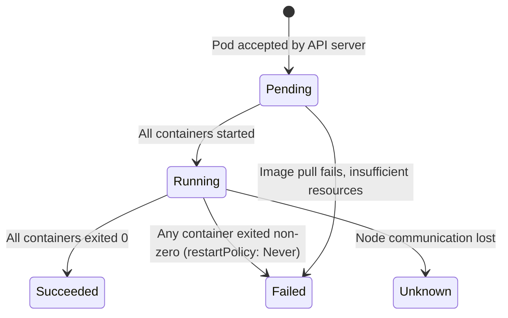
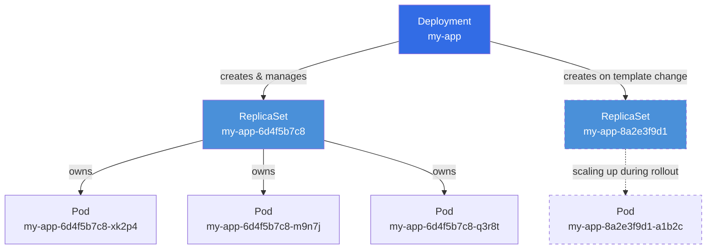
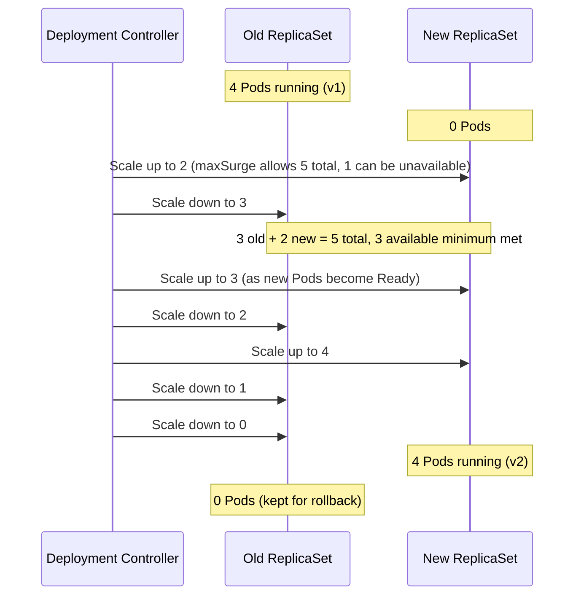

# Pods, ReplicaSets, and Deployments — Running Stateless Applications

**Date:** 2026-04-24 | **Updated:** 2026-04-24
**Tags:** `kubernetes` `pods` `deployments` `replicasets` `workloads`

## Table of Contents

- [Summary](#summary)
- [Pods — The Atomic Scheduling Unit](#pods--the-atomic-scheduling-unit)
  - [Shared Network Namespace](#shared-network-namespace)
  - [Shared Volumes](#shared-volumes)
- [Multi-Container Patterns](#multi-container-patterns)
  - [Sidecar Containers](#sidecar-containers)
  - [Native Sidecar Containers (K8s 1.28+)](#native-sidecar-containers-k8s-128)
  - [Init Containers](#init-containers)
  - [Ephemeral Containers](#ephemeral-containers)
- [Pod Lifecycle](#pod-lifecycle)
  - [Phases](#phases)
  - [Conditions](#conditions)
- [ReplicaSets — Maintaining N Identical Pods](#replicasets--maintaining-n-identical-pods)
- [Deployments — The Deployment → ReplicaSet → Pod Chain](#deployments--the-deployment--replicaset--pod-chain)
  - [Deployment Spec Deep Dive](#deployment-spec-deep-dive)
  - [Pod Template Hash Label](#pod-template-hash-label)
- [Deployment Strategies](#deployment-strategies)
  - [RollingUpdate](#rollingupdate)
  - [Recreate](#recreate)
- [Rollout Mechanics](#rollout-mechanics)
  - [Monitoring a Rollout](#monitoring-a-rollout)
  - [Rollout History and Undo](#rollout-history-and-undo)
- [Horizontal Scaling](#horizontal-scaling)
- [Health Probes](#health-probes)
  - [Startup Probe](#startup-probe)
  - [Liveness Probe](#liveness-probe)
  - [Readiness Probe](#readiness-probe)
  - [Probe Configuration Example](#probe-configuration-example)
  - [Common Pitfalls](#common-pitfalls)
- [Graceful Shutdown](#graceful-shutdown)
  - [The Shutdown Sequence](#the-shutdown-sequence)
  - [Endpoint Removal Timing](#endpoint-removal-timing)
- [Related](#related)
- [References](#references)

## Summary

Pods are the smallest deployable unit in Kubernetes — a group of one or more containers that share a network namespace and storage volumes. Deployments build on top of ReplicaSets to provide declarative updates, rollbacks, and scaling for stateless applications. Understanding the full chain from Deployment to ReplicaSet to Pod is essential for operating production workloads.

## Pods — The Atomic Scheduling Unit

A Pod is **not** a container — it is a wrapper around one or more containers that are always co-located and co-scheduled on the same node. Every container in a Pod shares:

- A single **network namespace** (same IP, same localhost)
- A set of **volumes** (mounted independently per container)
- IPC namespace, UTS namespace, and optionally PID namespace

The scheduler treats the Pod as one unit. It finds a node that satisfies the combined resource requests of all containers in the Pod.

### Shared Network Namespace

All containers in a Pod share a single IP address. They communicate over `localhost`:

```
┌─────────────────────────── Pod (IP: 10.244.1.5) ─────────────────────────┐
│                                                                           │
│  ┌──────────────┐    localhost:8080    ┌──────────────┐                   │
│  │  app (:8080)  │◄──────────────────►│ sidecar (:9090)│                  │
│  └──────────────┘                     └──────────────┘                   │
│                                                                           │
│  Both containers share the same network namespace.                        │
│  External traffic reaches the Pod at 10.244.1.5.                          │
└───────────────────────────────────────────────────────────────────────────┘
```

Key implications:
- Two containers in the same Pod **cannot** bind the same port
- Container-to-container communication uses `localhost` — zero network overhead
- One IP per Pod, not one IP per container

### Shared Volumes

Volumes are declared at the Pod level and mounted into individual containers:

```yaml
apiVersion: v1
kind: Pod
metadata:
  name: shared-volume-demo
spec:
  volumes:
    - name: shared-data
      emptyDir: {}
  containers:
    - name: writer
      image: busybox
      command: ["sh", "-c", "echo hello > /data/message && sleep 3600"]
      volumeMounts:
        - name: shared-data
          mountPath: /data
    - name: reader
      image: busybox
      command: ["sh", "-c", "cat /data/message && sleep 3600"]
      volumeMounts:
        - name: shared-data
          mountPath: /data
```

The `emptyDir` volume lives for the lifetime of the Pod. Both containers see the same files at `/data`.

## Multi-Container Patterns

### Sidecar Containers

A sidecar runs alongside the main application container for the entire lifetime of the Pod, providing supplementary functionality:

| Use Case | Sidecar | Main Container |
|----------|---------|---------------|
| Log shipping | Fluent Bit reads log files from shared volume | App writes to `/var/log/app` |
| Service mesh proxy | Envoy handles mTLS, retries, observability | App calls `localhost:port` |
| Config sync | git-sync pulls config into shared volume | App reads from `/config` |

```yaml
apiVersion: v1
kind: Pod
metadata:
  name: app-with-log-sidecar
spec:
  volumes:
    - name: log-volume
      emptyDir: {}
  containers:
    - name: app
      image: myapp:1.2.0
      ports:
        - containerPort: 8080
      volumeMounts:
        - name: log-volume
          mountPath: /var/log/app
    - name: log-shipper
      image: fluent/fluent-bit:3.0
      volumeMounts:
        - name: log-volume
          mountPath: /var/log/app
          readOnly: true
```

**Traditional sidecar limitation:** Both containers are regular containers — Kubernetes does not guarantee shutdown order. The sidecar might exit before the main container finishes, or linger after a Job completes, blocking Job completion.

### Native Sidecar Containers (K8s 1.28+)

Kubernetes 1.28 introduced **native sidecar containers** via the `SidecarContainers` feature gate (beta in 1.29, stable in 1.31). Rather than adding a new `sidecarContainers` field, the feature reuses `initContainers` with a special `restartPolicy: Always`:

```yaml
apiVersion: v1
kind: Pod
metadata:
  name: native-sidecar-demo
spec:
  initContainers:
    - name: log-agent
      image: fluent/fluent-bit:3.0
      restartPolicy: Always          # This makes it a native sidecar
      volumeMounts:
        - name: log-volume
          mountPath: /var/log/app
          readOnly: true
  containers:
    - name: app
      image: myapp:1.2.0
      ports:
        - containerPort: 8080
      volumeMounts:
        - name: log-volume
          mountPath: /var/log/app
  volumes:
    - name: log-volume
      emptyDir: {}
```

**Key behaviors of native sidecars:**

1. **Starts in init sequence** — the sidecar starts during the init container phase, before regular containers
2. **Does not block init progression** — the next init container starts immediately after the sidecar is running (or after its `startupProbe` succeeds), without waiting for it to complete
3. **Runs for Pod lifetime** — the sidecar continues running alongside regular containers
4. **Ordered shutdown** — when the Pod terminates, native sidecars are shut down **after** all regular containers have exited
5. **Restarts on failure** — if the sidecar crashes, kubelet restarts it automatically (respecting `restartPolicy: Always`)

**When to use native vs traditional sidecars:**

| Concern | Native Sidecar (1.28+) | Traditional Sidecar |
|---------|----------------------|-------------------|
| Job/batch workloads | Sidecar stops after Job completes | Sidecar blocks Job completion |
| Startup ordering | Sidecar starts before app | No guaranteed order |
| Shutdown ordering | Sidecar stops after app | No guaranteed order |
| Cluster version | Requires 1.28+ | Any version |

### Init Containers

Init containers run **to completion** in sequence before any regular containers start. Each init container must exit successfully (exit code 0) before the next one begins:

```yaml
apiVersion: v1
kind: Pod
metadata:
  name: app-with-init
spec:
  initContainers:
    - name: wait-for-db
      image: busybox
      command:
        - sh
        - -c
        - |
          until nc -z postgres-service 5432; do
            echo "Waiting for PostgreSQL..."
            sleep 2
          done
    - name: run-migrations
      image: myapp:1.2.0
      command: ["./migrate", "--up"]
      env:
        - name: DATABASE_URL
          valueFrom:
            secretKeyRef:
              name: db-credentials
              key: url
  containers:
    - name: app
      image: myapp:1.2.0
      ports:
        - containerPort: 8080
```

Common init container patterns:
- **Wait for dependency** — poll until a database or service is reachable
- **Run migrations** — apply schema changes before the app starts
- **Fetch configuration** — pull config from a remote source into a shared volume
- **Generate certificates** — create TLS certs before the main container needs them

### Ephemeral Containers

Ephemeral containers are injected into a **running** Pod for debugging. They cannot be added via the Pod spec — only through the API:

```bash
# Attach a debug container to a running Pod
kubectl debug -it my-pod --image=busybox --target=app

# Debug a Pod running a distroless image (no shell)
kubectl debug -it my-pod --image=ubuntu --share-processes --target=app
```

Ephemeral containers:
- Have no ports, readiness probes, or resource limits
- Cannot be restarted once they exit
- Share the process namespace with the target container (when `--share-processes` is used)
- Are visible in `kubectl describe pod` under "Ephemeral Containers"

## Pod Lifecycle

### Phases

A Pod moves through these phases:



| Phase | Meaning |
|-------|---------|
| **Pending** | Pod accepted, but one or more containers not yet running. Could be waiting for scheduling, image pull, or init containers. |
| **Running** | At least one container is running, starting, or restarting. |
| **Succeeded** | All containers exited with code 0 and will not be restarted. |
| **Failed** | All containers terminated, and at least one exited with a non-zero code. |
| **Unknown** | Pod status cannot be determined — typically a node communication failure. |

### Conditions

Conditions provide finer-grained status within a phase:

| Condition | True when |
|-----------|-----------|
| **PodScheduled** | Pod has been assigned to a node |
| **Initialized** | All init containers have completed successfully |
| **ContainersReady** | All containers in the Pod have passed their readiness probes |
| **Ready** | Pod is ready to serve traffic (included in Service endpoints) |

```bash
# Check conditions
kubectl get pod my-pod -o jsonpath='{.status.conditions[*].type}'

# Detailed condition status
kubectl describe pod my-pod | grep -A 2 Conditions
```

The **Ready** condition is what Services use to decide whether to route traffic to a Pod. A Pod can be `Running` but not `Ready` (e.g., readiness probe failing).

## ReplicaSets — Maintaining N Identical Pods

A ReplicaSet ensures that a specified number of identical Pods are running at any time. If a Pod dies, the ReplicaSet controller creates a replacement. If there are too many, it terminates the excess.

**You should never create a ReplicaSet directly.** Deployments manage ReplicaSets for you, and they add rollout/rollback capabilities that a bare ReplicaSet does not have.

What a ReplicaSet does:
- Watches for Pods matching its `selector`
- Compares actual count to desired `replicas`
- Creates or deletes Pods to reconcile the difference
- Uses the `template` field to create new Pods

```bash
# View ReplicaSets managed by a Deployment
kubectl get rs -l app=my-app

# See which ReplicaSet owns a Pod
kubectl get pod my-pod -o jsonpath='{.metadata.ownerReferences[0].name}'
```

## Deployments — The Deployment → ReplicaSet → Pod Chain

A Deployment is the standard way to run stateless workloads. It creates and manages ReplicaSets, which in turn manage Pods:



When you change the Pod template (image, env var, volume mount), the Deployment:
1. Creates a **new ReplicaSet** with the updated template
2. Gradually scales **up** the new ReplicaSet
3. Gradually scales **down** the old ReplicaSet
4. Keeps the old ReplicaSet around (at 0 replicas) for rollback

### Deployment Spec Deep Dive

```yaml
apiVersion: apps/v1
kind: Deployment
metadata:
  name: my-app
  labels:
    app: my-app
spec:
  replicas: 3                              # Desired Pod count
  revisionHistoryLimit: 10                 # How many old ReplicaSets to keep (default: 10)
  selector:
    matchLabels:
      app: my-app                          # Must match template labels
  strategy:
    type: RollingUpdate
    rollingUpdate:
      maxSurge: 25%                        # Max Pods above desired during update
      maxUnavailable: 25%                  # Max Pods that can be unavailable during update
  template:                                # Pod template — this IS the ReplicaSet's template
    metadata:
      labels:
        app: my-app                        # Must match selector.matchLabels
    spec:
      containers:
        - name: app
          image: myapp:1.2.0
          ports:
            - containerPort: 8080
          resources:
            requests:
              cpu: 250m
              memory: 256Mi
            limits:
              cpu: 500m
              memory: 512Mi
```

Key fields:
- **`replicas`** — desired number of Pods. Defaults to 1 if omitted.
- **`selector`** — immutable after creation. Must match `template.metadata.labels`.
- **`template`** — the Pod spec. Any change here triggers a new rollout.
- **`strategy`** — how to replace old Pods with new ones.
- **`revisionHistoryLimit`** — number of old ReplicaSets kept for rollback. Set to 0 to disable rollback.

### Pod Template Hash Label

Kubernetes adds a `pod-template-hash` label to every Pod and ReplicaSet created by a Deployment. This hash is derived from the Pod template spec:

```bash
kubectl get rs -l app=my-app --show-labels
# NAME               DESIRED   CURRENT   READY   LABELS
# my-app-6d4f5b7c8   3         3         3       app=my-app,pod-template-hash=6d4f5b7c8
# my-app-8a2e3f9d1   0         0         0       app=my-app,pod-template-hash=8a2e3f9d1
```

This hash:
- Ensures that ReplicaSets created from different templates never adopt each other's Pods
- Makes it easy to see which ReplicaSet revision owns which Pods
- Is computed by the Deployment controller — you never set it manually

## Deployment Strategies

### RollingUpdate

The default strategy. It replaces Pods incrementally so the application is never fully down:

```yaml
spec:
  strategy:
    type: RollingUpdate
    rollingUpdate:
      maxSurge: 25%          # Can temporarily exceed desired replicas by 25%
      maxUnavailable: 25%    # At most 25% of desired replicas can be unavailable
```

**Concrete example with 4 replicas:**

With `maxSurge: 25%` and `maxUnavailable: 25%`:
- `maxSurge` = ceil(4 * 0.25) = **1** → up to 5 Pods total
- `maxUnavailable` = floor(4 * 0.25) = **1** → at least 3 Pods must be available



**Tuning maxSurge and maxUnavailable:**

| Scenario | maxSurge | maxUnavailable | Behavior |
|----------|----------|----------------|----------|
| Fast rollout, more resources | 50% | 0 | No downtime, uses extra capacity |
| Resource-constrained | 0 | 25% | No extra Pods, but some unavailability |
| Maximum speed | 100% | 50% | Aggressive — blue-green-like |
| Conservative | 1 | 0 | One-at-a-time, zero unavailability |

Both values can be absolute numbers or percentages. They **cannot both be zero** — that would prevent any update from happening.

### Recreate

Kills all existing Pods before creating new ones. There is a full downtime window:

```yaml
spec:
  strategy:
    type: Recreate
```

**When to use Recreate:**
- Database schema changes where old and new code are incompatible with the schema
- A shared volume that only one Pod revision can use at a time (e.g., file-based SQLite)
- License restrictions that prevent running two versions simultaneously
- Development environments where speed matters more than availability

## Rollout Mechanics

### Monitoring a Rollout

```bash
# Watch rollout progress in real time
kubectl rollout status deployment/my-app
# Waiting for deployment "my-app" rollout to finish: 2 out of 4 new replicas have been updated...
# deployment "my-app" successfully rolled out

# See the current state of all ReplicaSets
kubectl get rs -l app=my-app
# NAME               DESIRED   CURRENT   READY
# my-app-6d4f5b7c8   4         4         4
# my-app-8a2e3f9d1   0         0         0
```

A rollout is triggered when the Pod template changes. Changes to `replicas`, `labels`, or `annotations` on the Deployment itself do **not** trigger a rollout.

### Rollout History and Undo

```bash
# View rollout history
kubectl rollout history deployment/my-app
# REVISION  CHANGE-CAUSE
# 1         <none>
# 2         <none>
# 3         <none>

# See details of a specific revision
kubectl rollout history deployment/my-app --revision=2

# Roll back to the previous revision
kubectl rollout undo deployment/my-app

# Roll back to a specific revision
kubectl rollout undo deployment/my-app --to-revision=1

# Pause a rollout (useful for canary-like manual inspection)
kubectl rollout pause deployment/my-app

# Resume a paused rollout
kubectl rollout resume deployment/my-app
```

To get meaningful `CHANGE-CAUSE` entries, annotate the Deployment when you update it:

```bash
kubectl annotate deployment/my-app kubernetes.io/change-cause="Upgrade to v1.3.0 for connection pool fix"
```

**Revision history limit:** The `revisionHistoryLimit` field (default: 10) controls how many old ReplicaSets are kept. Each old ReplicaSet consumes etcd storage and shows up in `kubectl get rs`. In large clusters, consider lowering this to 3-5.

## Horizontal Scaling

```bash
# Imperative scaling
kubectl scale deployment/my-app --replicas=5

# Check current scale
kubectl get deployment my-app
# NAME     READY   UP-TO-DATE   AVAILABLE   AGE
# my-app   5/5     5            5           2d
```

For automatic scaling based on metrics, use a **HorizontalPodAutoscaler** (HPA):

```yaml
apiVersion: autoscaling/v2
kind: HorizontalPodAutoscaler
metadata:
  name: my-app-hpa
spec:
  scaleTargetRef:
    apiVersion: apps/v1
    kind: Deployment
    name: my-app
  minReplicas: 2
  maxReplicas: 10
  metrics:
    - type: Resource
      resource:
        name: cpu
        target:
          type: Utilization
          averageUtilization: 70
```

When an HPA manages a Deployment, avoid also setting `replicas` manually — the HPA and manual scaling will fight. See [Autoscaling in Kubernetes](../operations/autoscaling.md) for the full HPA, VPA, and KEDA story.

## Health Probes

Kubernetes uses three probes to manage container lifecycle. Each can use `httpGet`, `tcpSocket`, or `exec` checks.

### Startup Probe

**Purpose:** Detect when a slow-starting container has finished initialization.

- Checked first, before liveness and readiness probes activate
- While the startup probe is running, liveness and readiness probes are disabled
- Once the startup probe succeeds, it never runs again
- If it never succeeds within `failureThreshold * periodSeconds`, the container is killed

**Use for:** Java/Spring Boot apps with long startup times, apps loading large caches or ML models.

### Liveness Probe

**Purpose:** Detect when a container is stuck and needs to be restarted.

- Runs for the entire lifetime of the container (after startup probe succeeds)
- On failure, kubelet **kills and restarts** the container
- Does **not** remove the Pod from Service endpoints (that is the readiness probe's job)

**Use for:** Deadlock detection, hung process detection. Should check internal health, not downstream dependencies.

### Readiness Probe

**Purpose:** Control whether a container receives traffic.

- Runs for the entire lifetime of the container
- On failure, the Pod is removed from Service endpoints (no traffic routed to it)
- The container is **not** restarted — it just stops receiving traffic until the probe passes again
- A Pod can oscillate between Ready and Not Ready

**Use for:** Warmup period after start, temporary overload, dependency health gates.

### Probe Configuration Example

```yaml
apiVersion: apps/v1
kind: Deployment
metadata:
  name: spring-boot-app
spec:
  replicas: 3
  selector:
    matchLabels:
      app: spring-boot-app
  template:
    metadata:
      labels:
        app: spring-boot-app
    spec:
      containers:
        - name: app
          image: my-spring-app:2.0.0
          ports:
            - containerPort: 8080
          startupProbe:
            httpGet:
              path: /actuator/health/liveness
              port: 8080
            initialDelaySeconds: 5
            periodSeconds: 5
            failureThreshold: 30       # 30 * 5s = 150s max startup time
          livenessProbe:
            httpGet:
              path: /actuator/health/liveness
              port: 8080
            periodSeconds: 10
            failureThreshold: 3        # 3 failures = restart
            timeoutSeconds: 3
          readinessProbe:
            httpGet:
              path: /actuator/health/readiness
              port: 8080
            periodSeconds: 5
            failureThreshold: 3
            successThreshold: 1
            timeoutSeconds: 3
          resources:
            requests:
              cpu: 500m
              memory: 512Mi
            limits:
              cpu: "1"
              memory: 1Gi
```

For a **Node.js** application, probes typically use a lightweight HTTP health endpoint:

```yaml
startupProbe:
  httpGet:
    path: /health
    port: 3000
  periodSeconds: 3
  failureThreshold: 20          # 20 * 3s = 60s max startup

livenessProbe:
  httpGet:
    path: /health
    port: 3000
  periodSeconds: 15
  failureThreshold: 3

readinessProbe:
  httpGet:
    path: /ready
    port: 3000
  periodSeconds: 5
  failureThreshold: 3
```

### Common Pitfalls

| Pitfall | Problem | Fix |
|---------|---------|-----|
| No startup probe on slow apps | Liveness probe kills container before it finishes starting | Add startup probe with generous `failureThreshold` |
| Liveness checks dependencies | DB goes down → all Pods restart → cascading failure | Liveness should check **internal** health only |
| Same endpoint for liveness and readiness | Cannot differentiate "stuck" from "temporarily overloaded" | Use separate `/health/liveness` and `/health/readiness` endpoints |
| Too aggressive liveness | `failureThreshold: 1` with short period restarts on any GC pause | Use `failureThreshold: 3` and `timeoutSeconds: 3+` |
| No readiness probe | Traffic hits Pods during startup or during temporary overload | Always configure readiness probes for production |

## Graceful Shutdown

### The Shutdown Sequence

When a Pod is deleted (scale-down, rollout, node drain), Kubernetes follows this sequence:

```
1. Pod status set to Terminating
2. preStop hook runs (if defined)                    ← runs in parallel with step 3
3. Pod removed from Service endpoints               ← runs in parallel with step 2
4. SIGTERM sent to PID 1 in each container
5. Grace period countdown (default: 30 seconds)
6. SIGKILL sent if container has not exited
```

```yaml
spec:
  terminationGracePeriodSeconds: 60     # Increase from default 30s if needed
  containers:
    - name: app
      image: myapp:1.2.0
      lifecycle:
        preStop:
          exec:
            command: ["/bin/sh", "-c", "sleep 5"]  # Wait for endpoint removal to propagate
```

**Why the `sleep 5` preStop?** Steps 2 and 3 happen concurrently. If your app shuts down immediately on SIGTERM but the endpoint removal has not propagated to all kube-proxy instances and Ingress controllers, in-flight requests can hit a closed socket.

Your application must:
1. **Handle SIGTERM** — begin draining connections, stop accepting new work
2. **Finish in-flight requests** — complete active requests before exiting
3. **Exit before the grace period** — otherwise kubelet sends SIGKILL (ungraceful)

For **Spring Boot**, the built-in graceful shutdown handles this:

```yaml
# application.yml
server:
  shutdown: graceful
spring:
  lifecycle:
    timeout-per-shutdown-phase: 30s
```

For **Node.js**, handle the signal explicitly:

```typescript
const server = app.listen(3000);

process.on('SIGTERM', () => {
  console.log('SIGTERM received, draining connections...');
  server.close(() => {
    console.log('All connections closed, exiting.');
    process.exit(0);
  });
});
```

### Endpoint Removal Timing

The critical race condition to understand:

```
Time ──────────────────────────────────────────────►

  Pod termination begins
  │
  ├── preStop hook runs ──────────────┐
  │                                    │
  ├── Endpoint removal sent ──┐        │
  │                           │        │
  │   kube-proxy updates ─────┤        │
  │   Ingress updates ────────┘        │
  │                                    │
  ├── SIGTERM ─────────────────────────┘
  │
  ├── Grace period (terminationGracePeriodSeconds)
  │
  └── SIGKILL
```

The `preStop: sleep 5` gives time for the endpoint removal to propagate through kube-proxy, Ingress controllers, and DNS before the app starts shutting down. Without it, you risk 502/503 errors during rolling updates.

## Related

- [Kubernetes Cluster Architecture](../core-concepts/cluster-architecture.md) — control plane components that schedule and manage Pods
- [StatefulSets and DaemonSets](statefulsets-and-daemonsets.md) — stateful and per-node workload patterns
- [Jobs and CronJobs](jobs-and-cronjobs.md) — batch and scheduled workloads (where native sidecars matter most)
- [Kubernetes for Spring Boot Applications](../../java/configurations/kubernetes-spring-boot.md) — application-level K8s config for Spring Boot
- [Node.js in Kubernetes](../../typescript/production/nodejs-in-kubernetes.md) — container tuning, health endpoints, and graceful shutdown for Node.js
- [Autoscaling in Kubernetes](../operations/autoscaling.md) — HPA, VPA, Cluster Autoscaler, and KEDA

## References

- [Pods — Kubernetes Documentation](https://kubernetes.io/docs/concepts/workloads/pods/)
- [Deployments — Kubernetes Documentation](https://kubernetes.io/docs/concepts/workloads/controllers/deployment/)
- [ReplicaSet — Kubernetes Documentation](https://kubernetes.io/docs/concepts/workloads/controllers/replicaset/)
- [Init Containers — Kubernetes Documentation](https://kubernetes.io/docs/concepts/workloads/pods/init-containers/)
- [Sidecar Containers — Kubernetes Documentation](https://kubernetes.io/docs/concepts/workloads/pods/sidecar-containers/)
- [Configure Liveness, Readiness and Startup Probes — Kubernetes Documentation](https://kubernetes.io/docs/tasks/configure-pod-container/configure-liveness-readiness-startup-probes/)
- [Kubernetes v1.28: Introducing Native Sidecar Containers — Kubernetes Blog](https://kubernetes.io/blog/2023/08/25/native-sidecar-containers/)
- [Pod Lifecycle — Kubernetes Documentation](https://kubernetes.io/docs/concepts/workloads/pods/pod-lifecycle/)
