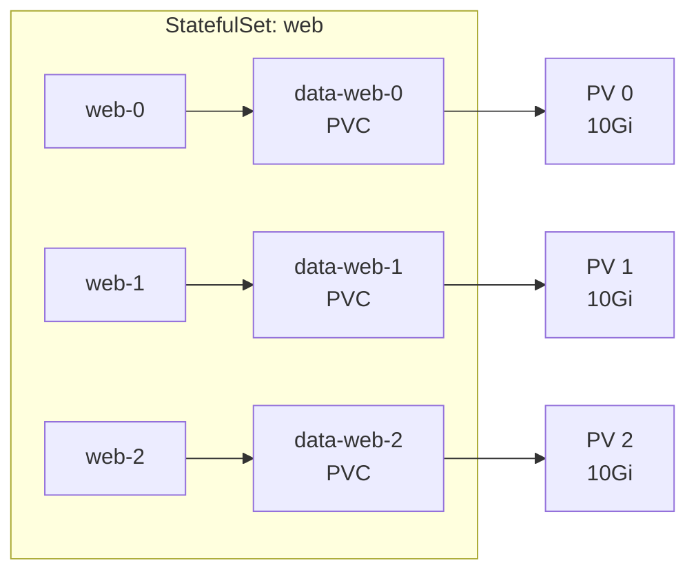

# StatefulSets and DaemonSets — Stateful and Per-Node Workloads

**Date:** 2026-04-24 | **Updated:** 2026-04-24
**Tags:** `kubernetes` `statefulsets` `daemonsets` `workloads` `stateful`

## Table of Contents

- [Summary](#summary)
- [StatefulSet](#statefulset)
  - [When Deployments Are Not Enough](#when-deployments-are-not-enough)
  - [Stable Network Identity](#stable-network-identity)
  - [Stable Persistent Storage](#stable-persistent-storage)
  - [Ordered Startup and Shutdown](#ordered-startup-and-shutdown)
  - [Rolling Updates and Partitions](#rolling-updates-and-partitions)
  - [Headless Services for Peer Discovery](#headless-services-for-peer-discovery)
  - [Complete StatefulSet Example](#complete-statefulset-example)
  - [Real Use Cases](#real-use-cases)
  - [Scaling Considerations](#scaling-considerations)
- [DaemonSet](#daemonset)
  - [One Pod Per Node](#one-pod-per-node)
  - [Use Cases](#use-cases)
  - [Scheduling Behavior](#scheduling-behavior)
  - [Tolerations for Control Plane Nodes](#tolerations-for-control-plane-nodes)
  - [Node Selection with Selectors and Affinity](#node-selection-with-selectors-and-affinity)
  - [Rolling Update Strategy](#rolling-update-strategy)
  - [Complete DaemonSet Example](#complete-daemonset-example)
- [kubectl Commands for Inspection](#kubectl-commands-for-inspection)
- [StatefulSet vs DaemonSet vs Deployment](#statefulset-vs-daemonset-vs-deployment)
- [Related](#related)
- [References](#references)

## Summary

Not every workload fits the Deployment model. When your application needs **stable identity and persistent storage per replica** (databases, message brokers, consensus systems), you need a **StatefulSet**. When you need **exactly one Pod on every node** (log collectors, monitoring agents, CNI plugins), you need a **DaemonSet**. Both controllers extend the Pod abstraction with guarantees that Deployments deliberately omit. This document covers when, why, and how to use each one.

---

## StatefulSet

### When Deployments Are Not Enough

A Deployment treats all Pods as interchangeable. It assigns random names (`web-7d9f8c-xk4qz`), attaches them to shared storage (if any), and starts/stops them in no particular order. That works for stateless HTTP servers but fails for workloads that need:

| Requirement | Deployment Behavior | Problem |
|---|---|---|
| Stable hostname per replica | Random suffix changes on reschedule | Peers cannot find each other |
| Dedicated storage per replica | All Pods share a PVC (or get nothing) | Data corruption from concurrent writes |
| Ordered startup | All Pods start simultaneously | Leader election races, bootstrap failures |
| Predictable DNS | No per-Pod DNS records | No way to address a specific replica |

StatefulSets solve all four.

### Stable Network Identity

Each StatefulSet Pod gets a deterministic name based on its **ordinal index**:

```
<statefulset-name>-<ordinal>
```

For a StatefulSet named `web` with 3 replicas:

| Ordinal | Pod Name | Hostname |
|---------|----------|----------|
| 0 | `web-0` | `web-0` |
| 1 | `web-1` | `web-1` |
| 2 | `web-2` | `web-2` |

Combined with a **headless Service** (a Service with `clusterIP: None`), each Pod gets a predictable DNS record:

```
<pod-name>.<service-name>.<namespace>.svc.cluster.local
```

For a headless Service named `nginx` in the `default` namespace:

```
web-0.nginx.default.svc.cluster.local
web-1.nginx.default.svc.cluster.local
web-2.nginx.default.svc.cluster.local
```

These DNS names are **stable across reschedules**. If `web-1` is deleted and recreated on a different node, it gets the same name, the same hostname, and the same DNS record. The IP address may change, but the DNS name does not.

### Stable Persistent Storage

StatefulSets use `volumeClaimTemplates` to create a **dedicated PVC for each Pod**:



Each PVC is named `<volumeClaimTemplate-name>-<statefulset-name>-<ordinal>`. If `web-1` is deleted and recreated, Kubernetes reattaches `data-web-1` to the new Pod. The data follows the identity, not the physical node.

### Ordered Startup and Shutdown

By default, StatefulSets enforce **ordered, graceful deployment**:

- **Startup:** Pods are created sequentially — `web-0` must be Running and Ready before `web-1` starts, `web-1` before `web-2`, and so on (0 through N-1).
- **Shutdown:** Pods are terminated in reverse order — `web-2` first, then `web-1`, then `web-0`.
- **Scaling up:** New Pods are created at the next ordinal in sequence.
- **Scaling down:** The highest-ordinal Pod is removed first.

This ordering is critical for systems like ZooKeeper or etcd where the first node bootstraps the cluster and later nodes join it.

**When ordering does not matter:** If your stateful app handles peer discovery independently (many databases do), you can skip the sequential startup penalty:

```yaml
spec:
  podManagementPolicy: Parallel  # default is "OrderedReady"
```

With `Parallel`, all Pods start simultaneously — faster scaling at the cost of no startup ordering guarantees.

### Rolling Updates and Partitions

StatefulSets support `RollingUpdate` (the default) and `OnDelete` update strategies.

**RollingUpdate behavior:**
1. Pods are updated in **reverse ordinal order** — highest ordinal first (`web-2`, then `web-1`, then `web-0`).
2. Each Pod is terminated and recreated one at a time.
3. The controller **waits until the updated Pod is Running and Ready** before proceeding to the next one.
4. If the updated Pod fails to become Ready, the rollout **halts** — it does not continue to lower ordinals.

**Partition-based canary updates:**

The `partition` field lets you update only a subset of Pods, enabling staged rollouts:

```yaml
spec:
  updateStrategy:
    type: RollingUpdate
    rollingUpdate:
      partition: 2  # only update Pods with ordinal >= 2
```

With `partition: 2` and 3 replicas (`web-0`, `web-1`, `web-2`):
- `web-2` is updated to the new template
- `web-0` and `web-1` stay on the old template, even if they are deleted and recreated

This is a canary deployment primitive. You can:
1. Set `partition: 2` — update only `web-2`, test it
2. Set `partition: 1` — now `web-1` also updates
3. Set `partition: 0` — roll out to all Pods

### Headless Services for Peer Discovery

A headless Service is the standard companion for a StatefulSet. It provides the DNS records that let Pods find each other without going through a load balancer.

```yaml
apiVersion: v1
kind: Service
metadata:
  name: postgres
  labels:
    app: postgres
spec:
  ports:
    - port: 5432
      name: postgres
  clusterIP: None        # headless — no virtual IP
  selector:
    app: postgres
```

With this Service in place, each StatefulSet Pod can resolve its peers:

```bash
# From inside any Pod in the same namespace
nslookup postgres-0.postgres.default.svc.cluster.local
nslookup postgres-1.postgres.default.svc.cluster.local
```

The headless Service also creates an SRV record that returns all Pod addresses, useful for client-side discovery:

```bash
dig SRV postgres.default.svc.cluster.local
```

### Complete StatefulSet Example

A PostgreSQL primary/standby cluster with dedicated storage:

```yaml
# Headless Service for stable DNS
apiVersion: v1
kind: Service
metadata:
  name: postgres
  labels:
    app: postgres
spec:
  ports:
    - port: 5432
      name: postgres
  clusterIP: None
  selector:
    app: postgres
---
apiVersion: apps/v1
kind: StatefulSet
metadata:
  name: postgres
spec:
  serviceName: postgres          # must match the headless Service name
  replicas: 3
  podManagementPolicy: OrderedReady  # default — sequential startup
  selector:
    matchLabels:
      app: postgres
  updateStrategy:
    type: RollingUpdate
    rollingUpdate:
      partition: 0               # update all Pods (set higher for canary)
  template:
    metadata:
      labels:
        app: postgres
    spec:
      terminationGracePeriodSeconds: 30
      containers:
        - name: postgres
          image: postgres:16-alpine
          ports:
            - containerPort: 5432
              name: postgres
          env:
            - name: POSTGRES_PASSWORD
              valueFrom:
                secretKeyRef:
                  name: postgres-secret
                  key: password
            - name: PGDATA
              value: /var/lib/postgresql/data/pgdata
          volumeMounts:
            - name: data
              mountPath: /var/lib/postgresql/data
          readinessProbe:
            exec:
              command:
                - pg_isready
                - -U
                - postgres
            initialDelaySeconds: 5
            periodSeconds: 10
          resources:
            requests:
              cpu: 250m
              memory: 512Mi
            limits:
              memory: 1Gi
  volumeClaimTemplates:          # one PVC per Pod
    - metadata:
        name: data
      spec:
        accessModes: ["ReadWriteOnce"]
        storageClassName: standard
        resources:
          requests:
            storage: 10Gi
```

Key points in this manifest:
- `serviceName: postgres` ties the StatefulSet to its headless Service for DNS
- `volumeClaimTemplates` creates `data-postgres-0`, `data-postgres-1`, `data-postgres-2`
- Each Pod mounts its own dedicated 10Gi volume at `/var/lib/postgresql/data`
- The readiness probe ensures ordered startup waits for the database to accept connections

### Real Use Cases

| System | Why StatefulSet | Identity Matters Because |
|--------|----------------|-------------------------|
| **PostgreSQL** (primary/standby) | `postgres-0` is primary, `postgres-1..N` are standbys | Replication topology is ordinal-based |
| **Kafka brokers** | Each broker has a unique `broker.id` and log directory | Partition assignment is broker-specific |
| **ZooKeeper ensemble** | Server IDs must be stable across restarts | Quorum depends on known member identities |
| **Elasticsearch nodes** | Each node holds specific shards | Shard rebalancing is expensive if identities are lost |
| **Redis Cluster** | Slots are assigned to specific node IDs | Slot migration on every reschedule destroys performance |
| **etcd** | Member list is identity-based | Cluster membership requires stable peer URLs |

### Scaling Considerations

**Scaling up** (3 to 5 replicas):
- Creates `postgres-3`, then `postgres-4` (in order, if `OrderedReady`)
- Creates new PVCs: `data-postgres-3`, `data-postgres-4`
- New Pods get fresh, empty volumes

**Scaling down** (5 to 3 replicas):
- Deletes `postgres-4`, then `postgres-3` (reverse order)
- **PVCs are NOT deleted** — `data-postgres-3` and `data-postgres-4` persist
- This is a safety measure: data is preserved in case you scale back up
- You must manually delete orphaned PVCs if you want to reclaim storage:

```bash
kubectl delete pvc data-postgres-3 data-postgres-4
```

> **Kubernetes 1.27+:** The `persistentVolumeClaimRetentionPolicy` field lets you control PVC lifecycle on scale-down and StatefulSet deletion:
> ```yaml
> spec:
>   persistentVolumeClaimRetentionPolicy:
>     whenDeleted: Delete    # delete PVCs when StatefulSet is deleted
>     whenScaled: Retain     # keep PVCs on scale-down (default behavior)
> ```

---

## DaemonSet

### One Pod Per Node

A DaemonSet ensures that **exactly one copy of a Pod runs on every eligible node** in the cluster. When a new node joins the cluster, the DaemonSet automatically schedules a Pod on it. When a node is removed, the Pod is garbage collected.

```mermaid
graph TB
    subgraph Cluster
        subgraph Node 1
            DS1[fluentbit-abc12]
        end
        subgraph Node 2
            DS2[fluentbit-def34]
        end
        subgraph Node 3
            DS3[fluentbit-ghi56]
        end
        subgraph "Node 4 (new)"
            DS4[fluentbit-jkl78<br/>auto-scheduled]
        end
    end

    DC[DaemonSet Controller] -->|ensures one Pod per node| Node 1
    DC -->|ensures one Pod per node| Node 2
    DC -->|ensures one Pod per node| Node 3
    DC -->|ensures one Pod per node| Node 4
```

Unlike a Deployment where you specify replica count, a DaemonSet has **no replicas field**. The number of Pods equals the number of matching nodes.

### Use Cases

DaemonSets are the standard pattern for node-level infrastructure:

| Category | Examples | Why DaemonSet |
|----------|----------|---------------|
| **Log collection** | Fluent Bit, Fluentd, Filebeat | Must read log files from every node's filesystem |
| **Monitoring agents** | Prometheus Node Exporter, Datadog Agent | Must collect metrics from every node (CPU, memory, disk) |
| **CNI plugins** | Calico, Cilium, Weave | Must configure networking on every node |
| **Proxy/networking** | kube-proxy itself | Must handle iptables/IPVS rules on every node |
| **Storage provisioners** | local-path-provisioner, OpenEBS | Must manage local disks on every node |
| **Security agents** | Falco, Sysdig | Must monitor syscalls on every node |

If your Spring Boot or Node.js app writes logs to stdout, a Fluent Bit DaemonSet on every node captures those logs and ships them to Elasticsearch or Loki.

### Scheduling Behavior

Since Kubernetes 1.12, DaemonSet Pods are scheduled using the **default scheduler** (not the DaemonSet controller directly). The DaemonSet controller creates the Pod spec and adds a `spec.affinity.nodeAffinity` field targeting the intended node. The default scheduler then binds the Pod.

This means DaemonSet Pods go through the normal scheduling pipeline and respect:
- Node affinity and anti-affinity rules
- Taints and tolerations
- Pod priority and preemption
- Resource requests and limits

The DaemonSet controller also automatically adds tolerations so DaemonSet Pods can run on nodes that are `NotReady` or `Unreachable`, and it tolerates the `node.kubernetes.io/unschedulable` taint (set by `kubectl cordon`).

### Tolerations for Control Plane Nodes

By default, DaemonSet Pods do **not** run on control plane nodes because those nodes carry a taint:

```
node-role.kubernetes.io/control-plane:NoSchedule
```

To schedule a DaemonSet Pod on control plane nodes (common for monitoring the API server, etcd, or scheduler), add an explicit toleration:

```yaml
spec:
  template:
    spec:
      tolerations:
        - key: node-role.kubernetes.io/control-plane
          operator: Exists
          effect: NoSchedule
```

This is typical for Prometheus Node Exporter or Datadog — you want metrics from every node, including masters.

### Node Selection with Selectors and Affinity

To run a DaemonSet on a **subset of nodes** rather than all nodes:

**Using nodeSelector (simple):**

```yaml
spec:
  template:
    spec:
      nodeSelector:
        disk: ssd       # only nodes labeled disk=ssd
```

**Using nodeAffinity (expressive):**

```yaml
spec:
  template:
    spec:
      affinity:
        nodeAffinity:
          requiredDuringSchedulingIgnoredDuringExecution:
            nodeSelectorTerms:
              - matchExpressions:
                  - key: kubernetes.io/os
                    operator: In
                    values:
                      - linux
                  - key: node-role.kubernetes.io/gpu
                    operator: Exists
```

This schedules the DaemonSet only on Linux GPU nodes — useful for device plugins or specialized monitoring.

### Rolling Update Strategy

DaemonSets support `RollingUpdate` (default) and `OnDelete` update strategies.

**RollingUpdate configuration:**

```yaml
spec:
  updateStrategy:
    type: RollingUpdate
    rollingUpdate:
      maxUnavailable: 1   # default — update one node at a time
      maxSurge: 0          # default — no extra Pods during update
```

**`maxUnavailable`**: How many DaemonSet Pods can be unavailable during the update. Default is 1, meaning nodes are updated one at a time. Set higher for faster rollouts across large clusters.

**`maxSurge`**: How many extra Pods can be created during the update. When set to a non-zero value, the new Pod is created on a node **before** the old Pod is terminated — enabling **zero-downtime updates**:

```yaml
spec:
  updateStrategy:
    type: RollingUpdate
    rollingUpdate:
      maxUnavailable: 0    # never remove the old Pod first
      maxSurge: 1           # create new Pod, then remove old
  minReadySeconds: 30       # wait 30s before considering new Pod ready
```

> **Limitation:** `maxSurge` cannot be used with `hostPort`. Two Pods on the same node cannot bind the same host port simultaneously.

**`OnDelete`**: The DaemonSet controller does not automatically update Pods. You manually delete Pods and the controller creates replacements with the new template. Useful when you need full control over the rollout order.

### Complete DaemonSet Example

A Fluent Bit log collector that runs on every Linux node including control plane:

```yaml
apiVersion: apps/v1
kind: DaemonSet
metadata:
  name: fluent-bit
  namespace: logging
  labels:
    app: fluent-bit
spec:
  selector:
    matchLabels:
      app: fluent-bit
  updateStrategy:
    type: RollingUpdate
    rollingUpdate:
      maxUnavailable: 1
  template:
    metadata:
      labels:
        app: fluent-bit
    spec:
      serviceAccountName: fluent-bit
      tolerations:
        - key: node-role.kubernetes.io/control-plane
          operator: Exists
          effect: NoSchedule
      containers:
        - name: fluent-bit
          image: fluent/fluent-bit:3.1
          ports:
            - containerPort: 2020
              name: metrics
          volumeMounts:
            - name: varlog
              mountPath: /var/log
              readOnly: true
            - name: containers
              mountPath: /var/lib/docker/containers
              readOnly: true
            - name: config
              mountPath: /fluent-bit/etc/
          resources:
            requests:
              cpu: 50m
              memory: 64Mi
            limits:
              memory: 128Mi
      volumes:
        - name: varlog
          hostPath:
            path: /var/log
        - name: containers
          hostPath:
            path: /var/lib/docker/containers
        - name: config
          configMap:
            name: fluent-bit-config
```

Key points in this manifest:
- Tolerates control plane taint so logs are collected from every node
- Mounts `/var/log` and container log directories as `hostPath` volumes (read-only)
- Low resource requests — DaemonSets run on every node, so per-Pod cost multiplies by node count
- No `replicas` field — the DaemonSet controller handles replica count automatically

---

## kubectl Commands for Inspection

### StatefulSet Operations

```bash
# List StatefulSets
kubectl get statefulsets
kubectl get sts                          # shorthand

# Watch rollout status
kubectl rollout status statefulset/postgres

# View rollout history
kubectl rollout history statefulset/postgres

# Check individual Pods and their ordinals
kubectl get pods -l app=postgres -o wide

# Inspect PVCs created by volumeClaimTemplates
kubectl get pvc -l app=postgres
kubectl get pvc data-postgres-0 -o yaml

# Scale a StatefulSet
kubectl scale statefulset postgres --replicas=5

# Trigger a rolling restart (updates an annotation to force new rollout)
kubectl rollout restart statefulset/postgres

# Undo a rollout
kubectl rollout undo statefulset/postgres

# Partition-based canary: update only ordinal >= 2
kubectl patch statefulset postgres -p \
  '{"spec":{"updateStrategy":{"rollingUpdate":{"partition":2}}}}'
```

### DaemonSet Operations

```bash
# List DaemonSets across all namespaces
kubectl get daemonsets -A
kubectl get ds -A                        # shorthand

# Check rollout status
kubectl rollout status daemonset/fluent-bit -n logging

# See which nodes have DaemonSet Pods
kubectl get pods -l app=fluent-bit -n logging -o wide

# Check desired vs current vs ready counts
kubectl get ds fluent-bit -n logging
# NAME         DESIRED   CURRENT   READY   UP-TO-DATE   AVAILABLE   NODE SELECTOR   AGE
# fluent-bit   4         4         4       4             4           <none>          12d

# Trigger a rolling restart
kubectl rollout restart daemonset/fluent-bit -n logging
```

---

## StatefulSet vs DaemonSet vs Deployment

| Property | Deployment | StatefulSet | DaemonSet |
|----------|-----------|-------------|-----------|
| Pod identity | Random suffix | Ordinal (`-0`, `-1`, `-2`) | Per-node |
| Scaling | Replica count | Replica count | One per matching node |
| Storage | Shared PVC or none | Per-Pod PVC via `volumeClaimTemplates` | Usually `hostPath` |
| DNS | Via Service only | Per-Pod DNS via headless Service | Via Service only |
| Startup order | Parallel | Sequential (or Parallel) | Per-node, no ordering |
| Update order | Any order | Reverse ordinal | Node by node |
| Typical workloads | Stateless APIs | Databases, message brokers | Agents, log collectors |

**Decision heuristic:**
- Does every replica need its own identity and storage? Use **StatefulSet**.
- Does every node need exactly one copy? Use **DaemonSet**.
- Neither? Use **Deployment**.

---

## Related

- [Pods, ReplicaSets & Deployments](pods-and-deployments.md) — the stateless foundation that StatefulSets extend
- [Jobs & CronJobs](jobs-and-cronjobs.md) — batch and scheduled workloads, the other non-Deployment pattern
- [Persistent Volumes & StorageClasses](../configuration/persistent-volumes.md) — the storage abstraction behind `volumeClaimTemplates`
- [Services & Discovery](../networking/services-and-discovery.md) — headless Services and how DNS-based discovery works
- [Monitoring & Logging](../operations/monitoring-and-logging.md) — DaemonSet-based log collection in practice

## References

1. [StatefulSets — Kubernetes Official Documentation](https://kubernetes.io/docs/concepts/workloads/controllers/statefulset/)
2. [StatefulSet Basics Tutorial](https://kubernetes.io/docs/tutorials/stateful-application/basic-stateful-set/)
3. [DaemonSet — Kubernetes Official Documentation](https://kubernetes.io/docs/concepts/workloads/controllers/daemonset/)
4. [Perform a Rolling Update on a DaemonSet](https://kubernetes.io/docs/tasks/manage-daemon/update-daemon-set/)
5. [Deploying a Replicated Stateful Application (MySQL)](https://kubernetes.io/docs/tasks/run-application/run-replicated-stateful-application/)
6. [Persistent Volumes — Kubernetes Official Documentation](https://kubernetes.io/docs/concepts/storage/persistent-volumes/)
7. [Headless Services — Kubernetes Official Documentation](https://kubernetes.io/docs/concepts/services-networking/service/#headless-services)
8. [Kubernetes 1.25: DaemonSet MaxSurge Graduates to Stable](https://kubernetes.io/blog/2022/09/15/app-rollout-features-reach-stable/)
