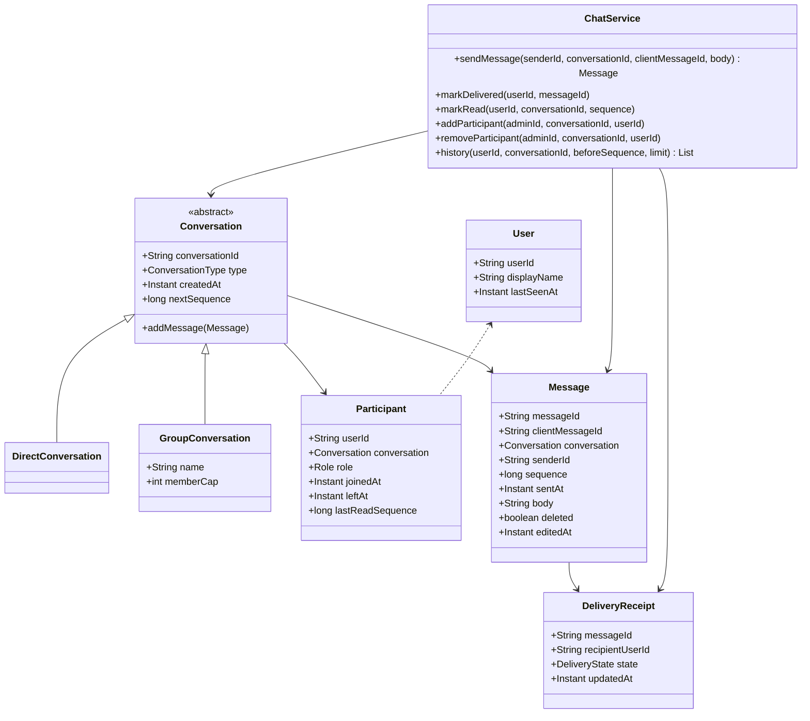

# Design Chat Application (LLD)

**Date:** 2026-05-02 | **Updated:** 2026-05-02
**Tags:** `low-level-design` `case-study` `communication` `chat` `messaging` `observer`

## Summary

A chat application's LLD focuses on the small, well-defined object graph behind the user-facing experience: **users**, **conversations** (1:1 or group), **participants** (with role and join time), and **messages** with a per-recipient delivery state. The core challenge is keeping the model simple enough to reason about while handling group chat semantics correctly: a single message has many recipients, each with their own `SENT/DELIVERED/READ` states; participants can leave and rejoin; admins can add or remove members; and history visibility must respect join time.

This LLD intentionally stays at the in-process domain layer — transport (WebSocket, push fan-out) and persistence (write-ahead log, sharding) are abstracted behind small interfaces. The design reuses a publish/subscribe core internally so that "user X is online and connected" plugs in without touching message semantics.

## Table of Contents

- [Requirements](#requirements)
- [Entities and Relationships](#entities-and-relationships)
- [Class Skeletons (Java)](#class-skeletons-java)
- [Key Algorithms / Workflows](#key-algorithms--workflows)
- [Patterns Used](#patterns-used)
- [Concurrency Considerations](#concurrency-considerations)
- [Trade-offs and Extensions](#trade-offs-and-extensions)
- [Related](#related)
- [References](#references)

## Requirements

### Functional

- 1:1 and group conversations.
- Send text messages; extension points for attachments, replies, reactions.
- Per-recipient delivery state: `SENT`, `DELIVERED`, `READ`.
- Add or remove participants (only admins for groups).
- Read receipts and typing indicators.
- Message history per conversation, paginated, ordered by server-assigned sequence.
- Edit and delete (soft) own messages within a window.

### Non-Functional

- Strict ordering per conversation.
- Idempotent send: a client retrying with the same `clientMessageId` must not produce a duplicate.
- Bounded fan-out per message; group caps enforced.
- History visibility starts from a participant's `joinedAt`; messages before that are not shown.

### Out of Scope

- End-to-end encryption, federation, calls, presence at scale.

## Entities and Relationships



## Class Skeletons (Java)

```java
public enum ConversationType { DIRECT, GROUP }
public enum Role { MEMBER, ADMIN }
public enum DeliveryState { SENT, DELIVERED, READ }

public final class User {
    private final String userId;
    private final String displayName;
    private final Instant lastSeenAt;
}

public abstract class Conversation {
    protected final String conversationId;
    protected final ConversationType type;
    protected final Instant createdAt;
    protected final Map<String, Participant> participants = new ConcurrentHashMap<>();
    protected final AtomicLong nextSequence = new AtomicLong(1);

    public abstract void enforceAddInvariants(String adminId, String userId);

    public long allocateSequence() { return nextSequence.getAndIncrement(); }
    public Optional<Participant> participant(String userId) {
        return Optional.ofNullable(participants.get(userId));
    }
}

public final class DirectConversation extends Conversation {
    @Override
    public void enforceAddInvariants(String adminId, String userId) {
        throw new UnsupportedOperationException("direct conversations are fixed at 2");
    }
}

public final class GroupConversation extends Conversation {
    private final String name;
    private final int memberCap;

    @Override
    public void enforceAddInvariants(String adminId, String userId) {
        Participant admin = participants.get(adminId);
        if (admin == null || admin.role() != Role.ADMIN)
            throw new ForbiddenException("only admin can add");
        if (participants.size() >= memberCap)
            throw new GroupFullException();
        if (participants.containsKey(userId))
            throw new AlreadyMemberException();
    }
}

public final class Participant {
    private final String userId;
    private final String conversationId;
    private final Role role;
    private final Instant joinedAt;
    private final Instant leftAt;          // nullable
    private final long lastReadSequence;
}

public final class Message {
    private final String messageId;
    private final String clientMessageId;  // for idempotency
    private final String conversationId;
    private final String senderId;
    private final long sequence;
    private final Instant sentAt;
    private final String body;
    private final boolean deleted;
    private final Instant editedAt;        // nullable
}

public final class DeliveryReceipt {
    private final String messageId;
    private final String recipientUserId;
    private final DeliveryState state;
    private final Instant updatedAt;
}

public interface MessageBus {
    void publish(String userId, Object event);   // online fan-out
}

public final class ChatService {
    private final ConversationRepository conversations;
    private final MessageRepository messages;
    private final ReceiptRepository receipts;
    private final MessageBus bus;

    public Message sendMessage(String senderId, String conversationId,
                               String clientMessageId, String body) {
        Conversation c = conversations.findById(conversationId);
        Participant p = c.participant(senderId)
            .orElseThrow(NotAParticipantException::new);

        Optional<Message> existing = messages.findByClientId(conversationId, clientMessageId);
        if (existing.isPresent()) return existing.get();    // idempotent

        long seq = c.allocateSequence();
        Message m = new Message(/* id, clientId, conversationId, senderId, seq, now, body, false, null */);
        messages.save(m);

        for (Participant recipient : c.activeParticipants()) {
            if (recipient.userId().equals(senderId)) continue;
            DeliveryReceipt r = new DeliveryReceipt(m.messageId(), recipient.userId(),
                                                    DeliveryState.SENT, Instant.now());
            receipts.save(r);
            bus.publish(recipient.userId(), new MessageDelivered(m, r));
        }
        return m;
    }

    public void markDelivered(String userId, String messageId) {
        receipts.updateState(messageId, userId, DeliveryState.DELIVERED);
    }

    public void markRead(String userId, String conversationId, long upToSequence) {
        receipts.markReadUpTo(conversationId, userId, upToSequence);
        conversations.updateLastRead(conversationId, userId, upToSequence);
    }

    public List<Message> history(String userId, String conversationId,
                                 long beforeSequence, int limit) {
        Conversation c = conversations.findById(conversationId);
        Participant p = c.participant(userId)
            .orElseThrow(NotAParticipantException::new);
        return messages.page(conversationId, p.joinedAt(), beforeSequence, limit);
    }
}
```

## Key Algorithms / Workflows

### Send Message (Idempotent)

1. Authorize: sender must be an active participant.
2. Lookup by `(conversationId, clientMessageId)`; return existing if found.
3. Allocate a strictly increasing per-conversation `sequence` via `AtomicLong` (or DB sequence).
4. Persist `Message`.
5. Fan out: create one `DeliveryReceipt(SENT)` per recipient, publish event to the in-process bus for online recipients; offline recipients are picked up via push or on next sync.

### Read Receipts

- Client posts the highest `sequence` it has displayed.
- Service updates receipts in the range `(lastReadSequence, upToSequence]` to `READ`.
- Conversation-level `lastReadSequence` cached on the participant for unread counts.

### History Pagination

- Page descending by `sequence` from `beforeSequence` exclusive, limit N.
- Filter to messages where `sentAt >= participant.joinedAt` so newcomers do not see prior history.

### Group Membership Changes

- `addParticipant`: admin-only, capacity check, dedupe; new participant's `joinedAt = now`, `lastReadSequence = c.nextSequence - 1`.
- `removeParticipant`: admin-only; set `leftAt`; future messages skip them in fan-out; history queries filter by `leftAt`.

## Patterns Used

- **Template Method / Inheritance** — `Conversation` defines invariants; `DirectConversation` and `GroupConversation` override `enforceAddInvariants`.
- **Repository** — `ConversationRepository`, `MessageRepository`, `ReceiptRepository` hide storage.
- **Observer / Pub-Sub** — `MessageBus` decouples online fan-out from message persistence; the in-process pub/sub design (sibling doc) plugs in directly.
- **Strategy** (extension) — message kind handlers (`TextHandler`, `AttachmentHandler`).
- **Specification** — history visibility (`sentAt >= joinedAt && sequence < before`) expressed declaratively for testability.

## Concurrency Considerations

- `nextSequence` is per-conversation `AtomicLong` so a single conversation never has out-of-order sequences even under concurrent sends; cross-conversation parallelism is preserved.
- Idempotency check + insert is wrapped in a unique constraint on `(conversationId, clientMessageId)` so concurrent retries reduce to a single row.
- Receipt updates are monotonic (`SENT < DELIVERED < READ`); the repository enforces "never go backwards".
- Participant map uses `ConcurrentHashMap` so add/remove and iteration during fan-out do not throw.
- `MessageBus.publish` runs on a dedicated executor to keep the send call path short and predictable.
- Long-running pagination uses keyset pagination on `(conversationId, sequence)` — no offset scans.

## Trade-offs and Extensions

- **In-memory sequence vs DB sequence**: in-memory is fast but loses uniqueness across restarts; a DB sequence or a single-writer-per-conversation worker keeps it simple at scale.
- **Receipts table size**: per-message-per-recipient grows quickly. Compact via "last read up to N" instead of per-message rows for very large groups.
- **Push vs pull fan-out**: real systems usually fan out write to per-recipient inboxes (write fan-out) so reads are O(1); this LLD shows read fan-out for simplicity and notes the swap point at `MessageBus`.
- **Edit/delete semantics**: soft delete keeps audit trail; hard delete simplifies storage but loses history.

Extensions:

- Reactions and replies as message metadata.
- Threads as nested `parentMessageId` with sub-sequence.
- Encryption: a `MessageCipher` strategy applied before persistence; receipts remain plaintext.
- Presence and typing indicators piggyback on the same `MessageBus` with separate event types.

## Related

- [Design Notification System (LLD)](./design-notification-system-lld.md)
- [Design Pub/Sub System (LLD)](./design-pub-sub-system-lld.md)
- [Behavioral patterns](../../design-patterns/behavioral/)
- [Structural patterns](../../design-patterns/structural/)
- [System Design INDEX](../../../system-design/INDEX.md)

## References

- Gamma, Helm, Johnson, Vlissides, *Design Patterns* — Observer, Template Method.
- Fowler, *Patterns of Enterprise Application Architecture* — Repository, Specification.
- Hohpe, Woolf, *Enterprise Integration Patterns* — Idempotent Receiver, Recipient List.
