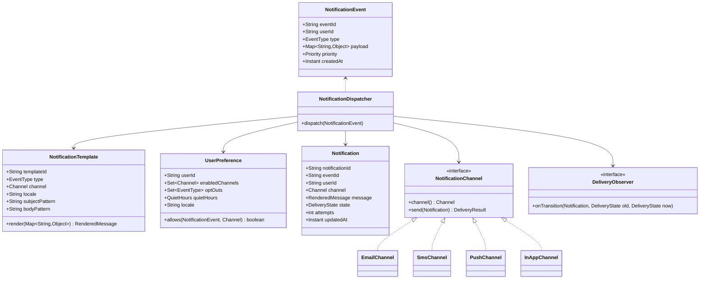
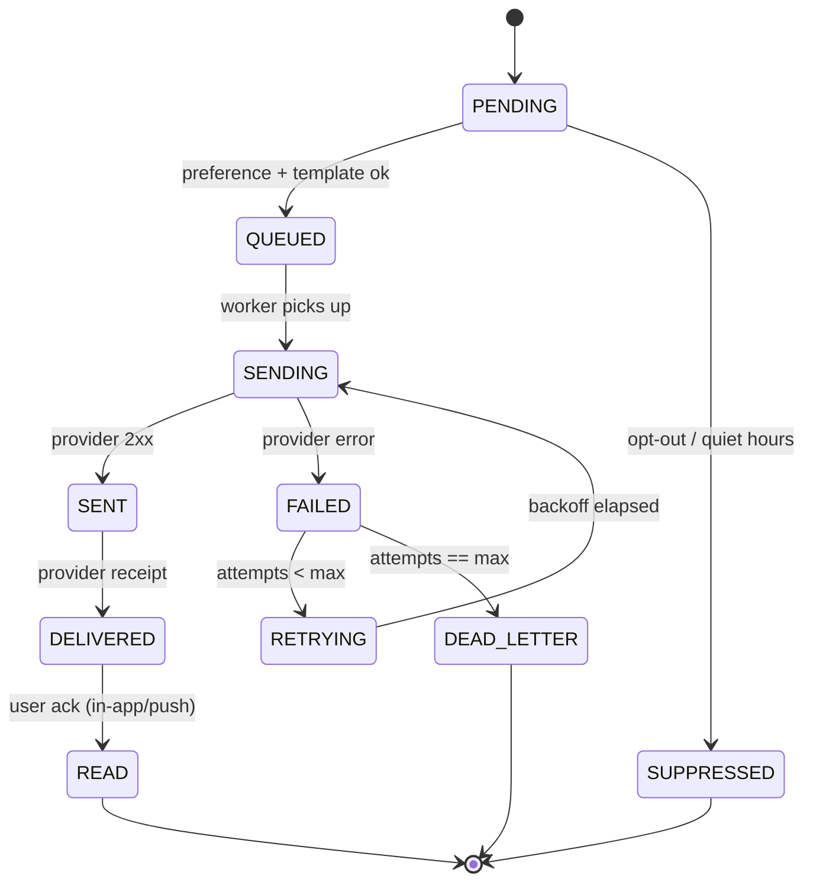

# Design Notification System (LLD)

**Date:** 2026-05-02 | **Updated:** 2026-05-02
**Tags:** `low-level-design` `case-study` `communication` `notifications` `observer` `strategy` `state-machine`

## Summary

A notification system delivers messages across multiple channels (email, SMS, push, in-app) based on user preferences and per-event templates. The LLD focuses on a clean separation between **what** to send (event + template), **how** to send it (channel strategy), and **whether** to send it (preference + rate-limiting + opt-outs). Delivery is modeled as a small state machine so retries, failures, and acknowledgements remain auditable.

The design favors composition over inheritance: each channel is a `NotificationChannel` strategy plugged into a dispatcher, observers handle side effects (audit logging, metrics, webhooks), and template rendering is decoupled from transport. The system is in-process by default but exposes interfaces that map cleanly to a queue-backed worker model when scaled out.

## Table of Contents

- [Requirements](#requirements)
- [Entities and Relationships](#entities-and-relationships)
- [Class Skeletons (Java)](#class-skeletons-java)
- [Key Algorithms / Workflows](#key-algorithms--workflows)
- [Patterns Used](#patterns-used)
- [Concurrency Considerations](#concurrency-considerations)
- [Trade-offs and Extensions](#trade-offs-and-extensions)
- [Related](#related)
- [References](#references)

## Requirements

### Functional

- Send notifications across channels: `EMAIL`, `SMS`, `PUSH`, `IN_APP`.
- Accept events of different kinds (`ORDER_SHIPPED`, `PASSWORD_RESET`, `PROMO`, ...) and resolve a template per event + channel + locale.
- Honor per-user preferences: enabled channels, quiet hours, do-not-disturb, category opt-outs.
- Track each delivery through a state machine: `PENDING -> QUEUED -> SENDING -> SENT -> DELIVERED -> READ` with `FAILED` and `RETRYING` branches.
- Support retries with exponential backoff and a max attempt cap.
- Allow extension with new channels without modifying existing code (open/closed).

### Non-Functional

- Failure isolation: a single channel outage must not block other channels.
- Idempotent send: the same `(eventId, userId, channel)` should not produce duplicate sends.
- Observable: every transition emits an event for audit, metrics, and webhooks.
- Bounded latency for high-priority transactional notifications.

### Out of Scope

- Cross-region replication of delivery state.
- ML-driven send-time optimization.

## Entities and Relationships



### Delivery State Machine



## Class Skeletons (Java)

```java
public enum Channel { EMAIL, SMS, PUSH, IN_APP }
public enum Priority { TRANSACTIONAL, HIGH, NORMAL, LOW }
public enum DeliveryState {
    PENDING, QUEUED, SENDING, SENT, DELIVERED, READ,
    FAILED, RETRYING, SUPPRESSED, DEAD_LETTER
}

public final class NotificationEvent {
    private final String eventId;
    private final String userId;
    private final EventType type;
    private final Map<String, Object> payload;
    private final Priority priority;
    private final Instant createdAt;
    // constructor, getters; immutable
}

public final class RenderedMessage {
    private final String subject; // nullable for SMS/push
    private final String body;
    // immutable
}

public interface NotificationTemplate {
    EventType type();
    Channel channel();
    String locale();
    RenderedMessage render(Map<String, Object> payload);
}

public interface NotificationChannel {
    Channel channel();
    DeliveryResult send(Notification notification);
}

public final class DeliveryResult {
    private final boolean ok;
    private final String providerRef;   // for receipts
    private final String errorCode;     // nullable
    private final boolean retryable;
}

public interface DeliveryObserver {
    void onTransition(Notification n, DeliveryState from, DeliveryState to);
}

public final class Notification {
    private final String notificationId;
    private final String eventId;
    private final String userId;
    private final Channel channel;
    private final RenderedMessage message;
    private final DeliveryState state;
    private final int attempts;
    private final Instant updatedAt;
    // immutable; transitions return new Notification
    public Notification withState(DeliveryState next) { /* ... */ return null; }
    public Notification incrementAttempts() { /* ... */ return null; }
}

public final class NotificationDispatcher {
    private final Map<Channel, NotificationChannel> channels;
    private final TemplateRegistry templates;
    private final PreferenceRepository preferences;
    private final NotificationRepository notifications;
    private final List<DeliveryObserver> observers;
    private final RetryPolicy retryPolicy;

    public void dispatch(NotificationEvent event) {
        UserPreference pref = preferences.findByUserId(event.userId());
        for (Channel ch : pref.enabledChannels()) {
            if (!pref.allows(event, ch)) {
                persistAndNotify(event, ch, DeliveryState.SUPPRESSED, null);
                continue;
            }
            NotificationTemplate tpl = templates.lookup(event.type(), ch, pref.locale());
            RenderedMessage msg = tpl.render(event.payload());
            Notification n = new Notification(/* ... */);
            send(n);
        }
    }

    private void send(Notification n) {
        Notification queued = transition(n, DeliveryState.QUEUED);
        Notification sending = transition(queued, DeliveryState.SENDING);
        DeliveryResult r = channels.get(sending.channel()).send(sending);
        if (r.ok()) {
            transition(sending, DeliveryState.SENT);
        } else if (r.retryable() && sending.attempts() < retryPolicy.maxAttempts()) {
            transition(sending.incrementAttempts(), DeliveryState.RETRYING);
        } else {
            transition(sending, DeliveryState.DEAD_LETTER);
        }
    }

    private Notification transition(Notification n, DeliveryState next) {
        Notification updated = n.withState(next);
        notifications.save(updated);
        for (DeliveryObserver o : observers) o.onTransition(updated, n.state(), next);
        return updated;
    }
}
```

## Key Algorithms / Workflows

### Dispatch Pipeline

1. Receive `NotificationEvent`.
2. Resolve `UserPreference`. If user has globally opted out of `event.type()`, mark `SUPPRESSED` for all channels.
3. For each enabled channel: check quiet hours, lookup `NotificationTemplate(type, channel, locale)`, render message.
4. Persist `Notification` in `PENDING`, transition through `QUEUED -> SENDING`.
5. Call channel strategy `send(notification)`.
6. On success: transition `SENT`. On retryable failure: increment attempts, transition `RETRYING`, schedule with backoff.
7. On terminal failure or attempts cap: transition `DEAD_LETTER`.
8. Async receipts (delivered/read) update state via callback handlers.

### Idempotency

- `(eventId, userId, channel)` is the dedupe key.
- Repository enforces uniqueness; duplicate dispatch becomes a no-op short-circuit at step 4.

### Retry with Backoff

- `RetryPolicy.nextDelay(attempts) = base * 2^attempts + jitter`.
- A scheduler polls for `RETRYING` notifications whose `updatedAt + nextDelay <= now`.

## Patterns Used

- **Strategy** — `NotificationChannel` implementations swap transport without dispatcher changes.
- **Observer** — `DeliveryObserver` decouples audit, metrics, and webhooks from core flow.
- **Template Method** — `NotificationTemplate.render` defines the rendering contract; concrete templates supply patterns.
- **State** — `DeliveryState` plus immutable `withState` transitions enforce legal moves.
- **Registry** — `TemplateRegistry` and `Map<Channel, NotificationChannel>` for lookup.
- **Factory** — Notification creation centralized to enforce invariants and ID generation.

## Concurrency Considerations

- `NotificationChannel.send` must be thread-safe; channel-side connection pools (SMTP, HTTPS) handle parallelism.
- Per-channel bulkheads (separate executors) prevent one slow provider from starving others.
- Repository writes use optimistic locking on `Notification` to avoid lost updates between sender and receipt callback.
- Observers run on a dedicated executor so a slow webhook does not block the sender.
- For at-least-once semantics behind a queue, the consumer checkpoints state only after a successful repository write.

## Trade-offs and Extensions

- **In-process vs queue-backed**: in-process keeps latency low for transactional notifications; a queue (Kafka, SQS) is required at scale to absorb spikes and isolate failures.
- **Push vs pull templates**: hot-reloadable template store (DB-backed) trades consistency for editability vs static compiled templates.
- **Per-channel SLAs**: SMS and push are best-effort; in-app is reliable; email is asynchronous. Reflect in `Priority` routing.
- **Deduplication window**: a TTL-bounded dedupe table prevents storage growth.

Extensions:

- Webhook channel as another `NotificationChannel`.
- Digest/batch notifications: a new dispatcher mode that aggregates events by user before rendering.
- Localization fallback chain (`fr-CA -> fr -> en`).
- Send-time optimization plugged in as a `Scheduler` strategy.

## Related

- [Design Pub/Sub System (LLD)](./design-pub-sub-system-lld.md)
- [Design Chat Application (LLD)](./design-chat-application-lld.md)
- [Behavioral patterns](../../design-patterns/behavioral/)
- [Structural patterns](../../design-patterns/structural/)
- [System Design INDEX](../../../system-design/INDEX.md)

## References

- Gamma, Helm, Johnson, Vlissides, *Design Patterns: Elements of Reusable Object-Oriented Software* — Strategy, Observer, State, Template Method.
- Hohpe, Woolf, *Enterprise Integration Patterns* — Message Channel, Dead Letter Channel, Idempotent Receiver.
- Fowler, *Patterns of Enterprise Application Architecture* — Repository, Registry.
