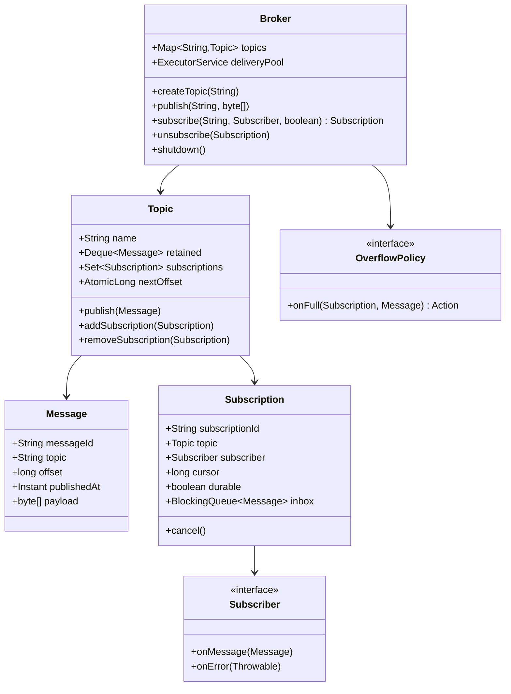

# Design Pub/Sub System (LLD)

**Date:** 2026-05-02 | **Updated:** 2026-05-02
**Tags:** `low-level-design` `case-study` `communication` `pub-sub` `observer` `concurrency`

## Summary

An in-process publish/subscribe system decouples producers from consumers via named **topics**. Publishers emit messages to a topic; subscribers register with a topic and receive every message published while their subscription is active. The LLD focuses on three things: (1) clean separation between **broker** (routing), **topic** (per-channel queue + subscription set), and **subscription** (per-consumer cursor and delivery thread), (2) thread-safe data structures so concurrent publish and subscribe never corrupt state, and (3) bounded queues with a clear backpressure / drop policy.

This is not Kafka — it is the kind of broker you build inside a single JVM (think Guava `EventBus` or Spring `ApplicationEventPublisher` with explicit topics, replay cursors, and per-subscription threads). It maps cleanly to the Observer pattern with explicit topic indirection.

## Table of Contents

- [Requirements](#requirements)
- [Entities and Relationships](#entities-and-relationships)
- [Class Skeletons (Java)](#class-skeletons-java)
- [Key Algorithms / Workflows](#key-algorithms--workflows)
- [Patterns Used](#patterns-used)
- [Concurrency Considerations](#concurrency-considerations)
- [Trade-offs and Extensions](#trade-offs-and-extensions)
- [Related](#related)
- [References](#references)

## Requirements

### Functional

- `createTopic(name)` and `deleteTopic(name)`.
- `subscribe(topic, subscriber)` returns a `Subscription` handle; `unsubscribe(handle)` removes it.
- `publish(topic, message)` delivers to every active subscriber on that topic.
- Per-subscription delivery is **ordered** with respect to publish order on that topic.
- Subscriptions can be **durable** (start from earliest retained offset on reconnect) or **transient** (only future messages).
- Wildcard subscriptions (`orders.*`) are out of scope for v1 but the design must allow extension.

### Non-Functional

- Thread-safe: many publishers, many subscribers, concurrent subscribe/unsubscribe.
- Bounded memory: per-topic and per-subscription queue caps with explicit overflow policy.
- Slow subscribers must not block fast ones or the publisher.
- Predictable shutdown: drain in-flight, then stop.

### Out of Scope

- Cross-process transport, persistence, exactly-once semantics, message replay across restarts.

## Entities and Relationships



## Class Skeletons (Java)

```java
public final class Message {
    private final String messageId;
    private final String topic;
    private final long offset;
    private final Instant publishedAt;
    private final byte[] payload;
    // immutable
}

public interface Subscriber {
    void onMessage(Message m);
    default void onError(Throwable t) { /* default log */ }
}

public enum Action { DROP_NEW, DROP_OLDEST, BLOCK }

public interface OverflowPolicy {
    Action onFull(Subscription s, Message m);
}

public final class Subscription {
    private final String subscriptionId;
    private final Topic topic;
    private final Subscriber subscriber;
    private final boolean durable;
    private final BlockingQueue<Message> inbox;
    private final AtomicBoolean active = new AtomicBoolean(true);
    private volatile long cursor;

    public boolean offer(Message m, OverflowPolicy policy) {
        if (!active.get()) return false;
        if (inbox.offer(m)) return true;
        Action a = policy.onFull(this, m);
        return switch (a) {
            case DROP_NEW -> false;
            case DROP_OLDEST -> { inbox.poll(); yield inbox.offer(m); }
            case BLOCK -> {
                try { inbox.put(m); yield true; }
                catch (InterruptedException ie) {
                    Thread.currentThread().interrupt();
                    yield false;
                }
            }
        };
    }

    public void cancel() { active.set(false); inbox.clear(); }
    public boolean isActive() { return active.get(); }
}

public final class Topic {
    private final String name;
    private final Deque<Message> retained = new ArrayDeque<>();
    private final int retainedCap;
    private final Set<Subscription> subscriptions = ConcurrentHashMap.newKeySet();
    private final AtomicLong nextOffset = new AtomicLong();
    private final ReentrantReadWriteLock lock = new ReentrantReadWriteLock();

    public Message publish(byte[] payload, OverflowPolicy policy) {
        long offset = nextOffset.getAndIncrement();
        Message m = new Message(UUID.randomUUID().toString(), name, offset,
                                Instant.now(), payload);
        lock.writeLock().lock();
        try {
            retained.addLast(m);
            while (retained.size() > retainedCap) retained.removeFirst();
        } finally { lock.writeLock().unlock(); }
        for (Subscription s : subscriptions) s.offer(m, policy);
        return m;
    }

    public void addSubscription(Subscription s) {
        if (s.isDurable()) {
            lock.readLock().lock();
            try { for (Message m : retained) s.offer(m, /* default */ null); }
            finally { lock.readLock().unlock(); }
        }
        subscriptions.add(s);
    }

    public void removeSubscription(Subscription s) { subscriptions.remove(s); }
}

public final class Broker {
    private final ConcurrentMap<String, Topic> topics = new ConcurrentHashMap<>();
    private final ExecutorService deliveryPool;
    private final OverflowPolicy overflow;

    public Topic createTopic(String name, int retainedCap) {
        return topics.computeIfAbsent(name, n -> new Topic(n, retainedCap));
    }

    public Subscription subscribe(String topic, Subscriber sub, boolean durable, int inboxCap) {
        Topic t = topics.get(topic);
        if (t == null) throw new NoSuchTopicException(topic);
        Subscription s = new Subscription(UUID.randomUUID().toString(),
                                          t, sub, durable,
                                          new ArrayBlockingQueue<>(inboxCap));
        t.addSubscription(s);
        deliveryPool.submit(() -> drain(s));
        return s;
    }

    public void unsubscribe(Subscription s) {
        s.topic().removeSubscription(s);
        s.cancel();
    }

    public void publish(String topic, byte[] payload) {
        Topic t = topics.get(topic);
        if (t == null) throw new NoSuchTopicException(topic);
        t.publish(payload, overflow);
    }

    private void drain(Subscription s) {
        while (s.isActive()) {
            try {
                Message m = s.inbox().poll(100, TimeUnit.MILLISECONDS);
                if (m == null) continue;
                try { s.subscriber().onMessage(m); s.advance(m.offset()); }
                catch (Throwable t) { s.subscriber().onError(t); }
            } catch (InterruptedException ie) {
                Thread.currentThread().interrupt(); return;
            }
        }
    }

    public void shutdown() {
        topics.values().forEach(t -> t.subscriptions().forEach(Subscription::cancel));
        deliveryPool.shutdown();
    }
}
```

## Key Algorithms / Workflows

### Publish

1. Acquire next monotonic `offset` for the topic via `AtomicLong`.
2. Build immutable `Message`.
3. Under write lock: append to retained ring buffer, evict oldest if over cap.
4. For each subscription, call `offer` (non-blocking) with the configured `OverflowPolicy`.

### Subscribe

1. Look up topic; reject if missing.
2. Create `Subscription` with bounded inbox.
3. If durable, copy retained messages into inbox (under read lock).
4. Add to topic subscription set.
5. Submit a delivery loop to the executor.

### Unsubscribe

1. Remove from topic set.
2. Cancel subscription (drains inbox, flips `active` flag).
3. Delivery loop exits on next poll.

### Delivery Loop

- Poll inbox with timeout to remain responsive to cancellation.
- Catch and forward subscriber exceptions to `onError` so one bad subscriber cannot kill the loop.

## Patterns Used

- **Observer** — subscribers register with topics; broker routes events to them.
- **Mediator** — broker mediates between publishers and subscribers; neither knows the other.
- **Producer/Consumer** — bounded `BlockingQueue` per subscription is the canonical handoff.
- **Strategy** — `OverflowPolicy` plugs in `DROP_NEW`, `DROP_OLDEST`, or `BLOCK`.
- **Factory** — broker creates `Topic` and `Subscription` instances enforcing invariants.

## Concurrency Considerations

- `topics` map uses `ConcurrentHashMap` so create/lookup is lock-free.
- `Topic.subscriptions` uses `ConcurrentHashMap.newKeySet()` for lock-free iteration during publish.
- Retained buffer is guarded by a `ReentrantReadWriteLock`: many durable subscribers can join concurrently while publishes serialize on the write lock.
- Per-subscription `BlockingQueue` isolates slow subscribers from fast ones.
- Per-subscription delivery thread (or task on a shared pool) preserves ordering for that subscription without serializing the whole topic.
- `AtomicLong` offset generation guarantees a strict total order per topic.
- Shutdown drains in-flight by cancelling subscriptions then shutting down the executor with a timeout before `shutdownNow`.

## Trade-offs and Extensions

- **In-process only**: trivial deployment, no durability across restarts. For durability, plug in a write-ahead log behind `Topic.publish`.
- **At-most-once vs at-least-once**: `DROP_NEW` and `DROP_OLDEST` give at-most-once; `BLOCK` plus retried subscriber gives at-least-once with backpressure.
- **Order vs throughput**: a single delivery thread per subscription preserves order but caps per-subscription throughput. A partitioned subscriber (key-based fan-out) scales while preserving order per key.
- **Memory**: bounded inbox + bounded retained buffer keeps the broker's footprint predictable.

Extensions:

- Wildcard topics via a trie of topic segments.
- Filter predicates per subscription (content-based routing).
- Dead-letter topic for messages that exceed retry limit on a subscriber.
- Pluggable serialization to support cross-language payloads.

## Related

- [Design Notification System (LLD)](./design-notification-system-lld.md)
- [Design Chat Application (LLD)](./design-chat-application-lld.md)
- [Behavioral patterns](../../design-patterns/behavioral/)
- [Structural patterns](../../design-patterns/structural/)
- [System Design INDEX](../../../system-design/INDEX.md)

## References

- Gamma, Helm, Johnson, Vlissides, *Design Patterns* — Observer, Mediator.
- Goetz et al., *Java Concurrency in Practice* — bounded queues, producer/consumer, executor shutdown.
- Hohpe, Woolf, *Enterprise Integration Patterns* — Publish-Subscribe Channel, Message Bus, Dead Letter Channel.
