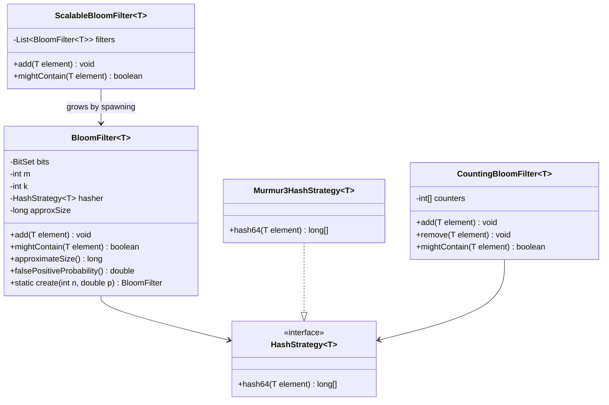

# Design Bloom Filter

**Date:** 2026-05-02 | **Updated:** 2026-05-02
**Tags:** `low-level-design` `case-study` `data-structures` `probabilistic` `hashing`

## Summary

A Bloom filter is a space-efficient probabilistic set. It supports `add(x)` and `mightContain(x)`,
guarantees zero false negatives, and admits a tunable false-positive rate. It does **not**
support deletion in the basic form, and it does not store the elements themselves — it stores a
fingerprint distributed across a bit array via `k` independent hash functions.

The structure was introduced by Burton Howard Bloom in his 1970 paper *Space/Time Trade-offs in
Hash Coding with Allowable Errors*. It is the workhorse of lookup-avoidance in databases (LSM
trees in Cassandra, HBase, RocksDB), CDN caches, malicious-URL lists, and write-heavy systems
where an outright miss should not pay the cost of a disk seek.

## Table of Contents

- [Requirements](#requirements)
- [Entities and Relationships](#entities-and-relationships)
- [Class Skeletons](#class-skeletons)
- [Key Algorithms](#key-algorithms)
- [Patterns Used](#patterns-used)
- [Concurrency Considerations](#concurrency-considerations)
- [Trade-offs and Extensions](#trade-offs-and-extensions)
- [Related](#related)
- [References](#references)

## Requirements

### Functional

- `add(x)`: insert an element.
- `mightContain(x)`: return `false` if `x` is definitely not in the set, `true` if `x` is
  *probably* in the set.
- `approximateSize()`: estimate the number of distinct elements added.
- Configurable expected element count `n` and target false-positive rate `p`.

### Non-functional

- O(k) per operation, where k is the number of hash functions (typically 5–15).
- Bit-array storage: roughly 9.6 bits per element for p = 1%.
- No false negatives. False positives bounded by configuration.
- Optional: serializable (for distribution to clients or persistence).

### Out of scope (in the basic form)

- `remove(x)`: not supported because clearing bits could clear bits shared with other elements.
  See the Counting Bloom variant.
- Cardinality with high precision: HyperLogLog is the right tool.
- Set intersection: possible only when both filters share `m`, `k`, and the same hash family.

## Entities and Relationships



## Class Skeletons

### Java — basic Bloom filter

```java
public final class BloomFilter<T> {

    private final BitSet bits;
    private final int m;        // bit-array size
    private final int k;        // number of hash functions
    private final HashStrategy<T> hasher;
    private long approxSize;

    private BloomFilter(int m, int k, HashStrategy<T> hasher) {
        this.bits = new BitSet(m);
        this.m = m;
        this.k = k;
        this.hasher = hasher;
    }

    /**
     * Create a filter sized for n expected insertions at false-positive rate p.
     * Optimal sizing: m = -n * ln(p) / (ln(2)^2), k = (m/n) * ln(2).
     */
    public static <T> BloomFilter<T> create(int expectedInsertions, double fpp,
                                            HashStrategy<T> hasher) {
        if (expectedInsertions <= 0) {
            throw new IllegalArgumentException("expectedInsertions must be > 0");
        }
        if (fpp <= 0 || fpp >= 1) {
            throw new IllegalArgumentException("fpp must be in (0, 1)");
        }
        int m = optimalM(expectedInsertions, fpp);
        int k = optimalK(expectedInsertions, m);
        return new BloomFilter<>(m, k, hasher);
    }

    public void add(T element) {
        long[] indices = indices(element);
        boolean novel = false;
        for (long i : indices) {
            int bitIndex = (int) (i % m);
            if (!bits.get(bitIndex)) {
                bits.set(bitIndex);
                novel = true;
            }
        }
        if (novel) {
            approxSize++;
        }
    }

    public boolean mightContain(T element) {
        long[] indices = indices(element);
        for (long i : indices) {
            if (!bits.get((int) (i % m))) {
                return false;
            }
        }
        return true;
    }

    public long approximateSize() {
        return approxSize;
    }

    public double currentFalsePositiveProbability() {
        // P ≈ (1 - exp(-k * approxSize / m))^k
        double exponent = -((double) k * approxSize) / m;
        return Math.pow(1.0 - Math.exp(exponent), k);
    }

    private long[] indices(T element) {
        long[] base = hasher.hash64(element);
        long h1 = base[0];
        long h2 = base[1];
        long[] result = new long[k];
        for (int i = 0; i < k; i++) {
            long combined = h1 + (long) i * h2;
            result[i] = combined & Long.MAX_VALUE; // ensure non-negative
        }
        return result;
    }

    private static int optimalM(int n, double p) {
        return (int) Math.ceil(-n * Math.log(p) / (Math.log(2) * Math.log(2)));
    }

    private static int optimalK(int n, int m) {
        return Math.max(1, (int) Math.round(((double) m / n) * Math.log(2)));
    }
}
```

### Counting Bloom filter

Replace each bit with a small counter (4 bits is typical). `add` increments, `remove` decrements,
`mightContain` checks for non-zero. The cost is 4× the memory of a basic Bloom filter for the
same `m`. Counter overflow is handled by clamping at the maximum counter value, which biases the
filter toward more false positives but never produces false negatives.

```java
public final class CountingBloomFilter<T> {
    private final int[] counters;
    private final int m;
    private final int k;
    private final HashStrategy<T> hasher;

    public void add(T element) {
        for (long i : indices(element)) {
            int idx = (int) (i % m);
            if (counters[idx] < Integer.MAX_VALUE) counters[idx]++;
        }
    }

    public void remove(T element) {
        for (long i : indices(element)) {
            int idx = (int) (i % m);
            if (counters[idx] > 0) counters[idx]--;
        }
    }

    public boolean mightContain(T element) {
        for (long i : indices(element)) {
            if (counters[(int) (i % m)] == 0) return false;
        }
        return true;
    }
    // indices() identical to BloomFilter
}
```

### Scalable Bloom filter

When the actual element count exceeds `n`, the false-positive rate degrades. A scalable Bloom
filter, introduced by Almeida et al. (2007), maintains a list of filters with geometrically
growing sizes and tightening per-filter `p`, so the union still meets the target rate.

## Key Algorithms

### Sizing

For target false-positive probability `p` and expected element count `n`:

```
m = ceil( -n * ln(p) / (ln(2))^2 )
k = round( (m/n) * ln(2) )
```

A few useful concrete points:

| p     | bits per element | k  |
|-------|------------------|----|
| 10%   | 4.8              | 3  |
| 1%    | 9.6              | 7  |
| 0.1%  | 14.4             | 10 |
| 0.01% | 19.2             | 13 |

### False-positive probability

After `n` insertions into a filter of `m` bits with `k` hash functions, the probability that any
specific bit is still 0 is:

```
P(bit = 0) = (1 - 1/m)^(kn) ≈ exp(-kn/m)
```

A false positive requires all `k` queried bits to be 1:

```
P ≈ (1 - exp(-kn/m))^k
```

Differentiating with respect to `k` and solving gives the optimal `k = (m/n) * ln(2)`. At that
choice, `P ≈ (1/2)^k`, which explains the bits-per-element table above.

### Double hashing trick

Generating `k` independent hash functions is expensive. Kirsch and Mitzenmacher (2006) showed
that two independent 64-bit hashes `h1`, `h2` are enough — derive the `i`-th hash as
`h_i = h1 + i * h2`. This is what production implementations (Guava, Cassandra) use, with
MurmurHash3 producing the 128-bit base hash.

### add(x)

1. Compute the `k` bit indices for `x`.
2. Set each bit. Track whether any bit was previously 0 to maintain `approxSize`.

### mightContain(x)

1. Compute the `k` bit indices.
2. If any bit is 0, return `false`.
3. Otherwise return `true`.

## Patterns Used

- **Strategy:** `HashStrategy` decouples the filter from the hash function. Production code uses
  MurmurHash3, xxHash, or BLAKE3; tests can inject deterministic fakes.
- **Factory method:** `create(n, p)` encapsulates the optimal `m`/`k` derivation. Callers do not
  hand-pick parameters.
- **Composite:** `ScalableBloomFilter` composes a list of basic filters and routes by which
  filter currently absorbs writes.
- **Guard / negative cache:** the canonical use is in front of an expensive lookup. The Bloom
  filter says "definitely not present" or "maybe", and only the latter triggers the real check.

## Concurrency Considerations

### Reads

`mightContain` reads bits without ordering guarantees. Stale reads are tolerable: if a concurrent
`add` set a bit a moment ago and we miss it, the worst case is a false negative for an in-flight
write — but only for that race. In practice, treat the filter as eventually consistent.

### Writes

`BitSet` in `java.util` is **not** thread-safe. Two threads setting different bits race on the
underlying `long[]`. Options:

1. **`synchronized`** — fine if the filter is not on the hot path.
2. **`AtomicLongArray`** — replace `BitSet` with a `long[]` wrapped in `AtomicLongArray`. Setting
   bit `i` is `array.getAndUpdate(i / 64, prev -> prev | (1L << (i % 64)))`. Lock-free.
3. **Sharded filters** — partition the bit array into stripes and lock per stripe. Less common.

Counting Bloom filters need atomic counters. `AtomicIntegerArray` works for 32-bit counters; for
4-bit counters packed eight to a `long`, you need a CAS loop.

### Memory model

The filter exhibits **monotonic** growth: bits go from 0 to 1, never back (in the basic form).
That means readers tolerate a wide range of staleness without correctness loss — a property that
makes Bloom filters surprisingly amenable to lock-free updates.

## Trade-offs and Extensions

### Trade-offs

- **No deletion** in the basic form. If the workload churns, false-positive rate grows
  unboundedly. Counting variant trades 4× memory for delete support.
- **Cannot enumerate elements**. The filter does not know what is in it; it only answers
  membership.
- **Sized in advance**. Inserting more than `n` elements degrades `p`. Scalable variant
  addresses this.
- **Hash quality matters**. A weak hash function clusters indices and inflates `p`. Use
  cryptographic-grade non-cryptographic hashes (MurmurHash3, xxHash).

### Extensions

- **Counting Bloom filter** — adds `remove`. 4× memory.
- **Scalable Bloom filter** — adds `add` past the planned capacity while preserving `p`.
- **Cuckoo filter** — supports deletion at similar space efficiency, with slightly higher
  insertion failure risk.
- **Compressed Bloom filter** — Mitzenmacher's variant for serialization across the wire;
  optimizes encoded size at fixed `p`.
- **Quotient filter** — cache-friendly alternative; supports merging and resizing.
- **Bloom join** — push a Bloom filter to a remote peer to filter rows before shipping them
  back. Standard distributed-database trick.

### Real-world callers

- **Cassandra, HBase, RocksDB** — Bloom filters per SSTable to skip disk reads for missing keys.
- **CDN edge caches** — track which origin returned 404 to short-circuit retry storms.
- **Bitcoin SPV wallets** — historically used Bloom filters to ask peers for relevant
  transactions without revealing the full address set (now deprecated for privacy reasons).
- **Chrome Safe Browsing** — used a Bloom filter of malicious URL hashes for a fast local check.

## Related

- [Design LRU Cache](./design-lru-cache.md) — Bloom filter often sits in front of an LRU to
  avoid populating it with one-shot misses.
- [Design Search Autocomplete](./design-search-autocomplete.md) — Bloom filter can pre-screen
  whether a prefix has any indexed completions before walking the trie.
- [Design Simple Search Engine](./design-simple-search-engine.md) — Bloom filter per posting
  list lets the query planner skip lists that cannot contain a term.
- [../../design-patterns/behavioral/strategy.md](../../design-patterns/behavioral/strategy.md) — pluggable hash
  strategies.
- [../../design-patterns/creational/factory-method.md](../../design-patterns/creational/factory-method.md) — sizing
  factory.

## References

- Burton Howard Bloom, *Space/Time Trade-offs in Hash Coding with Allowable Errors*,
  Communications of the ACM, vol. 13, no. 7, July 1970. The original paper.
- Adam Kirsch and Michael Mitzenmacher, *Less Hashing, Same Performance: Building a Better Bloom
  Filter*, ESA 2006. The double-hashing trick.
- Paulo Sérgio Almeida, Carlos Baquero, Nuno Preguiça, David Hutchison, *Scalable Bloom
  Filters*, Information Processing Letters, 2007.
- Bin Fan, David G. Andersen, Michael Kaminsky, Michael D. Mitzenmacher, *Cuckoo Filter:
  Practically Better Than Bloom*, CoNEXT 2014.
- Guava `com.google.common.hash.BloomFilter` source — production reference implementation.
- Cassandra and RocksDB design docs on per-SSTable Bloom filters.
