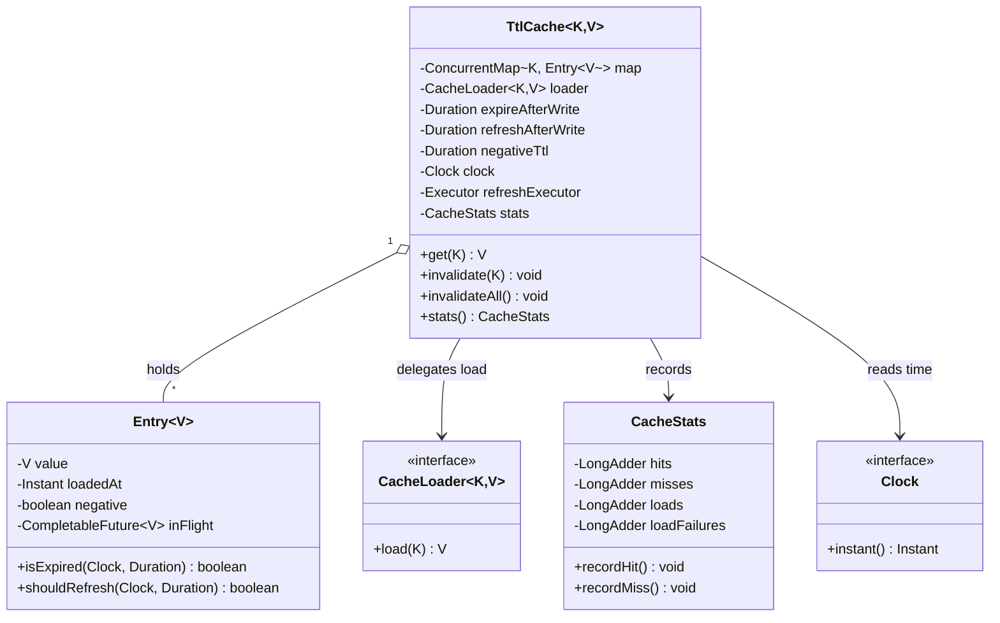

# Design Cache with TTL and Refresh-Ahead

**Date:** 2026-05-02 | **Updated:** 2026-05-02
**Tags:** `low-level-design` `case-study` `caching` `concurrency` `ttl`

## Summary

Design an in-process cache where entries expire by **time** rather than (or in
addition to) **capacity**. The interesting design surface is *not* the map: it
is the policy stack around it — when do we treat an entry as stale, who reloads
it, and how do we keep one slow load from collapsing into a stampede of
identical loads.

This is a deliberate twin to the LRU cache case study. LRU answers "what do we
evict when full?". TTL answers "when does an entry stop being trustworthy?".
Real production caches (Caffeine, Guava `LoadingCache`, Redis with PEXPIRE,
Ehcache) combine both, but the policies compose more cleanly when each is
designed in isolation first.

## Table of Contents

- [Requirements](#requirements)
- [Entities and Relationships](#entities-and-relationships)
- [Class Skeletons (Java)](#class-skeletons-java)
- [Key Algorithms / Workflows](#key-algorithms--workflows)
- [Patterns Used](#patterns-used)
- [Concurrency Considerations](#concurrency-considerations)
- [Trade-offs and Extensions](#trade-offs-and-extensions)
- [Related](#related)
- [References](#references)

## Requirements

### Functional

- `V get(K key)` returns a value, loading from the source on miss.
- Each entry has a configurable **time-to-live (TTL)** after which it is
  considered expired. Reading an expired entry must not return stale data.
- Optional **refresh-ahead**: a soft staleness threshold (`refreshAfter <
  expireAfter`) where the cache returns the current value but triggers a
  background reload.
- Optional **negative caching**: cache the *absence* of a key (loader returned
  `null` or threw `NotFound`) for a shorter TTL.
- `void invalidate(K)` and `void invalidateAll()` remove entries on demand.
- Statistics: hit count, miss count, load count, load failures, evictions.

### Non-functional

- Thread-safe: concurrent `get`s on the same key must coalesce into a single
  loader call (single-flight).
- Bounded memory: even though the policy is time-based, an upper-bound size
  must exist or memory grows under traffic spikes (the loader fans out
  unique keys).
- Predictable tail latency: a slow loader for one key must not block readers
  of other keys.
- No stop-the-world expiration sweeps that pause user threads.

### Out of scope

- Distributed cache coherence (Redis/Memcached topology, gossip).
- Persistence to disk (Ehcache disk tier).
- Eviction by weight / cost (Caffeine supports it; orthogonal to TTL).

## Entities and Relationships



## Class Skeletons (Java)

```java
public interface CacheLoader<K, V> {
    V load(K key) throws Exception;
}

public final class CacheStats {
    private final LongAdder hits = new LongAdder();
    private final LongAdder misses = new LongAdder();
    private final LongAdder loads = new LongAdder();
    private final LongAdder loadFailures = new LongAdder();
    private final LongAdder refreshes = new LongAdder();

    void recordHit()         { hits.increment(); }
    void recordMiss()        { misses.increment(); }
    void recordLoad()        { loads.increment(); }
    void recordLoadFailure() { loadFailures.increment(); }
    void recordRefresh()     { refreshes.increment(); }

    public long hitCount()         { return hits.sum(); }
    public long missCount()        { return misses.sum(); }
    public long loadCount()        { return loads.sum(); }
    public long loadFailureCount() { return loadFailures.sum(); }
    public long refreshCount()     { return refreshes.sum(); }
}
```

```java
final class Entry<V> {
    final V value;            // null when negative
    final Instant loadedAt;
    final boolean negative;
    // Single-flight: concurrent loaders for the same key share this future.
    final CompletableFuture<V> inFlight;

    Entry(V value, Instant loadedAt, boolean negative) {
        this.value = value;
        this.loadedAt = loadedAt;
        this.negative = negative;
        this.inFlight = null;
    }

    Entry(CompletableFuture<V> inFlight) {
        this.value = null;
        this.loadedAt = null;
        this.negative = false;
        this.inFlight = inFlight;
    }

    boolean isLoading() {
        return inFlight != null;
    }

    boolean isExpired(Clock clock, Duration ttl) {
        return loadedAt != null
            && Duration.between(loadedAt, clock.instant()).compareTo(ttl) >= 0;
    }

    boolean shouldRefresh(Clock clock, Duration refreshAfter) {
        return loadedAt != null
            && Duration.between(loadedAt, clock.instant()).compareTo(refreshAfter) >= 0;
    }
}
```

```java
public final class TtlCache<K, V> {

    private final ConcurrentMap<K, Entry<V>> map = new ConcurrentHashMap<>();
    private final CacheLoader<K, V> loader;
    private final Duration expireAfterWrite;
    private final Duration refreshAfterWrite;   // null = no refresh-ahead
    private final Duration negativeTtl;         // null = do not negative-cache
    private final Clock clock;
    private final Executor refreshExecutor;
    private final CacheStats stats = new CacheStats();
    private final ScheduledExecutorService sweeper;

    public V get(K key) throws Exception {
        Entry<V> existing = map.get(key);

        if (existing != null && !existing.isLoading()
                && !existing.isExpired(clock, expireAfterWrite)) {
            stats.recordHit();
            if (refreshAfterWrite != null
                    && existing.shouldRefresh(clock, refreshAfterWrite)) {
                triggerAsyncRefresh(key, existing);
            }
            if (existing.negative) {
                throw new NoSuchElementException("negative cached: " + key);
            }
            return existing.value;
        }

        stats.recordMiss();
        return loadSingleFlight(key);
    }

    private V loadSingleFlight(K key) throws Exception {
        CompletableFuture<V> myFuture = new CompletableFuture<>();
        Entry<V> placeholder = new Entry<>(myFuture);

        Entry<V> winner = map.merge(key, placeholder, (oldE, newE) ->
            (oldE.isLoading() || !oldE.isExpired(clock, expireAfterWrite))
                ? oldE
                : newE);

        if (winner != placeholder) {
            // Someone else is already loading or already has a fresh value.
            if (winner.isLoading()) return winner.inFlight.join();
            return winner.negative
                ? handleNegative(key)
                : winner.value;
        }

        // We won: do the actual load.
        try {
            stats.recordLoad();
            V value = loader.load(key);
            Entry<V> fresh = new Entry<>(value, clock.instant(), false);
            map.put(key, fresh);
            myFuture.complete(value);
            return value;
        } catch (NoSuchElementException notFound) {
            if (negativeTtl != null) {
                map.put(key, new Entry<>(null, clock.instant(), true));
            } else {
                map.remove(key, placeholder);
            }
            myFuture.completeExceptionally(notFound);
            throw notFound;
        } catch (Exception ex) {
            map.remove(key, placeholder);
            stats.recordLoadFailure();
            myFuture.completeExceptionally(ex);
            throw ex;
        }
    }

    private void triggerAsyncRefresh(K key, Entry<V> stale) {
        // Replace with a placeholder only if no refresh is already in flight.
        CompletableFuture.runAsync(() -> {
            try {
                V fresh = loader.load(key);
                map.put(key, new Entry<>(fresh, clock.instant(), false));
                stats.recordRefresh();
            } catch (Exception ignored) {
                // Keep serving stale-but-not-yet-expired value.
                stats.recordLoadFailure();
            }
        }, refreshExecutor);
    }

    private V handleNegative(K key) {
        throw new NoSuchElementException("negative cached: " + key);
    }

    public void invalidate(K key)        { map.remove(key); }
    public void invalidateAll()          { map.clear(); }
    public CacheStats stats()            { return stats; }
}
```

## Key Algorithms / Workflows

### 1. Lazy expiration on read

Every `get` checks the entry's age against `expireAfterWrite`. Expired entries
are not returned; the load path runs as if the entry were missing. This avoids
a scanning thread but means an idle cache never reclaims memory until the next
read for that key.

### 2. Active expiration via background sweeper

A scheduled task walks the map periodically and removes entries with
`isExpired() == true`. Necessary when the working set churns and read traffic
no longer touches old keys. Caffeine and Guava both run maintenance work
amortized inside read/write paths instead of a dedicated thread to avoid lock
contention.

### 3. Refresh-ahead vs cache-aside

| Strategy | When stale entry is read | Latency hit |
|---|---|---|
| **Cache-aside (reactive)** | Caller blocks, loader runs synchronously | All on the slow caller |
| **Refresh-ahead (proactive)** | Caller gets the *current* value immediately, loader runs on a background executor | Hidden — but only works when `refreshAfter < expireAfter` |

Refresh-ahead is what Caffeine's `refreshAfterWrite` and Guava's
`LoadingCache.refresh(...)` implement. The caller sees a fresh-enough value;
the next caller after the refresh completes sees the new value. If the refresh
fails, the still-not-expired old value continues to be served.

### 4. Stampede / single-flight protection

Without coordination, `N` concurrent threads missing on the same key call the
loader `N` times. The pattern above stores a `CompletableFuture` placeholder
in the map under the key, atomically via `ConcurrentMap.merge`. Late-arriving
threads `.join()` the in-flight future. Only one loader call escapes per
stampede.

This is the same mechanism Caffeine uses internally for `AsyncLoadingCache`.

### 5. Negative caching

Some lookups fail (user not found, feature flag absent). If the loader is
expensive (DB round-trip), repeating it for every miss is wasteful. Cache the
*absence* with a shorter TTL than positive entries (typical: 30s–2m) so that
short-lived NotFounds do not pin until the full TTL.

Risk: stale negatives mask a freshly created entity. Always use a much shorter
`negativeTtl` and provide explicit `invalidate(key)` on writes.

## Patterns Used

- **Strategy** — `CacheLoader` is injected; the cache does not know how to
  fetch values, only when. `Clock` is also a strategy seam for testability.
- **Decorator / Wrapper** — `TtlCache` wraps a `ConcurrentMap` and adds
  expiration semantics on top.
- **Future / Promise (single-flight)** — concurrent loaders share one
  `CompletableFuture` rather than each running the loader.
- **Observer (lightweight)** — `CacheStats` accumulates counters that an
  external metrics exporter polls.

## Concurrency Considerations

### What `ConcurrentHashMap.merge` buys

`merge(key, newEntry, mergeFn)` runs the merge function atomically per-key.
This is the linchpin of the single-flight protocol: only one `Entry`
placeholder wins, all losing threads observe the winner and join its future.

### Why a per-key lock is *not* enough

A naive `synchronized(key.intern())` style lock has two problems: string
interning leaks the perm-gen / metaspace, and locks held across the loader
call serialize unrelated keys that hash to the same lock stripe. The
future-placeholder pattern keeps the map operations lock-free at the segment
level and only the *loader* runs once per key.

### Refresh executor sizing

`refreshExecutor` should be *separate* from any user-request thread pool.
Using the request pool means a spike in misses can starve user requests. A
small bounded `ThreadPoolExecutor` with a `CallerRunsPolicy` rejection handler
(or, more often, drop-and-serve-stale) is the safe default.

### Clock skew and monotonic time

`Instant.now()` is wall-clock. If you care about cache invariants surviving
NTP jumps, use `System.nanoTime()` or a `Ticker` abstraction (Caffeine does
this). For TTLs measured in seconds-to-minutes, wall-clock is usually fine.

### Memory bounds even without size-based eviction

Even a "TTL-only" cache must bound size — a sustained miss storm with unique
keys grows the map until GC. Caffeine and Guava require both
`expireAfterWrite` *and* `maximumSize` for production use; treat unbounded
TTL caches as a smell.

## Trade-offs and Extensions

| Choice | Pros | Cons |
|---|---|---|
| Lazy expiration only | No background thread, simple | Idle entries linger until next read |
| Active sweeper | Reclaims memory predictably | Scan cost; can contend with readers |
| Refresh-ahead | Hides loader latency | Wastes loads if entry not re-read |
| Negative caching | Cuts repeat-miss cost | Hides newly-created entities until TTL |
| Per-entry TTL | Per-key freshness control | More memory per entry |
| Variable jitter on TTL | De-syncs expiration herds across keys | Slightly less predictable |

### Extensions worth a future case study

- **`expireAfterAccess`** vs `expireAfterWrite` — Guava and Caffeine support
  both; access-based makes hot keys live longer.
- **Tiered cache** — L1 in-process TTL cache + L2 Redis with longer TTL.
  Composition rule: L1 TTL ≤ L2 TTL, invalidate top-down.
- **Probabilistic early refresh** — Caffeine supports it via
  `refreshAfterWrite`; XFetch-style algorithms decide *probabilistically* to
  refresh as the entry approaches expiry, which smooths thundering-herd risk
  without paying for refresh on every read.

## Related

- [Design LRU Cache](./design-lru-cache.md) — capacity-bounded sibling of
  this case study.
- [Design Patterns: Strategy](../../design-patterns/behavioral/strategy.md)
  — `CacheLoader` and `Clock` as injected strategies.
- [Design Patterns: Decorator](../../design-patterns/structural/decorator.md)
  — TTL semantics layered over a plain map.
- [System Design INDEX](../../../system-design/INDEX.md) — for the
  distributed-cache HLD twin and tiered-cache topologies.

## References

- Caffeine — high-performance Java caching library (`expireAfterWrite`,
  `refreshAfterWrite`, `AsyncLoadingCache`).
- Guava `LoadingCache` and `CacheBuilder` — original inspiration for
  Caffeine's API surface.
- Java Concurrent Collections (`java.util.concurrent.ConcurrentHashMap`)
  including the atomic `merge` operation.
- Ehcache — JSR-107 / JCache compliant cache with TTL, tiering, and
  persistence.
- Caching the Uncacheable: Probabilistic Early Expiration (XFetch) — academic
  technique referenced by several cache libraries for stampede smoothing.
