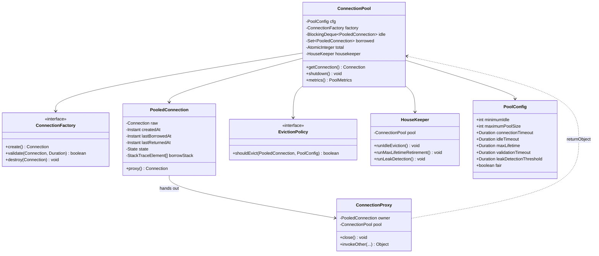
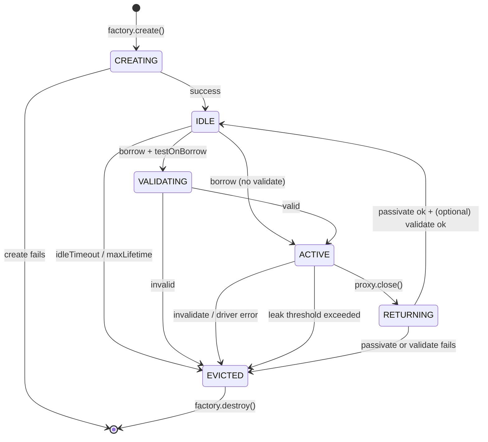

# Design Connection Pool

**Date:** 2026-05-02 | **Updated:** 2026-05-02
**Tags:** `low-level-design` `case-study` `data-structures` `concurrency` `resource-management`

## Summary

Design a thread-safe, bounded **connection pool** that brokers expensive, long-lived connections (typically JDBC, but the design generalizes to HTTP/2 channels, AMQP, gRPC) between many short-lived borrowers. The pool must: cap concurrent connections, hand out healthy ones quickly, time out callers when saturated, evict stale ones, and detect leaks.

This is the canonical case study for the [Object Pool](../../design-patterns/creational/object-pool.md) pattern. We focus on the *operational* concerns that distinguish a toy pool from a production-grade one: validation strategy, lifecycle states, blocking/fairness semantics, and instrumentation.

Reference implementations to study (by name only — do not invent internals): **HikariCP**, **Apache Commons DBCP** (built on Apache Commons Pool 2), and **C3P0**.

## Table of Contents

- [Intent / Requirements](#intent--requirements)
- [Structure / Entities and Relationships](#structure--entities-and-relationships)
- [Connection Lifecycle](#connection-lifecycle)
- [Class Skeletons (Java)](#class-skeletons-java)
- [Key Algorithms / Workflows](#key-algorithms--workflows)
- [Patterns Used](#patterns-used)
- [Concurrency Considerations](#concurrency-considerations)
- [Trade-offs and Extensions](#trade-offs-and-extensions)
- [Related](#related)
- [References](#references)

## Intent / Requirements

**Functional**:
1. `getConnection()` returns a healthy connection or throws after `connectionTimeout` (a.k.a. `maxWait`).
2. Returned connection's `close()` releases it back to the pool — the borrower never sees the raw driver connection.
3. Pool size is bounded by `[minimumIdle, maximumPoolSize]`.
4. Stale idle connections are evicted after `idleTimeout`; very old connections are retired after `maxLifetime` regardless of activity.
5. Optional validation query (e.g., `SELECT 1` or JDBC `Connection.isValid(timeout)`) confirms liveness on borrow / while idle.
6. Leaks (borrowed but not returned within `leakDetectionThreshold`) are logged with the borrow stack trace.

**Non-functional**:
- Borrow on a warm pool: sub-millisecond, no per-call allocation if possible.
- No deadlock between application threads and the eviction / housekeeping thread.
- Bounded memory: no unlimited waiter queues that mask pathological saturation.
- Observable: gauges for `active`, `idle`, `waiting`, counters for `creates`, `destroys`, `timeouts`, histogram for `borrow_wait`.

**Out of scope**:
- Sharding by tenant or shard key (composable on top — see [Trade-offs](#trade-offs-and-extensions)).
- Read/write splitting; multi-master failover. A pool front-ends *one* logical endpoint.

## Structure / Entities and Relationships



## Connection Lifecycle



States are observable; transitions are owned by the pool. Application code only sees the proxy, which only exposes `Connection`'s public API.

## Class Skeletons (Java)

```java
public interface ConnectionFactory {
    Connection create() throws SQLException;
    boolean validate(Connection c, Duration timeout);
    void destroy(Connection c);
}

public final class PoolConfig {
    public final int minimumIdle;
    public final int maximumPoolSize;
    public final Duration connectionTimeout;     // e.g. 30s
    public final Duration idleTimeout;            // e.g. 10m
    public final Duration maxLifetime;            // e.g. 30m
    public final Duration validationTimeout;      // e.g. 5s
    public final Duration leakDetectionThreshold; // 0 = off
    public final boolean fair;
    // builder + invariants: minimumIdle <= maximumPoolSize, etc.
}

final class PooledConnection {
    final Connection raw;
    final Instant createdAt;
    volatile Instant lastBorrowedAt;
    volatile Instant lastReturnedAt;
    volatile State state;
    volatile StackTraceElement[] borrowStack;

    PooledConnection(Connection raw) {
        this.raw = raw;
        this.createdAt = Instant.now();
        this.state = State.IDLE;
    }
    enum State { IDLE, VALIDATING, ACTIVE, RETURNING, EVICTED }
}

public class ConnectionPool implements AutoCloseable {
    private final PoolConfig cfg;
    private final ConnectionFactory factory;
    private final BlockingDeque<PooledConnection> idle;
    private final Set<PooledConnection> borrowed = ConcurrentHashMap.newKeySet();
    private final AtomicInteger total = new AtomicInteger();
    private final ScheduledExecutorService housekeeper;
    private volatile boolean closed;

    public ConnectionPool(PoolConfig cfg, ConnectionFactory factory) {
        this.cfg = cfg;
        this.factory = factory;
        this.idle = new LinkedBlockingDeque<>(cfg.maximumPoolSize);
        this.housekeeper = Executors.newScheduledThreadPool(1, r -> {
            Thread t = new Thread(r, "pool-housekeeper");
            t.setDaemon(true);
            return t;
        });
        scheduleHousekeeping();
        prefill(cfg.minimumIdle);
    }

    public Connection getConnection() throws SQLException, InterruptedException {
        if (closed) throw new SQLException("pool closed");
        long deadline = System.nanoTime() + cfg.connectionTimeout.toNanos();
        for (;;) {
            PooledConnection pc = idle.pollFirst();
            if (pc == null) {
                if (tryGrow()) continue;
                long wait = deadline - System.nanoTime();
                if (wait <= 0) throw new SQLTimeoutException("connection timeout");
                pc = idle.pollFirst(wait, TimeUnit.NANOSECONDS);
                if (pc == null) throw new SQLTimeoutException("connection timeout");
            }
            pc.state = State.VALIDATING;
            if (!factory.validate(pc.raw, cfg.validationTimeout)) {
                discard(pc);
                continue;
            }
            pc.state = State.ACTIVE;
            pc.lastBorrowedAt = Instant.now();
            if (cfg.leakDetectionThreshold.toMillis() > 0) {
                pc.borrowStack = Thread.currentThread().getStackTrace();
            }
            borrowed.add(pc);
            return ConnectionProxy.wrap(pc, this);
        }
    }

    void returnConnection(PooledConnection pc) {
        if (!borrowed.remove(pc)) return; // foreign or double return
        pc.state = State.RETURNING;
        try {
            // passivate: rollback open tx, reset autoCommit/readOnly/catalog/schema/network timeout
            resetState(pc.raw);
        } catch (SQLException e) {
            discard(pc);
            return;
        }
        pc.lastReturnedAt = Instant.now();
        pc.borrowStack = null;
        if (closed || isBeyondMaxLifetime(pc) || !idle.offerFirst(pc)) {
            discard(pc);
        } else {
            pc.state = State.IDLE;
        }
    }

    void invalidate(PooledConnection pc) {
        if (borrowed.remove(pc)) discard(pc);
    }

    private boolean tryGrow() {
        int cur;
        do {
            cur = total.get();
            if (cur >= cfg.maximumPoolSize) return false;
        } while (!total.compareAndSet(cur, cur + 1));
        try {
            PooledConnection pc = new PooledConnection(factory.create());
            idle.offerFirst(pc);
            return true;
        } catch (SQLException e) {
            total.decrementAndGet();
            return false;
        }
    }

    private void discard(PooledConnection pc) {
        pc.state = State.EVICTED;
        total.decrementAndGet();
        factory.destroy(pc.raw);
    }

    private boolean isBeyondMaxLifetime(PooledConnection pc) {
        return Duration.between(pc.createdAt, Instant.now()).compareTo(cfg.maxLifetime) >= 0;
    }

    private void scheduleHousekeeping() {
        housekeeper.scheduleAtFixedRate(this::evictIdleAndAged, 30, 30, TimeUnit.SECONDS);
        if (cfg.leakDetectionThreshold.toMillis() > 0) {
            housekeeper.scheduleAtFixedRate(this::scanLeaks, 10, 10, TimeUnit.SECONDS);
        }
    }

    private void evictIdleAndAged() {
        Instant now = Instant.now();
        idle.removeIf(pc -> {
            if (idle.size() <= cfg.minimumIdle) return false;
            boolean idleExpired = pc.lastReturnedAt != null
                && Duration.between(pc.lastReturnedAt, now).compareTo(cfg.idleTimeout) >= 0;
            boolean aged = isBeyondMaxLifetime(pc);
            if (idleExpired || aged) { discard(pc); return true; }
            return false;
        });
    }

    private void scanLeaks() {
        Instant cutoff = Instant.now().minus(cfg.leakDetectionThreshold);
        for (PooledConnection pc : borrowed) {
            if (pc.lastBorrowedAt != null && pc.lastBorrowedAt.isBefore(cutoff)) {
                Logger.getLogger("pool")
                    .warning("Possible connection leak. Borrowed at: "
                        + Arrays.toString(pc.borrowStack));
            }
        }
    }

    private void resetState(Connection c) throws SQLException {
        if (!c.getAutoCommit()) c.rollback();
        c.setAutoCommit(true);
        c.clearWarnings();
    }

    private void prefill(int n) {
        for (int i = 0; i < n; i++) tryGrow();
    }

    @Override public void close() {
        closed = true;
        housekeeper.shutdownNow();
        idle.forEach(this::discard);
        idle.clear();
        borrowed.forEach(this::discard);
        borrowed.clear();
    }
}

// Proxy intercepts close() so callers can use try-with-resources naturally.
final class ConnectionProxy implements InvocationHandler {
    private final PooledConnection owner;
    private final ConnectionPool pool;
    private boolean closed;

    static Connection wrap(PooledConnection pc, ConnectionPool pool) {
        return (Connection) Proxy.newProxyInstance(
            Connection.class.getClassLoader(),
            new Class<?>[]{Connection.class},
            new ConnectionProxy(pc, pool));
    }

    private ConnectionProxy(PooledConnection pc, ConnectionPool pool) {
        this.owner = pc;
        this.pool = pool;
    }

    @Override public Object invoke(Object self, Method m, Object[] args) throws Throwable {
        if ("close".equals(m.getName())) {
            if (!closed) { closed = true; pool.returnConnection(owner); }
            return null;
        }
        if (closed) throw new SQLException("connection is closed");
        try {
            return m.invoke(owner.raw, args);
        } catch (InvocationTargetException e) {
            // Driver-level errors that signal a dead connection should invalidate.
            if (isFatal(e.getCause())) pool.invalidate(owner);
            throw e.getCause();
        }
    }

    private static boolean isFatal(Throwable t) {
        return t instanceof SQLNonTransientConnectionException
            || t instanceof SQLRecoverableException;
    }
}
```

## Key Algorithms / Workflows

**Borrow path** (the hot path):
1. Try non-blocking `pollFirst` from the idle deque. LIFO keeps the working set warm and cold ones aging.
2. If empty and `total < maximumPoolSize`, race to create a new connection (CAS on `total`). On creation failure, decrement and retry.
3. Otherwise, time-bounded `pollFirst(deadline)`.
4. Validate (HikariCP defers to driver-level `Connection.isValid(timeout)`; older pools may issue a `SELECT 1`). Validation cost matters — running it on every borrow is wasteful for healthy networks. **Test on borrow** when the network is unstable; **test while idle** in steady state.
5. Mark `ACTIVE`, capture leak stack if enabled, and hand out the proxy.

**Return path**: passivation must reset every connection setting that the borrower might have changed: `autoCommit`, `transactionIsolation`, `readOnly`, `catalog`, `schema`, `networkTimeout`, `clientInfo`, `typeMap`. Forgetting any of these is the most common source of "spooky action at a distance" bugs.

**Idle eviction**: every 30s, scan idle entries; destroy any that exceed `idleTimeout` *or* `maxLifetime`, while honoring `minimumIdle`. `maxLifetime` is the safety net against backend-side connection killers (DB `wait_timeout`, load balancer idle close, certificate rotation).

**Leak detection**: a separate cadence (every 10s) walks the `borrowed` set and flags entries borrowed longer than `leakDetectionThreshold`. The recorded stack trace from `getConnection` is what makes the alert actionable.

## Patterns Used

- [**Object Pool**](../../design-patterns/creational/object-pool.md) — the structural pattern this case study realizes.
- **Factory** — `ConnectionFactory` decouples driver specifics (URL, properties, init SQL) from pool mechanics.
- **Proxy** — `ConnectionProxy` intercepts `close()` to redirect to `returnConnection`, enabling try-with-resources without leaking the raw driver handle.
- **Strategy** — `EvictionPolicy` (idle / aged / custom) is pluggable.
- **Template Method** — borrow/return are templated; validation and reset are hooks.
- **Observer / Telemetry** — metrics gauges and counters for active/idle/waiting/wait-time.

## Concurrency Considerations

- **Idle deque** is `LinkedBlockingDeque`. LIFO-on-borrow plus FIFO-on-eviction recycles warm connections fastest while culling cold ones.
- **`AtomicInteger total`** with CAS prevents racing borrowers from overshooting `maximumPoolSize`.
- **Borrowed set** is `ConcurrentHashMap.newKeySet()` so the leak scanner iterates without blocking borrow/return.
- **Fairness**: default deque is unfair. For strict FIFO, gate borrow with `Semaphore(maxTotal, true)`; expect ~10–20% throughput cost under contention.
- **Never hold a pool mutex across driver I/O.** Validation runs after the connection is logically owned by the borrowing thread.
- **Shutdown**: set `closed`, stop the housekeeper, drain idle then borrowed. New borrowers get fast `SQLException` instead of blocking forever.
- **HikariCP's `ConcurrentBag`** replaces the deque with a hand-rolled, lock-free, thread-local-aware structure. Cited for completeness — do not reimplement without measurement.

## Trade-offs and Extensions

**Sizing**: Smaller is usually better. The DB has finite parallelism (CPU + spindles); pool capacity beyond that just queues work *inside* the DB. HikariCP's heuristic: `connections = ((core_count * 2) + effective_spindle_count)`. `minimumIdle = 0` with `idleTimeout = 600s` keeps cold environments cheap; pre-warm only when steady-state traffic justifies it.

**Validation strategy**: `testOnBorrow=true` is safe but adds a round-trip per borrow. HikariCP relies on `Connection.isValid` plus aggressive `maxLifetime` retirement and discourages per-borrow `SELECT 1`. Apache Commons DBCP defaults to `testOnBorrow=false` but offers `validationQuery` and `testWhileIdle` for stability-over-speed deployments.

**Multi-tenant / sharded**: Wrap N pools behind a shard router. One giant pool mixing tenants lets noisy neighbors monopolize `maxTotal`. For per-tenant fairness, a token bucket in front of `getConnection` works better than sub-pools when traffic is bursty.

**Failover**: `maxLifetime` ensures stale connections retire within a bounded window after a primary switch or replica failover. Belt-and-suspenders: drain explicitly on driver-reported topology change.

**Anti-patterns**:
- **Unbounded waiter queue.** Always set `connectionTimeout`; a pool that blocks forever becomes a thread-pool-exhaustion incident.
- **Thread-local connection across requests.** Defeats validation and leak detection.
- **Calling pool internals from a `Connection` listener.** Re-entry deadlock.

**Extensions**: async API (`CompletableFuture<Connection>`) for reactive stacks (R2DBC); per-statement caches co-located with the connection lifetime; circuit breaker on the create path so a downed DB does not retry-storm during recovery.

## Related

- Underlying pattern: [`../../design-patterns/creational/object-pool.md`](../../design-patterns/creational/object-pool.md)
- Sibling concurrency mechanism: [`../../design-patterns/additional/thread-pool-pattern.md`](../../design-patterns/additional/thread-pool-pattern.md)
- Other data-structure case studies in this directory:
  - [`./design-lru-cache.md`](./design-lru-cache.md)
  - [`./design-lru-cache.md`](./design-lru-cache.md)
  - [`../../design-patterns/additional/producer-consumer-pattern.md`](../../design-patterns/additional/producer-consumer-pattern.md)
- Resource lifetime idiom: [`../../interview-method/object-lifecycle-and-resource-management.md`](../../interview-method/object-lifecycle-and-resource-management.md)

## References

- HikariCP — Brett Wooldridge. README, wiki on pool sizing, `ConcurrentBag` design notes.
- Apache Commons Pool 2 and Apache Commons DBCP — `org.apache.commons.pool2`, `org.apache.commons.dbcp2`.
- C3P0 — Steve Waldman. Older JDBC connection pool, useful for historical context.
- Java SE — `java.sql.Connection`, `java.util.concurrent.BlockingDeque`, `LinkedBlockingDeque`, `Semaphore`, `ScheduledExecutorService`.
- Goetz et al. — *Java Concurrency in Practice*, chapters on bounded resource management and producer-consumer queues.
- PostgreSQL and MySQL reference manuals — `max_connections`, `wait_timeout`, server-side connection lifecycle.
