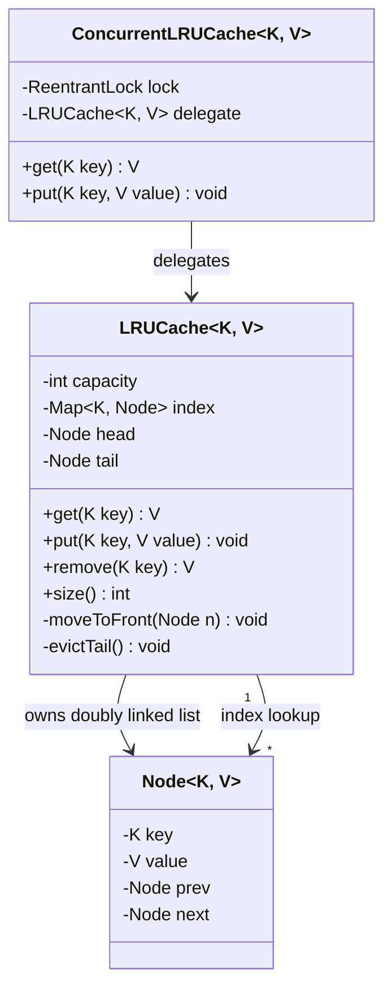

# Design LRU Cache

**Date:** 2026-05-02 | **Updated:** 2026-05-02
**Tags:** `low-level-design` `case-study` `data-structures` `cache` `concurrency`

## Summary

The Least Recently Used (LRU) cache is the canonical bounded in-memory cache. It enforces a fixed
capacity and evicts the entry that has not been accessed for the longest time when the cache is
full. The classical implementation pairs a hash map with a doubly-linked list, giving **O(1)**
`get` and `put`. This case study walks through the data structures, the API contract, the
eviction algorithm, and a thread-safe variant suitable for production. Java's `LinkedHashMap`
ships an accessOrder mode that turns it into a one-class LRU; we cover it as a baseline before
designing from primitives.

## Table of Contents

- [Requirements](#requirements)
- [Entities and Relationships](#entities-and-relationships)
- [Class Skeletons](#class-skeletons)
- [Key Algorithms](#key-algorithms)
- [Patterns Used](#patterns-used)
- [Concurrency Considerations](#concurrency-considerations)
- [Trade-offs and Extensions](#trade-offs-and-extensions)
- [Related](#related)
- [References](#references)

## Requirements

### Functional

- `get(key)` returns the value if present and marks it most-recently-used; otherwise returns a
  miss sentinel (null, `Optional.empty`, or a tombstone).
- `put(key, value)` inserts or updates the entry and marks it most-recently-used.
- When inserting causes `size > capacity`, evict the least-recently-used entry.
- `remove(key)` removes the entry and unlinks the node.
- Optional: `size()`, `containsKey(key)`, `clear()`.

### Non-functional

- O(1) amortized for `get`, `put`, `remove`.
- Bounded memory: O(capacity) entries plus per-entry overhead.
- Predictable: no resize storms, no GC spikes for stable workloads.
- Optional: thread-safe variant with bounded contention.

### Out of scope

- Time-based expiry (TTL) — see `extensions`.
- Weight-based eviction (varied entry sizes) — see Caffeine and Guava.
- Distributed coherence — that is an HLD concern, not LLD.

## Entities and Relationships



The doubly-linked list is the recency timeline. The hash map is the O(1) lookup index. Both refer
to the same `Node`, so promotion is pointer surgery, not data movement.

## Class Skeletons

### Java — from primitives

```java
public final class LRUCache<K, V> {

    private static final class Node<K, V> {
        final K key;
        V value;
        Node<K, V> prev;
        Node<K, V> next;

        Node(K key, V value) {
            this.key = key;
            this.value = value;
        }
    }

    private final int capacity;
    private final Map<K, Node<K, V>> index;
    private final Node<K, V> head; // sentinel: most-recent side
    private final Node<K, V> tail; // sentinel: least-recent side

    public LRUCache(int capacity) {
        if (capacity <= 0) {
            throw new IllegalArgumentException("capacity must be > 0");
        }
        this.capacity = capacity;
        this.index = new HashMap<>(capacity * 4 / 3 + 1);
        this.head = new Node<>(null, null);
        this.tail = new Node<>(null, null);
        this.head.next = this.tail;
        this.tail.prev = this.head;
    }

    public V get(K key) {
        Node<K, V> node = index.get(key);
        if (node == null) {
            return null;
        }
        moveToFront(node);
        return node.value;
    }

    public void put(K key, V value) {
        Node<K, V> existing = index.get(key);
        if (existing != null) {
            existing.value = value;
            moveToFront(existing);
            return;
        }
        Node<K, V> node = new Node<>(key, value);
        index.put(key, node);
        linkAfterHead(node);
        if (index.size() > capacity) {
            evictTail();
        }
    }

    public V remove(K key) {
        Node<K, V> node = index.remove(key);
        if (node == null) {
            return null;
        }
        unlink(node);
        return node.value;
    }

    public int size() {
        return index.size();
    }

    private void moveToFront(Node<K, V> node) {
        unlink(node);
        linkAfterHead(node);
    }

    private void linkAfterHead(Node<K, V> node) {
        node.prev = head;
        node.next = head.next;
        head.next.prev = node;
        head.next = node;
    }

    private void unlink(Node<K, V> node) {
        node.prev.next = node.next;
        node.next.prev = node.prev;
        node.prev = null;
        node.next = null;
    }

    private void evictTail() {
        Node<K, V> lru = tail.prev;
        if (lru == head) {
            return;
        }
        index.remove(lru.key);
        unlink(lru);
    }
}
```

### Java — `LinkedHashMap` baseline

`java.util.LinkedHashMap` accepts an `accessOrder` flag in its constructor. With `true`, every
`get` reorders the entry to the tail, giving exactly LRU semantics. Override
`removeEldestEntry` to enforce the bound.

```java
public final class LinkedHashMapLRU<K, V> extends LinkedHashMap<K, V> {

    private final int capacity;

    public LinkedHashMapLRU(int capacity) {
        super(capacity, 0.75f, true); // accessOrder = true
        this.capacity = capacity;
    }

    @Override
    protected boolean removeEldestEntry(Map.Entry<K, V> eldest) {
        return size() > capacity;
    }
}
```

This is the right answer for most non-concurrent use cases. Reach for the doubly-linked-list
implementation when you need a custom eviction predicate, want to expose internal nodes (for
TTL, weights, secondary indexes), or need to instrument hit/miss timing precisely.

### TypeScript — sketch

```typescript
class LRUCache<K, V> {
  private readonly capacity: number;
  private readonly index = new Map<K, V>();

  constructor(capacity: number) {
    if (capacity <= 0) throw new Error("capacity must be > 0");
    this.capacity = capacity;
  }

  get(key: K): V | undefined {
    if (!this.index.has(key)) return undefined;
    const value = this.index.get(key) as V;
    this.index.delete(key);
    this.index.set(key, value); // re-insert -> tail = MRU
    return value;
  }

  put(key: K, value: V): void {
    if (this.index.has(key)) this.index.delete(key);
    else if (this.index.size >= this.capacity) {
      const oldest = this.index.keys().next().value as K;
      this.index.delete(oldest);
    }
    this.index.set(key, value);
  }
}
```

JS `Map` preserves insertion order, so re-inserting on `get` is sufficient — no separate list.

## Key Algorithms

### get(key)

1. Look up the node in `index`. If absent, return miss.
2. Unlink the node from its current position.
3. Link it directly after the `head` sentinel.
4. Return the value.

All steps are O(1).

### put(key, value)

1. If the key exists: update the value, move the node to the front.
2. Otherwise: allocate a new node, insert it after `head`, register it in `index`.
3. If `size > capacity`: walk to `tail.prev` and evict.

### evictTail()

1. Read the node before `tail` (the LRU candidate).
2. Remove it from the `index`.
3. Unlink it from the list.

### Why doubly-linked, not singly?

Singly-linked lists make removal O(n) because we cannot know the predecessor of a node without a
scan. The doubly-linked layout means promotion and eviction are constant-time pointer rewires.

## Patterns Used

- **Composition over inheritance:** `ConcurrentLRUCache` wraps a `LRUCache` instead of extending
  it. The base class stays single-threaded and easy to reason about.
- **Sentinel nodes:** `head` and `tail` sentinels eliminate null checks at the list boundary.
  Insertion and removal share one code path.
- **Index + ordered structure:** the same dual-structure pattern shows up in OrderedDict in
  Python, `LinkedHashMap` in Java, and ordered sets in Redis.
- **Strategy:** swap the eviction policy (LRU, LFU, FIFO, ARC) by changing the recency
  bookkeeping while keeping the index lookup intact.

## Concurrency Considerations

The base class is not thread-safe. Two readers calling `get` concurrently both rewire the linked
list and corrupt it. Three viable strategies, in order of growing sophistication:

### 1. Coarse lock — `synchronized` or `ReentrantLock`

Wrap every public method in a single lock. Easiest to reason about. Fine for moderate traffic
or where the cache is not on the hot path.

```java
public final class ConcurrentLRUCache<K, V> {

    private final LRUCache<K, V> delegate;
    private final ReentrantLock lock = new ReentrantLock();

    public ConcurrentLRUCache(int capacity) {
        this.delegate = new LRUCache<>(capacity);
    }

    public V get(K key) {
        lock.lock();
        try {
            return delegate.get(key);
        } finally {
            lock.unlock();
        }
    }

    public void put(K key, V value) {
        lock.lock();
        try {
            delegate.put(key, value);
        } finally {
            lock.unlock();
        }
    }
}
```

Even reads acquire the write lock because `get` mutates the recency list. A `ReadWriteLock`
gives no advantage here.

### 2. Striped locks

Hash the key to one of N internal segments, each with its own lock and its own LRU substructure.
This is what `ConcurrentHashMap` did before Java 8. Throughput scales close to N for uniform
key distributions. The downside: per-segment capacity has to be chosen, and the global LRU
ordering is lost — eviction is per-stripe.

### 3. Concurrent map + sloppy recency

Production caches like **Caffeine** keep the main store in a `ConcurrentHashMap` and queue
recency events in per-thread ring buffers that drain asynchronously into the eviction policy.
Reads stay lock-free; recency updates are best-effort. This is the right model when the cache
is hot enough that the lock itself is the bottleneck.

For interviews, name the three options, pick the simplest one that meets the requirement, and
flag where you would graduate to the next tier.

### Memory model notes

- Without a happens-before edge, a thread reading `node.value` after another thread updates it
  may see a stale value. The lock provides that edge.
- `Node.value` could be `volatile` to allow lock-free reads of the value while still locking
  for structural changes — but mixing is error-prone; keep it locked unless you have a
  benchmark proving the optimization is worth it.

## Trade-offs and Extensions

### Trade-offs

- **Memory overhead:** every entry pays for a hash map node plus two linked-list pointers. For
  small values, the overhead can exceed the payload.
- **Hash collisions:** `HashMap` worst case degrades to O(log n) since Java 8 (treeified bins),
  but pathological keys still hurt.
- **Cold start:** an empty LRU cache has a high miss rate. Consider warming with the prior
  generation's hot set on deploy.

### Extensions

- **TTL:** add an `expiresAt` field to `Node`. On `get`, if expired, evict and return miss.
  A separate min-heap or timing wheel can drive proactive expiry.
- **Weights:** allow per-entry weight, evict until total weight ≤ capacity. Caffeine and Guava
  expose this.
- **LFU / W-TinyLFU:** Caffeine's default policy. Track access frequency in a sketch (Count-Min)
  and combine with a small LRU window. Empirically beats LRU on most realistic workloads.
- **Hierarchical:** L1 in-process LRU, L2 distributed cache (Redis), L3 origin. The LLD here is
  L1; L2/L3 belong in the system-design tier.
- **Observability:** expose hit ratio, eviction count, average key age. These metrics are how
  you know the capacity is right.

## Related

- [Design Bloom Filter](./design-bloom-filter.md) — companion sibling on space-efficient
  membership; often used in front of an LRU to decide whether to even attempt the lookup.
- [Design Search Autocomplete](./design-search-autocomplete.md) — uses an LRU for the per-prefix
  top-K cache.
- [Design Simple Search Engine](./design-simple-search-engine.md) — uses an LRU for the
  posting-list page cache.
- [../../design-patterns/behavioral/strategy.md](../../design-patterns/behavioral/strategy.md) — eviction policies as
  pluggable strategies.
- [../../design-patterns/structural/decorator.md](../../design-patterns/structural/decorator.md) — the
  `ConcurrentLRUCache` wrapper is a thread-safety decorator.

## References

- Java SE API: `java.util.LinkedHashMap`, particularly the `(int, float, boolean accessOrder)`
  constructor and `removeEldestEntry`.
- Caffeine — high-performance Java caching library by Ben Manes.
- Guava `CacheBuilder` — Google's earlier in-process cache.
- "An O(1) algorithms for implementing the LFU cache eviction scheme" by Shah, Mitra, and
  Matani — for the LFU sibling.
- LeetCode 146: LRU Cache — the canonical interview formulation.
