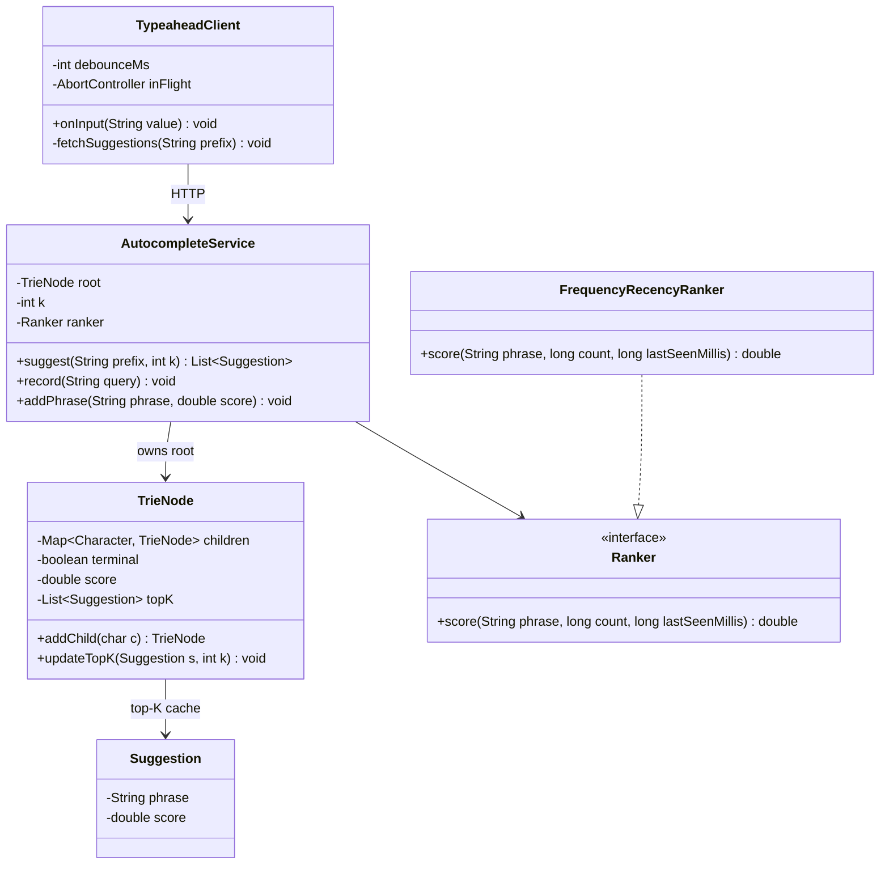

# Design Search Autocomplete

**Date:** 2026-05-02 | **Updated:** 2026-05-02
**Tags:** `low-level-design` `case-study` `data-structures` `trie` `search`

## Summary

Search autocomplete (a.k.a. typeahead, prefix suggestion) returns the top-K most likely
completions for a partial query as the user types. The core data structure is a **trie**, where
each node represents a prefix and edges represent characters. To make completion O(prefix-length
+ K), each node caches its **top-K most popular completions**. The client side debounces input
and issues asynchronous requests; the server side serves the cached top-K.

This case study covers the LLD: trie node layout, top-K maintenance, ranking, and the
client/server interaction. The companion HLD — sharding by prefix, log ingestion, A/B ranking,
spell correction — lives in the system-design tier.

## Table of Contents

- [Requirements](#requirements)
- [Entities and Relationships](#entities-and-relationships)
- [Class Skeletons](#class-skeletons)
- [Key Algorithms](#key-algorithms)
- [Patterns Used](#patterns-used)
- [Concurrency Considerations](#concurrency-considerations)
- [Trade-offs and Extensions](#trade-offs-and-extensions)
- [Related](#related)
- [References](#references)

## Requirements

### Functional

- `suggest(prefix, k)` returns up to k completions ranked by score.
- `record(query)` records a completed search to update popularity.
- Optional: `addPhrase(phrase, score)` for cold-start curated phrases.
- Multi-byte safe (UTF-8 / Unicode code points, not raw bytes).

### Non-functional

- p99 server latency < 50 ms for the suggestion request.
- Client perceives < 100 ms end-to-end including network.
- Top-K is updated asynchronously; staleness on the order of seconds is acceptable.
- Memory: a few GB per shard for ~10M phrases is realistic.

### Out of scope (here)

- Sharding, replication, fan-out — HLD concerns.
- Personalization (user-specific re-ranking) — covered briefly in extensions.
- Spell correction (BK-trees, edit distance) — extensions.

## Entities and Relationships



## Class Skeletons

### Java — server side

```java
public final class TrieNode {

    private final Map<Character, TrieNode> children = new HashMap<>();
    private boolean terminal;
    private double score;
    private List<Suggestion> topK = List.of();

    TrieNode child(char c, boolean createIfAbsent) {
        if (createIfAbsent) {
            return children.computeIfAbsent(c, ignored -> new TrieNode());
        }
        return children.get(c);
    }

    boolean isTerminal() { return terminal; }
    void setTerminal(boolean t) { this.terminal = t; }
    double score() { return score; }
    void setScore(double s) { this.score = s; }
    List<Suggestion> topK() { return topK; }
    void setTopK(List<Suggestion> v) { this.topK = v; }
    Map<Character, TrieNode> children() { return children; }
}

public final class Suggestion implements Comparable<Suggestion> {
    final String phrase;
    final double score;

    public Suggestion(String phrase, double score) {
        this.phrase = phrase;
        this.score = score;
    }

    @Override public int compareTo(Suggestion other) {
        return Double.compare(other.score, this.score); // descending
    }
}

public interface Ranker {
    double score(String phrase, long count, long lastSeenMillis);
}

public final class FrequencyRecencyRanker implements Ranker {

    private static final double HALF_LIFE_DAYS = 14.0;
    private static final double LN2 = Math.log(2.0);

    @Override
    public double score(String phrase, long count, long lastSeenMillis) {
        long ageMillis = System.currentTimeMillis() - lastSeenMillis;
        double ageDays = ageMillis / (1000.0 * 60 * 60 * 24);
        double decay = Math.exp(-LN2 * ageDays / HALF_LIFE_DAYS);
        return Math.log1p(count) * decay;
    }
}

public final class AutocompleteService {

    private final TrieNode root = new TrieNode();
    private final int k;
    private final Ranker ranker;
    private final ConcurrentMap<String, PhraseStat> stats = new ConcurrentHashMap<>();

    public AutocompleteService(int k, Ranker ranker) {
        this.k = k;
        this.ranker = ranker;
    }

    public void addPhrase(String phrase, double score) {
        TrieNode node = root;
        for (int i = 0; i < phrase.length(); i++) {
            node = node.child(phrase.charAt(i), true);
        }
        node.setTerminal(true);
        node.setScore(score);
        propagateTopK(phrase, score);
    }

    public void record(String query) {
        PhraseStat stat = stats.computeIfAbsent(query, q -> new PhraseStat());
        stat.count.incrementAndGet();
        stat.lastSeenMillis = System.currentTimeMillis();
        double score = ranker.score(query, stat.count.get(), stat.lastSeenMillis);
        addPhrase(query, score);
    }

    public List<Suggestion> suggest(String prefix, int requested) {
        TrieNode node = root;
        for (int i = 0; i < prefix.length(); i++) {
            node = node.child(prefix.charAt(i), false);
            if (node == null) return List.of();
        }
        List<Suggestion> cached = node.topK();
        return cached.size() <= requested ? cached : cached.subList(0, requested);
    }

    private void propagateTopK(String phrase, double score) {
        Suggestion suggestion = new Suggestion(phrase, score);
        TrieNode node = root;
        mergeTopK(node, suggestion);
        for (int i = 0; i < phrase.length(); i++) {
            node = node.child(phrase.charAt(i), true);
            mergeTopK(node, suggestion);
        }
    }

    private void mergeTopK(TrieNode node, Suggestion s) {
        List<Suggestion> updated = new ArrayList<>(node.topK());
        updated.removeIf(x -> x.phrase.equals(s.phrase));
        updated.add(s);
        Collections.sort(updated);
        if (updated.size() > k) updated = updated.subList(0, k);
        node.setTopK(List.copyOf(updated));
    }

    private static final class PhraseStat {
        final AtomicLong count = new AtomicLong();
        volatile long lastSeenMillis;
    }
}
```

This is the read-optimized layout: every node along the phrase's path stores the phrase in its
top-K when warranted. `suggest` is then a flat traversal plus a list slice — no enumeration of
descendants.

### TypeScript — client side

```typescript
export class TypeaheadClient {
  private inFlight: AbortController | null = null;
  private timer: ReturnType<typeof setTimeout> | null = null;

  constructor(
    private readonly fetcher: (prefix: string, signal: AbortSignal) => Promise<Suggestion[]>,
    private readonly onResults: (prefix: string, results: Suggestion[]) => void,
    private readonly debounceMs: number = 80,
  ) {}

  onInput(value: string): void {
    if (this.timer) clearTimeout(this.timer);
    if (this.inFlight) this.inFlight.abort();

    const trimmed = value.trim();
    if (trimmed.length === 0) {
      this.onResults("", []);
      return;
    }

    this.timer = setTimeout(() => {
      this.inFlight = new AbortController();
      this.fetcher(trimmed, this.inFlight.signal)
        .then((results) => this.onResults(trimmed, results))
        .catch((err) => {
          if (err.name !== "AbortError") console.error(err);
        });
    }, this.debounceMs);
  }
}

interface Suggestion {
  phrase: string;
  score: number;
}
```

The client encodes three behaviors that matter for UX:

1. **Debounce** — wait `debounceMs` between keystrokes before issuing the request.
2. **Cancel in-flight** — abort the previous request; we only care about the latest prefix.
3. **Tag results** — pass back the prefix the results belong to so a stale response cannot
   overwrite a fresh one if it arrives late.

## Key Algorithms

### suggest(prefix, k)

1. Walk down the trie one character at a time. If any character is missing, return empty.
2. Read the node's cached `topK`.
3. Slice to the requested size.

Complexity: `O(|prefix| + k)`. Crucially, no descendant enumeration.

### record(query)

1. Update frequency and recency in `stats`.
2. Compute a new score with the ranker.
3. Walk the trie path for `query`, merging the new score into each node's top-K.

Complexity: `O(|query| · k log k)`. The factor `k` is small (usually 5–10), so this is acceptable
on the write path.

### Top-K maintenance

Each node holds a sorted list of size ≤ k. Two strategies:

- **In-place merge** (shown above): copy, dedupe, sort, slice. Simple, correct, slightly
  wasteful.
- **Min-heap of size k**: insert if heap size < k or new score > heap.peek. O(log k) per merge.
  Worth it only for very high write throughput.

### Ranking

The ranker shown combines frequency and recency:

```
score = ln(1 + count) * exp(-ln(2) * ageDays / halfLifeDays)
```

`ln(1 + count)` damps runaway popularity; the exponential decay favors recent surges. The
half-life is a tuning knob — 14 days is a reasonable starting point for a general-purpose query
log, shorter for trending news, longer for evergreen entities.

Production rankers extend this with: location, device, user history, time of day, query
language, and a learned re-ranker on top.

## Patterns Used

- **Trie (prefix tree):** the obvious structural choice; every prefix maps to exactly one node.
- **Strategy:** `Ranker` interface lets us swap scoring without touching the trie.
- **Cache (read-through):** the per-node `topK` is a precomputed answer to all queries that
  could ever land at that node.
- **Debounce + cancel** on the client: a textbook pattern for any rapidly-changing input that
  triggers network requests.
- **CQRS-lite:** writes (`record`) and reads (`suggest`) use the same structure but distinct
  paths and tuning. In a real system they often run on separate hosts entirely.

## Concurrency Considerations

### Reads dominate

`suggest` outnumbers `record` by orders of magnitude. The trie should be optimized for
concurrent lock-free reads.

### Strategy 1: copy-on-write per node

Nodes hold `List<Suggestion>` as an immutable reference. `mergeTopK` builds a new list and
volatile-publishes it. Readers see either the old or new list, never a torn write. Java's
`List.copyOf` is sufficient.

This is the layout the skeleton above uses. The `volatile`-equivalent is provided by the
`HashMap` reference write inside `computeIfAbsent` (when wrapped in a `ConcurrentHashMap`) or by
declaring `topK` as `volatile`.

### Strategy 2: rebuild offline

For very high write rates, push `record` events to a log (Kafka), aggregate them in batches, and
rebuild the affected sub-tries periodically. Hot-swap the root pointer atomically. Reads see a
consistent view; writes never block reads.

### Strategy 3: per-node lock

Stripe locks across nodes by hash of the prefix. Less concurrent than copy-on-write, but bounded
memory.

For an interview, copy-on-write per node is the right default answer. Mention the offline
rebuild for "what if writes are also high".

### Memory model hazards

- A reader that sees `topK = newList` must also see the writes that constructed `newList`.
  Publishing through a volatile field (or a `ConcurrentHashMap.put`) provides the
  happens-before edge.
- Do not mutate a published `topK` list. Always replace.

## Trade-offs and Extensions

### Trade-offs

- **Memory cost of caching top-K everywhere.** Storing the same phrase at every node along its
  path multiplies storage. For 10M phrases averaging length 20 with k=5, that is 1B Suggestion
  references. Compress phrases (interning, dictionary encoding) and cap the trie depth.
- **Stale top-K.** Asynchronous propagation means a brand-new viral query may not surface for
  seconds. Acceptable for autocomplete; not acceptable for, say, fraud detection.
- **Latin-only assumption.** Using `char` works only because Java strings are UTF-16. For CJK
  input, you typically index on Pinyin or romanized form in addition to the native script.

### Extensions

- **Ternary search trie** — lower memory than `Map<Character, TrieNode>` for sparse alphabets.
- **DAWG (directed acyclic word graph)** — share suffixes; good for static dictionaries.
- **Finite-state transducers** — Lucene's underlying structure for compact prefix indexes.
- **Personalization** — re-rank server top-K with a user-specific weight (e.g., favored
  categories, click-through history).
- **Spell correction** — fall back to a BK-tree on edit distance when the trie path is empty.
- **Sharding** — partition by first-2-character prefix; route queries to the right shard.
- **Cold-start curation** — seed the trie from a curated dictionary before any user traffic.

### Production references

- Elasticsearch's `completion` suggester uses an FST under the hood.
- Lucene's `AnalyzingSuggester` handles fuzzy matching.
- Twitter's typeahead.js (now legacy) was a canonical client-side library.

## Related

- [Design LRU Cache](./design-lru-cache.md) — the per-prefix top-K cache can itself be backed by
  an LRU when the trie is too large to keep entirely warm.
- [Design Bloom Filter](./design-bloom-filter.md) — short-circuit `suggest` for prefixes that
  are definitely cold.
- [Design Simple Search Engine](./design-simple-search-engine.md) — sibling: full-text search vs.
  prefix search.
- [../../design-patterns/behavioral/strategy.md](../../design-patterns/behavioral/strategy.md) — pluggable rankers.
- [../../../system-design/INDEX.md](../../../system-design/INDEX.md) — the HLD twin: sharded
  autocomplete service with log-based ingestion.

## References

- Aho, Hopcroft, Ullman, *The Design and Analysis of Computer Algorithms*, on tries.
- Edward Fredkin, *Trie Memory*, Communications of the ACM, 1960. The original trie paper.
- Lucene `AnalyzingSuggester` source — production-grade autocomplete engine.
- Elasticsearch documentation: completion suggester and context suggester.
- Mehryar Mohri et al., *Speech Recognition with Weighted Finite-State Transducers*, on FSTs.
