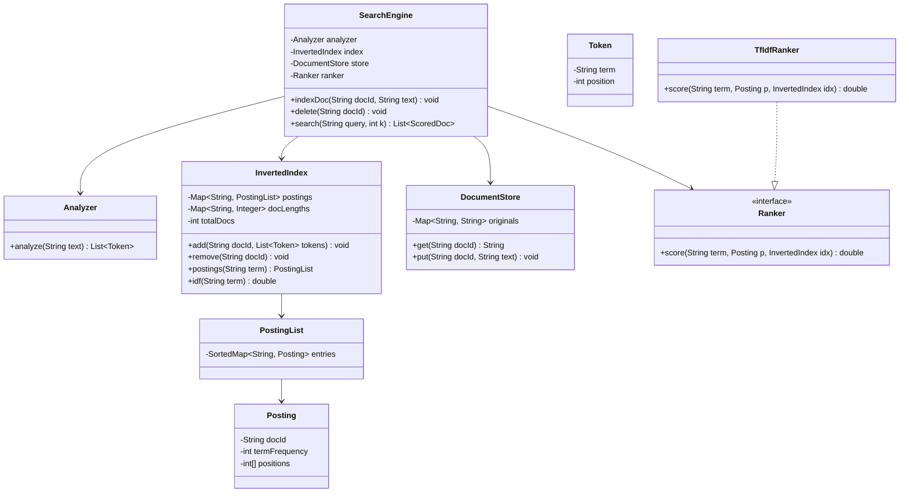

# Design Simple Search Engine

**Date:** 2026-05-02 | **Updated:** 2026-05-02
**Tags:** `low-level-design` `case-study` `data-structures` `search` `inverted-index`

## Summary

A simple full-text search engine takes a corpus of documents and a free-text query and returns
the most relevant documents, ranked. The four pillars are:

1. A **tokenizer / analyzer** that turns raw text into normalized terms.
2. An **inverted index** mapping each term to the set of documents that contain it, with
   per-document metadata (term frequency, positions).
3. A **document store** keyed by document ID for retrieval and snippet generation.
4. A **query parser + ranker** that interprets the query and orders results, classically by
   **TF-IDF** (term frequency × inverse document frequency).

This case study is the LLD core of any search system, from `grep -r` to Lucene to Elasticsearch.
The HLD layer — sharding, replication, distributed merge — sits in the system-design tier.

## Table of Contents

- [Requirements](#requirements)
- [Entities and Relationships](#entities-and-relationships)
- [Class Skeletons](#class-skeletons)
- [Key Algorithms](#key-algorithms)
- [Patterns Used](#patterns-used)
- [Concurrency Considerations](#concurrency-considerations)
- [Trade-offs and Extensions](#trade-offs-and-extensions)
- [Related](#related)
- [References](#references)

## Requirements

### Functional

- `index(docId, text)` — analyze and add a document to the index.
- `delete(docId)` — remove a document.
- `search(query, k)` — return the top-K documents, ranked by relevance.
- Boolean operators: AND (default), OR, NOT.
- Phrase queries (`"exact phrase"`) using positional information.
- Snippet generation around matched terms.

### Non-functional

- Ranked retrieval, not just boolean match.
- Index updates eventually visible to searches; small delay tolerable.
- p95 query latency below 100 ms for a single-machine corpus of ~1M documents.

### Out of scope (here)

- Sharding, replication, query fan-out — HLD.
- Spelling correction, query expansion — extensions.
- Vector / semantic retrieval — separate document.

## Entities and Relationships



## Class Skeletons

### Java — analyzer

```java
public final class StandardAnalyzer implements Analyzer {

    private static final Set<String> STOP_WORDS = Set.of(
        "a", "an", "the", "and", "or", "of", "to", "in", "on", "for"
    );

    @Override
    public List<Token> analyze(String text) {
        if (text == null || text.isEmpty()) return List.of();
        List<Token> tokens = new ArrayList<>();
        int position = 0;
        for (String raw : text.split("\\W+")) {
            if (raw.isEmpty()) continue;
            String normalized = raw.toLowerCase(Locale.ROOT);
            if (STOP_WORDS.contains(normalized)) {
                position++;
                continue;
            }
            tokens.add(new Token(normalized, position++));
        }
        return tokens;
    }
}
```

The analyzer pipeline is the most underrated part of search. Lucene's standard analyzer chains
character filters → tokenizer → token filters (lowercasing, stop words, stemming, synonyms).
Every analysis decision applied at index time must also be applied at query time, or the index
won't match.

### Java — inverted index

```java
public final class InvertedIndex {

    private final Map<String, PostingList> postings = new HashMap<>();
    private final Map<String, Integer> docLengths = new HashMap<>();
    private int totalDocs = 0;

    public void add(String docId, List<Token> tokens) {
        if (docLengths.containsKey(docId)) remove(docId);
        Map<String, List<Integer>> termPositions = new HashMap<>();
        for (Token token : tokens) {
            termPositions.computeIfAbsent(token.term(), k -> new ArrayList<>())
                          .add(token.position());
        }
        for (Map.Entry<String, List<Integer>> e : termPositions.entrySet()) {
            int[] positions = e.getValue().stream().mapToInt(Integer::intValue).toArray();
            Posting posting = new Posting(docId, positions.length, positions);
            postings.computeIfAbsent(e.getKey(), k -> new PostingList())
                    .upsert(posting);
        }
        docLengths.put(docId, tokens.size());
        totalDocs++;
    }

    public void remove(String docId) {
        if (!docLengths.containsKey(docId)) return;
        for (PostingList list : postings.values()) list.delete(docId);
        docLengths.remove(docId);
        totalDocs--;
    }

    public PostingList postings(String term) {
        return postings.getOrDefault(term, PostingList.EMPTY);
    }

    public double idf(String term) {
        int df = postings(term).size();
        if (df == 0) return 0.0;
        // Smoothed IDF: 1 + ln((N + 1) / (df + 1)) — avoids divide-by-zero, never negative.
        return 1.0 + Math.log((totalDocs + 1.0) / (df + 1.0));
    }

    public int totalDocs() { return totalDocs; }
    public int docLength(String docId) { return docLengths.getOrDefault(docId, 0); }
}
```

### Java — TF-IDF ranker

```java
public final class TfIdfRanker implements Ranker {

    @Override
    public double score(String term, Posting posting, InvertedIndex index) {
        int tf = posting.termFrequency();
        double normalizedTf = 1.0 + Math.log(tf); // sublinear scaling
        double idf = index.idf(term);
        return normalizedTf * idf;
    }
}
```

**TF-IDF**, popularized by Karen Spärck Jones in her 1972 paper *A statistical interpretation of
term specificity and its application in retrieval*, captures two intuitions in one formula:

- **TF (term frequency):** terms that appear often in a document are likely about that term.
- **IDF (inverse document frequency):** terms that appear in *every* document carry no signal.

The product `TF × IDF` highlights terms that are frequent in the document but rare in the
corpus. Variants (BM25, the de facto modern default) refine the saturation curve and add
length normalization, but the structural role is identical to vanilla TF-IDF.

### Java — query parser and engine

```java
public final class SimpleQueryParser {

    public static record Query(List<String> must, List<String> should,
                               List<String> mustNot, List<String> phrase) {}

    public Query parse(String input) {
        List<String> must = new ArrayList<>(), should = new ArrayList<>(),
                     mustNot = new ArrayList<>(), phrase = List.of();
        Matcher m = Pattern.compile("\"([^\"]+)\"").matcher(input);
        if (m.find()) {
            phrase = Arrays.stream(m.group(1).toLowerCase().split("\\W+"))
                           .filter(s -> !s.isEmpty()).toList();
            input = m.replaceAll("");
        }
        for (String token : input.split("\\s+")) {
            if (token.isEmpty()) continue;
            if (token.startsWith("-")) mustNot.add(token.substring(1).toLowerCase());
            else if (token.startsWith("+")) must.add(token.substring(1).toLowerCase());
            else should.add(token.toLowerCase());
        }
        return new Query(must, should, mustNot, phrase);
    }
}

public final class SearchEngine {
    private final Analyzer analyzer;
    private final InvertedIndex index;
    private final DocumentStore store;
    private final Ranker ranker;
    private final SimpleQueryParser parser = new SimpleQueryParser();

    public void indexDoc(String docId, String text) {
        index.add(docId, analyzer.analyze(text));
        store.put(docId, text);
    }

    public List<ScoredDoc> search(String queryText, int k) {
        SimpleQueryParser.Query q = parser.parse(queryText);
        Map<String, Double> scores = new HashMap<>();
        for (String t : q.should()) {
            for (Posting p : index.postings(t)) {
                scores.merge(p.docId(), ranker.score(t, p, index), Double::sum);
            }
        }
        for (String t : q.must()) scores.keySet().retainAll(index.postings(t).docIds());
        for (String t : q.mustNot()) index.postings(t).docIds().forEach(scores::remove);
        if (!q.phrase().isEmpty()) scores.keySet().retainAll(phraseMatch(q.phrase()));
        return scores.entrySet().stream()
            .sorted(Map.Entry.<String, Double>comparingByValue().reversed())
            .limit(k).map(e -> new ScoredDoc(e.getKey(), e.getValue())).toList();
    }

    private Set<String> phraseMatch(List<String> phrase) {
        Set<String> candidates = new HashSet<>(index.postings(phrase.get(0)).docIds());
        for (int i = 1; i < phrase.size(); i++) {
            candidates.retainAll(index.postings(phrase.get(i)).docIds());
        }
        Set<String> matches = new HashSet<>();
        for (String docId : candidates) {
            int[] anchors = index.postings(phrase.get(0)).positionsFor(docId);
            for (int start : anchors) {
                boolean ok = true;
                for (int i = 1; i < phrase.size() && ok; i++) {
                    int[] pos = index.postings(phrase.get(i)).positionsFor(docId);
                    if (Arrays.binarySearch(pos, start + i) < 0) ok = false;
                }
                if (ok) { matches.add(docId); break; }
            }
        }
        return matches;
    }
}
```

## Key Algorithms

### Indexing

1. Run the analyzer to obtain `Token(term, position)` records.
2. Group positions by term to compute term frequency per document.
3. For each `(term, postings)`, upsert a `Posting(docId, tf, positions[])` into the term's
   `PostingList`.
4. Track document length for length normalization.

Postings lists are kept sorted by `docId` so intersection operations (boolean AND) are linear in
the size of the smallest list — the same merge that backs Lucene since 1999.

### Boolean retrieval

- **AND** (`must`): intersect posting lists. Walk pointers in lockstep on the smallest pair
  first.
- **OR** (`should`): union, accumulating scores.
- **NOT** (`must_not`): subtract.

For 3+ terms, intersect smallest-to-largest. This is asymptotically optimal in the worst case.

### Phrase matching

Phrase queries require positional postings. After intersecting candidates by document, for each
candidate walk the first term's positions and check whether each subsequent phrase term has a
position at `anchor + i`. Sorted positions and binary search keep this O((|phrase| · log P) per
candidate.

### Scoring with TF-IDF

For each query term `t` and each matching document `d`:

```
score(t, d) = (1 + ln(tf(t, d))) * (1 + ln((N + 1) / (df(t) + 1)))
```

The document's total score is the sum over query terms. Sublinear TF prevents term-stuffing.
Smoothed IDF prevents divide-by-zero and keeps the value non-negative. The modern successor —
**Okapi BM25** — adds saturation in TF and length normalization but the LLD structure is
identical.

### Top-K selection

Do not sort the full result set — use a min-heap of size K. For 1M candidate documents and
K = 10, that is `O(N log K)` instead of `O(N log N)`.

## Patterns Used

- **Inverted index** is the textbook IR data structure. The same shape appears in everything
  from Lucene to PostgreSQL's `tsvector` GIN indexes.
- **Strategy:** the `Ranker` interface lets us swap TF-IDF for BM25, language models, or a
  learned ranker without touching the index.
- **Pipeline / chain of responsibility:** the analyzer is a pipeline of token filters
  (lowercase → stopword removal → stemmer).
- **Repository:** `DocumentStore` abstracts where the original text lives — memory, disk,
  S3-backed cache.
- **Builder:** real query parsers expose a fluent builder (Lucene's `BooleanQuery.Builder`)
  for programmatic queries.

## Concurrency Considerations

### Read-heavy workload

Search is overwhelmingly read-dominated. Optimize for concurrent reads, accept slower writes.

### Strategy 1: copy-on-write segments

Lucene's model: writes go to an in-memory segment. When full, flush it as an **immutable**
segment to disk. Searches read across all segments and merge results. Old segments are merged
in the background; nothing is mutated in place. Readers never block writers, crash recovery is
trivial, and compaction is a separate background job.

### Strategy 2: read-write lock around the whole index

Adequate for tens of thousands of documents and low write rates. `ReentrantReadWriteLock`
suffices.

### Strategy 3: per-term lock striping

Hash the term to one of N stripes. Independent terms update in parallel.

### Visibility

A write must publish postings and document-length metadata atomically — partial visibility
breaks length normalization. Publish a single immutable index reference under volatile, or use
the segment model where each segment is internally consistent.

## Trade-offs and Extensions

### Trade-offs

- **In-memory index** assumes the corpus fits. Beyond a few GB, switch to on-disk postings
  with block-based compression (Lucene's VByte and FOR-delta).
- **No fuzzy matching.** A typo means zero results — see extensions.
- **Static analyzer.** Changing it requires reindexing; the most-overlooked operational cost.
- **Synchronous writes.** Real systems queue writes (Kafka), batch them, flush async.

### Extensions

- **BM25** — drop-in via the `Ranker` strategy; saturation + length normalization.
- **Compression** — VByte, FOR, PFOR-Delta, Roaring Bitmaps for posting list IDs.
- **Skip pointers** — accelerate AND intersection on long posting lists.
- **N-gram indexing** — substring search and partial-match queries.
- **Stemming and synonyms** — Porter stemmer, WordNet, language-specific analyzers.
- **Spell correction** — BK-tree or Norvig-style probabilistic correction.
- **Highlighting** — render `<em>matched</em>` snippets via position data.
- **Faceting** — sidecar indexes on structured fields for navigation.
- **Vector search** — combine lexical retrieval with embeddings (hybrid search).

### Real-world references

- **Lucene** — reference implementation; read `IndexWriter` and `BooleanScorer` source.
- **Elasticsearch / OpenSearch** — distributed Lucene with cluster orchestration.
- **PostgreSQL `tsvector`** — full-text search inside a relational database.
- **Tantivy** (Rust), **Bleve** (Go) — modern Lucene-style engines.

## Related

- [Design LRU Cache](./design-lru-cache.md) — the posting-list page cache and the query result
  cache are both LRUs.
- [Design Bloom Filter](./design-bloom-filter.md) — Bloom filters per posting block let the
  query planner skip blocks that cannot contain a term.
- [Design Search Autocomplete](./design-search-autocomplete.md) — sibling: prefix retrieval vs.
  full-text retrieval.
- [../../design-patterns/behavioral/strategy.md](../../design-patterns/behavioral/strategy.md) — pluggable rankers.
- [../../design-patterns/behavioral/chain-of-responsibility.md](../../design-patterns/behavioral/chain-of-responsibility.md)
  — analyzer pipeline.
- [../../../system-design/INDEX.md](../../../system-design/INDEX.md) — the HLD twin: sharded
  search across many machines.

## References

- Karen Spärck Jones, *A statistical interpretation of term specificity and its application in
  retrieval*, Journal of Documentation, 1972. The TF-IDF paper.
- Stephen Robertson and Hugo Zaragoza, *The Probabilistic Relevance Framework: BM25 and
  Beyond*, Foundations and Trends in Information Retrieval, 2009.
- Manning, Raghavan, Schütze, *Introduction to Information Retrieval*, Cambridge University
  Press, 2008. The standard textbook; freely available online.
- Doug Cutting and Jan Pedersen, *Optimizations for Dynamic Inverted Index Maintenance*,
  SIGIR 1990. Foundational Lucene-era paper.
- Apache Lucene — `IndexWriter`, `BooleanScorer`, `PostingsEnum` source as the reference.
- Justin Zobel and Alistair Moffat, *Inverted Files for Text Search Engines*, ACM Computing
  Surveys, 2006. Survey of practical implementations.
