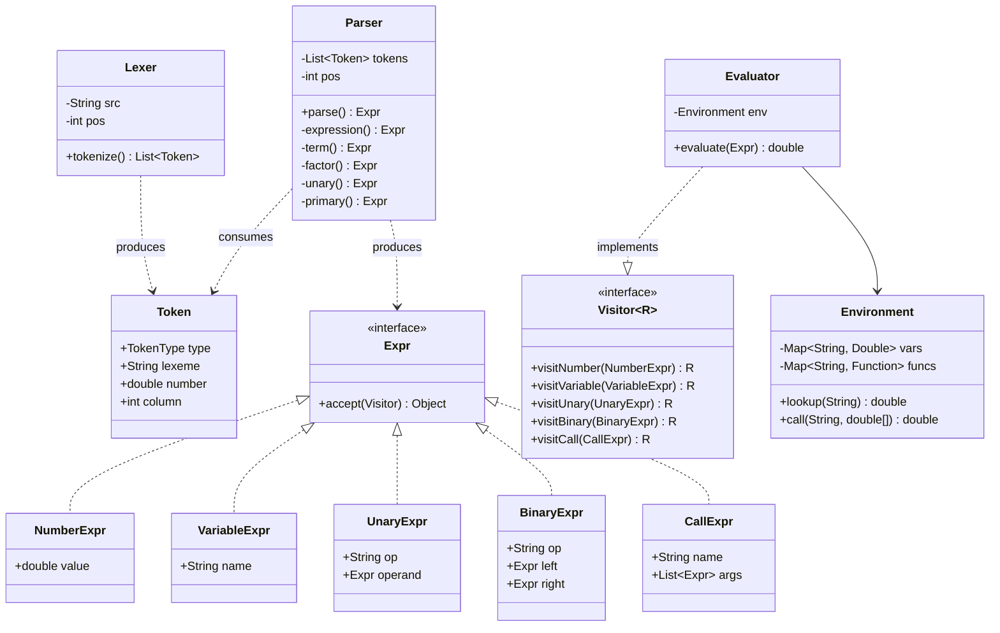

# Design Calculator with Operator Precedence

**Date:** 2026-05-02 | **Updated:** 2026-05-02
**Tags:** `low-level-design` `case-study` `developer-tools` `parsing` `interpreter`

## Summary

Design an arithmetic calculator that accepts an expression string and produces a numeric result, respecting **operator precedence** (`*` binds tighter than `+`), **associativity** (`-` and `/` are left-associative; `^` is right-associative), parentheses, unary minus, named constants and variables, and built-in functions like `sin`, `max`, `pow`.

The clean decomposition is the classic three-stage pipeline: **Lexer → Parser → Evaluator**. The parser produces an abstract syntax tree (AST); the evaluator walks it. This is textbook *Interpreter pattern* with an optional *Visitor* over the tree for transformations (constant folding, pretty-printing, compiling to bytecode).

Two parsing strategies cover ~99% of real calculators:
- **Recursive descent** (one function per precedence level) — clear, easy to extend, the default in *Crafting Interpreters* (Bob Nystrom).
- **Shunting Yard** (Dijkstra) — explicit operator and output stacks, naturally produces RPN. Excellent for spreadsheet engines and stream-of-tokens evaluators.

We show recursive descent in the code and discuss Shunting Yard for contrast.

## Table of Contents

- [Intent / Requirements](#intent--requirements)
- [Grammar](#grammar)
- [Operator Precedence Table](#operator-precedence-table)
- [Structure / Entities and Relationships](#structure--entities-and-relationships)
- [Class Skeletons (Java)](#class-skeletons-java)
- [Key Algorithms / Workflows](#key-algorithms--workflows)
- [Patterns Used](#patterns-used)
- [Concurrency Considerations](#concurrency-considerations)
- [Trade-offs and Extensions](#trade-offs-and-extensions)
- [Related](#related)
- [References](#references)

## Intent / Requirements

**Functional**:
1. Parse and evaluate expressions like `2 + 3 * (4 - 1)^2 - sin(0)`.
2. Support `+ - * / % ^` with correct precedence and associativity.
3. Unary `-` and `+` (e.g., `-3 * 2`, `--3`).
4. Named **variables** with an environment (`x`, `radius`) and **constants** (`pi`, `e`).
5. **Functions**: variable arity (`max(a, b, c)`), pure (no side effects).
6. Friendly errors: `"unexpected ')' at column 7"`.

**Non-functional**:
- Linear time and space in expression length.
- Reusable `Parser` and `Evaluator`: parse once, evaluate many times with different environments (e.g., a spreadsheet recomputing on dependency change).
- Immutable AST (safe to share across threads).

**Out of scope**:
- Arbitrary-precision arithmetic (use `BigDecimal` if needed; not the focus).
- Full programming-language constructs (assignment, control flow, blocks). For that, see *Crafting Interpreters*.

## Grammar

EBNF, ordered by precedence (lowest first). Each non-terminal corresponds to a parser method in recursive descent:

```
expression  = term      { ("+" | "-") term } ;
term        = factor    { ("*" | "/" | "%") factor } ;
factor      = unary     { "^" factor } ;          (* right-associative: recurse on right *)
unary       = ("-" | "+") unary | primary ;
primary     = NUMBER
            | IDENT [ "(" args ")" ]              (* variable or function call *)
            | "(" expression ")" ;
args        = expression { "," expression } ;
```

`^` recurses on the right (`factor`), encoding right-associativity: `2^3^2` = `2^(3^2)` = `512`. The other binary operators iterate (left-associativity): `8 - 3 - 2` = `(8 - 3) - 2` = `3`.

## Operator Precedence Table

| Level | Operators       | Associativity | Notes                                |
|-------|-----------------|---------------|--------------------------------------|
| 1     | `+`, `-` (binary) | Left          | Lowest precedence                  |
| 2     | `*`, `/`, `%`     | Left          |                                    |
| 3     | `^`               | **Right**     | `a^b^c` = `a^(b^c)`                |
| 4     | `-`, `+` (unary)  | Right (prefix)| `-x` parses tighter than `*`        |
| 5     | function call, `()` | n/a         | Highest; primary expressions       |

A common pitfall: making unary minus weaker than `^`. By convention (and matching most spreadsheets and Python), `-2^2` is debatable — Python returns `-4` (unary binds *less* than `^`); spreadsheets often return `4`. Pick one, document it, and write tests pinning the choice.

## Structure / Entities and Relationships



The AST nodes are immutable values; the `Visitor` interface decouples *operations* (evaluate, pretty-print, optimize, compile) from the *shape* of the tree. This is the heart of the [Visitor pattern](../../design-patterns/behavioral/visitor.md).

## Class Skeletons (Java)

```java
// ---- Tokens ----
public enum TokenType {
    NUMBER, IDENT, PLUS, MINUS, STAR, SLASH, PERCENT, CARET,
    LPAREN, RPAREN, COMMA, EOF
}

public record Token(TokenType type, String lexeme, double number, int column) {}

// ---- Lexer ----
public final class Lexer {
    private final String src;
    private int pos;
    public Lexer(String src) { this.src = src; }

    public List<Token> tokenize() {
        List<Token> out = new ArrayList<>();
        while (pos < src.length()) {
            char c = src.charAt(pos);
            if (Character.isWhitespace(c)) { pos++; continue; }
            int start = pos;
            if (Character.isDigit(c) || c == '.')      out.add(number(start));
            else if (Character.isLetter(c) || c == '_') out.add(identifier(start));
            else                                        { out.add(operator(start, c)); pos++; }
        }
        out.add(new Token(TokenType.EOF, "", 0, pos));
        return List.copyOf(out);
    }

    private Token number(int start) {
        while (pos < src.length() && (Character.isDigit(src.charAt(pos)) || src.charAt(pos) == '.')) pos++;
        String s = src.substring(start, pos);
        return new Token(TokenType.NUMBER, s, Double.parseDouble(s), start);
    }

    private Token identifier(int start) {
        while (pos < src.length() && (Character.isLetterOrDigit(src.charAt(pos)) || src.charAt(pos) == '_')) pos++;
        return new Token(TokenType.IDENT, src.substring(start, pos), 0, start);
    }

    private Token operator(int start, char c) {
        TokenType t = switch (c) {
            case '+' -> TokenType.PLUS;   case '-' -> TokenType.MINUS;
            case '*' -> TokenType.STAR;   case '/' -> TokenType.SLASH;
            case '%' -> TokenType.PERCENT; case '^' -> TokenType.CARET;
            case '(' -> TokenType.LPAREN; case ')' -> TokenType.RPAREN;
            case ',' -> TokenType.COMMA;
            default -> throw new ParseException("unexpected char '" + c + "'", start);
        };
        return new Token(t, String.valueOf(c), 0, start);
    }
}

// ---- AST ----
public sealed interface Expr permits NumberExpr, VariableExpr, UnaryExpr, BinaryExpr, CallExpr {
    <R> R accept(Visitor<R> v);
}
public record NumberExpr(double value)               implements Expr { public <R> R accept(Visitor<R> v) { return v.visitNumber(this); } }
public record VariableExpr(String name)              implements Expr { public <R> R accept(Visitor<R> v) { return v.visitVariable(this); } }
public record UnaryExpr(String op, Expr operand)     implements Expr { public <R> R accept(Visitor<R> v) { return v.visitUnary(this); } }
public record BinaryExpr(String op, Expr left, Expr right) implements Expr { public <R> R accept(Visitor<R> v) { return v.visitBinary(this); } }
public record CallExpr(String name, List<Expr> args) implements Expr { public <R> R accept(Visitor<R> v) { return v.visitCall(this); } }

public interface Visitor<R> {
    R visitNumber(NumberExpr e);   R visitVariable(VariableExpr e);
    R visitUnary(UnaryExpr e);     R visitBinary(BinaryExpr e);
    R visitCall(CallExpr e);
}

// ---- Parser (recursive descent) ----
public final class Parser {
    private final List<Token> tokens;
    private int pos;
    public Parser(List<Token> tokens) { this.tokens = tokens; }

    public Expr parse() { Expr e = expression(); expect(TokenType.EOF); return e; }

    private Expr expression() { // + -, left-assoc
        Expr left = term();
        while (match(TokenType.PLUS, TokenType.MINUS))
            left = new BinaryExpr(previous().lexeme(), left, term());
        return left;
    }
    private Expr term() {       // * / %, left-assoc
        Expr left = factor();
        while (match(TokenType.STAR, TokenType.SLASH, TokenType.PERCENT))
            left = new BinaryExpr(previous().lexeme(), left, factor());
        return left;
    }
    private Expr factor() {     // ^, right-assoc: recurse into factor on the right
        Expr left = unary();
        if (match(TokenType.CARET)) left = new BinaryExpr("^", left, factor());
        return left;
    }
    private Expr unary() {
        if (match(TokenType.MINUS, TokenType.PLUS))
            return new UnaryExpr(previous().lexeme(), unary());
        return primary();
    }
    private Expr primary() {
        Token t = peek();
        if (match(TokenType.NUMBER)) return new NumberExpr(previous().number());
        if (match(TokenType.LPAREN)) { Expr e = expression(); expect(TokenType.RPAREN); return e; }
        if (match(TokenType.IDENT)) {
            String name = previous().lexeme();
            if (match(TokenType.LPAREN)) {
                List<Expr> args = new ArrayList<>();
                if (!check(TokenType.RPAREN)) {
                    args.add(expression());
                    while (match(TokenType.COMMA)) args.add(expression());
                }
                expect(TokenType.RPAREN);
                return new CallExpr(name, List.copyOf(args));
            }
            return new VariableExpr(name);
        }
        throw new ParseException("unexpected token '" + t.lexeme() + "'", t.column());
    }

    private boolean match(TokenType... types) {
        for (TokenType t : types) if (check(t)) { pos++; return true; }
        return false;
    }
    private boolean check(TokenType t) { return peek().type() == t; }
    private Token peek()     { return tokens.get(pos); }
    private Token previous() { return tokens.get(pos - 1); }
    private Token expect(TokenType t) {
        if (!check(t)) throw new ParseException("expected " + t + ", got " + peek().lexeme(), peek().column());
        return tokens.get(pos++);
    }
}

// ---- Evaluator (Visitor) ----
public final class Evaluator implements Visitor<Double> {
    private final Environment env;
    public Evaluator(Environment env) { this.env = env; }
    public double evaluate(Expr e) { return e.accept(this); }

    @Override public Double visitNumber(NumberExpr e)     { return e.value(); }
    @Override public Double visitVariable(VariableExpr e) { return env.lookup(e.name()); }

    @Override public Double visitUnary(UnaryExpr e) {
        double v = e.operand().accept(this);
        return switch (e.op()) {
            case "-" -> -v; case "+" -> v;
            default  -> throw new EvalException("unknown unary " + e.op());
        };
    }

    @Override public Double visitBinary(BinaryExpr e) {
        double l = e.left().accept(this), r = e.right().accept(this);
        return switch (e.op()) {
            case "+" -> l + r; case "-" -> l - r; case "*" -> l * r;
            case "/" -> { if (r == 0.0) throw new EvalException("division by zero"); yield l / r; }
            case "%" -> l % r; case "^" -> Math.pow(l, r);
            default  -> throw new EvalException("unknown op " + e.op());
        };
    }

    @Override public Double visitCall(CallExpr e) {
        double[] args = e.args().stream().mapToDouble(a -> a.accept(this)).toArray();
        return env.call(e.name(), args);
    }
}

// ---- Environment ----
public final class Environment {
    private final Map<String, Double> vars = new HashMap<>();
    private final Map<String, Function<double[], Double>> funcs = new HashMap<>();

    public Environment() {
        vars.put("pi", Math.PI); vars.put("e", Math.E);
        funcs.put("sin", a -> Math.sin(a[0]));
        funcs.put("cos", a -> Math.cos(a[0]));
        funcs.put("pow", a -> Math.pow(a[0], a[1]));
        funcs.put("max", a -> Arrays.stream(a).max().orElseThrow());
        funcs.put("min", a -> Arrays.stream(a).min().orElseThrow());
    }
    public Environment set(String name, double value) { vars.put(name, value); return this; }
    public double lookup(String name) {
        Double v = vars.get(name);
        if (v == null) throw new EvalException("undefined variable: " + name);
        return v;
    }
    public double call(String name, double[] args) {
        Function<double[], Double> f = funcs.get(name);
        if (f == null) throw new EvalException("undefined function: " + name);
        return f.apply(args);
    }
}
```

## Key Algorithms / Workflows

**End-to-end**:
```
"2 + 3 * (4 - 1)^2"
   │
   ▼  Lexer
[NUM(2), +, NUM(3), *, (, NUM(4), -, NUM(1), ), ^, NUM(2), EOF]
   │
   ▼  Parser (recursive descent)
        +
       ╱ ╲
      2   *
         ╱ ╲
        3   ^
           ╱ ╲
          (-) 2
         ╱ ╲
        4   1
   │
   ▼  Evaluator (Visitor)
   29.0
```

**Recursive descent** mirrors the grammar one-to-one. To add a precedence level, insert one method between two existing ones; to make an operator right-associative, recurse on the right child instead of looping. The call stack *is* the precedence ladder.

**Shunting Yard alternative** (Dijkstra, 1961) keeps two stacks — operators and output — and shuffles between them as it scans tokens left-to-right. Output is RPN, which can be evaluated by a third pass with a value stack. Equally correct, friendlier to streaming token sources, but harder to extend with new syntactic forms (e.g., ternary, function-call parens) than recursive descent.

**Constant folding** as a Visitor: walk the tree, replace `BinaryExpr(NumberExpr a, NumberExpr b)` with `NumberExpr(eval(a, b))`. Free, repeatable optimization that benefits any reused AST.

## Patterns Used

- **Interpreter** — each AST node knows how to be evaluated via `accept`/visitor dispatch.
- [**Visitor**](../../design-patterns/behavioral/visitor.md) — operations (eval, print, optimize, compile) live outside the node classes; new operations do not touch `Expr` subclasses.
- **Composite** — the AST is a recursive tree; `BinaryExpr` and `CallExpr` are composites.
- **Strategy** — recursive descent vs. Shunting Yard is interchangeable behind a `Parser` interface.
- **Factory / Plugin** — `Environment` registers named functions; opens the door to plugin functions without recompiling.
- **Immutability** — AST nodes are `record`s; safe to share across threads and cache.

## Concurrency Considerations

- **AST is immutable** once parsed; evaluator threads share it freely.
- **Environment**: mutation mid-evaluation can produce torn reads. Pass an immutable snapshot or use a per-evaluation `Environment` for spreadsheet-style recompute.
- **Lexer/Parser** are stateful (`pos`); construct a fresh instance per input. Not thread-safe.
- **Function bodies** must be **pure**. Side-effecting functions (`now()`, `rand()`) break referential transparency and defeat memoization.
- For deep trees or `BigDecimal`-heavy expressions, enforce a **deadline** in the evaluator and check it at each visit.

## Trade-offs and Extensions

**Recursive descent vs. Shunting Yard**: recursive descent is easier to read and extend, and produces an AST as a natural by-product — pick it for general calculators and DSLs. Shunting Yard is compact, single-pass, and produces RPN that maps neatly onto a stack machine; favour it for streamed/embedded contexts.

**Numeric type**: `double` is fine for scientific/UI use; **wrong** for money. Use `BigDecimal` with an explicit `MathContext` for currency, and always pass a scale to division to avoid `ArithmeticException`.

**Error reporting**: every `Token` carries a column. Errors should include the source, a caret, and the column. Recursive descent gives natural error sites; Shunting Yard needs a little extra bookkeeping for parity.

**Extensions**:
- **Variables & assignment** at the top level (`IDENT '=' expression`).
- **Boolean & comparison** (`<`, `==`, `&&`, `||`) below arithmetic precedence; **ternary** `?:` (right-associative) above `||`.
- **Bytecode compile**: a Visitor emitting opcodes for a stack VM — orders of magnitude faster than tree-walking for repeated evaluation.
- **Symbolic differentiation**: a Visitor returning a derivative `Expr`.
- **Context-aware pretty printing** that knows the parent's precedence.

For the full progression beyond a calculator (statements, control flow, closures, GC), Bob Nystrom's *Crafting Interpreters* is the definitive walk-through.

## Related

- Pattern reference: [`../../design-patterns/behavioral/visitor.md`](../../design-patterns/behavioral/visitor.md)
- Pattern reference: [`../../design-patterns/behavioral/visitor.md`](../../design-patterns/behavioral/visitor.md)
- Pattern reference: [`../../design-patterns/structural/composite.md`](../../design-patterns/structural/composite.md)
- Sibling case studies in this directory:
  - [`./design-calculator.md`](./design-calculator.md)

## References

- Edsger W. Dijkstra — Shunting-Yard Algorithm (Mathematisch Centrum, 1961). Original two-stack infix-to-postfix.
- Bob Nystrom — *Crafting Interpreters*. Recursive descent, AST design, Visitor / expression problem, tree-walking.
- Aho, Lam, Sethi, Ullman — *Compilers: Principles, Techniques, and Tools* ("Dragon Book") — lexical analysis, top-down parsing, syntax-directed translation.
- Niklaus Wirth — *Compiler Construction*. Clearest concise treatment of recursive descent.
- Java SE — `java.lang.Math`, `java.math.BigDecimal`, sealed interfaces, records, pattern-matching `switch`.
