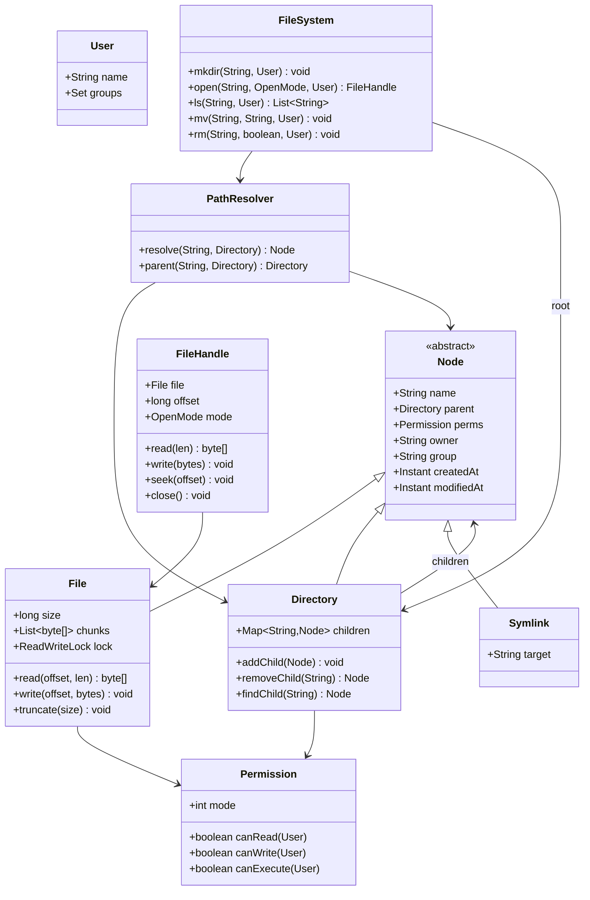

# Design In-Memory File System

**Date:** 2026-05-02 | **Updated:** 2026-05-02
**Tags:** `low-level-design` `case-study` `developer-tools` `file-system` `composite`

## Summary

An in-memory file system (think: `tmpfs`, the file system inside a Jupyter sandbox, or `jimfs` from Google) implements the standard `mkdir / ls / cat / write / mv / rm` operations against an in-process tree of nodes. It is a textbook **Composite** pattern: directories contain children (files or directories) and both share a common interface.

This case study covers:

- The **Node / File / Directory** composite tree.
- A **path resolver** that walks paths (absolute, relative, `..`, `.`, symlinks).
- POSIX-style **permissions** (owner / group / other × rwx) and a simple **ACL** check.
- **Locking** for safe concurrent reads and writes.
- File handle abstraction with offsets.

## Table of Contents

1. [Requirements](#requirements)
2. [Entities and Relationships](#entities-and-relationships)
3. [Class Skeletons (Java)](#class-skeletons-java)
4. [Key Algorithms / Workflows](#key-algorithms--workflows)
5. [Patterns Used (with reason)](#patterns-used-with-reason)
6. [Concurrency Considerations](#concurrency-considerations)
7. [Trade-offs and Extensions](#trade-offs-and-extensions)
8. [Related](#related)
9. [References](#references)

## Requirements

**Functional:**

- `mkdir(path)`, `mkdirs(path)`.
- `create(path)`, `open(path, mode)` returns a `FileHandle`.
- `read(handle, len)`, `write(handle, bytes)`, `seek(handle, offset)`.
- `ls(path)`, `stat(path)`, `mv(src, dst)`, `rm(path, recursive)`.
- Symlinks: `link(src, target)`.
- Permissions: read/write/execute for owner/group/other.
- Path resolution: `/a/b/../c` -> `/a/c`.

**Non-functional:**

- Concurrent readers, exclusive writers per file.
- Operations that touch the tree (mkdir, rm, mv) must be atomic w.r.t. other operations.
- Bounded memory; large file content can be chunked.

## Entities and Relationships



## Class Skeletons (Java)

### Node hierarchy

```java
public abstract class Node {
    protected final String name;
    protected Directory parent;
    protected Permission perms;
    protected String owner;
    protected String group;
    protected Instant createdAt;
    protected volatile Instant modifiedAt;

    public abstract long size();
    public abstract NodeType type();
}

public final class File extends Node {
    private static final int CHUNK = 4096;
    private final List<byte[]> chunks = new ArrayList<>();
    private long size;
    private final ReadWriteLock lock = new ReentrantReadWriteLock();

    public byte[] read(long offset, int len) {
        lock.readLock().lock();
        try {
            int remaining = (int) Math.min(len, size - offset);
            if (remaining <= 0) return new byte[0];
            byte[] out = new byte[remaining];
            int written = 0;
            int chunkIdx = (int) (offset / CHUNK);
            int chunkOff = (int) (offset % CHUNK);
            while (written < remaining) {
                byte[] c = chunks.get(chunkIdx);
                int copy = Math.min(c.length - chunkOff, remaining - written);
                System.arraycopy(c, chunkOff, out, written, copy);
                written += copy; chunkIdx++; chunkOff = 0;
            }
            return out;
        } finally { lock.readLock().unlock(); }
    }

    public void write(long offset, byte[] data) {
        lock.writeLock().lock();
        try {
            ensureCapacity(offset + data.length);
            int written = 0;
            int chunkIdx = (int) (offset / CHUNK);
            int chunkOff = (int) (offset % CHUNK);
            while (written < data.length) {
                byte[] c = chunks.get(chunkIdx);
                int copy = Math.min(c.length - chunkOff, data.length - written);
                System.arraycopy(data, written, c, chunkOff, copy);
                written += copy; chunkIdx++; chunkOff = 0;
            }
            size = Math.max(size, offset + data.length);
            modifiedAt = Instant.now();
        } finally { lock.writeLock().unlock(); }
    }

    private void ensureCapacity(long needed) {
        while ((long) chunks.size() * CHUNK < needed) chunks.add(new byte[CHUNK]);
    }
}

public final class Directory extends Node {
    private final Map<String, Node> children = new ConcurrentHashMap<>();

    public void addChild(Node node) {
        Node prev = children.putIfAbsent(node.getName(), node);
        if (prev != null) throw new FileAlreadyExistsException(node.getName());
        node.setParent(this);
    }

    public Node removeChild(String name) {
        Node n = children.remove(name);
        if (n == null) throw new NoSuchFileException(name);
        n.setParent(null);
        return n;
    }

    public Node findChild(String name) { return children.get(name); }
    public Collection<Node> children() { return children.values(); }
}

public final class Symlink extends Node {
    private final String target; // absolute or relative
    public String target() { return target; }
}
```

### Permissions

```java
public final class Permission {
    /** mode bits: 0o755 etc. Encoded as 9 bits: rwxrwxrwx. */
    private final int mode;

    public boolean canRead(User u, Node n)  { return check(u, n, 0b100); }
    public boolean canWrite(User u, Node n) { return check(u, n, 0b010); }
    public boolean canExecute(User u, Node n){ return check(u, n, 0b001); }

    private boolean check(User u, Node n, int bit) {
        int shift;
        if (u.getName().equals(n.getOwner())) shift = 6;
        else if (u.getGroups().contains(n.getGroup())) shift = 3;
        else shift = 0;
        return ((mode >> shift) & bit) != 0;
    }
}
```

### File handle

```java
public final class FileHandle implements Closeable {
    private final File file;
    private long offset;
    private final OpenMode mode;
    private boolean closed;

    public byte[] read(int len) {
        require(mode.canRead());
        byte[] data = file.read(offset, len);
        offset += data.length;
        return data;
    }

    public void write(byte[] data) {
        require(mode.canWrite());
        file.write(offset, data);
        offset += data.length;
    }

    public void seek(long off) { this.offset = off; }
    public void close() { closed = true; }
}
```

### Path resolver

```java
public final class PathResolver {
    private final Directory root;
    private static final int MAX_SYMLINK_HOPS = 40;

    public Node resolve(String path, Directory cwd) {
        Deque<String> segments = parse(path, cwd);
        Node current = path.startsWith("/") ? root : cwd;
        int hops = 0;
        for (String seg : segments) {
            if (".".equals(seg)) continue;
            if ("..".equals(seg)) {
                current = (current.getParent() != null)
                    ? current.getParent() : current;
                continue;
            }
            if (!(current instanceof Directory dir))
                throw new NotDirectoryException(seg);
            Node next = dir.findChild(seg);
            if (next == null) throw new NoSuchFileException(seg);
            if (next instanceof Symlink sl) {
                if (++hops > MAX_SYMLINK_HOPS)
                    throw new FileSystemLoopException(path);
                next = resolve(sl.target(), dir);
            }
            current = next;
        }
        return current;
    }
}
```

### File system facade

```java
public final class FileSystem {

    private final Directory root;
    private final PathResolver resolver;
    private final Object treeLock = new Object();

    public void mkdir(String path, User u) {
        synchronized (treeLock) {
            Directory parent = (Directory) resolver.resolve(parentOf(path), root);
            require(parent.getPerms().canWrite(u, parent));
            parent.addChild(new Directory(baseName(path), u, defaultPerm()));
        }
    }

    public FileHandle open(String path, OpenMode mode, User u) {
        Node n = resolver.resolve(path, root);
        if (!(n instanceof File f)) throw new IsADirectoryException(path);
        require(mode.canRead()  ? f.getPerms().canRead(u, f)  : true);
        require(mode.canWrite() ? f.getPerms().canWrite(u, f) : true);
        return new FileHandle(f, 0, mode);
    }

    public void mv(String src, String dst, User u) {
        synchronized (treeLock) {
            Node n = resolver.resolve(src, root);
            Directory dstParent = (Directory) resolver.resolve(parentOf(dst), root);
            require(n.getParent().getPerms().canWrite(u, n.getParent()));
            require(dstParent.getPerms().canWrite(u, dstParent));
            n.getParent().removeChild(n.getName());
            n.setName(baseName(dst));
            dstParent.addChild(n);
        }
    }

    public void rm(String path, boolean recursive, User u) {
        synchronized (treeLock) {
            Node n = resolver.resolve(path, root);
            if (n instanceof Directory d
                    && !d.children().isEmpty() && !recursive) {
                throw new DirectoryNotEmptyException(path);
            }
            require(n.getParent().getPerms().canWrite(u, n.getParent()));
            n.getParent().removeChild(n.getName());
        }
    }
}
```

## Key Algorithms / Workflows

### Path resolution

1. Tokenize on `/`, drop empty segments.
2. Start at root (absolute) or cwd (relative).
3. For each segment: handle `.` and `..`; descend through directories; when a symlink is hit, recurse with a hop counter to detect loops (`ELOOP`).
4. End: return the resolved node.

Subtleties:

- Trailing slash means "must be a directory" (POSIX behavior).
- `..` at root stays at root.
- A symlink to a missing path is resolved lazily — `lstat` returns the link, `stat` fails.

### Read / write

- Files are stored as a list of fixed-size chunks (avoids one giant byte array, supports cheap appends).
- Reads use the read lock; writes use the write lock — one file's lock, not a global one.
- `truncate(size)` may release tail chunks; concurrent reads see the lock-protected size.

### Locking strategy

- **Tree mutations** (`mkdir`, `rm`, `mv`, `link`) are serialized by a single `treeLock`. This is simpler than per-directory locks and avoids the deadlock-prone double-lock for `mv`.
- **File content** uses a per-file `ReadWriteLock`. Multiple readers, one writer.
- The two locks are independent: a tree mutation never holds a file lock, and vice versa.

## Patterns Used (with reason)

| Pattern | Where | Reason |
|---|---|---|
| **Composite** | `Directory` contains `Node` (which is `File` / `Directory` / `Symlink`) | Recursive tree with uniform interface. |
| **Iterator** | Walking a directory tree | Standard for `find`-style traversal. |
| **Facade** | `FileSystem` | One entry point hides resolver + locking + tree mutations. |
| **Strategy** (optional) | `PermissionPolicy` (POSIX vs ACL) | Swap permission model without touching nodes. |
| **Command** (optional) | Each `mkdir` / `mv` as a command for journaling | Enables undo/redo or write-ahead log if persistence is added. |

## Concurrency Considerations

- **Single tree lock vs per-node locks:** the tree lock keeps invariants simple. Per-directory locks scale better but require careful lock ordering for `mv` (lock both parents in canonical order to avoid deadlock).
- **`ConcurrentHashMap` for children:** safe for `findChild`/`putIfAbsent`, but cross-directory invariants (e.g., move) still need an outer lock — `putIfAbsent` alone cannot atomically remove from one map and insert into another.
- **`ReadWriteLock` per file:** fair lock acquisition prevents writer starvation; default `ReentrantReadWriteLock` is non-fair — pick deliberately.
- **Open handles vs delete:** Unix lets you `unlink` an open file and the bytes survive until the last handle is closed. Reproduce this by using a reference count on `File`; `removeChild` decrements the link count, the actual data is freed when both link count and open handles reach 0.
- **Iteration safety:** `ls` should snapshot child names (`new ArrayList<>(children.keySet())`) so concurrent `mkdir` doesn't throw `ConcurrentModificationException`.

## Trade-offs and Extensions

- **Memory pressure:** chunked storage helps; for huge files, page out cold chunks to disk.
- **Persistence:** add a journaling layer (commands recorded to a log) and replay on startup — see VCS doc for a related content-addressed twist.
- **Snapshots:** copy-on-write the directory tree by sharing immutable nodes; mutate by creating new path nodes (similar to a persistent data structure).
- **Quotas:** per-user byte counters updated under the tree lock during `write`/`truncate`/`rm`.
- **Watch / notify:** add an `inotify`-like event stream — file handles or paths register observers; mutations publish events.
- **Case sensitivity:** decide explicitly. POSIX is case-sensitive; macOS APFS defaults case-insensitive case-preserving.

## Related

- Sibling LLDs: [URL Shortener (LLD)](design-url-shortener-lld.md), [Logging Framework](design-logging-framework.md), [Rate Limiter (LLD)](design-rate-limiter-lld.md), [Version Control System](design-version-control-system.md), [Task Scheduler](design-task-scheduler.md).
- Patterns: [Composite](../../design-patterns/structural/), [Iterator](../../design-patterns/behavioral/), [Facade](../../design-patterns/structural/), [Command](../../design-patterns/behavioral/).
- File-system context: `../../../system-design/INDEX.md` (object stores, distributed file systems).

## References

- POSIX.1-2017 — pathname resolution rules, file modes, `O_*` open flags.
- *The Linux Programming Interface*, Kerrisk — file I/O, `inotify`, link counts, open-file semantics.
- Google `jimfs` (in-memory NIO file system implementation) — practical Java reference.
- Java `java.util.concurrent.locks.ReentrantReadWriteLock` — read/write lock semantics.
