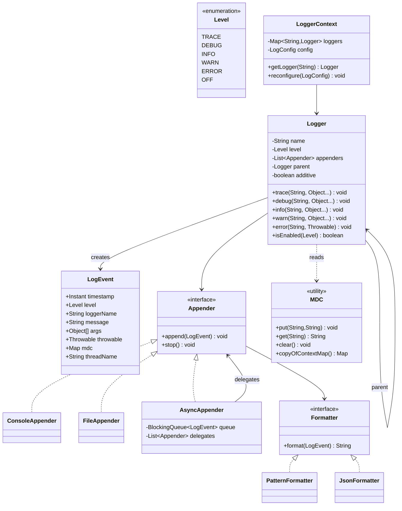

# Design Logging Framework

**Date:** 2026-05-02 | **Updated:** 2026-05-02
**Tags:** `low-level-design` `case-study` `developer-tools` `logging` `observability`

## Summary

A logging framework like Log4j, Logback, or `java.util.logging` is one of the most-used pieces of infrastructure in any backend. The classes are deceptively simple: **`Logger`** routes events through one or more **`Appenders`**, each of which uses a **`Formatter` (or Layout)** to serialize the event before writing to a destination (stdout, file, network, etc.).

This case study covers:

- Logger hierarchy and effective-level resolution.
- The level hierarchy (`TRACE < DEBUG < INFO < WARN < ERROR < OFF`).
- Appenders, including an **async appender** with a bounded queue.
- **MDC** (Mapped Diagnostic Context) for per-thread context like `requestId`.
- Configuration shape and how runtime reconfiguration works.

## Table of Contents

1. [Requirements](#requirements)
2. [Entities and Relationships](#entities-and-relationships)
3. [Class Skeletons (Java)](#class-skeletons-java)
4. [Key Algorithms / Workflows](#key-algorithms--workflows)
5. [Patterns Used (with reason)](#patterns-used-with-reason)
6. [Concurrency Considerations](#concurrency-considerations)
7. [Trade-offs and Extensions](#trade-offs-and-extensions)
8. [Related](#related)
9. [References](#references)

## Requirements

**Functional:**

- Named loggers (`com.acme.svc.OrderService`); hierarchical inheritance by dot-separated names.
- Levels `TRACE`, `DEBUG`, `INFO`, `WARN`, `ERROR` plus `OFF`.
- Multiple appenders per logger; appenders are inherited from parents (additivity flag).
- Pluggable formatters (plain text pattern, JSON, key=value).
- Async appender to keep callers off the IO path.
- MDC: thread-local map merged into every event.
- Throwable serialization (stack traces).

**Non-functional:**

- Caller cost for a disabled-level call (`logger.debug(...)`) must be minimal — ideally a single field check.
- Appenders must not lose events on graceful shutdown.
- Reconfiguration at runtime should not race with in-flight writes.

## Entities and Relationships



## Class Skeletons (Java)

### Level

```java
public enum Level {
    TRACE(0), DEBUG(1), INFO(2), WARN(3), ERROR(4), OFF(Integer.MAX_VALUE);
    private final int rank;
    Level(int rank) { this.rank = rank; }
    public boolean isEnabledFor(Level threshold) {
        return this.rank >= threshold.rank;
    }
}
```

### LogEvent (immutable)

```java
public final class LogEvent {
    private final Instant timestamp;
    private final Level level;
    private final String loggerName;
    private final String message;
    private final Object[] args;
    private final Throwable throwable;
    private final Map<String, String> mdc;   // snapshot, immutable
    private final String threadName;
    // all-args constructor + getters
}
```

### MDC

```java
public final class MDC {
    private static final ThreadLocal<Map<String, String>> CTX =
        ThreadLocal.withInitial(HashMap::new);

    public static void put(String key, String value) { CTX.get().put(key, value); }
    public static String get(String key) { return CTX.get().get(key); }
    public static void remove(String key) { CTX.get().remove(key); }
    public static void clear() { CTX.get().clear(); }

    public static Map<String, String> copyOfContextMap() {
        return Map.copyOf(CTX.get());
    }
}
```

### Logger

```java
public final class Logger {
    private final String name;
    private volatile Level level;        // volatile so reconfigure is visible
    private final List<Appender> appenders = new CopyOnWriteArrayList<>();
    private final Logger parent;
    private volatile boolean additive = true;

    Logger(String name, Logger parent) {
        this.name = name;
        this.parent = parent;
    }

    public boolean isEnabled(Level requested) {
        return requested.isEnabledFor(effectiveLevel());
    }

    public void info(String msg, Object... args) {
        log(Level.INFO, msg, args, null);
    }

    public void error(String msg, Throwable t) {
        log(Level.ERROR, msg, EMPTY, t);
    }

    private void log(Level lvl, String msg, Object[] args, Throwable t) {
        if (!isEnabled(lvl)) return; // hot-path early exit
        LogEvent event = new LogEvent(
            Instant.now(), lvl, name, msg, args, t,
            MDC.copyOfContextMap(), Thread.currentThread().getName());
        dispatch(event);
    }

    private void dispatch(LogEvent event) {
        Logger l = this;
        while (l != null) {
            for (Appender a : l.appenders) a.append(event);
            if (!l.additive) break;
            l = l.parent;
        }
    }

    private Level effectiveLevel() {
        Logger l = this;
        while (l != null) {
            if (l.level != null) return l.level;
            l = l.parent;
        }
        return Level.INFO; // root default
    }
}
```

### LoggerContext

```java
public final class LoggerContext {
    private final ConcurrentMap<String, Logger> loggers = new ConcurrentHashMap<>();
    private final Logger root;

    public LoggerContext() {
        this.root = new Logger("ROOT", null);
        this.root.setLevel(Level.INFO);
        loggers.put("ROOT", root);
    }

    public Logger getLogger(String name) {
        return loggers.computeIfAbsent(name, this::create);
    }

    private Logger create(String name) {
        int dot = name.lastIndexOf('.');
        Logger parent = (dot < 0) ? root : getLogger(name.substring(0, dot));
        return new Logger(name, parent);
    }

    public void reconfigure(LogConfig config) {
        // apply levels and appenders atomically per-logger;
        // existing in-flight events keep their old route until dispatch returns.
    }
}
```

### Appenders

```java
public interface Appender {
    void append(LogEvent event);
    void stop();
}

public final class ConsoleAppender implements Appender {
    private final Formatter formatter;
    public void append(LogEvent e) {
        System.out.println(formatter.format(e));
    }
    public void stop() { /* flush */ }
}

public final class FileAppender implements Appender {
    private final BufferedWriter writer;
    private final Formatter formatter;
    public synchronized void append(LogEvent e) {
        try { writer.write(formatter.format(e)); writer.newLine(); }
        catch (IOException io) { /* fail-soft: counter + stderr */ }
    }
    public synchronized void stop() { /* flush + close */ }
}
```

### Async appender

```java
public final class AsyncAppender implements Appender {
    private final BlockingQueue<LogEvent> queue;
    private final List<Appender> delegates;
    private final Thread worker;
    private final OverflowPolicy overflow; // BLOCK | DROP_OLDEST | DROP_NEW

    public AsyncAppender(int capacity, List<Appender> delegates, OverflowPolicy p) {
        this.queue = new ArrayBlockingQueue<>(capacity);
        this.delegates = List.copyOf(delegates);
        this.overflow = p;
        this.worker = new Thread(this::drain, "log-async");
        this.worker.setDaemon(true);
        this.worker.start();
    }

    public void append(LogEvent e) {
        switch (overflow) {
            case BLOCK -> queue.offer(e); // or put() if true blocking
            case DROP_NEW -> queue.offer(e);
            case DROP_OLDEST -> {
                while (!queue.offer(e)) queue.poll();
            }
        }
    }

    private void drain() {
        try {
            while (!Thread.currentThread().isInterrupted()) {
                LogEvent e = queue.take();
                for (Appender a : delegates) a.append(e);
            }
        } catch (InterruptedException ignored) {}
    }

    public void stop() {
        worker.interrupt();
        for (Appender a : delegates) a.stop();
    }
}
```

### Formatter

```java
public interface Formatter { String format(LogEvent e); }

public final class PatternFormatter implements Formatter {
    // Pattern like: "%d %-5p [%t] %c{1} %X - %m%n"
    private final String pattern;
    public String format(LogEvent e) { /* parse + render */ }
}

public final class JsonFormatter implements Formatter {
    public String format(LogEvent e) {
        // ts, level, logger, thread, message, mdc{...}, exception{...}
        // emit a single JSON line
    }
}
```

## Key Algorithms / Workflows

### Effective level resolution

Walk up the parent chain until a non-null level is found. Cache the result per-logger only if reconfiguration invalidates the cache; otherwise the walk is cheap (depth bounded by package depth).

### Hot-path exit on disabled levels

```java
if (!logger.isEnabled(Level.DEBUG)) return; // single volatile read + compare
```

Avoid building the `LogEvent` (which calls `MDC.copyOfContextMap`, `Instant.now`, captures args) until the level check passes.

### MDC propagation

- Stored in a `ThreadLocal<Map<String,String>>`.
- Snapshot on **event creation** (`copyOfContextMap`) so async appenders see the producer's context, not the worker thread's.
- For executor/Runnable wrapping, snapshot before submit and restore in `run()`.

### Async dispatch and shutdown

1. Producer puts event on bounded queue.
2. Worker thread drains and forwards to delegates.
3. On shutdown: signal worker, wait until queue is drained or a timeout elapses, then call `stop()` on delegates.

## Patterns Used (with reason)

| Pattern | Where | Reason |
|---|---|---|
| **Composite** | Logger hierarchy | Parent-child name structure with inherited config. |
| **Chain of Responsibility** | Additive appender walk up the parent chain | Each logger optionally adds appenders; root catches unhandled. |
| **Strategy** | `Formatter` interface | Swap text vs JSON without touching appenders. |
| **Decorator** | `AsyncAppender` wraps other appenders | Add async dispatch without changing delegate code. |
| **Singleton-ish Registry** | `LoggerContext` | One registry per JVM (or per app) with `computeIfAbsent`. |
| **Producer-Consumer** | Async appender | Bounded queue + worker thread isolates IO from callers. |

## Concurrency Considerations

- **Logger fields:** `level`, `additive` are `volatile` so `reconfigure` is visible across threads without locking the hot path.
- **Appenders list:** `CopyOnWriteArrayList` is a good fit — frequent reads, rare writes (config changes).
- **MDC:** per-thread; **must be snapshotted** before crossing thread boundaries (executors, async appender). Otherwise the worker reads the wrong context (or none at all).
- **FileAppender:** writes are serialized — use `synchronized`, or buffer per-thread and merge under a lock.
- **AsyncAppender backpressure:** choose `BLOCK` (slow producer), `DROP_NEW` (lossy, current request unaffected), or `DROP_OLDEST` (lossy, prefers fresh signal). Pick deliberately; "infinite queue" is a memory leak in disguise.
- **Reconfiguration races:** install new appenders into `CopyOnWriteArrayList` atomically; events already mid-dispatch finish on the old set — accept that as fine.

## Trade-offs and Extensions

- **Object allocation:** every event allocates a `LogEvent`, an MDC snapshot, and a formatted string. High-throughput systems (Log4j 2 garbage-free mode) reuse ring-buffer slots and `StringBuilder`s. Trade-off: complexity vs allocation pressure.
- **Pattern parsing cost:** parse the pattern once at config time into a list of converters; do not re-parse per event.
- **Structured logs:** prefer JSON in containerized environments; human-friendly pattern in dev.
- **Sampling:** add a `SamplingFilter` (e.g., 1% of `DEBUG`) for chatty paths.
- **Dynamic level overrides:** expose a small admin API/CLI to flip a logger to `DEBUG` for N minutes, then revert.
- **Bridging:** support SLF4J-like API on top so application code doesn't bind to the implementation.

## Related

- Sibling LLDs: [URL Shortener (LLD)](design-url-shortener-lld.md), [Rate Limiter (LLD)](design-rate-limiter-lld.md), [In-Memory File System](design-in-memory-file-system.md), [Version Control System](design-version-control-system.md), [Task Scheduler](design-task-scheduler.md).
- Patterns: [Composite](../../design-patterns/structural/), [Decorator](../../design-patterns/structural/), [Chain of Responsibility](../../design-patterns/behavioral/), [Strategy](../../design-patterns/behavioral/).
- Observability HLD context: `../../../system-design/INDEX.md` (logging pipelines, log shipping).

## References

- SLF4J / Logback documentation — logger hierarchy, MDC, appenders.
- Apache Log4j 2 documentation — async appender, garbage-free logging, plugin model.
- `java.util.logging` (`java.util.logging.Logger`, `Handler`, `Formatter`).
- Gamma et al., *Design Patterns* — Composite, Strategy, Decorator.
- Goetz et al., *Java Concurrency in Practice* — producer-consumer, `BlockingQueue` patterns.
