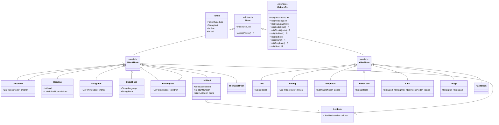

# Design Markdown Parser

**Date:** 2026-05-02 | **Updated:** 2026-05-02
**Tags:** `low-level-design` `case-study` `parser` `composite` `visitor`

## Summary

Design a Markdown parser that turns a CommonMark-flavored string into an
AST, then renders that tree to HTML or other targets. This is the canonical
case study for the **Composite** + **Visitor** pair: the AST is a recursive
tree (`Document → Block → Inline`), and rendering, plain-text extraction,
and debug printing are all visitors over the same tree.

This document does not attempt full CommonMark conformance. It models the
*shape* of a real parser. Production parsers (markdown-it, commonmark.java,
Flexmark) spend most of their code on spec edge cases. The LLD question is:
*which classes do you need, and how do they collaborate?*

## Table of Contents

- [Requirements](#requirements)
- [Pipeline Overview](#pipeline-overview)
- [Entities and Relationships](#entities-and-relationships)
- [Class Skeletons (Java)](#class-skeletons-java)
- [Key Algorithms / Workflows](#key-algorithms--workflows)
- [Patterns Used](#patterns-used)
- [Concurrency Considerations](#concurrency-considerations)
- [Trade-offs and Extensions](#trade-offs-and-extensions)
- [Related](#related)
- [References](#references)

## Requirements

### Functional

- Parse a Markdown source string into an AST.
- Block-level: ATX heading (`#`–`######`), paragraph, bullet/ordered list
  with nested items, fenced code block (`~~~` / ` ``` `), indented code
  block, blockquote, thematic break (`---`).
- Inline-level: plain text, strong (`**x**`), emphasis (`*x*`), inline code
  (`` `x` ``), link (`[text](url)`), image (``), hard line break.
- Render to HTML, plain text, and debug AST printout.
- "Safe" mode: never produce raw HTML; sanitize URLs.

### Non-functional

- Parsing is `O(n)` in input length for the well-formed cases.
- AST nodes are immutable so multiple renderers can run on the same tree
  concurrently.
- Renderers are pluggable without modifying AST classes (open/closed).

### Out of scope

- Full CommonMark conformance — link reference definitions across the whole
  document, HTML blocks, lazy continuation, tight/loose list nuance.
- GitHub Flavored Markdown extras (tables, task lists, autolinks beyond
  basic) — these are GFM extensions, not core CommonMark.
- Round-tripping (rendering AST back to Markdown).

## Pipeline Overview

```
source → Lexer → BlockParser (1st pass) → InlineParser (2nd pass) → AST
                                                                     │
                                       ┌─────────────────────────────┼─────────────────────────────┐
                                       ▼                             ▼                             ▼
                                 HtmlRenderer (Visitor)   PlainTextRenderer (Visitor)   AstDebugRenderer (Visitor)
```

Two passes is the CommonMark-style approach: block structure is determined
first (because indentation and blank lines disambiguate blocks), then inline
content inside each block is parsed. One-pass parsers tangle list-item
indentation rules with emphasis matching.

## Entities and Relationships



## Class Skeletons (Java)

### Tokens

```java
public enum TokenType {
    LINE_TEXT,           // a content line (still raw inline)
    BLANK_LINE,
    HEADING_LINE,        // # ... or ###### ...
    FENCE_OPEN,          // ``` or ~~~
    FENCE_CLOSE,
    INDENTED_LINE,       // 4+ leading spaces
    BULLET_MARKER,       // -, *, +
    ORDERED_MARKER,      // 1., 2)
    BLOCKQUOTE_MARKER,   // >
    THEMATIC_BREAK,      // ---, ***, ___
    EOF
}

public record Token(TokenType type, String text, int line, int col) {}
```

### AST nodes (sealed hierarchy)

```java
public abstract sealed class Node permits BlockNode, InlineNode {
    public final int sourceLine;
    protected Node(int line) { this.sourceLine = line; }
    public abstract <R> R accept(Visitor<R> v);
}

public abstract sealed class BlockNode extends Node
    permits Document, Heading, Paragraph, CodeBlock,
            BlockQuote, ListBlock, ListItem, ThematicBreak {
    protected BlockNode(int line) { super(line); }
}

public abstract sealed class InlineNode extends Node
    permits Text, Strong, Emphasis, InlineCode, Link, Image, HardBreak {
    protected InlineNode(int line) { super(line); }
}

public final class Document extends BlockNode {
    public final List<BlockNode> children;
    public Document(List<BlockNode> children, int line) {
        super(line); this.children = List.copyOf(children);
    }
    public <R> R accept(Visitor<R> v) { return v.visit(this); }
}

public final class Heading extends BlockNode {
    public final int level;
    public final List<InlineNode> inlines;
    public Heading(int level, List<InlineNode> inlines, int line) {
        super(line); this.level = level; this.inlines = List.copyOf(inlines);
    }
    public <R> R accept(Visitor<R> v) { return v.visit(this); }
}
// Paragraph, CodeBlock, BlockQuote, ListBlock, ListItem, ThematicBreak,
// Text, Strong, Emphasis, InlineCode, Link, Image, HardBreak follow the
// same pattern: immutable fields, accept() dispatches to the right visit.
```

### Visitor

```java
public interface Visitor<R> {
    R visit(Document n);
    R visit(Heading n);
    R visit(Paragraph n);
    R visit(CodeBlock n);
    R visit(BlockQuote n);
    R visit(ListBlock n);
    R visit(ListItem n);
    R visit(ThematicBreak n);

    R visit(Text n);
    R visit(Strong n);
    R visit(Emphasis n);
    R visit(InlineCode n);
    R visit(Link n);
    R visit(Image n);
    R visit(HardBreak n);
}
```

### Parser facade

```java
public final class MarkdownParser {
    private final Lexer lexer = new Lexer();
    private final BlockParser blockParser = new BlockParser();
    private final InlineParser inlineParser = new InlineParser();

    public Document parse(String source) {
        List<Token> tokens = lexer.tokenize(source);
        Document blockTree = blockParser.parse(tokens);
        // Block tree's leaves still hold raw inline strings.
        // Walk and replace those with parsed inline nodes.
        return inlineParser.expandInlines(blockTree);
    }
}
```

### A renderer is a Visitor

```java
public final class HtmlRenderer implements Visitor<String> {
    private final boolean safeMode;
    public HtmlRenderer(boolean safeMode) { this.safeMode = safeMode; }

    public String visit(Document n) {
        StringBuilder sb = new StringBuilder();
        for (BlockNode b : n.children) sb.append(b.accept(this));
        return sb.toString();
    }
    public String visit(Heading n) {
        return "<h" + n.level + ">" + renderInlines(n.inlines) + "</h" + n.level + ">\n";
    }
    public String visit(Paragraph n) { return "<p>" + renderInlines(n.inlines) + "</p>\n"; }
    public String visit(CodeBlock n) {
        String lang = n.language == null ? "" : " class=\"language-" + escape(n.language) + "\"";
        return "<pre><code" + lang + ">" + escape(n.literal) + "</code></pre>\n";
    }
    public String visit(Text n)       { return escape(n.literal); }
    public String visit(Strong n)     { return "<strong>" + renderInlines(n.inlines) + "</strong>"; }
    public String visit(Emphasis n)   { return "<em>" + renderInlines(n.inlines) + "</em>"; }
    public String visit(InlineCode n) { return "<code>" + escape(n.literal) + "</code>"; }
    public String visit(Link n) {
        String url = safeMode ? sanitizeUrl(n.url) : n.url;
        return "<a href=\"" + escape(url) + "\">" + renderInlines(n.inlines) + "</a>";
    }
    // visit(Image), visit(HardBreak), visit(BlockQuote), visit(ListBlock)... omitted

    private String renderInlines(List<InlineNode> ins) {
        StringBuilder sb = new StringBuilder();
        for (InlineNode i : ins) sb.append(i.accept(this));
        return sb.toString();
    }
    private String escape(String s) { /* &, <, >, ", ' */ return s; }
    private String sanitizeUrl(String u) { /* reject javascript:, data: ... */ return u; }
}

public final class PlainTextRenderer implements Visitor<String> { /* drops markup */ }
public final class AstDebugRenderer  implements Visitor<String> { /* indent + node name */ }
```

## Key Algorithms / Workflows

### 1. Lexer / line-tokenizer

The first pass classifies each *line* of the input. Markdown is
line-oriented at the block level: a line that starts with `#` is
heading-ish regardless of inline context. The lexer emits a `Token` per
line carrying its line number and primary type. A token layer makes the
block parser much easier to test in isolation.

### 2. Block parser (1st pass)

State machine over the token stream. The block parser maintains a stack of
*open* container blocks (`Document`, `BlockQuote`, `ListBlock`, `ListItem`)
and decides for each token whether it continues the open leaf, closes it
to start a new one, or opens a new container. Output: a tree of
`BlockNode`s whose leaves still hold raw inline strings.

### 3. Inline parser (2nd pass)

For each leaf block, run the inline parser. CommonMark's inline parser is
the famously tricky bit: emphasis nesting, link resolution, and code-span
boundaries interact in non-obvious ways. A reasonable design uses a
**delimiter stack**: scan left to right, push `*`/`_`/`[`/`![` markers,
and resolve them according to opener/closer rules. Code spans match first
because content inside backticks is not further parsed. Reproducing the
spec rules verbatim is out of scope here.

### 4. Rendering

A renderer is a `Visitor<String>`. It walks the tree top-down; each node's
`accept` dispatches to the correct `visit` overload. Rendering is `O(n)`
in AST node count. Multiple renderers can run on the same tree
concurrently because the AST is immutable.

### 5. Safe mode

In safe mode, the HTML renderer strips/escapes raw HTML blocks, sanitizes
link URLs (rejects `javascript:`, `vbscript:`, `data:` with optional
allowlist for `data:image/...`), and does not auto-link arbitrary schemes.
Trusting input is the most common Markdown-related security incident.

## Patterns Used

- **Composite** — `Node` as the abstract type with recursive containers.
  Renderers recurse through `accept` regardless of leaf vs. container.
- **Visitor** — new renderers (HTML, plain-text, AST debug, EPUB) are new
  `Visitor<R>` implementations; AST classes are unchanged. Open/closed.
- **Pipeline** — Lexer → BlockParser → InlineParser → Renderer. Each stage
  has clean input/output types and tests in isolation.
- **Facade** — `MarkdownParser` hides the three stages behind `parse()`.
- **Strategy** — `safeMode` selects sanitizing vs. pass-through URL
  handling.

## Concurrency Considerations

### AST immutability is load-bearing

Every AST class is `final` with `final` fields and defensive `List.copyOf`.
Multiple renderers can render the same tree on different threads with no
coordination, and caching parsed trees by source-content hash is safe.

### Parser state is per-call

`BlockParser` and `InlineParser` keep mutable state (open-blocks stack,
delimiter stack). Either make the parser instances stateless and create
state objects per call, or document that `parse()` is not thread-safe and
require one parser per thread.

### Streaming

Pure CommonMark requires the full document because of link reference
definitions that can appear anywhere. Streaming is possible only with
restrictions (e.g., disallow forward link references).

## Trade-offs and Extensions

| Choice | Pros | Cons |
|---|---|---|
| Sealed AST hierarchy | Exhaustive `switch`; compile-time safety | Adding a node type touches every visitor |
| Open AST hierarchy | Easier to add nodes externally | Loses exhaustiveness |
| Two-pass parser | Each pass is simple in isolation | Small perf overhead |
| String renderers | Simplest, composable | Intermediate string allocation |
| Streaming `Writer` renderer | Large-doc-friendly | Visitor signature gets messier |

### Extensions

- **Plugins** — markdown-it and Flexmark add node types (footnotes, tables)
  via plugin APIs: Visitor pattern plus a registry.
- **Source maps** — keep `(line, col)` on every node so linters/editors
  map AST nodes back to source.
- **Incremental re-parse** — for editors, re-parse only the affected block.
- **More output targets** — EPUB XHTML, LaTeX, Slack mrkdwn — each is a
  new `Visitor<String>`; the AST does not change.

## Related

- [Design Patterns: Composite](../../design-patterns/structural/composite.md)
  — recursive Node hierarchy.
- [Design Patterns: Visitor](../../design-patterns/behavioral/visitor.md)
  — pluggable renderers without modifying AST classes.
- [Design Patterns: Strategy](../../design-patterns/behavioral/strategy.md)
  — safe-mode URL handling as injected policy.
- [Design Patterns: Facade](../../design-patterns/structural/facade.md)
  — `MarkdownParser` over the three-stage pipeline.

## References

- CommonMark Specification — the canonical Markdown dialect this case
  study targets. The block/inline two-pass structure and the
  delimiter-stack algorithm are described in its appendix.
- markdown-it — JavaScript CommonMark parser; reference for the plugin model.
- commonmark.java — Java port of the reference CommonMark parser.
- Flexmark-java — JVM Markdown parser with tables, footnotes, GFM.
- Gang of Four — Composite and Visitor patterns.
