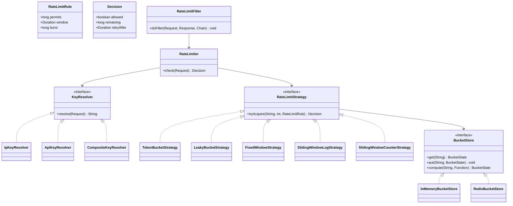

# Design Rate Limiter (LLD)

**Date:** 2026-05-02 | **Updated:** 2026-05-02
**Tags:** `low-level-design` `case-study` `developer-tools` `rate-limiting` `middleware`

## Summary

A rate limiter answers the question *"can this caller make this request right now?"* It is a widely-reused infrastructure component: API gateways, login endpoints, third-party API clients, and per-tenant quotas all need it. At the **HLD** level we worry about distributed coordination (Redis, Cassandra, regional buckets); at the **LLD** level — the focus here — we care about the **classes** that encapsulate algorithm, key resolution, and integration as a middleware.

This case study covers:

- The five common algorithms and when each fits: **token bucket**, **leaky bucket**, **fixed window**, **sliding window log**, **sliding window counter**.
- A pluggable **`RateLimitStrategy`** interface so algorithms compose with the same key resolver and middleware.
- **Key resolver** abstraction (per IP, per API key, per tenant + endpoint).
- In-process vs distributed backends behind a `BucketStore` interface.
- Servlet/filter-style middleware integration.

## Table of Contents

1. [Requirements](#requirements)
2. [Entities and Relationships](#entities-and-relationships)
3. [Class Skeletons (Java)](#class-skeletons-java)
4. [Key Algorithms / Workflows](#key-algorithms--workflows)
5. [Patterns Used (with reason)](#patterns-used-with-reason)
6. [Concurrency Considerations](#concurrency-considerations)
7. [Trade-offs and Extensions](#trade-offs-and-extensions)
8. [Related](#related)
9. [References](#references)

## Requirements

**Functional:**

- `tryAcquire(key, permits)` returns a `Decision` (`ALLOWED` / `THROTTLED`) plus retry-after metadata.
- Multiple algorithms selectable per route or per tenant.
- Key extraction: per IP, per API key, per `(tenantId, route)`.
- Configurable rate (`N requests per window`) and burst.
- Headers exposed: `X-RateLimit-Limit`, `X-RateLimit-Remaining`, `Retry-After`.

**Non-functional:**

- O(1) per check on the hot path.
- In-process backend uses no I/O; distributed backend uses a single round-trip (e.g., Redis Lua script) at HLD.
- No double-counting under concurrency for a single key.
- Memory bounded — old keys evicted.

## Entities and Relationships



## Class Skeletons (Java)

### Domain

```java
public final class RateLimitRule {
    private final long permits;
    private final Duration window;
    private final long burst; // for token bucket; 0 means equal to permits
    // constructor + getters
}

public final class Decision {
    private final boolean allowed;
    private final long remaining;
    private final Duration retryAfter;
    // constructor + getters
    public static Decision allowed(long remaining) { /* ... */ }
    public static Decision throttled(Duration retryAfter) { /* ... */ }
}
```

### Key resolution

```java
public interface KeyResolver {
    String resolve(Request request);
}

public final class IpKeyResolver implements KeyResolver {
    public String resolve(Request r) { return "ip:" + r.remoteAddr(); }
}

public final class ApiKeyResolver implements KeyResolver {
    public String resolve(Request r) { return "api:" + r.header("X-API-Key"); }
}

public final class CompositeKeyResolver implements KeyResolver {
    private final List<KeyResolver> parts;
    public String resolve(Request r) {
        return parts.stream().map(p -> p.resolve(r))
                    .collect(Collectors.joining("|"));
    }
}
```

### Strategy interface

```java
public interface RateLimitStrategy {
    Decision tryAcquire(String key, int permits, RateLimitRule rule);
}
```

### Token bucket

```java
public final class TokenBucketStrategy implements RateLimitStrategy {

    private final BucketStore store;
    private final Clock clock;

    public Decision tryAcquire(String key, int permits, RateLimitRule rule) {
        return store.compute(key, state -> {
            long now = clock.millis();
            BucketState s = (state == null) ? BucketState.full(rule, now) : state;
            double refillPerMs = (double) rule.getPermits()
                / rule.getWindow().toMillis();
            long elapsed = now - s.lastRefillMs;
            double tokens = Math.min(rule.getBurst(),
                                     s.tokens + elapsed * refillPerMs);
            if (tokens >= permits) {
                return s.with(tokens - permits, now,
                              Decision.allowed((long) (tokens - permits)));
            }
            long retryMs = (long) Math.ceil((permits - tokens) / refillPerMs);
            return s.with(tokens, now,
                          Decision.throttled(Duration.ofMillis(retryMs)));
        }).getDecision();
    }
}
```

### Leaky bucket (queue / drip variant)

```java
public final class LeakyBucketStrategy implements RateLimitStrategy {
    // Models a fixed-rate drain. Rejects when the queue is full.
    public Decision tryAcquire(String key, int permits, RateLimitRule rule) {
        return store.compute(key, state -> {
            long now = clock.millis();
            BucketState s = (state == null) ? BucketState.empty(now) : state;
            double leakPerMs = (double) rule.getPermits()
                / rule.getWindow().toMillis();
            long elapsed = now - s.lastLeakMs;
            double level = Math.max(0, s.level - elapsed * leakPerMs);
            double capacity = rule.getBurst();
            if (level + permits <= capacity) {
                return s.with(level + permits, now, Decision.allowed(
                    (long) (capacity - level - permits)));
            }
            long retryMs = (long) Math.ceil(
                (level + permits - capacity) / leakPerMs);
            return s.with(level, now,
                          Decision.throttled(Duration.ofMillis(retryMs)));
        }).getDecision();
    }
}
```

### Fixed window

```java
public final class FixedWindowStrategy implements RateLimitStrategy {
    public Decision tryAcquire(String key, int permits, RateLimitRule rule) {
        long now = clock.millis();
        long windowStart = (now / rule.getWindow().toMillis())
                            * rule.getWindow().toMillis();
        String windowKey = key + ":" + windowStart;
        long count = store.incrementAndGet(windowKey, permits, rule.getWindow());
        if (count <= rule.getPermits()) {
            return Decision.allowed(rule.getPermits() - count);
        }
        long retry = windowStart + rule.getWindow().toMillis() - now;
        return Decision.throttled(Duration.ofMillis(retry));
    }
}
```

> The classic boundary problem: a client can spend the full quota in the last 10 ms of one window and the first 10 ms of the next, yielding 2x the limit in 20 ms.

### Sliding window log

```java
public final class SlidingWindowLogStrategy implements RateLimitStrategy {
    public Decision tryAcquire(String key, int permits, RateLimitRule rule) {
        long now = clock.millis();
        long cutoff = now - rule.getWindow().toMillis();
        return store.compute(key, state -> {
            Deque<Long> log = (state == null)
                ? new ArrayDeque<>() : state.timestamps();
            while (!log.isEmpty() && log.peekFirst() < cutoff) log.pollFirst();
            if (log.size() + permits <= rule.getPermits()) {
                for (int i = 0; i < permits; i++) log.addLast(now);
                return BucketState.ofLog(log,
                    Decision.allowed(rule.getPermits() - log.size()));
            }
            long retry = log.peekFirst() + rule.getWindow().toMillis() - now;
            return BucketState.ofLog(log,
                Decision.throttled(Duration.ofMillis(retry)));
        }).getDecision();
    }
}
```

> Most accurate, but O(N) memory per key where N is the rate.

### Sliding window counter (weighted)

```java
public final class SlidingWindowCounterStrategy implements RateLimitStrategy {
    public Decision tryAcquire(String key, int permits, RateLimitRule rule) {
        long now = clock.millis();
        long winMs = rule.getWindow().toMillis();
        long curStart = (now / winMs) * winMs;
        double overlap = 1.0 - ((double) (now - curStart) / winMs);
        long curCount = store.getCount(key + ":" + curStart);
        long prevCount = store.getCount(key + ":" + (curStart - winMs));
        double approx = curCount + prevCount * overlap;
        if (approx + permits <= rule.getPermits()) {
            store.incrementAndGet(key + ":" + curStart, permits,
                                  Duration.ofMillis(2 * winMs));
            return Decision.allowed((long) (rule.getPermits() - approx - permits));
        }
        return Decision.throttled(Duration.ofMillis(winMs - (now - curStart)));
    }
}
```

> Approximation of sliding window log with O(1) memory and very small error.

### Facade + middleware

```java
public final class RateLimiter {
    private final KeyResolver keyResolver;
    private final RateLimitStrategy strategy;
    private final RuleSelector ruleSelector;

    public Decision check(Request r) {
        String key = keyResolver.resolve(r);
        RateLimitRule rule = ruleSelector.select(r);
        return strategy.tryAcquire(key, 1, rule);
    }
}

public final class RateLimitFilter implements Filter {
    private final RateLimiter limiter;

    public void doFilter(ServletRequest req, ServletResponse res, FilterChain c)
            throws IOException, ServletException {
        Decision d = limiter.check((Request) req);
        HttpServletResponse http = (HttpServletResponse) res;
        http.setHeader("X-RateLimit-Remaining", String.valueOf(d.getRemaining()));
        if (!d.isAllowed()) {
            http.setStatus(429);
            http.setHeader("Retry-After",
                String.valueOf(d.getRetryAfter().toSeconds()));
            return;
        }
        c.doFilter(req, res);
    }
}
```

## Key Algorithms / Workflows

### Algorithm comparison

| Algorithm | Memory / key | Burst handling | Boundary error | Best for |
|---|---|---|---|---|
| Token bucket | O(1) | Yes (burst) | None | API gateways with bursty traffic |
| Leaky bucket | O(1) | Smoothing | None | Outbound throttling to a downstream of fixed capacity |
| Fixed window | O(1) | No | Up to 2x at boundary | Cheap, coarse limits where 2x bursts are tolerable |
| Sliding window log | O(N) | Exact | None | Low-rate, high-accuracy (auth, password reset) |
| Sliding window counter | O(1) | Approximate | Small (~few %) | High-throughput general-purpose |

### Distributed coordination (LLD hook, HLD detail)

The `BucketStore` interface is the seam. An in-memory implementation uses `ConcurrentHashMap.compute` for atomic read-modify-write. A Redis implementation uses a single Lua script that performs the entire algorithm server-side — see HLD for sharding / replication details.

## Patterns Used (with reason)

| Pattern | Where | Reason |
|---|---|---|
| **Strategy** | `RateLimitStrategy` | Pluggable algorithms behind one interface; pick per route. |
| **Composite** | `CompositeKeyResolver` | Combine resolvers (`tenant + route + ip`). |
| **Repository** | `BucketStore` | Hide in-memory vs Redis; both implement the same contract. |
| **Facade** | `RateLimiter` | One-line check for callers; orchestrates resolver + strategy. |
| **Decorator** | Filter wrapping the chain | Cross-cutting concern around request handling. |
| **Template Method** (optional) | Common refill skeleton in token/leaky bucket | Reduce duplication. |

## Concurrency Considerations

- **Atomic state update** is the core requirement. In-process: `ConcurrentHashMap.compute` (function-level atomicity). Distributed: a Redis Lua script or a `WATCH/MULTI/EXEC` transaction.
- **No double-decrement:** never read state, decide, then write back as separate steps from app code — that's a TOCTOU race.
- **Clock source:** use a monotonic clock for elapsed-time math; never `System.currentTimeMillis()` for diff if NTP slew matters. `System.nanoTime()` is monotonic per-JVM.
- **Eviction:** keys must be evicted (LRU, TTL on idle). For `ConcurrentHashMap`, wrap with Caffeine or a TTL-aware map; for Redis, set `EXPIRE` on each window key.
- **Hot keys:** a single key under heavy contention may serialize requests through `compute`. For very hot keys, consider sharded counters per node and reconcile.

## Trade-offs and Extensions

- **Fail-open vs fail-closed:** if the backend is unreachable, do you allow or deny? Most public APIs fail-open (don't take the site down because the limiter is sick); auth endpoints typically fail-closed.
- **Per-tenant quotas vs per-IP:** behind a CDN or NAT, IP is often a poor identifier; prefer API key.
- **Headers:** RFC 6585 defines `429 Too Many Requests`. `Retry-After` is RFC 9110. Some APIs add custom `X-RateLimit-*` headers — these are conventional, not standardized.
- **Cost-weighted requests:** allow `tryAcquire(key, n)` where `n > 1` for expensive endpoints.
- **Two-level limiting:** short window (burst) + long window (sustained). Compose strategies, take the most restrictive decision.
- **Exemption:** internal traffic may bypass; the resolver returns a sentinel key, the rule says "infinite".

## Related

- Sibling LLDs: [URL Shortener (LLD)](design-url-shortener-lld.md), [Logging Framework](design-logging-framework.md), [In-Memory File System](design-in-memory-file-system.md), [Version Control System](design-version-control-system.md), [Task Scheduler](design-task-scheduler.md).
- HLD twin: see `../../../system-design/INDEX.md` for the rate limiter system-design entry (Redis, sharded counters, regional consistency).
- Patterns: [Strategy](../../design-patterns/behavioral/), [Composite](../../design-patterns/structural/), [Decorator](../../design-patterns/structural/), [Repository](../../design-patterns/additional/).

## References

- RFC 6585 — Additional HTTP Status Codes (429 Too Many Requests).
- RFC 9110 — HTTP Semantics (`Retry-After`).
- *Site Reliability Engineering* (Beyer et al.) — chapter on managing critical state, throttling.
- Token bucket and leaky bucket: classical traffic-shaping algorithms (Tanenbaum, *Computer Networks*).
- Cloudflare engineering blog: sliding-window counters and approximation error analysis (general industry references).
